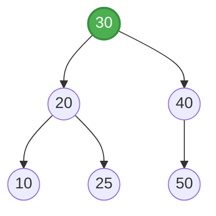

# AVL Tree

## 1. Introduction
Imagine you are organizing a massive library of books. If you simply stack every new book on top of each other in chronological order, finding a specific book becomes a tedious task—like searching through a linked list. If you organize them by title but keep pushing all new books to one side of the shelf, your shelf becomes lopsided and you'll spend more time walking to that end. An **AVL Tree** is like a self-organizing bookshelf that constantly adjusts itself every time you add or remove a book, ensuring that the books are perfectly balanced and you can find any title in the shortest possible time.

Named after its inventors Adelson-Velsky and Landis, the AVL Tree is a self-balancing Binary Search Tree (BST). In an AVL tree, the heights of the two child subtrees of any node differ by at most one. If at any time they differ by more than one, rebalancing is done to restore this property.

## 2. Why Use This Algorithm?
A standard Binary Search Tree (BST) works efficiently on average, but if data is inserted in a sorted or nearly sorted order, it degrades into a skewed tree (essentially a linked list). In this worst-case scenario, operations like search, insertion, and deletion drop to $O(N)$ time complexity.
The AVL Tree guarantees that the height of the tree remains logarithmic, $O(\log N)$. This guarantees that all major operations—search, insert, and delete—take $O(\log N)$ time in both the average and worst cases, providing predictable and fast performance.

## 3. Real-World Applications
- **Database Indexing:** Used for in-memory indexing of databases to allow rapid search, insert, and delete operations.
- **Sets and Dictionaries:** Serves as the underlying data structure for sets and maps in some standard libraries when ordering must be maintained.
- **Memory Management:** Can be utilized in memory allocation algorithms to keep track of free blocks of memory.
- **File Systems:** Used in directories for fast lookup and insertion of files.

## 4. Prerequisites
To understand the AVL tree, you should be familiar with:
- **Binary Search Tree (BST):** The basic properties of left child being smaller and right child being greater than the parent.
- **Tree Traversals:** In-order, pre-order, and post-order traversals.
- **Recursion:** Understanding how recursive calls operate, as AVL operations are inherently recursive.
- **Height of a Tree:** Knowing how to calculate the longest path from a node to a leaf.

## 5. Visualization
Consider an AVL tree as a mobile perfectly balanced. If you add a heavy weight to one side, it tilts. The AVL tree detects this "tilt" (Balance Factor) and performs a "rotation" to balance the mobile again.


If we insert 5, it becomes unbalanced at node 20. A rotation brings it back into balance.

## 6. How It Works
The core mechanism of an AVL tree is the **Balance Factor**.
`Balance Factor = Height(Left Subtree) - Height(Right Subtree)`

An AVL tree maintains the property that the Balance Factor of every node is either -1, 0, or +1.
When an insertion or deletion violates this property, the tree is rebalanced using **Rotations**.
There are four types of rotations:
1. **Right Rotation (LL Case):** Inserted into the left subtree of the left child.
2. **Left Rotation (RR Case):** Inserted into the right subtree of the right child.
3. **Left-Right Rotation (LR Case):** Inserted into the right subtree of the left child.
4. **Right-Left Rotation (RL Case):** Inserted into the left subtree of the right child.

## 7. Step-by-Step Algorithm
**Insertion:**
1. Perform a standard BST insertion to add the new node as a leaf.
2. Update the height of all ancestors of the newly inserted node.
3. Calculate the balance factor of each ancestor.
4. If the balance factor of any node becomes $> 1$ or $< -1$, identify the rotation case:
   - **LL Case:** Balance Factor $> 1$ and key $<$ left child's key. Perform a Right Rotation.
   - **RR Case:** Balance Factor $< -1$ and key $>$ right child's key. Perform a Left Rotation.
   - **LR Case:** Balance Factor $> 1$ and key $>$ left child's key. Perform a Left Rotation on the left child, then a Right Rotation on the node.
   - **RL Case:** Balance Factor $< -1$ and key $<$ right child's key. Perform a Right Rotation on the right child, then a Left Rotation on the node.

## 8. Pseudocode

```text
function getHeight(node):
    if node is null:
        return 0
    return node.height

function getBalance(node):
    if node is null:
        return 0
    return getHeight(node.left) - getHeight(node.right)

function rightRotate(y):
    x = y.left
    T2 = x.right
    x.right = y
    y.left = T2
    y.height = max(getHeight(y.left), getHeight(y.right)) + 1
    x.height = max(getHeight(x.left), getHeight(x.right)) + 1
    return x

function leftRotate(x):
    y = x.right
    T2 = y.left
    y.left = x
    x.right = T2
    x.height = max(getHeight(x.left), getHeight(x.right)) + 1
    y.height = max(getHeight(y.left), getHeight(y.right)) + 1
    return y

function insert(node, key):
    // 1. Normal BST insertion
    if node is null:
        return newNode(key)
    if key < node.key:
        node.left = insert(node.left, key)
    else if key > node.key:
        node.right = insert(node.right, key)
    else:
        return node // Duplicate keys not allowed

    // 2. Update height
    node.height = 1 + max(getHeight(node.left), getHeight(node.right))

    // 3. Get balance factor
    balance = getBalance(node)

    // 4. Rebalance
    if balance > 1 and key < node.left.key:
        return rightRotate(node)
    if balance < -1 and key > node.right.key:
        return leftRotate(node)
    if balance > 1 and key > node.left.key:
        node.left = leftRotate(node.left)
        return rightRotate(node)
    if balance < -1 and key < node.right.key:
        node.right = rightRotate(node.right)
        return leftRotate(node)

    return node
```

## 9. Code Examples

### C
```c
#include <stdio.h>
#include <stdlib.h>

struct Node {
    int key;
    struct Node *left;
    struct Node *right;
    int height;
};

int max(int a, int b) {
    return (a > b) ? a : b;
}

int height(struct Node *N) {
    if (N == NULL)
        return 0;
    return N->height;
}

struct Node* newNode(int key) {
    struct Node* node = (struct Node*)malloc(sizeof(struct Node));
    node->key = key;
    node->left = NULL;
    node->right = NULL;
    node->height = 1;
    return node;
}

struct Node *rightRotate(struct Node *y) {
    struct Node *x = y->left;
    struct Node *T2 = x->right;

    x->right = y;
    y->left = T2;

    y->height = max(height(y->left), height(y->right)) + 1;
    x->height = max(height(x->left), height(x->right)) + 1;

    return x;
}

struct Node *leftRotate(struct Node *x) {
    struct Node *y = x->right;
    struct Node *T2 = y->left;

    y->left = x;
    x->right = T2;

    x->height = max(height(x->left), height(x->right)) + 1;
    y->height = max(height(y->left), height(y->right)) + 1;

    return y;
}

int getBalance(struct Node *N) {
    if (N == NULL)
        return 0;
    return height(N->left) - height(N->right);
}

struct Node* insert(struct Node* node, int key) {
    if (node == NULL)
        return newNode(key);

    if (key < node->key)
        node->left = insert(node->left, key);
    else if (key > node->key)
        node->right = insert(node->right, key);
    else
        return node;

    node->height = 1 + max(height(node->left), height(node->right));

    int balance = getBalance(node);

    // LL Case
    if (balance > 1 && key < node->left->key)
        return rightRotate(node);

    // RR Case
    if (balance < -1 && key > node->right->key)
        return leftRotate(node);

    // LR Case
    if (balance > 1 && key > node->left->key) {
        node->left = leftRotate(node->left);
        return rightRotate(node);
    }

    // RL Case
    if (balance < -1 && key < node->right->key) {
        node->right = rightRotate(node->right);
        return leftRotate(node);
    }

    return node;
}

void preOrder(struct Node *root) {
    if (root != NULL) {
        printf("%d ", root->key);
        preOrder(root->left);
        preOrder(root->right);
    }
}

int main() {
    struct Node *root = NULL;
    root = insert(root, 10);
    root = insert(root, 20);
    root = insert(root, 30);
    root = insert(root, 40);
    root = insert(root, 50);
    root = insert(root, 25);

    printf("Preorder traversal of the constructed AVL tree is \n");
    preOrder(root);
    printf("\n");
    return 0;
}
```

### C++
```cpp
#include <iostream>
#include <algorithm>
using namespace std;

class Node {
public:
    int key;
    Node *left;
    Node *right;
    int height;
};

class AVLTree {
public:
    int height(Node *N) {
        if (N == NULL) return 0;
        return N->height;
    }

    Node* newNode(int key) {
        Node* node = new Node();
        node->key = key;
        node->left = NULL;
        node->right = NULL;
        node->height = 1;
        return node;
    }

    Node *rightRotate(Node *y) {
        Node *x = y->left;
        Node *T2 = x->right;

        x->right = y;
        y->left = T2;

        y->height = max(height(y->left), height(y->right)) + 1;
        x->height = max(height(x->left), height(x->right)) + 1;

        return x;
    }

    Node *leftRotate(Node *x) {
        Node *y = x->right;
        Node *T2 = y->left;

        y->left = x;
        x->right = T2;

        x->height = max(height(x->left), height(x->right)) + 1;
        y->height = max(height(y->left), height(y->right)) + 1;

        return y;
    }

    int getBalance(Node *N) {
        if (N == NULL) return 0;
        return height(N->left) - height(N->right);
    }

    Node* insert(Node* node, int key) {
        if (node == NULL)
            return newNode(key);

        if (key < node->key)
            node->left = insert(node->left, key);
        else if (key > node->key)
            node->right = insert(node->right, key);
        else
            return node;

        node->height = 1 + max(height(node->left), height(node->right));
        int balance = getBalance(node);

        if (balance > 1 && key < node->left->key)
            return rightRotate(node);

        if (balance < -1 && key > node->right->key)
            return leftRotate(node);

        if (balance > 1 && key > node->left->key) {
            node->left = leftRotate(node->left);
            return rightRotate(node);
        }

        if (balance < -1 && key < node->right->key) {
            node->right = rightRotate(node->right);
            return leftRotate(node);
        }

        return node;
    }

    void preOrder(Node *root) {
        if (root != NULL) {
            cout << root->key << " ";
            preOrder(root->left);
            preOrder(root->right);
        }
    }
};

int main() {
    AVLTree tree;
    Node *root = NULL;

    root = tree.insert(root, 10);
    root = tree.insert(root, 20);
    root = tree.insert(root, 30);
    root = tree.insert(root, 40);
    root = tree.insert(root, 50);
    root = tree.insert(root, 25);

    cout << "Preorder traversal of the constructed AVL tree is \n";
    tree.preOrder(root);
    cout << endl;
    return 0;
}
```

### Java
```java
class Node {
    int key, height;
    Node left, right;

    Node(int d) {
        key = d;
        height = 1;
    }
}

public class AVLTree {
    Node root;

    int height(Node N) {
        if (N == null) return 0;
        return N.height;
    }

    int max(int a, int b) {
        return (a > b) ? a : b;
    }

    Node rightRotate(Node y) {
        Node x = y.left;
        Node T2 = x.right;

        x.right = y;
        y.left = T2;

        y.height = max(height(y.left), height(y.right)) + 1;
        x.height = max(height(x.left), height(x.right)) + 1;

        return x;
    }

    Node leftRotate(Node x) {
        Node y = x.right;
        Node T2 = y.left;

        y.left = x;
        x.right = T2;

        x.height = max(height(x.left), height(x.right)) + 1;
        y.height = max(height(y.left), height(y.right)) + 1;

        return y;
    }

    int getBalance(Node N) {
        if (N == null) return 0;
        return height(N.left) - height(N.right);
    }

    Node insert(Node node, int key) {
        if (node == null) return new Node(key);

        if (key < node.key)
            node.left = insert(node.left, key);
        else if (key > node.key)
            node.right = insert(node.right, key);
        else
            return node;

        node.height = 1 + max(height(node.left), height(node.right));

        int balance = getBalance(node);

        if (balance > 1 && key < node.left.key)
            return rightRotate(node);

        if (balance < -1 && key > node.right.key)
            return leftRotate(node);

        if (balance > 1 && key > node.left.key) {
            node.left = leftRotate(node.left);
            return rightRotate(node);
        }

        if (balance < -1 && key < node.right.key) {
            node.right = rightRotate(node.right);
            return leftRotate(node);
        }

        return node;
    }

    void preOrder(Node node) {
        if (node != null) {
            System.out.print(node.key + " ");
            preOrder(node.left);
            preOrder(node.right);
        }
    }

    public static void main(String[] args) {
        AVLTree tree = new AVLTree();

        tree.root = tree.insert(tree.root, 10);
        tree.root = tree.insert(tree.root, 20);
        tree.root = tree.insert(tree.root, 30);
        tree.root = tree.insert(tree.root, 40);
        tree.root = tree.insert(tree.root, 50);
        tree.root = tree.insert(tree.root, 25);

        System.out.println("Preorder traversal of constructed tree is : ");
        tree.preOrder(tree.root);
        System.out.println();
    }
}
```

### Python
```python
class Node:
    def __init__(self, key):
        self.key = key
        self.left = None
        self.right = None
        self.height = 1

class AVLTree:
    def insert(self, root, key):
        if not root:
            return Node(key)
        
        if key < root.key:
            root.left = self.insert(root.left, key)
        elif key > root.key:
            root.right = self.insert(root.right, key)
        else:
            return root

        root.height = 1 + max(self.get_height(root.left), self.get_height(root.right))
        balance = self.get_balance(root)

        # LL
        if balance > 1 and key < root.left.key:
            return self.right_rotate(root)
        # RR
        if balance < -1 and key > root.right.key:
            return self.left_rotate(root)
        # LR
        if balance > 1 and key > root.left.key:
            root.left = self.left_rotate(root.left)
            return self.right_rotate(root)
        # RL
        if balance < -1 and key < root.right.key:
            root.right = self.right_rotate(root.right)
            return self.left_rotate(root)

        return root

    def left_rotate(self, z):
        y = z.right
        T2 = y.left
        y.left = z
        z.right = T2
        z.height = 1 + max(self.get_height(z.left), self.get_height(z.right))
        y.height = 1 + max(self.get_height(y.left), self.get_height(y.right))
        return y

    def right_rotate(self, z):
        y = z.left
        T3 = y.right
        y.right = z
        z.left = T3
        z.height = 1 + max(self.get_height(z.left), self.get_height(z.right))
        y.height = 1 + max(self.get_height(y.left), self.get_height(y.right))
        return y

    def get_height(self, root):
        if not root:
            return 0
        return root.height

    def get_balance(self, root):
        if not root:
            return 0
        return self.get_height(root.left) - self.get_height(root.right)

    def pre_order(self, root):
        if not root:
            return
        print("{0} ".format(root.key), end="")
        self.pre_order(root.left)
        self.pre_order(root.right)

if __name__ == "__main__":
    myTree = AVLTree()
    root = None

    root = myTree.insert(root, 10)
    root = myTree.insert(root, 20)
    root = myTree.insert(root, 30)
    root = myTree.insert(root, 40)
    root = myTree.insert(root, 50)
    root = myTree.insert(root, 25)

    print("Preorder traversal of the constructed AVL tree is")
    myTree.pre_order(root)
    print()
```

### JavaScript
```javascript
class Node {
    constructor(d) {
        this.key = d;
        this.height = 1;
        this.left = null;
        this.right = null;
    }
}

class AVLTree {
    height(N) {
        if (N === null) return 0;
        return N.height;
    }

    rightRotate(y) {
        let x = y.left;
        let T2 = x.right;

        x.right = y;
        y.left = T2;

        y.height = Math.max(this.height(y.left), this.height(y.right)) + 1;
        x.height = Math.max(this.height(x.left), this.height(x.right)) + 1;

        return x;
    }

    leftRotate(x) {
        let y = x.right;
        let T2 = y.left;

        y.left = x;
        x.right = T2;

        x.height = Math.max(this.height(x.left), this.height(x.right)) + 1;
        y.height = Math.max(this.height(y.left), this.height(y.right)) + 1;

        return y;
    }

    getBalance(N) {
        if (N === null) return 0;
        return this.height(N.left) - this.height(N.right);
    }

    insert(node, key) {
        if (node === null) return new Node(key);

        if (key < node.key)
            node.left = this.insert(node.left, key);
        else if (key > node.key)
            node.right = this.insert(node.right, key);
        else
            return node;

        node.height = 1 + Math.max(this.height(node.left), this.height(node.right));

        let balance = this.getBalance(node);

        if (balance > 1 && key < node.left.key)
            return this.rightRotate(node);

        if (balance < -1 && key > node.right.key)
            return this.leftRotate(node);

        if (balance > 1 && key > node.left.key) {
            node.left = this.leftRotate(node.left);
            return this.rightRotate(node);
        }

        if (balance < -1 && key < node.right.key) {
            node.right = this.rightRotate(node.right);
            return this.leftRotate(node);
        }

        return node;
    }

    preOrder(node) {
        if (node !== null) {
            process.stdout.write(node.key + " ");
            this.preOrder(node.left);
            this.preOrder(node.right);
        }
    }
}

let tree = new AVLTree();
let root = null;
root = tree.insert(root, 10);
root = tree.insert(root, 20);
root = tree.insert(root, 30);
root = tree.insert(root, 40);
root = tree.insert(root, 50);
root = tree.insert(root, 25);

console.log("Preorder traversal of constructed tree is:");
tree.preOrder(root);
console.log();
```

## 10. Code Explanation
- **Node Creation:** The node structure includes the standard `left`, `right`, and `key` pointers, plus a `height` attribute which defaults to 1 for new nodes.
- **Height and Balance Functions:** Helper functions compute the height of a subtree and calculate the balance factor (left height minus right height).
- **Rotations:**
  - `rightRotate`: Takes a node `y` which is unbalanced, promotes its left child `x` to be the new root of the subtree, and demotes `y` to be `x`'s right child.
  - `leftRotate`: Takes a node `x`, promotes its right child `y`, and demotes `x` to be `y`'s left child.
- **Insertion Logic:** Performs normal BST recursive insertion. On the way back up the recursive call stack, it updates heights and checks balance factors. Depending on the balance factor and the key value compared to the children, it executes one of the four rotation scenarios to restore balance.

## 11. Interactive Demo Description
An interactive demo for an AVL Tree should feature a visual representation of a binary tree that dynamically updates. Users would enter values to insert or delete, and the demo would step through the standard BST operation first. Then, it would highlight the calculated balance factors. If an imbalance is detected (e.g., marked in red), the UI would slowly animate the specific rotation (LL, RR, LR, RL) so the user can see exactly how the nodes are restructured and how the balance is restored.

## 12. Dry Run
Let's dry run the insertion sequence: `10, 20, 30`.

**Step 1:** Insert 10.
- Tree becomes simply node `10`.
- Height: 1. Balance: 0.

**Step 2:** Insert 20.
- 20 > 10, goes right.
- `10` -> Right Child is `20`.
- Height of 20: 1. Height of 10: 2.
- Balance of 10 = Height(L) - Height(R) = 0 - 1 = -1. (Balanced)

**Step 3:** Insert 30.
- 30 > 10, goes right. 30 > 20, goes right.
- Tree:
```text
  10
    \
    20
      \
      30
```
- Balance of 20 = 0 - 1 = -1.
- Balance of 10 = 0 - 2 = -2. Unbalanced!
- **Imbalance case:** The balance of 10 is < -1, and 30 > 10's right child (20). This is an **RR Case**.
- **Fix:** Perform Left Rotation on 10.
- After rotation:
```text
    20
   /  \
 10    30
```
- Balance of 10, 20, 30 are all 0. The tree is perfectly balanced.

## 13. Time & Space Complexity

| Case | Time Complexity | Space Complexity | Reason |
| :--- | :--- | :--- | :--- |
| **Best Case** | $O(\log N)$ | $O(\log N)$ | Always perfectly balanced, traversal is quick. |
| **Average Case** | $O(\log N)$ | $O(\log N)$ | Height is strictly maintained as $O(\log N)$. |
| **Worst Case** | $O(\log N)$ | $O(\log N)$ | Even in the worst scenario, rotations keep height logarithmic. |
| **Space** | N/A | $O(N)$ | Requires $O(N)$ space to store the nodes, plus stack space $O(\log N)$ for recursion. |

## 14. Advantages
- **Strictly Balanced:** Guarantees worst-case $O(\log N)$ time for lookups, insertions, and deletions.
- **Fast Lookups:** Due to strict balancing, read-heavy operations are very fast compared to other balanced trees like Red-Black Trees (which are more loosely balanced).

## 15. Disadvantages
- **Insertion/Deletion Overhead:** Requires frequent rotations to maintain strict balance, making write-heavy operations slightly slower.
- **Extra Storage:** Requires extra space in every node to store the height or balance factor.
- **Implementation Complexity:** More complex to implement correctly compared to standard BSTs or some other structures.

## 16. Applications
- **In-memory dictionaries and sets** requiring fast, guaranteed worst-case search times.
- **Database systems** where read operations significantly outnumber write operations.
- **Symbol tables** in compilers.

## 17. Common Mistakes
- **Incorrect Rotation Logic:** Getting the pointer assignments wrong during rotations, accidentally creating disconnected nodes or cycles.
- **Forgetting Height Updates:** Forgetting to update the height of nodes *after* a rotation is performed, or calculating height based on stale data.
- **Incorrect Balance Factor Check:** Using the wrong conditions to determine between single and double rotations (e.g., failing to distinguish RL from RR).

## 18. Interview Questions
1. **What is an AVL Tree and how does it differ from a regular BST?**
   *Answer: An AVL Tree is a self-balancing BST where the height difference between left and right subtrees is at most 1.*
2. **What are the four types of rotations in an AVL Tree?**
   *Answer: Left (RR), Right (LL), Left-Right (LR), and Right-Left (RL).*
3. **How do you identify which rotation is needed after an insertion?**
   *Answer: By examining the balance factor of the unbalanced node and the key's relation to the children.*
4. **Is an AVL Tree strictly better than a Red-Black Tree?**
   *Answer: No. AVL trees provide faster lookups due to stricter balancing, but Red-Black trees provide faster insertions/deletions due to fewer rotations.*
5. **What is the maximum height of an AVL tree with N nodes?**
   *Answer: Approximately $1.44 \log_2 N$.*
6. **Can we implement an AVL tree without storing height in the nodes?**
   *Answer: Yes, you can store the balance factor (-1, 0, 1) directly, which requires fewer bits.*
7. **Explain the RL rotation case.**
   *Answer: The tree is right-heavy, but the right child is left-heavy. We perform a right rotation on the right child, then a left rotation on the parent.*
8. **What is the time complexity of a rotation?**
   *Answer: $O(1)$, as it involves only a few pointer reassignments.*
9. **How does deletion in an AVL tree work?**
   *Answer: Perform standard BST deletion, then trace back to the root, updating heights and applying rotations if nodes become unbalanced.*
10. **Why does deletion potentially require more rotations than insertion?**
    *Answer: An insertion requires at most two rotations (one double rotation) to restore balance, while a deletion can cause a ripple effect up to the root, requiring $O(\log N)$ rotations.*

## 19. Practice Problems
- **Easy:** Implement a function to check if a given Binary Tree is an AVL tree.
- **Medium:** Implement deletion in an AVL Tree.
- **Hard:** Convert an unbalanced BST into an AVL tree in $O(N)$ time.

## 20. Related Algorithms
- **Red-Black Tree:** Another self-balancing BST, often preferred for write-heavy workloads.
- **Splay Tree:** A self-adjusting BST that moves recently accessed elements to the root.
- **B-Tree / B+ Tree:** Balanced search trees optimized for systems that read and write large blocks of data (like disks).

## 21. Summary
The AVL Tree is an elegant solution to the degradation problem of basic Binary Search Trees. By enforcing a strict balance invariant and performing localized rotations upon modifications, it guarantees $O(\log N)$ efficiency for critical operations. While slightly complex to implement and holding a minor overhead for write operations, it remains one of the fastest ordered data structures for read-heavy applications.

## 22. Quiz
**Q1: What is the allowable balance factor in an AVL tree?**
A) -2, -1, 0, 1, 2
B) -1, 0, 1
C) 0, 1
D) Any integer
*Correct Answer: B) -1, 0, 1. Explanation: An AVL tree strictly enforces that the height difference between subtrees is at most 1.*

**Q2: Which rotation is used when a node is inserted into the left subtree of the left child?**
A) Left Rotation
B) Right Rotation
C) Left-Right Rotation
D) Right-Left Rotation
*Correct Answer: B) Right Rotation. Explanation: This is an LL case, creating left-heavy imbalance, resolved by rotating right.*

**Q3: What is the worst-case time complexity for finding an element in an AVL Tree?**
A) $O(1)$
B) $O(N)$
C) $O(\log N)$
D) $O(N \log N)$
*Correct Answer: C) $O(\log N)$. Explanation: The tree is always balanced, guaranteeing logarithmic search time.*

**Q4: Which operation takes $O(1)$ time in an AVL tree?**
A) Finding the minimum element
B) Inserting a node
C) A single rotation
D) Deleting a node
*Correct Answer: C) A single rotation. Explanation: Rotations only involve changing a constant number of pointers.*

**Q5: If an AVL tree and a Red-Black tree have the same nodes, which is likely taller?**
A) AVL Tree
B) Red-Black Tree
C) They will be exactly the same height
D) Cannot be determined
*Correct Answer: B) Red-Black Tree. Explanation: Red-Black trees are more loosely balanced, allowing them to be up to twice as tall as perfectly balanced trees.*

**Q6: What additional data must be stored in each node of an AVL tree?**
A) Parent pointer
B) Balance factor or height
C) Size of subtree
D) Color (Red/Black)
*Correct Answer: B) Balance factor or height. Explanation: This is required to determine when rotations are necessary.*

**Q7: How many rotations max are needed to balance an AVL tree after a single insertion?**
A) 1
B) 2
C) $\log N$
D) $N$
*Correct Answer: B) 2. Explanation: A double rotation (like LR or RL) is the maximum required to restore balance after one insertion.*

**Q8: In an LR imbalance case, what rotations are performed?**
A) Left on parent, Right on child
B) Left on child, Right on parent
C) Right on child, Left on parent
D) Right on parent, Left on child
*Correct Answer: B) Left on child, Right on parent. Explanation: The child is rotated left to align it into an LL case, then the parent is rotated right.*

**Q9: Why are AVL trees preferred over Red-Black trees in some scenarios?**
A) They are easier to implement.
B) They use less memory.
C) They provide faster lookups due to stricter balancing.
D) They insert elements faster.
*Correct Answer: C) They provide faster lookups due to stricter balancing. Explanation: A shorter tree depth means fewer comparisons during search.*

**Q10: What is the time complexity of the AVL tree insertion operation on average?**
A) $O(1)$
B) $O(\log N)$
C) $O(N)$
D) $O(N \log N)$
*Correct Answer: B) $O(\log N)$. Explanation: Finding the insertion point takes logarithmic time, and traversing back up to fix the balance also takes at most logarithmic time.*
