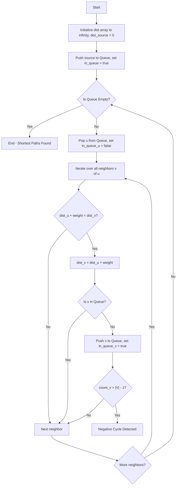

# Comprehensive Guide to SPFA Algorithm

## 1. Introduction
The Shortest Path Faster Algorithm (SPFA) is an improvement of the Bellman-Ford algorithm which computes single-source shortest paths in a weighted directed graph. It is highly efficient for graphs that contain negative weight edges and is used widely in competitive programming and network routing.

## 2. What is the SPFA Algorithm?
SPFA (Shortest Path Faster Algorithm) is a routing algorithm that computes the shortest path from a single source node to all other nodes in a graph. While its worst-case time complexity is the same as the Bellman-Ford algorithm, it performs significantly better in practice, especially on sparse graphs. It uses a queue to relax only the edges of nodes whose distance from the source has changed, making it much faster than the standard Bellman-Ford approach of relaxing all edges $|V|-1$ times.

## 3. Real-World Applications
- **Routing Protocols:** Used in networking to find the optimal path for data packets.
- **Traffic Networks:** Useful in GPS and mapping software to calculate the fastest route, taking into account traffic delays (which could theoretically be modeled with varying weights).
- **Arbitrage Detection:** In financial markets, SPFA can be used to detect negative cycles which represent arbitrage opportunities.
- **Game Development:** Pathfinding for AI characters where terrains have different traversal costs.

## 4. How It Works (Step-by-Step)
1. Initialize an array `dist` where `dist[source] = 0` and `dist[v] = \infty` for all other vertices $v$.
2. Initialize a queue `Q` and push the source node into it.
3. Keep an array `in_queue` to track which nodes are currently in the queue to avoid duplicate pushes. Set `in_queue[source] = true`.
4. While the queue is not empty:
   a. Pop a node `u` from the front of the queue. Set `in_queue[u] = false`.
   b. For each adjacent node `v` with edge weight `w` from `u`:
      i. If `dist[u] + w < dist[v]`, update `dist[v] = dist[u] + w`.
      ii. If `v` is not in the queue, push `v` to the queue and set `in_queue[v] = true`.
5. To detect negative weight cycles, maintain an array `count` that tracks how many times a node has been added to the queue. If any node is added more than $|V| - 1$ times, a negative weight cycle exists.

## 5. Algorithm Flowchart / Visual Representation


## 6. Pseudocode
```text
function SPFA(Graph, source):
    for v in Graph.Vertices:
        dist[v] = INFINITY
        inQueue[v] = false
        count[v] = 0
    
    dist[source] = 0
    Queue.enqueue(source)
    inQueue[source] = true
    
    while Queue is not empty:
        u = Queue.dequeue()
        inQueue[u] = false
        
        for each edge (u, v) with weight w:
            if dist[u] + w < dist[v]:
                dist[v] = dist[u] + w
                if not inQueue[v]:
                    Queue.enqueue(v)
                    inQueue[v] = true
                    count[v] = count[v] + 1
                    if count[v] > |V| - 1:
                        return "Negative Cycle Detected"
                        
    return dist
```

## 7. Time and Space Complexity Analysis
- **Time Complexity:**
  - **Average Case:** $O(|E|)$ - On average, each node is pushed to the queue a small constant number of times.
  - **Worst Case:** $O(|V| \times |E|)$ - This happens when the graph has a structure that causes the algorithm to perform just like Bellman-Ford (e.g., a highly dense graph or a specially constructed graph that forces many relaxations).
- **Space Complexity:** $O(|V|)$ - For the `dist`, `inQueue`, `count` arrays, and the queue itself.

## 8. Advantages and Disadvantages
### Advantages
- Very fast in practice for sparse graphs, often outperforming Bellman-Ford and sometimes competitive with Dijkstra's algorithm.
- Can handle negative weight edges, unlike Dijkstra's algorithm.
- Capable of detecting negative weight cycles.
- Simple to implement using standard queue structures.

### Disadvantages
- Worst-case time complexity is $O(|V| \times |E|)$, making it vulnerable to worst-case scenarios (often called "SPFA killers" in competitive programming).
- Slower than Dijkstra's algorithm on graphs with non-negative weights because Dijkstra guarantees that each node is processed optimally.

## 9. Comparison with other similar algorithms (Dijkstra, Bellman-Ford)
| Feature | SPFA | Dijkstra | Bellman-Ford |
| :--- | :--- | :--- | :--- |
| **Negative Edges** | Yes | No | Yes |
| **Negative Cycle Detection** | Yes | No | Yes |
| **Average Time** | $O(E)$ | $O(E + V \log V)$ | $O(V \times E)$ |
| **Worst Time** | $O(V \times E)$ | $O(E + V \log V)$ | $O(V \times E)$ |
| **Best Use Case** | Sparse graphs with negative edges | Graphs with non-negative edges | Small graphs with negative edges |

## 10. Code Implementation in C
```c
#include <stdio.h>
#include <stdlib.h>
#include <stdbool.h>
#include <limits.h>

#define MAX_VERTICES 1000

typedef struct Edge {
    int to;
    int weight;
    struct Edge* next;
} Edge;

Edge* adj[MAX_VERTICES];
int dist[MAX_VERTICES];
bool inQueue[MAX_VERTICES];
int count[MAX_VERTICES];

void addEdge(int u, int v, int w) {
    Edge* newEdge = (Edge*)malloc(sizeof(Edge));
    newEdge->to = v;
    newEdge->weight = w;
    newEdge->next = adj[u];
    adj[u] = newEdge;
}

bool spfa(int V, int source) {
    for (int i = 0; i < V; i++) {
        dist[i] = INT_MAX;
        inQueue[i] = false;
        count[i] = 0;
    }
    
    int queue[MAX_VERTICES * MAX_VERTICES]; // Simple circular queue could be better, but this is safe for demonstration
    int front = 0, rear = 0;
    
    dist[source] = 0;
    queue[rear++] = source;
    inQueue[source] = true;
    
    while (front < rear) {
        int u = queue[front++];
        inQueue[u] = false;
        
        Edge* curr = adj[u];
        while (curr != NULL) {
            int v = curr->to;
            int w = curr->weight;
            
            if (dist[u] != INT_MAX && dist[u] + w < dist[v]) {
                dist[v] = dist[u] + w;
                
                if (!inQueue[v]) {
                    queue[rear++] = v;
                    inQueue[v] = true;
                    count[v]++;
                    
                    if (count[v] >= V) {
                        return false; // Negative cycle detected
                    }
                }
            }
            curr = curr->next;
        }
    }
    return true;
}

int main() {
    int V = 5;
    for (int i = 0; i < V; i++) adj[i] = NULL;
    
    addEdge(0, 1, 6);
    addEdge(0, 3, 7);
    addEdge(1, 2, 5);
    addEdge(1, 3, 8);
    addEdge(1, 4, -4);
    addEdge(2, 1, -2);
    addEdge(3, 2, -3);
    addEdge(3, 4, 9);
    addEdge(4, 0, 2);
    addEdge(4, 2, 7);
    
    if (spfa(V, 0)) {
        printf("Vertex Distances from Source\\n");
        for (int i = 0; i < V; i++) {
            printf("%d \\t\\t %d\\n", i, dist[i]);
        }
    } else {
        printf("Graph contains a negative weight cycle\\n");
    }
    
    return 0;
}
```

## 11. Code Implementation in C++
```cpp
#include <iostream>
#include <vector>
#include <queue>
#include <climits>

using namespace std;

struct Edge {
    int to, weight;
};

bool spfa(int V, vector<vector<Edge>>& adj, int source, vector<int>& dist) {
    dist.assign(V, INT_MAX);
    vector<bool> inQueue(V, false);
    vector<int> count(V, 0);
    queue<int> q;

    dist[source] = 0;
    q.push(source);
    inQueue[source] = true;

    while (!q.empty()) {
        int u = q.front();
        q.pop();
        inQueue[u] = false;

        for (auto& edge : adj[u]) {
            int v = edge.to;
            int w = edge.weight;

            if (dist[u] != INT_MAX && dist[u] + w < dist[v]) {
                dist[v] = dist[u] + w;
                if (!inQueue[v]) {
                    q.push(v);
                    inQueue[v] = true;
                    count[v]++;
                    if (count[v] >= V) {
                        return false; // Negative cycle detected
                    }
                }
            }
        }
    }
    return true;
}

int main() {
    int V = 5;
    vector<vector<Edge>> adj(V);
    
    adj[0].push_back({1, 6});
    adj[0].push_back({3, 7});
    adj[1].push_back({2, 5});
    adj[1].push_back({3, 8});
    adj[1].push_back({4, -4});
    adj[2].push_back({1, -2});
    adj[3].push_back({2, -3});
    adj[3].push_back({4, 9});
    adj[4].push_back({0, 2});
    adj[4].push_back({2, 7});

    vector<int> dist;
    if (spfa(V, adj, 0, dist)) {
        cout << "Vertex Distances from Source\\n";
        for (int i = 0; i < V; i++) {
            cout << i << " \\t\\t " << dist[i] << "\\n";
        }
    } else {
        cout << "Graph contains a negative weight cycle\\n";
    }

    return 0;
}
```

## 12. Code Implementation in Java
```java
import java.util.*;

public class SPFA {
    static class Edge {
        int to, weight;
        public Edge(int to, int weight) {
            this.to = to;
            this.weight = weight;
        }
    }

    public static boolean spfa(int V, List<List<Edge>> adj, int source, int[] dist) {
        Arrays.fill(dist, Integer.MAX_VALUE);
        boolean[] inQueue = new boolean[V];
        int[] count = new int[V];
        Queue<Integer> queue = new LinkedList<>();

        dist[source] = 0;
        queue.add(source);
        inQueue[source] = true;

        while (!queue.isEmpty()) {
            int u = queue.poll();
            inQueue[u] = false;

            for (Edge edge : adj.get(u)) {
                int v = edge.to;
                int w = edge.weight;

                if (dist[u] != Integer.MAX_VALUE && dist[u] + w < dist[v]) {
                    dist[v] = dist[u] + w;
                    if (!inQueue[v]) {
                        queue.add(v);
                        inQueue[v] = true;
                        count[v]++;
                        if (count[v] >= V) {
                            return false; // Negative cycle detected
                        }
                    }
                }
            }
        }
        return true;
    }

    public static void main(String[] args) {
        int V = 5;
        List<List<Edge>> adj = new ArrayList<>();
        for (int i = 0; i < V; i++) {
            adj.add(new ArrayList<>());
        }

        adj.get(0).add(new Edge(1, 6));
        adj.get(0).add(new Edge(3, 7));
        adj.get(1).add(new Edge(2, 5));
        adj.get(1).add(new Edge(3, 8));
        adj.get(1).add(new Edge(4, -4));
        adj.get(2).add(new Edge(1, -2));
        adj.get(3).add(new Edge(2, -3));
        adj.get(3).add(new Edge(4, 9));
        adj.get(4).add(new Edge(0, 2));
        adj.get(4).add(new Edge(2, 7));

        int[] dist = new int[V];
        if (spfa(V, adj, 0, dist)) {
            System.out.println("Vertex Distances from Source");
            for (int i = 0; i < V; i++) {
                System.out.println(i + " \\t\\t " + dist[i]);
            }
        } else {
            System.out.println("Graph contains a negative weight cycle");
        }
    }
}
```

## 13. Code Implementation in Python
```python
from collections import deque

def spfa(V, adj, source):
    dist = [float('inf')] * V
    in_queue = [False] * V
    count = [0] * V
    queue = deque([source])
    
    dist[source] = 0
    in_queue[source] = True
    
    while queue:
        u = queue.popleft()
        in_queue[u] = False
        
        for v, w in adj[u]:
            if dist[u] != float('inf') and dist[u] + w < dist[v]:
                dist[v] = dist[u] + w
                if not in_queue[v]:
                    queue.append(v)
                    in_queue[v] = True
                    count[v] += 1
                    if count[v] >= V:
                        return False, []  # Negative cycle detected
                        
    return True, dist

if __name__ == "__main__":
    V = 5
    adj = {i: [] for i in range(V)}
    
    adj[0].extend([(1, 6), (3, 7)])
    adj[1].extend([(2, 5), (3, 8), (4, -4)])
    adj[2].append((1, -2))
    adj[3].extend([(2, -3), (4, 9)])
    adj[4].extend([(0, 2), (2, 7)])
    
    no_cycle, dist = spfa(V, adj, 0)
    
    if no_cycle:
        print("Vertex Distances from Source")
        for i in range(V):
            print(f"{i} \\t\\t {dist[i]}")
    else:
        print("Graph contains a negative weight cycle")
```

## 14. Code Implementation in JavaScript
```javascript
class Edge {
    constructor(to, weight) {
        this.to = to;
        this.weight = weight;
    }
}

function spfa(V, adj, source) {
    let dist = new Array(V).fill(Infinity);
    let inQueue = new Array(V).fill(false);
    let count = new Array(V).fill(0);
    let queue = [];
    
    dist[source] = 0;
    queue.push(source);
    inQueue[source] = true;
    
    while (queue.length > 0) {
        let u = queue.shift();
        inQueue[u] = false;
        
        for (let edge of adj[u]) {
            let v = edge.to;
            let w = edge.weight;
            
            if (dist[u] !== Infinity && dist[u] + w < dist[v]) {
                dist[v] = dist[u] + w;
                
                if (!inQueue[v]) {
                    queue.push(v);
                    inQueue[v] = true;
                    count[v]++;
                    
                    if (count[v] >= V) {
                        return { noCycle: false, dist: [] }; // Negative cycle
                    }
                }
            }
        }
    }
    
    return { noCycle: true, dist: dist };
}

// Example usage
const V = 5;
let adj = Array.from({ length: V }, () => []);

adj[0].push(new Edge(1, 6), new Edge(3, 7));
adj[1].push(new Edge(2, 5), new Edge(3, 8), new Edge(4, -4));
adj[2].push(new Edge(1, -2));
adj[3].push(new Edge(2, -3), new Edge(4, 9));
adj[4].push(new Edge(0, 2), new Edge(2, 7));

let result = spfa(V, adj, 0);

if (result.noCycle) {
    console.log("Vertex Distances from Source");
    for (let i = 0; i < V; i++) {
        console.log(`${i} \\t\\t ${result.dist[i]}`);
    }
} else {
    console.log("Graph contains a negative weight cycle");
}
```

## 15. Dry Run / Execution Trace
Let's trace a small graph with 3 vertices: 0, 1, 2.
Edges: `0 -> 1` (weight 2), `1 -> 2` (weight 3), `0 -> 2` (weight 6)
Source: `0`

**Initialization:**
`dist = [0, \infty, \infty]`
`in_queue = [True, False, False]`
`queue = [0]`

**Iteration 1:**
- Pop `0`. `in_queue = [False, False, False]`.
- Neighbors of `0`: `1` (weight 2), `2` (weight 6)
- Update `dist[1] = 0 + 2 = 2`. Push `1`. `in_queue[1] = True`.
- Update `dist[2] = 0 + 6 = 6`. Push `2`. `in_queue[2] = True`.
- `queue = [1, 2]`

**Iteration 2:**
- Pop `1`. `in_queue[1] = False`.
- Neighbors of `1`: `2` (weight 3)
- Update `dist[2] = min(6, 2 + 3) = 5`. Since `2` is already in queue (`in_queue[2] = True`), do not push.
- `queue = [2]`

**Iteration 3:**
- Pop `2`. `in_queue[2] = False`.
- Neighbors of `2`: none.
- `queue = []`

**End:**
`dist = [0, 2, 5]`. Accurate shortest path found.

## 16. Edge Cases and Handling (Negative weight cycles)
### Negative Weight Cycles
The standard SPFA handles negative weight edges perfectly. However, if there is a negative weight cycle reachable from the source, the shortest path is undefined (it can decrease infinitely). 
**Handling:** SPFA detects this using a `count` array. Each time a node enters the queue, its count increments. If a node's count reaches $|V|$ (the number of vertices), a negative cycle is confirmed, and the algorithm aborts or returns a flag.

### Disconnected Components
If a node is unreachable from the source, its distance remains `INFINITY`. The algorithm won't process unreachable nodes, maintaining efficiency.

### Parallel Edges and Self Loops
SPFA processes all edges provided. For parallel edges, it simply relaxes the node multiple times if needed. Self-loops with non-negative weights are ignored, while negative self-loops trigger the negative cycle detection.

## 17. Common Pitfalls and Mistakes
1. **Forgetting `inQueue` array:** Without `inQueue`, a node might be pushed to the queue multiple times consecutively, blowing up the queue size and time complexity.
2. **Incorrect Cycle Detection:** Cycle detection must check if `count[v] >= |V|`, not just checking an arbitrary high number.
3. **Using SPFA when Dijkstra is better:** On graphs with strictly non-negative edges, Dijkstra is robust and cannot be forced into $O(V \times E)$ time. Using SPFA in such competitive programming scenarios often leads to Time Limit Exceeded (TLE) because testers construct "SPFA killers."

## 18. Optimization Techniques (SLF, LLL)
Though SPFA's worst-case remains $O(VE)$, heuristics can improve average performance:
1. **Small Label First (SLF):**
   When pushing a node $v$ to the queue, compare `dist[v]` with the distance of the front node `u`. If `dist[v] < dist[u]`, push $v$ to the front (using a deque); else, push to the back.
2. **Large Label Last (LLL):**
   Calculate the average distance `avg` of nodes in the queue. Before popping, if the front node's distance is greater than `avg`, move it to the back. Repeat until a node with $\le avg$ is at the front.

## 19. Related Algorithms
- **Bellman-Ford Algorithm:** The predecessor to SPFA, simpler but slower $O(VE)$ on average.
- **Dijkstra's Algorithm:** Faster $O(E \log V)$ for non-negative weights but fails with negative weights.
- **Floyd-Warshall Algorithm:** Computes all-pairs shortest path in $O(V^3)$.
- **A* Search Algorithm:** Uses heuristics for faster single-pair shortest path.

## 20. Practice Problems / LeetCode Recommendations
- **LeetCode 743:** Network Delay Time (Can be solved with SPFA, Dijkstra, or Bellman-Ford)
- **LeetCode 787:** Cheapest Flights Within K Stops (Modified SPFA / Bellman-Ford)
- **HackerRank:** Shortest Reach 2
- **CSES Problem Set:** Shortest Routes I and II
- **Codeforces:** Any shortest path problem involving negative weights but guaranteed no negative cycles (or asking to detect one).

## 21. Conclusion
The SPFA algorithm is an elegant queue-based optimization over the Bellman-Ford algorithm. It balances simplicity, the ability to handle negative weights, and excellent average-case performance. However, developers and competitive programmers must be cautious of its worst-case complexity and utilize it primarily when graphs are sparse or negative edges are present. For strictly positive edge graphs, Dijkstra's algorithm remains the gold standard.

## 22. Quiz
**Q1. What data structure is fundamentally used by SPFA to manage vertices?**
a) Stack
b) Priority Queue
c) Queue / Deque
d) Linked List
*Answer: c*

**Q2. What is the worst-case time complexity of SPFA?**
a) $O(V + E)$
b) $O(E \log V)$
c) $O(V \times E)$
d) $O(V^2)$
*Answer: c*

**Q3. How does SPFA detect a negative weight cycle?**
a) By checking if the queue becomes empty prematurely.
b) By tracking the number of times a vertex is pushed into the queue (if $\ge V$, there's a cycle).
c) By tracking the shortest path tree depth.
d) SPFA cannot detect negative weight cycles.
*Answer: b*

**Q4. What does the SLF optimization stand for?**
a) Shortest Length First
b) Small Label First
c) Single Level Flow
d) Standard Line First
*Answer: b*

**Q5. When should you definitely prefer Dijkstra over SPFA?**
a) When the graph has negative edges.
b) When you need to detect negative cycles.
c) When the graph has strictly non-negative edges and you want guaranteed $O(E \log V)$ performance.
d) When the graph is extremely dense and has negative weights.
*Answer: c*
