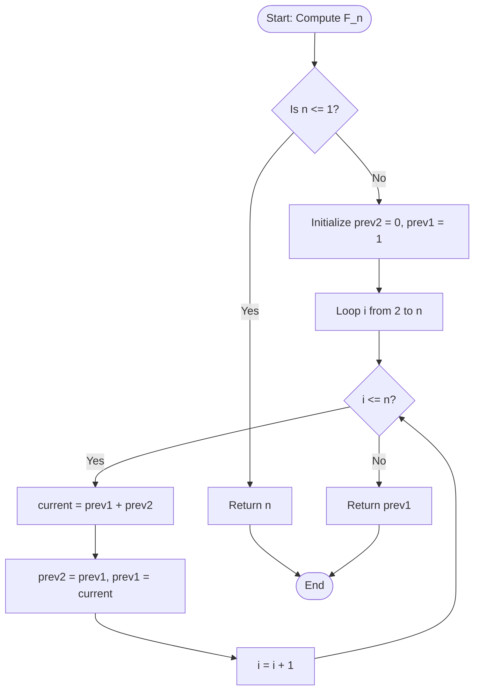

# Fibonacci DP (Dynamic Programming)

## 1. Introduction

The Fibonacci Sequence is one of the most famous number sequences in mathematics and computer science. Defined by the recurrence relation $F(n) = F(n-1) + F(n-2)$ with base cases $F(0) = 0$ and $F(1) = 1$, the sequence begins: $0, 1, 1, 2, 3, 5, 8, 13, 21, 34, \dots$

While calculating Fibonacci numbers recursively is straightforward, naive recursion performs a huge amount of redundant computation, leading to an exponential time complexity of $O(2^n)$. **Fibonacci DP** uses Dynamic Programming techniques—specifically **Memoization (Top-Down)** or **Tabulation (Bottom-Up)**—to solve overlapping subproblems once and store their results. This optimizes the time complexity from exponential $O(2^n)$ down to linear $O(n)$, or even logarithmic $O(\log n)$ using Matrix Exponentiation.

As the foundational problem for learning Dynamic Programming, mastering Fibonacci DP builds intuition for overlapping subproblems and optimal substructure—the two core properties required for any DP problem.

---

## 2. Why Use This Algorithm?

Naive recursive calculation of $F(n)$ constructs a recursion tree where subproblems grow exponentially. For instance, computing $F(5)$ requires computing $F(3)$ twice and $F(2)$ three times. For $F(50)$, naive recursion performs over 1 trillion operations, taking minutes or hours to complete, whereas Fibonacci DP completes in a fraction of a microsecond.

**Benefits:**
- **Drastic Performance Boost:** Reduces time complexity from $O(2^n)$ to $O(n)$ or $O(\log n)$.
- **Zero Redundant Work:** Stores previously calculated values so every state is evaluated exactly once.
- **Space Optimization:** Allows reducing memory footprint from $O(n)$ array allocation down to $O(1)$ auxiliary space using iterative state variables.
- **Foundational Learning:** Teaches key DP paradigms (Top-Down vs Bottom-Up) applicable to complex problems like Knapsack, Edit Distance, and Path Counting.

---

## 3. Real-World Applications

- **Financial Modeling & Technical Analysis:** Fibonacci retracement levels and fan lines are widely used in stock market technical analysis to predict support and resistance levels.
- **Computer Graphics & Procedural Generation:** Used in generating natural patterns like spiral seashells, pinecones, sunflower seed arrangements, and fractal trees.
- **Planning & Agile Estimation:** Fibonacci numbers ($1, 2, 3, 5, 8, 13, 21$) are used in Scrum story point estimation to reflect increasing uncertainty in task size.
- **Data Structures & Optimization:** Forms the core theory behind Fibonacci Heaps, which yield optimal amortized times for Dijkstra's and Prim's algorithms.
- **Distributed System Scaling:** Used in exponential backoff jitter schedules and load balancing retry algorithms.

---

## 4. Prerequisites

Before diving into Fibonacci DP, you should be familiar with:
- **Recursion:** Functions calling themselves and understanding call stacks.
- **Basic Array Operations:** Indexing, iteration, and space allocation.
- **Time & Space Complexity Analysis:** Understanding $O(2^n)$ vs $O(n)$ vs $O(1)$.
- **Basic Concept of Caching / Memoization:** Storing lookup results to avoid recomputation.

---

## 5. Visualization

### Naive Recursive Call Tree vs. DP Lookup

```
Naive Recursion for F(4) [Exponential O(2^n)]:

                    F(4)
                 /        \
             F(3)          F(2)   <-- Redundant computation of F(2)
            /    \        /    \
        F(2)     F(1)  F(1)   F(0)
       /    \
    F(1)    F(0)

----------------------------------------------------------------------

Dynamic Programming (Bottom-Up Tabulation) [Linear O(n)]:

Index:    [0]  [1]  [2]  [3]  [4]  [5]  ... [n]
Value:     0    1    1    2    3    5   ... F(n)
          ^    ^    ^
          |----+---> F(2) = F(0) + F(1)
               |----+---> F(3) = F(1) + F(2)
                    |----+---> F(4) = F(2) + F(3)
```

### Mermaid Flowchart: Bottom-Up Tabulation



---

## 6. How It Works

Dynamic Programming solves problems by combining solutions to subproblems. Fibonacci DP exhibits both defining DP characteristics:

1. **Overlapping Subproblems:** To compute $F(n)$, we need $F(n-1)$ and $F(n-2)$. To compute $F(n-1)$, we need $F(n-2)$ and $F(n-3)$. The subproblem $F(n-2)$ overlaps across multiple branches.
2. **Optimal Substructure:** The optimal/exact solution to $F(n)$ is directly constructed by adding the exact solutions of $F(n-1)$ and $F(n-2)$.

### Approaches:

1. **Top-Down (Memoization):**
   - Retains the recursive structure.
   - Uses an array or hash map `memo` initialized to -1.
   - Before executing recursive calls, checks if `memo[n]` is already computed. If yes, returns it immediately. Otherwise, computes $F(n)$, saves it in `memo[n]`, and returns it.

2. **Bottom-Up (Tabulation):**
   - Eliminates recursion entirely.
   - Creates a table `dp` of size $n+1$.
   - Fills base values `dp[0] = 0` and `dp[1] = 1`.
   - Iterates from $2$ to $n$, filling `dp[i] = dp[i-1] + dp[i-2]`.

3. **Space-Optimized Tabulation:**
   - Observes that computing `dp[i]` only requires the immediately preceding two values `dp[i-1]` and `dp[i-2]`.
   - Replaces the `dp` array with two variables `prev2` and `prev1`, reducing auxiliary space from $O(n)$ to $O(1)$.

---

## 7. Step-by-Step Algorithm

### Space-Optimized Bottom-Up Approach:
1. Handle base cases: If $n = 0$, return $0$. If $n = 1$, return $1$.
2. Initialize two variables: `prev2 = 0` (representing $F(0)$) and `prev1 = 1` (representing $F(1)$).
3. Loop variable `i` from $2$ up to $n$:
   a. Calculate `curr = prev1 + prev2`.
   b. Update `prev2 = prev1`.
   c. Update `prev1 = curr`.
4. After the loop terminates, `prev1` contains $F(n)$. Return `prev1`.

---

## 8. Pseudocode

### Approach 1: Top-Down (Memoization)
```text
function fibMemo(n, memo):
    if n <= 1:
        return n
    if memo[n] != -1:
        return memo[n]
    memo[n] = fibMemo(n - 1, memo) + fibMemo(n - 2, memo)
    return memo[n]

function fibonacci(n):
    memo = array of size (n + 1) filled with -1
    return fibMemo(n, memo)
```

### Approach 2: Bottom-Up (Space-Optimized Tabulation)
```text
function fibonacciOptimized(n):
    if n <= 1:
        return n
    prev2 = 0
    prev1 = 1
    for i from 2 to n:
        curr = prev1 + prev2
        prev2 = prev1
        prev1 = curr
    return prev1
```

---

## 9. Code Examples

### C
```c
#include <stdio.h>
#include <stdlib.h>

// Approach 1: Bottom-Up Space-Optimized O(n) Time, O(1) Space
long long fibonacci_space_optimized(int n) {
    if (n <= 1) return n;
    long long prev2 = 0;
    long long prev1 = 1;
    long long curr = 0;
    
    for (int i = 2; i <= n; i++) {
        curr = prev1 + prev2;
        prev2 = prev1;
        prev1 = curr;
    }
    return prev1;
}

// Approach 2: Top-Down Memoization O(n) Time, O(n) Space
long long fib_memo_helper(int n, long long* memo) {
    if (n <= 1) return n;
    if (memo[n] != -1) return memo[n];
    memo[n] = fib_memo_helper(n - 1, memo) + fib_memo_helper(n - 2, memo);
    return memo[n];
}

long long fibonacci_memoization(int n) {
    if (n <= 1) return n;
    long long* memo = (long long*)malloc((n + 1) * sizeof(long long));
    for (int i = 0; i <= n; i++) memo[i] = -1;
    long long result = fib_memo_helper(n, memo);
    free(memo);
    return result;
}

int main() {
    int n = 10;
    printf("Fibonacci(%d) [Space Optimized]: %lld\n", n, fibonacci_space_optimized(n));
    printf("Fibonacci(%d) [Memoization]: %lld\n", n, fibonacci_memoization(n));
    return 0;
}
```

### C++
```cpp
#include <iostream>
#include <vector>

using namespace std;

class FibonacciDP {
public:
    // Bottom-Up Space-Optimized O(n) Time, O(1) Space
    static long long fibonacciSpaceOptimized(int n) {
        if (n <= 1) return n;
        long long prev2 = 0, prev1 = 1;
        for (int i = 2; i <= n; ++i) {
            long long curr = prev1 + prev2;
            prev2 = prev1;
            prev1 = curr;
        }
        return prev1;
    }

    // Top-Down Memoization O(n) Time, O(n) Space
    static long long fibonacciMemoization(int n) {
        vector<long long> memo(n + 1, -1);
        return memoHelper(n, memo);
    }

private:
    static long long memoHelper(int n, vector<long long>& memo) {
        if (n <= 1) return n;
        if (memo[n] != -1) return memo[n];
        return memo[n] = memoHelper(n - 1, memo) + memoHelper(n - 2, memo);
    }
};

int main() {
    int n = 10;
    cout << "Fibonacci(" << n << ") [Space Optimized]: " 
         << FibonacciDP::fibonacciSpaceOptimized(n) << endl;
    cout << "Fibonacci(" << n << ") [Memoization]: " 
         << FibonacciDP::fibonacciMemoization(n) << endl;
    return 0;
}
```

### Java
```java
import java.util.Arrays;

public class FibonacciDP {

    // Bottom-Up Space-Optimized: O(n) Time, O(1) Space
    public static long fibonacciSpaceOptimized(int n) {
        if (n <= 1) return n;
        long prev2 = 0;
        long prev1 = 1;
        for (int i = 2; i <= n; i++) {
            long curr = prev1 + prev2;
            prev2 = prev1;
            prev1 = curr;
        }
        return prev1;
    }

    // Top-Down Memoization: O(n) Time, O(n) Space
    public static long fibonacciMemoization(int n) {
        long[] memo = new long[n + 1];
        Arrays.fill(memo, -1);
        return memoHelper(n, memo);
    }

    private static long memoHelper(int n, long[] memo) {
        if (n <= 1) return n;
        if (memo[n] != -1) return memo[n];
        memo[n] = memoHelper(n - 1, memo) + memoHelper(n - 2, memo);
        return memo[n];
    }

    public static void main(String[] args) {
        int n = 10;
        System.out.println("Fibonacci(" + n + ") [Space Optimized]: " + fibonacciSpaceOptimized(n));
        System.out.println("Fibonacci(" + n + ") [Memoization]: " + fibonacciMemoization(n));
    }
}
```

### Python
```python
def fibonacci_space_optimized(n: int) -> int:
    """Computes Fibonacci number using O(n) time and O(1) space."""
    if n <= 1:
        return n
    prev2, prev1 = 0, 1
    for _ in range(2, n + 1):
        prev2, prev1 = prev1, prev2 + prev1
    return prev1

def fibonacci_memoization(n: int) -> int:
    """Computes Fibonacci number using top-down recursion with memoization."""
    memo = {}

    def helper(k: int) -> int:
        if k <= 1:
            return k
        if k in memo:
            return memo[k]
        memo[k] = helper(k - 1) + helper(k - 2)
        return memo[k]

    return helper(n)

if __name__ == "__main__":
    n = 10
    print(f"Fibonacci({n}) [Space Optimized]: {fibonacci_space_optimized(n)}")
    print(f"Fibonacci({n}) [Memoization]: {fibonacci_memoization(n)}")
```

### JavaScript
```javascript
/**
 * Bottom-Up Space-Optimized Fibonacci DP
 * @param {number} n
 * @returns {number}
 */
function fibonacciSpaceOptimized(n) {
    if (n <= 1) return n;
    let prev2 = 0;
    let prev1 = 1;
    for (let i = 2; i <= n; i++) {
        const curr = prev1 + prev2;
        prev2 = prev1;
        prev1 = curr;
    }
    return prev1;
}

/**
 * Top-Down Memoization Fibonacci DP
 * @param {number} n
 * @returns {number}
 */
function fibonacciMemoization(n) {
    const memo = new Map();

    function helper(k) {
        if (k <= 1) return k;
        if (memo.has(k)) return memo.get(k);
        const result = helper(k - 1) + helper(k - 2);
        memo.set(k, result);
        return result;
    }

    return helper(n);
}

// Execution and testing
const n = 10;
console.log(`Fibonacci(${n}) [Space Optimized]:`, fibonacciSpaceOptimized(n));
console.log(`Fibonacci(${n}) [Memoization]:`, fibonacciMemoization(n));
```

---

## 10. Code Explanation

1. **Base Case Handling:** In all implementations, inputs `n <= 1` immediately return `n` (since $F(0) = 0$ and $F(1) = 1$). This halts invalid memory accesses or negative loop steps.
2. **State Storage (`prev2` and `prev1`):** In the space-optimized iterative version, `prev2` represents $F(i-2)$ and `prev1` represents $F(i-1)$.
3. **State Transition (`curr = prev1 + prev2`):** At each step `i`, the next Fibonacci term is calculated by adding the two previous values.
4. **Pointer Shifting:** Before moving to iteration `i+1`, we slide our window: `prev2` receives `prev1`, and `prev1` receives `curr`.
5. **Memoization Array/Map:** In the top-down version, an array or map acts as a lookup cache. If a state has already been solved (`memo[n] != -1`), recursion stops immediately and returns the cached result.

---

## 11. Interactive Demo

An interactive Fibonacci DP visualizer features:
- An input box to set $n$ (e.g., between $0$ and $50$).
- Mode selector toggle: **Top-Down (Memoization)** vs **Bottom-Up (Tabulation)** vs **Naive Recursion**.
- A step-by-step control panel with Play, Pause, Step Forward, Step Backward, and Speed Slider controls.
- **DP Table View:** Displays an array representing DP memory state where cells change color dynamically (Unvisited: Gray, Calculating: Yellow, Memoized: Blue, Completed: Green).
- **Execution Call Stack Monitor:** Real-time visual representation of active function call frames for top-down recursive calls.
- **Call Counter Dashboard:** Compares total function calls made (e.g., for $n=20$: Naive = 21,891 calls vs DP = 21 calls).

---

## 12. Dry Run

### Sample Input: $n = 6$

We trace the **Bottom-Up Space-Optimized** approach step-by-step:

| Step | Iteration (`i`) | `prev2` ($F(i-2)$) | `prev1` ($F(i-1)$) | `curr` ($prev1 + prev2$) | Action / Variable Shift |
|:---:|:---:|:---:|:---:|:---:|:---|
| **Init** | - | 0 | 1 | - | Initialize `prev2 = 0`, `prev1 = 1` |
| **1** | $i = 2$ | 0 | 1 | $1 + 0 = 1$ | `prev2` becomes 1, `prev1` becomes 1 |
| **2** | $i = 3$ | 1 | 1 | $1 + 1 = 2$ | `prev2` becomes 1, `prev1` becomes 2 |
| **3** | $i = 4$ | 1 | 2 | $2 + 1 = 3$ | `prev2` becomes 2, `prev1` becomes 3 |
| **4** | $i = 5$ | 2 | 3 | $3 + 2 = 5$ | `prev2` becomes 3, `prev1` becomes 5 |
| **5** | $i = 6$ | 3 | 5 | $5 + 3 = 8$ | `prev2` becomes 5, `prev1` becomes 8 |
| **End** | Loop ends | 5 | **8** | - | Return `prev1` = **8** |

**Final Output:** $F(6) = 8$

---

## 13. Time & Space Complexity Analysis

| Approach | Best-Case Time | Average-Case Time | Worst-Case Time | Space Complexity | Notes |
|:---|:---:|:---:|:---:|:---:|:---|
| **Naive Recursion** | $O(2^n)$ | $O(2^n)$ | $O(2^n)$ | $O(n)$ | Call stack depth $n$; highly redundant |
| **Top-Down (Memoization)** | $O(n)$ | $O(n)$ | $O(n)$ | $O(n)$ | Stack memory $O(n)$ + memo table $O(n)$ |
| **Bottom-Up (Tabulation)** | $O(n)$ | $O(n)$ | $O(n)$ | $O(n)$ | Uses explicit DP table of size $n+1$ |
| **Space-Optimized Tabulation** | $O(n)$ | $O(n)$ | $O(n)$ | **$O(1)$** | **Optimal for standard applications** |
| **Matrix Exponentiation** | $O(\log n)$ | $O(\log n)$ | $O(\log n)$ | $O(1)$ | Solves $F(n)$ using $\begin{pmatrix} 1 & 1 \\ 1 & 0 \end{pmatrix}^n$ |

---

## 14. Advantages

- **Optimal Time Efficiency:** Reduces computation time from astronomical exponential bounds to linear $O(n)$ or logarithmic $O(\log n)$.
- **Minimal Memory Overhead:** Can be executed in $O(1)$ auxiliary space using iterative state tracking.
- **No Stack Overflow Risk:** Iterative tabulation avoids deep call stack frames, preventing stack overflow on large $n$.
- **Clear State Transitions:** Predictable and clean state transitions make debugging and verification straightforward.

---

## 15. Disadvantages

- **Integer Overflow:** Fibonacci values grow exponentially ($F(93)$ exceeds standard unsigned 64-bit integer limits `uint64_t`). BigInteger or modulo arithmetic must be used for large $n$.
- **Not Constant Time:** Simple DP is $O(n)$ in time. For extremely large values ($n > 10^9$), Matrix Exponentiation or Binet's Formula is required.

---

## 16. Variations & Advanced Optimizations

### 1. Matrix Exponentiation: $O(\log n)$ Time
Using the matrix property:
$$\begin{pmatrix} F(n+1) & F(n) \\ F(n) & F(n-1) \end{pmatrix} = \begin{pmatrix} 1 & 1 \\ 1 & 0 \end{pmatrix}^n$$
By applying binary exponentiation (repeated squaring), we can raise the matrix to the $n$-th power in $O(\log n)$ matrix multiplications.

### 2. Fast Doubling Method: $O(\log n)$ Time
Uses double-angle identities:
- $F(2k) = F(k) \times [2F(k+1) - F(k)]$
- $F(2k+1) = F(k+1)^2 + F(k)^2$

---

## 17. Common Mistakes & Pitfalls

- **Integer Overflow:** Attempting to store $F(n)$ for $n \ge 47$ in a 32-bit signed integer causes integer overflow (`int32` max is $2,147,483,647$, while $F(47) = 2,971,215,073$). Use `long long` (C/C++), `long` (Java), or BigInt (Python/JS).
- **Incorrect Base Case Handling:** Returning $0$ for $n=1$ or failing to guard against negative inputs.
- **Uninitialized Memoization Array:** Forgetting to fill the memo array with dummy values like `-1` or `0`, causing memoization to fail.
- **Off-By-One Indexing Errors:** Allocating an array of size $n$ instead of $n+1$, causing out-of-bounds access when attempting to read `dp[n]`.

---

## 18. Interview Questions

1. **What are the two core properties a problem must possess for Dynamic Programming to be applicable, and how does Fibonacci demonstrate them?**
   *Answer:* Overlapping subproblems (computing $F(n)$ reuses $F(n-2)$ multiple times) and Optimal Substructure (the exact answer $F(n)$ is constructed directly from solutions of $F(n-1)$ and $F(n-2)$).

2. **How does Memoization differ from Tabulation?**
   *Answer:* Memoization is top-down (starts at $n$, recurses down, caches results). Tabulation is bottom-up (starts at base cases $0, 1$, fills an array sequentially up to $n$).

3. **How can you optimize the space complexity of Fibonacci Tabulation from $O(n)$ to $O(1)$?**
   *Answer:* Since $F(n)$ only depends on $F(n-1)$ and $F(n-2)$, we only need to maintain two variables (`prev1`, `prev2`) updated in a loop, eliminating the array.

4. **What is the time complexity of Matrix Exponentiation for computing $F(n)$?**
   *Answer:* $O(\log n)$ time using binary exponentiation on the transformation matrix $\begin{pmatrix} 1 & 1 \\ 1 & 0 \end{pmatrix}$.

5. **Why can't we reliably use Binet's Formula $F(n) = \frac{\phi^n - \psi^n}{\sqrt{5}}$ for exact calculations in programming?**
   *Answer:* Floating-point precision issues with $\sqrt{5}$ and floating-point powers cause rounding errors for large $n$.

6. **At what value of $n$ does standard 64-bit integer overflow occur for Fibonacci numbers?**
   *Answer:* At $n = 93$ ($F(93) = 12,200,160,415,121,876,738$, which exceeds `INT64_MAX`).

7. **How would you solve the Climbing Stairs problem using Fibonacci DP?**
   *Answer:* To reach step $n$, you can come from step $n-1$ (1 step) or step $n-2$ (2 steps). Thus, $Ways(n) = Ways(n-1) + Ways(n-2)$, which exactly matches the Fibonacci recurrence with modified base cases ($W(1)=1, W(2)=2$).

8. **What is the space complexity of Top-Down Memoized Fibonacci?**
   *Answer:* $O(n)$ space ($O(n)$ for recursion call stack depth plus $O(n)$ for memoization table).

9. **Can Fibonacci DP be applied to negative indices?**
   *Answer:* Yes, using the reverse recurrence $F(n-2) = F(n) - F(n-1)$, which yields $F(-n) = (-1)^{n+1} F(n)$.

10. **How does Fibonacci DP relate to Tiling Problems (e.g., tiling a $2 \times n$ board with $2 \times 1$ dominoes)?**
    *Answer:* A $2 \times n$ board can be tiled by placing 1 vertical domino (leaving $2 \times (n-1)$) or 2 horizontal dominoes (leaving $2 \times (n-2)$). Hence $T(n) = T(n-1) + T(n-2)$, obeying the Fibonacci sequence.

---

## 19. Practice Problems

### Easy
1. **LeetCode 509:** [Fibonacci Number](https://leetcode.com/problems/fibonacci-number/) - Basic implementation of Fibonacci sequence.
2. **LeetCode 70:** [Climbing Stairs](https://leetcode.com/problems/climbing-stairs/) - Counting ways to reach top using 1 or 2 steps.
3. **GeeksforGeeks:** [N-th Tribonacci Number](https://leetcode.com/problems/n-th-tribonacci-number/) - Extended recurrence $T(n) = T(n-1) + T(n-2) + T(n-3)$.

### Medium
4. **LeetCode 198:** [House Robber](https://leetcode.com/problems/house-robber/) - DP decision tree based on adjacent non-selection recurrence.
5. **LeetCode 91:** [Decode Ways](https://leetcode.com/problems/decode-ways/) - Variations of Fibonacci-style state transitions.
6. **LeetCode 746:** [Min Cost Climbing Stairs](https://leetcode.com/problems/min-cost-climbing-stairs/) - Cost-minimizing state transition over steps.

### Hard
7. **HackerRank:** [Fibonacci Modified](https://hackerrank.com/) - Fibonacci sequence with custom non-linear recurrence $T_{i+2} = T_i + (T_{i+1})^2$ requiring arbitrary precision arithmetic.
8. **LeetCode 873:** [Length of Longest Fibonacci Subsequence](https://leetcode.com/problems/length-of-longest-fibonacci-subsequence/) - 2D DP state representation on array subsets.

---

## 20. Related Algorithms

- **Climbing Stairs DP:** Direct application of Fibonacci state transitions to path counting.
- **House Robber DP:** Modified Fibonacci recurrence with value maximization: `dp[i] = max(dp[i-1], dp[i-2] + nums[i])`.
- **Matrix Exponentiation:** General method for solving linear recurrences in $O(k^3 \log n)$ time.
- **Kadane's Algorithm:** 1D DP optimized array traversal with constant auxiliary space.

---

## 21. Summary

Fibonacci DP is the fundamental introduction to Dynamic Programming. By recognizing overlapping subproblems and optimal substructure, it transforms exponential recursive workflows $O(2^n)$ into efficient linear $O(n)$ or logarithmic $O(\log n)$ solutions. Always prefer space-optimized iterative tabulation ($O(1)$ space) for standard tasks, and use matrix exponentiation for large-scale $O(\log n)$ queries.

---

## 22. Quiz

**Question 1:** What is the time complexity of naive recursive calculation of the $n$-th Fibonacci number?
- A) $O(n)$
- B) $O(n^2)$
- C) $O(2^n)$
- D) $O(\log n)$
- **Correct Answer:** C
- **Explanation:** Naive recursion creates a binary call tree of height $n$, performing $O(2^n)$ operations.

**Question 2:** How much space does space-optimized iterative Fibonacci DP consume?
- A) $O(n)$
- B) $O(1)$
- C) $O(\log n)$
- D) $O(n^2)$
- **Correct Answer:** B
- **Explanation:** It only maintains two scalar variables (`prev1`, `prev2`), taking $O(1)$ auxiliary space.

**Question 3:** What is the time complexity of Fibonacci computation using Matrix Exponentiation?
- A) $O(1)$
- B) $O(n)$
- C) $O(\log n)$
- D) $O(n \log n)$
- **Correct Answer:** C
- **Explanation:** Repeated squaring of the $2 \times 2$ matrix computes the $n$-th power in $O(\log n)$ steps.

**Question 4:** Top-Down DP is also known as:
- A) Tabulation
- B) Memoization
- C) Greedy Selection
- D) Divide and Conquer
- **Correct Answer:** B
- **Explanation:** Top-down DP uses recursion combined with caching (memoization).

**Question 5:** Which property makes Fibonacci suitable for Dynamic Programming?
- A) Greedy Choice Property
- B) Overlapping Subproblems and Optimal Substructure
- C) Disjoint Subproblems
- D) Absence of State Transitions
- **Correct Answer:** B
- **Explanation:** Dynamic Programming requires overlapping subproblems and optimal substructure.

**Question 6:** What is the value of $F(7)$ (assuming $F(0)=0, F(1)=1$)?
- A) 8
- B) 13
- C) 21
- D) 5
- **Correct Answer:** B
- **Explanation:** The sequence is $0, 1, 1, 2, 3, 5, 8, 13$. Thus $F(7) = 13$.

**Question 7:** Why does 32-bit signed integer overflow occur when computing $F(47)$?
- A) Array indices cannot exceed 40
- B) $F(47)$ exceeds $2,147,483,647$ (`INT32_MAX`)
- C) Call stack exceeds memory
- D) Time complexity is too high
- **Correct Answer:** B
- **Explanation:** $F(47) = 2,971,215,073$, which exceeds max 32-bit signed integer capacity.

**Question 8:** In the Climbing Stairs problem (1 or 2 steps at a time), how many ways can you climb 4 stairs?
- A) 3
- B) 4
- C) 5
- D) 8
- **Correct Answer:** C
- **Explanation:** Ways for stairs [1, 2, 3, 4] are [1, 2, 3, 5]. For 4 stairs, there are 5 ways.

**Question 9:** What does the DP state transition `dp[i] = dp[i-1] + dp[i-2]` represent?
- A) Storing the maximum of previous steps
- B) Constructing the current Fibonacci term from the sum of the two preceding terms
- C) Finding the shortest path
- D) Multiplying terms exponentially
- **Correct Answer:** B
- **Explanation:** Each Fibonacci number is the sum of the two preceding Fibonacci numbers.

**Question 10:** What is the primary drawback of Top-Down Memoization compared to Space-Optimized Bottom-Up Tabulation?
- A) Top-Down is slower in asymptotic Big-O notation
- B) Top-Down requires stack memory for recursion and $O(n)$ memoization memory
- C) Top-Down cannot calculate base cases
- D) Top-Down only works for sorted arrays
- **Correct Answer:** B
- **Explanation:** Top-down recursion uses call stack space and extra memo array memory ($O(n)$ space total).
