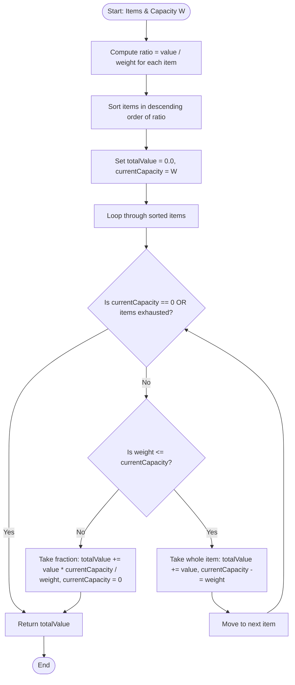

# Fractional Knapsack Algorithm (Greedy Approach)

## 1. Introduction

The **Fractional Knapsack Problem** is a classic optimization problem in computer science. Given a set of $n$ items, where each item $i$ has a weight $w_i$ and a value $v_i$, and a knapsack of total weight capacity $W$, the goal is to fill the knapsack in a way that maximizes the total monetary or utility value.

Unlike the 0/1 Knapsack Problem, in the **Fractional Knapsack Problem** items are **divisible**. You can take any fraction $x_i$ of an item, where $0 \le x_i \le 1$. For instance, items could be divisible commodities such as gold dust, liquids, grains, or fuel.

Mathematically, the problem is formulated as:
$$\text{Maximize } \sum_{i=1}^{n} v_i x_i \quad \text{subject to} \quad \sum_{i=1}^{n} w_i x_i \le W, \quad 0 \le x_i \le 1$$

Because items can be divided into arbitrary fractions, the problem exhibits the **Greedy Choice Property**. We can achieve a globally optimal solution in **$O(n \log n)$ time** by prioritizing items with the highest value-to-weight ratio $r_i = \frac{v_i}{w_i}$.

---

## 2. Why Use This Algorithm?

While the 0/1 Knapsack Problem requires Dynamic Programming ($O(n \cdot W)$ pseudo-polynomial time) or exponential search ($O(2^n)$), the Fractional Knapsack Problem can be solved much faster using a **Greedy Strategy** in **$O(n \log n)$ time**.

**Benefits:**
- **Optimal Global Solution:** The greedy ratio strategy is mathematically proven to produce the optimal total value.
- **High Performance:** Operates in $O(n \log n)$ time due to sorting, or even $O(n)$ average time using the QuickSelect algorithm.
- **Low Memory Footprint:** Requires only $O(1)$ auxiliary space beyond the item list storage.
- **Intuitive Decision Model:** Prioritizes items based on their "unit density" or "cost per unit weight".

---

## 3. Real-World Applications

- **Liquid & Grain Commodity Logistics:** Loading bulk cargo like crude oil, wheat, sand, or minerals into transport ships with strict deadweight tonnage limits.
- **Fuel Allocation & Management:** Distributing fuel across aircraft tanks or space vehicles to achieve maximum energy output within payload weight limits.
- **Financial Resource Allocation:** Allocating continuous capital funds across liquid assets or fractional stocks to maximize portfolio yield.
- **Network Bandwidth Allocation:** Dividing available network throughput among data streams with varying priority values per megabyte.
- **CPU Time-Sharing & Memory Chunking:** Allocating sliceable compute time slots to background processes according to priority per millisecond.

---

## 4. Prerequisites

Before learning the Fractional Knapsack algorithm, you should be familiar with:
- **Greedy Algorithmic Paradigm:** Making locally optimal choices to reach a global optimum.
- **Custom Sorting & Comparators:** Sorting structures or tuples based on computed floating-point properties.
- **Basic Floating-Point Arithmetic:** Handling fractions, ratios, and rounding.

---

## 5. Visualization

### Sorting by Value-to-Weight Ratio ($\frac{v_i}{w_i}$)

```
Item 1: Weight = 10, Value = 60  --> Ratio = 6.0 (Rank 1 - Highest density)
Item 2: Weight = 20, Value = 100 --> Ratio = 5.0 (Rank 2)
Item 3: Weight = 30, Value = 120 --> Ratio = 4.0 (Rank 3 - Lowest density)

Knapsack Capacity: W = 50

Step 1: Take ALL of Item 1 (Weight 10, Value 60). Remaining W = 40.
Step 2: Take ALL of Item 2 (Weight 20, Value 100). Remaining W = 20.
Step 3: Item 3 (Weight 30) exceeds remaining capacity W = 20.
        Take FRACTION (20/30 = 2/3) of Item 3.
        Fraction Value = (2/3) * 120 = 80. Remaining W = 0.

Total Value = 60 + 100 + 80 = 240
```

### Mermaid Flowchart: Fractional Knapsack Execution



---

## 6. How It Works

1. **Calculate Density/Ratio:** Compute the value-per-unit-weight ratio $r_i = \frac{v_i}{w_i}$ for each item.
2. **Sort:** Sort all items in descending order based on their ratio $r_i$.
3. **Greedy Selection:**
   - Iterate through the sorted list of items.
   - If the current item's weight $w_i$ is less than or equal to the remaining knapsack capacity $W_{\text{rem}}$, add the **entire item**:
     $$\text{totalValue} \mathrel{+}= v_i, \quad W_{\text{rem}} \mathrel{-}= w_i$$
   - If the current item's weight $w_i$ exceeds $W_{\text{rem}}$, take a **fraction** of the item equal to $\frac{W_{\text{rem}}}{w_i}$:
     $$\text{totalValue} \mathrel{+}= v_i \times \left(\frac{W_{\text{rem}}}{w_i}\right), \quad W_{\text{rem}} = 0$$
   - Stop processing further items since the knapsack is now full.

---

## 7. Step-by-Step Algorithm

1. Input: Array of weights `W[]`, array of values `V[]`, item count `n`, knapsack capacity `cap`.
2. Construct an array of item objects/tuples containing `(weight, value, ratio = value / weight)`.
3. Sort the item array in descending order based on `ratio`.
4. Initialize `totalValue = 0.0` and `remCapacity = (double)cap`.
5. For each item $i$ from $0$ to $n-1$:
   a. If `remCapacity == 0`, break loop.
   b. If `item[i].weight <= remCapacity`:
      - Add `item[i].value` to `totalValue`.
      - Subtract `item[i].weight` from `remCapacity`.
   c. Else:
      - Add `item[i].value * (remCapacity / item[i].weight)` to `totalValue`.
      - Set `remCapacity = 0`.
      - Break loop.
6. Return `totalValue`.

---

## 8. Pseudocode

```text
structure Item:
    weight: float
    value: float
    ratio: float

function fractionalKnapsack(weights, values, n, capacity):
    create array items of size n
    for i from 0 to n - 1:
        items[i].weight = weights[i]
        items[i].value = values[i]
        items[i].ratio = values[i] / weights[i]

    sort items in descending order based on items[i].ratio

    totalValue = 0.0
    remainingCapacity = capacity

    for i from 0 to n - 1:
        if remainingCapacity == 0:
            break

        if items[i].weight <= remainingCapacity:
            remainingCapacity = remainingCapacity - items[i].weight
            totalValue = totalValue + items[i].value
        else:
            fraction = remainingCapacity / items[i].weight
            totalValue = totalValue + (items[i].value * fraction)
            remainingCapacity = 0
            break

    return totalValue
```

---

## 9. Code Examples

### C
```c
#include <stdio.h>
#include <stdlib.h>

typedef struct {
    double weight;
    double value;
    double ratio;
} Item;

// Comparator for descending sort based on ratio
int compareItems(const void* a, const void* b) {
    Item* itemA = (Item*)a;
    Item* itemB = (Item*)b;
    if (itemB->ratio > itemA->ratio) return 1;
    if (itemB->ratio < itemA->ratio) return -1;
    return 0;
}

double fractionalKnapsack(double weights[], double values[], int n, double capacity) {
    Item* items = (Item*)malloc(n * sizeof(Item));

    for (int i = 0; i < n; i++) {
        items[i].weight = weights[i];
        items[i].value = values[i];
        items[i].ratio = values[i] / weights[i];
    }

    // Sort items by ratio descending
    qsort(items, n, sizeof(Item), compareItems);

    double totalValue = 0.0;
    double remCapacity = capacity;

    for (int i = 0; i < n; i++) {
        if (remCapacity <= 0) break;

        if (items[i].weight <= remCapacity) {
            remCapacity -= items[i].weight;
            totalValue += items[i].value;
        } else {
            totalValue += items[i].value * (remCapacity / items[i].weight);
            remCapacity = 0;
            break;
        }
    }

    free(items);
    return totalValue;
}

int main() {
    double weights[] = {10.0, 20.0, 30.0};
    double values[] = {60.0, 100.0, 120.0};
    int n = 3;
    double capacity = 50.0;

    double maxVal = fractionalKnapsack(weights, values, n, capacity);
    printf("Maximum Value in Fractional Knapsack: %.2f\n", maxVal);

    return 0;
}
```

### C++
```cpp
#include <iostream>
#include <vector>
#include <algorithm>
#include <iomanip>

using namespace std;

struct Item {
    double weight;
    double value;
    double ratio;
};

class FractionalKnapsack {
public:
    static double getMaxValue(vector<double> weights, vector<double> values, double capacity) {
        int n = weights.size();
        vector<Item> items(n);

        for (int i = 0; i < n; ++i) {
            items[i] = {weights[i], values[i], values[i] / weights[i]};
        }

        // Sort items by ratio in descending order
        sort(items.begin(), items.end(), [](const Item& a, const Item& b) {
            return a.ratio > b.ratio;
        });

        double totalValue = 0.0;
        double remCapacity = capacity;

        for (int i = 0; i < n; ++i) {
            if (remCapacity <= 0) break;

            if (items[i].weight <= remCapacity) {
                remCapacity -= items[i].weight;
                totalValue += items[i].value;
            } else {
                totalValue += items[i].value * (remCapacity / items[i].weight);
                remCapacity = 0;
                break;
            }
        }

        return totalValue;
    }
};

int main() {
    vector<double> weights = {10.0, 20.0, 30.0};
    vector<double> values = {60.0, 100.0, 120.0};
    double capacity = 50.0;

    double maxVal = FractionalKnapsack::getMaxValue(weights, values, capacity);
    cout << fixed << setprecision(2);
    cout << "Maximum Value in Fractional Knapsack: " << maxVal << endl;

    return 0;
}
```

### Java
```java
import java.util.Arrays;
import java.util.Comparator;

public class FractionalKnapsack {

    static class Item {
        double weight;
        double value;
        double ratio;

        Item(double weight, double value) {
            this.weight = weight;
            this.value = value;
            this.ratio = value / weight;
        }
    }

    public static double getMaxValue(double[] weights, double[] values, double capacity) {
        int n = weights.length;
        Item[] items = new Item[n];

        for (int i = 0; i < n; i++) {
            items[i] = new Item(weights[i], values[i]);
        }

        // Sort items by ratio descending
        Arrays.sort(items, (a, b) -> Double.compare(b.ratio, a.ratio));

        double totalValue = 0.0;
        double remCapacity = capacity;

        for (int i = 0; i < n; i++) {
            if (remCapacity <= 0) break;

            if (items[i].weight <= remCapacity) {
                remCapacity -= items[i].weight;
                totalValue += items[i].value;
            } else {
                totalValue += items[i].value * (remCapacity / items[i].weight);
                remCapacity = 0;
                break;
            }
        }

        return totalValue;
    }

    public static void main(String[] args) {
        double[] weights = {10.0, 20.0, 30.0};
        double[] values = {60.0, 100.0, 120.0};
        double capacity = 50.0;

        double maxVal = getMaxValue(weights, values, capacity);
        System.out.printf("Maximum Value in Fractional Knapsack: %.2f%n", maxVal);
    }
}
```

### Python
```python
class Item:
    def __init__(self, weight: float, value: float):
        self.weight = weight
        self.value = value
        self.ratio = value / weight

def fractional_knapsack(weights: list[float], values: list[float], capacity: float) -> float:
    """Calculates the maximum value achieved in Fractional Knapsack."""
    items = [Item(w, v) for w, v in zip(weights, values)]
    
    # Sort items by value-to-weight ratio in descending order
    items.sort(key=lambda item: item.ratio, reverse=True)

    total_value = 0.0
    rem_capacity = capacity

    for item in items:
        if rem_capacity <= 0:
            break

        if item.weight <= rem_capacity:
            rem_capacity -= item.weight
            total_value += item.value
        else:
            total_value += item.value * (rem_capacity / item.weight)
            rem_capacity = 0
            break

    return total_value

if __name__ == "__main__":
    weights = [10.0, 20.0, 30.0]
    values = [60.0, 100.0, 120.0]
    capacity = 50.0

    max_val = fractional_knapsack(weights, values, capacity)
    print(f"Maximum Value in Fractional Knapsack: {max_val:.2f}")
```

### JavaScript
```javascript
/**
 * Fractional Knapsack Algorithm implementation
 * @param {number[]} weights 
 * @param {number[]} values 
 * @param {number} capacity 
 * @returns {number}
 */
function fractionalKnapsack(weights, values, capacity) {
    const n = weights.length;
    const items = [];

    for (let i = 0; i < n; i++) {
        items.push({
            weight: weights[i],
            value: values[i],
            ratio: values[i] / weights[i]
        });
    }

    // Sort items by ratio descending
    items.sort((a, b) => b.ratio - a.ratio);

    let totalValue = 0.0;
    let remCapacity = capacity;

    for (let i = 0; i < n; i++) {
        if (remCapacity <= 0) break;

        if (items[i].weight <= remCapacity) {
            remCapacity -= items[i].weight;
            totalValue += items[i].value;
        } else {
            totalValue += items[i].value * (remCapacity / items[i].weight);
            remCapacity = 0;
            break;
        }
    }

    return totalValue;
}

// Execution and testing
const weights = [10.0, 20.0, 30.0];
const values = [60.0, 100.0, 120.0];
const capacity = 50.0;

const maxVal = fractionalKnapsack(weights, values, capacity);
console.log(`Maximum Value in Fractional Knapsack: ${maxVal.toFixed(2)}`);
```

---

## 10. Code Explanation

1. **Item Representation:** An `Item` structure/class stores `weight`, `value`, and calculated density `ratio = value / weight`.
2. **Descending Sort:** Sorting the item list by `ratio` in descending order ensures we process the highest density items first.
3. **Greedy Iteration:**
   - When `items[i].weight <= remCapacity`, we take the entire item.
   - When `items[i].weight > remCapacity`, we take fraction $\frac{\text{remCapacity}}{\text{items}[i].weight}$, add $\text{value} \times \text{fraction}$, set capacity to 0, and terminate the loop immediately.
4. **Early Exit:** Once `remCapacity == 0`, no further item processing occurs.

---

## 11. Interactive Demo

An interactive Fractional Knapsack visualizer includes:
- **Commodity Slicer View:** Visual representation of items as sliceable bars/rectangles (e.g. Gold Dust, Silver Granules, Liquid Fuel).
- **Density Sorting Animator:** Visual animation sorting item cards by ratio $\frac{v}{w}$.
- **Interactive Pouring Animation:** Dynamically fills the knapsack container, showing items sliding in whole until the last item is sliced into a partial fraction.

---

## 12. Dry Run

### Sample Input:
- Weights: $[10, 20, 30]$
- Values: $[60, 100, 120]$
- Knapsack Capacity: $W = 50$

### Item Calculation & Sorting:

| Item | Weight ($w_i$) | Value ($v_i$) | Ratio ($r_i = v_i / w_i$) | Sorted Order |
|:---:|:---:|:---:|:---:|:---:|
| A | 10 | 60 | 6.0 | Rank 1 |
| B | 20 | 100 | 5.0 | Rank 2 |
| C | 30 | 120 | 4.0 | Rank 3 |

### Execution Trace:

| Step | Item Processed | Remaining Cap ($W$) | Weight Taken | Fraction Taken | Value Added | Total Value |
|:---:|:---:|:---:|:---:|:---:|:---:|:---:|
| **Init** | - | 50.0 | 0.0 | 0.0 | 0.0 | **0.0** |
| **1** | Item A | $50.0 - 10.0 = 40.0$ | 10.0 | $1.0$ (100%) | 60.0 | **60.0** |
| **2** | Item B | $40.0 - 20.0 = 20.0$ | 20.0 | $1.0$ (100%) | 100.0 | **160.0** |
| **3** | Item C | $20.0 - 20.0 = 0.0$ | 20.0 | $20/30 = 0.67$ (66.7%) | $120 \times \frac{2}{3} = 80.0$ | **240.0** |
| **End** | - | 0.0 | - | - | - | **240.0** |

**Final Result:** Total Maximum Value = **240.00**

---

## 13. Time & Space Complexity Analysis

| Stage | Time Complexity | Auxiliary Space | Explanation |
|:---|:---:|:---:|:---|
| **Ratio Computation** | $O(n)$ | $O(n)$ | Computes $r_i = v_i / w_i$ for $n$ items |
| **Sorting** | $O(n \log n)$ | $O(1)$ to $O(n)$ | Quicksort / Mergesort based on ratio |
| **Greedy Loop** | $O(n)$ | $O(1)$ | Single pass over sorted items |
| **Total Algorithm** | **$O(n \log n)$** | **$O(n)$** | **Dominated by sorting step** |
| **QuickSelect Variant** | **$O(n)$ Avg** | $O(n)$ | Uses Median-of-Medians to find split item without full sort |

---

## 14. Advantages

- **Optimal Solution:** Guaranteed to find the exact global maximum value for continuous/fractional items.
- **Fast Performance:** Runs in $O(n \log n)$ time, vastly outperforming 0/1 Knapsack DP $O(n \cdot W)$.
- **Independent of Capacity Magnitude:** Unlike DP, execution time does NOT grow with capacity $W$.
- **Simple Implementation:** Requires only ratio calculation, standard sorting, and a single loop.

---

## 15. Disadvantages

- **Does NOT Work for 0/1 Knapsack:** If items cannot be split, greedy ratio sorting fails to guarantee global optimal value.
- **Precision Errors:** Uses floating-point division and fractions, making it susceptible to precision rounding errors if not handled carefully.

---

## 16. Variations & Advanced Optimizations

### Linear-Time $O(n)$ Fractional Knapsack using QuickSelect:
Instead of fully sorting all $n$ items in $O(n \log n)$ time, we can use the **QuickSelect** algorithm to partition items around the median ratio in average $O(n)$ time:
1. Find the median ratio item using QuickSelect.
2. Sum the weights of items in the higher-ratio partition.
3. If sum $< W$, take all higher-ratio items and recurse on lower-ratio items.
4. If sum $> W$, recurse only on higher-ratio items.
5. Take the exact fraction of the boundary pivot item to fill the remaining capacity.

---

## 17. Common Mistakes & Pitfalls

- **Applying Greedy Strategy to 0/1 Knapsack:** Assuming greedy ratio sorting works when items cannot be split (e.g. taking item with ratio 6 instead of two items with ratio 5 that fit capacity perfectly).
- **Integer Division Truncation:** Performing `item.value / item.weight` using integer arithmetic in C/Java (e.g. `60 / 100 = 0` instead of `0.6`).
- **Sorting in Ascending Order:** Sorting ratios from lowest to highest, resulting in picking the worst density items first.
- **Not Handling Zero Weight Items:** Failing to check if $w_i = 0$ before computing $v_i / w_i$, causing division by zero.

---

## 18. Interview Questions

1. **Why does the Greedy approach guarantee an optimal solution for Fractional Knapsack but fail for 0/1 Knapsack?**
   *Answer:* Divisibility guarantees that filling the remaining capacity with the highest density fraction available never leaves "wasted capacity" gaps. In 0/1 Knapsack, taking a high-density item might leave empty capacity that could have been better filled by two lower-density items.

2. **Can Fractional Knapsack be solved in $O(n)$ time?**
   *Answer:* Yes, using the **QuickSelect (Median-of-Medians)** algorithm to partition items around ratios without fully sorting them.

3. **What is the time complexity of Fractional Knapsack if the items are ALREADY sorted by ratio?**
   *Answer:* $O(n)$ time, as only the single greedy loop is required.

4. **How do you handle items with identical value-to-weight ratios?**
   *Answer:* Order does not matter among items with identical ratios. Any picking sequence among equal-ratio items yields the same optimal total value.

5. **What is the Greedy Choice Property in Fractional Knapsack?**
   *Answer:* The property that a globally optimal solution can be arrived at by making locally optimal greedy choices (selecting highest ratio item first) at each step.

6. **How does Fractional Knapsack handle zero-weight items ($w_i = 0$) with positive value ($v_i > 0$)?**
   *Answer:* Items with zero weight and positive value have infinite density ratio ($\infty$). They should be taken immediately without consuming any knapsack capacity.

7. **Compare 0/1 Knapsack, Unbounded Knapsack, and Fractional Knapsack.**
   *Answer:* 
   - 0/1: Items cannot be split, max 1 copy ($O(nW)$ DP).
   - Unbounded: Items cannot be split, unlimited copies ($O(nW)$ DP).
   - Fractional: Items can be split, max 1 copy ($O(n \log n)$ Greedy).

8. **Is Fractional Knapsack NP-Hard?**
   *Answer:* No, Fractional Knapsack is in **P** (polynomial time solvable in $O(n \log n)$ or $O(n)$).

9. **What happens if the total weight of all items is less than capacity $W$?**
   *Answer:* The algorithm takes 100% of all items, returning the sum of all item values.

10. **How would you adapt Fractional Knapsack for a minimum cost problem?**
    *Answer:* Calculate cost density $c_i / w_i$ and sort in **ascending** order to pick the lowest cost per unit weight first.

---

## 19. Practice Problems

### Easy
1. **GeeksforGeeks:** [Fractional Knapsack](https://practice.geeksforgeeks.org/) - Standard greedy implementation problem.
2. **LeetCode 1710:** [Maximum Units on a Truck](https://leetcode.com/problems/maximum-units-on-a-truck/) - Direct application of fractional/divisible knapsack concept (boxes with units).

### Medium
3. **LeetCode 502:** [IPO](https://leetcode.com/problems/ipo/) - Greedy priority selection under capital constraints.
4. **CodeChef:** [Ciel and Receipt](https://www.codechef.com/) - Greedy denomination selection problem.

### Hard
5. **LeetCode 1383:** [Maximum Performance of a Team](https://leetcode.com/problems/maximum-performance-of-a-team/) - Advanced greedy selection with priority queue / min-heap.

---

## 20. Related Algorithms

- **0/1 Knapsack Problem:** Solved using 2D/1D Dynamic Programming in $O(nW)$ time.
- **Job Sequencing with Deadlines:** Greedy algorithm using profit-based sorting.
- **Huffman Coding:** Greedy tree construction algorithm based on frequency sorting.
- **Dijkstra's Algorithm:** Greedy shortest path search using priority queue.

---

## 21. Summary

The Fractional Knapsack Problem is a classic demonstration of the **Greedy Algorithmic Paradigm**. By calculating the value-to-weight density ratio $r_i = v_i / w_i$, sorting items in descending order, and taking full or partial fractions, we compute the optimal solution in **$O(n \log n)$ time**.

---

## 22. Quiz

**Question 1:** What property allows Fractional Knapsack to be solved using a Greedy strategy?
- A) Overlapping Subproblems
- B) Greedy Choice Property & Optimal Substructure
- C) Matrix Exponentiation
- D) Subgraph Isomorphism
- **Correct Answer:** B
- **Explanation:** Divisibility provides the greedy choice property where locally optimal choices lead to global optimum.

**Question 2:** What is the time complexity of standard Fractional Knapsack using sorting?
- A) $O(2^n)$
- B) $O(n \cdot W)$
- C) $O(n \log n)$
- D) $O(n^2)$
- **Correct Answer:** C
- **Explanation:** Sorting $n$ items by ratio takes $O(n \log n)$ time, dominating the $O(n)$ greedy selection loop.

**Question 3:** What ratio is used to prioritize items in Fractional Knapsack?
- A) $\text{Weight} / \text{Value}$
- B) $\text{Value} \times \text{Weight}$
- C) $\text{Value} / \text{Weight}$
- D) $\text{Value} - \text{Weight}$
- **Correct Answer:** C
- **Explanation:** Value per unit weight ($\frac{v_i}{w_i}$) represents the value density.

**Question 4:** Can Fractional Knapsack be solved in $O(n)$ time?
- A) No, never
- B) Yes, using QuickSelect (Median-of-Medians)
- C) Yes, using 2D Dynamic Programming
- D) Only if capacity $W = 1$
- **Correct Answer:** B
- **Explanation:** QuickSelect can partition items by median ratio without full sorting in $O(n)$ average time.

**Question 5:** Why does the Greedy strategy fail for 0/1 Knapsack?
- A) 0/1 Knapsack does not have positive values
- B) Items cannot be split, leaving empty gaps that could render greedy ratio picks sub-optimal
- C) 0/1 Knapsack requires floating-point ratios
- D) Greedy algorithms cannot sort items
- **Correct Answer:** B
- **Explanation:** Indivisibility means taking a high-ratio item might leave unused capacity that could fit items with higher combined value.

**Question 6:** What fraction of an item is taken if remaining capacity is $W_{\text{rem}} = 15$ and item weight is $w_i = 30$?
- A) $2.0$
- B) $0.5$ (50%)
- C) $0.33$
- D) $0.0$
- **Correct Answer:** B
- **Explanation:** Fraction = $W_{\text{rem}} / w_i = 15 / 30 = 0.5$.

**Question 7:** What is the space complexity of Fractional Knapsack if sorting in-place?
- A) $O(n \cdot W)$
- B) $O(W)$
- C) $O(1)$ auxiliary space
- D) $O(2^n)$
- **Correct Answer:** C
- **Explanation:** In-place sorting requires only $O(1)$ extra space beyond storing the item list.

**Question 8:** In LeetCode 1710 (Maximum Units on a Truck), what corresponds to the value density ratio?
- A) Number of boxes
- B) Units per box
- C) Total weight of truck
- D) Truck speed
- **Correct Answer:** B
- **Explanation:** Units per box represents the value density of each box type.

**Question 9:** If all items have identical ratios $v_i / w_i = c$, what is the total value achieved for capacity $W$ (assuming total weight $\ge W$)?
- A) 0
- B) $c \times W$
- C) $W / c$
- D) $c^2$
- **Correct Answer:** B
- **Explanation:** Total Value = $\text{Total Weight Taken} \times \text{Ratio} = W \times c$.

**Question 10:** What complexity class does Fractional Knapsack belong to?
- A) NP-Complete
- B) NP-Hard
- C) P (Polynomial Time)
- D) EXPTIME
- **Correct Answer:** C
- **Explanation:** Fractional Knapsack is solvable in polynomial time $O(n \log n)$ or $O(n)$, so it belongs to **P**.
