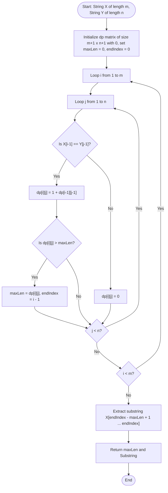

# Longest Common Substring (Dynamic Programming)

## 1. Introduction

The **Longest Common Substring** problem is a fundamental string processing problem in computer science. Given two strings $X$ of length $m$ and $Y$ of length $n$, the objective is to find the length of the longest contiguous sequence of characters (substring) that appears in both $X$ and $Y$, along with the actual substring itself.

Unlike the **Longest Common Subsequence (LCS)** problem, where characters can be separated by non-matching characters as long as relative order is preserved, a **substring** requires characters to be **strictly contiguous** without any gaps.

For example, for strings $X = \text{"abcdxyz"}$ and $Y = \text{"xyzabcd"}$:
- Longest Common Subsequence (LCS) = `"abcdxyz"` (Length 7)
- Longest Common Substring = `"abcd"` or `"xyz"` (Length 4)

Naive brute-force substring comparison takes $O(m^2 \cdot n)$ time. Dynamic Programming solves the Longest Common Substring problem in **$O(m \cdot n)$ time** and **$O(m \cdot n)$ space** (which can be optimized to $O(\min(m, n))$ space). Advanced data structures like **Suffix Trees** or **Suffix Automata** can solve the problem in linear **$O(m + n)$ time**.

---

## 2. Why Use This Algorithm?

### Substring vs. Subsequence Difference:
- **String $X$:** `"abcde"`
- **String $Y$:** `"abxde"`
- **LCS (Subsequence - Gaps allowed):** `"abde"` (Length 4)
- **Longest Common Substring (Contiguous - No gaps):** `"ab"` or `"de"` (Length 2)

When detecting exact copy-pasting, verbatim plagiarism, or continuous data streams, gaps are not allowed.

**Benefits:**
- **Exact Contiguous Match Detection:** Identifies un-fragmented matching text blocks.
- **Simple State Transition:** Resets state to zero on mismatch, eliminating complex choice branching.
- **Linear Space Optimizable:** Can be implemented in $O(n)$ space using a single array or two rows.
- **Foundation for Data Compression:** Used in LZ77 sliding window dictionary matching.

---

## 3. Real-World Applications

- **Plagiarism & Verbatim Copy Detection:** Identifying exact copied sentences or code blocks between academic papers or source code repositories.
- **Bioinformatics (Motif Finding):** Discovering exact conserved sequence motifs across biological DNA/RNA strands.
- **Data Compression (LZ77 & LZ78):** Locating the longest matching sliding window substring in uncompressed data streams.
- **Malware Signature Detection:** Scanning binary files for contiguous byte sequence signatures matching known computer virus databases.
- **Search Engine Auto-Completion & Token Phrase Matching:** Suggesting exact contiguous matching search queries as a user types.

---

## 4. Prerequisites

Before studying Longest Common Substring, you should be comfortable with:
- **Basic String Manipulation:** Indexing, substring slicing, and character comparisons.
- **Difference between Subsequence and Substring.**
- **2D Dynamic Programming Grids.**

---

## 5. Visualization

### 2D DP Matrix ($dp[i][j]$) for $X = \text{"abcdxyz"}$ and $Y = \text{"xyzabcd"}$

```
       Ø   x   y   z   a   b   c   d
   Ø   0   0   0   0   0   0   0   0
   a   0   0   0   0   1   0   0   0
   b   0   0   0   0   0   2   0   0
   c   0   0   0   0   0   0   3   0
   d   0   0   0   0   0   0   0   4  <-- Max Length = 4 ("abcd")
   x   0   1   0   0   0   0   0   0
   y   0   0   2   0   0   0   0   0
   z   0   0   0   3   0   0   0   0
```

Notice how continuous matching characters form **diagonal trails** of incrementing numbers in the 2D grid.

### Mermaid Flowchart: Longest Common Substring State Logic



---

## 6. How It Works

Let $dp[i][j]$ represent the length of the longest common substring ending at $X[i-1]$ and $Y[j-1]$.

### Base Cases:
- $dp[0][j] = 0$ for all $0 \le j \le n$.
- $dp[i][0] = 0$ for all $0 \le i \le m$.

### State Transition Formula:
For $1 \le i \le m$ and $1 \le j \le n$:

1. **Character Match ($X[i-1] == Y[j-1]$):**
   Extend the contiguous match from top-left neighbor:
   $$dp[i][j] = 1 + dp[i-1][j-1]$$
   Update global maximum length: $\text{maxLen} = \max(\text{maxLen}, \, dp[i][j])$.

2. **Character Mismatch ($X[i-1] \neq Y[j-1]$):**
   Contiguity is broken! Reset state to zero:
   $$dp[i][j] = 0$$

> **Key Difference from LCS:** In LCS, a mismatch takes $\max(dp[i-1][j], dp[i][j-1])$. In Substring, a mismatch resets $dp[i][j]$ to $0$ because any gap breaks contiguity.

---

## 7. Step-by-Step Algorithm

1. Input: String $X$ of length $m$, String $Y$ of length $n$.
2. Create a 2D array `dp` of size $(m+1) \times (n+1)$, initialized to $0$.
3. Initialize `maxLen = 0` and `endIndex = 0`.
4. Outer loop `i` from $1$ to $m$:
   - Inner loop `j` from $1$ to $n$:
     - If $X[i-1] == Y[j-1]$:
       - `dp[i][j] = 1 + dp[i-1][j-1]`
       - If `dp[i][j] > maxLen`:
         - `maxLen = dp[i][j]`
         - `endIndex = i - 1`
     - Else:
       - `dp[i][j] = 0`
5. Extract the common substring from $X$ starting at index `endIndex - maxLen + 1` of length `maxLen`.
6. Return `maxLen` and the extracted substring.

---

## 8. Pseudocode

### 2D Tabulation Pseudocode
```text
function longestCommonSubstring(X, Y):
    m = length(X)
    n = length(Y)
    create 2D array dp[m + 1][n + 1] initialized to 0

    maxLen = 0
    endIndex = 0

    for i from 1 to m:
        for j from 1 to n:
            if X[i - 1] == Y[j - 1]:
                dp[i][j] = 1 + dp[i - 1][j - 1]
                if dp[i][j] > maxLen:
                    maxLen = dp[i][j]
                    endIndex = i - 1
            else:
                dp[i][j] = 0

    substringResult = X.substring(endIndex - maxLen + 1, maxLen)
    return maxLen, substringResult
```

### 1D Space-Optimized Pseudocode
```text
function longestCommonSubstring1D(X, Y):
    m = length(X)
    n = length(Y)
    create 1D array dp[n + 1] initialized to 0
    maxLen = 0

    for i from 1 to m:
        prevDiagonal = 0
        for j from 1 to n:
            temp = dp[j]
            if X[i - 1] == Y[j - 1]:
                dp[j] = 1 + prevDiagonal
                if dp[j] > maxLen:
                    maxLen = dp[j]
            else:
                dp[j] = 0
            prevDiagonal = temp

    return maxLen
```

---

## 9. Code Examples

### C
```c
#include <stdio.h>
#include <stdlib.h>
#include <string.h>

void longestCommonSubstring(char* X, char* Y) {
    int m = strlen(X);
    int n = strlen(Y);

    int** dp = (int**)malloc((m + 1) * sizeof(int*));
    for (int i = 0; i <= m; i++) {
        dp[i] = (int*)calloc(n + 1, sizeof(int));
    }

    int maxLen = 0;
    int endIndex = 0;

    for (int i = 1; i <= m; i++) {
        for (int j = 1; j <= n; j++) {
            if (X[i - 1] == Y[j - 1]) {
                dp[i][j] = 1 + dp[i - 1][j - 1];
                if (dp[i][j] > maxLen) {
                    maxLen = dp[i][j];
                    endIndex = i - 1;
                }
            } else {
                dp[i][j] = 0;
            }
        }
    }

    printf("Longest Common Substring Length: %d\n", maxLen);

    if (maxLen > 0) {
        char* subStr = (char*)malloc((maxLen + 1) * sizeof(char));
        strncpy(subStr, X + (endIndex - maxLen + 1), maxLen);
        subStr[maxLen] = '\0';
        printf("Longest Common Substring: %s\n", subStr);
        free(subStr);
    } else {
        printf("No common substring found.\n");
    }

    for (int i = 0; i <= m; i++) free(dp[i]);
    free(dp);
}

int main() {
    char X[] = "GeeksforGeeks";
    char Y[] = "GeeksQuiz";

    longestCommonSubstring(X, Y);
    return 0;
}
```

### C++
```cpp
#include <iostream>
#include <vector>
#include <string>

using namespace std;

class LongestCommonSubstring {
public:
    static void solve(const string& X, const string& Y) {
        int m = X.length();
        int n = Y.length();

        vector<vector<int>> dp(m + 1, vector<int>(n + 1, 0));
        int maxLen = 0;
        int endIndex = 0;

        for (int i = 1; i <= m; ++i) {
            for (int j = 1; j <= n; ++j) {
                if (X[i - 1] == Y[j - 1]) {
                    dp[i][j] = 1 + dp[i - 1][j - 1];
                    if (dp[i][j] > maxLen) {
                        maxLen = dp[i][j];
                        endIndex = i - 1;
                    }
                } else {
                    dp[i][j] = 0;
                }
            }
        }

        cout << "Longest Common Substring Length: " << maxLen << endl;
        if (maxLen > 0) {
            string subStr = X.substr(endIndex - maxLen + 1, maxLen);
            cout << "Longest Common Substring: " << subStr << endl;
        } else {
            cout << "No common substring found." << endl;
        }
    }
};

int main() {
    string X = "GeeksforGeeks";
    string Y = "GeeksQuiz";

    LongestCommonSubstring::solve(X, Y);
    return 0;
}
```

### Java
```java
public class LongestCommonSubstring {

    public static void solve(String X, String Y) {
        int m = X.length();
        int n = Y.length();

        int[][] dp = new int[m + 1][n + 1];
        int maxLen = 0;
        int endIndex = 0;

        for (int i = 1; i <= m; i++) {
            for (int j = 1; j <= n; j++) {
                if (X.charAt(i - 1) == Y.charAt(j - 1)) {
                    dp[i][j] = 1 + dp[i - 1][j - 1];
                    if (dp[i][j] > maxLen) {
                        maxLen = dp[i][j];
                        endIndex = i - 1;
                    }
                } else {
                    dp[i][j] = 0;
                }
            }
        }

        System.out.println("Longest Common Substring Length: " + maxLen);
        if (maxLen > 0) {
            String subStr = X.substring(endIndex - maxLen + 1, endIndex + 1);
            System.out.println("Longest Common Substring: " + subStr);
        } else {
            System.out.println("No common substring found.");
        }
    }

    public static void main(String[] args) {
        String X = "GeeksforGeeks";
        String Y = "GeeksQuiz";

        solve(X, Y);
    }
}
```

### Python
```python
def longest_common_substring(X: str, Y: str) -> tuple[int, str]:
    """Computes max length and extracts longest common substring."""
    m, n = len(X), len(Y)
    dp = [[0] * (n + 1) for _ in range(m + 1)]

    max_len = 0
    end_index = 0

    for i in range(1, m + 1):
        for j in range(1, n + 1):
            if X[i - 1] == Y[j - 1]:
                dp[i][j] = 1 + dp[i - 1][j - 1]
                if dp[i][j] > max_len:
                    max_len = dp[i][j]
                    end_index = i - 1
            else:
                dp[i][j] = 0

    substring_res = X[end_index - max_len + 1 : end_index + 1] if max_len > 0 else ""
    print(f"Longest Common Substring Length: {max_len}")
    print(f"Longest Common Substring: '{substring_res}'")
    return max_len, substring_res

if __name__ == "__main__":
    X = "GeeksforGeeks"
    Y = "GeeksQuiz"

    longest_common_substring(X, Y)
```

### JavaScript
```javascript
/**
 * Longest Common Substring DP Implementation
 * @param {string} X 
 * @param {string} Y 
 */
function longestCommonSubstring(X, Y) {
    const m = X.length;
    const n = Y.length;

    const dp = Array.from({ length: m + 1 }, () => new Array(n + 1).fill(0));
    let maxLen = 0;
    let endIndex = 0;

    for (let i = 1; i <= m; i++) {
        for (let j = 1; j <= n; j++) {
            if (X[i - 1] === Y[j - 1]) {
                dp[i][j] = 1 + dp[i - 1][j - 1];
                if (dp[i][j] > maxLen) {
                    maxLen = dp[i][j];
                    endIndex = i - 1;
                }
            } else {
                dp[i][j] = 0;
            }
        }
    }

    const subStr = maxLen > 0 ? X.substring(endIndex - maxLen + 1, endIndex + 1) : "";
    console.log(`Longest Common Substring Length: ${maxLen}`);
    console.log(`Longest Common Substring: '${subStr}'`);

    return maxLen;
}

// Execution and testing
const X = "GeeksforGeeks";
const Y = "GeeksQuiz";

longestCommonSubstring(X, Y);
```

---

## 10. Code Explanation

1. **2D DP Grid Allocation (`dp[m+1][n+1]`):** `dp[i][j]` tracks the contiguous match length ending at $X[i-1]$ and $Y[j-1]$.
2. **Match Diagonal Increment (`1 + dp[i-1][j-1]`):** When characters match, the contiguous length extends the top-left diagonal neighbor length.
3. **Mismatch Zero Reset (`dp[i][j] = 0`):** Crucial step that distinguishes Substring from Subsequence. Any character mismatch breaks contiguity, resetting the length to zero.
4. **Global Max Tracking:** `maxLen` keeps track of the peak value produced anywhere in the grid, and `endIndex` records the end position in string $X$ for direct $O(1)$ substring extraction.

---

## 11. Interactive Demo

An interactive Longest Common Substring visualizer features:
- **String Pair Input Boxes:** Test custom string inputs.
- **Diagonal Highlight Matrix:** Color-codes matching diagonal streaks in green.
- **Substring Extractor Bar:** Shows the extracted substring updating in real time as the maximum value cell is discovered.

---

## 12. Dry Run

### Sample Input:
- $X = \text{"GeeksforGeeks"}$ ($m = 13$)
- $Y = \text{"GeeksQuiz"}$ ($n = 9$)

### Execution Trace Highlights:

| Position ($i, j$) | $X[i-1]$ | $Y[j-1]$ | Match? | $dp[i][j]$ | `maxLen` | `endIndex` | Common Substring |
|:---:|:---:|:---:|:---:|:---:|:---:|:---:|:---|
| $(1, 1)$ | 'G' | 'G' | Yes | $1 + dp[0][0] = 1$ | 1 | 0 | `"G"` |
| $(2, 2)$ | 'e' | 'e' | Yes | $1 + dp[1][1] = 2$ | 2 | 1 | `"Ge"` |
| $(3, 3)$ | 'e' | 'e' | Yes | $1 + dp[2][2] = 3$ | 3 | 2 | `"Gee"` |
| $(4, 4)$ | 'k' | 'k' | Yes | $1 + dp[3][3] = 4$ | 4 | 3 | `"Geek"` |
| $(5, 5)$ | 's' | 's' | Yes | $1 + dp[4][4] = \mathbf{5}$ | **5** | 4 | **`"Geeks"`** |
| $(6, 6)$ | 'f' | 'Q' | No | **0** | 5 | 4 | `"Geeks"` |

**Final Result:** `maxLen` = **5**, Substring = **"Geeks"**.

---

## 13. Time & Space Complexity Analysis

| Approach | Time Complexity | Space Complexity | Notes |
|:---|:---:|:---:|:---|
| **Naive Brute Force** | $O(m^2 \cdot n)$ | $O(1)$ | Generates all substrings of $X$ and tests against $Y$ |
| **Standard 2D DP** | **$O(m \cdot n)$** | **$O(m \cdot n)$** | Basic DP grid approach |
| **1D Space-Optimized DP** | **$O(m \cdot n)$** | **$O(\min(m, n))$** | Uses single array of size $n+1$ |
| **Suffix Tree / Automaton** | **$O(m + n)$** | **$O(m + n)$** | **Linear-time optimal bound** |
| **Rolling Hash + Binary Search** | $O((m+n) \log(\min(m,n)))$ | $O(m + n)$ | Uses Rabin-Karp hashing + binary search on length |

---

## 14. Advantages

- **Strict Contiguous Matching:** Ideal for verbatim text verification and exact pattern detection.
- **Simple State Reset:** Zero reset on mismatch simplifies state handling compared to LCS.
- **Linear Space Optimization:** Solvable in $O(n)$ space.

---

## 15. Disadvantages

- **Quadratic DP Time:** $O(m \cdot n)$ DP can be slow for massive strings ($10^6$ characters) without Suffix Trees or Suffix Automata.
- **Inflexible to Minor Mutations:** Insertions/deletions break contiguity completely, making it unsuitable for noisy biological sequences.

---

## 16. Variations & Advanced Optimizations

1. **Suffix Tree / Generalized Suffix Tree:**
   Build a Generalized Suffix Tree for $X \sharp Y \$$. The deepest internal node with descendants from both $X$ and $Y$ represents the Longest Common Substring, solved in **$O(m + n)$ time**.
2. **Rolling Hash + Binary Search:**
   Binary search on substring length $L \in [1, \min(m, n)]$. For each length $L$, use Rabin-Karp rolling hashes to check for common hashes in $O(m + n)$ time, yielding total time **$O((m+n) \log(\min(m,n)))$**.

---

## 17. Common Mistakes & Pitfalls

- **Forgetting to Reset $dp[i][j] = 0$ on Mismatch:** Treating substring like LCS, leaving stale non-zero values.
- **Returning $dp[m][n]$ instead of Global `maxLen`:** Unlike LCS where $dp[m][n]$ contains the answer, Substring DP answer can be located at ANY cell in the matrix.
- **Off-By-One Indexing in Substring Extraction:** Computing starting index as `endIndex - maxLen` instead of `endIndex - maxLen + 1`.

---

## 18. Interview Questions

1. **What is the fundamental difference in DP state transitions between LCS and Longest Common Substring?**
   *Answer:* On character mismatch ($X[i-1] \neq Y[j-1]$), LCS takes $\max(dp[i-1][j], dp[i][j-1])$, whereas Longest Common Substring resets $dp[i][j] = 0$ to enforce contiguity.

2. **Why is the answer for Longest Common Substring NOT necessarily at $dp[m][n]$?**
   *Answer:* Because the longest common contiguous substring might end anywhere inside the strings, not necessarily at the final characters $X[m-1]$ and $Y[n-1]$. We must track a global `maxLen` variable across the entire matrix.

3. **How can Longest Common Substring be solved in linear $O(m + n)$ time?**
   *Answer:* By constructing a Generalized Suffix Tree or Suffix Automaton for both strings and finding the deepest internal node with leaves from both strings.

4. **How do you extract the actual substring string in $O(1)$ extra space after the DP loop completes?**
   *Answer:* Maintain the index `endIndex` where `maxLen` was updated. The substring starts at `endIndex - maxLen + 1` and has length `maxLen`.

5. **What is the space complexity of 1D space-optimized Substring DP?**
   *Answer:* $O(\min(m, n))$ space.

6. **Can Rolling Hash and Binary Search solve Longest Common Substring?**
   *Answer:* Yes, in $O((m+n) \log(\min(m,n)))$ time by binary searching on candidate substring length $L$ and checking hash set intersections.

7. **How does LZ77 data compression use Longest Common Substring?**
   *Answer:* It searches the sliding window buffer for the longest common substring matching incoming data to emit (distance, length) offset pairs.

8. **What is the result if strings share no common characters?**
   *Answer:* `maxLen` = 0, returning an empty string `""`.

9. **How would you solve Longest Common Substring for $K$ strings instead of 2 strings?**
   *Answer:* Using a Generalized Suffix Tree for $K$ strings in $O(\sum |S_i|)$ time or a $K$-dimensional DP matrix in $O(\prod |S_i|)$ time.

10. **What is the Longest Palindromic Substring of a string $S$?**
    *Answer:* It is the longest contiguous substring that reads the same forward and backward. It can be found via Manacher's Algorithm in $O(n)$ time or DP in $O(n^2)$ time.

---

## 19. Practice Problems

### Easy
1. **GeeksforGeeks:** [Longest Common Substring](https://practice.geeksforgeeks.org/) - Standard DP implementation.
2. **LeetCode 718:** [Maximum Length of Repeated Subarray](https://leetcode.com/problems/maximum-length-of-repeated-subarray/) - Identical problem for integer arrays instead of character strings.

### Medium
3. **LeetCode 5:** [Longest Palindromic Substring](https://leetcode.com/problems/longest-palindromic-substring/) - Contiguous palindrome finding.
4. **LeetCode 1044:** [Longest Duplicate Substring](https://leetcode.com/problems/longest-duplicate-substring/) - Finding longest repeated substring in a single string using Suffix Automaton / Binary Search + Rolling Hash.

### Hard
5. **Spoj:** [LCS - Longest Common Substring](https://www.spoj.com/) - Fast $O(m + n)$ Suffix Automaton implementation required.

---

## 20. Related Algorithms

- **Longest Common Subsequence (LCS):** Gaps allowed between matching characters.
- **Maximum Length of Repeated Subarray (LeetCode 718):** Array equivalent of Longest Common Substring.
- **Manacher's Algorithm:** Linear $O(n)$ algorithm for Longest Palindromic Substring.
- **Rabin-Karp Rolling Hash:** Fast substring matching algorithm.

---

## 21. Summary

The Longest Common Substring Problem is a fundamental 2D Dynamic Programming algorithm. By enforcing contiguity with the state transition $dp[i][j] = 1 + dp[i-1][j-1]$ (on match) and resetting $dp[i][j] = 0$ (on mismatch), it computes exact contiguous matching blocks in **$O(m \cdot n)$ time**.

---

## 22. Quiz

**Question 1:** What is the key difference between Substring and Subsequence?
- A) Subsequence requires contiguous characters; Substring does not
- B) Substring requires strictly contiguous characters; Subsequence allows gaps
- C) Substrings can change character order
- D) Subsequences must end at the last character
- **Correct Answer:** B
- **Explanation:** Substrings must be contiguous blocks of text without gaps.

**Question 2:** What is the state transition when characters MISMATCH ($X[i-1] \neq Y[j-1]$) in Longest Common Substring?
- A) $dp[i][j] = \max(dp[i-1][j], dp[i][j-1])$
- B) $dp[i][j] = 0$
- C) $dp[i][j] = -1$
- D) $dp[i][j] = dp[i-1][j-1]$
- **Correct Answer:** B
- **Explanation:** Character mismatch breaks contiguity, resetting the DP cell to 0.

**Question 3:** Where is the answer for Longest Common Substring located in the DP matrix?
- A) Always at $dp[m][n]$
- B) At $dp[0][0]$
- C) The maximum value found anywhere across the entire matrix (`maxLen`)
- D) In the last row only
- **Correct Answer:** C
- **Explanation:** The longest contiguous matching block can end anywhere inside the strings, so we track a global `maxLen`.

**Question 4:** What is the time complexity of standard 2D DP for Longest Common Substring?
- A) $O(m + n)$
- B) $O(m \cdot n)$
- C) $O(2^m)$
- D) $O(m^2 \cdot n^2)$
- **Correct Answer:** B
- **Explanation:** Nested loops iterate over $m$ rows and $n$ columns $\rightarrow O(m \cdot n)$.

**Question 5:** Which data structure allows solving Longest Common Substring in linear $O(m + n)$ time?
- A) Binary Search Tree
- B) Priority Queue
- C) Generalized Suffix Tree or Suffix Automaton
- D) Hash Map
- **Correct Answer:** C
- **Explanation:** A Generalized Suffix Tree finds the longest common substring in linear $O(m + n)$ time.

**Question 6:** Which LeetCode problem is the array equivalent of Longest Common Substring?
- A) LeetCode 1143 (Longest Common Subsequence)
- B) LeetCode 718 (Maximum Length of Repeated Subarray)
- C) LeetCode 300 (Longest Increasing Subsequence)
- D) LeetCode 53 (Maximum Subarray)
- **Correct Answer:** B
- **Explanation:** LeetCode 718 applies the exact same contiguous DP logic to integer arrays.

**Question 7:** If $X = \text{"ABCDEFG"}$ and $Y = \text{"XYZ"}$, what is the Longest Common Substring length?
- A) 1
- B) 0
- C) 3
- D) -1
- **Correct Answer:** B
- **Explanation:** The strings share no common characters, so length is 0.

**Question 8:** How is the starting index of the extracted substring calculated using `endIndex` and `maxLen`?
- A) `endIndex - maxLen`
- B) `endIndex - maxLen + 1`
- C) `endIndex + maxLen`
- D) `maxLen - 1`
- **Correct Answer:** B
- **Explanation:** A substring ending at index `endIndex` of length `maxLen` starts at `endIndex - maxLen + 1`.

**Question 9:** What is the space complexity of 1D space-optimized Substring DP?
- A) $O(1)$
- B) $O(\min(m, n))$
- C) $O(m \cdot n)$
- D) $O(m^2)$
- **Correct Answer:** B
- **Explanation:** Single array of size $\min(m, n) + 1$ reduces space to $O(\min(m, n))$.

**Question 10:** What role does Longest Common Substring play in LZ77 compression?
- A) It encrypts characters
- B) It finds the longest matching contiguous substring in the sliding window buffer to replace with offset/length references
- C) It counts word frequencies
- D) It sorts characters alphabetically
- **Correct Answer:** B
- **Explanation:** LZ77 replaces repeated contiguous substrings with backward (distance, length) pointers.
