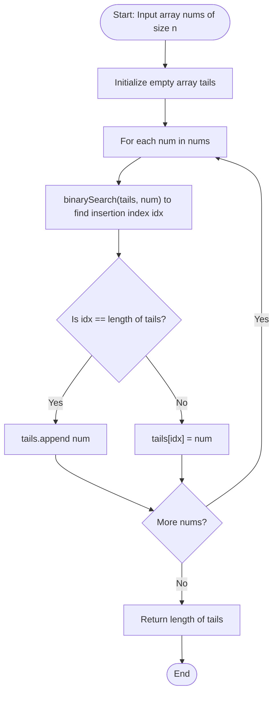

# Longest Increasing Subsequence (Dynamic Programming & Binary Search)

## 1. Introduction

The **Longest Increasing Subsequence (LIS)** problem is a classic optimization problem in computer science. Given an array of numbers `nums[]` of length $n$, the goal is to find the length of the longest subsequence such that all elements in the subsequence are sorted in **strictly increasing** order.

A **subsequence** is derived from an array by deleting zero or more elements without changing the relative order of the remaining elements.

For example, for `nums = [10, 9, 2, 5, 3, 7, 101, 18]`:
- Valid increasing subsequences include `[2, 5, 7, 101]`, `[2, 3, 7, 101]`, `[2, 5, 7, 18]`, etc.
- The maximum length of an increasing subsequence is **4**.

A naive recursive search explores all $2^n$ subsequences in $O(2^n)$ time. Dynamic Programming solves LIS in **$O(n^2)$ time**. Using **Patience Sorting with Binary Search** (or Fenwick Trees), the time complexity is optimized to **$O(n \log n)$ time**.

---

## 2. Why Use This Algorithm?

### $O(n^2)$ DP vs. $O(n \log n)$ Binary Search:
- **Standard DP ($O(n^2)$):** Intuitive 1D array approach. Excellent for learning DP state transitions and easily reconstructs the exact sequence of numbers.
- **Patience Sorting ($O(n \log n)$):** Uses Binary Search (`std::lower_bound` or `bisect_left`) to maintain a list of active minimum tail values. Solves arrays with $n = 10^5$ in a fraction of a millisecond.

**Benefits:**
- **Ultra-Fast Performance:** $O(n \log n)$ scales effortlessly to large input arrays ($n \ge 10^5$).
- **Foundation for Multi-Dimensional Sorting:** Used to solve 2D nesting problems like Russian Doll Envelopes and Box Stacking.
- **Low Memory Overhead:** Requires only $O(n)$ space.

---

## 3. Real-World Applications

- **Stock Market Trend & Momentum Analysis:** Identifying the longest upward price trajectory in financial time-series data.
- **2D / 3D Box Stacking & Russian Doll Envelopes:** Maximizing the number of nested envelopes or stackable boxes by sorting one dimension and finding LIS on the second dimension.
- **Task & Job Scheduling:** Ordering dependent jobs with non-decreasing deadlines or priorities.
- **VLSI Circuit Routing (Building Bridges):** Determining the maximum number of non-crossing wire connections between opposite pin banks.
- **Gene Sequence Alignment:** Computing monotonicity in genomic data mapping.

---

## 4. Prerequisites

Before studying Longest Increasing Subsequence, you should be familiar with:
- **1D Dynamic Programming.**
- **Binary Search (`std::lower_bound` / `bisect_left`):** Finding insertion positions in sorted arrays.
- **Patience Solitaire Card Game Concept.**

---

## 5. Visualization

### Patience Sorting Card Piles ($O(n \log n)$) for `nums = [10, 9, 2, 5, 3, 7, 101, 18]`

```
Step 1: num = 10  -> Pile 1: [10]
Step 2: num = 9   -> Pile 1: [9]   (replaces 10)
Step 3: num = 2   -> Pile 1: [2]   (replaces 9)
Step 4: num = 5   -> Pile 1: [2], Pile 2: [5]
Step 5: num = 3   -> Pile 1: [2], Pile 2: [3]   (replaces 5)
Step 6: num = 7   -> Pile 1: [2], Pile 2: [3], Pile 3: [7]
Step 7: num = 101 -> Pile 1: [2], Pile 2: [3], Pile 3: [7], Pile 4: [101]
Step 8: num = 18  -> Pile 1: [2], Pile 2: [3], Pile 3: [7], Pile 4: [18]  (replaces 101)

Number of Piles = 4  --> LIS Length = 4
```

### Mermaid Flowchart: $O(n \log n)$ Binary Search LIS Logic



---

## 6. How It Works

### Approach 1: Dynamic Programming ($O(n^2)$ Time)
Let $dp[i]$ represent the length of the longest increasing subsequence ending at index $i$.

- **Base Case:** $dp[i] = 1$ for all $i$ (each element alone forms an LIS of length 1).
- **State Transition:** For each $i$ from $0$ to $n-1$, loop $j$ from $0$ to $i-1$:
  $$\text{If } \text{nums}[j] < \text{nums}[i]: \quad dp[i] = \max(dp[i], \, 1 + dp[j])$$
- **Final Result:** $\max_{0 \le i < n} dp[i]$.

### Approach 2: Patience Sorting + Binary Search ($O(n \log n)$ Time)
Maintain an array `tails[]` where `tails[i]` stores the **smallest tail element** of all increasing subsequences of length $i+1$ found so far.

- For each `x` in `nums`:
  - Use **Binary Search** (`lower_bound`) to find the first element in `tails` that is $\ge x$.
  - If `x` is larger than all elements in `tails`, append `x` to `tails` (LIS length increases by 1).
  - Otherwise, replace the element at the found index with `x`.
- **Final Result:** The length of `tails` is the length of LIS.

> **Note:** The `tails` array does **not** represent the actual LIS sequence itself; it only stores the optimal tail boundaries for each length.

---

## 7. Step-by-Step Algorithm

### $O(n \log n)$ Patience Binary Search Algorithm:
1. Input: Array `nums[]` of length $n$.
2. Create an empty array `tails`.
3. Loop through each number `x` in `nums`:
   a. Perform Binary Search to find insertion index `idx` in `tails` where `tails[idx] >= x`.
   b. If `idx == tails.length`:
      - Append `x` to `tails`.
   c. Else:
      - Set `tails[idx] = x`.
4. Return `tails.length`.

### LIS Sequence Reconstruction ($O(n^2)$ Approach):
1. Maintain a `parent[]` array initialized to `-1`.
2. Whenever `dp[i]` is updated to `1 + dp[j]`, set `parent[i] = j`.
3. Track index `maxIdx` where `dp[i]` achieved its maximum.
4. Backtrack from `maxIdx` using `parent` pointers to collect all LIS elements in reverse.

---

## 8. Pseudocode

### $O(n^2)$ Dynamic Programming Pseudocode
```text
function LIS_DP(nums):
    n = length(nums)
    create array dp of size n filled with 1

    maxLIS = 1
    for i from 1 to n - 1:
        for j from 0 to i - 1:
            if nums[j] < nums[i]:
                dp[i] = max(dp[i], 1 + dp[j])
        maxLIS = max(maxLIS, dp[i])

    return maxLIS
```

### $O(n \log n)$ Patience Binary Search Pseudocode
```text
function LIS_BinarySearch(nums):
    create empty array tails

    for x in nums:
        left = 0
        right = length(tails) - 1
        idx = length(tails)

        while left <= right:
            mid = left + (right - left) / 2
            if tails[mid] >= x:
                idx = mid
                right = mid - 1
            else:
                left = mid + 1

        if idx == length(tails):
            tails.append(x)
        else:
            tails[idx] = x

    return length(tails)
```

---

## 9. Code Examples

### C
```c
#include <stdio.h>
#include <stdlib.h>

// O(n^2) DP Approach with Sequence Reconstruction
int lis_dp(int nums[], int n) {
    if (n == 0) return 0;
    
    int* dp = (int*)malloc(n * sizeof(int));
    int* parent = (int*)malloc(n * sizeof(int));

    for (int i = 0; i < n; i++) {
        dp[i] = 1;
        parent[i] = -1;
    }

    int maxLen = 1;
    int maxIdx = 0;

    for (int i = 1; i < n; i++) {
        for (int j = 0; j < i; j++) {
            if (nums[j] < nums[i] && dp[j] + 1 > dp[i]) {
                dp[i] = dp[j] + 1;
                parent[i] = j;
            }
        }
        if (dp[i] > maxLen) {
            maxLen = dp[i];
            maxIdx = i;
        }
    }

    printf("LIS Length (DP): %d\n", maxLen);
    printf("LIS Sequence: ");

    int* seq = (int*)malloc(maxLen * sizeof(int));
    int curr = maxIdx;
    for (int k = maxLen - 1; k >= 0; k--) {
        seq[k] = nums[curr];
        curr = parent[curr];
    }
    for (int k = 0; k < maxLen; k++) printf("%d ", seq[k]);
    printf("\n");

    free(dp);
    free(parent);
    free(seq);
    return maxLen;
}

// O(n log n) Patience Binary Search Approach
int lis_binary_search(int nums[], int n) {
    if (n == 0) return 0;

    int* tails = (int*)malloc(n * sizeof(int));
    int len = 0;

    for (int i = 0; i < n; i++) {
        int x = nums[i];
        int left = 0, right = len - 1, idx = len;

        while (left <= right) {
            int mid = left + (right - left) / 2;
            if (tails[mid] >= x) {
                idx = mid;
                right = mid - 1;
            } else {
                left = mid + 1;
            }
        }

        tails[idx] = x;
        if (idx == len) len++;
    }

    free(tails);
    return len;
}

int main() {
    int nums[] = {10, 9, 2, 5, 3, 7, 101, 18};
    int n = sizeof(nums) / sizeof(nums[0]);

    lis_dp(nums, n);
    printf("LIS Length (Binary Search): %d\n", lis_binary_search(nums, n));
    return 0;
}
```

### C++
```cpp
#include <iostream>
#include <vector>
#include <algorithm>

using namespace std;

class LongestIncreasingSubsequence {
public:
    // O(n log n) Time, O(n) Space using std::lower_bound
    static int lengthOfLIS(const vector<int>& nums) {
        vector<int> tails;

        for (int x : nums) {
            auto it = lower_bound(tails.begin(), tails.end(), x);
            if (it == tails.end()) {
                tails.push_back(x);
            } else {
                *it = x;
            }
        }
        return tails.size();
    }

    // O(n^2) DP with Full Sequence Reconstruction
    static vector<int> getLISSequence(const vector<int>& nums) {
        int n = nums.size();
        if (n == 0) return {};

        vector<int> dp(n, 1);
        vector<int> parent(n, -1);
        int maxLen = 1, maxIdx = 0;

        for (int i = 1; i < n; ++i) {
            for (int j = 0; j < i; ++j) {
                if (nums[j] < nums[i] && dp[j] + 1 > dp[i]) {
                    dp[i] = dp[j] + 1;
                    parent[i] = j;
                }
            }
            if (dp[i] > maxLen) {
                maxLen = dp[i];
                maxIdx = i;
            }
        }

        vector<int> seq(maxLen);
        int curr = maxIdx;
        for (int k = maxLen - 1; k >= 0; --k) {
            seq[k] = nums[curr];
            curr = parent[curr];
        }
        return seq;
    }
};

int main() {
    vector<int> nums = {10, 9, 2, 5, 3, 7, 101, 18};

    cout << "LIS Length (Binary Search): " << LongestIncreasingSubsequence::lengthOfLIS(nums) << endl;

    vector<int> seq = LongestIncreasingSubsequence::getLISSequence(nums);
    cout << "LIS Sequence: ";
    for (int x : seq) cout << x << " ";
    cout << endl;

    return 0;
}
```

### Java
```java
import java.util.ArrayList;
import java.util.Arrays;

public class LongestIncreasingSubsequence {

    // O(n log n) Binary Search Approach
    public static int lengthOfLIS(int[] nums) {
        int[] tails = new int[nums.length];
        int len = 0;

        for (int x : nums) {
            int left = 0, right = len - 1;
            while (left <= right) {
                int mid = left + (right - left) / 2;
                if (tails[mid] >= x) {
                    right = mid - 1;
                } else {
                    left = mid + 1;
                }
            }
            tails[left] = x;
            if (left == len) {
                len++;
            }
        }
        return len;
    }

    public static void main(String[] args) {
        int[] nums = {10, 9, 2, 5, 3, 7, 101, 18};
        System.out.println("LIS Length (Binary Search): " + lengthOfLIS(nums));
    }
}
```

### Python
```python
import bisect

def length_of_lis(nums: list[int]) -> int:
    """Computes LIS length in O(n log n) time using bisect_left."""
    tails = []

    for x in nums:
        idx = bisect.bisect_left(tails, x)
        if idx == len(tails):
            tails.append(x)
        else:
            tails[idx] = x

    return len(tails)

def get_lis_sequence(nums: list[int]) -> tuple[int, list[int]]:
    """O(n^2) DP approach with exact sequence reconstruction."""
    n = len(nums)
    if n == 0:
        return 0, []

    dp = [1] * n
    parent = [-1] * n
    max_len, max_idx = 1, 0

    for i in range(1, n):
        for j in range(i):
            if nums[j] < nums[i] and dp[j] + 1 > dp[i]:
                dp[i] = dp[j] + 1
                parent[i] = j
        if dp[i] > max_len:
            max_len = dp[i]
            max_idx = i

    seq = []
    curr = max_idx
    while curr != -1:
        seq.append(nums[curr])
        curr = parent[curr]
    seq.reverse()

    print(f"LIS Length: {max_len}")
    print(f"LIS Sequence: {seq}")
    return max_len, seq

if __name__ == "__main__":
    nums = [10, 9, 2, 5, 3, 7, 101, 18]

    print(f"LIS Length (Binary Search): {length_of_lis(nums)}")
    get_lis_sequence(nums)
```

### JavaScript
```javascript
/**
 * O(n log n) Patience Binary Search LIS Implementation
 * @param {number[]} nums 
 * @returns {number}
 */
function lengthOfLIS(nums) {
    const tails = [];

    for (const x of nums) {
        let left = 0;
        let right = tails.length - 1;
        let idx = tails.length;

        while (left <= right) {
            const mid = Math.floor(left + (right - left) / 2);
            if (tails[mid] >= x) {
                idx = mid;
                right = mid - 1;
            } else {
                left = mid + 1;
            }
        }

        if (idx === tails.length) {
            tails.push(x);
        } else {
            tails[idx] = x;
        }
    }

    return tails.length;
}

// Execution and testing
const nums = [10, 9, 2, 5, 3, 7, 101, 18];
console.log("LIS Length (Binary Search):", lengthOfLIS(nums));
```

---

## 10. Code Explanation

1. **`tails` Array Role:** `tails[i]` stores the smallest end element of all increasing subsequences of length $i+1$. Maintaining the smallest possible tail maximizes the opportunity for subsequent larger numbers to extend the subsequence.
2. **Binary Search (`lower_bound` / `bisect_left`):** Locates the first position in `tails` where `tails[idx] >= x` in $O(\log n)$ time.
3. **Tail Replacement vs Extension:**
   - If `x` is larger than all elements in `tails`, it extends the maximum length by 1.
   - If `x` can replace an existing larger tail, replacing it creates a lower threshold for future numbers without reducing the current max length.
4. **Sequence Reconstruction:** Standard DP $O(n^2)$ records `parent[i] = j` whenever $dp[i]$ is extended, enabling linear backtracking from `maxIdx` to extract the exact numbers.

---

## 11. Interactive Demo

An interactive LIS visualizer includes:
- **Card Deck Simulator:** Represents array numbers as playing cards being dealt into Patience Solitaire piles.
- **Active Tails Bar:** Displays the contents of the `tails` array updating dynamically with Binary Search pointer indicators (Left, Right, Mid).
- **Sequence Reconstruction Tree:** Highlights the parent links connecting numbers in the optimal LIS path.

---

## 12. Dry Run

### Sample Input: `nums = [10, 9, 2, 5, 3, 7, 101, 18]`

### Binary Search (`tails`) Step-by-Step Trace:

| Step | `x` | `tails` Array State | Binary Search Action | LIS Len |
|:---:|:---:|:---|:---|:---:|
| **1** | 10 | `[10]` | `10 > empty` $\rightarrow$ Append 10 | 1 |
| **2** | 9 | `[9]` | `9 < 10` $\rightarrow$ Replace index 0 | 1 |
| **3** | 2 | `[2]` | `2 < 9` $\rightarrow$ Replace index 0 | 1 |
| **4** | 5 | `[2, 5]` | `5 > 2` $\rightarrow$ Append 5 | 2 |
| **5** | 3 | `[2, 3]` | `3 < 5` $\rightarrow$ Replace index 1 | 2 |
| **6** | 7 | `[2, 3, 7]` | `7 > 3` $\rightarrow$ Append 7 | 3 |
| **7** | 101 | `[2, 3, 7, 101]` | `101 > 7` $\rightarrow$ Append 101 | 4 |
| **8** | 18 | `[2, 3, 7, 18]` | `18 < 101` $\rightarrow$ Replace index 3 | 4 |

**Final Result:** `tails.length` = **4** (LIS Sequence: `[2, 3, 7, 101]` or `[2, 3, 7, 18]`).

---

## 13. Time & Space Complexity Analysis

| Algorithm Variant | Time Complexity | Space Complexity | Supports Sequence Reconstruction? |
|:---|:---:|:---:|:---:|
| **Naive Recursion** | $O(2^n)$ | $O(n)$ | Yes |
| **1D Dynamic Programming** | $O(n^2)$ | $O(n)$ | **Yes (via parent array)** |
| **Patience Binary Search** | **$O(n \log n)$** | **$O(n)$** | Requires extra index tracking |
| **Fenwick / Segment Tree** | **$O(n \log n)$** | **$O(n)$** | Yes |

---

## 14. Advantages

- **Optimal Asymptotic Speed:** $O(n \log n)$ runs in milliseconds even for $n = 10^5$.
- **Minimal Auxiliary Memory:** Takes only $O(n)$ space.
- **Highly Adaptable:** Extends seamlessly to non-decreasing subsequences, 2D nesting, and 3D stacking problems.

---

## 15. Disadvantages

- **`tails` Array Is Not the Sequence:** The `tails` array does NOT store the actual LIS numbers in order; reconstructing the exact sequence requires maintaining a secondary index tracking array.
- **Abstract Logic:** Patience sorting logic is less intuitive than standard 1D DP.

---

## 16. Variations & Advanced Optimizations

1. **Longest Non-Decreasing Subsequence ($nums[j] \le nums[i]$):**
   Change `lower_bound` ($\ge$) to `upper_bound` ($>$).
2. **Number of Longest Increasing Subsequences (LeetCode 673):**
   Maintain a `count[]` array alongside $dp[]$ to sum path frequencies.
3. **Russian Doll Envelopes (LeetCode 354):**
   Sort envelopes by width ascending; if widths are equal, sort height descending. Then run 1D LIS on heights in $O(n \log n)$ time.

---

## 17. Common Mistakes & Pitfalls

- **Confusing `tails` Array with actual LIS Sequence:** Assuming `tails` contains the LIS sequence elements (e.g. `tails` could end up as `[2, 3, 7, 18]` when valid sequence was `[2, 3, 7, 101]`).
- **Strictly Increasing ($<$) vs Non-Decreasing ($\le$):** Using `lower_bound` vs `upper_bound` incorrectly.
- **Linear Search in `tails` Array:** Using $O(n)$ search inside the tail loop, destroying the $O(n \log n)$ speed advantage down to $O(n^2)$.

---

## 18. Interview Questions

1. **What is the time complexity of the optimal LIS algorithm, and how is it achieved?**
   *Answer:* $O(n \log n)$ time, achieved by combining Patience Sorting with Binary Search (`lower_bound`) on active tail elements.

2. **Does the `tails` array in $O(n \log n)$ LIS represent the actual LIS sequence?**
   *Answer:* No. It only stores the minimum tail elements for each length to allow optimal future extensions.

3. **How do you adapt LIS to solve the Russian Doll Envelopes problem?**
   *Answer:* Sort envelopes by width ascending, and by height **descending** for equal widths. Then find LIS on the height array in $O(n \log n)$ time.

4. **How do you change LIS to allow duplicate values (Longest Non-Decreasing Subsequence)?**
   *Answer:* Replace `lower_bound` (which searches $\ge x$) with `upper_bound` (which searches $> x$).

5. **Why do we sort heights descending when widths are equal in Russian Doll Envelopes?**
   *Answer:* Sorting heights descending prevents picking multiple envelopes with identical widths, enforcing strict 2D nesting.

6. **What is the space complexity of LIS?**
   *Answer:* $O(n)$ space for storing the DP or `tails` array.

7. **How can Fenwick Trees (BIT) solve LIS in $O(n \log n)$ time?**
   *Answer:* Coordinate-compress the numbers, then use a Fenwick tree to query the max LIS value in range $[1, x-1]$ and update point $x$.

8. **What is the base case of 1D DP LIS?**
   *Answer:* $dp[i] = 1$ for all $0 \le i < n$.

9. **What is the time complexity of LIS if the input array is already sorted?**
   *Answer:* $O(n \log n)$ using binary search, or $O(n)$ if simple check is added.

10. **How many distinct LIS sequences can exist in `[1, 3, 5, 4, 7]`?**
    *Answer:* Two LIS sequences of length 4: `[1, 3, 5, 7]` and `[1, 3, 4, 7]`.

---

## 19. Practice Problems

### Easy
1. **LeetCode 300:** [Longest Increasing Subsequence](https://leetcode.com/problems/longest-increasing-subsequence/) - Standard LIS formulation.

### Medium
2. **LeetCode 673:** [Number of Longest Increasing Subsequence](https://leetcode.com/problems/number-of-longest-increasing-subsequence/) - Counting distinct LIS combinations.
3. **LeetCode 646:** [Maximum Length of Pair Chain](https://leetcode.com/problems/maximum-length-of-pair-chain/) - Interval LIS variant.

### Hard
4. **LeetCode 354:** [Russian Doll Envelopes](https://leetcode.com/problems/russian-doll-envelopes/) - 2D LIS sorting challenge.
5. **LeetCode 1691:** [Maximum Height by Stacking Cuboids](https://leetcode.com/problems/maximum-height-by-stacking-cuboids/) - 3D LIS rotation DP.

---

## 20. Related Algorithms

- **Patience Sorting:** Card sorting algorithm foundation for $O(n \log n)$ LIS.
- **Longest Common Subsequence (LCS):** Finding shared subsequences across two strings.
- **Fenwick Tree (Binary Indexed Tree):** Range query data structure for fast LIS update.

---

## 21. Summary

The Longest Increasing Subsequence Problem is a benchmark problem demonstrating the transition from $O(n^2)$ Dynamic Programming to **$O(n \log n)$ Patience Binary Search**. By maintaining a `tails` array of minimum end values, LIS evaluates large datasets efficiently in $O(n \log n)$ time and $O(n)$ space.

---

## 22. Quiz

**Question 1:** What is the time complexity of optimal LIS using Binary Search?
- A) $O(n)$
- B) $O(n \log n)$
- C) $O(n^2)$
- D) $O(2^n)$
- **Correct Answer:** B
- **Explanation:** Patience Sorting + Binary Search processes each of $n$ elements in $O(\log n)$ time $\rightarrow O(n \log n)$.

**Question 2:** What does `tails[i]` store in the $O(n \log n)$ LIS algorithm?
- A) The maximum element of the array
- B) The smallest tail element of all increasing subsequences of length $i+1$
- C) The count of prime numbers
- D) The sum of all elements
- **Correct Answer:** B
- **Explanation:** `tails[i]` holds the smallest tail value for length $i+1$, maximizing future extension opportunities.

**Question 3:** What standard C++ function performs binary search for insertion in `tails`?
- A) `std::binary_search`
- B) `std::lower_bound`
- C) `std::find`
- D) `std::sort`
- **Correct Answer:** B
- **Explanation:** `std::lower_bound` finds the first element $\ge x$ in logarithmic time.

**Question 4:** Does the `tails` array directly represent the final LIS sequence?
- A) Yes, always
- B) No, it only stores optimal tail boundaries for each length
- C) Only for even numbers
- D) Only if the array is pre-sorted
- **Correct Answer:** B
- **Explanation:** `tails` elements can be overwritten out of order during execution; reconstructing the exact sequence requires a parent tracking array.

**Question 5:** What is the LIS length for `nums = [10, 9, 2, 5, 3, 7, 101, 18]`?
- A) 3
- B) 4
- C) 5
- D) 6
- **Correct Answer:** B
- **Explanation:** An optimal LIS is `[2, 3, 7, 101]` (Length 4).

**Question 6:** How should envelopes be sorted by height when widths are equal in Russian Doll Envelopes?
- A) Height ascending
- B) Height descending
- C) Random height
- D) Do not sort height
- **Correct Answer:** B
- **Explanation:** Sorting height descending prevents selecting multiple envelopes with identical widths.

**Question 7:** What is the base case initialization for 1D DP LIS array?
- A) `dp[i] = 0`
- B) `dp[i] = 1`
- C) `dp[i] = i`
- D) `dp[i] = -1`
- **Correct Answer:** B
- **Explanation:** Each single element forms an increasing subsequence of length 1.

**Question 8:** What function replaces `lower_bound` when computing Longest Non-Decreasing Subsequence?
- A) `std::upper_bound`
- B) `std::max`
- C) `std::min`
- D) `std::accumulate`
- **Correct Answer:** A
- **Explanation:** `upper_bound` finds the first element $> x$, allowing equal values ($\le$) to extend the subsequence.

**Question 9:** What is the space complexity of LIS?
- A) $O(1)$
- B) $O(\log n)$
- C) $O(n)$
- D) $O(n^2)$
- **Correct Answer:** C
- **Explanation:** Maintains a 1D DP or `tails` array of size $n$.

**Question 10:** What card game inspires the $O(n \log n)$ LIS algorithm?
- A) Poker
- B) Patience Solitaire
- C) Blackjack
- D) Bridge
- **Correct Answer:** B
- **Explanation:** Patience Sorting places cards into piles according to Solitaire rules.
