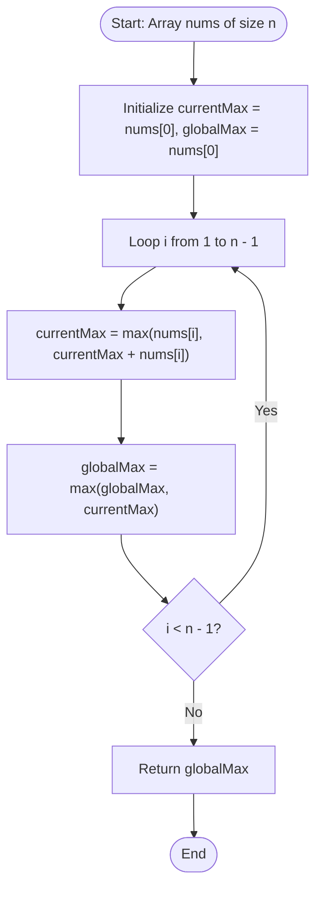

# Kadane's Algorithm (Maximum Subarray Sum - Dynamic Programming)

## 1. Introduction

**Kadane's Algorithm** is an elegant linear-time algorithm created by Joseph Born Kadane in 1984. Given a 1D array of numbers `nums[]` containing positive, negative, and zero values, the objective is to find the **contiguous subarray** that has the **maximum possible sum** and return that sum.

A **subarray** is a contiguous part of an array. For example, in `nums = [-2, 1, -3, 4, -1, 2, 1, -5, 4]`:
- The contiguous subarray `[4, -1, 2, 1]` yields the maximum sum: $4 + (-1) + 2 + 1 = \mathbf{6}$.

While naive brute-force checks all $O(n^2)$ subarrays in $O(n^3)$ or $O(n^2)$ time using prefix sums, Kadane's Algorithm solves the Maximum Subarray problem in **$O(n)$ linear time** and **$O(1)$ constant auxiliary space** in a single pass.

---

## 2. Why Use This Algorithm?

### Linear $O(n)$ vs. Quadratic $O(n^2)$ Complexity:
For an array of $n = 10^6$ elements:
- **Brute Force / Prefix Sum ($O(n^2)$):** Takes $10^{12}$ operations—minutes or hours to complete.
- **Kadane's Algorithm ($O(n)$):** Takes $10^6$ operations—executes in less than 2 milliseconds.

**Benefits:**
- **Optimal Time Efficiency:** Processes each array element exactly once in a single pass.
- **Constant Memory Footprint:** Operates in $O(1)$ auxiliary space without allocating extra arrays.
- **Streaming Compatibility:** Works on continuous data streams where full history cannot be stored.
- **Easy Index Tracking:** Readily tracks the exact starting and ending indices of the optimal subarray.

---

## 3. Real-World Applications

- **Stock Market Maximum Profit Analysis:** Finding the optimal contiguous time window to buy and sell stocks to maximize cumulative returns.
- **Genomic Sequence Analysis:** Locating high-density GC-content regions or continuous gene segments in DNA strands.
- **Signal Processing & Peak Window Detection:** Identifying high-energy contiguous signal windows in audio/radio frequency streams.
- **Computer Vision & Image Processing (2D Kadane's):** Finding the brightest rectangular sub-region or object bounding box in grayscale image matrices.
- **Web Analytics & Traffic Streak Analysis:** Identifying peak continuous server activity windows during high-load events.

---

## 4. Prerequisites

Before studying Kadane's Algorithm, you should be familiar with:
- **1D Array Traversal.**
- **Difference between Subarray (contiguous) and Subsequence (non-contiguous).**
- **Basic Concept of Dynamic Programming State Updates.**

---

## 5. Visualization

### Kadane's Local Choice Decision at Element `nums[i]`

```
For each element nums[i]:
  Option 1: Extend current running subarray -> (current_max + nums[i])
  Option 2: Start a brand-new subarray     -> nums[i]

Choice: current_max = MAX( nums[i], current_max + nums[i] )
```

### Trace Visualization for `nums = [-2, 1, -3, 4, -1, 2, 1, -5, 4]`

```
Index:         0     1     2     3     4     5     6     7     8
Value:        -2     1    -3     4    -1     2     1    -5     4
------------------------------------------------------------------
current_max:  -2     1    -2     4     3     5     6     1     5
global_max:   -2     1     1     4     4     5     [6]   6     6

Max Subarray: [4, -1, 2, 1]  --> Sum = 6
```

### Mermaid Flowchart: Kadane's Algorithm State Transitions



---

## 6. How It Works

Kadane's Algorithm operates on a key DP insight: **At index $i$, the maximum subarray ending at $i$ is either the element $\text{nums}[i]$ itself, or the element $\text{nums}[i]$ appended to the maximum subarray ending at index $i-1$.**

### State Variables:
1. `current_max`: Maximum sum of the contiguous subarray ending at the current index $i$.
2. `global_max`: Maximum sum found anywhere across the entire array so far.

### State Transition Formula:
$$\text{current\_max} = \max(\text{nums}[i], \, \text{current\_max} + \text{nums}[i])$$
$$\text{global\_max} = \max(\text{global\_max}, \, \text{current\_max})$$

If `current_max + nums[i]` is less than `nums[i]` (which happens when `current_max` becomes negative), we drop the previous sub-chain and start a fresh subarray at `nums[i]`.

---

## 7. Step-by-Step Algorithm

### Kadane's Algorithm with Index Reconstruction:
1. Input: Array `nums[]` of length $n$.
2. Initialize `currentMax = nums[0]`, `globalMax = nums[0]`.
3. Initialize index pointers: `start = 0`, `end = 0`, `tempStart = 0`.
4. Loop `i` from $1$ to $n-1$:
   a. If `nums[i] > currentMax + nums[i]`:
      - `currentMax = nums[i]`
      - `tempStart = i` (Start a new candidate subarray)
   b. Else:
      - `currentMax = currentMax + nums[i]`
   c. If `currentMax > globalMax`:
      - `globalMax = currentMax`
      - `start = tempStart`
      - `end = i`
5. Return `globalMax` and the subarray slice `nums[start ... end]`.

---

## 8. Pseudocode

### Basic Kadane's Pseudocode
```text
function maxSubArray(nums):
    currentMax = nums[0]
    globalMax = nums[0]

    for i from 1 to length(nums) - 1:
        currentMax = max(nums[i], currentMax + nums[i])
        globalMax = max(globalMax, currentMax)

    return globalMax
```

### Kadane's with Subarray Index Tracking Pseudocode
```text
function maxSubArrayWithIndices(nums):
    currentMax = nums[0]
    globalMax = nums[0]
    start = 0
    end = 0
    tempStart = 0

    for i from 1 to length(nums) - 1:
        if nums[i] > currentMax + nums[i]:
            currentMax = nums[i]
            tempStart = i
        else:
            currentMax = currentMax + nums[i]

        if currentMax > globalMax:
            globalMax = currentMax
            start = tempStart
            end = i

    print "Subarray bounds:", start, "to", end
    return globalMax
```

---

## 9. Code Examples

### C
```c
#include <stdio.h>
#include <limits.h>

int max(int a, int b) {
    return (a > b) ? a : b;
}

// Kadane's Algorithm with Index Reconstruction
int maxSubArray(int nums[], int n) {
    int currentMax = nums[0];
    int globalMax = nums[0];

    int start = 0, end = 0, tempStart = 0;

    for (int i = 1; i < n; i++) {
        if (nums[i] > currentMax + nums[i]) {
            currentMax = nums[i];
            tempStart = i;
        } else {
            currentMax += nums[i];
        }

        if (currentMax > globalMax) {
            globalMax = currentMax;
            start = tempStart;
            end = i;
        }
    }

    printf("Maximum Subarray Sum: %d\n", globalMax);
    printf("Subarray Elements: [ ");
    for (int i = start; i <= end; i++) {
        printf("%d ", nums[i]);
    }
    printf("]\n");

    return globalMax;
}

int main() {
    int nums[] = {-2, 1, -3, 4, -1, 2, 1, -5, 4};
    int n = sizeof(nums) / sizeof(nums[0]);

    maxSubArray(nums, n);
    return 0;
}
```

### C++
```cpp
#include <iostream>
#include <vector>
#include <algorithm>

using namespace std;

class KadanesAlgorithm {
public:
    // Standard O(n) Time, O(1) Space Kadane's Algorithm
    static int maxSubArray(const vector<int>& nums) {
        int currentMax = nums[0];
        int globalMax = nums[0];

        for (size_t i = 1; i < nums.size(); ++i) {
            currentMax = max(nums[i], currentMax + nums[i]);
            globalMax = max(globalMax, currentMax);
        }
        return globalMax;
    }

    // Kadane's Algorithm with Subarray Extraction
    static pair<int, vector<int>> getMaximumSubarray(const vector<int>& nums) {
        int currentMax = nums[0];
        int globalMax = nums[0];
        int start = 0, end = 0, tempStart = 0;

        for (size_t i = 1; i < nums.size(); ++i) {
            if (nums[i] > currentMax + nums[i]) {
                currentMax = nums[i];
                tempStart = i;
            } else {
                currentMax += nums[i];
            }

            if (currentMax > globalMax) {
                globalMax = currentMax;
                start = tempStart;
                end = i;
            }
        }

        vector<int> subarray(nums.begin() + start, nums.begin() + end + 1);
        return {globalMax, subarray};
    }
};

int main() {
    vector<int> nums = {-2, 1, -3, 4, -1, 2, 1, -5, 4};

    cout << "Max Subarray Sum: " << KadanesAlgorithm::maxSubArray(nums) << endl;

    auto [maxSum, sub] = KadanesAlgorithm::getMaximumSubarray(nums);
    cout << "Subarray Elements: [ ";
    for (int x : sub) cout << x << " ";
    cout << "]" << endl;

    return 0;
}
```

### Java
```java
import java.util.Arrays;

public class KadanesAlgorithm {

    // Standard Kadane's Algorithm
    public static int maxSubArray(int[] nums) {
        int currentMax = nums[0];
        int globalMax = nums[0];

        for (int i = 1; i < nums.length; i++) {
            currentMax = Math.max(nums[i], currentMax + nums[i]);
            globalMax = Math.max(globalMax, currentMax);
        }
        return globalMax;
    }

    public static void main(String[] args) {
        int[] nums = {-2, 1, -3, 4, -1, 2, 1, -5, 4};
        System.out.println("Maximum Subarray Sum: " + maxSubArray(nums));
    }
}
```

### Python
```python
def max_sub_array(nums: list[int]) -> int:
    """Standard O(n) time, O(1) space Kadane's Algorithm."""
    current_max = nums[0]
    global_max = nums[0]

    for i in range(1, len(nums)):
        current_max = max(nums[i], current_max + nums[i])
        global_max = max(global_max, current_max)

    return global_max

def get_maximum_subarray(nums: list[int]) -> tuple[int, list[int]]:
    """Kadane's Algorithm with exact subarray element extraction."""
    current_max = nums[0]
    global_max = nums[0]
    start = end = temp_start = 0

    for i in range(1, len(nums)):
        if nums[i] > current_max + nums[i]:
            current_max = nums[i]
            temp_start = i
        else:
            current_max += nums[i]

        if current_max > global_max:
            global_max = current_max
            start = temp_start
            end = i

    subarray = nums[start : end + 1]
    print(f"Maximum Subarray Sum: {global_max}")
    print(f"Subarray Elements: {subarray}")
    return global_max, subarray

if __name__ == "__main__":
    nums = [-2, 1, -3, 4, -1, 2, 1, -5, 4]
    max_sub_array(nums)
    get_maximum_subarray(nums)
```

### JavaScript
```javascript
/**
 * Kadane's Algorithm Implementation
 * @param {number[]} nums 
 * @returns {number}
 */
function maxSubArray(nums) {
    let currentMax = nums[0];
    let globalMax = nums[0];

    for (let i = 1; i < nums.length; i++) {
        currentMax = Math.max(nums[i], currentMax + nums[i]);
        globalMax = Math.max(globalMax, currentMax);
    }
    return globalMax;
}

// Execution and testing
const nums = [-2, 1, -3, 4, -1, 2, 1, -5, 4];
console.log("Maximum Subarray Sum:", maxSubArray(nums));
```

---

## 10. Code Explanation

1. **Initialization (`nums[0]`):** Both `currentMax` and `globalMax` are initialized to `nums[0]`. This correctly handles arrays consisting entirely of negative numbers (e.g. `[-5, -2, -8] \rightarrow \text{Max} = -2$).
2. **Local Choice Decision (`max(nums[i], currentMax + nums[i])`):**
   - If extending the existing running sum (`currentMax + nums[i]`) yields a higher value, we extend it.
   - If the previous `currentMax` was negative, `currentMax + nums[i]` is smaller than `nums[i]`, so we drop the old subarray and start fresh at `nums[i]`.
3. **Global Peak Update (`globalMax = max(globalMax, currentMax)`):** Keeps track of the maximum sum observed anywhere during the pass.
4. **Pointer Tracking:** Setting `tempStart = i` whenever a new subarray is started allows exact $O(1)$ tracking of starting and ending boundaries.

---

## 11. Interactive Demo

An interactive Kadane's visualizer includes:
- **Array Bar Chart:** Visualizes positive values as green bars and negative values as red bars.
- **Sliding Window Highlight:** A moving box framing the active subarray (`start` to `i`).
- **Live Local vs. Global Meter:** Real-time gauges displaying `currentMax` resetting and `globalMax` locking in peak records.

---

## 12. Dry Run

### Sample Input: `nums = [-2, 1, -3, 4, -1, 2, 1, -5, 4]`

### Step-by-Step State Evolution Table:

| Index $i$ | `nums[i]` | `currentMax + nums[i]` | `currentMax` Chosen | `tempStart` | `globalMax` | `(start, end)` | Active Subarray |
|:---:|:---:|:---:|:---:|:---:|:---:|:---:|:---|
| **0** | -2 | - | **-2** | 0 | **-2** | $(0, 0)$ | `[-2]` |
| **1** | 1 | $-2 + 1 = -1$ | **1** (Reset) | 1 | **1** | $(1, 1)$ | `[1]` |
| **2** | -3 | $1 - 3 = -2$ | **-2** | 1 | **1** | $(1, 1)$ | `[1, -3]` |
| **3** | 4 | $-2 + 4 = 2$ | **4** (Reset) | 3 | **4** | $(3, 3)$ | `[4]` |
| **4** | -1 | $4 - 1 = 3$ | **3** | 3 | **4** | $(3, 3)$ | `[4, -1]` |
| **5** | 2 | $3 + 2 = 5$ | **5** | 3 | **5** | $(3, 5)$ | `[4, -1, 2]` |
| **6** | 1 | $5 + 1 = 6$ | **6** | 3 | **6** | $(3, 6)$ | **`[4, -1, 2, 1]`** |
| **7** | -5 | $6 - 5 = 1$ | **1** | 3 | **6** | $(3, 6)$ | `[4, -1, 2, 1, -5]` |
| **8** | 4 | $1 + 4 = 5$ | **5** | 3 | **6** | $(3, 6)$ | `[4, -1, 2, 1, -5, 4]` |

**Final Result:** `globalMax` = **6**, Optimal Subarray = `[4, -1, 2, 1]`.

---

## 13. Time & Space Complexity Analysis

| Approach | Time Complexity | Auxiliary Space | Single Pass? |
|:---|:---:|:---:|:---:|
| **Triple Loop Brute Force** | $O(n^3)$ | $O(1)$ | No |
| **Prefix Sum Array** | $O(n^2)$ | $O(n)$ | No |
| **Divide & Conquer** | $O(n \log n)$ | $O(\log n)$ | No |
| **Kadane's Algorithm** | **$O(n)$** | **$O(1)$** | **Yes** |

---

## 14. Advantages

- **Optimal Linear Time $O(n)$:** Solves maximum subarray sum in a single pass.
- **Constant Memory $O(1)$:** Uses no extra arrays or recursive stack frames.
- **Handles All-Negative Arrays:** Correctly identifies the single max negative element when all values are negative.
- **Streaming Data Processing:** Can process continuous data feeds without storing entire history.

---

## 15. Disadvantages

- **Contiguous Subarrays Only:** Cannot find non-contiguous maximum subsequences.
- **2D Grid Extension is $O(n^3)$:** Finding maximum sum submatrix in a 2D matrix using Kadane's takes $O(R^2 \cdot C)$ time.

---

## 16. Variations & Advanced Optimizations

1. **Maximum Product Subarray (LeetCode 152):**
   Product can turn positive when multiplying two negative numbers. We must track both `currentMin` and `currentMax` at each step.
2. **Maximum Circular Subarray Sum (LeetCode 918):**
   Subarray can wrap around ends of circular array. Result is $\max(\text{Standard Kadane}, \text{TotalSum} - \text{Minimum Kadane})$.
3. **2D Kadane's Algorithm (Max Sum Submatrix):**
   Fix top and bottom row bounds ($O(R^2)$) and compress column sums, then run 1D Kadane's ($O(C)$) $\rightarrow$ Total time **$O(R^2 \cdot C)$**.

---

## 17. Common Mistakes & Pitfalls

- **Initializing `globalMax = 0`:** Fails on arrays with all-negative elements (e.g. `[-5, -2, -8] \rightarrow$ incorrectly returns `0` instead of `-2`). Always initialize to `nums[0]`.
- **Confusing Subarray with Subsequence:** Allowing non-adjacent elements to be summed together.
- **Overwriting `start` Index Prematurely:** Updating the result `start` pointer before `currentMax` actually exceeds `globalMax`.

---

## 18. Interview Questions

1. **What is the time and space complexity of Kadane's Algorithm?**
   *Answer:* $O(n)$ time complexity and $O(1)$ auxiliary space.

2. **How does Kadane's Algorithm handle an array consisting entirely of negative numbers?**
   *Answer:* By initializing `currentMax = nums[0]` and `globalMax = nums[0]`, Kadane's selects the single largest negative number (e.g. `[-5, -2, -9] \rightarrow -2$).

3. **How do you modify Kadane's Algorithm to extract the actual starting and ending indices of the maximum subarray?**
   *Answer:* Maintain a `tempStart` pointer updated whenever `nums[i] > currentMax + nums[i]`. When `currentMax > globalMax`, update `start = tempStart` and `end = i`.

4. **How do you solve Maximum Product Subarray?**
   *Answer:* Track both `currentMax` and `currentMin` at each index because multiplying by a negative number swaps min and max.

5. **How does Kadane's Algorithm work on a circular array?**
   *Answer:* Max circular subarray sum is $\max(\text{Kadane Max}, \text{TotalSum} - \text{Kadane Min})$. (If all numbers are negative, return `Kadane Max`).

6. **What is the key DP recurrence relation of Kadane's Algorithm?**
   *Answer:* $\text{currentMax} = \max(\text{nums}[i], \text{currentMax} + \text{nums}[i])$.

7. **How is 2D Kadane's Algorithm used to find the maximum sum submatrix?**
   *Answer:* Fix upper and lower row boundaries $r_1$ and $r_2$, sum column values between rows into a 1D array, and run 1D Kadane's algorithm in $O(R^2 \cdot C)$ total time.

8. **Why does Kadane's Algorithm perform better than Divide and Conquer for this problem?**
   *Answer:* Divide and Conquer takes $O(n \log n)$ time, whereas Kadane's uses a single pass in $O(n)$ time and $O(1)$ space.

9. **Can Kadane's Algorithm be used on streaming data?**
   *Answer:* Yes, because it only requires the current incoming element and two scalar variables (`currentMax` and `globalMax`).

10. **What is the output for `nums = [5, 4, -1, 7, 8]`?**
    *Answer:* **23** (Sum of all elements).

---

## 19. Practice Problems

### Easy
1. **LeetCode 53:** [Maximum Subarray](https://leetcode.com/problems/maximum-subarray/) - Standard Kadane's Algorithm implementation.

### Medium
2. **LeetCode 152:** [Maximum Product Subarray](https://leetcode.com/problems/maximum-product-subarray/) - Variant tracking min and max product states.
3. **LeetCode 918:** [Maximum Sum Circular Subarray](https://leetcode.com/problems/maximum-sum-circular-subarray/) - Circular array wrapper.

### Hard
4. **GeeksforGeeks / LeetCode:** [Maximum Sum Rectangle in a 2D Matrix](https://practice.geeksforgeeks.org/) - 2D Kadane's Algorithm implementation.

---

## 20. Related Algorithms

- **Maximum Product Subarray:** Multiplicative state variant.
- **Maximum Circular Subarray Sum:** Circular array extension.
- **2D Kadane's Algorithm:** Submatrix sum optimization.
- **Sliding Window:** General window traversal paradigm.

---

## 21. Summary

Kadane's Algorithm is the gold standard for solving the Maximum Subarray Sum problem. By applying the single-pass state decision `currentMax = max(nums[i], currentMax + nums[i])`, Kadane's achieves optimal **$O(n)$ linear time** and **$O(1)$ space**.

---

## 22. Quiz

**Question 1:** What is the time complexity of Kadane's Algorithm?
- A) $O(n \log n)$
- B) $O(n^2)$
- C) $O(n)$
- D) $O(1)$
- **Correct Answer:** C
- **Explanation:** Kadane's processes each element in the array once in a single linear pass.

**Question 2:** What is the space complexity of Kadane's Algorithm?
- A) $O(n)$
- B) $O(1)$
- C) $O(\log n)$
- D) $O(n^2)$
- **Correct Answer:** B
- **Explanation:** Kadane's uses only two scalar variables (`currentMax` and `globalMax`).

**Question 3:** How should `globalMax` be initialized to handle arrays with all-negative numbers correctly?
- A) `globalMax = 0`
- B) `globalMax = nums[0]`
- C) `globalMax = INT_MAX`
- D) `globalMax = -1`
- **Correct Answer:** B
- **Explanation:** Initializing to `nums[0]` ensures that if all numbers are negative, the single largest negative number is returned.

**Question 4:** What is the state transition formula for `currentMax` at index $i$?
- A) `currentMax = currentMax + nums[i]`
- B) `currentMax = max(nums[i], currentMax + nums[i])`
- C) `currentMax = min(nums[i], currentMax)`
- D) `currentMax = nums[i] * currentMax`
- **Correct Answer:** B
- **Explanation:** Choice: either extend the running sum or start a new subarray at `nums[i]`.

**Question 5:** What is the maximum subarray sum for `nums = [-2, 1, -3, 4, -1, 2, 1, -5, 4]`?
- A) 4
- B) 5
- C) 6
- D) 7
- **Correct Answer:** C
- **Explanation:** The subarray `[4, -1, 2, 1]` gives sum = 6.

**Question 6:** What is the maximum subarray sum for `nums = [-5, -2, -8, -1]`?
- A) 0
- B) -1
- C) -2
- D) -16
- **Correct Answer:** B
- **Explanation:** For all-negative arrays, the maximum single element (`-1`) is the answer.

**Question 7:** How does Maximum Product Subarray differ from Kadane's Algorithm?
- A) It uses $O(n^2)$ space
- B) It tracks both `currentMin` and `currentMax` because multiplying two negative numbers creates a positive product
- C) It only works on positive numbers
- D) It uses binary search
- **Correct Answer:** B
- **Explanation:** Multiplying two negative numbers turns min into max, requiring both min and max tracking.

**Question 8:** What is the time complexity of 2D Kadane's Algorithm for finding max sum submatrix in an $N \times N$ matrix?
- A) $O(N)$
- B) $O(N^2)$
- C) $O(N^3)$
- D) $O(N^4)$
- **Correct Answer:** C
- **Explanation:** Fixing top/bottom row pairs $O(N^2)$ and running 1D Kadane's on columns $O(N)$ yields $O(N^3)$.

**Question 9:** Can Kadane's Algorithm be used to find non-contiguous subsequences?
- A) Yes, always
- B) No, it strictly finds contiguous subarrays
- C) Only for even numbers
- D) Only if pre-sorted
- **Correct Answer:** B
- **Explanation:** Kadane's evaluates contiguous subarray elements only.

**Question 10:** Who invented Kadane's Algorithm?
- A) Edsger Dijkstra
- B) Jay Kadane (1984)
- C) Donald Knuth
- D) Richard Bellman
- **Correct Answer:** B
- **Explanation:** Joseph Born (Jay) Kadane created the algorithm in 1984.
