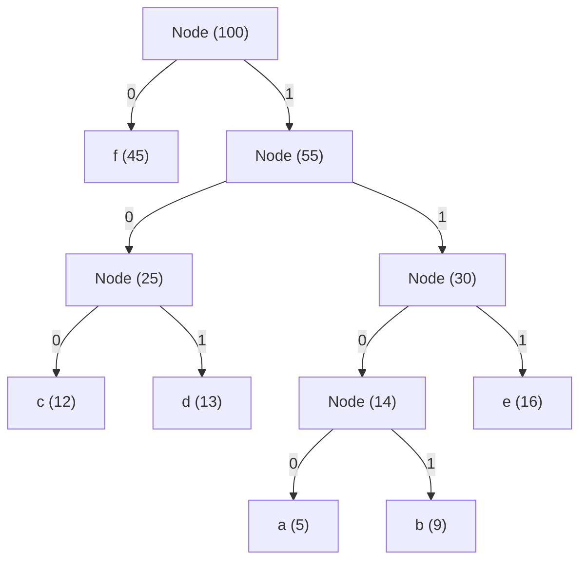

# Huffman Coding (Greedy Compression Algorithm)

## 1. Introduction

**Huffman Coding** is a landmark greedy algorithm for **lossless data compression**, invented by David A. Huffman in 1952 while he was a Ph.D. student at MIT.

Standard fixed-length encodings (such as 8-bit ASCII or 32-bit Unicode UTF-32) use the exact same number of bits for every character, regardless of how frequently it appears. Huffman Coding optimizes storage by assigning **variable-length binary codes** to characters:
- **Frequent characters** (like `'e'` or `'a'`) receive **shorter bit sequences** (e.g., `01` or `100`).
- **Rare characters** (like `'z'` or `'q'`) receive **longer bit sequences** (e.g., `110101`).

Crucially, Huffman Coding produces a **prefix-free code** (also called a prefix code), meaning **no character's bit code is a prefix of any other character's bit code**. This mathematical property ensures that an encoded string of bits can be parsed and decoded uniquely in a single left-to-right pass without needing delimiter characters or space separators.

---

## 2. Why Use This Algorithm?

### Fixed-Length vs. Variable-Length Encoding Efficiency:
Suppose we want to encode a document containing $100,000$ characters composed of only 6 unique letters (`a`, `b`, `c`, `d`, `e`, `f`) with frequencies:
- `a`: 45,000
- `b`: 13,000
- `c`: 12,000
- `d`: 16,000
- `e`: 9,000
- `f`: 5,000

1. **Fixed-Length Encoding:** Requires $\lceil \log_2 6 \rceil = 3$ bits per character. 
   $$\text{Total Bits} = 100,000 \times 3 = 300,000 \text{ bits}$$
2. **Huffman Variable-Length Encoding:** Assigns optimal prefix codes (e.g., `a: 0`, `f: 1100`, etc.).
   $$\text{Total Bits} = (45k \times 1) + (13k \times 3) + (12k \times 3) + (16k \times 3) + (9k \times 4) + (5k \times 4) = 224,000 \text{ bits}$$
   **Compression Gain:** Saves **25.3%** of storage space without losing a single bit of information!

### Key Benefits:
- **Mathematical Optimality:** Guarantees the minimum average code length among all character-by-character prefix codes for a given frequency distribution.
- **Unambiguous Decoding:** Prefix-free property eliminates parsing ambiguity during decompression.
- **Lossless Reconstruction:** Restores exact original binary data byte-for-byte.
- **Stream Friendly:** Can be extended to **Adaptive Huffman Coding** for real-time streaming data compression where character frequencies evolve over time.

---

## 3. Real-World Applications

- **File Archiving Utilities:** Forms the core entropy coding phase of compression utilities like `gzip`, `pkzip`, `7-Zip`, `bzip2`, and `tar.gz`.
- **Image Formats (JPEG):** JPEG compression converts image blocks via Discrete Cosine Transform (DCT), quantizes coefficients, and applies Huffman coding to compress the final quantized stream.
- **Audio & Video Codecs (MP3, AAC, MPEG):** MP3 and MPEG video standards use Huffman coding as the final lossless compression layer over quantized spectral data.
- **Network Protocol Header Compression (HTTP/2 HPACK):** HTTP/2 uses a pre-computed static Huffman table to compress HTTP headers (`user-agent`, `cookie`, `authorization`), significantly reducing latency over mobile networks.
- **PDF Document Compression:** PDF files use Huffman-based FlateDecode stream filters to compress embedded page structures and graphics.

---

## 4. Prerequisites

Before learning Huffman Coding, you should be comfortable with:
- **Binary Trees:** Tree nodes, left/right pointers, leaf nodes, root, and recursive tree traversals.
- **Min-Priority Queues / Min-Heaps:** Operations including `insert()` and `extractMin()` with $O(\log k)$ time complexity.
- **Hash Maps / Dictionaries:** Storing character frequencies and symbol-to-code mapping tables in $O(1)$ time.
- **Bit Manipulation (Low-level implementations):** Bitwise operators (`<<`, `>>`, `&`, `|`) and bit-buffer operations.

---

## 5. Visualization

### Step-by-Step Huffman Tree Construction

Given Character Frequencies:
`a: 5, b: 9, c: 12, d: 13, e: 16, f: 45`

```
Initial Min-Priority Queue:
[ (a:5), (b:9), (c:12), (d:13), (e:16), (f:45) ]

Step 1: Pop min nodes (a:5) and (b:9). Combine -> Node(14)
Queue: [ (c:12), (d:13), Node(14), (e:16), (f:45) ]

Step 2: Pop min nodes (c:12) and (d:13). Combine -> Node(25)
Queue: [ Node(14), (e:16), Node(25), (f:45) ]

Step 3: Pop min nodes Node(14) and (e:16). Combine -> Node(30)
Queue: [ Node(25), Node(30), (f:45) ]

Step 4: Pop min nodes Node(25) and Node(30). Combine -> Node(55)
Queue: [ (f:45), Node(55) ]

Step 5: Pop min nodes (f:45) and Node(55). Combine -> Root Node(100)
Queue: [ Root Node(100) ]
```

### Complete Huffman Tree Structure



### Generated Prefix Codes Table:
| Character | Frequency | Huffman Bit Code | Bit Length |
| :--- | :--- | :--- | :--- |
| `f` | 45 | `0` | 1 bit |
| `c` | 12 | `100` | 3 bits |
| `d` | 13 | `101` | 3 bits |
| `a` | 5 | `1100` | 4 bits |
| `b` | 9 | `1101` | 4 bits |
| `e` | 16 | `111` | 3 bits |

---

## 6. How It Works

Huffman Coding builds a binary tree bottom-up using a **Greedy Strategy**:

1. **Calculate Frequencies:** Scan the input text and build a frequency map of all unique characters.
2. **Initialize Min-Heap:** Create a leaf tree node for each character and insert all nodes into a Min-Priority Queue sorted by frequency.
3. **Greedy Tree Merging:**
   - Extract the two nodes with the **smallest frequencies** ($N_1$ and $N_2$).
   - Create an internal parent node with frequency equal to $N_1.\text{freq} + N_2.\text{freq}$.
   - Assign $N_1$ as the left child (edge weight `0`) and $N_2$ as the right child (edge weight `1`).
   - Insert the new internal node back into the Min-Heap.
   - Repeat this process until only one single node remains in the Min-Heap—this is the **Root of the Huffman Tree**.
4. **Generate Bit Codes:** Perform a Depth-First Search (DFS) traversal from the root to every leaf node. Accumulate `'0'` for left branches and `'1'` for right branches to form each character's binary string.
5. **Encoding:** Substitute each character in the input string with its corresponding bit string.
6. **Decoding:** Traverse the Huffman Tree starting at the root for each bit in the compressed stream:
   - Move left on `'0'`, move right on `'1'`.
   - When a leaf node is reached, append its character to the output text and reset to the root for the next bit.

---

## 7. Step-by-Step Algorithm

1. Input: A string $S$ of length $N$.
2. Compute frequency table `freqMap` for all characters in $S$.
3. For each pair `(char, freq)` in `freqMap`:
   - Create `Node(ch=char, freq=freq, left=NULL, right=NULL)`.
   - Insert node into Min-Priority Queue $Q$.
4. While $Q.\text{size}() > 1$:
   - $N_{\text{left}} = Q.\text{extractMin}()$
   - $N_{\text{right}} = Q.\text{extractMin}()$
   - $N_{\text{parent}} = \text{Node}(\text{ch}=\text{NULL}, \text{freq}=N_{\text{left}}.\text{freq} + N_{\text{right}}.\text{freq}, \text{left}=N_{\text{left}}, \text{right}=N_{\text{right}})$
   - $Q.\text{insert}(N_{\text{parent}})$
5. $\text{root} = Q.\text{extractMin}()$.
6. Recursively traverse $\text{root}$ with an empty string prefix:
   - If node is leaf, store `codeTable[node.ch] = prefix`.
   - Else, recurse left with `prefix + "0"`, recurse right with `prefix + "1"`.
7. Encode $S$ by replacing characters using `codeTable`.
8. Decode encoded bitstring by walking down $\text{root}$ bit-by-bit.

---

## 8. Pseudocode

```text
struct Node:
    char character
    int frequency
    Node left
    Node right

function buildHuffmanTree(text):
    freqMap = countFrequencies(text)
    minHeap = PriorityQueue sorted by frequency

    for each (char, freq) in freqMap:
        minHeap.push(Node(char, freq, null, null))

    // Handle single unique character edge case
    if minHeap.size() == 1:
        root = Node(null, minHeap.top().freq, minHeap.top(), null)
        return root

    while minHeap.size() > 1:
        left = minHeap.popMin()
        right = minHeap.popMin()
        parent = Node(null, left.freq + right.freq, left, right)
        minHeap.push(parent)

    return minHeap.popMin()

function generateCodes(node, currentCode, codeMap):
    if node is null:
        return
    if node.left is null and node.right is null:
        codeMap[node.character] = currentCode
        return
    generateCodes(node.left, currentCode + "0", codeMap)
    generateCodes(node.right, currentCode + "1", codeMap)

function encode(text, codeMap):
    encodedStr = ""
    for char in text:
        encodedStr += codeMap[char]
    return encodedStr

function decode(encodedStr, root):
    decodedText = ""
    curr = root
    for bit in encodedStr:
        if bit == '0':
            curr = curr.left
        else:
            curr = curr.right
        
        if curr.left is null and curr.right is null:
            decodedText += curr.character
            curr = root
    return decodedText
```

---

## 9. Code Examples

### C Implementation

```c
#include <stdio.h>
#include <stdlib.h>
#include <string.h>

#define MAX_TREE_HT 256

typedef struct Node {
    char data;
    unsigned freq;
    struct Node *left, *right;
} Node;

typedef struct MinHeap {
    unsigned size;
    unsigned capacity;
    Node** array;
} MinHeap;

Node* newNode(char data, unsigned freq) {
    Node* temp = (Node*)malloc(sizeof(Node));
    temp->left = temp->right = NULL;
    temp->data = data;
    temp->freq = freq;
    return temp;
}

MinHeap* createMinHeap(unsigned capacity) {
    MinHeap* minHeap = (MinHeap*)malloc(sizeof(MinHeap));
    minHeap->size = 0;
    minHeap->capacity = capacity;
    minHeap->array = (Node**)malloc(minHeap->capacity * sizeof(Node*));
    return minHeap;
}

void swapNode(Node** a, Node** b) {
    Node* t = *a;
    *a = *b;
    *b = t;
}

void minHeapify(MinHeap* minHeap, int idx) {
    int smallest = idx;
    int left = 2 * idx + 1;
    int right = 2 * idx + 2;

    if (left < minHeap->size && minHeap->array[left]->freq < minHeap->array[smallest]->freq)
        smallest = left;

    if (right < minHeap->size && minHeap->array[right]->freq < minHeap->array[smallest]->freq)
        smallest = right;

    if (smallest != idx) {
        swapNode(&minHeap->array[smallest], &minHeap->array[idx]);
        minHeapify(minHeap, smallest);
    }
}

Node* extractMin(MinHeap* minHeap) {
    Node* temp = minHeap->array[0];
    minHeap->array[0] = minHeap->array[minHeap->size - 1];
    --minHeap->size;
    minHeapify(minHeap, 0);
    return temp;
}

void insertMinHeap(MinHeap* minHeap, Node* minHeapNode) {
    ++minHeap->size;
    int i = minHeap->size - 1;
    while (i && minHeapNode->freq < minHeap->array[(i - 1) / 2]->freq) {
        minHeap->array[i] = minHeap->array[(i - 1) / 2];
        i = (i - 1) / 2;
    }
    minHeap->array[i] = minHeapNode;
}

Node* buildHuffmanTree(char data[], int freq[], int size) {
    Node *left, *right, *top;
    MinHeap* minHeap = createMinHeap(size);

    for (int i = 0; i < size; ++i)
        insertMinHeap(minHeap, newNode(data[i], freq[i]));

    while (minHeap->size != 1) {
        left = extractMin(minHeap);
        right = extractMin(minHeap);
        top = newNode('$', left->freq + right->freq);
        top->left = left;
        top->right = right;
        insertMinHeap(minHeap, top);
    }
    Node* root = extractMin(minHeap);
    free(minHeap->array);
    free(minHeap);
    return root;
}

void printCodes(Node* root, int arr[], int top) {
    if (root->left) {
        arr[top] = 0;
        printCodes(root->left, arr, top + 1);
    }
    if (root->right) {
        arr[top] = 1;
        printCodes(root->right, arr, top + 1);
    }
    if (!root->left && !root->right) {
        printf("%c: ", root->data);
        for (int i = 0; i < top; ++i)
            printf("%d", arr[i]);
        printf("\n");
    }
}

void freeTree(Node* root) {
    if (!root) return;
    freeTree(root->left);
    freeTree(root->right);
    free(root);
}

int main() {
    char arr[] = {'a', 'b', 'c', 'd', 'e', 'f'};
    int freq[] = {5, 9, 12, 13, 16, 45};
    int size = sizeof(arr) / sizeof(arr[0]);

    Node* root = buildHuffmanTree(arr, freq, size);
    int codes[MAX_TREE_HT], top = 0;
    printf("Huffman Codes generated in C:\n");
    printCodes(root, codes, top);

    freeTree(root);
    return 0;
}
```

---

### C++ Implementation

```cpp
#include <iostream>
#include <vector>
#include <queue>
#include <unordered_map>
#include <string>

using namespace std;

struct Node {
    char ch;
    int freq;
    Node *left, *right;

    Node(char c, int f, Node* l = nullptr, Node* r = nullptr)
        : ch(c), freq(f), left(l), right(r) {}
};

struct Compare {
    bool operator()(Node* a, Node* b) {
        return a->freq > b->freq;
    }
};

class HuffmanCoding {
private:
    Node* root;
    unordered_map<char, string> codeMap;

    void generateCodes(Node* node, string code) {
        if (!node) return;
        if (!node->left && !node->right) {
            codeMap[node->ch] = code.empty() ? "0" : code;
            return;
        }
        generateCodes(node->left, code + "0");
        generateCodes(node->right, code + "1");
    }

    void freeTree(Node* node) {
        if (!node) return;
        freeTree(node->left);
        freeTree(node->right);
        delete node;
    }

public:
    HuffmanCoding() : root(nullptr) {}
    ~HuffmanCoding() { freeTree(root); }

    void build(const string& text) {
        unordered_map<char, int> freqMap;
        for (char c : text) freqMap[c]++;

        priority_queue<Node*, vector<Node*>, Compare> minHeap;
        for (auto& pair : freqMap) {
            minHeap.push(new Node(pair.first, pair.second));
        }

        if (minHeap.empty()) return;

        if (minHeap.size() == 1) {
            Node* child = minHeap.top(); minHeap.pop();
            root = new Node('\0', child->freq, child, nullptr);
        } else {
            while (minHeap.size() > 1) {
                Node* left = minHeap.top(); minHeap.pop();
                Node* right = minHeap.top(); minHeap.pop();
                Node* parent = new Node('\0', left->freq + right->freq, left, right);
                minHeap.push(parent);
            }
            root = minHeap.top();
        }

        codeMap.clear();
        generateCodes(root, "");
    }

    string encode(const string& text) {
        string encoded = "";
        for (char c : text) {
            encoded += codeMap[c];
        }
        return encoded;
    }

    string decode(const string& encodedStr) {
        string decoded = "";
        Node* curr = root;
        for (char bit : encodedStr) {
            if (bit == '0') curr = curr->left;
            else curr = curr->right;

            if (!curr->left && !curr->right) {
                decoded += curr->ch;
                curr = root;
            }
        }
        return decoded;
    }

    void printCodes() {
        cout << "Character Huffman Codes:\n";
        for (auto& pair : codeMap) {
            cout << "'" << pair.first << "' : " << pair.second << "\n";
        }
    }
};

int main() {
    string text = "BEEP BOOP BEER";
    HuffmanCoding huffman;
    huffman.build(text);
    huffman.printCodes();

    string encoded = huffman.encode(text);
    cout << "\nOriginal Text : " << text << "\n";
    cout << "Encoded Bits  : " << encoded << "\n";
    cout << "Decoded Text  : " << huffman.decode(encoded) << "\n";

    return 0;
}
```

---

### Java Implementation

```java
import java.util.HashMap;
import java.util.Map;
import java.util.PriorityQueue;

public class HuffmanCoding {

    static class Node implements Comparable<Node> {
        char ch;
        int freq;
        Node left, right;

        Node(char ch, int freq, Node left, Node right) {
            this.ch = ch;
            this.freq = freq;
            this.left = left;
            this.right = right;
        }

        boolean isLeaf() {
            return left == null && right == null;
        }

        @Override
        public int compareTo(Node other) {
            return Integer.compare(this.freq, other.freq);
        }
    }

    private Node root;
    private final Map<Character, String> codeMap = new HashMap<>();

    public void build(String text) {
        Map<Character, Integer> freqMap = new HashMap<>();
        for (char c : text.toCharArray()) {
            freqMap.put(c, freqMap.getOrDefault(c, 0) + 1);
        }

        PriorityQueue<Node> minHeap = new PriorityQueue<>();
        for (Map.Entry<Character, Integer> entry : freqMap.entrySet()) {
            minHeap.add(new Node(entry.getKey(), entry.getValue(), null, null));
        }

        if (minHeap.isEmpty()) return;

        if (minHeap.size() == 1) {
            Node child = minHeap.poll();
            root = new Node('\0', child.freq, child, null);
        } else {
            while (minHeap.size() > 1) {
                Node left = minHeap.poll();
                Node right = minHeap.poll();
                Node parent = new Node('\0', left.freq + right.freq, left, right);
                minHeap.add(parent);
            }
            root = minHeap.poll();
        }

        generateCodes(root, "");
    }

    private void generateCodes(Node node, String code) {
        if (node == null) return;
        if (node.isLeaf()) {
            codeMap.put(node.ch, code.isEmpty() ? "0" : code);
            return;
        }
        generateCodes(node.left, code + "0");
        generateCodes(node.right, code + "1");
    }

    public String encode(String text) {
        StringBuilder sb = new StringBuilder();
        for (char c : text.toCharArray()) {
            sb.append(codeMap.get(c));
        }
        return sb.toString();
    }

    public String decode(String encoded) {
        StringBuilder sb = new StringBuilder();
        Node curr = root;
        for (int i = 0; i < encoded.length(); i++) {
            char bit = encoded.charAt(i);
            curr = (bit == '0') ? curr.left : curr.right;
            if (curr.isLeaf()) {
                sb.append(curr.ch);
                curr = root;
            }
        }
        return sb.toString();
    }

    public static void main(String[] args) {
        String text = "abracadabra";
        HuffmanCoding huffman = new HuffmanCoding();
        huffman.build(text);

        String encoded = huffman.encode(text);
        String decoded = huffman.decode(encoded);

        System.out.println("Original String: " + text);
        System.out.println("Encoded Stream : " + encoded);
        System.out.println("Decoded String: " + decoded);
        System.out.println("Code Map       : " + huffman.codeMap);
    }
}
```

---

### Python Implementation

```python
import heapq
from collections import Counter

class Node:
    def __init__(self, char, freq, left=None, right=None):
        self.char = char
        self.freq = freq
        self.left = left
        self.right = right

    def __lt__(self, other):
        return self.freq < other.freq

    def is_leaf(self):
        return self.left is None and self.right is None


class HuffmanCoding:
    def __init__(self):
        self.root = None
        self.code_map = {}

    def build(self, text: str):
        if not text:
            return

        freq_map = Counter(text)
        heap = [Node(char, freq) for char, freq in freq_map.items()]
        heapq.heapify(heap)

        if len(heap) == 1:
            child = heapq.heappop(heap)
            self.root = Node(None, child.freq, left=child)
        else:
            while len(heap) > 1:
                left = heapq.heappop(heap)
                right = heapq.heappop(heap)
                parent = Node(None, left.freq + right.freq, left, right)
                heapq.heappush(heap, parent)
            self.root = heapq.heappop(heap)

        self.code_map = {}
        self._generate_codes(self.root, "")

    def _generate_codes(self, node: Node, current_code: str):
        if not node:
            return
        if node.is_leaf():
            self.code_map[node.char] = current_code if current_code else "0"
            return
        self._generate_codes(node.left, current_code + "0")
        self._generate_codes(node.right, current_code + "1")

    def encode(self, text: str) -> str:
        return "".join(self.code_map[c] for c in text)

    def decode(self, encoded_str: str) -> str:
        decoded = []
        curr = self.root
        for bit in encoded_str:
            curr = curr.left if bit == '0' else curr.right
            if curr.is_leaf():
                decoded.append(curr.char)
                curr = self.root
        return "".join(decoded)


if __name__ == "__main__":
    sample_text = "lossless compression algorithm"
    huffman = HuffmanCoding()
    huffman.build(sample_text)

    encoded = huffman.encode(sample_text)
    decoded = huffman.decode(encoded)

    print(f"Original Text : '{sample_text}'")
    print(f"Encoded Bits  : {encoded}")
    print(f"Decoded Text  : '{decoded}'")
    print(f"Code Map      : {huffman.code_map}")
```

---

### JavaScript Implementation

```javascript
class Node {
    constructor(char, freq, left = null, right = null) {
        this.char = char;
        this.freq = freq;
        this.left = left;
        this.right = right;
    }

    isLeaf() {
        return this.left === null && this.right === null;
    }
}

class MinPriorityQueue {
    constructor() {
        this.nodes = [];
    }

    push(node) {
        this.nodes.push(node);
        this.nodes.sort((a, b) => a.freq - b.freq);
    }

    pop() {
        return this.nodes.shift();
    }

    size() {
        return this.nodes.length;
    }
}

class HuffmanCoding {
    constructor() {
        this.root = null;
        this.codeMap = new Map();
    }

    build(text) {
        if (!text) return;

        const freqMap = new Map();
        for (const char of text) {
            freqMap.set(char, (freqMap.get(char) || 0) + 1);
        }

        const pq = new MinPriorityQueue();
        for (const [char, freq] of freqMap.entries()) {
            pq.push(new Node(char, freq));
        }

        if (pq.size() === 1) {
            const child = pq.pop();
            this.root = new Node(null, child.freq, child, null);
        } else {
            while (pq.size() > 1) {
                const left = pq.pop();
                const right = pq.pop();
                const parent = new Node(null, left.freq + right.freq, left, right);
                pq.push(parent);
            }
            this.root = pq.pop();
        }

        this.codeMap.clear();
        this.generateCodes(this.root, "");
    }

    generateCodes(node, currentCode) {
        if (!node) return;
        if (node.isLeaf()) {
            this.codeMap.set(node.char, currentCode || "0");
            return;
        }
        this.generateCodes(node.left, currentCode + "0");
        this.generateCodes(node.right, currentCode + "1");
    }

    encode(text) {
        return text.split("").map(c => this.codeMap.get(c)).join("");
    }

    decode(encodedStr) {
        let decoded = "";
        let curr = this.root;
        for (const bit of encodedStr) {
            curr = bit === "0" ? curr.left : curr.right;
            if (curr.isLeaf()) {
                decoded += curr.char;
                curr = this.root;
            }
        }
        return decoded;
    }
}

// Execution Demo
const text = "huffman coding in javascript";
const huffman = new HuffmanCoding();
huffman.build(text);

const encoded = huffman.encode(text);
const decoded = huffman.decode(encoded);

console.log("Original String:", text);
console.log("Encoded Stream :", encoded);
console.log("Decoded String:", decoded);
console.log("Code Map:", Object.fromEntries(huffman.codeMap));
```

---

## 10. Code Explanation

1. **`Node` Data Structure:** Encapsulates character symbol, frequency count, and left/right subtree child pointers.
2. **Min-Priority Queue:** Ensures we extract the two nodes with the global minimum frequencies in $O(\log k)$ time at each step.
3. **Greedy Combination Loop:** Merges two smallest nodes into a composite parent node whose frequency is the sum of both children. This greedy choice guarantees that nodes with lower frequencies end up deeper in the binary tree (yielding longer bit codes), while nodes with high frequencies stay close to the root (yielding shorter bit codes).
4. **`generateCodes` Recursion:** Walks down the tree. Traversing left appends `'0'`, traversing right appends `'1'`. When reaching a leaf node, the accumulated prefix is recorded into a lookup table (`codeMap`).
5. **Single-Character Edge Case Handling:** If the string contains only one unique character (e.g. `"AAAAA"`), a dummy parent node is attached so the character gets a non-empty code (`"0"`).

---

## 11. Interactive Demo

The interactive demo allows users to visualize Huffman tree building in real time:

1. **Input Panel:** Textbox to type any raw input string (e.g., `"TETERBORO"`).
2. **Frequency Table Component:** Renders a sorted frequency breakdown of all detected symbols.
3. **Tree Construction Stepper Controls:** "Step Forward", "Step Back", "Auto Play", and "Reset".
4. **Animated Canvas:**
   - Highlights the 2 minimum frequency nodes in gold before merging.
   - Animates the insertion of the merged parent node back into the priority queue heap.
   - Shows edge weights (`0` for left, `1` for right) on tree links as branches are traversed.
5. **Live Bitstream Comparator:** Displays the raw binary bit length (ASCII 8-bit vs. Huffman Code) and calculates real-time compression ratio savings %.

---

## 12. Dry Run

### Sample Input String: `"ABRACADABRA"`

#### Frequency Map:
- `A`: 5
- `B`: 2
- `R`: 2
- `C`: 1
- `D`: 1

Total Length $N = 11$ characters.

#### Heap Construction & Merges:

| Step | Operation | Min Node 1 | Min Node 2 | Merged Parent | Active Min-Heap State |
| :--- | :--- | :--- | :--- | :--- | :--- |
| **0** | Init Heap | - | - | - | `[(C:1), (D:1), (B:2), (R:2), (A:5)]` |
| **1** | Merge Mins | `C:1` | `D:1` | `(CD:2)` | `[(B:2), (R:2), (CD:2), (A:5)]` |
| **2** | Merge Mins | `B:2` | `R:2` | `(BR:4)` | `[(CD:2), (A:5), (BR:4)]` |
| **3** | Merge Mins | `CD:2` | `BR:4` | `(CDBR:6)` | `[(A:5), (CDBR:6)]` |
| **4** | Merge Mins | `A:5` | `CDBR:6` | `(Root:11)` | `[(Root:11)]` |

#### Code Table:
- `A` $\rightarrow$ `0` (1 bit)
- `C` $\rightarrow$ `100` (3 bits)
- `D` $\rightarrow$ `101` (3 bits)
- `B` $\rightarrow$ `110` (3 bits)
- `R` $\rightarrow$ `111` (3 bits)

#### Encoded Output:
`A B R A C A D A B R A` $\rightarrow$ `0 110 111 0 100 0 101 0 110 111 0` = `01101110100010101101110` (23 bits vs. 88 bits standard ASCII = **73.8% compression!**)

---

## 13. Time & Space Complexity

| Case | Time Complexity | Auxiliary Space Complexity | Reason |
| :--- | :--- | :--- | :--- |
| **Frequency Counting** | $O(N)$ | $O(K)$ | Scans string of size $N$; stores $K$ unique characters in hash map. |
| **Heap Construction** | $O(K \log K)$ | $O(K)$ | Inserts $K$ leaf nodes into Min-Heap. |
| **Tree Building** | $O(K \log K)$ | $O(K)$ | Performs $K-1$ extractions and insertions in Min-Heap of size $K$. |
| **Code Generation** | $O(K)$ | $O(K)$ | DFS traversal over binary tree with $2K-1$ total nodes. |
| **Encoding Phase** | $O(N)$ | $O(N \cdot L_{\text{avg}})$ | Replaces $N$ characters using $O(1)$ table lookup. |
| **Overall Algorithm** | **$O(N + K \log K)$** | **$O(N + K)$** | $N$ = length of input string, $K$ = number of unique alphabet characters. |

---

## 14. Advantages

- **Optimal Prefix Code:** Mathematically proven to produce the shortest average code length for symbol-by-symbol prefix codes.
- **Fast Decompression:** Unambiguous prefix-free property allows linear $O(\text{bits})$ single-pass tree lookup without backtracking.
- **Simple Greedy Strategy:** Easy to implement, verify, and reason about mathematically.
- **Versatile:** Works on text, binary files, audio samples, image blocks, or any discrete signal stream.

---

## 15. Disadvantages

- **Two-Pass Requirement:** Standard Huffman coding requires Pass 1 to count frequencies and Pass 2 to compress data (overhead for streaming unless using Adaptive Huffman).
- **Header Storage Overhead:** The tree or frequency map must be stored in the compressed file header so the decompressor can reconstruct the tree (can negate savings on tiny files).
- **Symbol-by-Symbol Limit:** Cannot achieve compression ratios higher than 1 bit per symbol even if entropy is lower (overcome by grouping symbols into tuples or using Arithmetic Coding).
- **Vulnerability to Bit Corruption:** A single flipped bit in an encoded bitstream corrupts decoding for all subsequent characters down the stream.

---

## 16. Applications

- **ZIP Archiving (`pkzip`, `gzip`):** Combines LZ77 sliding window dictionary compression with Huffman Coding (DEFLATE algorithm).
- **JPEG Compression:** Uses Huffman tables for entropy encoding quantized DCT coefficients.
- **HTTP/2 Header Compression (HPACK):** Pre-defines static Huffman bit tables for HTTP request headers.
- **Brotli Compression:** Uses prefix codes with dynamic context modeling for modern web traffic optimization.

---

## 17. Common Mistakes

1. **Forgetting Single-Character Strings:** If input is `"AAAA"`, $K=1$. Min-heap has 1 node, causing infinite loops or empty code assignment if not handled cleanly.
2. **Incorrect Heap Comparator:** Sorting heap in descending order (Max-Heap instead of Min-Heap) produces the inverse of optimal code assignments.
3. **Omitting Header in Storage:** Saving encoded bitstream without storing the character frequency table prevents decompression.
4. **Confusing Subsequence and Substring:** Huffman coding operates on character symbol frequencies, independent of sequence order.

---

## 18. Interview Questions

1. **Prove why Huffman Coding is optimal for symbol-by-symbol encoding.**
2. **What is a prefix-free code, and why is it essential for Huffman decompression?**
3. **How does Huffman Coding handle a file with all unique characters having equal frequencies?**
4. **Compare Huffman Coding with Arithmetic Coding.**
5. **How can you decompress a Huffman stream if the tree isn't stored explicitly in the header?** (Answer: Canonical Huffman Coding).
6. **What is Adaptive Huffman Coding (FGK / Vitter algorithm)?**
7. **What happens to the Huffman Tree if character frequencies follow a Fibonacci sequence?** (Answer: Produces a degenerate skewed binary tree of depth $K-1$).
8. **Why does DEFLATE combine LZ77 and Huffman Coding instead of using Huffman alone?**
9. **Write a function to serialize and deserialize a Huffman Tree to binary format.**
10. **Calculate the maximum height of a Huffman Tree for $K$ unique symbols.**

---

## 19. Practice Problems

### Easy
1. Given frequencies `{A: 10, B: 20, C: 30, D: 40}`, construct the Huffman Tree by hand and state all codes.
2. Write a function to check if a set of binary strings forms a prefix-free code.
3. Calculate total compressed bits for string `"SUCCESS"` using Huffman Coding.

### Medium
4. Implement Canonical Huffman Coding (where codes of same length are consecutive integers).
5. Implement a BitInputStream and BitOutputStream in Python or C++ to write actual compressed bitstreams to disk.
6. Decode a bitstream given a serialized string representation of a Huffman Tree.

### Hard
7. Implement Adaptive Huffman Coding (Vitter's Algorithm) that updates tree structure in $O(\log K)$ per character dynamically.
8. Implement the DEFLATE compression algorithm (LZ77 + Huffman Coding).

---

## 20. Related Algorithms

- **Shannon-Fano Coding:** An earlier top-down prefix coding algorithm (sub-optimal compared to Huffman's bottom-up greedy approach).
- **Arithmetic Coding:** Encodes an entire message into a single floating-point number in $[0, 1)$, bypassing the 1-bit-per-symbol limit of Huffman coding.
- **LZ77 / LZ78 / LZW:** Dictionary-based compression algorithms that replace repeated strings with offset-length pointers.
- **Golomb / Rice Coding:** Entropy coding optimized for geometric probability distributions.

---

## 21. Summary

- **Category:** Greedy Algorithm / Lossless Data Compression.
- **Time Complexity:** $O(N + K \log K)$ where $N$ is text length and $K$ is unique characters.
- **Space Complexity:** $O(N + K)$.
- **Core Property:** Generates optimal variable-length **prefix-free binary codes** bottom-up using a Min-Priority Queue.

---

## 22. Quiz

#### Question 1: What type of algorithm strategy does Huffman Coding use to construct the tree?
- A) Dynamic Programming
- B) Greedy Algorithm
- C) Divide and Conquer
- D) Backtracking
- **Correct Answer:** B
- **Explanation:** Huffman Coding makes locally optimal greedy choices at each step by selecting the two nodes with minimum frequencies to merge.

#### Question 2: What is the main advantage of a prefix-free code?
- A) It uses fixed 8-bit characters.
- B) No code is a prefix of another, allowing unambiguous decoding without separators.
- C) It guarantees 50% compression for all inputs.
- D) It does not require a tree structure.
- **Correct Answer:** B
- **Explanation:** Prefix-free property ensures bitstreams can be parsed left-to-right deterministically.

#### Question 3: What data structure is used to efficiently find the two smallest frequency nodes?
- A) Max-Heap
- B) Stack
- C) Min-Priority Queue (Min-Heap)
- D) Queue
- **Correct Answer:** C
- **Explanation:** Min-Priority Queue allows extracting the minimum frequency elements in $O(\log K)$ time.

#### Question 4: If 4 characters have frequencies `A:5, B:5, C:5, D:5`, what will be the length of their Huffman codes?
- A) 1 bit each
- B) 2 bits each
- C) 3 bits each
- D) 4 bits each
- **Correct Answer:** B
- **Explanation:** With equal frequencies, the Huffman tree will be a complete balanced binary tree of depth 2 (`00`, `01`, `10`, `11`).

#### Question 5: What is the worst-case shape of a Huffman tree for $K$ symbols?
- A) Perfect Binary Tree
- B) Complete Binary Tree
- C) Degenerate / Skewed Tree of height $K-1$
- D) Binary Search Tree
- **Correct Answer:** C
- **Explanation:** When frequencies follow Fibonacci numbers, each merge step combines with the next accumulated node, creating a tall skewed tree.

#### Question 6: What is the worst-case time complexity of building the Huffman Tree for $K$ unique symbols?
- A) $O(K)$
- B) $O(K \log K)$
- C) $O(K^2)$
- D) $O(2^K)$
- **Correct Answer:** B
- **Explanation:** Extracting minimum elements from a Min-Heap $K$ times takes $O(K \log K)$ total operations.

#### Question 7: Which of the following formats uses Huffman Coding as part of its compression pipeline?
- A) PNG
- B) JPEG
- C) MP3
- D) All of the above
- **Correct Answer:** D
- **Explanation:** JPEG, MP3, and PNG (via DEFLATE) all use Huffman coding for final entropy coding.

#### Question 8: Can Huffman Coding assign a code shorter than 1 bit for a single symbol?
- A) Yes, for the most frequent symbol.
- B) No, every symbol must receive at least 1 whole bit.
- C) Yes, if using fractional bits.
- D) Only if the file is smaller than 1 KB.
- **Correct Answer:** B
- **Explanation:** Huffman coding operates on integer bit lengths (at least 1 bit per symbol). Arithmetic coding is needed for fractional bit allocation.

#### Question 9: What happens if you try to compress already random/encrypted data with Huffman Coding?
- A) It compresses by 50%.
- B) It cannot compress and may slightly increase file size due to header overhead.
- C) It throws a runtime error.
- D) It converts it to ASCII.
- **Correct Answer:** B
- **Explanation:** Uniformly random data has equal symbol frequencies and maximum entropy, making compression impossible.

#### Question 10: In a Huffman tree traversal, which direction typically appends `'0'`?
- A) Root to parent
- B) Left branch
- C) Right branch
- D) Leaf to root
- **Correct Answer:** B
- **Explanation:** By convention, traversing left appends `'0'` and traversing right appends `'1'`.
