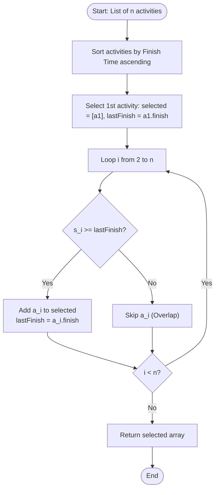

# Activity Selection Problem (Greedy Interval Scheduling)

## 1. Introduction

The **Activity Selection Problem** is a classic algorithmic problem in computer science that exemplifies the **Greedy Paradigm**.

Given a set of $n$ proposed activities $S = \{a_1, a_2, \dots, a_n\}$, where each activity $a_i$ has:
- A **start time** $s_i$
- A **finish time** $f_i$ ($s_i \le f_i$)

Two activities $a_i$ and $a_j$ are **compatible (non-overlapping)** if their time intervals do not intersect, meaning $s_i \ge f_j$ or $s_j \ge f_i$.

The goal is to find a **maximum-size subset of mutually compatible activities** that can be performed by a single resource (e.g., a single meeting room or a single processor thread).

---

## 2. Why Use This Algorithm?

### Greedy Strategy vs. Brute-Force vs. Dynamic Programming:
For $n$ activities, the total number of candidate subsets is $2^n$:
1. **Brute Force:** Testing all $2^n$ subsets for compatibility takes **$O(n \cdot 2^n)$ exponential time**.
2. **Dynamic Programming:** Solving via subproblem intervals takes **$O(n^2)$ quadratic time**.
3. **Greedy Algorithm:** By sorting activities by their **finish times**, we achieve the globally optimal solution in **$O(n \log n)$ time** (or **$O(n)$** if already sorted) with **$O(1)$ extra space**.

### Why Sort by Earliest Finish Time?
Several greedy strategies might seem intuitive, but only one is mathematically sound:
- ❌ **Greedy by Earliest Start Time:** Fails if an activity starts very early but spans the entire day, blocking all others.
- ❌ **Greedy by Shortest Duration:** Fails if a short activity lies right in the middle of two non-overlapping long activities, blocking both.
- ❌ **Greedy by Fewest Overlaps:** Fails on specific edge configurations.
- ✅ **Greedy by Earliest Finish Time:** **Always optimal!** Finishing an activity as early as possible leaves the maximum remaining time available for future activities.

---

## 3. Real-World Applications

- **Conference Room & Venue Booking:** Maximizing the total number of distinct meetings hosted in a single auditorium throughout the day.
- **CPU Task & Job Scheduling:** Scheduling non-preemptable single-threaded processor batch jobs to maximize throughput.
- **Airport Runway & Gate Allocation:** Scheduling aircraft landing and takeoff slots on a single physical runway.
- **Satellite & Telescope Observation Windows:** Allocating telescope time slots for astronomical research targets.
- **Broadcast & Media Streaming:** Slotting ad commercials or television programs into a single continuous broadcast stream.

---

## 4. Prerequisites

Before learning Activity Selection, you should be comfortable with:
- **Array Traversal and Sorting Algorithms:** Understanding $O(n \log n)$ sorting (`std::sort`, `qsort`, `Arrays.sort`).
- **Interval Representation:** Representing intervals using pairs, tuples, or custom structures `(start, finish)`.
- **Greedy Choice Property:** Understanding local greedy choice leading to global optimum.

---

## 5. Visualization

### Example Activities & Timeline Bar Chart

Suppose we have 6 activities with `(start, finish)` times:
`a1=(1, 4), a2=(3, 5), a3=(0, 6), a4=(5, 7), a5=(3, 9), a6=(5, 9), a7=(6, 10), a8=(8, 11), a9=(8, 12), a10=(2, 14), a11=(12, 16)`

Let's look at sorted activities by finish time:
`a1: [1, 4)`  
`a2: [3, 5)`  
`a3: [0, 6)`  
`a4: [5, 7)`  
`a5: [3, 9)`  
`a6: [5, 9)`  
`a7: [6, 10)`  
`a8: [8, 11)`  
`a9: [8, 12)`  
`a10: [2, 14)`  
`a11: [12, 16)`

```
Time: 0  1  2  3  4  5  6  7  8  9 10 11 12 13 14 15 16
a1:      |======|                           (SELECTED)
a2:            |======|                    (Overlap with a1)
a3:   |=============|                      (Overlap with a1)
a4:                  |======|               (SELECTED)
a5:            |============|              (Overlap with a4)
a6:                  |============|        (Overlap with a4)
a7:                     |======|           (Overlap with a4)
a8:                           |======|      (SELECTED)
a9:                           |========|    (Overlap with a8)
a10:     |=============================|   (Overlap with a8)
a11:                                    |===========| (SELECTED)

Selected Subset: { a1, a4, a8, a11 } (Total = 4 activities)
```

### Mermaid Flowchart



---

## 6. How It Works

1. **Sort Activities:** Sort all activities in non-decreasing order of their **finish times** ($f_1 \le f_2 \le \dots \le f_n$).
2. **Greedy Choice (Select First):** Always select the first activity $a_1$ from the sorted list. It finishes earliest, leaving the maximum time space for the rest.
3. **Iterative Non-Overlapping Check:**
   - Maintain `last_finish_time = a1.finish`.
   - Iterate through the remaining sorted activities from $i = 2$ to $n$.
   - If the start time of activity $a_i$ is greater than or equal to `last_finish_time` ($s_i \ge \text{last\_finish\_time}$):
     - Select activity $a_i$.
     - Update `last_finish_time = ai.finish`.
   - Otherwise, reject activity $a_i$ because it conflicts with the previously chosen schedule.
4. **Result:** The accumulated set of selected activities is guaranteed to be a maximum-cardinality compatible set.

---

## 7. Step-by-Step Algorithm

1. Input: An array of $n$ activities `A[0...n-1]`, where each element has `start` and `finish` properties.
2. Sort `A` in non-decreasing order based on `A[i].finish`.
3. Create an empty list `selectedActivities`.
4. Add `A[0]` to `selectedActivities`.
5. Set `lastFinishTime = A[0].finish`.
6. Loop `i` from `1` to `n - 1`:
   - If `A[i].start >= lastFinishTime`:
     - Append `A[i]` to `selectedActivities`.
     - Set `lastFinishTime = A[i].finish`.
7. Return `selectedActivities`.

---

## 8. Pseudocode

```text
struct Activity:
    int id
    int start
    int finish

function activitySelection(activities):
    n = length(activities)
    if n == 0:
        return []

    // Sort by finish time in ascending order
    sort(activities, by finish time)

    selected = []
    
    // Always pick the first activity
    selected.append(activities[0])
    lastFinish = activities[0].finish

    for i from 1 to n - 1:
        if activities[i].start >= lastFinish:
            selected.append(activities[i])
            lastFinish = activities[i].finish

    return selected
```

---

## 9. Code Examples

### C Implementation

```c
#include <stdio.h>
#include <stdlib.h>

typedef struct {
    int id;
    int start;
    int finish;
} Activity;

// Comparator function for qsort: sort by finish time ascending
int compareActivities(const void* a, const void* b) {
    Activity* actA = (Activity*)a;
    Activity* actB = (Activity*)b;
    return (actA->finish - actB->finish);
}

void selectActivities(Activity activities[], int n) {
    // Step 1: Sort activities by finish time
    qsort(activities, n, sizeof(Activity), compareActivities);

    printf("Selected Activities (by ID, Start, Finish):\n");

    // Step 2: The first activity is always selected
    int i = 0;
    printf("Activity %d: [%d, %d)\n", activities[i].id, activities[i].start, activities[i].finish);

    int count = 1;
    // Step 3: Consider rest of the activities
    for (int j = 1; j < n; j++) {
        if (activities[j].start >= activities[i].finish) {
            printf("Activity %d: [%d, %d)\n", activities[j].id, activities[j].start, activities[j].finish);
            i = j;
            count++;
        }
    }
    printf("Total maximum non-overlapping activities selected: %d\n", count);
}

int main() {
    Activity activities[] = {
        {1, 5, 9},
        {2, 1, 2},
        {3, 3, 4},
        {4, 0, 6},
        {5, 5, 7},
        {6, 8, 9}
    };
    int n = sizeof(activities) / sizeof(activities[0]);

    selectActivities(activities, n);

    return 0;
}
```

---

### C++ Implementation

```cpp
#include <iostream>
#include <vector>
#include <algorithm>

using namespace std;

struct Activity {
    int id;
    int start;
    int finish;
};

vector<Activity> activitySelection(vector<Activity>& activities) {
    if (activities.empty()) return {};

    // Sort by finish time in ascending order
    sort(activities.begin(), activities.end(), [](const Activity& a, const Activity& b) {
        return a.finish < b.finish;
    });

    vector<Activity> selected;
    selected.push_back(activities[0]);
    int lastFinish = activities[0].finish;

    for (size_t i = 1; i < activities.size(); ++i) {
        if (activities[i].start >= lastFinish) {
            selected.push_back(activities[i]);
            lastFinish = activities[i].finish;
        }
    }

    return selected;
}

int main() {
    vector<Activity> activities = {
        {1, 1, 4},
        {2, 3, 5},
        {3, 0, 6},
        {4, 5, 7},
        {5, 3, 9},
        {6, 5, 9},
        {7, 6, 10},
        {8, 8, 11},
        {9, 8, 12},
        {10, 2, 14},
        {11, 12, 16}
    };

    vector<Activity> result = activitySelection(activities);

    cout << "Maximum non-overlapping activities selected (" << result.size() << "):\n";
    for (const auto& act : result) {
        cout << "Activity " << act.id << ": [" << act.start << ", " << act.finish << ")\n";
    }

    return 0;
}
```

---

### Java Implementation

```java
import java.util.ArrayList;
import java.util.Arrays;
import java.util.Comparator;
import java.util.List;

public class ActivitySelection {

    static class Activity {
        int id;
        int start;
        int finish;

        Activity(int id, int start, int finish) {
            this.id = id;
            this.start = start;
            this.finish = finish;
        }

        @Override
        public String toString() {
            return "Activity " + id + " [" + start + ", " + finish + ")";
        }
    }

    public static List<Activity> selectActivities(Activity[] activities) {
        List<Activity> selected = new ArrayList<>();
        if (activities == null || activities.length == 0) {
            return selected;
        }

        // Sort activities by finish time ascending
        Arrays.sort(activities, Comparator.comparingInt(a -> a.finish));

        // Select the first activity
        selected.add(activities[0]);
        int lastFinish = activities[0].finish;

        for (int i = 1; i < activities.length; i++) {
            if (activities[i].start >= lastFinish) {
                selected.add(activities[i]);
                lastFinish = activities[i].finish;
            }
        }

        return selected;
    }

    public static void main(String[] args) {
        Activity[] activities = {
            new Activity(1, 1, 4),
            new Activity(2, 3, 5),
            new Activity(3, 0, 6),
            new Activity(4, 5, 7),
            new Activity(5, 3, 9),
            new Activity(6, 5, 9),
            new Activity(7, 6, 10),
            new Activity(8, 8, 11),
            new Activity(9, 8, 12),
            new Activity(10, 2, 14),
            new Activity(11, 12, 16)
        };

        List<Activity> result = selectActivities(activities);

        System.out.println("Maximum Selected Activities (" + result.size() + "):");
        for (Activity act : result) {
            System.out.println(act);
        }
    }
}
```

---

### Python Implementation

```python
from typing import List, Tuple

class Activity:
    def __init__(self, activity_id: int, start: int, finish: int):
        self.id = activity_id
        self.start = start
        self.finish = finish

    def __repr__(self):
        return f"Activity {self.id}: [{self.start}, {self.finish})"


def activity_selection(activities: List[Activity]) -> List[Activity]:
    if not activities:
        return []

    # Sort activities by finish time in ascending order
    sorted_activities = sorted(activities, key=lambda x: x.finish)

    selected = [sorted_activities[0]]
    last_finish = sorted_activities[0].finish

    for i in range(1, len(sorted_activities)):
        if sorted_activities[i].start >= last_finish:
            selected.append(sorted_activities[i])
            last_finish = sorted_activities[i].finish

    return selected


if __name__ == "__main__":
    raw_activities = [
        Activity(1, 1, 4),
        Activity(2, 3, 5),
        Activity(3, 0, 6),
        Activity(4, 5, 7),
        Activity(5, 3, 9),
        Activity(6, 5, 9),
        Activity(7, 6, 10),
        Activity(8, 8, 11),
        Activity(9, 8, 12),
        Activity(10, 2, 14),
        Activity(11, 12, 16)
    ]

    chosen = activity_selection(raw_activities)
    print(f"Total Selected Activities: {len(chosen)}")
    for act in chosen:
        print(act)
```

---

### JavaScript Implementation

```javascript
class Activity {
    constructor(id, start, finish) {
        this.id = id;
        this.start = start;
        this.finish = finish;
    }
}

function activitySelection(activities) {
    if (!activities || activities.length === 0) return [];

    // Sort by finish time ascending
    const sorted = [...activities].sort((a, b) => a.finish - b.finish);

    const selected = [sorted[0]];
    let lastFinish = sorted[0].finish;

    for (let i = 1; i < sorted.length; i++) {
        if (sorted[i].start >= lastFinish) {
            selected.push(sorted[i]);
            lastFinish = sorted[i].finish;
        }
    }

    return selected;
}

// Execution Demo
const activities = [
    new Activity(1, 1, 4),
    new Activity(2, 3, 5),
    new Activity(3, 0, 6),
    new Activity(4, 5, 7),
    new Activity(5, 3, 9),
    new Activity(6, 5, 9),
    new Activity(7, 6, 10),
    new Activity(8, 8, 11),
    new Activity(9, 8, 12),
    new Activity(10, 2, 14),
    new Activity(11, 12, 16)
];

const selected = activitySelection(activities);
console.log(`Total Selected: ${selected.length}`);
selected.forEach(act => console.log(`Activity ${act.id}: [${act.start}, ${act.finish})`));
```

---

## 10. Code Explanation

1. **Activity Representation:** Objects or structs containing unique `id`, `start` time, and `finish` time.
2. **Sorting Step:** Sorting by `finish` time in ascending order ($O(n \log n)$) is the key setup step. If two activities finish at the same time, their relative order does not affect the optimal total count.
3. **Greedy Choice:** Selecting `activities[0]` is guaranteed to be safe because finishing earlier never hurts the opportunity to fit subsequent non-overlapping activities.
4. **Single Pass Iteration:** A simple linear loop checks `activities[i].start >= lastFinish`. If valid, it updates `lastFinish = activities[i].finish`. This check takes $O(1)$ time per activity.

---

## 11. Interactive Demo

An interactive activity scheduling visualizer features:
1. **Interactive Gantt Chart:** Visual bars representing activity intervals on a time axis.
2. **Add / Edit Activity Controls:** Sliders to adjust `start` and `finish` times dynamically.
3. **Strategy Selector:** Dropdown to switch between greedy strategies:
   - *Earliest Finish Time* (Optimal ✅)
   - *Earliest Start Time* (Sub-optimal ❌)
   - *Shortest Duration* (Sub-optimal ❌)
4. **Step-by-Step Animation:** Highlights evaluated activities in blue, accepted activities in green, and rejected overlapping activities in red.

---

## 12. Dry Run

### Sample Input (Unsorted):
- `A1: (start=3, finish=4)`
- `A2: (start=0, finish=6)`
- `A3: (start=1, finish=2)`
- `A4: (start=5, finish=7)`
- `A5: (start=8, finish=9)`
- `A6: (start=5, finish=9)`

#### Step 1: Sort by Finish Time Ascending
Sorted Array:
1. `A3: (1, 2)`
2. `A1: (3, 4)`
3. `A2: (0, 6)`
4. `A4: (5, 7)`
5. `A5: (8, 9)`
6. `A6: (5, 9)`

#### Step 2: Iterative Greedy Selection

| Step | Activity | Interval | `start >= lastFinish` | Decision | `lastFinish` after step | Selected List |
| :--- | :--- | :--- | :--- | :--- | :--- | :--- |
| **0** | `A3` | `(1, 2)` | Initial pick | **ACCEPT** | `2` | `[A3]` |
| **1** | `A1` | `(3, 4)` | $3 \ge 2 \rightarrow$ True | **ACCEPT** | `4` | `[A3, A1]` |
| **2** | `A2` | `(0, 6)` | $0 \ge 4 \rightarrow$ False | **REJECT** | `4` | `[A3, A1]` |
| **3** | `A4` | `(5, 7)` | $5 \ge 4 \rightarrow$ True | **ACCEPT** | `7` | `[A3, A1, A4]` |
| **4** | `A5` | `(8, 9)` | $8 \ge 7 \rightarrow$ True | **ACCEPT** | `9` | `[A3, A1, A4, A5]` |
| **5** | `A6` | `(5, 9)` | $5 \ge 9 \rightarrow$ False | **REJECT** | `9` | `[A3, A1, A4, A5]` |

**Final Result:** 4 non-overlapping activities selected: `[A3, A1, A4, A5]`.

---

## 13. Time & Space Complexity

| Operation | Time Complexity | Auxiliary Space Complexity | Explanation |
| :--- | :--- | :--- | :--- |
| **Sorting** | $O(n \log n)$ | $O(n)$ or $O(1)$ | Dual-pivot Quicksort or Timsort by finish time. |
| **Greedy Pass** | $O(n)$ | $O(1)$ | Single linear scan through sorted array. |
| **Total Algorithm** | **$O(n \log n)$** | **$O(1)$ auxiliary** | Dominated by the sorting phase. |

*Note: If the input activities are already pre-sorted by finish time, the overall time complexity drops to **$O(n)$**.*

---

## 14. Advantages

- **Optimal & Fast:** Solves the scheduling problem in $O(n \log n)$ time.
- **Minimal Space:** Requires zero complex auxiliary data structures ($O(1)$ additional space beyond the result list).
- **Simple Implementation:** Extremely easy to write, debug, and maintain.
- **Clear Greedy Proof:** Easy to verify correctness using the substitution proof method.

---

## 15. Disadvantages

- **Unweighted Only:** Assumes all activities have equal weight/value ($1$). If activities have distinct profits/weights, this greedy strategy fails and requires Dynamic Programming (**Weighted Interval Scheduling** in $O(n \log n)$).
- **Single Resource Constraint:** Assumes only 1 resource (e.g. 1 meeting room). If multiple resources are available, it transforms into the **Interval Partitioning / Meeting Rooms II** problem.

---

## 16. Applications

- **Single Core Thread Scheduling:** Maximizing completed independent non-preemptive background jobs.
- **Event Management:** Booking non-overlapping slots for single-stage music festivals.
- **Resource Reservation Systems:** Managing reservation locks on single-instance equipment (e.g., 3D printers, CNC machines).

---

## 17. Common Mistakes

1. **Sorting by Start Time instead of Finish Time:** Sorting by start time causes long early activities to block many shorter subsequent activities.
2. **Sorting by Duration:** Selecting shortest duration first fails when a short activity sits in between two longer valid activities.
3. **Strict vs Non-Strict Equality ($s_i \ge f_j$ vs $s_i > f_j$):** Clarify whether an activity can start at the exact moment another finishes ($s_i = f_j$). Standard activity selection allows $s_i \ge f_j$.
4. **Modifying Input Array without Preserving Indices:** If original activity IDs are required, wrap start/finish in an object with `id` before sorting.

---

## 18. Interview Questions

1. **Prove the correctness of the Greedy Choice Property for Activity Selection.** (Hint: Use proof by contradiction / exchange argument).
2. **How would you adapt Activity Selection if activities have associated weights/profits?** (Answer: Use Weighted Interval Scheduling via Dynamic Programming + Binary Search).
3. **What is the minimum number of halls needed to schedule all $n$ activities without conflicts?** (Answer: Interval Partitioning / Meeting Rooms II using a Min-Heap of end times).
4. **Can we solve Activity Selection by sorting by start time in descending order?** (Answer: Yes! Picking the latest start time iterating right-to-left is symmetric and optimal).
5. **How do you handle activities with identical start and finish times ($s_i = f_i$)?**

---

## 19. Practice Problems

### Easy
1. Given start and end times of $n$ meetings in one room, find the maximum number of meetings that can be held (LeetCode / GeeksforGeeks).
2. Non-overlapping Intervals (LeetCode 435): Find the minimum number of intervals to remove to make the rest non-overlapping.

### Medium
3. Meeting Rooms II (LeetCode 253): Find minimum meeting rooms required for all meetings.
4. Merge Intervals (LeetCode 56): Merge all overlapping intervals into single intervals.
5. Minimum Number of Arrows to Burst Balloons (LeetCode 452).

### Hard
6. Weighted Interval Scheduling Problem: Find maximum profit subset of non-overlapping intervals.
7. Maximum Length of Pair Chain (LeetCode 646).

---

## 20. Related Algorithms

- **Weighted Interval Scheduling:** Solved using DP + Binary Search in $O(n \log n)$.
- **Interval Partitioning (Meeting Rooms II):** Greedy algorithm using Min-Heap in $O(n \log n)$.
- **Job Sequencing with Deadlines:** Greedy algorithm sorting by profit.
- **Huffman Coding:** Another classic $O(n \log n)$ Greedy algorithm.

---

## 21. Summary

- **Category:** Greedy Algorithm.
- **Time Complexity:** $O(n \log n)$ due to sorting ($O(n)$ if pre-sorted).
- **Space Complexity:** $O(1)$ auxiliary memory.
- **Core Rule:** **Always pick the activity with the earliest finish time** that does not conflict with the previously selected activity.

---

## 22. Quiz

#### Question 1: What is the optimal greedy criterion for the Activity Selection Problem?
- A) Pick the activity with the earliest start time
- B) Pick the activity with the shortest duration
- C) Pick the activity with the earliest finish time
- D) Pick the activity with the fewest overlapping neighbors
- **Correct Answer:** C
- **Explanation:** Sorting by earliest finish time leaves the maximum possible remaining time for subsequent activities.

#### Question 2: What is the time complexity of Activity Selection if the activities are ALREADY sorted by finish time?
- A) $O(1)$
- B) $O(\log n)$
- C) $O(n)$
- D) $O(n \log n)$
- **Correct Answer:** C
- **Explanation:** If pre-sorted, a single linear pass $O(n)$ checks compatibility.

#### Question 3: If activities have varying financial values/profits, does the finish-time greedy algorithm still guarantee an optimal solution?
- A) Yes, always
- B) No, it requires Dynamic Programming (Weighted Interval Scheduling)
- C) Yes, if profits are positive
- D) Only if $n \le 100$
- **Correct Answer:** B
- **Explanation:** Weighted interval scheduling breaks the simple greedy choice property and must be solved using DP.

#### Question 4: How is LeetCode 435 ("Minimum Number of Intervals to Remove to Make Non-Overlapping") related to Activity Selection?
- A) $\text{Intervals to Remove} = \text{Total Intervals} - \text{Max Non-Overlapping Activities}$
- B) They are completely unrelated
- C) It requires Graph DFS
- D) $\text{Intervals to Remove} = 2 \times \text{Max Non-Overlapping Activities}$
- **Correct Answer:** A
- **Explanation:** Removing the minimum intervals is mathematically dual to finding the maximum compatible subset.

#### Question 5: Which greedy choice strategy ALSO yields an optimal solution if scanned backwards?
- A) Latest finish time
- B) Latest start time
- C) Longest duration
- D) Random selection
- **Correct Answer:** B
- **Explanation:** Scanning right-to-left and greedily picking the activity with the latest start time is mathematically symmetric to picking earliest finish time left-to-right.

#### Question 6: What is the overall time complexity of Activity Selection when input is unsorted?
- A) $O(n)$
- B) $O(n \log n)$
- C) $O(n^2)$
- D) $O(2^n)$
- **Correct Answer:** B
- **Explanation:** Sorting $n$ activities takes $O(n \log n)$ time, which dominates the $O(n)$ linear scan.

#### Question 7: Can two selected activities in Activity Selection touch at boundaries ($f_i = s_j$)?
- A) No, never
- B) Yes, if intervals are defined as half-open $[start, finish)$
- C) Only if they have the same ID
- D) It causes a deadlock
- **Correct Answer:** B
- **Explanation:** In standard activity scheduling, an activity ending at time $t$ allows the next activity to start at time $t$ ($s_j \ge f_i$).

#### Question 8: What is the space complexity of the Greedy Activity Selection algorithm (excluding output array)?
- A) $O(1)$
- B) $O(n)$
- C) $O(n^2)$
- D) $O(\log n)$
- **Correct Answer:** A
- **Explanation:** The algorithm only keeps track of a single variable (`lastFinish`) during the linear pass.

#### Question 9: Why does greedy by shortest duration fail?
- A) Shortest activities might be located between two long non-overlapping activities, blocking both.
- B) It takes $O(n^2)$ to compute durations.
- C) It cannot handle integer inputs.
- D) It produces empty outputs.
- **Correct Answer:** A
- **Explanation:** Example: `(0, 10)` and `(10, 20)` with short activity `(9, 11)`. Picking `(9, 11)` gives 1 activity instead of optimal 2 (`(0, 10)` & `(10, 20)`).

#### Question 10: Which data structure helps solve the related "Meeting Rooms II" problem in $O(n \log n)$ time?
- A) Stack
- B) Min-Priority Queue (Min-Heap)
- C) Trie
- D) Disjoint Set Union (DSU)
- **Correct Answer:** B
- **Explanation:** A Min-Heap stores the finish times of active rooms to quickly reuse available rooms.
