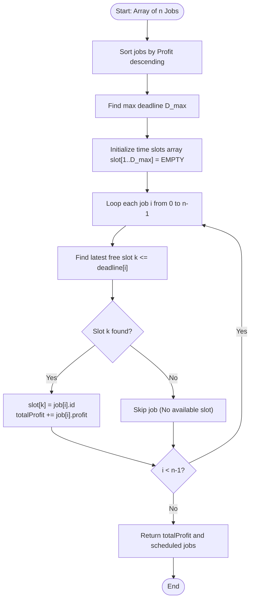

# Job Sequencing Problem with Deadlines (Greedy Algorithm)

## 1. Introduction

The **Job Sequencing Problem with Deadlines** is a fundamental optimization problem in computer science and operations research solved using the **Greedy Strategy**.

Given a set of $n$ jobs, where each job $i$ has:
- A unique **Job ID**
- A **Deadline** $d_i \ge 1$ (the maximum time unit by which the job must be completed)
- A **Profit** $p_i \ge 0$ (earned if the job is completed at or before its deadline)

Each job takes **exactly $1$ unit of time** to execute, and only **one job can be executed at a time** on a single processing unit.

The goal is to find an optimal job execution schedule that **maximizes total profit** while ensuring no job violates its deadline.

---

## 2. Why Use This Algorithm?

### Greedy Strategy & Mathematical Insight:
1. **Profit-First Ordering:** To maximize total profit, we should prioritize jobs with higher profits. Therefore, we sort all jobs in **descending order of profit**.
2. **Latest Possible Slot Placement:** When considering a job with deadline $d_i$, in which time slot should we schedule it?
   - **Naive choice:** Schedule it in the earliest free slot (e.g., Slot 1). ❌ *Flawed!* Occupying early slots prevents other high-profit jobs with tight deadlines ($d = 1$) from executing.
   - **Greedy choice:** Schedule the job in the **latest available time slot $t \le d_i$**. ✅ *Optimal!* Leaving earlier time slots open preserves flexibility for future jobs that have earlier deadlines.

### Algorithm Variants & Efficiency:
- **Naive Greedy Array Approach:** Checks time slots linearly backwards from $d_i$ down to 1.
  - **Time Complexity:** $O(n \log n + n \cdot D_{\max}) \approx \mathbf{O(n^2)}$ in the worst case.
- **Disjoint Set Union (DSU / Union-Find) Optimization:** Uses path compression to locate the latest available free time slot in nearly $O(1)$ time.
  - **Time Complexity:** $\mathbf{O(n \log n + n \cdot \alpha(D_{\max}))}$, where $\alpha$ is the Inverse Ackermann function.

---

## 3. Real-World Applications

- **Freelance & Contract Task Prioritization:** A contractor with multiple project offers chooses higher-paying gigs and schedules each as late as allowable before the deadline.
- **Assembly Line & Batch Manufacturing:** Factory job scheduling where orders have customer due dates and late penalties.
- **Operating System Thread Execution:** Real-time operating systems (RTOS) scheduling CPU tasks with execution SLAs and financial/performance rewards.
- **Cloud Computing Server Batch Jobs:** Scheduling serverless functions or compute instances with deadline boundaries to maximize cloud infrastructure revenue.
- **E-Commerce Order Dispatching:** Prioritizing high-margin express delivery orders based on cutoff shipping times.

---

## 4. Prerequisites

Before learning Job Sequencing, you should be comfortable with:
- **Sorting Algorithms:** Custom comparators sorting structures by profit descending ($O(n \log n)$).
- **Array Reservation / Time Slots:** Representing discrete time slots (`[0..1]`, `[1..2]`, `[2..3]`, ...).
- **Disjoint Set Union (DSU / Union-Find) [For $O(n \alpha(n))$ optimization]:** `find()` with path compression and `union()` operations.

---

## 5. Visualization

### Example Input Jobs:
| Job ID | Deadline | Profit |
| :--- | :--- | :--- |
| **J1** | 2 | 100 |
| **J2** | 1 | 19 |
| **J3** | 2 | 27 |
| **J4** | 1 | 25 |
| **J5** | 3 | 15 |

Maximum Deadline $D_{\max} = 3$. Time slots available: Slot 1 `[0-1]`, Slot 2 `[1-2]`, Slot 3 `[2-3]`.

```
Step 1: Sort by Profit Descending:
  J1 (D=2, P=100) -> J3 (D=2, P=27) -> J4 (D=1, P=25) -> J2 (D=1, P=19) -> J5 (D=3, P=15)

Step 2: Slot Allocation:
  - Process J1 (P=100, D=2): Slot 2 is free -> Place J1 in Slot 2 [1-2].
  - Process J3 (P=27,  D=2): Slot 2 full. Slot 1 is free -> Place J3 in Slot 1 [0-1].
  - Process J4 (P=25,  D=1): Slot 1 full. No slots <= 1 free -> Skip J4.
  - Process J2 (P=19,  D=1): Slot 1 full. No slots <= 1 free -> Skip J2.
  - Process J5 (P=15,  D=3): Slot 3 is free -> Place J5 in Slot 3 [2-3].

Final Scheduled Time Slots:
  Slot 1 [0-1] : J3 (Profit 27)
  Slot 2 [1-2] : J1 (Profit 100)
  Slot 3 [2-3] : J5 (Profit 15)

Total Profit = 27 + 100 + 15 = 142
```

### Mermaid Flowchart



---

## 6. How It Works

1. **Sort Jobs:** Sort all input jobs in descending order of profit $p_i$.
2. **Determine Timeline Capacity:** Find the maximum deadline $D_{\max}$ among all jobs to allocate a time-slot tracking array of size $D_{\max} + 1$.
3. **Slot Allocation (Greedy Loop):**
   - For each job $i$ in sorted order:
     - Search backwards from $t = \min(d_i, D_{\max})$ down to $1$.
     - If slot $t$ is empty (`slot[t] == -1` or `FREE`):
       - Assign Job $i$ to slot $t$.
       - Add $p_i$ to cumulative total profit.
       - Break the backward search and move to the next job.
     - If no free slot exists at or before $d_i$, discard Job $i$.

### DSU (Disjoint Set Union) Optimization:
Instead of scanning backwards linearly ($O(D_{\max})$ search per job), maintain a DSU structure where `parent[x]` points to the **latest free slot available at or before $x$**:
- Initialize `parent[i] = i` for all $0 \le i \le D_{\max}$.
- When slot $r = \text{find}(d_i)$ is allocated (if $r > 0$):
  - Place job in slot $r$.
  - Union slot $r$ with $r-1$: `parent[r] = find(r - 1)`.
- Finding a free slot takes nearly $O(1)$ time ($\alpha(N)$ amortized)!

---

## 7. Step-by-Step Algorithm

### Naive Greedy Algorithm
1. Create structure `Job {id, deadline, profit}`.
2. Sort array of jobs such that $p_1 \ge p_2 \ge \dots \ge p_n$.
3. Find $D_{\max} = \max(d_1, d_2, \dots, d_n)$.
4. Create `slots[1...D_max]` initialized to `-1` (free), `totalProfit = 0`, `count = 0`.
5. For $i = 0$ to $n-1$:
   - For $k = \min(D_{\max}, \text{jobs}[i].\text{deadline})$ down to $1$:
     - If `slots[k] == -1`:
       - `slots[k] = jobs[i].id`
       - `totalProfit += jobs[i].profit`
       - `count++`
       - break
6. Return `totalProfit` and `slots`.

---

## 8. Pseudocode

```text
struct Job:
    string id
    int deadline
    int profit

// DSU Optimized Approach
function find(parent, i):
    if parent[i] == i:
        return i
    parent[i] = find(parent, parent[i])  // Path compression
    return parent[i]

function jobSequencingDSU(jobs):
    sort(jobs, by profit descending)
    
    maxDeadline = max(job.deadline for job in jobs)
    
    parent = array of size (maxDeadline + 1)
    for i from 0 to maxDeadline:
        parent[i] = i

    totalProfit = 0
    scheduledJobs = []

    for job in jobs:
        // Find latest available slot for this job's deadline
        availableSlot = find(parent, job.deadline)

        if availableSlot > 0:
            scheduledJobs.append((availableSlot, job.id))
            totalProfit += job.profit
            // Connect this slot to the slot before it
            parent[availableSlot] = find(parent, availableSlot - 1)

    return totalProfit, scheduledJobs
```

---

## 9. Code Examples

### C Implementation (Naive & DSU)

```c
#include <stdio.h>
#include <stdlib.h>
#include <stdbool.h>

typedef struct {
    char id[10];
    int deadline;
    int profit;
} Job;

// Comparator to sort jobs by profit in descending order
int compareJobs(const void* a, const void* b) {
    Job* j1 = (Job*)a;
    Job* j2 = (Job*)b;
    return (j2->profit - j1->profit);
}

int min(int a, int b) {
    return (a < b) ? a : b;
}

// Naive O(N^2) Implementation
void jobSequencingNaive(Job jobs[], int n) {
    qsort(jobs, n, sizeof(Job), compareJobs);

    int maxDeadline = 0;
    for (int i = 0; i < n; i++) {
        if (jobs[i].deadline > maxDeadline)
            maxDeadline = jobs[i].deadline;
    }

    int* slot = (int*)malloc((maxDeadline + 1) * sizeof(int));
    for (int i = 0; i <= maxDeadline; i++) slot[i] = -1;

    int totalProfit = 0;
    int count = 0;

    for (int i = 0; i < n; i++) {
        for (int j = min(maxDeadline, jobs[i].deadline); j > 0; j--) {
            if (slot[j] == -1) {
                slot[j] = i; // Store index of job
                totalProfit += jobs[i].profit;
                count++;
                break;
            }
        }
    }

    printf("--- Naive Job Sequencing Results ---\n");
    printf("Total Jobs Scheduled: %d\n", count);
    printf("Total Max Profit     : %d\n", totalProfit);
    printf("Scheduled Sequence  :\n");
    for (int i = 1; i <= maxDeadline; i++) {
        if (slot[i] != -1) {
            printf("Slot [%d-%d]: Job %s (Profit: %d)\n", i - 1, i, jobs[slot[i]].id, jobs[slot[i]].profit);
        }
    }
    free(slot);
}

int main() {
    Job jobs[] = {
        {"J1", 2, 100},
        {"J2", 1, 19},
        {"J3", 2, 27},
        {"J4", 1, 25},
        {"J5", 3, 15}
    };
    int n = sizeof(jobs) / sizeof(jobs[0]);

    jobSequencingNaive(jobs, n);
    return 0;
}
```

---

### C++ Implementation (DSU Optimized)

```cpp
#include <iostream>
#include <vector>
#include <string>
#include <algorithm>

using namespace std;

struct Job {
    string id;
    int deadline;
    int profit;
};

class DSU {
private:
    vector<int> parent;
public:
    DSU(int n) {
        parent.resize(n + 1);
        for (int i = 0; i <= n; i++) parent[i] = i;
    }

    int find(int i) {
        if (parent[i] == i) return i;
        return parent[i] = find(parent[i]); // Path compression
    }

    void unite(int u, int v) {
        parent[u] = v;
    }
};

void jobSequencingDSU(vector<Job>& jobs) {
    // Sort jobs by profit descending
    sort(jobs.begin(), jobs.end(), [](const Job& a, const Job& b) {
        return a.profit > b.profit;
    });

    int maxDeadline = 0;
    for (const auto& job : jobs) {
        maxDeadline = max(maxDeadline, job.deadline);
    }

    DSU dsu(maxDeadline);
    int totalProfit = 0;
    int jobCount = 0;
    vector<pair<int, string>> schedule;

    for (const auto& job : jobs) {
        // Find latest available slot <= job.deadline
        int availableSlot = dsu.find(min(maxDeadline, job.deadline));

        if (availableSlot > 0) {
            // Allocate job to availableSlot and unite with slot prior
            dsu.unite(availableSlot, dsu.find(availableSlot - 1));
            totalProfit += job.profit;
            jobCount++;
            schedule.push_back({availableSlot, job.id});
        }
    }

    // Sort schedule by slot time
    sort(schedule.begin(), schedule.end());

    cout << "=== DSU Optimized Job Scheduling ===\n";
    cout << "Total Scheduled Jobs: " << jobCount << "\n";
    cout << "Total Max Profit     : " << totalProfit << "\n";
    for (const auto& slot : schedule) {
        cout << "Time Slot [" << slot.first - 1 << "-" << slot.first << "]: " << slot.second << "\n";
    }
}

int main() {
    vector<Job> jobs = {
        {"J1", 4, 70},
        {"J2", 1, 80},
        {"J3", 1, 30},
        {"J4", 1, 100},
        {"J5", 3, 40}
    };

    jobSequencingDSU(jobs);
    return 0;
}
```

---

### Java Implementation

```java
import java.util.ArrayList;
import java.util.Arrays;
import java.util.Comparator;
import java.util.List;

public class JobSequencing {

    static class Job {
        String id;
        int deadline;
        int profit;

        Job(String id, int deadline, int profit) {
            this.id = id;
            this.deadline = deadline;
            this.profit = profit;
        }
    }

    static class DSU {
        int[] parent;

        DSU(int n) {
            parent = new int[n + 1];
            for (int i = 0; i <= n; i++) {
                parent[i] = i;
            }
        }

        int find(int i) {
            if (parent[i] == i) return i;
            return parent[i] = find(parent[i]); // Path compression
        }

        void union(int u, int v) {
            parent[u] = v;
        }
    }

    public static void scheduleJobs(List<Job> jobs) {
        // Step 1: Sort jobs by profit in descending order
        jobs.sort((a, b) -> Integer.compare(b.profit, a.profit));

        int maxDeadline = 0;
        for (Job job : jobs) {
            maxDeadline = Math.max(maxDeadline, job.deadline);
        }

        DSU dsu = new DSU(maxDeadline);
        int totalProfit = 0;
        int count = 0;
        String[] scheduled = new String[maxDeadline + 1];

        for (Job job : jobs) {
            int availableSlot = dsu.find(Math.min(maxDeadline, job.deadline));

            if (availableSlot > 0) {
                dsu.union(availableSlot, dsu.find(availableSlot - 1));
                scheduled[availableSlot] = job.id;
                totalProfit += job.profit;
                count++;
            }
        }

        System.out.println("Java Job Scheduling Results:");
        System.out.println("Jobs Scheduled: " + count);
        System.out.println("Maximum Profit: " + totalProfit);
        for (int i = 1; i <= maxDeadline; i++) {
            if (scheduled[i] != null) {
                System.out.println("Slot [" + (i - 1) + "-" + i + "]: " + scheduled[i]);
            }
        }
    }

    public static void main(String[] args) {
        List<Job> jobs = Arrays.asList(
            new Job("a", 2, 100),
            new Job("b", 1, 19),
            new Job("c", 2, 27),
            new Job("d", 1, 25),
            new Job("e", 3, 15)
        );

        scheduleJobs(jobs);
    }
}
```

---

### Python Implementation

```python
from typing import List, Tuple

class Job:
    def __init__(self, job_id: str, deadline: int, profit: int):
        self.id = job_id
        self.deadline = deadline
        self.profit = profit


class DSU:
    def __init__(self, n: int):
        self.parent = list(range(n + 1))

    def find(self, i: int) -> int:
        if self.parent[i] == i:
            return i
        self.parent[i] = self.find(self.parent[i])  # Path compression
        return self.parent[i]

    def union(self, u: int, v: int):
        self.parent[u] = v


def job_sequencing_dsu(jobs: List[Job]) -> Tuple[int, List[Tuple[int, str]]]:
    # Sort jobs by profit descending
    sorted_jobs = sorted(jobs, key=lambda j: j.profit, reverse=True)

    max_deadline = max(j.deadline for j in sorted_jobs)
    dsu = DSU(max_deadline)

    total_profit = 0
    schedule = []

    for job in sorted_jobs:
        available_slot = dsu.find(min(max_deadline, job.deadline))
        if available_slot > 0:
            dsu.union(available_slot, dsu.find(available_slot - 1))
            total_profit += job.profit
            schedule.append((available_slot, job.id))

    schedule.sort(key=lambda x: x[0])
    return total_profit, schedule


if __name__ == "__main__":
    job_list = [
        Job("J1", 2, 100),
        Job("J2", 1, 19),
        Job("J3", 2, 27),
        Job("J4", 1, 25),
        Job("J5", 3, 15)
    ]

    max_profit, sequence = job_sequencing_dsu(job_list)
    print(f"Total Max Profit: {max_profit}")
    print("Execution Timeline:")
    for slot, jid in sequence:
        print(f"Slot [{slot-1}-{slot}]: {jid}")
```

---

### JavaScript Implementation

```javascript
class Job {
    constructor(id, deadline, profit) {
        this.id = id;
        this.deadline = deadline;
        this.profit = profit;
    }
}

class DSU {
    constructor(n) {
        this.parent = Array.from({ length: n + 1 }, (_, i) => i);
    }

    find(i) {
        if (this.parent[i] === i) return i;
        this.parent[i] = this.find(this.parent[i]); // Path compression
        return this.parent[i];
    }

    union(u, v) {
        this.parent[u] = v;
    }
}

function jobSequencing(jobs) {
    if (!jobs || jobs.length === 0) return { totalProfit: 0, schedule: [] };

    // Sort by profit descending
    const sorted = [...jobs].sort((a, b) => b.profit - a.profit);

    const maxDeadline = Math.max(...sorted.map(j => j.deadline));
    const dsu = new DSU(maxDeadline);

    let totalProfit = 0;
    const schedule = [];

    for (const job of sorted) {
        const availableSlot = dsu.find(Math.min(maxDeadline, job.deadline));
        if (availableSlot > 0) {
            dsu.union(availableSlot, dsu.find(availableSlot - 1));
            totalProfit += job.profit;
            schedule.push({ slot: availableSlot, id: job.id, profit: job.profit });
        }
    }

    schedule.sort((a, b) => a.slot - b.slot);
    return { totalProfit, schedule };
}

// Execution Demo
const jobs = [
    new Job("Task-A", 4, 70),
    new Job("Task-B", 1, 80),
    new Job("Task-C", 1, 30),
    new Job("Task-D", 1, 100),
    new Job("Task-E", 3, 40)
];

const result = jobSequencing(jobs);
console.log("Max Profit:", result.totalProfit);
console.log("Scheduled Jobs:");
result.schedule.forEach(item => {
    console.log(`Slot [${item.slot - 1}-${item.slot}]: ${item.id} (Profit: ${item.profit})`);
});
```

---

## 10. Code Explanation

1. **Sorting Phase:** Jobs are sorted by `profit` descending ($O(n \log n)$). This prioritizes high-value tasks first.
2. **DSU Initialization:** A parent array of size $D_{\max} + 1$ is initialized where `parent[i] = i`. `parent[i]` represents the latest free slot available at or before time $i$.
3. **Slot Lookup via `find()`:** Calling `dsu.find(job.deadline)` returns the latest available free time slot $\le \text{deadline}$.
4. **Slot Assignment & Union:**
   - If `availableSlot > 0`, the job is scheduled in `availableSlot`.
   - Calling `dsu.union(availableSlot, dsu.find(availableSlot - 1))` updates `parent[availableSlot]` to point directly to the free slot preceding it, bypassing occupied slots efficiently!

---

## 11. Interactive Demo

An interactive scheduling sandbox includes:
1. **Dynamic Job Creator:** Form to input `(Job ID, Deadline, Profit)` tuples.
2. **Algorithm Mode Switch:** Toggle between **Naive Search ($O(n^2)$)** and **DSU Optimized ($O(n \alpha(n))$)**.
3. **Interactive Timeline Grid:** Visual grid representing slots `[0-1]`, `[1-2]`, `[2-3]`, etc.
4. **Step-by-Step Execution Stepper:**
   - Highlights candidate job in yellow.
   - Shows DSU path compression arrows pointing to the allocated slot.
   - Displays real-time profit counter accumulating selected rewards.

---

## 12. Dry Run

### Input Jobs:
- `J1`: Deadline = 4, Profit = 70
- `J2`: Deadline = 1, Profit = 80
- `J3`: Deadline = 1, Profit = 30
- `J4`: Deadline = 1, Profit = 100
- `J5`: Deadline = 3, Profit = 40

#### Step 1: Sort Jobs by Profit Descending
`J4 (P=100, D=1)` $\rightarrow$ `J2 (P=80, D=1)` $\rightarrow$ `J1 (P=70, D=4)` $\rightarrow$ `J5 (P=40, D=3)` $\rightarrow$ `J3 (P=30, D=1)`

Max Deadline $D_{\max} = 4$.

#### Step 2: DSU Slot Allocation Trace

| Step | Candidate Job | Deadline | Profit | `find(deadline)` | Slot Assigned | Parent Pointer Update | Total Profit |
| :--- | :--- | :--- | :--- | :--- | :--- | :--- | :--- |
| **1** | `J4` | 1 | 100 | `find(1) = 1` | Slot 1 | `parent[1] = find(0) = 0` | 100 |
| **2** | `J2` | 1 | 80 | `find(1) = 0` | None ($0 \le 0$) | Skipped (Conflict) | 100 |
| **3** | `J1` | 4 | 70 | `find(4) = 4` | Slot 4 | `parent[4] = find(3) = 3` | 170 |
| **4** | `J5` | 3 | 40 | `find(3) = 3` | Slot 3 | `parent[3] = find(2) = 2` | 210 |
| **5** | `J3` | 1 | 30 | `find(1) = 0` | None ($0 \le 0$) | Skipped (Conflict) | 210 |

#### Final Schedule:
- Slot 1 `[0-1]`: `J4` (Profit 100)
- Slot 3 `[2-3]`: `J5` (Profit 40)
- Slot 4 `[3-4]`: `J1` (Profit 70)
- **Total Max Profit:** **210** (3 jobs scheduled).

---

## 13. Time & Space Complexity

| Approach | Time Complexity | Auxiliary Space Complexity | Explanation |
| :--- | :--- | :--- | :--- |
| **Naive Array Search** | $O(n \log n + n \cdot D_{\max}) \approx O(n^2)$ | $O(D_{\max})$ | Linear backward loop per job to find free slot. |
| **DSU Optimized** | **$O(n \log n + n \cdot \alpha(D_{\max}))$** | **$O(D_{\max})$** | $O(n \log n)$ sorting + DSU path compression nearly $O(1)$ per job. |

*where $n$ is the number of jobs, $D_{\max}$ is the maximum deadline, and $\alpha$ is the inverse Ackermann function ($\le 4$ for all practical inputs).*

---

## 14. Advantages

- **Optimal Profit:** Mathematically proven greedy strategy to achieve maximum revenue.
- **Ultra-Fast with DSU:** DSU optimization reduces slot allocation time to nearly constant time per job.
- **Intuitive Design:** Easy to reason about by assigning tasks to their latest allowable deadlines.

---

## 15. Disadvantages

- **Unit Execution Time Assumption:** Assumes all jobs take equal time (1 unit). If jobs have variable processing times ($t_i$), the problem becomes NP-Hard and requires Dynamic Programming or Approximation Algorithms.
- **Fixed Single Resource:** Assumes 1 machine/CPU core. Multi-processor job scheduling requires min-heap multi-resource extensions.

---

## 16. Applications

- Real-time SLA task scheduling in microservices.
- High-frequency trading order routing with execution expiration windows.
- Cargo shipping container delivery scheduling.

---

## 17. Common Mistakes

1. **Scheduling at Earliest Slot:** Placing job in Slot 1 instead of latest allowable slot ($t \le d_i$) blocks earlier deadline jobs.
2. **Ignoring Max Deadline Limit:** Creating slot arrays of fixed size $N$ instead of $D_{\max}$ (or vice-versa), risking index out-of-bounds or unnecessary space waste.
3. **Not Using Path Compression in DSU:** Omitting path compression degrades DSU performance back to $O(n \cdot D_{\max})$.

---

## 18. Interview Questions

1. **Why does the greedy choice of placing a job in the latest possible slot $t \le d_i$ work?** (Answer: Scheduling as late as possible preserves earlier time slots for jobs with tighter deadlines).
2. **What is the time complexity of Job Sequencing using DSU?** (Answer: $O(n \log n + n \alpha(D_{\max}))$).
3. **How would you handle jobs with variable processing durations $t_i > 1$?**
4. **Can we solve Job Sequencing using a Min-Heap instead of DSU?** (Answer: Yes, by processing deadlines backwards from $D_{\max}$ down to 1 and keeping candidate profits in a max-heap).

---

## 19. Practice Problems

### Easy
1. Given 4 jobs with deadlines `{4, 1, 1, 1}` and profits `{20, 10, 40, 30}`, find max profit.
2. Count the number of jobs completed in an optimal schedule.

### Medium
3. Job Sequencing Problem (GeeksforGeeks / LeetCode premium).
4. Task Scheduler (LeetCode 621): Minimum CPU cycles with cooling intervals.
5. Maximum Profit in Job Scheduling (LeetCode 1235): Variable duration jobs using DP + Binary Search.

### Hard
6. Implement Job Sequencing with DSU in $O(n \log n)$ time.
7. Multi-processor Job Sequencing with Deadlines.

---

## 20. Related Algorithms

- **Activity Selection Problem:** Maximize number of non-overlapping intervals (equal weight).
- **Weighted Interval Scheduling:** Variable job durations with profits (solved via DP).
- **Disjoint Set Union (DSU):** Used for MST (Kruskal's) and Job Sequencing.

---

## 21. Summary

- **Category:** Greedy Algorithm.
- **Optimal Strategy:** Sort by profit descending; place each job in its **latest available free slot $t \le d_i$**.
- **Time Complexity:** $O(n \log n)$ using DSU path compression.
- **Space Complexity:** $O(D_{\max})$ for tracking allocated time slots.

---

## 22. Quiz

#### Question 1: What is the first step in the Job Sequencing algorithm?
- A) Sort jobs by deadline ascending
- B) Sort jobs by profit descending
- C) Sort jobs by duration ascending
- D) Assign jobs randomly
- **Correct Answer:** B
- **Explanation:** To maximize profit greedily, we consider highest-profit jobs first.

#### Question 2: In which time slot should a job with deadline $d_i$ be placed?
- A) The first available slot (Slot 1)
- B) The latest available slot $t \le d_i$
- C) The slot equal to $d_i + 1$
- D) A random slot
- **Correct Answer:** B
- **Explanation:** Placing the job in the latest allowable slot leaves earlier slots open for jobs with tighter deadlines.

#### Question 3: What is the time complexity of the DSU-optimized Job Sequencing algorithm?
- A) $O(n^2)$
- B) $O(n^3)$
- C) $O(n \log n + n \alpha(D_{\max}))$
- D) $O(2^n)$
- **Correct Answer:** C
- **Explanation:** Sorting takes $O(n \log n)$ and DSU operations take near-constant time $O(n \alpha(D_{\max}))$.

#### Question 4: What does `parent[i]` represent in the DSU data structure for Job Sequencing?
- A) The profit of job $i$
- B) The latest available free slot at or before time slot $i$
- C) The deadline of job $i$
- D) The next job in line
- **Correct Answer:** B
- **Explanation:** DSU parent array points directly to the latest free slot available at or before index $i$.

#### Question 5: What is the maximum number of jobs that can be scheduled if $D_{\max} = 5$?
- A) 10 jobs
- B) 5 jobs
- C) $2^5 = 32$ jobs
- D) Unlimited jobs
- **Correct Answer:** B
- **Explanation:** Each job takes 1 unit of time, so a timeline of duration $D_{\max} = 5$ can hold at most 5 jobs.

#### Question 6: What happens if a job has deadline $d_i = 3$ but slots 1, 2, and 3 are all occupied by higher-profit jobs?
- A) The job overwrites slot 3
- B) The job is discarded / skipped
- C) The job is scheduled in slot 4
- D) The algorithm throws an exception
- **Correct Answer:** B
- **Explanation:** Since no free slot exists at or before deadline 3, the job cannot meet its deadline and is skipped.

#### Question 7: Why does the naive greedy array approach take $O(n^2)$ in the worst case?
- A) Sorting takes $O(n^2)$
- B) For each job, scanning backwards for a free slot takes $O(D_{\max})$ time in the worst case
- C) Printing output takes $O(n^2)$
- D) Hash map collisions take $O(n^2)$
- **Correct Answer:** B
- **Explanation:** Linear backward search for free slots across $n$ jobs results in $O(n \cdot D_{\max}) \approx O(n^2)$ operations.

#### Question 8: How does path compression improve DSU lookup performance?
- A) It deletes completed jobs from memory.
- B) It flattens the tree structure so future `find()` calls point directly to the root in $O(1)$ time.
- C) It sorts the array in reverse.
- D) It doubles the memory capacity.
- **Correct Answer:** B
- **Explanation:** Path compression re-binds parent pointers directly to the representative node, reducing tree height.

#### Question 9: What assumes that all jobs take equal processing time?
- A) Job Sequencing Problem
- B) Weighted Interval Scheduling
- C) Traveling Salesman Problem
- D) Knapsack Problem
- **Correct Answer:** A
- **Explanation:** Standard Job Sequencing assumes unit time (1 time step per job).

#### Question 10: Given jobs `J1(D=1, P=50)` and `J2(D=2, P=60)`, what is the optimal schedule and total profit?
- A) `J1` at Slot 1, `J2` at Slot 2 $\rightarrow$ Profit = 110
- B) `J2` at Slot 1 $\rightarrow$ Profit = 60
- C) `J1` at Slot 2 $\rightarrow$ Profit = 50
- D) `J1` at Slot 1 $\rightarrow$ Profit = 50
- **Correct Answer:** A
- **Explanation:** Both jobs can be scheduled: `J2` (P=60) takes Slot 2 `[1-2]`, and `J1` (P=50) takes Slot 1 `[0-1]`. Total profit = $60 + 50 = 110$.
