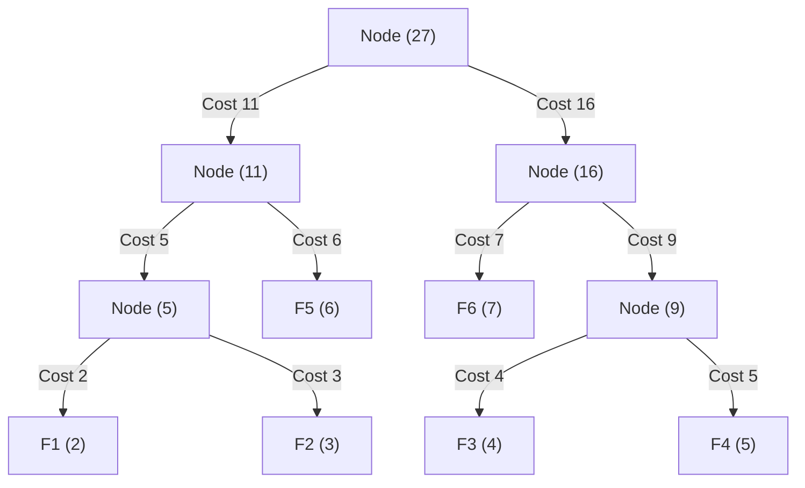

# Optimal Merge Pattern (Greedy Compression & File Merging)

## 1. Introduction

The **Optimal Merge Pattern** is a classic algorithmic problem solved using the **Greedy Paradigm**.

Suppose we are given $n$ sorted files of varying sizes:
$$S = \{F_1, F_2, F_3, \dots, F_n\}$$
where file $F_i$ contains $L_i$ records.

When two sorted files of sizes $X$ and $Y$ are merged into a single sorted file, the number of record comparisons/movements required is:
$$\text{Merge Cost} = X + Y$$

If we have more than two files, we must perform a sequence of pairwise merges until only one single merged file remains. The order in which we merge files drastically impacts the **total computational cost (total record moves)**.

The objective of the **Optimal Merge Pattern** is to determine a merge sequence that **minimizes the total merge cost**.

---

## 2. Why Use This Algorithm?

### Greedy Strategy & Mathematical Optimality:
Consider 4 files of sizes: `F1 = 20`, `F2 = 30`, `F3 = 10`, `F4 = 5`.

1. **Sub-optimal Merge Order:** Merge `F1(20)` and `F2(30)` $\rightarrow$ Cost = 50. Pool = `[50, 10, 5]`.
   - Merge `50` and `F3(10)` $\rightarrow$ Cost = 60. Pool = `[60, 5]`.
   - Merge `60` and `F4(5)` $\rightarrow$ Cost = 65.
   - **Total Cost:** $50 + 60 + 65 = \mathbf{175 \text{ record moves}}$.

2. **Optimal Greedy Order (Smallest First):**
   - Pick two smallest: `F4(5)` and `F3(10)` $\rightarrow$ Cost = 15. Pool = `[15, F1(20), F2(30)]`.
   - Pick two smallest: `15` and `F1(20)` $\rightarrow$ Cost = 35. Pool = `[35, F2(30)]`.
   - Pick two smallest: `35` and `F2(30)` $\rightarrow$ Cost = 65.
   - **Total Cost:** $15 + 35 + 65 = \mathbf{115 \text{ record moves}}$.
   - **Savings:** **34.3% reduction** in disk/memory I/O overhead!

### Core Mathematical Principle:
In the binary merge tree, smaller files should be placed deeper down the tree, while larger files remain close to the root. If file $F_i$ is at depth $d_i$ in the merge tree, its contribution to the total cost is:
$$\text{Total Cost} = \sum_{i=1}^{n} d_i \cdot L_i$$
By greedily selecting the **two smallest files** at every step, we minimize the weighted path length (identical to building a Huffman Tree!).

---

## 3. Real-World Applications

- **Database External Merge Sort (DBMS):** When sorting massive tables that exceed RAM, data is split into sorted disk runs. Database engines (e.g., PostgreSQL, MySQL InnoDB) use optimal merge patterns to combine runs with minimal I/O.
- **Log Aggregation & Analytics:** Merging distributed log streams from hundreds of microservices into centralized analytical data lakes (e.g., Elasticsearch, Apache Kafka).
- **Big Data Processing (Apache Spark / Hadoop MapReduce):** Merging intermediate map output spill files before the reduce phase.
- **File System & Video/Audio Concatenation:** Combining multiple raw audio/video chunks in media rendering pipelines.
- **Connecting Ropes / Cables:** A standard interview variation (e.g., LeetCode 1167: Minimum Cost to Connect Sticks).

---

## 4. Prerequisites

Before learning Optimal Merge Pattern, you should be comfortable with:
- **Min-Priority Queue / Min-Heap:** Operations `insert()` and `extractMin()` taking $O(\log n)$ time.
- **Binary Trees:** Concept of internal nodes, leaves, and path depth.
- **Greedy Paradigm:** Understanding local optimal choices leading to global optimization.

---

## 5. Visualization

### Optimal Merge Tree for File Sizes: `[2, 3, 4, 5, 6, 7]`

```
Initial Min-Heap: [2, 3, 4, 5, 6, 7]

Step 1: Pop (2, 3) -> Merge Cost = 5.  Push 5. Heap: [4, 5, 5, 6, 7]
Step 2: Pop (4, 5) -> Merge Cost = 9.  Push 9. Heap: [5, 6, 7, 9]
Step 3: Pop (5, 6) -> Merge Cost = 11. Push 11. Heap: [7, 9, 11]
Step 4: Pop (7, 9) -> Merge Cost = 16. Push 16. Heap: [11, 16]
Step 5: Pop (11, 16) -> Merge Cost = 27. Push 27. Heap: [27] (Done)

Total Minimal Cost = 5 + 9 + 11 + 16 + 27 = 68
```

### Complete Merge Tree Diagram



---

## 6. How It Works

1. **Insert into Min-Heap:** Place all $n$ initial file sizes into a Min-Priority Queue.
2. **Greedy Merge Loop:**
   - While the size of the Min-Heap is greater than 1:
     - Extract the smallest element $a = \text{heap.popMin()}$.
     - Extract the second smallest element $b = \text{heap.popMin()}$.
     - Compute merge cost for this pair: $\text{cost} = a + b$.
     - Accumulate total cost: $\text{totalCost} += \text{cost}$.
     - Insert the merged size back: $\text{heap.push}(a + b)$.
3. **Return Result:** When 1 element remains in the heap, `totalCost` contains the minimum total record moves.

---

## 7. Step-by-Step Algorithm

1. Input: An array `files[]` of $n$ file sizes.
2. If $n \le 1$, return `0`.
3. Build a Min-Heap $Q$ containing all elements of `files[]`.
4. Initialize `totalCost = 0`.
5. Loop while $Q.\text{size}() > 1$:
   - $a = Q.\text{extractMin}()$
   - $b = Q.\text{extractMin}()$
   - $\text{currentCost} = a + b$
   - $\text{totalCost} += \text{currentCost}$
   - $Q.\text{insert}(\text{currentCost})$
6. Return `totalCost`.

---

## 8. Pseudocode

```text
function optimalMergePattern(fileSizes):
    n = length(fileSizes)
    if n <= 1:
        return 0

    minHeap = PriorityQueue(ascending)
    for size in fileSizes:
        minHeap.push(size)

    totalCost = 0

    while minHeap.size() > 1:
        file1 = minHeap.pop()
        file2 = minHeap.pop()
        
        mergedSize = file1 + file2
        totalCost += mergedSize
        
        minHeap.push(mergedSize)

    return totalCost
```

---

## 9. Code Examples

### C Implementation

```c
#include <stdio.h>
#include <stdlib.h>

typedef struct {
    long long *array;
    int size;
    int capacity;
} MinHeap;

MinHeap* createMinHeap(int capacity) {
    MinHeap* minHeap = (MinHeap*)malloc(sizeof(MinHeap));
    minHeap->size = 0;
    minHeap->capacity = capacity;
    minHeap->array = (long long*)malloc(capacity * sizeof(long long));
    return minHeap;
}

void swap(long long* a, long long* b) {
    long long t = *a;
    *a = *b;
    *b = t;
}

void minHeapify(MinHeap* minHeap, int idx) {
    int smallest = idx;
    int left = 2 * idx + 1;
    int right = 2 * idx + 2;

    if (left < minHeap->size && minHeap->array[left] < minHeap->array[smallest])
        smallest = left;

    if (right < minHeap->size && minHeap->array[right] < minHeap->array[smallest])
        smallest = right;

    if (smallest != idx) {
        swap(&minHeap->array[smallest], &minHeap->array[idx]);
        minHeapify(minHeap, smallest);
    }
}

void insertMinHeap(MinHeap* minHeap, long long val) {
    minHeap->size++;
    int i = minHeap->size - 1;
    minHeap->array[i] = val;

    while (i && minHeap->array[i] < minHeap->array[(i - 1) / 2]) {
        swap(&minHeap->array[i], &minHeap->array[(i - 1) / 2]);
        i = (i - 1) / 2;
    }
}

long long extractMin(MinHeap* minHeap) {
    if (minHeap->size <= 0) return -1;
    long long root = minHeap->array[0];
    minHeap->array[0] = minHeap->array[minHeap->size - 1];
    minHeap->size--;
    minHeapify(minHeap, 0);
    return root;
}

long long optimalMergePattern(long long files[], int n) {
    if (n <= 1) return 0;

    MinHeap* minHeap = createMinHeap(n);
    for (int i = 0; i < n; i++) {
        insertMinHeap(minHeap, files[i]);
    }

    long long totalCost = 0;

    while (minHeap->size > 1) {
        long long first = extractMin(minHeap);
        long long second = extractMin(minHeap);

        long long merged = first + second;
        totalCost += merged;

        insertMinHeap(minHeap, merged);
    }

    free(minHeap->array);
    free(minHeap);
    return totalCost;
}

int main() {
    long long files[] = {20, 30, 10, 5};
    int n = sizeof(files) / sizeof(files[0]);

    long long minCost = optimalMergePattern(files, n);
    printf("Minimum Total Merge Cost in C: %lld\n", minCost);

    return 0;
}
```

---

### C++ Implementation

```cpp
#include <iostream>
#include <vector>
#include <queue>

using namespace std;

long long optimalMergePattern(const vector<long long>& files) {
    if (files.size() <= 1) return 0;

    // Min-heap priority queue
    priority_queue<long long, vector<long long>, greater<long long>> minHeap(files.begin(), files.end());

    long long totalCost = 0;

    while (minHeap.size() > 1) {
        long long first = minHeap.top(); minHeap.pop();
        long long second = minHeap.top(); minHeap.pop();

        long long merged = first + second;
        totalCost += merged;

        minHeap.push(merged);
    }

    return totalCost;
}

int main() {
    vector<long long> files = {2, 3, 4, 5, 6, 7};

    long long minCost = optimalMergePattern(files);
    cout << "Minimum Total Merge Cost in C++: " << minCost << endl;

    return 0;
}
```

---

### Java Implementation

```java
import java.util.PriorityQueue;

public class OptimalMergePattern {

    public static long getMinMergeCost(long[] files) {
        if (files == null || files.length <= 1) {
            return 0;
        }

        PriorityQueue<Long> minHeap = new PriorityQueue<>();
        for (long file : files) {
            minHeap.add(file);
        }

        long totalCost = 0;

        while (minHeap.size() > 1) {
            long first = minHeap.poll();
            long second = minHeap.poll();

            long merged = first + second;
            totalCost += merged;

            minHeap.add(merged);
        }

        return totalCost;
    }

    public static void main(String[] args) {
        long[] files = {20, 30, 10, 5};

        long minCost = getMinMergeCost(files);
        System.out.println("Minimum Total Merge Cost in Java: " + minCost);
    }
}
```

---

### Python Implementation

```python
import heapq
from typing import List

def optimal_merge_pattern(files: List[int]) -> int:
    if len(files) <= 1:
        return 0

    # Convert list to min-heap in O(N)
    min_heap = list(files)
    heapq.heapify(min_heap)

    total_cost = 0

    while len(min_heap) > 1:
        first = heapq.heappop(min_heap)
        second = heapq.heappop(min_heap)

        merged = first + second
        total_cost += merged

        heapq.heappush(min_heap, merged)

    return total_cost


if __name__ == "__main__":
    file_sizes = [20, 30, 10, 5]
    result = optimal_merge_pattern(file_sizes)
    print(f"Minimum Total Merge Cost in Python: {result}")
```

---

### JavaScript Implementation

```javascript
class MinPriorityQueue {
    constructor() {
        this.heap = [];
    }

    push(val) {
        this.heap.push(val);
        this.bubbleUp(this.heap.length - 1);
    }

    pop() {
        if (this.size() === 0) return null;
        if (this.size() === 1) return this.heap.pop();
        const top = this.heap[0];
        this.heap[0] = this.heap.pop();
        this.bubbleDown(0);
        return top;
    }

    size() {
        return this.heap.length;
    }

    bubbleUp(idx) {
        while (idx > 0) {
            let parent = Math.floor((idx - 1) / 2);
            if (this.heap[idx] < this.heap[parent]) {
                [this.heap[idx], this.heap[parent]] = [this.heap[parent], this.heap[idx]];
                idx = parent;
            } else break;
        }
    }

    bubbleDown(idx) {
        const len = this.heap.length;
        while (true) {
            let left = 2 * idx + 1;
            let right = 2 * idx + 2;
            let smallest = idx;

            if (left < len && this.heap[left] < this.heap[smallest]) smallest = left;
            if (right < len && this.heap[right] < this.heap[smallest]) smallest = right;

            if (smallest !== idx) {
                [this.heap[idx], this.heap[smallest]] = [this.heap[smallest], this.heap[idx]];
                idx = smallest;
            } else break;
        }
    }
}

function optimalMergePattern(files) {
    if (!files || files.length <= 1) return 0;

    const pq = new MinPriorityQueue();
    files.forEach(f => pq.push(f));

    let totalCost = 0;

    while (pq.size() > 1) {
        const first = pq.pop();
        const second = pq.pop();

        const merged = first + second;
        totalCost += merged;

        pq.push(merged);
    }

    return totalCost;
}

// Execution Demo
const files = [20, 30, 10, 5];
console.log("Minimum Total Merge Cost in JS:", optimalMergePattern(files));
```

---

## 10. Code Explanation

1. **Heap Initialization:** Converts the file sizes array into a Min-Heap in $O(n)$ time using `heapify`.
2. **Greedy Pairwise Selection:** Extracts the two smallest remaining sizes at each iteration using `pop()` in $O(\log n)$ time.
3. **Cost Accumulation:** Adds `first + second` to `totalCost`.
4. **Re-insertion:** Pushes the merged file back into the Min-Heap in $O(\log n)$ time so it can be combined with other files in subsequent steps.

---

## 11. Interactive Demo

An interactive optimal merge visualizer includes:
1. **File Input Array Field:** Dynamic input for comma-separated file sizes (e.g. `[12, 5, 8, 2, 19]`).
2. **K-Way Merge Selector:** Toggle between 2-Way Merge (standard binary tree) and K-Way Merge ($K \ge 3$).
3. **Step-by-Step Tree Builder:**
   - Highlights the 2 smallest nodes in blue.
   - Animates node merging into a new parent node.
   - Updates total cumulative cost gauge.
4. **Comparison Mode:** Displays side-by-side total costs for *Optimal Merge* vs *Naive Sequential Merge*.

---

## 12. Dry Run

### Sample Input File Sizes: `[5, 10, 20, 30]`

#### Initial Heap: `[5, 10, 20, 30]`

| Step | Heap State Before | Extracted $a$ | Extracted $b$ | Merged Size ($a+b$) | Total Cost Accumulated | Heap State After |
| :--- | :--- | :--- | :--- | :--- | :--- | :--- |
| **1** | `[5, 10, 20, 30]` | 5 | 10 | 15 | $0 + 15 = \mathbf{15}$ | `[15, 20, 30]` |
| **2** | `[15, 20, 30]` | 15 | 20 | 35 | $15 + 35 = \mathbf{50}$ | `[30, 35]` |
| **3** | `[30, 35]` | 30 | 35 | 65 | $50 + 65 = \mathbf{115}$ | `[65]` |

#### Final Output:
- **Total Minimum Merge Cost:** **115**

---

## 13. Time & Space Complexity

| Operation | Time Complexity | Auxiliary Space Complexity | Explanation |
| :--- | :--- | :--- | :--- |
| **Heapify** | $O(n)$ | $O(n)$ | Builds Min-Heap of size $n$. |
| **Greedy Loop** | $O(n \log n)$ | $O(n)$ | Performs $n-1$ iterations; each step calls 2 `pop`s and 1 `push` ($O(\log n)$). |
| **Total Complexity** | **$O(n \log n)$** | **$O(n)$** | Dominated by priority queue operations. |

---

## 14. Advantages

- **Proved Optimality:** Guarantees minimum total record movements for pairwise merging.
- **Fast Execution:** $O(n \log n)$ complexity executes in milliseconds for millions of files.
- **Identical Structure to Huffman Trees:** Reuses standard Min-Heap / Huffman tree building algorithms.

---

## 15. Disadvantages

- **Sequential Dependency:** Pairwise merging produces sequential tree structures that must wait for sub-merges to complete.
- **Requires Memory for Priority Queue:** $O(n)$ auxiliary space to hold priority queue elements.

---

## 16. Applications

- **Database Query Engine Optimizations:** Multi-way join and sort-merge operations.
- **Storage Systems:** RAID / ZFS disk reconstruction and file deduplication block merging.
- **Text & Document Search Engines:** Merging posting lists in inverted search indices (Lucene / Elasticsearch).

---

## 17. Common Mistakes

1. **Sorting Array Once (Naive Mistake):** Sorting the array initially and just taking adjacent elements fails because intermediate merged sums can be larger than remaining unmerged elements!
2. **Integer Overflow:** Summing large file sizes can overflow 32-bit signed integers. Always use 64-bit integers (`long long` in C/C++, `long` in Java).
3. **K-Way Merge Padding Mistake:** For K-way optimal merge pattern, if $(n - 1) \pmod{K - 1} \ne 0$, dummy 0-sized files MUST be padded initially.

---

## 18. Interview Questions

1. **How is the Optimal Merge Pattern related to Huffman Coding?** (Answer: Both build an extended binary tree with minimum weighted external path length $\sum d_i \cdot w_i$).
2. **How do you extend the Optimal Merge Pattern to a K-Way Merge?** (Answer: Pop $K$ smallest files at each step instead of 2. Pad with dummy zero-sized files if necessary).
3. **Why does sorting the array once NOT produce the optimal result?**
4. **Prove why greedily choosing the two smallest sizes yields the global minimum cost.**

---

## 19. Practice Problems

### Easy
1. LeetCode 1167: Minimum Cost to Connect Sticks / Ropes.
2. Given file sizes `[6, 5, 2, 3]`, find the minimum merge cost.

### Medium
3. Minimum Cost to Merge Stones (LeetCode 1000): K-way merging with contiguous interval constraints (DP + Prefix Sums).
4. Merge K Sorted Lists (LeetCode 23).

### Hard
5. Optimal K-Way Merge Pattern with dummy padding implementation.

---

## 20. Related Algorithms

- **Huffman Coding:** $O(n \log n)$ greedy tree construction for data compression.
- **External Merge Sort:** Disk-based sorting algorithm using optimal merge patterns.
- **Merge Sort:** Divide-and-conquer $O(n \log n)$ sorting algorithm.

---

## 21. Summary

- **Category:** Greedy Algorithm.
- **Time Complexity:** $O(n \log n)$ using a Min-Heap.
- **Space Complexity:** $O(n)$ for the priority queue.
- **Core Rule:** **Repeatedly extract and merge the two smallest files** until only one merged file remains.

---

## 22. Quiz

#### Question 1: What data structure is used to implement Optimal Merge Pattern efficiently?
- A) Stack
- B) Min-Priority Queue (Min-Heap)
- C) Hash Map
- D) Queue
- **Correct Answer:** B
- **Explanation:** A Min-Heap allows extracting the two smallest files in $O(\log n)$ time.

#### Question 2: What is the merge cost of combining two files of size 15 and 25?
- A) 15
- B) 25
- C) 40
- D) 375
- **Correct Answer:** C
- **Explanation:** Merging two sorted files of size $X$ and $Y$ requires $X + Y$ comparisons/moves.

#### Question 3: Given 3 file sizes `[10, 20, 30]`, what is the minimum total merge cost?
- A) 60
- B) 90
- C) 100
- D) 120
- **Correct Answer:** B
- **Explanation:** Step 1: Merge 10 & 20 = 30 (cost 30). Step 2: Merge 30 & 30 = 60 (cost 60). Total = $30 + 60 = 90$.

#### Question 4: What is the time complexity of Optimal Merge Pattern for $n$ files?
- A) $O(n)$
- B) $O(n \log n)$
- C) $O(n^2)$
- D) $O(2^n)$
- **Correct Answer:** B
- **Explanation:** Building heap takes $O(n)$, and $n-1$ iterations with heap operations take $O(n \log n)$.

#### Question 5: Which famous algorithm is mathematically identical to 2-Way Optimal Merge Pattern?
- A) Dijkstra's Algorithm
- B) Huffman Coding
- C) Kruskal's Algorithm
- D) Kadane's Algorithm
- **Correct Answer:** B
- **Explanation:** Both build a minimum weighted path extended binary tree using a greedy Min-Heap.

#### Question 6: Why does sorting the array once initially NOT work for finding optimal merge cost?
- A) Sorting takes too long.
- B) Intermediate merged sums might be larger than subsequent original elements.
- C) Sorting corrupts file data.
- D) Array indices are lost.
- **Correct Answer:** B
- **Explanation:** Merging two small numbers can produce a larger sum that needs to be inserted further back into the sorted sequence.

#### Question 7: For a K-Way Optimal Merge Pattern, how many elements are popped from the heap at each step?
- A) 2
- B) $K$
- C) $K - 1$
- D) All elements
- **Correct Answer:** B
- **Explanation:** A K-way merge combines $K$ smallest files in each step into 1 merged file.

#### Question 8: What is the space complexity of Optimal Merge Pattern?
- A) $O(1)$
- B) $O(n)$
- C) $O(n^2)$
- D) $O(\log n)$
- **Correct Answer:** B
- **Explanation:** Auxiliary memory is required to store the $n$ elements in the priority queue.

#### Question 9: What happens if $n=1$ file is passed to the algorithm?
- A) Cost is 0 (no merges needed).
- B) Cost is 1.
- C) Throws error.
- D) Infinite loop.
- **Correct Answer:** A
- **Explanation:** A single file is already merged, so 0 moves are required.

#### Question 10: In LeetCode 1167 ("Minimum Cost to Connect Sticks"), what represents the file sizes?
- A) Stick lengths
- B) Stick colors
- C) Stick positions
- D) Stick angles
- **Correct Answer:** A
- **Explanation:** Connecting sticks of length $X$ and $Y$ costs $X + Y$, making it identical to Optimal Merge Pattern.
