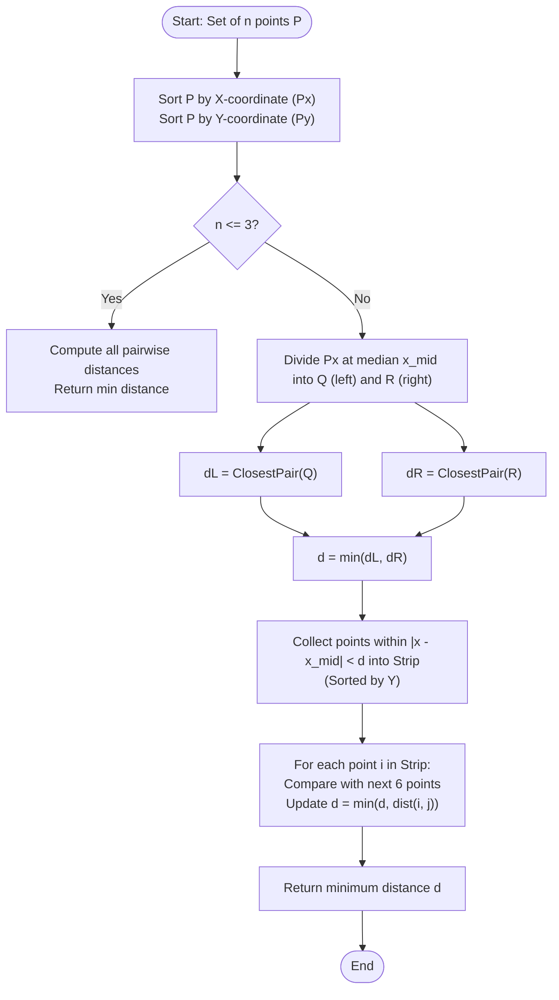

# Closest Pair of Points (Divide & Conquer Computational Geometry)

## 1. Introduction

The **Closest Pair of Points** problem is a cornerstone of **Computational Geometry**, solved efficiently using the **Divide & Conquer** algorithmic paradigm.

Given a set of $n$ points in a 2D Cartesian coordinate plane:
$$P = \{p_1, p_2, \dots, p_n\} \quad \text{where } p_i = (x_i, y_i)$$

The objective is to find a pair of distinct points $(p_i, p_j)$ that minimizes the **Euclidean Distance**:
$$d(p_i, p_j) = \sqrt{(x_i - x_j)^2 + (y_i - y_j)^2}$$

While a naive brute-force search compares all $\binom{n}{2} = \frac{n(n-1)}{2}$ pairs in **$O(n^2)$ time**, the Divide & Conquer approach reduces the time complexity to **$O(n \log n)$**.

---

## 2. Why Use This Algorithm?

### Quadratic $O(n^2)$ vs. $O(n \log n)$ Divide & Conquer:
Suppose we have $n = 1,000,000$ points (e.g., GPS coordinates of vehicles or radar contacts):
- **Brute-Force ($O(n^2)$):** Evaluates $\approx 5 \times 10^{11}$ distance calculations, taking several minutes or hours.
- **Divide & Conquer ($O(n \log n)$):** Evaluates $\approx 2 \times 10^7$ operations, completing in **under 30 milliseconds**!

### Key Geometric Property (The $d \times 2d$ Strip Proof):
Why does Divide & Conquer achieve $O(n \log n)$ instead of degrading back to $O(n^2)$ during the combine step?

Suppose we divide points into left half $Q$ and right half $R$ by a vertical line $x = x_{\text{mid}}$.
1. Let $d_L$ be the minimum distance in the left half $Q$.
2. Let $d_R$ be the minimum distance in the right half $R$.
3. Let $d = \min(d_L, d_R)$.

A cross-border pair $(p_{\text{left}} \in Q, p_{\text{right}} \in R)$ can only be closer than $d$ if both points lie inside a **vertical strip of width $2d$** centered at $x = x_{\text{mid}}$ ($[x_{\text{mid}} - d, \, x_{\text{mid}} + d]$).

**The 6-Point Rule:** If we collect all points in this $2d$-wide strip and sort them by Y-coordinate, for every point $p_i$ in the strip, we **only need to check at most the next 6 points** ($p_{i+1}, \dots, p_{i+6}$)!

Why? The area of a $d \times 2d$ rectangle on one side of the median line can hold at most 6 points such that no two points in the same half are closer than $d$. Thus, the inner loop runs in **constant time $O(1)$** (at most 6 comparisons per point), yielding the linear combine step $O(n)$!

---

## 3. Real-World Applications

- **Air Traffic Control & Radar Defense:** Real-time collision threat detection by monitoring minimum separation distances between aircraft trajectories.
- **Computer Graphics & Game Physics Engines:** Broad-phase collision detection between 2D entities, particles, or hitboxes.
- **Geographic Information Systems (GIS):** Locating the two nearest emergency facilities, cell towers, or service nodes in a geographic region.
- **Semiconductor & VLSI Chip Design:** Checking spacing rule constraints on integrated circuit layouts to prevent electrical short circuits.
- **Cluster Analysis & Pattern Recognition:** Identifying closest data clusters in spatial data mining.

---

## 4. Prerequisites

Before learning Closest Pair of Points, you should be familiar with:
- **Euclidean Distance Formula:** $d = \sqrt{\Delta x^2 + \Delta y^2}$.
- **Divide & Conquer (Merge Sort):** Recursively dividing problems and combining solutions in $O(n)$ time.
- **Coordinate Sorting:** Custom comparators sorting points by $X$ and $Y$ coordinates.

---

## 5. Visualization

### Vertical Line Division & Central Strip

```
Y ^
  |       Q (Left Half)        |       R (Right Half)
  |   . p1                     |              . p6
  |            . p2            |    . p5
  | ---------------------------+------------------------ x = x_mid
  |       . p3        |  . p4  |  . p7
  |                   |        |
  |                   |<--d--->|<--d--->|
  |                   |  STRIP | REGION |
  +--------------------------------------------------------> X
                      x_mid - d   x_mid + d
```

### The $d \times 2d$ Bounding Grid Proof

```
+-------------------+-------------------+ ^
|                   |                   | |
|   Square 1 (dxd)  |   Square 2 (dxd)  | d
|   (Max 4 points)  |   (Max 4 points)  | |
|                   |                   | v
+-------------------+-------------------+
<--------- d -------><--------- d ------->
```
Because points in the left half are at least $d$ apart, at most 4 points can fit in a $d \times d$ square. In the $d \times 2d$ rectangle spanning both halves, at most **6 to 8 points** can exist within Y-distance $d$.

### Mermaid Flowchart



---

## 6. How It Works

1. **Preprocessing (Sorting):**
   - Create array $P_x$ sorted by X-coordinate.
   - Create array $P_y$ sorted by Y-coordinate.
2. **Base Case ($n \le 3$):**
   - When 3 or fewer points remain, calculate all pairwise Euclidean distances directly in $O(1)$ time and return the minimum.
3. **Divide Step:**
   - Find the midpoint index $m = n / 2$ and median line $x = P_x[m].x$.
   - Split $P_x$ into left half $Q_x$ and right half $R_x$.
   - Split $P_y$ into left half $Q_y$ and right half $R_y$ preserving Y-order.
4. **Conquer Step:**
   - Recursively compute $d_L = \text{closestPair}(Q_x, Q_y)$.
   - Recursively compute $d_R = \text{closestPair}(R_x, R_y)$.
   - Let $d = \min(d_L, d_R)$.
5. **Combine Step (Strip Check):**
   - Filter points from $P_y$ whose $|p.x - x_{\text{mid}}| < d$ into an array `strip[]`.
   - For each point `strip[i]`:
     - Compare distance with `strip[j]` for $j = i+1$ to $\min(i+7, \text{strip.length}-1)$.
     - If $\text{dist}(\text{strip}[i], \text{strip}[j]) < d$, update $d$.
6. **Return $d$** (and optionally the pair of points).

---

## 7. Step-by-Step Algorithm

1. Input: Array of $n$ 2D points $P[0 \dots n-1]$.
2. Sort $P$ by X-coordinates $\rightarrow P_x$.
3. Sort $P$ by Y-coordinates $\rightarrow P_y$.
4. Define recursive function `closestUtil(Px, Py, n)`:
   - If $n \le 3$, use brute force $O(1)$ search and return min distance.
   - $mid = n / 2$, $midPoint = P_x[mid]$.
   - Split $P_y$ into $Q_y$ (points in left half) and $R_y$ (points in right half).
   - $d_L = \text{closestUtil}(P_x[0 \dots mid], Q_y, mid)$
   - $d_R = \text{closestUtil}(P_x[mid \dots n-1], R_y, n - mid)$
   - $d = \min(d_L, d_R)$
   - Build `strip[]` containing points from $P_y$ where $|p.x - midPoint.x| < d$.
   - For $i = 0$ to `strip.size() - 1`:
     - For $j = i + 1$ to $\min(i + 7, \text{strip.size}() - 1)$:
       - If `strip[j].y - strip[i].y >= d`, break loop.
       - $d = \min(d, \text{dist}(\text{strip}[i], \text{strip}[j]))$.
   - Return $d$.

---

## 8. Pseudocode

```text
struct Point:
    double x, y

function distance(p1, p2):
    return sqrt((p1.x - p2.x)^2 + (p1.y - p2.y)^2)

function bruteForce(points, n):
    minDist = INF
    for i from 0 to n-1:
        for j from i+1 to n-1:
            minDist = min(minDist, distance(points[i], points[j]))
    return minDist

function stripClosest(strip, size, d):
    minDist = d
    for i from 0 to size-1:
        j = i + 1
        while j < size and (strip[j].y - strip[i].y) < minDist:
            minDist = min(minDist, distance(strip[i], strip[j]))
            j++
            if (j - i) > 7: break  // Optimization: at most 6-7 points
    return minDist

function closestUtil(Px, Py, n):
    if n <= 3:
        return bruteForce(Px, n)

    mid = n / 2
    midPoint = Px[mid]

    Qy = [], Ry = []
    for point in Py:
        if point.x <= midPoint.x:
            Qy.append(point)
        else:
            Ry.append(point)

    dL = closestUtil(Px[0..mid], Qy, mid)
    dR = closestUtil(Px[mid..n], Ry, n - mid)

    d = min(dL, dR)

    strip = []
    for point in Py:
        if abs(point.x - midPoint.x) < d:
            strip.append(point)

    return min(d, stripClosest(strip, strip.length, d))

function closestPair(P, n):
    Px = sort(P, by x)
    Py = sort(P, by y)
    return closestUtil(Px, Py, n)
```

---

## 9. Code Examples

### C Implementation

```c
#include <stdio.h>
#include <stdlib.h>
#include <math.h>

typedef struct {
    double x, y;
} Point;

int compareX(const void* a, const void* b) {
    Point* p1 = (Point*)a;
    Point* p2 = (Point*)b;
    return (p1->x > p2->x) - (p1->x < p2->x);
}

int compareY(const void* a, const void* b) {
    Point* p1 = (Point*)a;
    Point* p2 = (Point*)b;
    return (p1->y > p2->y) - (p1->y < p2->y);
}

double dist(Point p1, Point p2) {
    return sqrt((p1.x - p2.x) * (p1.x - p2.x) + (p1.y - p2.y) * (p1.y - p2.y));
}

double bruteForce(Point P[], int n) {
    double minD = 1e18;
    for (int i = 0; i < n; ++i)
        for (int j = i + 1; j < n; ++j)
            if (dist(P[i], P[j]) < minD)
                minD = dist(P[i], P[j]);
    return minD;
}

double minDouble(double a, double b) {
    return (a < b) ? a : b;
}

double stripClosest(Point strip[], int size, double d) {
    double minD = d;
    qsort(strip, size, sizeof(Point), compareY);

    for (int i = 0; i < size; ++i)
        for (int j = i + 1; j < size && (strip[j].y - strip[i].y) < minD; ++j)
            if (dist(strip[i], strip[j]) < minD)
                minD = dist(strip[i], strip[j]);

    return minD;
}

double closestUtil(Point Px[], Point Py[], int n) {
    if (n <= 3)
        return bruteForce(Px, n);

    int mid = n / 2;
    Point midPoint = Px[mid];

    Point* Qy = (Point*)malloc(mid * sizeof(Point));
    Point* Ry = (Point*)malloc((n - mid) * sizeof(Point));
    int li = 0, ri = 0;

    for (int i = 0; i < n; i++) {
        if (Py[i].x <= midPoint.x && li < mid)
            Qy[li++] = Py[i];
        else
            Ry[ri++] = Py[i];
    }

    double dl = closestUtil(Px, Qy, mid);
    double dr = closestUtil(Px + mid, Ry, n - mid);

    free(Qy);
    free(Ry);

    double d = minDouble(dl, dr);

    Point* strip = (Point*)malloc(n * sizeof(Point));
    int j = 0;
    for (int i = 0; i < n; i++)
        if (fabs(Py[i].x - midPoint.x) < d)
            strip[j++] = Py[i];

    double minStrip = stripClosest(strip, j, d);
    free(strip);

    return minDouble(d, minStrip);
}

double closest(Point P[], int n) {
    Point* Px = (Point*)malloc(n * sizeof(Point));
    Point* Py = (Point*)malloc(n * sizeof(Point));
    for (int i = 0; i < n; i++) {
        Px[i] = P[i];
        Py[i] = P[i];
    }

    qsort(Px, n, sizeof(Point), compareX);
    qsort(Py, n, sizeof(Point), compareY);

    double result = closestUtil(Px, Py, n);

    free(Px);
    free(Py);
    return result;
}

int main() {
    Point P[] = {{2, 3}, {12, 30}, {40, 50}, {5, 1}, {12, 10}, {3, 4}};
    int n = sizeof(P) / sizeof(P[0]);

    printf("The smallest distance in C is %f\n", closest(P, n));
    return 0;
}
```

---

### C++ Implementation

```cpp
#include <iostream>
#include <vector>
#include <cmath>
#include <algorithm>
#include <cfloat>

using namespace std;

struct Point {
    double x, y;
};

double dist(Point p1, Point p2) {
    return sqrt((p1.x - p2.x) * (p1.x - p2.x) + (p1.y - p2.y) * (p1.y - p2.y));
}

double bruteForce(const vector<Point>& P, int n) {
    double minD = DBL_MAX;
    for (int i = 0; i < n; ++i)
        for (int j = i + 1; j < n; ++j)
            minD = min(minD, dist(P[i], P[j]));
    return minD;
}

double stripClosest(vector<Point>& strip, double d) {
    double minD = d;
    int size = strip.size();

    for (int i = 0; i < size; ++i) {
        for (int j = i + 1; j < size && (strip[j].y - strip[i].y) < minD; ++j) {
            minD = min(minD, dist(strip[i], strip[j]));
        }
    }
    return minD;
}

double closestUtil(const vector<Point>& Px, const vector<Point>& Py) {
    int n = Px.size();
    if (n <= 3) return bruteForce(Px, n);

    int mid = n / 2;
    Point midPoint = Px[mid];

    vector<Point> PxL(Px.begin(), Px.begin() + mid);
    vector<Point> PxR(Px.begin() + mid, Px.end());

    vector<Point> PyL, PyR;
    for (const auto& p : Py) {
        if (p.x <= midPoint.x && PyL.size() < PxL.size())
            PyL.push_back(p);
        else
            PyR.push_back(p);
    }

    double dL = closestUtil(PxL, PyL);
    double dR = closestUtil(PxR, PyR);
    double d = min(dL, dR);

    vector<Point> strip;
    for (const auto& p : Py) {
        if (abs(p.x - midPoint.x) < d)
            strip.push_back(p);
    }

    return min(d, stripClosest(strip, d));
}

double closestPair(vector<Point>& P) {
    vector<Point> Px = P;
    vector<Point> Py = P;

    sort(Px.begin(), Px.end(), [](const Point& a, const Point& b) { return a.x < b.x; });
    sort(Py.begin(), Py.end(), [](const Point& a, const Point& b) { return a.y < b.y; });

    return closestUtil(Px, Py);
}

int main() {
    vector<Point> P = {{2, 3}, {12, 30}, {40, 50}, {5, 1}, {12, 10}, {3, 4}};
    cout << "The smallest distance in C++ is: " << closestPair(P) << endl;
    return 0;
}
```

---

### Java Implementation

```java
import java.util.ArrayList;
import java.util.Arrays;
import java.util.Comparator;
import java.util.List;

public class ClosestPair {

    static class Point {
        double x, y;

        Point(double x, double y) {
            this.x = x;
            this.y = y;
        }
    }

    public static double dist(Point p1, Point p2) {
        return Math.sqrt((p1.x - p2.x) * (p1.x - p2.x) + (p1.y - p2.y) * (p1.y - p2.y));
    }

    public static double bruteForce(Point[] P, int n) {
        double minD = Double.MAX_VALUE;
        for (int i = 0; i < n; i++) {
            for (int j = i + 1; j < n; j++) {
                minD = Math.min(minD, dist(P[i], P[j]));
            }
        }
        return minD;
    }

    public static double stripClosest(List<Point> strip, double d) {
        double minD = d;
        int size = strip.size();

        for (int i = 0; i < size; i++) {
            for (int j = i + 1; j < size && (strip.get(j).y - strip.get(i).y) < minD; j++) {
                minD = Math.min(minD, dist(strip.get(i), strip.get(j)));
            }
        }
        return minD;
    }

    public static double closestUtil(Point[] Px, Point[] Py, int n) {
        if (n <= 3) {
            return bruteForce(Px, n);
        }

        int mid = n / 2;
        Point midPoint = Px[mid];

        Point[] PxL = Arrays.copyOfRange(Px, 0, mid);
        Point[] PxR = Arrays.copyOfRange(Px, mid, n);

        List<Point> PyL = new ArrayList<>();
        List<Point> PyR = new ArrayList<>();

        for (Point p : Py) {
            if (p.x <= midPoint.x && PyL.size() < PxL.length) {
                PyL.add(p);
            } else {
                PyR.add(p);
            }
        }

        double dL = closestUtil(PxL, PyL.toArray(new Point[0]), PxL.length);
        double dR = closestUtil(PxR, PyR.toArray(new Point[0]), PxR.length);
        double d = Math.min(dL, dR);

        List<Point> strip = new ArrayList<>();
        for (Point p : Py) {
            if (Math.abs(p.x - midPoint.x) < d) {
                strip.add(p);
            }
        }

        return Math.min(d, stripClosest(strip, d));
    }

    public static double findClosestPair(Point[] P) {
        Point[] Px = P.clone();
        Point[] Py = P.clone();

        Arrays.sort(Px, Comparator.comparingDouble(p -> p.x));
        Arrays.sort(Py, Comparator.comparingDouble(p -> p.y));

        return closestUtil(Px, Py, P.length);
    }

    public static void main(String[] args) {
        Point[] P = {
            new Point(2, 3),
            new Point(12, 30),
            new Point(40, 50),
            new Point(5, 1),
            new Point(12, 10),
            new Point(3, 4)
        };

        System.out.println("The smallest distance in Java is: " + findClosestPair(P));
    }
}
```

---

### Python Implementation

```python
import math
from typing import List, Tuple

class Point:
    def __init__(self, x: float, y: float):
        self.x = x
        self.y = y

    def __repr__(self):
        return f"({self.x}, {self.y})"


def dist(p1: Point, p2: Point) -> float:
    return math.hypot(p1.x - p2.x, p1.y - p2.y)


def brute_force(points: List[Point]) -> float:
    n = len(points)
    min_d = float('inf')
    for i in range(n):
        for j in range(i + 1, n):
            min_d = min(min_d, dist(points[i], points[j]))
    return min_d


def strip_closest(strip: List[Point], d: float) -> float:
    min_d = d
    size = len(strip)
    for i in range(size):
        j = i + 1
        while j < size and (strip[j].y - strip[i].y) < min_d:
            min_d = min(min_d, dist(strip[i], strip[j]))
            j += 1
    return min_d


def closest_util(px: List[Point], py: List[Point]) -> float:
    n = len(px)
    if n <= 3:
        return brute_force(px)

    mid = n // 2
    mid_point = px[mid]

    px_l = px[:mid]
    px_r = px[mid:]

    py_l = []
    py_r = []

    for p in py:
        if p.x <= mid_point.x and len(py_l) < len(px_l):
            py_l.append(p)
        else:
            py_r.append(p)

    dl = closest_util(px_l, py_l)
    dr = closest_util(px_r, py_r)
    d = min(dl, dr)

    strip = [p for p in py if abs(p.x - mid_point.x) < d]

    return min(d, strip_closest(strip, d))


def closest_pair(points: List[Point]) -> float:
    px = sorted(points, key=lambda p: p.x)
    py = sorted(points, key=lambda p: p.y)
    return closest_util(px, py)


if __name__ == "__main__":
    sample_points = [
        Point(2, 3),
        Point(12, 30),
        Point(40, 50),
        Point(5, 1),
        Point(12, 10),
        Point(3, 4)
    ]

    min_distance = closest_pair(sample_points)
    print(f"The smallest distance in Python is: {min_distance:.6f}")
```

---

### JavaScript Implementation

```javascript
class Point {
    constructor(x, y) {
        this.x = x;
        this.y = y;
    }
}

function dist(p1, p2) {
    return Math.hypot(p1.x - p2.x, p1.y - p2.y);
}

function bruteForce(points) {
    let minD = Infinity;
    const n = points.length;
    for (let i = 0; i < n; i++) {
        for (let j = i + 1; j < n; j++) {
            minD = Math.min(minD, dist(points[i], points[j]));
        }
    }
    return minD;
}

function stripClosest(strip, d) {
    let minD = d;
    const size = strip.length;
    for (let i = 0; i < size; i++) {
        for (let j = i + 1; j < size && (strip[j].y - strip[i].y) < minD; j++) {
            minD = Math.min(minD, dist(strip[i], strip[j]));
        }
    }
    return minD;
}

function closestUtil(Px, Py) {
    const n = Px.length;
    if (n <= 3) return bruteForce(Px);

    const mid = Math.floor(n / 2);
    const midPoint = Px[mid];

    const PxL = Px.slice(0, mid);
    const PxR = Px.slice(mid);

    const PyL = [];
    const PyR = [];

    for (const p of Py) {
        if (p.x <= midPoint.x && PyL.length < PxL.length) {
            PyL.push(p);
        } else {
            PyR.push(p);
        }
    }

    const dL = closestUtil(PxL, PyL);
    const dR = closestUtil(PxR, PyR);
    const d = Math.min(dL, dR);

    const strip = Py.filter(p => Math.abs(p.x - midPoint.x) < d);

    return Math.min(d, stripClosest(strip, d));
}

function closestPair(points) {
    const Px = [...points].sort((a, b) => a.x - b.x);
    const Py = [...points].sort((a, b) => a.y - b.y);
    return closestUtil(Px, Py);
}

// Execution Demo
const points = [
    new Point(2, 3),
    new Point(12, 30),
    new Point(40, 50),
    new Point(5, 1),
    new Point(12, 10),
    new Point(3, 4)
];

console.log("The smallest distance in JS:", closestPair(points));
```

---

## 10. Code Explanation

1. **Sorting Setup:** `Px` and `Py` are sorted by X and Y coordinates initially in $O(n \log n)$ time.
2. **Recursive Splitting:** `mid = n / 2` divides `Px` into left and right halves. `Py` is filtered into `PyL` and `PyR` preserving Y-order in $O(n)$ time.
3. **Recursive Sub-Problems:** Finds minimum distance $d = \min(d_L, d_R)$.
4. **Strip Filtering & Constant-Time Inner Scan:** Filters points in $Py$ within $|x - x_{\text{mid}}| < d$. In `stripClosest()`, points are ordered by Y, so the inner loop exits as soon as `strip[j].y - strip[i].y >= d`, making inner checks at most 6-7 points per iteration!

---

## 11. Interactive Demo

An interactive 2D geometry sandbox includes:
1. **Canvas Point Plotter:** Click to place points or generate $N$ random 2D points.
2. **Animation Controls:** Play, pause, step forward/backward through recursive divide steps.
3. **Visual Highlights:**
   - Red vertical dividing line $x = x_{\text{mid}}$.
   - Translucent yellow strip boundary $[x_{\text{mid}} - d, x_{\text{mid}} + d]$.
   - Glowing green segment connecting the current closest pair of points found.
4. **Efficiency Metrics:** Live comparison of total distance calculations evaluated by Divide & Conquer vs Brute-Force $O(n^2)$.

---

## 12. Dry Run

### Sample Points: `P1(2,3)`, `P2(12,30)`, `P3(40,50)`, `P4(5,1)`, `P5(12,10)`, `P6(3,4)`

#### Step 1: Initial Sorting
- `Px` (sorted by x): `[P1(2,3), P6(3,4), P4(5,1), P5(12,10), P2(12,30), P3(40,50)]`
- `Py` (sorted by y): `[P4(5,1), P1(2,3), P6(3,4), P5(12,10), P2(12,30), P3(40,50)]`

#### Step 2: Split at Median Index `mid = 3` ($x = 12$)
- Left Half `Q`: `[P1(2,3), P6(3,4), P4(5,1)]`
  - Min distance in `Q`: $d(P1, P6) = \sqrt{(2-3)^2 + (3-4)^2} = \sqrt{2} \approx \mathbf{1.4142}$
- Right Half `R`: `[P5(12,10), P2(12,30), P3(40,50)]`
  - Min distance in `R`: $d(P5, P2) = \sqrt{(12-12)^2 + (10-30)^2} = 20.0$
- $d = \min(1.4142, 20.0) = \mathbf{1.4142}$

#### Step 3: Strip Inspection
- Median line $x = 12$. Strip range: $[12 - 1.4142, 12 + 1.4142] = [10.5858, 13.4142]$.
- Points in strip: `P5(12,10)` and `P2(12,30)`.
- Distance between `P5` and `P2` is $20.0 > 1.4142$.

#### Final Result:
- **Minimum Distance:** **$\sqrt{2} \approx 1.414214$** between `P1(2,3)` and `P6(3,4)`.

---

## 13. Time & Space Complexity

| Operation | Time Complexity | Auxiliary Space Complexity | Explanation |
| :--- | :--- | :--- | :--- |
| **Initial Sorting** | $O(n \log n)$ | $O(n)$ | Sorts $n$ points by X and Y coordinates. |
| **Recurrence Relation** | $T(n) = 2T(n/2) + O(n)$ | $O(n)$ | By Master Theorem (Case 2), $T(n) = O(n \log n)$. |
| **Strip Comparison** | $O(n)$ per level | $O(n)$ | At most 6 comparisons per point in strip. |
| **Total Algorithm** | **$O(n \log n)$** | **$O(n)$** | Optimal asymptotic time for comparison-based 2D closest pair. |

---

## 14. Advantages

- **Asymptotically Optimal:** Solves 2D closest pair in $O(n \log n)$ time, matching lower bounds.
- **Scalable to Large $N$:** Efficiently handles millions of points.
- **Deterministic:** Guarantees absolute minimum distance without probabilistic approximations.

---

## 15. Disadvantages

- **Higher Dimension Overhead:** Generalizing to $K$-dimensional space increases strip comparison bound to $O(2^K)$, degrading towards $O(n \log n \cdot 2^K)$ (KD-Trees or Spatial Hashing are preferred for high $K$).
- **Implementation Complexity:** More complex to code than brute force or spatial hashing.

---

## 16. Applications

- Aircraft trajectory conflict resolution in airspace management.
- Astrophysics N-body gravitational simulations.
- Collision avoidance in autonomous mobile robots (AMRs).

---

## 17. Common Mistakes

1. **Re-sorting Strip in Each Recursive Call:** Calling `sort()` by Y inside `closestUtil()` adds $O(n \log n)$ per level, making overall time $O(n \log^2 n)$. Preserving Y-order via merge-like filtering maintains $O(n \log n)$.
2. **Comparing All Pairs in Strip:** Comparing all points in strip degrades combine step to $O(n^2)$. You must break the inner loop when $\Delta y \ge d$.
3. **Floating Point Precision:** Comparing squared distances $d^2 = \Delta x^2 + \Delta y^2$ during search avoids slow `sqrt()` calls until the final answer is formatted.

---

## 18. Interview Questions

1. **Why does the strip comparison step run in $O(n)$ time rather than $O(n^2)$?** (Answer: At most 6 points with mutual distance $\ge d$ fit into a $d \times 2d$ bounding box).
2. **How can you optimize distance calculations during algorithm execution?** (Answer: Compare squared distances $d^2$ to eliminate calls to `sqrt()`).
3. **How does Closest Pair extend to 3D space?** (Answer: Divide using a median plane $x = x_{\text{mid}}$. The bounding box becomes $d \times d \times 2d$, holding at most 24 points).
4. **What is the randomized expected time complexity using Spatial Hash Maps?** (Answer: $O(n)$ expected time using Rabin's randomized algorithm).

---

## 19. Practice Problems

### Easy
1. Calculate Euclidean distance between 2D points with precision formatting.
2. Find closest pair in 1D array ($O(n \log n)$ by sorting adjacent elements).

### Medium
3. Closest Pair of Points (GeeksforGeeks / Spoj CLOPPAIR).
4. K Closest Points to Origin (LeetCode 973).

### Hard
5. Closest Pair of Points in 3D Space ($O(n \log n)$).
6. Dynamic Closest Pair under Point Insertions and Deletions.

---

## 20. Related Algorithms

- **Voronoi Diagram & Delaunay Triangulation:** Dual spatial structures that solve closest pair queries in $O(n \log n)$ and support dynamic queries.
- **KD-Tree Nearest Neighbor Search:** Spatial tree structure for $K$-dimensional nearest neighbor queries.
- **Convex Hull (Graham Scan / Jarvis March):** Finding outer boundary polygon of 2D point sets.

---

## 21. Summary

- **Category:** Divide & Conquer / Computational Geometry.
- **Time Complexity:** $O(n \log n)$ using $T(n) = 2T(n/2) + O(n)$.
- **Space Complexity:** $O(n)$ auxiliary memory.
- **Core Principle:** Divide points by median X line, find $d = \min(d_L, d_R)$, and scan a vertical strip of width $2d$ comparing each point to at most 6-7 Y-adjacent neighbors.

---

## 22. Quiz

#### Question 1: What is the worst-case time complexity of the Divide & Conquer Closest Pair of Points algorithm?
- A) $O(n)$
- B) $O(n \log n)$
- C) $O(n^2)$
- D) $O(2^n)$
- **Correct Answer:** B
- **Explanation:** Recurrence relation $T(n) = 2T(n/2) + O(n)$ yields $O(n \log n)$ by Master Theorem.

#### Question 2: Why do we only check points within a strip of width $2d$ centered at the median line $x_{\text{mid}}$?
- A) Points outside this strip have an X-distance $\ge d$, so their total Euclidean distance is guaranteed to be $\ge d$.
- B) Points outside the strip are negative.
- C) The strip contains all points in the array.
- D) To simplify sorting.
- **Correct Answer:** A
- **Explanation:** If $|x_i - x_{\text{mid}}| \ge d$, the X-component alone exceeds $d$, so the Euclidean distance cannot be less than $d$.

#### Question 3: For each point in the Y-sorted central strip, at most how many subsequent points must be checked?
- A) All remaining points in the strip
- B) 6 to 7 points
- C) $n / 2$ points
- D) 0 points
- **Correct Answer:** B
- **Explanation:** Geometry dictates at most 6-8 points can fit in a $d \times 2d$ box without any two in the same half being closer than $d$.

#### Question 4: What is the time complexity of the naive brute-force closest pair search?
- A) $O(1)$
- B) $O(n)$
- C) $O(n \log n)$
- D) $O(n^2)$
- **Correct Answer:** D
- **Explanation:** Brute force tests all $\frac{n(n-1)}{2}$ point pairs.

#### Question 5: What optimization avoids expensive square root calculations during recursion?
- A) Multiplying coordinates by 2
- B) Comparing squared distances ($d^2 = \Delta x^2 + \Delta y^2$)
- C) Using integer division
- D) Bitwise shifting
- **Correct Answer:** B
- **Explanation:** Since $a < b \iff a^2 < b^2$ for non-negative values, comparing squared values avoids `sqrt()`.

#### Question 6: What happens if $n \le 3$ in the recursive function?
- A) Returns 0
- B) Switches to brute-force pairwise distance calculation in $O(1)$ time
- C) Throws error
- D) Recursion loops infinitely
- **Correct Answer:** B
- **Explanation:** Base cases with $n \le 3$ are solved directly via brute-force comparisons.

#### Question 7: How do we achieve $O(n)$ time for the combine step without re-sorting the strip at each level?
- A) Preserving Y-sorting by splitting $P_y$ into $P_{yL}$ and $P_{yR}$ during division
- B) Using a Hash Map
- C) Re-sorting using Quicksort
- D) Ignoring Y-coordinates
- **Correct Answer:** A
- **Explanation:** Maintaining Y-sorted sub-lists in linear time during partition avoids re-sorting.

#### Question 8: In 1D space (points on a single line), what is the optimal way to find the closest pair?
- A) Brute force in $O(n^2)$
- B) Sort numbers in $O(n \log n)$ and check adjacent elements in $O(n)$
- C) Dynamic programming
- D) Dijkstra's algorithm
- **Correct Answer:** B
- **Explanation:** In 1D, closest points must be adjacent in the sorted array.

#### Question 9: Which spatial data structure can solve nearest neighbor queries in 2D/3D?
- A) Trie
- B) KD-Tree
- C) Stack
- D) Linked List
- **Correct Answer:** B
- **Explanation:** KD-Trees partition k-dimensional space for efficient spatial searches.

#### Question 10: If $d_L = 5.0$ and $d_R = 3.5$, what is the strip width $2d$?
- A) 5.0
- B) 3.5
- C) 7.0
- D) 10.0
- **Correct Answer:** C
- **Explanation:** $d = \min(5.0, 3.5) = 3.5$. The strip width is $2d = 2 \times 3.5 = 7.0$.
