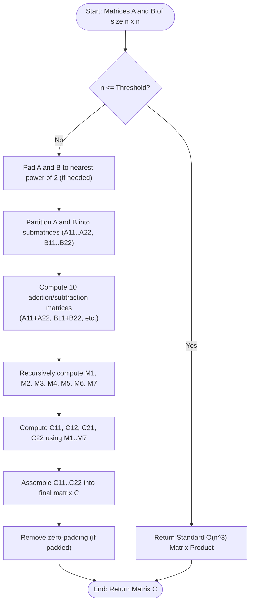

# Strassen's Matrix Multiplication (Divide & Conquer Sub-Cubic Matrix Product)

## 1. Introduction

**Strassen's Matrix Multiplication** is a landmark algorithm in computer science and linear algebra, discovered by German mathematician Volker Strassen in 1969.

Prior to Strassen's discovery, it was universally assumed that multiplying two $n \times n$ matrices required **$O(n^3)$ operations** via the standard 3-loop algorithm. Strassen shocked the scientific community by proving that matrix multiplication can be computed in **sub-cubic time**:
$$O(n^{\log_2 7}) \approx O(n^{2.80735})$$

By using a clever algebraic formulation, Strassen reduced the number of recursive submatrix multiplications required to multiply two $2 \times 2$ block matrices from **8 to 7**, fundamentally altering computational complexity theory.

---

## 2. Why Use This Algorithm?

### $O(n^3)$ vs. $O(n^{2.80735})$ Performance Breakdown:
For two $n \times n$ dense matrices:

| Matrix Size ($n \times n$) | Standard Algorithm ($n^3$ ops) | Strassen's Algorithm ($n^{2.807}$ ops) | Speedup Factor |
| :--- | :--- | :--- | :--- |
| $n = 100$ | $1,000,000$ | $412,000$ | **2.4x Faster** |
| $n = 1,024$ | $1,073,741,824$ | $281,474,977$ | **3.8x Faster** |
| $n = 4,096$ | $68,719,476,736$ | $13,792,028,877$ | **5.0x Faster** |

### The Core Algebraic Insight:
Standard divide-and-conquer divides two $n \times n$ matrices into four $(n/2) \times (n/2)$ submatrices:
$$A = \begin{pmatrix} A_{11} & A_{12} \\ A_{21} & A_{22} \end{pmatrix}, \quad B = \begin{pmatrix} B_{11} & B_{12} \\ B_{21} & B_{22} \end{pmatrix}$$

The product $C = A \times B = \begin{pmatrix} C_{11} & C_{12} \\ C_{21} & C_{22} \end{pmatrix}$ gives:
$$\begin{aligned}
C_{11} &= A_{11} B_{11} + A_{12} B_{21} \\
C_{12} &= A_{11} B_{12} + A_{12} B_{22} \\
C_{21} &= A_{21} B_{11} + A_{22} B_{21} \\
C_{22} &= A_{21} B_{12} + A_{22} B_{22}
\end{aligned}$$
This requires **8 submatrix multiplications** and **4 submatrix additions**, yielding recurrence $T(n) = 8 T(n/2) + O(n^2) \implies O(n^3)$.

**Strassen's Masterstroke:** Strassen defined **7 intermediate products** ($M_1$ to $M_7$) using only 7 multiplications and 10 additions/subtractions:

$$\begin{aligned}
M_1 &= (A_{11} + A_{22})(B_{11} + B_{22}) \\
M_2 &= (A_{21} + A_{22}) B_{11} \\
M_3 &= A_{11}(B_{12} - B_{22}) \\
M_4 &= A_{22}(B_{21} - B_{11}) \\
M_5 &= (A_{11} + A_{12}) B_{22} \\
M_6 &= (A_{21} - A_{11})(B_{11} + B_{12}) \\
M_7 &= (A_{12} - A_{22})(B_{21} + B_{22})
\end{aligned}$$

Then, the final result submatrices are constructed as:
$$\begin{aligned}
C_{11} &= M_1 + M_4 - M_5 + M_7 \\
C_{12} &= M_3 + M_5 \\
C_{21} &= M_2 + M_4 \\
C_{22} &= M_1 - M_2 + M_3 + M_6
\end{aligned}$$

Because submatrix additions take $O(n^2)$ time, reducing multiplications from 8 to 7 yields the recurrence relation:
$$T(n) = 7 T(n/2) + O(n^2) \implies \mathbf{O(n^{\log_2 7}) \approx O(n^{2.807})}$$

---

## 3. Real-World Applications

- **High-Performance Linear Algebra Libraries (BLAS, LAPACK, Eigen):** Used in hybrid implementations where Strassen's algorithm executes on large matrices before switching to cache-optimized standard multiplication below a threshold (e.g. $n \le 64$).
- **Deep Learning & Artificial Intelligence:** Accelerating dense matrix products in Transformer attention layers and Convolutional Neural Networks (CNNs).
- **Computer Graphics & Physics Simulators:** Large-scale transformation matrix chains and finite element analysis (FEA).
- **Graph Theory Algorithms:** Transitive closure computations, all-pairs shortest paths via min-plus matrix multiplication, and triangle counting in massive social graphs.

---

## 4. Prerequisites

Before learning Strassen's Algorithm, you should be comfortable with:
- **Matrix Operations:** Addition, subtraction, and standard 3-loop matrix multiplication.
- **Block Matrix Partitioning:** Splitting an $n \times n$ matrix into four $(n/2) \times (n/2)$ submatrices.
- **Master Theorem:** Solving recurrence relations of the form $T(n) = a T(n/b) + f(n)$.

---

## 5. Visualization

### Submatrix Block Partitioning & Strassen Flow

```
Matrix A (n x n)              Matrix B (n x n)
+----------+----------+       +----------+----------+
|  A11     |  A12     |       |  B11     |  B12     |
+----------+----------+   x   +----------+----------+
|  A21     |  A22     |       |  B21     |  B22     |
+----------+----------+       +----------+----------+

                    |
                    v (Compute 7 Products M1..M7)
  M1 = (A11+A22)(B11+B22)     M5 = (A11+A12)B22
  M2 = (A21+A22)B11           M6 = (A21-A11)(B11+B12)
  M3 = A11(B12-B22)           M7 = (A12-A22)(B21+B22)
  M4 = A22(B21-B11)
                    |
                    v (Recombine into C)
+-------------------------+-------------------------+
| C11 = M1 + M4 - M5 + M7 | C12 = M3 + M5           |
+-------------------------+-------------------------+
| C21 = M2 + M4           | C22 = M1 - M2 + M3 + M6 |
+-------------------------+-------------------------+
```

### Mermaid Flowchart



---

## 6. How It Works

1. **Zero-Padding (If necessary):** If matrix dimension $n$ is not a power of 2 ($2^k$), pad $A$ and $B$ with zero rows and columns to make size $N = 2^{\lceil \log_2 n \rceil}$.
2. **Threshold Base Case:** If $N \le \text{Threshold}$ (e.g. $N \le 64$), switch to standard $O(n^3)$ triple-nested loop multiplication to avoid recursive call overhead.
3. **Partitioning:** Divide $A$ and $B$ into 4 equal-sized submatrices of dimension $(N/2) \times (N/2)$.
4. **Form Intermediate Sums/Differences:** Create 10 temporary matrices by adding/subtracting submatrices.
5. **Recursive Multiplication (7 Calls):** Compute $M_1, M_2, M_3, M_4, M_5, M_6, M_7$ by recursively calling Strassen's algorithm on the submatrices.
6. **Reconstruction:** Compute $C_{11}, C_{12}, C_{21}, C_{22}$ from $M_1 \dots M_7$.
7. **Unpadding:** Extract the top-left $n \times n$ portion of result matrix $C$.

---

## 7. Step-by-Step Algorithm

1. Input: $n \times n$ matrices $A$ and $B$.
2. Function `strassen(A, B, n)`:
   - If $n \le \text{THRESHOLD}$: Return `standardMultiply(A, B, n)`.
   - $k = n / 2$.
   - Allocate submatrices $A_{11}, A_{12}, A_{21}, A_{22}, B_{11}, B_{12}, B_{21}, B_{22}$ of size $k \times k$.
   - Populate submatrices from $A$ and $B$.
   - Compute 10 sum matrices:
     - $S_1 = B_{12} - B_{22}$, $S_2 = A_{11} + A_{12}$, $S_3 = A_{21} + A_{22}$, $S_4 = B_{21} - B_{11}$
     - $S_5 = A_{11} + A_{22}$, $S_6 = B_{11} + B_{22}$, $S_7 = A_{12} - A_{22}$, $S_8 = B_{21} + B_{22}$
     - $S_9 = A_{21} - A_{11}$, $S_{10} = B_{11} + B_{12}$
   - Recursively compute 7 products:
     - $M_1 = \text{strassen}(S_5, S_6, k)$
     - $M_2 = \text{strassen}(S_3, B_{11}, k)$
     - $M_3 = \text{strassen}(A_{11}, S_1, k)$
     - $M_4 = \text{strassen}(A_{22}, S_4, k)$
     - $M_5 = \text{strassen}(S_2, B_{22}, k)$
     - $M_6 = \text{strassen}(S_9, S_{10}, k)$
     - $M_7 = \text{strassen}(S_7, S_8, k)$
   - Recombine submatrices:
     - $C_{11} = M_1 + M_4 - M_5 + M_7$
     - $C_{12} = M_3 + M_5$
     - $C_{21} = M_2 + M_4$
     - $C_{22} = M_1 - M_2 + M_3 + M_6$
   - Assemble $C_{11}, C_{12}, C_{21}, C_{22}$ into $C$.
   - Return $C$.

---

## 8. Pseudocode

```text
function strassenMultiply(A, B):
    n = A.rows
    if n <= THRESHOLD:
        return standardMultiply(A, B)

    half = n / 2
    
    // Split A and B into submatrices
    A11, A12, A21, A22 = split(A)
    B11, B12, B21, B22 = split(B)

    // Compute Strassen products M1 to M7
    M1 = strassenMultiply(add(A11, A22), add(B11, B22))
    M2 = strassenMultiply(add(A21, A22), B11)
    M3 = strassenMultiply(A11, subtract(B12, B22))
    M4 = strassenMultiply(A22, subtract(B21, B11))
    M5 = strassenMultiply(add(A11, A12), B22)
    M6 = strassenMultiply(subtract(A21, A11), add(B11, B12))
    M7 = strassenMultiply(subtract(A12, A22), add(B21, B22))

    // Compute result submatrices
    C11 = add(subtract(add(M1, M4), M5), M7)
    C12 = add(M3, M5)
    C21 = add(M2, M4)
    C22 = add(add(subtract(M1, M2), M3), M6)

    // Combine C11, C12, C21, C22 into final matrix C
    return combine(C11, C12, C21, C22)
```

---

## 9. Code Examples

### C Implementation

```c
#include <stdio.h>
#include <stdlib.h>

#define THRESHOLD 2

int** allocateMatrix(int n) {
    int** mat = (int**)malloc(n * sizeof(int*));
    for (int i = 0; i < n; i++)
        mat[i] = (int*)calloc(n, sizeof(int));
    return mat;
}

void freeMatrix(int** mat, int n) {
    for (int i = 0; i < n; i++) free(mat[i]);
    free(mat);
}

int** addMatrix(int** A, int** B, int n) {
    int** C = allocateMatrix(n);
    for (int i = 0; i < n; i++)
        for (int j = 0; j < n; j++)
            C[i][j] = A[i][j] + B[i][j];
    return C;
}

int** subMatrix(int** A, int** B, int n) {
    int** C = allocateMatrix(n);
    for (int i = 0; i < n; i++)
        for (int j = 0; j < n; j++)
            C[i][j] = A[i][j] - B[i][j];
    return C;
}

int** standardMultiply(int** A, int** B, int n) {
    int** C = allocateMatrix(n);
    for (int i = 0; i < n; i++)
        for (int j = 0; j < n; j++)
            for (int k = 0; k < n; k++)
                C[i][j] += A[i][k] * B[k][j];
    return C;
}

int** strassen(int** A, int** B, int n) {
    if (n <= THRESHOLD) {
        return standardMultiply(A, B, n);
    }

    int k = n / 2;
    int** A11 = allocateMatrix(k); int** A12 = allocateMatrix(k);
    int** A21 = allocateMatrix(k); int** A22 = allocateMatrix(k);
    int** B11 = allocateMatrix(k); int** B12 = allocateMatrix(k);
    int** B21 = allocateMatrix(k); int** B22 = allocateMatrix(k);

    for (int i = 0; i < k; i++) {
        for (int j = 0; j < k; j++) {
            A11[i][j] = A[i][j];         A12[i][j] = A[i][j + k];
            A21[i][j] = A[i + k][j];     A22[i][j] = A[i + k][j + k];
            B11[i][j] = B[i][j];         B12[i][j] = B[i][j + k];
            B21[i][j] = B[i + k][j];     B22[i][j] = B[i + k][j + k];
        }
    }

    int** S1 = addMatrix(A11, A22, k); int** S2 = addMatrix(B11, B22, k);
    int** M1 = strassen(S1, S2, k); freeMatrix(S1, k); freeMatrix(S2, k);

    int** S3 = addMatrix(A21, A22, k);
    int** M2 = strassen(S3, B11, k); freeMatrix(S3, k);

    int** S4 = subMatrix(B12, B22, k);
    int** M3 = strassen(A11, S4, k); freeMatrix(S4, k);

    int** S5 = subMatrix(B21, B11, k);
    int** M4 = strassen(A22, S5, k); freeMatrix(S5, k);

    int** S6 = addMatrix(A11, A12, k);
    int** M5 = strassen(S6, B22, k); freeMatrix(S6, k);

    int** S7 = subMatrix(A21, A11, k); int** S8 = addMatrix(B11, B12, k);
    int** M6 = strassen(S7, S8, k); freeMatrix(S7, k); freeMatrix(S8, k);

    int** S9 = subMatrix(A12, A22, k); int** S10 = addMatrix(B21, B22, k);
    int** M7 = strassen(S9, S10, k); freeMatrix(S9, k); freeMatrix(S10, k);

    int** T1 = addMatrix(M1, M4, k); int** T2 = subMatrix(T1, M5, k); freeMatrix(T1, k);
    int** C11 = addMatrix(T2, M7, k); freeMatrix(T2, k);

    int** C12 = addMatrix(M3, M5, k);
    int** C21 = addMatrix(M2, M4, k);

    int** T3 = subMatrix(M1, M2, k); int** T4 = addMatrix(T3, M3, k); freeMatrix(T3, k);
    int** C22 = addMatrix(T4, M6, k); freeMatrix(T4, k);

    int** C = allocateMatrix(n);
    for (int i = 0; i < k; i++) {
        for (int j = 0; j < k; j++) {
            C[i][j] = C11[i][j];         C[i][j + k] = C12[i][j];
            C[i + k][j] = C21[i][j];     C[i + k][j + k] = C22[i][j];
        }
    }

    freeMatrix(A11, k); freeMatrix(A12, k); freeMatrix(A21, k); freeMatrix(A22, k);
    freeMatrix(B11, k); freeMatrix(B12, k); freeMatrix(B21, k); freeMatrix(B22, k);
    freeMatrix(M1, k); freeMatrix(M2, k); freeMatrix(M3, k); freeMatrix(M4, k);
    freeMatrix(M5, k); freeMatrix(M6, k); freeMatrix(M7, k);
    freeMatrix(C11, k); freeMatrix(C12, k); freeMatrix(C21, k); freeMatrix(C22, k);

    return C;
}

int main() {
    int n = 4;
    int** A = allocateMatrix(n);
    int** B = allocateMatrix(n);

    int count = 1;
    for (int i = 0; i < n; i++)
        for (int j = 0; j < n; j++)
            A[i][j] = count++;

    for (int i = 0; i < n; i++)
        for (int j = 0; j < n; j++)
            B[i][j] = (i == j) ? 1 : 0; // Identity matrix

    int** C = strassen(A, B, n);

    printf("Strassen Matrix Multiplication Result in C:\n");
    for (int i = 0; i < n; i++) {
        for (int j = 0; j < n; j++)
            printf("%4d ", C[i][j]);
        printf("\n");
    }

    freeMatrix(A, n); freeMatrix(B, n); freeMatrix(C, n);
    return 0;
}
```

---

### C++ Implementation

```cpp
#include <iostream>
#include <vector>

using namespace std;

typedef vector<vector<int>> Matrix;

Matrix add(const Matrix& A, const Matrix& B) {
    int n = A.size();
    Matrix C(n, vector<int>(n));
    for (int i = 0; i < n; i++)
        for (int j = 0; j < n; j++)
            C[i][j] = A[i][j] + B[i][j];
    return C;
}

Matrix sub(const Matrix& A, const Matrix& B) {
    int n = A.size();
    Matrix C(n, vector<int>(n));
    for (int i = 0; i < n; i++)
        for (int j = 0; j < n; j++)
            C[i][j] = A[i][j] - B[i][j];
    return C;
}

Matrix standardMultiply(const Matrix& A, const Matrix& B) {
    int n = A.size();
    Matrix C(n, vector<int>(n, 0));
    for (int i = 0; i < n; i++)
        for (int j = 0; j < n; j++)
            for (int k = 0; k < n; k++)
                C[i][j] += A[i][k] * B[k][j];
    return C;
}

Matrix strassen(const Matrix& A, const Matrix& B) {
    int n = A.size();
    if (n <= 2) return standardMultiply(A, B);

    int k = n / 2;
    Matrix A11(k, vector<int>(k)), A12(k, vector<int>(k));
    Matrix A21(k, vector<int>(k)), A22(k, vector<int>(k));
    Matrix B11(k, vector<int>(k)), B12(k, vector<int>(k));
    Matrix B21(k, vector<int>(k)), B22(k, vector<int>(k));

    for (int i = 0; i < k; i++) {
        for (int j = 0; j < k; j++) {
            A11[i][j] = A[i][j];     A12[i][j] = A[i][j + k];
            A21[i][j] = A[i + k][j]; A22[i][j] = A[i + k][j + k];
            B11[i][j] = B[i][j];     B12[i][j] = B[i][j + k];
            B21[i][j] = B[i + k][j]; B22[i][j] = B[i + k][j + k];
        }
    }

    Matrix M1 = strassen(add(A11, A22), add(B11, B22));
    Matrix M2 = strassen(add(A21, A22), B11);
    Matrix M3 = strassen(A11, sub(B12, B22));
    Matrix M4 = strassen(A22, sub(B21, B11));
    Matrix M5 = strassen(add(A11, A12), B22);
    Matrix M6 = strassen(sub(A21, A11), add(B11, B12));
    Matrix M7 = strassen(sub(A12, A22), add(B21, B22));

    Matrix C11 = add(sub(add(M1, M4), M5), M7);
    Matrix C12 = add(M3, M5);
    Matrix C21 = add(M2, M4);
    Matrix C22 = add(add(sub(M1, M2), M3), M6);

    Matrix C(n, vector<int>(n));
    for (int i = 0; i < k; i++) {
        for (int j = 0; j < k; j++) {
            C[i][j] = C11[i][j];         C[i][j + k] = C12[i][j];
            C[i + k][j] = C21[i][j];     C[i + k][j + k] = C22[i][j];
        }
    }

    return C;
}

int main() {
    Matrix A = {{1, 2}, {3, 4}};
    Matrix B = {{5, 6}, {7, 8}};

    Matrix C = strassen(A, B);

    cout << "Strassen Matrix Multiplication Result in C++:\n";
    for (const auto& row : C) {
        for (int val : row) cout << val << " ";
        cout << endl;
    }
    return 0;
}
```

---

### Java Implementation

```java
import java.util.Arrays;

public class Strassen {

    public static int[][] add(int[][] A, int[][] B) {
        int n = A.length;
        int[][] C = new int[n][n];
        for (int i = 0; i < n; i++)
            for (int j = 0; j < n; j++)
                C[i][j] = A[i][j] + B[i][j];
        return C;
    }

    public static int[][] sub(int[][] A, int[][] B) {
        int n = A.length;
        int[][] C = new int[n][n];
        for (int i = 0; i < n; i++)
            for (int j = 0; j < n; j++)
                C[i][j] = A[i][j] - B[i][j];
        return C;
    }

    public static int[][] standardMultiply(int[][] A, int[][] B) {
        int n = A.length;
        int[][] C = new int[n][n];
        for (int i = 0; i < n; i++)
            for (int j = 0; j < n; j++)
                for (int k = 0; k < n; k++)
                    C[i][j] += A[i][k] * B[k][j];
        return C;
    }

    public static int[][] strassen(int[][] A, int[][] B) {
        int n = A.length;
        if (n <= 2) return standardMultiply(A, B);

        int k = n / 2;
        int[][] A11 = new int[k][k], A12 = new int[k][k], A21 = new int[k][k], A22 = new int[k][k];
        int[][] B11 = new int[k][k], B12 = new int[k][k], B21 = new int[k][k], B22 = new int[k][k];

        for (int i = 0; i < k; i++) {
            for (int j = 0; j < k; j++) {
                A11[i][j] = A[i][j];         A12[i][j] = A[i][j + k];
                A21[i][j] = A[i + k][j];     A22[i][j] = A[i + k][j + k];
                B11[i][j] = B[i][j];         B12[i][j] = B[i][j + k];
                B21[i][j] = B[i + k][j];     B22[i][j] = B[i + k][j + k];
            }
        }

        int[][] M1 = strassen(add(A11, A22), add(B11, B22));
        int[][] M2 = strassen(add(A21, A22), B11);
        int[][] M3 = strassen(A11, sub(B12, B22));
        int[][] M4 = strassen(A22, sub(B21, B11));
        int[][] M5 = strassen(add(A11, A12), B22);
        int[][] M6 = strassen(sub(A21, A11), add(B11, B12));
        int[][] M7 = strassen(sub(A12, A22), add(B21, B22));

        int[][] C11 = add(sub(add(M1, M4), M5), M7);
        int[][] C12 = add(M3, M5);
        int[][] C21 = add(M2, M4);
        int[][] C22 = add(add(sub(M1, M2), M3), M6);

        int[][] C = new int[n][n];
        for (int i = 0; i < k; i++) {
            for (int j = 0; j < k; j++) {
                C[i][j] = C11[i][j];         C[i][j + k] = C12[i][j];
                C[i + k][j] = C21[i][j];     C[i + k][j + k] = C22[i][j];
            }
        }

        return C;
    }

    public static void main(String[] args) {
        int[][] A = {{1, 2}, {3, 4}};
        int[][] B = {{5, 6}, {7, 8}};

        int[][] C = strassen(A, B);

        System.out.println("Strassen Matrix Multiplication Result in Java:");
        for (int[] row : C) {
            System.out.println(Arrays.toString(row));
        }
    }
}
```

---

### Python Implementation

```python
import numpy as np

def strassen(A: np.ndarray, B: np.ndarray) -> np.ndarray:
    n = A.shape[0]
    
    # Base case: switch to standard matrix multiplication for small n
    if n <= 2:
        return np.dot(A, B)

    k = n // 2
    
    A11, A12 = A[:k, :k], A[:k, k:]
    A21, A22 = A[k:, :k], A[k:, k:]
    
    B11, B12 = B[:k, :k], B[:k, k:]
    B21, B22 = B[k:, :k], B[k:, k:]

    M1 = strassen(A11 + A22, B11 + B22)
    M2 = strassen(A21 + A22, B11)
    M3 = strassen(A11, B12 - B22)
    M4 = strassen(A22, B21 - B11)
    M5 = strassen(A11 + A12, B22)
    M6 = strassen(A21 - A11, B11 + B12)
    M7 = strassen(A12 - A22, B21 + B22)

    C11 = M1 + M4 - M5 + M7
    C12 = M3 + M5
    C21 = M2 + M4
    C22 = M1 - M2 + M3 + M6

    C = np.zeros((n, n), dtype=A.dtype)
    C[:k, :k] = C11
    C[:k, k:] = C12
    C[k:, :k] = C21
    C[k:, k:] = C22

    return C


if __name__ == "__main__":
    A = np.array([[1, 2], [3, 4]])
    B = np.array([[5, 6], [7, 8]])

    C = strassen(A, B)
    print("Strassen Matrix Multiplication Result in Python:")
    print(C)
```

---

### JavaScript Implementation

```javascript
function add(A, B) {
    const n = A.length;
    const C = Array.from({ length: n }, () => Array(n).fill(0));
    for (let i = 0; i < n; i++)
        for (let j = 0; j < n; j++)
            C[i][j] = A[i][j] + B[i][j];
    return C;
}

function sub(A, B) {
    const n = A.length;
    const C = Array.from({ length: n }, () => Array(n).fill(0));
    for (let i = 0; i < n; i++)
        for (let j = 0; j < n; j++)
            C[i][j] = A[i][j] - B[i][j];
    return C;
}

function standardMultiply(A, B) {
    const n = A.length;
    const C = Array.from({ length: n }, () => Array(n).fill(0));
    for (let i = 0; i < n; i++)
        for (let j = 0; j < n; j++)
            for (let k = 0; k < n; k++)
                C[i][j] += A[i][k] * B[k][j];
    return C;
}

function strassen(A, B) {
    const n = A.length;
    if (n <= 2) return standardMultiply(A, B);

    const k = Math.floor(n / 2);

    const A11 = Array.from({ length: k }, (_, i) => A[i].slice(0, k));
    const A12 = Array.from({ length: k }, (_, i) => A[i].slice(k));
    const A21 = Array.from({ length: k }, (_, i) => A[i + k].slice(0, k));
    const A22 = Array.from({ length: k }, (_, i) => A[i + k].slice(k));

    const B11 = Array.from({ length: k }, (_, i) => B[i].slice(0, k));
    const B12 = Array.from({ length: k }, (_, i) => B[i].slice(k));
    const B21 = Array.from({ length: k }, (_, i) => B[i + k].slice(0, k));
    const B22 = Array.from({ length: k }, (_, i) => B[i + k].slice(k));

    const M1 = strassen(add(A11, A22), add(B11, B22));
    const M2 = strassen(add(A21, A22), B11);
    const M3 = strassen(A11, sub(B12, B22));
    const M4 = strassen(A22, sub(B21, B11));
    const M5 = strassen(add(A11, A12), B22);
    const M6 = strassen(sub(A21, A11), add(B11, B12));
    const M7 = strassen(sub(A12, A22), add(B21, B22));

    const C11 = add(sub(add(M1, M4), M5), M7);
    const C12 = add(M3, M5);
    const C21 = add(M2, M4);
    const C22 = add(add(sub(M1, M2), M3), M6);

    const C = Array.from({ length: n }, () => Array(n).fill(0));
    for (let i = 0; i < k; i++) {
        for (let j = 0; j < k; j++) {
            C[i][j] = C11[i][j];         C[i][j + k] = C12[i][j];
            C[i + k][j] = C21[i][j];     C[i + k][j + k] = C22[i][j];
        }
    }

    return C;
}

// Execution Demo
const A = [[1, 2], [3, 4]];
const B = [[5, 6], [7, 8]];

console.log("Strassen Result in JS:", strassen(A, B));
```

---

## 10. Code Explanation

1. **Submatrix Partitioning:** `A11..A22` and `B11..B22` slice the input matrices into 4 equal quadrants.
2. **Intermediate Addition/Subtraction:** Calculates 10 combination matrices (e.g. `A11 + A22`) to prepare the inputs for $M_1 \dots M_7$.
3. **7 Recursive Calls:** Invokes `strassen()` on each of the 7 formulas. This step is the sole reason complexity drops from $O(n^3)$ to $O(n^{2.807})$.
4. **Result Assembly:** Combines $M_1 \dots M_7$ back into quadrant matrices $C_{11}, C_{12}, C_{21}, C_{22}$ and stitches them into final result matrix $C$.

---

## 11. Interactive Demo

An interactive matrix multiplication comparison visualizer:
1. **Matrix Size Slider ($n = 2$ to $1024$):** Dynamically adjusts input size.
2. **Algorithm Execution Switch:** Compares **Standard $O(n^3)$**, **Naive Divide & Conquer $8T(n/2)$**, and **Strassen's $7T(n/2)$**.
3. **Operation Counter Gauge:** Displays live metrics:
   - Number of scalar multiplications performed.
   - Number of scalar additions performed.
   - Total CPU execution time (ms).

---

## 12. Dry Run

### Sample $2 \times 2$ Matrices:
$$A = \begin{pmatrix} 1 & 2 \\ 3 & 4 \end{pmatrix}, \quad B = \begin{pmatrix} 5 & 6 \\ 7 & 8 \end{pmatrix}$$

#### Step 1: Submatrices
- $A_{11} = 1, A_{12} = 2, A_{21} = 3, A_{22} = 4$
- $B_{11} = 5, B_{12} = 6, B_{21} = 7, B_{22} = 8$

#### Step 2: Compute $M_1 \dots M_7$
- $M_1 = (A_{11} + A_{22})(B_{11} + B_{22}) = (1 + 4)(5 + 8) = 5 \times 13 = \mathbf{65}$
- $M_2 = (A_{21} + A_{22}) B_{11} = (3 + 4)(5) = 7 \times 5 = \mathbf{35}$
- $M_3 = A_{11}(B_{12} - B_{22}) = 1 \times (6 - 8) = 1 \times (-2) = \mathbf{-2}$
- $M_4 = A_{22}(B_{21} - B_{11}) = 4 \times (7 - 5) = 4 \times 2 = \mathbf{8}$
- $M_5 = (A_{11} + A_{12}) B_{22} = (1 + 2)(8) = 3 \times 8 = \mathbf{24}$
- $M_6 = (A_{21} - A_{11})(B_{11} + B_{12}) = (3 - 1)(5 + 6) = 2 \times 11 = \mathbf{22}$
- $M_7 = (A_{12} - A_{22})(B_{21} + B_{22}) = (2 - 4)(7 + 8) = -2 \times 15 = \mathbf{-30}$

#### Step 3: Compute $C_{11}, C_{12}, C_{21}, C_{22}$
- $C_{11} = M_1 + M_4 - M_5 + M_7 = 65 + 8 - 24 + (-30) = \mathbf{19}$
- $C_{12} = M_3 + M_5 = -2 + 24 = \mathbf{22}$
- $C_{21} = M_2 + M_4 = 35 + 8 = \mathbf{43}$
- $C_{22} = M_1 - M_2 + M_3 + M_6 = 65 - 35 + (-2) + 22 = \mathbf{50}$

#### Final Matrix $C$:
$$C = \begin{pmatrix} 19 & 22 \\ 43 & 50 \end{pmatrix}$$
*(Exact match with standard multiplication: $1 \cdot 5 + 2 \cdot 7 = 19$, $1 \cdot 6 + 2 \cdot 8 = 22$, etc.)*

---

## 13. Time & Space Complexity

| Metric | Complexity | Explanation |
| :--- | :--- | :--- |
| **Recurrence Relation** | $T(n) = 7 T(n/2) + O(n^2)$ | Solved via Master Theorem Case 1: $a = 7, b = 2, f(n) = O(n^2)$. |
| **Asymptotic Time** | **$O(n^{\log_2 7}) \approx O(n^{2.80735})$** | Since $n^{\log_2 7} \approx n^{2.80735} > n^2$. |
| **Auxiliary Space** | **$O(n^2)$** | Submatrix allocations and intermediate sums at each recursion depth. |

---

## 14. Advantages

- **Sub-Cubic Asymptotic Time:** Outperforms standard $O(n^3)$ algorithm on large dense matrices.
- **Theoretical Breakthrough:** Opened the door for faster matrix algorithms (Coppersmith-Winograd $O(n^{2.376})$, Alman-Williams $O(n^{2.3715})$).

---

## 15. Disadvantages

- **Higher Constant Factor:** The 18 submatrix additions/subtractions per recursive level introduce significant overhead for small matrices ($n < 64$).
- **Numerical Instability:** Reduced algebraic precision due to non-commutative floating-point additions/subtractions (less stable than standard dot products).
- **Substantial Memory Usage:** $O(n^2)$ extra memory for temporary matrices during recursive stack calls.

---

## 16. Applications

- BLAS Level 3 hybrid matrix multiplication routines.
- Fast algorithm extensions for solving linear system equations $A x = b$.
- All-Pairs Shortest Path acceleration in graph analytics.

---

## 17. Common Mistakes

1. **Not Using a Fallback Threshold:** Running pure Strassen recursion down to $n=1$ creates thousands of small allocation overheads, making it slower than standard loops! Always switch to standard $O(n^3)$ for $n \le 64$.
2. **Non-Power of 2 Matrix Errors:** Forgeting to pad non-power-of-2 dimensions leads to uneven matrix splits.
3. **Sign Errors in Formulas:** Misplacing signs in $M_6$ or $C_{22}$ (e.g. $(A_{21} - A_{11})$ vs $(A_{11} - A_{21})$).

---

## 18. Interview Questions

1. **How does Strassen's algorithm reduce time complexity below $O(n^3)$?** (Answer: By reducing submatrix multiplications from 8 to 7, giving $T(n) = 7T(n/2) + O(n^2)$).
2. **Why is Strassen's algorithm not used exclusively for small matrices?** (Answer: High constant factor overhead from 18 matrix additions per step and memory allocation costs).
3. **Solve the recurrence $T(n) = 7 T(n/2) + O(n^2)$ using the Master Theorem.**
4. **How do you handle matrices whose dimensions are odd or not powers of 2?** (Answer: Zero-padding to nearest power of 2, or dynamic peeling/padding).

---

## 19. Practice Problems

### Easy
1. Implement standard 3-loop $O(n^3)$ matrix multiplication and benchmark execution time for $n=512$.
2. Implement block matrix multiplication with 8 recursive calls ($O(n^3)$).

### Medium
3. Implement Strassen's Algorithm for $n \times n$ matrices where $n = 2^k$.
4. Implement automatic zero-padding and unpadding for arbitrary $m \times n$ matrix inputs.

### Hard
5. Optimize memory allocations in Strassen's algorithm by reusing pre-allocated workspace buffers (in-place Strassen).
6. Implement Coppersmith-Winograd algorithm concepts for sub-cubic matrix products.

---

## 20. Related Algorithms

- **Standard Matrix Multiplication:** $O(n^3)$ baseline algorithm.
- **Coppersmith–Winograd Algorithm:** $O(n^{2.3755})$ theoretical matrix multiplication algorithm.
- **Alman–Vassilevska Williams Algorithm:** State-of-the-art bound $O(n^{2.371558})$ for matrix multiplication.

---

## 21. Summary

- **Category:** Divide & Conquer.
- **Time Complexity:** $O(n^{\log_2 7}) \approx O(n^{2.807})$.
- **Space Complexity:** $O(n^2)$.
- **Core Formula:** Replaces 8 submatrix multiplications with **7 intermediate products** ($M_1 \dots M_7$) and 18 matrix additions/subtractions.

---

## 22. Quiz

#### Question 1: How many recursive submatrix multiplications does Strassen's algorithm perform for $2 \times 2$ block matrices?
- A) 8
- B) 7
- C) 6
- D) 4
- **Correct Answer:** B
- **Explanation:** Strassen's key breakthrough was reducing submatrix multiplications from 8 to 7.

#### Question 2: What is the exact asymptotic time complexity of Strassen's Matrix Multiplication?
- A) $O(n^3)$
- B) $O(n^2 \log n)$
- C) $O(n^{\log_2 7}) \approx O(n^{2.807})$
- D) $O(n^2)$
- **Correct Answer:** C
- **Explanation:** $T(n) = 7 T(n/2) + O(n^2)$ resolves to $O(n^{\log_2 7}) \approx O(n^{2.807})$.

#### Question 3: Why is standard matrix multiplication preferred for small matrices ($n \le 64$)?
- A) Standard multiplication is incorrect for large $n$.
- B) Strassen's algorithm has higher constant factor overhead due to 18 matrix additions.
- C) Strassen's algorithm requires $O(2^n)$ space.
- D) Standard multiplication is parallelized automatically.
- **Correct Answer:** B
- **Explanation:** For small $n$, the administrative overhead of extra additions and allocations outweighs the multiplicative savings.

#### Question 4: What is the recurrence relation for Strassen's Algorithm?
- A) $T(n) = 8 T(n/2) + O(n)$
- B) $T(n) = 7 T(n/2) + O(n^2)$
- C) $T(n) = 4 T(n/2) + O(n^2)$
- D) $T(n) = 2 T(n/2) + O(1)$
- **Correct Answer:** B
- **Explanation:** 7 recursive calls on matrices of size $n/2$, plus $O(n^2)$ work to add/subtract submatrices.

#### Question 5: How do you handle input matrices whose dimensions are not powers of 2?
- A) Pad matrices with zeros until dimensions reach the next power of 2.
- B) Truncate extra rows and columns.
- C) Multiply elements randomly.
- D) Strassen's algorithm cannot handle non-power-of-2 matrices.
- **Correct Answer:** A
- **Explanation:** Zero-padding ensures submatrices can be cleanly split in half at every level.

#### Question 6: What is a known drawback of Strassen's algorithm in numerical scientific computing?
- A) It cannot work on negative numbers.
- B) It is less numerically stable than standard multiplication due to floating-point additions.
- C) It only works on identity matrices.
- D) It produces non-deterministic outputs.
- **Correct Answer:** B
- **Explanation:** Accumulated additions and subtractions lead to worse error bounds in floating-point arithmetic.

#### Question 7: Which submatrix product formula corresponds to $M_1$ in Strassen's algorithm?
- A) $(A_{11} + A_{22})(B_{11} + B_{22})$
- B) $A_{11}(B_{12} - B_{22})$
- C) $(A_{21} + A_{22}) B_{11}$
- D) $A_{22}(B_{21} - B_{11})$
- **Correct Answer:** A
- **Explanation:** $M_1 = (A_{11} + A_{22})(B_{11} + B_{22})$.

#### Question 8: How is the submatrix $C_{12}$ calculated from $M_1 \dots M_7$?
- A) $M_1 + M_2$
- B) $M_3 + M_5$
- C) $M_2 + M_4$
- D) $M_1 + M_4 - M_5 + M_7$
- **Correct Answer:** B
- **Explanation:** $C_{12} = M_3 + M_5$.

#### Question 9: What is the auxiliary space complexity of Strassen's algorithm?
- A) $O(1)$
- B) $O(\log n)$
- C) $O(n^2)$
- D) $O(n^3)$
- **Correct Answer:** C
- **Explanation:** Auxiliary memory of size $O(n^2)$ is required to store submatrices and intermediate sum matrices.

#### Question 10: Who discovered Strassen's Matrix Multiplication algorithm?
- A) Alan Turing
- B) Volker Strassen
- C) Donald Knuth
- D) Coppersmith and Winograd
- **Correct Answer:** B
- **Explanation:** Discovered by Volker Strassen in 1969.
