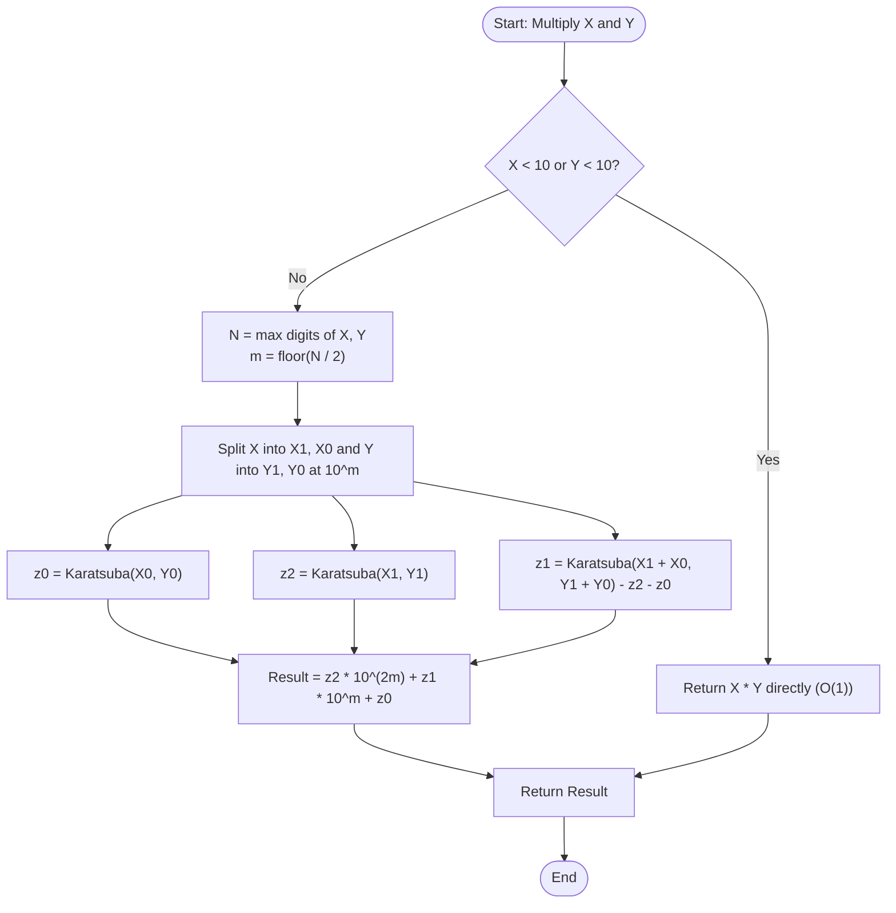

# Karatsuba Algorithm (Fast Divide & Conquer Integer Multiplication)

## 1. Introduction

The **Karatsuba Algorithm** is a groundbreaking divide-and-conquer algorithm for fast integer multiplication, discovered by 23-year-old Russian mathematician Anatoly Karatsuba in 1960 and published in 1962.

In 1956, Andrey Kolmogorov (one of the greatest mathematicians of the 20th century) conjectured that multiplying two $n$-digit integers inherently requires at least **$O(n^2)$ elementary operations** using traditional grade-school long multiplication. Karatsuba disproved Kolmogorov's conjecture in a seminar within a week by inventing a sub-quadratic algorithm that runs in:
$$O(n^{\log_2 3}) \approx O(n^{1.58496})$$

Karatsuba's algorithm laid the foundation for modern **Computer Algebra Systems (CAS)**, **Arbitrary-Precision BigInt Libraries**, and **Public-Key Cryptography (RSA)**.

---

## 2. Why Use This Algorithm?

### $O(n^2)$ vs. $O(n^{1.585})$ Asymptotic Comparison:
For $n$-digit large integers:

| Number of Digits ($n$) | Grade-School ($n^2$ ops) | Karatsuba ($n^{1.585}$ ops) | Speedup Factor |
| :--- | :--- | :--- | :--- |
| $n = 100$ digits | $10,000$ | $1,479$ | **6.7x Faster** |
| $n = 1,000$ digits | $1,000,000$ | $56,234$ | **17.8x Faster** |
| $n = 10,000$ digits | $100,000,000$ | $2,137,962$ | **46.8x Faster** |

### The Core Algebraic Insight:
Suppose we want to multiply two $n$-digit integers $X$ and $Y$ in base 10 (or base 2). We split both numbers into two $m$-digit halves where $m = \lfloor n / 2 \rfloor$:
$$X = X_1 \cdot 10^m + X_0$$
$$Y = Y_1 \cdot 10^m + Y_0$$

Where $X_1, Y_1$ are the most significant digits (high half) and $X_0, Y_0$ are the least significant digits (low half).

The traditional product is:
$$X \cdot Y = (X_1 \cdot 10^m + X_0)(Y_1 \cdot 10^m + Y_0) = X_1 Y_1 \cdot 10^{2m} + (X_1 Y_0 + X_0 Y_1) \cdot 10^m + X_0 Y_0$$

This expansion requires **4 recursive multiplications** ($X_1 Y_1, X_1 Y_0, X_0 Y_1, X_0 Y_0$), yielding recurrence $T(n) = 4T(n/2) + O(n) \implies O(n^2)$.

**Karatsuba's Trick:** Define three products:
$$\begin{aligned}
z_2 &= X_1 \cdot Y_1 \quad \text{(high product)} \\
z_0 &= X_0 \cdot Y_0 \quad \text{(low product)} \\
z_1 &= (X_1 + X_0) \cdot (Y_1 + Y_0) - z_2 - z_0 \quad \text{(cross product)}
\end{aligned}$$

Notice that:
$$(X_1 + X_0)(Y_1 + Y_0) = X_1 Y_1 + X_1 Y_0 + X_0 Y_1 + X_0 Y_0 = z_2 + (X_1 Y_0 + X_0 Y_1) + z_0$$
Subtracting $z_2$ and $z_0$ isolated the middle cross-coefficient $(X_1 Y_0 + X_0 Y_1)$ using **only 1 multiplication instead of 2**!

Final product formula:
$$X \cdot Y = z_2 \cdot 10^{2m} + z_1 \cdot 10^m + z_0$$

By computing only **3 sub-multiplications** ($z_0, z_2,$ and $(X_1 + X_0)(Y_1 + Y_0)$), the recurrence becomes:
$$T(n) = 3 T(n/2) + O(n) \implies \mathbf{O(n^{\log_2 3}) \approx O(n^{1.585})}$$

---

## 3. Real-World Applications

- **Public-Key Cryptography (RSA & ECC):** RSA 2048-bit and 4096-bit key generation and modular exponentiation require fast multiplication of massive 600+ digit prime numbers.
- **Programming Language BigInt Engines:** Used internally in Python (`long` integers), Java (`java.math.BigInteger`), JavaScript (`BigInt`), and Go (`math/big`) when number sizes exceed a threshold (typically 30–60 digits).
- **GNU Multiple Precision Arithmetic Library (GMP):** Standard C/C++ library for arbitrary-precision arithmetic.
- **Computer Algebra Systems (CAS):** Mathematica, Maple, and SymPy for symbolic polynomial and multi-precision integer operations.

---

## 4. Prerequisites

Before learning Karatsuba Multiplication, you should be comfortable with:
- **Base 10 / Base 2 Positional Notation:** Representing numbers as $X_1 \cdot B^m + X_0$.
- **Divide & Conquer Recurrences:** Solving recurrences using Master Theorem.
- **Arbitrary-Precision Arithmetic / String Manipulations:** Basic concepts of handling numbers larger than standard 64-bit hardware registers.

---

## 5. Visualization

### Splitting and Combining $X$ and $Y$

```
          X = 1 2 3 4                       Y = 5 6 7 8
      +--------+--------+               +--------+--------+
      | X1 = 12| X0 = 34|               | Y1 = 56| Y0 = 78|
      +--------+--------+               +--------+--------+
              \        /                         \        /
               \      /                           \      /
                v    v                             v    v
           (X1 + X0) = 46                     (Y1 + Y0) = 134

Compute 3 Sub-Multiplications:
  z2 = X1 * Y1 = 12 * 56 = 672
  z0 = X0 * Y0 = 34 * 78 = 2652
  z1 = (X1 + X0) * (Y1 + Y0) - z2 - z0
     = 46 * 134 - 672 - 2652 = 6164 - 3324 = 2840

Recombine:
  Result = z2 * 10^4 + z1 * 10^2 + z0
         = 6720000 + 284000 + 2652 = 7,006,652  (Exact Match!)
```

### Mermaid Flowchart



---

## 6. How It Works

1. **Base Case:** If $X < 10$ or $Y < 10$, return standard single-digit product $X \times Y$.
2. **Determine Digit Midpoint:** Let $N = \max(\text{digits}(X), \text{digits}(Y))$, set split exponent $m = \lfloor N / 2 \rfloor$.
3. **Split Exponents:**
   $$X_1 = \lfloor X / 10^m \rfloor, \quad X_0 = X \pmod{10^m}$$
   $$Y_1 = \lfloor Y / 10^m \rfloor, \quad Y_0 = Y \pmod{10^m}$$
4. **Three Recursive Sub-Multiplications:**
   - $z_0 = \text{karatsuba}(X_0, Y_0)$
   - $z_2 = \text{karatsuba}(X_1, Y_1)$
   - $z_1 = \text{karatsuba}(X_1 + X_0, Y_1 + Y_0) - z_2 - z_0$
5. **Recombine:**
   $$\text{Result} = z_2 \cdot 10^{2m} + z_1 \cdot 10^m + z_0$$

---

## 7. Step-by-Step Algorithm

1. Input: Non-negative integers $X$ and $Y$.
2. Function `karatsuba(X, Y)`:
   - If $X < 10$ or $Y < 10$: return $X \times Y$.
   - $n_1 = \text{stringLength}(X)$, $n_2 = \text{stringLength}(Y)$.
   - $N = \max(n_1, n_2)$.
   - $m = N / 2$.
   - $P = 10^m$.
   - $X_1 = X / P$, $X_0 = X \pmod P$.
   - $Y_1 = Y / P$, $Y_0 = Y \pmod P$.
   - $z_0 = \text{karatsuba}(X_0, Y_0)$.
   - $z_2 = \text{karatsuba}(X_1, Y_1)$.
   - $z_1 = \text{karatsuba}(X_1 + X_0, Y_1 + Y_0) - z_2 - z_0$.
   - Return $z_2 \cdot 10^{2m} + z_1 \cdot 10^m + z_0$.

---

## 8. Pseudocode

```text
function karatsuba(X, Y):
    // Base case for small numbers
    if X < 10 or Y < 10:
        return X * Y

    // Determine number of digits
    n = max(length(str(X)), length(str(Y)))
    m = floor(n / 2)
    power = 10^m

    // Split numbers into high and low halves
    X1 = floor(X / power)
    X0 = X mod power
    Y1 = floor(Y / power)
    Y0 = Y mod power

    // 3 Recursive calls
    z0 = karatsuba(X0, Y0)
    z2 = karatsuba(X1, Y1)
    z1 = karatsuba(X1 + X0, Y1 + Y0) - z2 - z0

    // Combine terms
    return z2 * 10^(2*m) + z1 * 10^m + z0
```

---

## 9. Code Examples

### C Implementation

```c
#include <stdio.h>
#include <stdlib.h>
#include <math.h>

long long getLength(long long n) {
    if (n == 0) return 1;
    long long count = 0;
    while (n > 0) {
        count++;
        n /= 10;
    }
    return count;
}

long long karatsuba(long long X, long long Y) {
    // Base case for single-digit multiplication
    if (X < 10 || Y < 10) {
        return X * Y;
    }

    long long n = fmax(getLength(X), getLength(Y));
    long long m = n / 2;
    long long power = (long long)pow(10, m);

    long long X1 = X / power;
    long long X0 = X % power;
    long long Y1 = Y / power;
    long long Y0 = Y % power;

    long long z0 = karatsuba(X0, Y0);
    long long z2 = karatsuba(X1, Y1);
    long long z1 = karatsuba(X1 + X0, Y1 + Y0) - z2 - z0;

    return z2 * (long long)pow(10, 2 * m) + z1 * power + z0;
}

int main() {
    long long num1 = 1234;
    long long num2 = 5678;

    long long result = karatsuba(num1, num2);
    printf("Karatsuba Multiplication Result in C: %lld\n", result);
    printf("Verification (Standard Product)     : %lld\n", num1 * num2);

    return 0;
}
```

---

### C++ Implementation

```cpp
#include <iostream>
#include <string>
#include <algorithm>
#include <cmath>

using namespace std;

long long karatsuba(long long X, long long Y) {
    if (X < 10 || Y < 10) {
        return X * Y;
    }

    string sX = to_string(X);
    string sY = to_string(Y);
    int n = max(sX.length(), sY.length());
    int m = n / 2;
    long long power = pow(10, m);

    long long X1 = X / power;
    long long X0 = X % power;
    long long Y1 = Y / power;
    long long Y0 = Y % power;

    long long z0 = karatsuba(X0, Y0);
    long long z2 = karatsuba(X1, Y1);
    long long z1 = karatsuba(X1 + X0, Y1 + Y0) - z2 - z0;

    return z2 * pow(10, 2 * m) + z1 * power + z0;
}

int main() {
    long long num1 = 12345678;
    long long num2 = 87654321;

    long long result = karatsuba(num1, num2);
    cout << "Karatsuba Product in C++: " << result << endl;
    cout << "Direct Product Check     : " << (num1 * num2) << endl;

    return 0;
}
```

---

### Java Implementation

```java
import java.math.BigInteger;

public class Karatsuba {

    public static BigInteger karatsuba(BigInteger X, BigInteger Y) {
        int N = Math.max(X.bitLength(), Y.bitLength());

        // Base case: for small numbers, use standard multiplication
        if (N <= 30) {
            return X.multiply(Y);
        }

        N = (N / 2) + (N % 2);

        // X = X1 * 2^N + X0
        // Y = Y1 * 2^N + Y0
        BigInteger X1 = X.shiftRight(N);
        BigInteger X0 = X.subtract(X1.shiftLeft(N));
        BigInteger Y1 = Y.shiftRight(N);
        BigInteger Y0 = Y.subtract(Y1.shiftLeft(N));

        // 3 recursive calls
        BigInteger z0 = karatsuba(X0, Y0);
        BigInteger z2 = karatsuba(X1, Y1);
        BigInteger z1 = karatsuba(X1.add(X0), Y1.add(Y0)).subtract(z2).subtract(z0);

        // Result = z2 * 2^(2N) + z1 * 2^N + z0
        return z2.shiftLeft(2 * N).add(z1.shiftLeft(N)).add(z0);
    }

    public static void main(String[] args) {
        BigInteger a = new BigInteger("12345678901234567890");
        BigInteger b = new BigInteger("98765432109876543210");

        BigInteger result = karatsuba(a, b);
        System.out.println("Karatsuba BigInteger Result in Java:");
        System.out.println(result);
        System.out.println("Java Native BigInteger Match: " + result.equals(a.multiply(b)));
    }
}
```

---

### Python Implementation

```python
def karatsuba(x: int, y: int) -> int:
    # Base case for single digit multiplication
    if x < 10 or y < 10:
        return x * y

    # Calculate the size of the numbers
    n = max(len(str(x)), len(str(y)))
    m = n // 2
    power = 10**m

    # Split the digit sequences in middle
    x1, x0 = divmod(x, power)
    y1, y0 = divmod(y, power)

    # 3 Recursive calls
    z0 = karatsuba(x0, y0)
    z2 = karatsuba(x1, y1)
    z1 = karatsuba(x1 + x0, y1 + y0) - z2 - z0

    # Combine results
    return (z2 * (10**(2 * m))) + (z1 * power) + z0


if __name__ == "__main__":
    num1 = 1234567890123456
    num2 = 9876543210987654

    result = karatsuba(num1, num2)
    print(f"Karatsuba Result in Python : {result}")
    print(f"Native Python Multiplication : {num1 * num2}")
    print(f"Match Status               : {result == num1 * num2}")
```

---

### JavaScript Implementation

```javascript
function karatsuba(x, y) {
    // Base case using BigInt
    if (x < 10n || y < 10n) {
        return x * y;
    }

    const sX = x.toString();
    const sY = y.toString();
    const n = Math.max(sX.length, sY.length);
    const m = Math.floor(n / 2);
    const power = 10n ** BigInt(m);

    const x1 = x / power;
    const x0 = x % power;
    const y1 = y / power;
    const y0 = y % power;

    const z0 = karatsuba(x0, y0);
    const z2 = karatsuba(x1, y1);
    const z1 = karatsuba(x1 + x0, y1 + y0) - z2 - z0;

    return (z2 * (10n ** BigInt(2 * m))) + (z1 * power) + z0;
}

// Execution Demo
const a = 12345678901234567890n;
const b = 98765432109876543210n;

const res = karatsuba(a, b);
console.log("Karatsuba BigInt Result in JS:", res.toString());
console.log("Native BigInt Match          :", res === (a * b));
```

---

## 10. Code Explanation

1. **Split Point Calculation:** `m = floor(n / 2)` determines the power of 10 (`power = 10^m`) used to divide the number into high and low digit parts.
2. **`divmod(x, power)` / Shift Splitting:** Breaks $X$ into $X_1$ (high) and $X_0$ (low).
3. **Three Recursive Products:**
   - $z_0 = X_0 \cdot Y_0$
   - $z_2 = X_1 \cdot Y_1$
   - $z_1 = (X_1 + X_0)(Y_1 + Y_0) - z_2 - z_0$
4. **Reconstruction:** Multiplies $z_2$ by $10^{2m}$ and $z_1$ by $10^m$, combining all three parts to produce the final exact integer product.

---

## 11. Interactive Demo

An interactive bignum visualizer:
1. **Number Inputs:** Large integer text fields for $X$ and $Y$ (e.g. 50-digit numbers).
2. **Base Radix Switch:** Toggle between **Base 10** (human readable) and **Base 2 (Binary Shift)** (hardware optimized).
3. **Recursive Call Tree Visualizer:**
   - Displays the 3 child sub-multiplications at each recursion depth.
   - Highlights digit splits $X_1, X_0, Y_1, Y_0$ in distinct colors.
4. **Operation Counter Gauge:** Compares single-digit multiplication operations performed by Karatsuba vs Grade-School.

---

## 12. Dry Run

### Sample Input: $X = 1234$, $Y = 5678$ ($n = 4$ digits, $m = 2$, $10^m = 100$)

#### Step 1: Split Numbers
- $X_1 = 12, \quad X_0 = 34$
- $Y_1 = 56, \quad Y_0 = 78$

#### Step 2: Recursive Sub-Multiplications
1. **$z_2 = \text{karatsuba}(12, 56)$:**
   - $m = 1$, $10^m = 10$.
   - $12 \rightarrow (1, 2)$, $56 \rightarrow (5, 6)$.
   - $z_2' = 1 \times 5 = 5$
   - $z_0' = 2 \times 6 = 12$
   - $z_1' = (1+2)(5+6) - 5 - 12 = 3 \times 11 - 17 = 33 - 17 = 16$
   - $z_2 = 5 \times 100 + 16 \times 10 + 12 = 500 + 160 + 12 = \mathbf{672}$.

2. **$z_0 = \text{karatsuba}(34, 78)$:**
   - $m = 1$, $10^m = 10$.
   - $34 \rightarrow (3, 4)$, $78 \rightarrow (7, 8)$.
   - $z_2'' = 3 \times 7 = 21$
   - $z_0'' = 4 \times 8 = 32$
   - $z_1'' = (3+4)(7+8) - 21 - 32 = 7 \times 15 - 53 = 105 - 53 = 52$
   - $z_0 = 21 \times 100 + 52 \times 10 + 32 = 2100 + 520 + 32 = \mathbf{2652}$.

3. **$z_1 = \text{karatsuba}(12+34, 56+78) - z_2 - z_0 = \text{karatsuba}(46, 134) - 672 - 2652$:**
   - $\text{karatsuba}(46, 134) = \mathbf{6164}$.
   - $z_1 = 6164 - 672 - 2652 = \mathbf{2840}$.

#### Step 3: Combine Final Terms
$$\text{Result} = z_2 \cdot 10^4 + z_1 \cdot 10^2 + z_0 = 6720000 + 284000 + 2652 = \mathbf{7,006,652}$$

---

## 13. Time & Space Complexity

| Metric | Complexity | Explanation |
| :--- | :--- | :--- |
| **Recurrence Relation** | $T(n) = 3 T(n/2) + O(n)$ | Solved via Master Theorem Case 1: $a = 3, b = 2, f(n) = O(n)$. |
| **Asymptotic Time** | **$O(n^{\log_2 3}) \approx O(n^{1.58496})$** | Sub-quadratic time for $n$-digit numbers. |
| **Auxiliary Space** | **$O(n)$** | Recursion stack depth of $O(\log n)$ storing sub-strings of size $O(n)$. |

---

## 14. Advantages

- **Sub-Quadratic Scaling:** Outperforms $O(n^2)$ grade-school multiplication for numbers beyond 30–60 digits.
- **Implementation Simplicity:** Easily implemented over binary bit-shifts (`>>`, `<<`) in BigInt hardware libraries.
- **Building Block:** Serves as the foundation for higher-order algorithms like Toom-Cook ($O(n^{1.465})$).

---

## 15. Disadvantages

- **Overhead on Small Numbers:** For small numbers ($n < 30$ digits), recursion stack overhead makes it slower than grade-school long multiplication.
- **Memory Allocations:** Repeated string/array slicing allocates temporary memory unless managed with in-place buffer shifts.

---

## 16. Applications

- Cryptographic key generation (RSA, Diffie-Hellman, Elliptic Curve Cryptography).
- Arbitrary-precision floating-point arithmetic (calculating $\pi$ to millions of decimal places).
- Symbolic algebra and computer calculus engines.

---

## 17. Common Mistakes

1. **Forgetting Thresholding:** Running Karatsuba all the way down to 1-digit numbers introduces excessive function call overhead. Use standard multiplication when $n \le 30$.
2. **Incorrect Cross Product Subtraction:** Miscalculating $z_1 = (X_1+X_0)(Y_1+Y_0) - z_2 - z_0$ by forgetting to subtract $z_2$ or $z_0$.
3. **Unequal Digit Length Splitting:** Failing to use $m = \lfloor \max(n_1, n_2) / 2 \rfloor$ when inputs $X$ and $Y$ have different digit lengths.

---

## 18. Interview Questions

1. **How does Karatsuba's algorithm reduce the number of multiplications from 4 to 3?** (Answer: By computing $(X_1+X_0)(Y_1+Y_0) = z_2 + z_1 + z_0$ and subtracting $z_2$ and $z_0$).
2. **What is the exact time complexity of Karatsuba's algorithm?** (Answer: $O(n^{\log_2 3}) \approx O(n^{1.585})$).
3. **Solve the recurrence $T(n) = 3 T(n/2) + O(n)$ using Master Theorem.**
4. **At what threshold does Karatsuba become faster than grade-school multiplication in practice?** (Answer: Typically around 30–60 digits / 1000 bits).

---

## 19. Practice Problems

### Easy
1. Implement standard $O(n^2)$ grade-school long multiplication for strings.
2. Benchmark standard multiplication vs. Karatsuba for 100-digit numbers.

### Medium
3. Implement Karatsuba multiplication using binary bitwise shifts (`shiftRight`, `shiftLeft`) instead of base 10.
4. Implement arbitrary-precision BigInt addition and subtraction helpers.

### Hard
5. Implement Toom-Cook 3-way multiplication ($O(n^{1.465})$) splitting numbers into 3 parts.
6. Implement Fast Fourier Transform (FFT) polynomial multiplication in $O(n \log n)$ time.

---

## 20. Related Algorithms

- **Grade-School Long Multiplication:** $O(n^2)$ baseline.
- **Toom-Cook Algorithm (Toom-3):** $O(n^{1.465})$ generalization splitting numbers into 3 parts instead of 2.
- **Schönhage–Strassen Algorithm:** $O(n \log n \log \log n)$ FFT-based integer multiplication.
- **Harvey–Hoeven Algorithm (2019):** Optimal $O(n \log n)$ integer multiplication algorithm.

---

## 21. Summary

- **Category:** Divide & Conquer.
- **Time Complexity:** $O(n^{\log_2 3}) \approx O(n^{1.585})$.
- **Space Complexity:** $O(n)$.
- **Core Formula:** Replaces 4 sub-multiplications with **3 products** $z_0, z_2,$ and $(X_1+X_0)(Y_1+Y_0)$ to compute $X \cdot Y = z_2 \cdot 10^{2m} + z_1 \cdot 10^m + z_0$.

---

## 22. Quiz

#### Question 1: Who invented the Karatsuba algorithm for fast multiplication?
- A) Andrey Kolmogorov
- B) Anatoly Karatsuba
- C) Volker Strassen
- D) Donald Knuth
- **Correct Answer:** B
- **Explanation:** Invented by 23-year-old Anatoly Karatsuba in 1960.

#### Question 2: What is the asymptotic time complexity of Karatsuba's algorithm?
- A) $O(n^2)$
- B) $O(n \log n)$
- C) $O(n^{\log_2 3}) \approx O(n^{1.585})$
- D) $O(n^3)$
- **Correct Answer:** C
- **Explanation:** $T(n) = 3 T(n/2) + O(n)$ yields $O(n^{\log_2 3}) \approx O(n^{1.585})$.

#### Question 3: How many recursive sub-multiplications does Karatsuba's algorithm perform?
- A) 4
- B) 3
- C) 2
- D) 7
- **Correct Answer:** B
- **Explanation:** Karatsuba reduces the 4 standard sub-multiplications to 3.

#### Question 4: How is the middle coefficient $z_1 = X_1 Y_0 + X_0 Y_1$ calculated in Karatsuba's algorithm?
- A) $X_1 \cdot Y_0 + X_0 \cdot Y_1$
- B) $(X_1 + X_0) \cdot (Y_1 + Y_0) - z_2 - z_0$
- C) $z_2 + z_0$
- D) $z_2 \cdot z_0$
- **Correct Answer:** B
- **Explanation:** $(X_1 + X_0)(Y_1 + Y_0) = z_2 + z_1 + z_0$, so subtracting $z_2$ and $z_0$ gives $z_1$.

#### Question 5: Why is standard grade-school multiplication used for small numbers ($n < 30$ digits)?
- A) Karatsuba gives incorrect results for small numbers.
- B) Karatsuba has recursion stack and function call overhead for small numbers.
- C) Grade-school multiplication is $O(1)$ for small numbers.
- D) Karatsuba only works on binary numbers.
- **Correct Answer:** B
- **Explanation:** Administrative recursion overhead dominates performance for small digit lengths.

#### Question 6: What is the recurrence relation for Karatsuba's algorithm?
- A) $T(n) = 4 T(n/2) + O(n)$
- B) $T(n) = 3 T(n/2) + O(n)$
- C) $T(n) = 2 T(n/2) + O(n)$
- D) $T(n) = 7 T(n/2) + O(n^2)$
- **Correct Answer:** B
- **Explanation:** 3 recursive sub-problems of size $n/2$ plus $O(n)$ addition/subtraction work.

#### Question 7: Which real-world cryptographic algorithm relies heavily on fast BigInt multiplication?
- A) AES
- B) RSA
- C) SHA-256
- D) MD5
- **Correct Answer:** B
- **Explanation:** RSA involves modular exponentiation of large 2048/4096-bit prime numbers.

#### Question 8: What is the space complexity of Karatsuba's algorithm?
- A) $O(1)$
- B) $O(n)$
- C) $O(n^2)$
- D) $O(n \log n)$
- **Correct Answer:** B
- **Explanation:** Stack depth of $O(\log n)$ with string/array allocations totaling $O(n)$ auxiliary space.

#### Question 9: If $X = 1234$ is split into two halves with $m = 2$, what are $X_1$ and $X_0$?
- A) $X_1 = 12, X_0 = 34$
- B) $X_1 = 1, X_0 = 234$
- C) $X_1 = 123, X_0 = 4$
- D) $X_1 = 34, X_0 = 12$
- **Correct Answer:** A
- **Explanation:** High half $X_1 = \lfloor 1234 / 100 \rfloor = 12$, low half $X_0 = 1234 \pmod{100} = 34$.

#### Question 10: Which algorithm achieves optimal $O(n \log n)$ integer multiplication theoretical bounds?
- A) Grade-school multiplication
- B) Karatsuba algorithm
- C) Harvey–Hoeven algorithm (2019)
- D) Strassen's algorithm
- **Correct Answer:** C
- **Explanation:** David Harvey and Joris van der Hoeven proved $O(n \log n)$ complexity in 2019.
