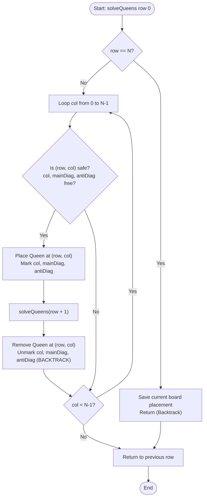

# N-Queens Problem (Backtracking & Constraint Satisfaction)

## 1. Introduction

The **N-Queens Problem** is a classic puzzle in computer science, mathematics, and artificial intelligence, solved efficiently using **Backtracking**.

The challenge is to place $N$ chess queens on an $N \times N$ chessboard such that **no two queens attack each other**.

In chess, a queen can move any number of squares horizontally, vertically, or diagonally. Therefore, a valid N-Queens placement requires that no two queens share:
1. The same **Row**
2. The same **Column**
3. The same **Main Diagonal** ($\backslash$, top-left to bottom-right)
4. The same **Anti-Diagonal** ($/$, top-right to bottom-left)

---

## 2. Why Use This Algorithm?

### Brute-Force vs. Backtracking Exploration Space:
For an $N \times N$ board:
1. **Naïve Combination Search ($\binom{N^2}{N}$):**
   For $N = 8$, placing 8 queens anywhere on 64 squares yields $\binom{64}{8} = \mathbf{4,426,165,368}$ configurations! ❌ *Extremely Slow.*
2. **Row-by-Row Placement ($N^N$):**
   Placing exactly 1 queen per row yields $8^8 = \mathbf{16,777,216}$ configurations.
3. **Backtracking with $O(1)$ Constraint Lookups ($O(N!)$):**
   By placing queens row-by-row and instantly pruning invalid columns or diagonals before recursing deeper, we check only valid partial paths. For $N=8$, Backtracking evaluates fewer than **15,000 states** and completes in **under 1 millisecond**!

### Solution Counts for Small $N$:
| $N$ | Board Size | Total Solutions | Distinct (Fundamental) Solutions |
| :--- | :--- | :--- | :--- |
| $N = 1$ | $1 \times 1$ | 1 | 1 |
| $N = 2$ | $2 \times 2$ | 0 | 0 |
| $N = 3$ | $3 \times 3$ | 0 | 0 |
| $N = 4$ | $4 \times 4$ | 2 | 1 |
| $N = 8$ | $8 \times 8$ | 92 | 12 |
| $N = 10$ | $10 \times 10$ | 724 | 92 |
| $N = 12$ | $12 \times 12$ | 14,200 | 1,787 |

---

## 3. Real-World Applications

- **Constraint Satisfaction Problems (CSP):** Core benchmark problem for testing constraint-logic programming, SAT solvers, and AI search heuristics.
- **VLSI Microchip Routing & Track Placement:** Designing integrated circuit wiring where parallel or diagonal signal tracks must not cross to prevent electromagnetic interference (crosstalk).
- **Air Traffic & Runway Scheduling:** Scheduling flight departure/landing trajectories where no two aircraft share conflicting airspace lanes.
- **Parallel Task Scheduling:** Assigning jobs to processor cores without memory bus contention or hardware resource locks.

---

## 4. Prerequisites

Before learning the N-Queens problem, you should be comfortable with:
- **Recursion & Backtracking:** Understanding state tree traversal, base cases, and undoing choices (backtracking).
- **2D Grid Indexing & Hash Lookups:** Storing boolean arrays or sets to track occupied paths.
- **Diagonal Indexing Formulas:**
  - **Main Diagonal ($\backslash$):** Constant value for $(\text{row} - \text{col} + N - 1)$.
  - **Anti-Diagonal ($/$):** Constant value for $(\text{row} + \text{col})$.

---

## 5. Visualization

### The Two Solutions for $N = 4$

#### Solution 1: `[1, 3, 0, 2]` (Column indices per row)
```
.  Q  .  .      (Row 0, Col 1)
.  .  .  Q      (Row 1, Col 3)
Q  .  .  .      (Row 2, Col 0)
.  .  Q  .      (Row 3, Col 2)
```

#### Solution 2: `[2, 0, 3, 1]` (Symmetric reflection)
```
.  .  Q  .      (Row 0, Col 2)
Q  .  .  .      (Row 1, Col 0)
.  .  .  Q      (Row 2, Col 3)
.  Q  .  .      (Row 3, Col 1)
```

### Diagonal Indexing Map ($4 \times 4$)

```
Main Diagonal Index: (row - col + N - 1)      Anti-Diagonal Index: (row + col)
+---+---+---+---+                              +---+---+---+---+
| 3 | 2 | 1 | 0 |                              | 0 | 1 | 2 | 3 |
+---+---+---+---+                              +---+---+---+---+
| 4 | 3 | 2 | 1 |                              | 1 | 2 | 3 | 4 |
+---+---+---+---+                              +---+---+---+---+
| 5 | 4 | 3 | 2 |                              | 2 | 3 | 4 | 5 |
+---+---+---+---+                              +---+---+---+---+
| 6 | 5 | 4 | 3 |                              | 3 | 4 | 5 | 6 |
+---+---+---+---+                              +---+---+---+---+
```

### Mermaid Flowchart



---

## 6. How It Works

1. **Row-by-Row Search:** We place exactly one queen per row, moving top-to-bottom from `row = 0` to `N - 1`.
2. **Column & Diagonal Tracking Arrays ($O(1)$ check):**
   - `cols[c]`: True if column `c` is occupied.
   - `mainDiag[r - c + N - 1]`: True if main diagonal is occupied.
   - `antiDiag[r + c]`: True if anti-diagonal is occupied.
3. **Recursive Exploration:**
   - At `row r`, iterate through every `col c` from `0` to `N - 1`.
   - Check if `cols[c]`, `mainDiag[r - c + N - 1]`, and `antiDiag[r + c]` are all `False`.
   - If valid:
     - Place queen at `(r, c)`.
     - Set tracking flags to `True`.
     - Recurse to `solve(r + 1)`.
     - **Backtrack:** Revert queen placement and set tracking flags back to `False`.
4. **Base Case:** When `row == N`, all $N$ queens have been successfully placed without conflicts. Append board configuration to the result list.

---

## 7. Step-by-Step Algorithm

1. Input: Integer $N$.
2. Initialize:
   - `cols` array of size $N$ (false).
   - `mainDiag` array of size $2N - 1$ (false).
   - `antiDiag` array of size $2N - 1$ (false).
   - `board` array of size $N$ storing column position for each row.
   - `solutions` list.
3. Define `backtrack(row)`:
   - If `row == N`:
     - Construct $N \times N$ string representation from `board` and add to `solutions`.
     - Return.
   - For `col = 0` to `N - 1`:
     - `d1 = row - col + N - 1`
     - `d2 = row + col`
     - If not `cols[col]` and not `mainDiag[d1]` and not `antiDiag[d2]`:
       - `board[row] = col`
       - `cols[col] = mainDiag[d1] = antiDiag[d2] = true`
       - `backtrack(row + 1)`
       - `cols[col] = mainDiag[d1] = antiDiag[d2] = false` (Backtrack)
4. Call `backtrack(0)` and return `solutions`.

---

## 8. Pseudocode

```text
function solveNQueens(N):
    solutions = []
    cols = array of size N initialized to false
    mainDiag = array of size 2*N - 1 initialized to false
    antiDiag = array of size 2*N - 1 initialized to false
    board = array of size N initialized to -1

    function backtrack(row):
        if row == N:
            solutions.append(formatBoard(board, N))
            return

        for col from 0 to N - 1:
            d1 = row - col + N - 1
            d2 = row + col

            if not cols[col] and not mainDiag[d1] and not antiDiag[d2]:
                // Place Queen
                board[row] = col
                cols[col] = mainDiag[d1] = antiDiag[d2] = true

                // Recurse to next row
                backtrack(row + 1)

                // Backtrack
                cols[col] = mainDiag[d1] = antiDiag[d2] = false

    backtrack(0)
    return solutions
```

---

## 9. Code Examples

### C Implementation

```c
#include <stdio.h>
#include <stdlib.h>
#include <stdbool.h>

#define MAX_N 20

int count = 0;
bool cols[MAX_N];
bool mainDiag[2 * MAX_N];
bool antiDiag[2 * MAX_N];
int board[MAX_N];

void printSolution(int n) {
    printf("Solution %d:\n", ++count);
    for (int i = 0; i < n; i++) {
        for (int j = 0; j < n; j++) {
            if (board[i] == j) printf(" Q ");
            else printf(" . ");
        }
        printf("\n");
    }
    printf("\n");
}

void solveNQueens(int row, int n) {
    if (row == n) {
        printSolution(n);
        return;
    }

    for (int col = 0; col < n; col++) {
        int d1 = row - col + n - 1;
        int d2 = row + col;

        if (!cols[col] && !mainDiag[d1] && !antiDiag[d2]) {
            board[row] = col;
            cols[col] = mainDiag[d1] = antiDiag[d2] = true;

            solveNQueens(row + 1, n);

            cols[col] = mainDiag[d1] = antiDiag[d2] = false; // Backtrack
        }
    }
}

int main() {
    int n = 4;
    printf("Solving %d-Queens in C:\n\n", n);
    solveNQueens(0, n);
    printf("Total Solutions Found: %d\n", count);
    return 0;
}
```

---

### C++ Implementation (LeetCode 51 Style)

```cpp
#include <iostream>
#include <vector>
#include <string>

using namespace std;

class NQueens {
private:
    vector<vector<string>> solutions;
    vector<bool> cols, mainDiag, antiDiag;
    vector<int> board;

    void backtrack(int row, int n) {
        if (row == n) {
            vector<string> currentBoard(n, string(n, '.'));
            for (int r = 0; r < n; r++) {
                currentBoard[r][board[r]] = 'Q';
            }
            solutions.push_back(currentBoard);
            return;
        }

        for (int col = 0; col < n; col++) {
            int d1 = row - col + n - 1;
            int d2 = row + col;

            if (!cols[col] && !mainDiag[d1] && !antiDiag[d2]) {
                board[row] = col;
                cols[col] = mainDiag[d1] = antiDiag[d2] = true;

                backtrack(row + 1, n);

                cols[col] = mainDiag[d1] = antiDiag[d2] = false; // Backtrack
            }
        }
    }

public:
    vector<vector<string>> solveNQueens(int n) {
        solutions.clear();
        cols.assign(n, false);
        mainDiag.assign(2 * n - 1, false);
        antiDiag.assign(2 * n - 1, false);
        board.assign(n, -1);

        backtrack(0, n);
        return solutions;
    }
};

int main() {
    int n = 4;
    NQueens solver;
    auto result = solver.solveNQueens(n);

    cout << "Total Solutions for N=" << n << ": " << result.size() << "\n\n";
    for (size_t i = 0; i < result.size(); i++) {
        cout << "Solution " << i + 1 << ":\n";
        for (const string& row : result[i]) {
            cout << row << "\n";
        }
        cout << "\n";
    }

    return 0;
}
```

---

### Java Implementation

```java
import java.util.ArrayList;
import java.util.Arrays;
import java.util.List;

public class NQueens {

    private List<List<String>> solutions = new ArrayList<>();
    private boolean[] cols;
    private boolean[] mainDiag;
    private boolean[] antiDiag;
    private int[] board;

    public List<List<String>> solveNQueens(int n) {
        solutions.clear();
        cols = new boolean[n];
        mainDiag = new boolean[2 * n - 1];
        antiDiag = new boolean[2 * n - 1];
        board = new int[n];

        backtrack(0, n);
        return solutions;
    }

    private void backtrack(int row, int n) {
        if (row == n) {
            solutions.add(constructBoard(n));
            return;
        }

        for (int col = 0; col < n; col++) {
            int d1 = row - col + n - 1;
            int d2 = row + col;

            if (!cols[col] && !mainDiag[d1] && !antiDiag[d2]) {
                board[row] = col;
                cols[col] = mainDiag[d1] = antiDiag[d2] = true;

                backtrack(row + 1, n);

                cols[col] = mainDiag[d1] = antiDiag[d2] = false; // Backtrack
            }
        }
    }

    private List<String> constructBoard(int n) {
        List<String> result = new ArrayList<>();
        for (int r = 0; r < n; r++) {
            char[] charArray = new char[n];
            Arrays.fill(charArray, '.');
            charArray[board[r]] = 'Q';
            result.add(new String(charArray));
        }
        return result;
    }

    public static void main(String[] args) {
        int n = 4;
        NQueens solver = new NQueens();
        List<List<String>> result = solver.solveNQueens(n);

        System.out.println("Java N-Queens Solutions for N=" + n + " (Total: " + result.size() + "):");
        for (List<String> b : result) {
            for (String row : b) {
                System.out.println(row);
            }
            System.out.println();
        }
    }
}
```

---

### Python Implementation

```python
from typing import List

class NQueens:
    def solveNQueens(self, n: int) -> List[List[str]]:
        solutions = []
        cols = [False] * n
        main_diag = [False] * (2 * n - 1)
        anti_diag = [False] * (2 * n - 1)
        board = [-1] * n

        def backtrack(row: int):
            if row == n:
                current_board = []
                for r in range(n):
                    row_str = ["."] * n
                    row_str[board[r]] = "Q"
                    current_board.append("".join(row_str))
                solutions.append(current_board)
                return

            for col in range(n):
                d1 = row - col + n - 1
                d2 = row + col

                if not cols[col] and not main_diag[d1] and not anti_diag[d2]:
                    board[row] = col
                    cols[col] = main_diag[d1] = anti_diag[d2] = True

                    backtrack(row + 1)

                    cols[col] = main_diag[d1] = anti_diag[d2] = False  # Backtrack

        backtrack(0)
        return solutions


if __name__ == "__main__":
    n = 4
    solver = NQueens()
    res = solver.solveNQueens(n)
    print(f"Total Solutions for N={n}: {len(res)}\n")
    for idx, sol in enumerate(res, 1):
        print(f"Solution {idx}:")
        for row in sol:
            print(row)
        print()
```

---

### JavaScript Implementation

```javascript
function solveNQueens(n) {
    const solutions = [];
    const cols = new Array(n).fill(false);
    const mainDiag = new Array(2 * n - 1).fill(false);
    const antiDiag = new Array(2 * n - 1).fill(false);
    const board = new Array(n).fill(-1);

    function backtrack(row) {
        if (row === n) {
            const currentBoard = [];
            for (let r = 0; r < n; r++) {
                const rowArr = new Array(n).fill(".");
                rowArr[board[r]] = "Q";
                currentBoard.push(rowArr.join(""));
            }
            solutions.push(currentBoard);
            return;
        }

        for (let col = 0; col < n; col++) {
            const d1 = row - col + n - 1;
            const d2 = row + col;

            if (!cols[col] && !mainDiag[d1] && !antiDiag[d2]) {
                board[row] = col;
                cols[col] = mainDiag[d1] = antiDiag[d2] = true;

                backtrack(row + 1);

                cols[col] = mainDiag[d1] = antiDiag[d2] = false; // Backtrack
            }
        }
    }

    backtrack(0);
    return solutions;
}

// Execution Demo
const n = 4;
const result = solveNQueens(n);
console.log(`Total Solutions for N=${n}: ${result.length}\n`);
result.forEach((sol, idx) => {
    console.log(`Solution ${idx + 1}:`);
    sol.forEach(row => console.log(row));
    console.log("");
});
```

---

## 10. Code Explanation

1. **State Tracking Arrays:** `cols[col]`, `mainDiag[row - col + n - 1]`, and `antiDiag[row + col]` allow checking if a square is threatened in **$O(1)$ constant time**, replacing expensive matrix scanning loops!
2. **`backtrack(row)` Recursion:** Places a queen in the current `row` and recursively calls `backtrack(row + 1)`.
3. **Backtracking Reset:** Setting flags back to `false` after the recursive call enables searching alternative paths without state leakage.
4. **Base Case:** When `row === n`, all $N$ queens have been safely placed. The 1D `board` array (where `board[r] = col`) is converted to an $N \times N$ string representation.

---

## 11. Interactive Demo

An interactive chessboard search visualizer includes:
1. **Board Size Selector ($N = 1$ to $12$):** Renders dynamic chessboard grid.
2. **Execution Speed Control:** Stepper to animate backtracking state exploration.
3. **Cell State Colors:**
   - 👑 **Gold:** Active Queen placed in current row.
   - 🔴 **Red X:** Threatened square (column or diagonal conflict).
   - 🟢 **Green Path:** Valid branch leading to complete solution.
4. **Pruning Counter:** Live metrics showing total valid vs pruned state-space nodes visited.

---

## 12. Dry Run

### Sample Trace for $N = 4$

```
Row 0: Try Col 0 -> Place Queen at (0, 0)
  Row 1: Try Col 0 (Col conflict) -> Try Col 1 (Diag conflict) -> Try Col 2 -> Place Queen at (1, 2)
    Row 2: Col 0, 1, 2, 3 all blocked! -> BACKTRACK to Row 1
  Row 1: Try Col 3 -> Place Queen at (1, 3)
    Row 2: Try Col 0 -> (Col 0 free, Diag free) -> Place Queen at (2, 0)
      Row 3: Col 0, 1 (blocked), Col 2 -> Place Queen at (3, 2)
        Row 4: row == 4 -> SOLUTION 1 FOUND! [1, 3, 0, 2] -> BACKTRACK

Row 0: Try Col 1 -> Place Queen at (0, 1)
  Row 1: Try Col 3 -> Place Queen at (1, 3)
    Row 2: Try Col 0 -> Place Queen at (2, 0)
      Row 3: Try Col 2 -> Place Queen at (3, 2) -> SOLUTION 2 FOUND! [2, 0, 3, 1]
```

---

## 13. Time & Space Complexity

| Case | Time Complexity | Auxiliary Space Complexity | Explanation |
| :--- | :--- | :--- | :--- |
| **Worst-Case Time** | **$O(N!)$** | $O(N)$ | $N$ choices for row 0, $N-2$ for row 1, $N-4$ for row 2, etc. |
| **Space Complexity** | **$O(N)$** | $O(N)$ | Recursion stack depth $N$ + tracking arrays of size $O(N)$. |

---

## 14. Advantages

- **Optimal State Pruning:** $O(1)$ diagonal/column lookups prune invalid branches immediately.
- **Minimal Space:** $O(N)$ auxiliary memory footprint.
- **Finds All Solutions:** Can easily count (LeetCode 52) or enumerate (LeetCode 51) all valid solutions.

---

## 15. Disadvantages

- **Exponential Upper Bound:** Cannot scale beyond $N \approx 25$ using standard depth-first backtracking (requires bitwise parallel solvers or SAT heuristics for huge $N$).
- **No Solutions for $N=2, 3$:** Special small cases yield empty sets.

---

## 16. Applications

- AI game tree search and pruning validation.
- Printed circuit board (PCB) micro-wiring layout routing without track crossing.
- Maximum Independent Set / Graph Coloring sub-routines.

---

## 17. Common Mistakes

1. **Incorrect Diagonal Indexing Formula:** Using `row - col` directly causes negative array indices! Always offset by `+ (N - 1)`: `row - col + N - 1`.
2. **Forgetting to Backtrack:** Omitting the unmarking step (`cols[col] = false`) prevents exploring alternative choices.
3. **Scanning 2D Matrix for Conflicts ($O(N)$ check):** Checking conflicts via 2D loops instead of $O(1)$ tracking arrays degrades performance by an extra factor of $N$.

---

## 18. Interview Questions

1. **What are the formulas to track main and anti-diagonals in $O(1)$ time?** (Answer: Main diagonal: `row - col + N - 1`, Anti-diagonal: `row + col`).
2. **How does Bitmasking optimize the N-Queens solution?** (Answer: Uses integer bitmasks `cols | (mainDiag << 1) | (antiDiag >> 1)` to evaluate valid spots in hardware register operations).
3. **How many solutions exist for $N = 8$?** (Answer: 92 total, 12 fundamental up to symmetry).
4. **Why are there zero solutions for $N = 2$ and $N = 3$?**

---

## 19. Practice Problems

### Easy
1. LeetCode 52: N-Queens II (Return total number of distinct solutions).
2. Print the first valid N-Queens solution for $N=8$.

### Medium
3. LeetCode 51: N-Queens I (Return all distinct board configurations).
4. Implement Bitwise N-Queens solver in C++ / Java.

### Hard
5. N-Queens with Obstacles (board contains broken squares where queens cannot be placed).
6. Super N-Queens (Queens + Knights combined movement restrictions).

---

## 20. Related Algorithms

- **Sudoku Solver:** 9x9 grid backtracking with row/col/box constraint sets.
- **Rat in a Maze / Knight's Tour:** Grid-based DFS backtracking search.
- **Graph Coloring Problem:** Assigning colors to graph vertices without adjacent conflict.

---

## 21. Summary

- **Category:** Backtracking / Constraint Satisfaction Problem (CSP).
- **Time Complexity:** $O(N!)$.
- **Space Complexity:** $O(N)$.
- **Core Lookup Trick:** Track occupied lines in $O(1)$ time via `cols[c]`, `mainDiag[r - c + N - 1]`, and `antiDiag[r + c]`.

---

## 22. Quiz

#### Question 1: How many total solutions exist for the 8-Queens problem on a standard $8 \times 8$ chessboard?
- A) 12
- B) 64
- C) 92
- D) 256
- **Correct Answer:** C
- **Explanation:** There are 92 total valid configurations (which reduce to 12 fundamental non-symmetric solutions).

#### Question 2: Which index formula uniquely identifies the main diagonal ($\backslash$) for square `(row, col)`?
- A) `row * col`
- B) `row + col`
- C) `row - col + N - 1`
- D) `row / col`
- **Correct Answer:** C
- **Explanation:** `row - col` stays constant along main diagonals; adding `N - 1` prevents negative array indices.

#### Question 3: Which index formula uniquely identifies the anti-diagonal ($/$) for square `(row, col)`?
- A) `row + col`
- B) `row - col`
- C) `row * N + col`
- D) `col - row`
- **Correct Answer:** A
- **Explanation:** `row + col` stays constant along anti-diagonals.

#### Question 4: What is the total number of solutions for $N = 2$ and $N = 3$?
- A) 1 each
- B) 0 each
- C) 2 each
- D) 4 each
- **Correct Answer:** B
- **Explanation:** Boards of size $2 \times 2$ and $3 \times 3$ cannot accommodate $N$ non-attacking queens.

#### Question 5: What is the auxiliary space complexity of the backtracking N-Queens solution?
- A) $O(1)$
- B) $O(N)$
- C) $O(N^2)$
- D) $O(N!)$
- **Correct Answer:** B
- **Explanation:** $O(N)$ recursion depth plus $O(N)$ space for tracking arrays.

#### Question 6: Why is backtracking row-by-row better than checking random $N$-queen arrangements?
- A) It uses dynamic programming memory.
- B) It prunes invalid search branches immediately when a conflict is detected.
- C) It converts the problem to $O(N)$ time.
- D) It sorts the queens by rank.
- **Correct Answer:** B
- **Explanation:** Pruning invalid partial arrangements avoids exploring billions of dead-end configurations.

#### Question 7: What is the time complexity bound for the N-Queens backtracking algorithm?
- A) $O(N)$
- B) $O(N^2)$
- C) $O(N!)$
- D) $O(2^N)$
- **Correct Answer:** C
- **Explanation:** In the worst case, the branch factor reduces from $N$ to $N-1$ to $N-2$, bound by $O(N!)$.

#### Question 8: How many total diagonals exist in an $N \times N$ matrix for each direction?
- A) $N$
- B) $2N - 1$
- C) $N^2$
- D) $2N + 1$
- **Correct Answer:** B
- **Explanation:** An $N \times N$ matrix has exactly $2N - 1$ main diagonals and $2N - 1$ anti-diagonals.

#### Question 9: What is the key operation performed during the "backtracking" step?
- A) Restarting the program.
- B) Undoing the queen placement and resetting occupied flags (`cols[col] = false`).
- C) Allocating a new board.
- D) Throwing an exception.
- **Correct Answer:** B
- **Explanation:** Undoing changes permits trying the next column choice in the current row.

#### Question 10: For $N = 4$, how many distinct solution configurations exist?
- A) 0
- B) 1
- C) 2
- D) 8
- **Correct Answer:** C
- **Explanation:** $N = 4$ yields exactly 2 valid solutions (`[1, 3, 0, 2]` and `[2, 0, 3, 1]`).
