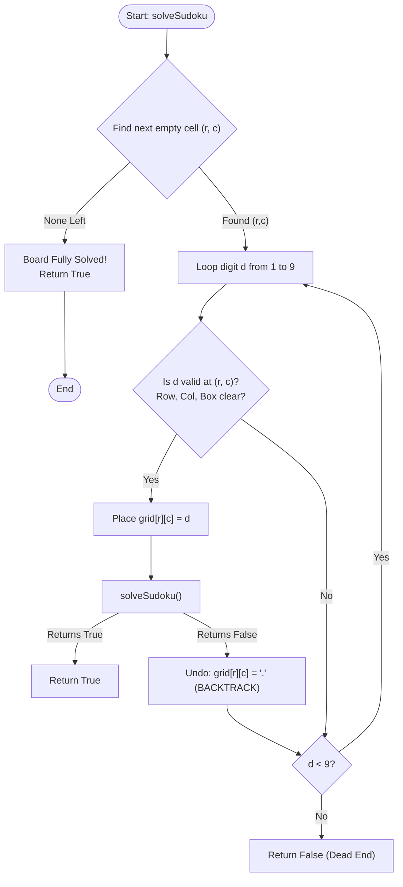

# Sudoku Solver (Backtracking & Constraint Satisfaction)

## 1. Introduction

The **Sudoku Solver** is one of the classic constraint satisfaction and backtracking problems in computer science and artificial intelligence.

The goal is to complete a partially filled $9 \times 9$ grid with digits from 1 to 9 such that every row, every column, and every $3 \times 3$ subgrid (often called a box or block) contains all digits from 1 to 9 without repetition.

Sudoku solving serves as a foundational model for solving hard combinatorial puzzles, boolean satisfiability (SAT) problems, resource assignment, and logic-based search algorithms.

---

## 2. Why Use This Algorithm?

### Brute-Force vs. Backtracking Search Space
For a standard $9 \times 9$ Sudoku grid:
1. **Naïve Brute-Force ($9^{81}$):**
   An empty $9 \times 9$ grid has 81 cells. If we try every digit (1 to 9) in every cell without checking rules during placement, the search space is $9^{81} \approx 1.96 \times 10^{77}$ combinations! ❌ *Completely impractical.*
2. **Backtracking Search with Constraint Checking:**
   By evaluating validity **before** placing a number and immediately pruning invalid branches, backtracking reduces the search space by many orders of magnitude. A valid $9 \times 9$ Sudoku is solved in **milliseconds**.

### Key Rules (Constraints):
Every placed number $d \in \{1, \dots, 9\}$ at position $(r, c)$ must satisfy:
1. **Row Constraint:** $d$ does not already exist in row $r$.
2. **Column Constraint:** $d$ does not already exist in column $c$.
3. **Box Constraint:** $d$ does not already exist in the $3 \times 3$ subgrid containing $(r, c)$, where box index is $(r / 3) \times 3 + (c / 3)$.

---

## 3. Real-World Applications

- **Constraint Satisfaction Problems (CSP):** Benchmark domain for testing constraint-logic programming, automated reasoning systems, and SAT solvers.
- **Resource Allocation & Timetables:** Assigning timeslots, classrooms, and teachers without schedule collisions.
- **Register Allocation in Compilers:** Assigning finite hardware registers to CPU variables such that active variables do not overlap.
- **Frequency Assignment in Wireless Networks:** Assigning radio spectrum frequencies to cell towers to avoid co-channel signal interference.

---

## 4. Prerequisites

Before understanding the Sudoku Solver, you should be familiar with:
- **Recursion & Backtracking:** Navigating a decision tree, placing choices, recursing, and undoing choices when stuck.
- **2D Arrays & Grid Indexing:** Navigating row-column coordinates in a $9 \times 9$ matrix.
- **Subgrid (Box) Indexing Formula:**
  - `box_index = (row / 3) * 3 + (col / 3)`
  - Top-left row index of the box: `(row / 3) * 3`
  - Top-left column index of the box: `(col / 3) * 3`
- **Bitmasking (Optional Enhancement):** Using bitwise operations for $O(1)$ constraint checking.

---

## 5. Visualization

### Subgrid / Box Indexing Breakdown ($9 \times 9$)

```
Columns: 0 1 2 | 3 4 5 | 6 7 8
Row 0-2  [Box 0] | [Box 1] | [Box 2]
Row 3-5  [Box 3] | [Box 4] | [Box 5]
Row 6-8  [Box 6] | [Box 7] | [Box 8]
```

### Mermaid Flowchart



---

## 6. How It Works

1. **Find Empty Cell:** Scan the grid for an unassigned cell (represented by `.` or `0`).
2. **Try Candidates (1 to 9):** Iterate through digits from `1` to `9`.
3. **Validate Safety:**
   - Check if digit is absent in the current row.
   - Check if digit is absent in the current column.
   - Check if digit is absent in the current $3 \times 3$ subgrid.
4. **Place & Recurse:** If safe, place the digit and recursively call `solveSudoku()`.
5. **Backtrack:** If recursive call returns `False` (leading to a dead end), reset the cell to empty and try the next digit.
6. **Base Case:** When no empty cell remains, the puzzle is solved.

---

## 7. Step-by-Step Algorithm

1. Find an empty cell `(row, col)` on the board.
2. If no empty cell exists, return `True` (puzzle solved).
3. For digit `num` from 1 to 9:
   1. Check if `num` is safe to place at `board[row][col]`.
   2. If safe:
      - Set `board[row][col] = num`.
      - If `solveSudoku(board)` returns `True`, return `True`.
      - Else, reset `board[row][col] = '.'` (Backtrack).
4. If no digit from 1 to 9 works, return `False` to trigger backtracking in the caller frame.

---

## 8. Pseudocode

```text
function solveSudoku(board):
    for row from 0 to 8:
        for col from 0 to 8:
            if board[row][col] == '.':
                for num from '1' to '9':
                    if isValid(board, row, col, num):
                        board[row][col] = num
                        if solveSudoku(board) == true:
                            return true
                        board[row][col] = '.' // Backtrack
                return false // Dead end, try previous placement
    return true // All cells filled successfully

function isValid(board, row, col, num):
    for i from 0 to 8:
        // Check row
        if board[row][i] == num: return false
        // Check column
        if board[i][col] == num: return false
        // Check 3x3 box
        boxRow = 3 * (row / 3) + (i / 3)
        boxCol = 3 * (col / 3) + (i % 3)
        if board[boxRow][boxCol] == num: return false
    return true
```

---

## 9. Code Examples

### C
```c
#include <stdio.h>
#include <stdbool.h>

#define N 9

bool isValid(char board[N][N], int row, int col, char num) {
    for (int i = 0; i < N; i++) {
        if (board[row][i] == num) return false;
        if (board[i][col] == num) return false;
        int boxRow = 3 * (row / 3) + i / 3;
        int boxCol = 3 * (col / 3) + i % 3;
        if (board[boxRow][boxCol] == num) return false;
    }
    return true;
}

bool solveSudoku(char board[N][N]) {
    for (int row = 0; row < N; row++) {
        for (int col = 0; col < N; col++) {
            if (board[row][col] == '.') {
                for (char num = '1'; num <= '9'; num++) {
                    if (isValid(board, row, col, num)) {
                        board[row][col] = num;
                        if (solveSudoku(board)) return true;
                        board[row][col] = '.'; // Backtrack
                    }
                }
                return false;
            }
        }
    }
    return true;
}

void printBoard(char board[N][N]) {
    for (int r = 0; r < N; r++) {
        for (int c = 0; c < N; c++) {
            printf("%c ", board[r][c]);
        }
        printf("\n");
    }
}

int main() {
    char board[N][N] = {
        {'5','3','.','.','7','.','.','.','.'},
        {'6','.','.','1','9','5','.','.','.'},
        {'.','9','8','.','.','.','.','6','.'},
        {'8','.','.','.','6','.','.','.','3'},
        {'4','.','.','8','.','3','.','.','1'},
        {'7','.','.','.','2','.','.','.','6'},
        {'.','6','.','.','.','.','2','8','.'},
        {'.','.','.','4','1','9','.','.','5'},
        {'.','.','.','.','8','.','.','7','9'}
    };

    if (solveSudoku(board)) {
        printf("Sudoku solved successfully:\n");
        printBoard(board);
    } else {
        printf("No solution exists.\n");
    }
    return 0;
}
```

### C++
```cpp
#include <iostream>
#include <vector>

using namespace std;

class SudokuSolver {
public:
    bool isValid(const vector<vector<char>>& board, int row, int col, char num) {
        for (int i = 0; i < 9; i++) {
            if (board[row][i] == num) return false;
            if (board[i][col] == num) return false;
            if (board[3 * (row / 3) + i / 3][3 * (col / 3) + i % 3] == num) return false;
        }
        return true;
    }

    bool solveSudoku(vector<vector<char>>& board) {
        for (int row = 0; row < 9; row++) {
            for (int col = 0; col < 9; col++) {
                if (board[row][col] == '.') {
                    for (char num = '1'; num <= '9'; num++) {
                        if (isValid(board, row, col, num)) {
                            board[row][col] = num;
                            if (solveSudoku(board)) return true;
                            board[row][col] = '.'; // Backtrack
                        }
                    }
                    return false;
                }
            }
        }
        return true;
    }
};

int main() {
    vector<vector<char>> board = {
        {'5','3','.','.','7','.','.','.','.'},
        {'6','.','.','1','9','5','.','.','.'},
        {'.','9','8','.','.','.','.','6','.'},
        {'8','.','.','.','6','.','.','.','3'},
        {'4','.','.','8','.','3','.','.','1'},
        {'7','.','.','.','2','.','.','.','6'},
        {'.','6','.','.','.','.','2','8','.'},
        {'.','.','.','4','1','9','.','.','5'},
        {'.','.','.','.','8','.','.','7','9'}
    };

    SudokuSolver solver;
    if (solver.solveSudoku(board)) {
        cout << "Sudoku solved successfully:\n";
        for (const auto& row : board) {
            for (char cell : row) cout << cell << " ";
            cout << "\n";
        }
    } else {
        cout << "No solution exists.\n";
    }
    return 0;
}
```

### Java
```java
public class SudokuSolver {

    private static boolean isValid(char[][] board, int row, int col, char num) {
        for (int i = 0; i < 9; i++) {
            if (board[row][i] == num) return false;
            if (board[i][col] == num) return false;
            if (board[3 * (row / 3) + i / 3][3 * (col / 3) + i % 3] == num) return false;
        }
        return true;
    }

    public static boolean solveSudoku(char[][] board) {
        for (int row = 0; row < 9; row++) {
            for (int col = 0; col < 9; col++) {
                if (board[row][col] == '.') {
                    for (char num = '1'; num <= '9'; num++) {
                        if (isValid(board, row, col, num)) {
                            board[row][col] = num;
                            if (solveSudoku(board)) return true;
                            board[row][col] = '.'; // Backtrack
                        }
                    }
                    return false;
                }
            }
        }
        return true;
    }

    public static void main(String[] args) {
        char[][] board = {
            {'5','3','.','.','7','.','.','.','.'},
            {'6','.','.','1','9','5','.','.','.'},
            {'.','9','8','.','.','.','.','6','.'},
            {'8','.','.','.','6','.','.','.','3'},
            {'4','.','.','8','.','3','.','.','1'},
            {'7','.','.','.','2','.','.','.','6'},
            {'.','6','.','.','.','.','2','8','.'},
            {'.','.','.','4','1','9','.','.','5'},
            {'.','.','.','.','8','.','.','7','9'}
        };

        if (solveSudoku(board)) {
            System.out.println("Sudoku solved successfully:");
            for (int r = 0; r < 9; r++) {
                for (int c = 0; c < 9; c++) {
                    System.out.print(board[r][c] + " ");
                }
                System.out.println();
            }
        } else {
            System.out.println("No solution exists.");
        }
    }
}
```

### Python
```python
def is_valid(board, row, col, num):
    for i in range(9):
        # Check row
        if board[row][i] == num:
            return False
        # Check column
        if board[i][col] == num:
            return False
        # Check 3x3 subgrid
        box_row = 3 * (row // 3) + i // 3
        box_col = 3 * (col // 3) + i % 3
        if board[box_row][box_col] == num:
            return False
    return True

def solve_sudoku(board):
    for row in range(9):
        for col in range(9):
            if board[row][col] == '.':
                for num in map(str, range(1, 10)):
                    if is_valid(board, row, col, num):
                        board[row][col] = num
                        if solve_sudoku(board):
                            return True
                        board[row][col] = '.'  # Backtrack
                return False
    return True

if __name__ == "__main__":
    board = [
        ['5','3','.','.','7','.','.','.','.'],
        ['6','.','.','1','9','5','.','.','.'],
        ['.','9','8','.','.','.','.','6','.'],
        ['8','.','.','.','6','.','.','.','3'],
        ['4','.','.','8','.','3','.','.','1'],
        ['7','.','.','.','2','.','.','.','6'],
        ['.','6','.','.','.','.','2','8','.'],
        ['.','.','.','4','1','9','.','.','5'],
        ['.','.','.','.','8','.','.','7','9']
    ]

    if solve_sudoku(board):
        print("Sudoku solved successfully:")
        for row in board:
            print(" ".join(row))
    else:
        print("No solution exists.")
```

### JavaScript
```javascript
function isValid(board, row, col, num) {
    for (let i = 0; i < 9; i++) {
        if (board[row][i] === num) return false;
        if (board[i][col] === num) return false;
        const boxRow = 3 * Math.floor(row / 3) + Math.floor(i / 3);
        const boxCol = 3 * Math.floor(col / 3) + (i % 3);
        if (board[boxRow][boxCol] === num) return false;
    }
    return true;
}

function solveSudoku(board) {
    for (let row = 0; row < 9; row++) {
        for (let col = 0; col < 9; col++) {
            if (board[row][col] === '.') {
                for (let digit = 1; digit <= 9; digit++) {
                    const num = digit.toString();
                    if (isValid(board, row, col, num)) {
                        board[row][col] = num;
                        if (solveSudoku(board)) {
                            return true;
                        }
                        board[row][col] = '.'; // Backtrack
                    }
                }
                return false;
            }
        }
    }
    return true;
}

const board = [
    ['5','3','.','.','7','.','.','.','.'],
    ['6','.','.','1','9','5','.','.','.'],
    ['.','9','8','.','.','.','.','6','.'],
    ['8','.','.','.','6','.','.','.','3'],
    ['4','.','.','8','.','3','.','.','1'],
    ['7','.','.','.','2','.','.','.','6'],
    ['.','6','.','.','.','.','2','8','.'],
    ['.','.','.','4','1','9','.','.','5'],
    ['.','.','.','.','8','.','.','7','9']
];

if (solveSudoku(board)) {
    console.log("Sudoku solved successfully:");
    console.log(board.map(row => row.join(" ")).join("\n"));
} else {
    console.log("No solution exists.");
}
```

---

## 10. Code Explanation

- **Nested Grid Scans:** The outer loops scan row-by-row and column-by-column to locate the first unassigned cell `'.'`.
- **Single-Loop Validation Trick:** In `isValid()`, a single `for` loop from 0 to 8 checks:
  1. Row `row` at index `i`.
  2. Column `col` at index `i`.
  3. $3 \times 3$ box starting at `(3 * (row / 3), 3 * (col / 3))` offset by `(i / 3, i % 3)`.
- **Early Exit / Boolean Propagation:** Returning `true` instantly bubbles up the recursive stack once the board is complete, short-circuiting unnecessary search work.
- **Backtracking Assignment:** If `solveSudoku()` returns `false`, resetting `board[row][col] = '.'` undoes the candidate digit and frees the space for subsequent choices.

---

## 11. Interactive Demo

Imagine a web UI visualizing a $9 \times 9$ grid:
1. **Empty Cells Highlighted:** The grid shows given numbers in bold dark gray and empty cells in soft blue.
2. **Animation Controls:** Buttons for "Play", "Pause", "Step", and "Speed Slider".
3. **Step-by-Step Action:**
   - Active cell turns yellow.
   - Numbers 1 to 9 are tested in sequence.
   - If a number violates row, col, or box rules, conflicting cells turn red briefly.
   - Valid choices turn green and advance to the next empty cell.
   - When a dead end is encountered, the cell turns orange, resets to empty, and moves back to the previous cell (Backtrack).

---

## 12. Dry Run

Tracing filling cell `(0, 2)` on the sample board:

| Step | Cell (r, c) | Candidate | Row Check | Col Check | Box Check | Status / Action |
|------|-------------|-----------|-----------|-----------|-----------|-----------------|
| 1 | (0, 2) | '1' | Safe | Col 2 has no 1 | Box 0 has 1? No | Valid -> Place '1', Recurse |
| 2 | (0, 3) | '1' | Conflict | - | - | Invalid |
| 3 | (0, 3) | '2' | Safe | Col 3 has no 2 | Box 1 has 2? No | Valid -> Place '2', Recurse |
| 4 | ... | ... | ... | ... | ... | Dead end reached downstream |
| 5 | (0, 3) | '2' | Reset | - | - | Undo '2' -> Backtrack to (0, 2) |
| 6 | (0, 2) | '2' | Safe | Col 2 has no 2 | Box 0 has 2? No | Valid -> Place '2', Recurse |

---

## 13. Time & Space Complexity

| Case | Time Complexity | Space Complexity | Reason |
|------|-----------------|------------------|--------|
| Worst Case | $O(9^m)$ | $O(m)$ | $m$ is the number of empty cells (at most 81). Stack depth $\le 81$. |
| Average Case | Milliseconds | $O(m)$ | Early constraint pruning eliminates almost all invalid branches. |
| Best Case | $O(1)$ | $O(1)$ | Board is already fully solved upon entry. |

---

## 14. Advantages

- **Guaranteed Correctness:** Systematically explores all valid candidates, guaranteeing a solution if one exists.
- **In-Place Mutation:** Solves the board in-place without needing massive additional memory structures.
- **Simple Logic:** Conceptually clean recursion with direct constraint checking.

---

## 15. Disadvantages

- **Exponential Worst Case:** On carefully crafted "evil" or adversarial Sudoku boards (like Arto Inkala's puzzles), basic backtracking can explore millions of states.
- **Redundant State Checks:** Without bitmasks or constraint propagation (Dancing Links / Algorithm X), `isValid` checks are repeatedly computed.

---

## 16. Applications

- Puzzle game engines and solvers.
- Benchmark problems for AI search algorithms (Min-Conflicts, Heuristic Search).
- SAT solver testing and graph coloring reductions.

---

## 17. Common Mistakes

- **Incorrect Box Formula:** Using `(row / 3) + (col / 3)` instead of `3 * (row / 3) + (col / 3)`.
- **Forgetting to Backtrack:** Leaving the digit in the cell when recursive call returns `false`.
- **Modifying Given Constants:** Overwriting initial non-empty numbers on the board.

---

## 18. Interview Questions

1. How do you find the subgrid index for cell `(row, col)` in a $9 \times 9$ Sudoku?
2. What is the difference between simple backtracking and Dancing Links (Knuth's Algorithm X)?
3. How can bitmasks optimize the constraint checks from $O(9)$ to $O(1)$?
4. How would you modify the solver to count the total number of solutions for a given Sudoku board?
5. How would you generalize this solver to $N \times N$ Sudoku puzzles (where $N = k^2$)?

---

## 19. Practice Problems

1. **LeetCode 37:** Sudoku Solver (Hard)
2. **LeetCode 36:** Valid Sudoku (Medium)
3. **N-Queens Problem:** Similar grid backtracking pattern with diagonal constraints.

---

## 20. Related Algorithms

- **N-Queens Problem:** Backtracking placement on chessboards.
- **Knuth's Algorithm X (Dancing Links / DLX):** Exact cover solver for ultra-fast Sudoku solving.
- **Graph Coloring:** Assigning colors to vertices such that adjacent vertices share no color.

---

## 21. Summary

The Sudoku Solver is a textbook application of recursive backtracking. By checking row, column, and $3 \times 3$ box constraints before placing digits, backtracking prunes an otherwise intractable search space ($9^{81}$) down to a fraction of a second.

---

## 22. Quiz

**Question 1:** What is the maximum recursive call stack depth for solving a standard $9 \times 9$ Sudoku?
- A) 9
- B) 27
- C) 81
- D) 729
- **Correct Answer:** C
- **Explanation:** At most 81 empty cells exist, so recursion depth is bounded by 81.

**Question 2:** Which formula correctly calculates the top-left row of a $3 \times 3$ box containing `row`?
- A) `(row % 3) * 3`
- B) `3 * (row / 3)`
- C) `row / 3`
- D) `(row + 3) / 3`
- **Correct Answer:** B
- **Explanation:** Integer division `row / 3` gets the box row index (0, 1, or 2), multiplying by 3 gives starting row index (0, 3, or 6).

**Question 3:** What happens when all digits 1-9 fail for an empty cell?
- A) The program terminates with error.
- B) The cell is set to 0 and returns `false` to backtrack.
- C) The algorithm skips to the next cell.
- D) The grid restarts from scratch.
- **Correct Answer:** B
- **Explanation:** Failing all candidates means a prior choice was incorrect, triggering a backtrack step.
