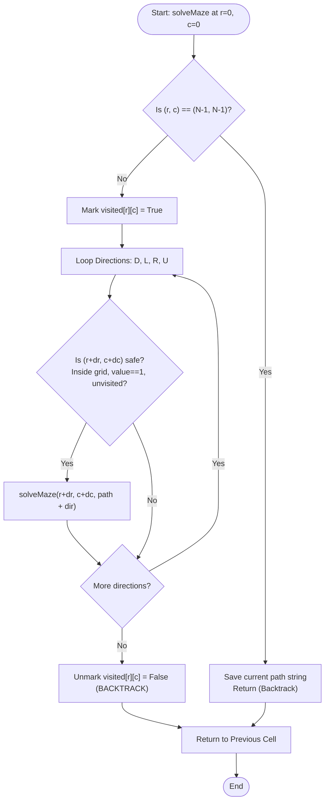

# Rat in a Maze (Backtracking & Pathfinding)

## 1. Introduction

**Rat in a Maze** is a classic pathfinding problem solved using **Backtracking**.

The problem models a rat placed at the top-left cell $(0, 0)$ of an $N \times N$ grid (maze). The goal is for the rat to reach the bottom-right destination cell $(N-1, N-1)$. 

Some cells in the grid contain obstacles (represented by `0`), which the rat cannot pass through, while open cells are represented by `1`. The rat can move in four directions: **Down ('D')**, **Left ('L')**, **Right ('R')**, and **Up ('U')**.

This problem serves as a fundamental benchmark for state-space search, path exploration, and graph traversal algorithms (such as DFS and BFS).

---

## 2. Why Use This Algorithm?

### Brute-Force vs. Backtracking Exploration Space
For an $N \times N$ grid:
1. **Naïve Path Search ($4^{N^2}$):**
   Without tracking visited cells or pruning invalid moves, trying all 4 directional choices for every cell results in an upper bound of $4^{N^2}$ operations! ❌ *Causes infinite recursion loops.*
2. **Backtracking with Visited Tracking ($O(4^{N^2})$ worst-case):**
   By marking cells as visited during recursion and unmarking them during backtracking (or using a `visited` matrix), we ensure the rat does not visit the same cell twice along a single path. If a direction leads to a wall or dead end, we immediately prune that branch and try another direction.

---

## 3. Real-World Applications

- **Robot Navigation & Pathfinding:** Autonomous mobile robots navigating through warehouses or rooms with stationary obstacles.
- **Maze Generation & Solving:** Video game AI for non-player characters (NPCs) navigating 2D grid environments.
- **Circuit Board Trace Routing:** Finding physical wire pathways between component pins avoiding PCB obstructions.
- **Network Packet Routing:** Routing data packets through network nodes avoiding dead links or congested switches.

---

## 4. Prerequisites

Before learning Rat in a Maze, you should be comfortable with:
- **Recursion & Backtracking:** Understanding function call stacks, base cases, and state restoration (undoing moves).
- **2D Grids & Matrix Coordinates:** Navigating `(row, col)` indices and boundary conditions ($0 \le r < N, 0 \le c < N$).
- **Directional Offsets:** Using array vectors for movement:
  - Down: `(+1, 0)`
  - Left: `(0, -1)`
  - Right: `(0, +1)`
  - Up: `(-1, 0)`

---

## 5. Visualization

### Sample $4 \times 4$ Maze & Path Trace

```
Maze Matrix (1 = Open, 0 = Blocked):
(0,0) [1]  0   0   0
(1,0) [1] [1]  0   1
(2,0)  0  [1]  0   0
(3,0)  0  [1] [1] [1] (3,3)

Valid Path: (0,0) -> (1,0) -> (1,1) -> (2,1) -> (3,1) -> (3,2) -> (3,3)
Direction Sequence: "D R D D R R"
```

### Mermaid Flowchart



---

## 6. How It Works

1. **Check Boundaries & Safety:** A move to cell $(r, c)$ is valid if:
   - $0 \le r < N$ and $0 \le c < N$
   - `maze[r][c] == 1` (cell is not an obstacle)
   - `visited[r][c] == false` (cell is not already in the current path)
2. **Base Case:** If $(r, c) == (N-1, N-1)$, append the recorded path string (e.g., `"DDRR"`) to the results list.
3. **Recursive Exploration:**
   - Mark `visited[r][c] = true`.
   - Explore Down (`'D'`): `(r + 1, c)`
   - Explore Left (`'L'`): `(r, c - 1)`
   - Explore Right (`'R'`): `(r, c + 1)`
   - Explore Up (`'U'`): `(r - 1, c)`
4. **Backtrack:** Reset `visited[r][c] = false` so that this cell can be part of alternate paths explored from previous decision points.

---

## 7. Step-by-Step Algorithm

1. If `maze[0][0] == 0` or `maze[N-1][N-1] == 0`, return empty list (no path possible).
2. Initialize `visited` 2D array of size $N \times N$ with `false`.
3. Call helper recursive function `findPaths(r=0, c=0, currentPath="")`.
4. Inside `findPaths(r, c, currentPath)`:
   - Base Case: If `r == N - 1` and `c == N - 1`, append `currentPath` to result list and return.
   - Set `visited[r][c] = true`.
   - For each direction $(dr, dc, dirChar)$ in `[ (1,0,'D'), (0,-1,'L'), (0,1,'R'), (-1,0,'U') ]`:
     - Calculate `nextR = r + dr`, `nextC = c + dc`.
     - If `isSafe(nextR, nextC)` is `true`:
       - Recursively call `findPaths(nextR, nextC, currentPath + dirChar)`.
   - Backtrack: Set `visited[r][c] = false`.
5. Return sorted list of path strings lexicographically.

---

## 8. Pseudocode

```text
function solveRatInAMaze(maze, N):
    paths = []
    if maze[0][0] == 0 or maze[N-1][N-1] == 0:
        return paths
        
    visited = boolean matrix of size N x N initialized to false
    
    findPaths(0, 0, "", maze, N, visited, paths)
    return paths

function findPaths(r, c, path, maze, N, visited, paths):
    if r == N - 1 and c == N - 1:
        paths.append(path)
        return
        
    visited[r][c] = true
    
    // Lexicographical order: Down, Left, Right, Up
    directions = [(1, 0, 'D'), (0, -1, 'L'), (0, 1, 'R'), (-1, 0, 'U')]
    
    for each (dr, dc, dirChar) in directions:
        nextR = r + dr
        nextC = c + dc
        
        if isSafe(nextR, nextC, maze, N, visited):
            findPaths(nextR, nextC, path + dirChar, maze, N, visited, paths)
            
    visited[r][c] = false // Backtrack

function isSafe(r, c, maze, N, visited):
    return (r >= 0 and r < N and c >= 0 and c < N and maze[r][c] == 1 and not visited[r][c])
```

---

## 9. Code Examples

### C
```c
#include <stdio.h>
#include <stdbool.h>
#include <string.h>

#define N 4

void findPaths(int r, int c, int maze[N][N], bool visited[N][N], char path[], int pathLen) {
    if (r == N - 1 && c == N - 1) {
        path[pathLen] = '\0';
        printf("Path: %s\n", path);
        return;
    }

    visited[r][c] = true;

    // Directions: D, L, R, U
    int dr[] = {1, 0, 0, -1};
    int dc[] = {0, -1, 1, 0};
    char dirChar[] = {'D', 'L', 'R', 'U'};

    for (int i = 0; i < 4; i++) {
        int nextR = r + dr[i];
        int nextC = c + dc[i];

        if (nextR >= 0 && nextR < N && nextC >= 0 && nextC < N &&
            maze[nextR][nextC] == 1 && !visited[nextR][nextC]) {
            path[pathLen] = dirChar[i];
            findPaths(nextR, nextC, maze, visited, path, pathLen + 1);
        }
    }

    visited[r][c] = false; // Backtrack
}

int main() {
    int maze[N][N] = {
        {1, 0, 0, 0},
        {1, 1, 0, 1},
        {0, 1, 0, 0},
        {0, 1, 1, 1}
    };

    bool visited[N][N] = {false};
    char path[N * N];

    if (maze[0][0] == 1 && maze[N-1][N-1] == 1) {
        findPaths(0, 0, maze, visited, path, 0);
    } else {
        printf("No path exists.\n");
    }

    return 0;
}
```

### C++
```cpp
#include <iostream>
#include <vector>
#include <string>
#include <algorithm>

using namespace std;

class RatInAMaze {
private:
    void findPaths(int r, int c, const vector<vector<int>>& maze, int n,
                   vector<vector<bool>>& visited, string path, vector<string>& result) {
        if (r == n - 1 && c == n - 1) {
            result.push_back(path);
            return;
        }

        visited[r][c] = true;

        // Lexicographical directions: Down, Left, Right, Up
        int dr[] = {1, 0, 0, -1};
        int dc[] = {0, -1, 1, 0};
        char dir[] = {'D', 'L', 'R', 'U'};

        for (int i = 0; i < 4; i++) {
            int nextR = r + dr[i];
            int nextC = c + dc[i];

            if (nextR >= 0 && nextR < n && nextC >= 0 && nextC < n &&
                maze[nextR][nextC] == 1 && !visited[nextR][nextC]) {
                findPaths(nextR, nextC, maze, n, visited, path + dir[i], result);
            }
        }

        visited[r][c] = false; // Backtrack
    }

public:
    vector<string> solveMaze(const vector<vector<int>>& maze) {
        int n = maze.size();
        vector<string> result;
        if (n == 0 || maze[0][0] == 0 || maze[n-1][n-1] == 0) return result;

        vector<vector<bool>> visited(n, vector<bool>(n, false));
        findPaths(0, 0, maze, n, visited, "", result);
        return result;
    }
};

int main() {
    vector<vector<int>> maze = {
        {1, 0, 0, 0},
        {1, 1, 0, 1},
        {0, 1, 0, 0},
        {0, 1, 1, 1}
    };

    RatInAMaze solver;
    vector<string> paths = solver.solveMaze(maze);

    if (!paths.empty()) {
        cout << "All valid paths:\n";
        for (const string& p : paths) {
            cout << p << "\n";
        }
    } else {
        cout << "No path exists.\n";
    }

    return 0;
}
```

### Java
```java
import java.util.ArrayList;
import java.util.List;

public class RatInAMaze {

    private static void findPaths(int r, int c, int[][] maze, int n,
                                  boolean[][] visited, String path, List<String> result) {
        if (r == n - 1 && c == n - 1) {
            result.add(path);
            return;
        }

        visited[r][c] = true;

        int[] dr = {1, 0, 0, -1};
        int[] dc = {0, -1, 1, 0};
        char[] dir = {'D', 'L', 'R', 'U'};

        for (int i = 0; i < 4; i++) {
            int nextR = r + dr[i];
            int nextC = c + dc[i];

            if (nextR >= 0 && nextR < n && nextC >= 0 && nextC < n &&
                maze[nextR][nextC] == 1 && !visited[nextR][nextC]) {
                findPaths(nextR, nextC, maze, n, visited, path + dir[i], result);
            }
        }

        visited[r][c] = false; // Backtrack
    }

    public static List<String> solveMaze(int[][] maze) {
        int n = maze.length;
        List<String> result = new ArrayList<>();
        if (n == 0 || maze[0][0] == 0 || maze[n - 1][n - 1] == 0) {
            return result;
        }

        boolean[][] visited = new boolean[n][n];
        findPaths(0, 0, maze, n, visited, "", result);
        return result;
    }

    public static void main(String[] args) {
        int[][] maze = {
            {1, 0, 0, 0},
            {1, 1, 0, 1},
            {0, 1, 0, 0},
            {0, 1, 1, 1}
        };

        List<String> paths = solveMaze(maze);
        if (!paths.isEmpty()) {
            System.out.println("All valid paths:");
            for (String p : paths) {
                System.out.println(p);
            }
        } else {
            System.out.println("No path exists.");
        }
    }
}
```

### Python
```python
def solve_rat_in_a_maze(maze):
    n = len(maze)
    result = []
    
    if n == 0 or maze[0][0] == 0 or maze[n-1][n-1] == 0:
        return result
        
    visited = [[False] * n for _ in range(n)]
    
    # Directions: Down, Left, Right, Up
    directions = [(1, 0, 'D'), (0, -1, 'L'), (0, 1, 'R'), (-1, 0, 'U')]
    
    def find_paths(r, c, path):
        if r == n - 1 and c == n - 1:
            result.append(path)
            return
            
        visited[r][c] = True
        
        for dr, dc, dir_char in directions:
            next_r, next_c = r + dr, c + dc
            if 0 <= next_r < n and 0 <= next_c < n and maze[next_r][next_c] == 1 and not visited[next_r][next_c]:
                find_paths(next_r, next_c, path + dir_char)
                
        visited[r][c] = False  # Backtrack

    find_paths(0, 0, "")
    return result


if __name__ == "__main__":
    maze = [
        [1, 0, 0, 0],
        [1, 1, 0, 1],
        [0, 1, 0, 0],
        [0, 1, 1, 1]
    ]
    
    paths = solve_rat_in_a_maze(maze)
    if paths:
        print("All valid paths:")
        for p in paths:
            print(p)
    else:
        print("No path exists.")
```

### JavaScript
```javascript
function solveRatInAMaze(maze) {
    const n = maze.length;
    const result = [];

    if (n === 0 || maze[0][0] === 0 || maze[n - 1][n - 1] === 0) {
        return result;
    }

    const visited = Array.from({ length: n }, () => Array(n).fill(false));
    const directions = [
        [1, 0, 'D'],
        [0, -1, 'L'],
        [0, 1, 'R'],
        [-1, 0, 'U']
    ];

    function findPaths(r, c, path) {
        if (r === n - 1 && c === n - 1) {
            result.push(path);
            return;
        }

        visited[r][c] = true;

        for (const [dr, dc, dirChar] of directions) {
            const nextR = r + dr;
            const nextC = c + dc;

            if (nextR >= 0 && nextR < n && nextC >= 0 && nextC < n &&
                maze[nextR][nextC] === 1 && !visited[nextR][nextC]) {
                findPaths(nextR, nextC, path + dirChar);
            }
        }

        visited[r][c] = false; // Backtrack
    }

    findPaths(0, 0, "");
    return result;
}

const maze = [
    [1, 0, 0, 0],
    [1, 1, 0, 1],
    [0, 1, 0, 0],
    [0, 1, 1, 1]
];

const paths = solveRatInAMaze(maze);
if (paths.length > 0) {
    console.log("All valid paths:");
    paths.forEach(p => console.log(p));
} else {
    console.log("No path exists.");
}
```

---

## 10. Code Explanation

- **Boundary & Obstacle Validation:** Checks if the target `nextR, nextC` coordinate stays strictly within $[0, N-1]$, is an unblocked cell (`1`), and hasn't been visited in the current path.
- **Lexicographical Order:** Iterating in order `D`, `L`, `R`, `U` naturally yields path strings in lexicographical order without requiring additional sorting.
- **Visited Tracking:** Marking `visited[r][c] = true` before recursive calls avoids cyclic infinite loops (e.g., moving right then immediately left repeatedly).
- **Backtracking Cleanup:** Reverting `visited[r][c] = false` after exploring all four neighbor moves allows subsequent recursive paths to re-use cell $(r, c)$ in alternative routes.

---

## 11. Interactive Demo

Imagine a visual grid interface:
1. **Grid Setup:** A interactive $N \times N$ board where clicking cells toggles between open (white `1`) and wall (black `0`).
2. **Animation Flow:**
   - The rat icon starts at $(0, 0)$ highlighted in green.
   - As recursion runs, the current path turns yellow with directional arrows pointing along moves.
   - When a dead-end occurs, the arrow turns red, fades out, and backtracks step-by-step.
   - When destination $(N-1, N-1)$ is reached, the completed path flashes green and is logged in a side panel.

---

## 12. Dry Run

Tracing execution on the $4 \times 4$ maze:

| Step | Cell (r, c) | Move | Cell Valid? | Action / Path String |
|------|-------------|------|-------------|----------------------|
| 1 | (0, 0) | Start | Yes | `visited[0][0]=true`, path=`""` |
| 2 | (0, 0) | Down | (1, 0) is 1 | Recurse -> `path="D"` |
| 3 | (1, 0) | Down | (2, 0) is 0 (Blocked) | Invalid |
| 4 | (1, 0) | Left | (1, -1) Out of Bounds | Invalid |
| 5 | (1, 0) | Right | (1, 1) is 1 | Recurse -> `path="DR"` |
| 6 | (1, 1) | Down | (2, 1) is 1 | Recurse -> `path="DRD"` |
| 7 | (2, 1) | Down | (3, 1) is 1 | Recurse -> `path="DRDD"` |
| 8 | (3, 1) | Right | (3, 2) is 1 | Recurse -> `path="DRDDR"` |
| 9 | (3, 2) | Right | (3, 3) is Destination! | Save path `"DRDDRR"`, Backtrack |

---

## 13. Time & Space Complexity

| Case | Time Complexity | Space Complexity | Reason |
|------|-----------------|------------------|--------|
| Worst Case | $O(4^{N^2})$ | $O(N^2)$ | In an all-open grid without walls, 4 directions checked per cell; call stack depth up to $N^2$. |
| Average Case | Exponential | $O(N^2)$ | Obstacles prune search branches significantly early. |
| Best Case | $O(N)$ | $O(N)$ | Direct straight path available to destination without dead-ends. |

---

## 14. Advantages

- **Finds All Paths:** Systematically generates every valid non-cyclic path from start to goal.
- **Memory Efficient:** Uses $O(N^2)$ auxiliary memory for the call stack and visited matrix instead of storing large state trees.
- **Versatile:** Can easily be adapted to find shortest paths (by combining with BFS) or weighted paths.

---

## 15. Disadvantages

- **Exponential Time:** In worst-case large open grids, searching all paths becomes intractable.
- **Suboptimal for Single Shortest Path:** Breadth-First Search (BFS) is superior for finding the single shortest path in unweighted grids without examining all paths.

---

## 16. Applications

- Solving physical mazes and puzzle games.
- Path planning in robotics.
- Routing algorithms in graph theory.

---

## 17. Common Mistakes

- **Forgetting Backtracking Step:** Leaving `visited[r][c] = true` after exiting cell exploration, which blocks valid alternate paths from using that cell.
- **Incorrect Base Case Check:** Checking destination before marking visited or missing boundary checks.
- **Infinite Recursion:** Not tracking visited cells, resulting in infinite back-and-forth loops between neighboring open cells.

---

## 18. Interview Questions

1. How does Rat in a Maze differ from standard Breadth-First Search (BFS)?
2. Why is backtracking necessary when finding *all* paths versus finding *any* single path?
3. Can you solve this problem by modifying the input matrix directly instead of using an extra `visited` array?
4. How would you modify the algorithm if diagonal moves are also allowed?
5. How does the order of directions in the loop affect the order of resulting path strings?

---

## 19. Practice Problems

1. **GFG:** Rat in a Maze Problem - I
2. **LeetCode 1091:** Shortest Path in Binary Matrix (BFS approach)
3. **LeetCode 79:** Word Search (2D grid backtracking)

---

## 20. Related Algorithms

- **N-Queens Problem:** Grid-based backtracking with diagonal constraints.
- **Breadth-First Search (BFS):** Optimal $O(V + E)$ algorithm for shortest path in unweighted grids.
- **Dijkstra's Algorithm:** Pathfinding on weighted graph matrices.

---

## 21. Summary

Rat in a Maze is a fundamental grid-based backtracking algorithm. By systematically exploring directions (Down, Left, Right, Up), marking visited cells, and backtracking upon encountering walls or dead ends, it finds all possible paths from source to destination.

---

## 22. Quiz

**Question 1:** What is the primary purpose of unmarking `visited[r][c] = false` during backtracking?
- A) To reset the maze back to its original input state.
- B) To allow the cell to be used by other path branches originating from earlier steps.
- C) To clear memory allocated by the compiler.
- D) To stop the recursive function execution.
- **Correct Answer:** B
- **Explanation:** Unmarking visited status restores state so alternate search branches can evaluate paths passing through that cell.

**Question 2:** Which search algorithm is better suited if you ONLY need to find the shortest path in an unweighted grid?
- A) Backtracking DFS
- B) Breadth-First Search (BFS)
- C) Binary Search
- D) Linear Search
- **Correct Answer:** B
- **Explanation:** BFS guarantees finding the shortest path in unweighted graphs in $O(V + E)$ time without searching all paths.

**Question 3:** If start cell `(0, 0)` is `0` (obstacle), how many paths will be found?
- A) 1
- B) $N^2$
- C) 0
- D) Depends on destination cell
- **Correct Answer:** C
- **Explanation:** If the start cell is an obstacle, the rat cannot begin movement, resulting in 0 valid paths.
