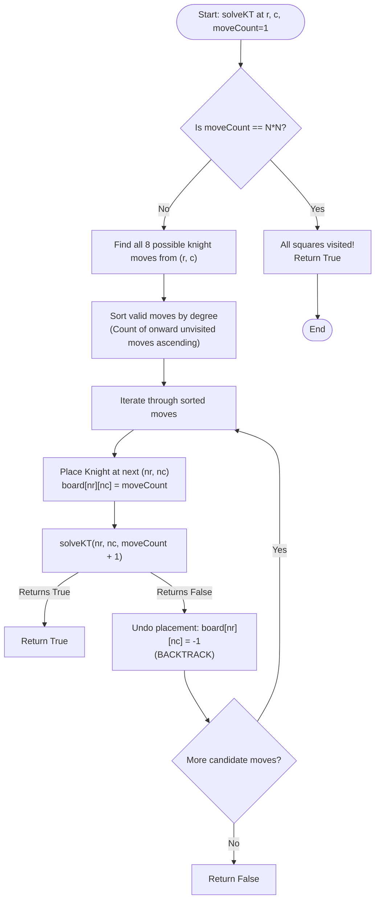

# Knight's Tour (Backtracking & Warnsdorff's Heuristic)

## 1. Introduction

The **Knight's Tour** is a famous mathematical and algorithmic puzzle involving a chess knight on an $N \times N$ chessboard.

The goal is to find a sequence of moves for the knight such that it visits **every square on the board exactly once**.

A knight moves in an "L-shape": two squares horizontally and one square vertically, or two squares vertically and one square horizontally.

There are two main variants of the Knight's Tour:
1. **Open Tour:** The knight finishes on a square from which it **cannot** reach the starting square.
2. **Closed (Re-entrant) Tour:** The knight finishes on a square that is exactly one knight's move away from the starting square, forming a continuous closed loop.

---

## 2. Why Use This Algorithm?

### Brute-Force vs. Backtracking vs. Warnsdorff's Heuristic
For an $N \times N$ chessboard:
1. **Naïve Brute-Force Search ($8^{N^2}$):**
   A knight has up to 8 possible moves from any square. On an $8 \times 8$ board (64 cells), a basic depth-first search (DFS) without heuristics can explore up to $8^{64} \approx 6.27 \times 10^{57}$ states! ❌ *Takes years to compute for $N = 8$.*
2. **Backtracking with Warnsdorff's Rule (Greedy Heuristic):**
   **Warnsdorff's Heuristic** states: *Always move the knight to an unvisited square that has the FEWEST onward unvisited moves available.*
   Using Warnsdorff's rule reduces execution time from billions of years to **linear time ($O(N^2)$) in practice**, solving $8 \times 8$ or even $100 \times 100$ boards almost instantaneously!

---

## 3. Real-World Applications

- **Hamiltonian Path & Cycle Problems:** Direct real-world example of finding Hamiltonian paths in undirected graphs.
- **Printed Circuit Board (PCB) Drilling:** Optimizing the travel trajectory of automated drill bits to bore holes across chip substrates without crossing previously drilled points unnecessarily.
- **Graph Traversal & Heuristic Search:** Benchmarking greedy heuristics, backtrack pruning, and artificial intelligence search strategies.
- **Image Processing & Raster Scanning:** Custom pixel traversal patterns for steganography or spatial frequency sampling.

---

## 4. Prerequisites

Before learning the Knight's Tour, you should be comfortable with:
- **Recursion & Backtracking:** Exploring states, marking visits, recursing, and undoing choices.
- **2D Grid Operations:** Board indices $(0 \le r < N, 0 \le c < N)$.
- **Knight Move Vectors (8 Possible Offsets):**
  - `dr = [2, 1, -1, -2, -2, -1, 1, 2]`
  - `dc = [1, 2, 2, 1, -1, -2, -2, -1]`

---

## 5. Visualization

### Knight Move Pattern (8 Options from Center)

```
  .  1  .  2  .
  8  .  .  .  3
  .  .  K  .  .
  7  .  .  .  4
  .  6  .  5  .
```

### Mermaid Flowchart (Warnsdorff's Heuristic + Backtracking)



---

## 6. How It Works

1. **Board Representation:** Initialize an $N \times N$ matrix with `-1` (unvisited). Mark the starting square `board[startR][startC] = 0`.
2. **Move Generation:** From current cell $(r, c)$, calculate potential next cells $(nr, nc) = (r + dr[i], c + dc[i])$ for $i \in [0, 7]$.
3. **Warnsdorff's Degree Calculation (Heuristic):**
   - For each valid next cell $(nr, nc)$, count how many valid unvisited neighbors *it* can move to (its "degree").
   - Sort candidate cells in ascending order of degree (tie-breaking randomly or arbitrarily).
4. **Recursive Step:** Move to the candidate cell with the minimum degree first.
5. **Backtrack:** If a path leads to a dead-end before visiting all $N^2$ squares, unmark the square (`-1`) and backtrack to test the next candidate move.

---

## 7. Step-by-Step Algorithm

1. Input: Board size $N$, starting coordinates `(startR, startC)`.
2. Create 2D array `board` of size $N \times N$ initialized to `-1`.
3. Set `board[startR][startC] = 0`.
4. Define `solve(r, c, moveStep)`:
   - If `moveStep == N * N`: return `True`.
   - Collect all valid next moves $(nr, nc)$.
   - Sort these moves based on their onward move count (Warnsdorff's degree).
   - For each candidate $(nr, nc)$:
     - `board[nr][nc] = moveStep`
     - If `solve(nr, nc, moveStep + 1)` is `True`: return `True`
     - Backtrack: `board[nr][nc] = -1`
   - Return `False`.
5. If `solve(startR, startC, 1)` returns `True`, print the solution matrix `board`.

---

## 8. Pseudocode

```text
function solveKnightsTour(N, startR, startC):
    board = N x N array initialized with -1
    board[startR][startC] = 0
    
    if solveKT(startR, startC, 1, board, N) == true:
        print board
    else:
        print "No solution exists"

function solveKT(r, c, moveCount, board, N):
    if moveCount == N * N:
        return true
        
    candidates = []
    for i from 0 to 7:
        nextR = r + dr[i]
        nextC = c + dc[i]
        if isSafe(nextR, nextC, board, N):
            degree = countOnwardMoves(nextR, nextC, board, N)
            candidates.append((degree, nextR, nextC))
            
    // Warnsdorff's Rule: Sort by degree ascending
    sort candidates by degree ascending
    
    for each (deg, nr, nc) in candidates:
        board[nr][nc] = moveCount
        if solveKT(nr, nc, moveCount + 1, board, N) == true:
            return true
        board[nr][nc] = -1 // Backtrack
        
    return false

function countOnwardMoves(r, c, board, N):
    count = 0
    for i from 0 to 7:
        if isSafe(r + dr[i], c + dc[i], board, N):
            count++
    return count
```

---

## 9. Code Examples

### C
```c
#include <stdio.h>
#include <stdbool.h>

#define N 8

int dr[] = {2, 1, -1, -2, -2, -1, 1, 2};
int dc[] = {1, 2, 2, 1, -1, -2, -2, -1};

bool isSafe(int r, int c, int board[N][N]) {
    return (r >= 0 && r < N && c >= 0 && c < N && board[r][c] == -1);
}

int countOnwardMoves(int r, int c, int board[N][N]) {
    int count = 0;
    for (int i = 0; i < 8; i++) {
        if (isSafe(r + dr[i], c + dc[i], board)) {
            count++;
        }
    }
    return count;
}

bool solveKT(int r, int c, int moveCount, int board[N][N]) {
    if (moveCount == N * N) return true;

    int minDegree = 9;
    int bestMove = -1;

    // Warnsdorff's heuristic: find neighbor with minimum onward moves
    for (int i = 0; i < 8; i++) {
        int nr = r + dr[i];
        int nc = c + dc[i];
        if (isSafe(nr, nc, board)) {
            int degree = countOnwardMoves(nr, nc, board);
            if (degree < minDegree) {
                minDegree = degree;
                bestMove = i;
            }
        }
    }

    if (bestMove == -1) return false;

    int nr = r + dr[bestMove];
    int nc = c + dc[bestMove];
    board[nr][nc] = moveCount;

    if (solveKT(nr, nc, moveCount + 1, board)) return true;

    board[nr][nc] = -1; // Backtrack
    return false;
}

int main() {
    int board[N][N];
    for (int i = 0; i < N; i++)
        for (int j = 0; j < N; j++)
            board[i][j] = -1;

    int startR = 0, startC = 0;
    board[startR][startC] = 0;

    if (solveKT(startR, startC, 1, board)) {
        printf("Knight's Tour solution:\n");
        for (int r = 0; r < N; r++) {
            for (int c = 0; c < N; c++) {
                printf("%2d ", board[r][c]);
            }
            printf("\n");
        }
    } else {
        printf("No solution exists.\n");
    }
    return 0;
}
```

### C++
```cpp
#include <iostream>
#include <vector>
#include <algorithm>

using namespace std;

class KnightsTour {
private:
    int n;
    vector<int> dr = {2, 1, -1, -2, -2, -1, 1, 2};
    vector<int> dc = {1, 2, 2, 1, -1, -2, -2, -1};

    bool isSafe(int r, int c, const vector<vector<int>>& board) {
        return (r >= 0 && r < n && c >= 0 && c < n && board[r][c] == -1);
    }

    int getDegree(int r, int c, const vector<vector<int>>& board) {
        int count = 0;
        for (int i = 0; i < 8; i++) {
            if (isSafe(r + dr[i], c + dc[i], board)) count++;
        }
        return count;
    }

    struct CellMove {
        int degree;
        int r, c;
        bool operator<(const CellMove& other) const {
            return degree < other.degree;
        }
    };

public:
    KnightsTour(int size) : n(size) {}

    bool solve(int r, int c, int moveCount, vector<vector<int>>& board) {
        if (moveCount == n * n) return true;

        vector<CellMove> candidates;
        for (int i = 0; i < 8; i++) {
            int nr = r + dr[i];
            int nc = c + dc[i];
            if (isSafe(nr, nc, board)) {
                candidates.push_back({getDegree(nr, nc, board), nr, nc});
            }
        }

        sort(candidates.begin(), candidates.end());

        for (const auto& move : candidates) {
            board[move.r][move.c] = moveCount;
            if (solve(move.r, move.c, moveCount + 1, board)) return true;
            board[move.r][move.c] = -1; // Backtrack
        }

        return false;
    }
};

int main() {
    int n = 8;
    vector<vector<int>> board(n, vector<int>(n, -1));
    board[0][0] = 0;

    KnightsTour solver(n);
    if (solver.solve(0, 0, 1, board)) {
        cout << "Knight's Tour Solution:\n";
        for (int r = 0; r < n; r++) {
            for (int c = 0; c < n; c++) {
                printf("%2d ", board[r][c]);
            }
            cout << "\n";
        }
    } else {
        cout << "No solution exists.\n";
    }

    return 0;
}
```

### Java
```java
import java.util.ArrayList;
import java.util.Collections;
import java.util.List;

public class KnightsTour {

    private static final int N = 8;
    private static final int[] dr = {2, 1, -1, -2, -2, -1, 1, 2};
    private static final int[] dc = {1, 2, 2, 1, -1, -2, -2, -1};

    static class Candidate implements Comparable<Candidate> {
        int degree, r, c;

        Candidate(int degree, int r, int c) {
            this.degree = degree;
            this.r = r;
            this.c = c;
        }

        @Override
        public int compareTo(Candidate o) {
            return Integer.compare(this.degree, o.degree);
        }
    }

    private static boolean isSafe(int r, int c, int[][] board) {
        return (r >= 0 && r < N && c >= 0 && c < N && board[r][c] == -1);
    }

    private static int getDegree(int r, int c, int[][] board) {
        int count = 0;
        for (int i = 0; i < 8; i++) {
            if (isSafe(r + dr[i], c + dc[i], board)) count++;
        }
        return count;
    }

    public static boolean solveKT(int r, int c, int moveCount, int[][] board) {
        if (moveCount == N * N) return true;

        List<Candidate> candidates = new ArrayList<>();
        for (int i = 0; i < 8; i++) {
            int nr = r + dr[i];
            int nc = c + dc[i];
            if (isSafe(nr, nc, board)) {
                candidates.add(new Candidate(getDegree(nr, nc, board), nr, nc));
            }
        }

        Collections.sort(candidates);

        for (Candidate move : candidates) {
            board[move.r][move.c] = moveCount;
            if (solveKT(move.r, move.c, moveCount + 1, board)) return true;
            board[move.r][move.c] = -1; // Backtrack
        }

        return false;
    }

    public static void main(String[] args) {
        int[][] board = new int[N][N];
        for (int i = 0; i < N; i++)
            for (int j = 0; j < N; j++)
                board[i][j] = -1;

        board[0][0] = 0;

        if (solveKT(0, 0, 1, board)) {
            System.out.println("Knight's Tour Solution:");
            for (int r = 0; r < N; r++) {
                for (int c = 0; c < N; c++) {
                    System.out.printf("%2d ", board[r][c]);
                }
                System.out.println();
            }
        } else {
            System.out.println("No solution exists.");
        }
    }
}
```

### Python
```python
def solve_knights_tour(n=8, start_r=0, start_c=0):
    board = [[-1] * n for _ in range(n)]
    board[start_r][start_c] = 0

    dr = [2, 1, -1, -2, -2, -1, 1, 2]
    dc = [1, 2, 2, 1, -1, -2, -2, -1]

    def is_safe(r, c):
        return 0 <= r < n and 0 <= c < n and board[r][c] == -1

    def get_degree(r, c):
        count = 0
        for i in range(8):
            if is_safe(r + dr[i], c + dc[i]):
                count += 1
        return count

    def solve(r, c, move_count):
        if move_count == n * n:
            return True

        candidates = []
        for i in range(8):
            nr, nc = r + dr[i], c + dc[i]
            if is_safe(nr, nc):
                degree = get_degree(nr, nc)
                candidates.append((degree, nr, nc))

        # Warnsdorff's Heuristic: sort by onward move count ascending
        candidates.sort(key=lambda x: x[0])

        for _, nr, nc in candidates:
            board[nr][nc] = move_count
            if solve(nr, nc, move_count + 1):
                return True
            board[nr][nc] = -1  # Backtrack

        return False

    if solve(start_r, start_c, 1):
        print("Knight's Tour Solution:")
        for row in board:
            print(" ".join(f"{val:2d}" for val in row))
    else:
        print("No solution exists.")


if __name__ == "__main__":
    solve_knights_tour(8, 0, 0)
```

### JavaScript
```javascript
function solveKnightsTour(n = 8, startR = 0, startC = 0) {
    const board = Array.from({ length: n }, () => Array(n).fill(-1));
    board[startR][startC] = 0;

    const dr = [2, 1, -1, -2, -2, -1, 1, 2];
    const dc = [1, 2, 2, 1, -1, -2, -2, -1];

    function isSafe(r, c) {
        return r >= 0 && r < n && c >= 0 && c < n && board[r][c] === -1;
    }

    function getDegree(r, c) {
        let count = 0;
        for (let i = 0; i < 8; i++) {
            if (isSafe(r + dr[i], c + dc[i])) count++;
        }
        return count;
    }

    function solve(r, c, moveCount) {
        if (moveCount === n * n) return true;

        const candidates = [];
        for (let i = 0; i < 8; i++) {
            const nr = r + dr[i];
            const nc = c + dc[i];
            if (isSafe(nr, nc)) {
                candidates.push({ degree: getDegree(nr, nc), nr, nc });
            }
        }

        // Warnsdorff's Heuristic
        candidates.sort((a, b) => a.degree - b.degree);

        for (const move of candidates) {
            board[move.nr][move.nc] = moveCount;
            if (solve(move.nr, move.nc, moveCount + 1)) return true;
            board[move.nr][move.nc] = -1; // Backtrack
        }

        return false;
    }

    if (solve(startR, startC, 1)) {
        console.log("Knight's Tour Solution:");
        console.log(board.map(row => row.map(v => String(v).padStart(2, ' ')).join(" ")).join("\n"));
    } else {
        console.log("No solution exists.");
    }
}

solveKnightsTour(8, 0, 0);
```

---

## 10. Code Explanation

- **Warnsdorff's Heuristic Sorting:** Candidates are prioritized based on lowest degree (fewest available moves remaining). This keeps the knight along the boundaries/corners of the board, preventing central squares from becoming isolated dead ends early on.
- **Eight Direction Vectors:** Array offsets `dr` and `dc` cleanly model all L-shaped jumps.
- **In-Place Board State:** Single `board` matrix tracks visited sequence numbers ($0$ to $N^2 - 1$), avoiding redundant memory allocation.
- **Backtracking Unmark:** Resetting `board[nr][nc] = -1` allows retrying when a path fails to cover all $N^2$ squares.

---

## 11. Interactive Demo

Imagine a visual chessboard UI:
1. **Interactive Chessboard:** An $8 \times 8$ chessboard where clicking any square sets the starting knight position.
2. **Warnsdorff Degree Overlay:** Hovering cells displays numbers $1-8$ representing available onward moves.
3. **Execution Control:** Sliders to control step speed and toggles for enabling/disabling Warnsdorff's Heuristic to compare plain DFS (slow) vs Warnsdorff (instant).

---

## 12. Dry Run

Tracing initial moves on an $8 \times 8$ board starting at $(0, 0)$:

| Step | Current (r, c) | Candidate Moves | Warnsdorff Degrees | Chosen Move | Step Number Marked |
|------|----------------|-----------------|--------------------|-------------|--------------------|
| 0 | (0, 0) | (1, 2), (2, 1) | deg(1,2)=5, deg(2,1)=5 | (1, 2) (or (2,1)) | `board[0][0] = 0` |
| 1 | (1, 2) | (0,4), (2,4), (3,3), (3,1), (2,0) | deg(2,0)=3, deg(0,4)=4... | (2, 0) (Min deg=3) | `board[2][0] = 1` |
| 2 | (2, 0) | (0,1), (1,2-visited), (3,2), (4,1) | deg(0,1)=2, deg(4,1)=5... | (0, 1) (Min deg=2) | `board[0][1] = 2` |

---

## 13. Time & Space Complexity

| Case | Time Complexity | Space Complexity | Reason |
|------|-----------------|------------------|--------|
| Plain Backtracking Worst Case | $O(8^{N^2})$ | $O(N^2)$ | Without heuristics, explores exponential call tree up to depth $N^2$. |
| With Warnsdorff's Heuristic | $O(N^2)$ average | $O(N^2)$ | Greedily chooses optimal moves; runs almost in linear time proportional to board cells. |
| Space Complexity | $O(N^2)$ | $O(N^2)$ | $N \times N$ matrix + recursion stack depth $N^2$. |

---

## 14. Advantages

- **Warnsdorff Speedup:** Reduces an intractable $O(8^{N^2})$ problem into near $O(N^2)$ runtime.
- **Complete Exploration:** If Warnsdorff fails on rare edge cases, backtracking guarantees finding a solution.

---

## 15. Disadvantages

- **Warnsdorff Impasse:** On large boards (e.g., $N > 70$), standard Warnsdorff can occasionally hit a dead end, requiring tie-breaking heuristics (e.g., Squirrel-Cull method).
- **Small Board Exceptions:** No solution exists for odd $N < 5$ or $N = 2, 4$.

---

## 16. Applications

- Graph Hamiltonian paths.
- Robotic arms navigating obstacle spaces.
- Benchmark testing for search heuristics.

---

## 17. Common Mistakes

- **Invalid Board Sizes:** Trying $N = 2, 3, 4$ where no tour exists.
- **Forgetting Warnsdorff Heuristic:** Using plain DFS which hangs indefinitely on $N=8$.
- **Off-by-One Array Offsets:** Misconfiguring knight direction offset arrays.

---

## 18. Interview Questions

1. What is Schwenk's Theorem regarding the existence of Knight's Tours on $M \times N$ boards?
2. Why does Warnsdorff's Heuristic work so effectively?
3. What is the difference between an Open Tour and a Closed Tour?
4. How do you check if a completed Open Tour is actually a Closed Tour?
5. How would you represent the Knight's Tour problem as a Graph theory problem?

---

## 19. Practice Problems

1. **LeetCode 1197:** Minimum Knight Moves (BFS approach)
2. **GFG:** The Knight's Tour Problem
3. **Hamiltonian Path:** Find Hamiltonian path in general graphs.

---

## 20. Related Algorithms

- **N-Queens Problem:** Backtracking placement on chessboards.
- **Hamiltonian Path / Cycle:** Visiting every graph vertex once.
- **Traveling Salesperson Problem (TSP):** Visiting all nodes with minimum total edge weight.

---

## 21. Summary

The Knight's Tour puzzle demonstrates how greedy heuristics (Warnsdorff's Rule) combined with backtracking turn an otherwise exponentially slow problem into an efficient $O(N^2)$ algorithm.

---

## 22. Quiz

**Question 1:** What does Warnsdorff's Heuristic state?
- A) Always choose the move closest to the center of the board.
- B) Always move to the neighbor square with the fewest onward unvisited moves.
- C) Always move in a clockwise direction.
- D) Always choose the move closest to the starting position.
- **Correct Answer:** B
- **Explanation:** Warnsdorff's rule prioritizes squares with minimum degree to prevent isolating corner/edge squares.

**Question 2:** For which board size does NO Knight's Tour exist?
- A) $5 \times 5$
- B) $6 \times 6$
- C) $4 \times 4$
- D) $8 \times 8$
- **Correct Answer:** C
- **Explanation:** According to Schwenk's Theorem, no Knight's Tour exists on a $4 \times 4$ board.

**Question 3:** How many maximum possible moves can a knight make from a single cell?
- A) 4
- B) 6
- C) 8
- D) 12
- **Correct Answer:** C
- **Explanation:** A knight has up to 8 L-shaped moves on an open grid.
