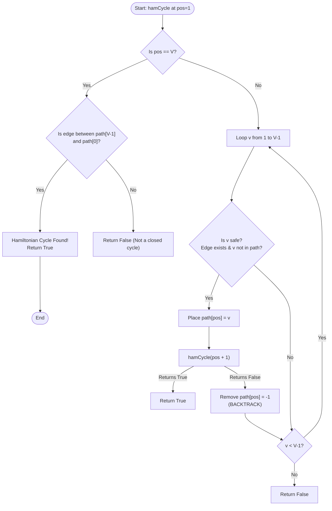

# Hamiltonian Cycle (Backtracking & Graph Theory)

## 1. Introduction

A **Hamiltonian Path** in an undirected graph is a path that visits **every vertex exactly once**.

A **Hamiltonian Cycle** (or Hamiltonian Circuit) is a Hamiltonian Path that is a **closed loop**—meaning there is an edge connecting the last visited vertex back to the first vertex.

The **Hamiltonian Cycle Problem** is a famous decision problem in computer science and graph theory: *Given a graph $G = (V, E)$, determine whether a Hamiltonian Cycle exists, and if so, return the vertex sequence.*

It is one of Karp's 21 **NP-complete** problems, making it fundamental to complexity theory.

---

## 2. Why Use This Algorithm?

### Brute-Force Permutations vs. Backtracking
For a graph with $V$ vertices:
1. **Naïve Permutation Search ($V!$):**
   Generating all possible permutations of $V$ vertices and checking if adjacent pairs (and the end-to-start pair) share an edge requires testing $V!$ sequences. For $V = 20$, $20! \approx 2.43 \times 10^{18}$ sequences! ❌ *Extremely slow.*
2. **Backtracking Search ($O(V!)$ worst-case, pruned average):**
   By constructing the path vertex-by-vertex and verifying edge connectivity and unvisited status **at each step**, backtracking prunes dead ends early. If vertex $u$ is not connected to vertex $v$, we don't explore any of the $(V - k)!$ paths starting with $(..., u, v)$.

---

## 3. Real-World Applications

- **Traveling Salesperson Problem (TSP):** Hamiltonian cycle forms the structural foundation of TSP (finding the shortest Hamiltonian cycle on a weighted graph).
- **DNA Sequencing & Genome Assembly:** Overlap graphs in fragment assembly where reconstruction corresponds to finding Hamiltonian paths across sequence reads.
- **Printed Circuit Board (PCB) & Robot Toolpathing:** Finding efficient physical routes for laser cutters or automated arms visiting all target soldering pads and returning to base.
- **Computer Network Topologies:** Designing fault-tolerant ring networks where data can circulate across all nodes sequentially.

---

## 4. Prerequisites

Before learning Hamiltonian Cycle, you should be comfortable with:
- **Recursion & Backtracking:** Exploring decision trees, maintaining state arrays, and undoing choices.
- **Graph Representations:** Adjacency matrix `graph[u][v] == 1` or Adjacency lists.
- **Eulerian vs. Hamiltonian Graph Differences:**
  - **Eulerian Circuit:** Visits every *edge* exactly once ($O(V + E)$ solvable).
  - **Hamiltonian Circuit:** Visits every *vertex* exactly once (NP-complete).

---

## 5. Visualization

### Sample Graph with Hamiltonian Cycle

```
Graph:
 (0) ------ (1)
  |  \    /  |
  |   \  /   |
  |    (2)   |
  |   /  \   |
  |  /    \  |
 (3) ------ (4)

Hamiltonian Cycle Path: 0 -> 1 -> 2 -> 4 -> 3 -> 0
```

### Mermaid Flowchart



---

## 6. How It Works

1. **Fix Starting Vertex:** Without loss of generality, fix `path[0] = 0` (since a cycle can start at any vertex).
2. **Recursive Placement (`pos` from 1 to $V-1$):**
   - For `pos` index in the path array, iterate through candidate vertices $v \in [1, V-1]$.
3. **Safety Verification (`isSafe`):**
   - **Edge Check:** Is there an edge between `path[pos - 1]` and candidate vertex $v$? (`graph[path[pos - 1]][v] == 1`).
   - **Unvisited Check:** Has vertex $v$ already been included in `path[0 ... pos-1]`?
4. **Recurse & Backtrack:**
   - If safe, assign `path[pos] = v` and recurse to `pos + 1`.
   - If call returns `False`, undo `path[pos] = -1` and try the next vertex $v$.
5. **Cycle Closure (Base Case):** When `pos == V`, check if an edge exists between `path[V - 1]` and `path[0]`. If yes, return `True`; otherwise, return `False`.

---

## 7. Step-by-Step Algorithm

1. Input: Adjacency matrix `graph` of size $V \times V$.
2. Create array `path` of size $V$ filled with `-1`.
3. Set `path[0] = 0`.
4. Call helper `solveHamCycle(path, pos=1)`:
   - If `pos == V`:
     - If `graph[path[V-1]][path[0]] == 1`, return `True`.
     - Else, return `False`.
   - For vertex `v` from 1 to $V-1$:
     - Check if `isSafe(v, graph, path, pos)` is `True`.
     - If safe:
       - Set `path[pos] = v`.
       - If `solveHamCycle(path, pos + 1)` returns `True`, return `True`.
       - Reset `path[pos] = -1` (Backtrack).
   - Return `False`.
5. If result is `True`, print `path` array (appending `path[0]` at the end to show cycle).

---

## 8. Pseudocode

```text
function findHamiltonianCycle(graph, V):
    path = array of size V initialized to -1
    path[0] = 0 // Start at vertex 0
    
    if solveHamCycle(graph, path, 1, V) == true:
        print path + [path[0]] // Show complete cycle
        return true
    else:
        print "No Hamiltonian Cycle exists"
        return false

function solveHamCycle(graph, path, pos, V):
    if pos == V:
        // Check if last vertex connects back to start vertex
        if graph[path[pos - 1]][path[0]] == 1:
            return true
        else:
            return false
            
    for v from 1 to V - 1:
        if isSafe(v, graph, path, pos):
            path[pos] = v
            if solveHamCycle(graph, path, pos + 1, V) == true:
                return true
            path[pos] = -1 // Backtrack
            
    return false

function isSafe(v, graph, path, pos):
    // Check if edge exists between previous vertex and v
    if graph[path[pos - 1]][v] == 0:
        return false
        
    // Check if vertex v is already in path
    for i from 0 to pos - 1:
        if path[i] == v:
            return false
            
    return true
```

---

## 9. Code Examples

### C
```c
#include <stdio.h>
#include <stdbool.h>

#define V 5

bool isSafe(int v, bool graph[V][V], int path[], int pos) {
    // Check if edge exists
    if (!graph[path[pos - 1]][v]) return false;

    // Check if already visited
    for (int i = 0; i < pos; i++) {
        if (path[i] == v) return false;
    }
    return true;
}

bool solveHamCycle(bool graph[V][V], int path[], int pos) {
    if (pos == V) {
        // Check if edge exists from last to first vertex
        return graph[path[pos - 1]][path[0]];
    }

    for (int v = 1; v < V; v++) {
        if (isSafe(v, graph, path, pos)) {
            path[pos] = v;
            if (solveHamCycle(graph, path, pos + 1)) return true;
            path[pos] = -1; // Backtrack
        }
    }
    return false;
}

int main() {
    bool graph[V][V] = {
        {0, 1, 1, 1, 0},
        {1, 0, 1, 0, 1},
        {1, 1, 0, 1, 1},
        {1, 0, 1, 0, 1},
        {0, 1, 1, 1, 0}
    };

    int path[V];
    for (int i = 0; i < V; i++) path[i] = -1;
    path[0] = 0;

    if (solveHamCycle(graph, path, 1)) {
        printf("Hamiltonian Cycle found:\n");
        for (int i = 0; i < V; i++) {
            printf("%d -> ", path[i]);
        }
        printf("%d\n", path[0]);
    } else {
        printf("No Hamiltonian Cycle exists.\n");
    }

    return 0;
}
```

### C++
```cpp
#include <iostream>
#include <vector>

using namespace std;

class HamiltonianCycle {
private:
    int vCount;

    bool isSafe(int v, const vector<vector<int>>& graph, const vector<int>& path, int pos) {
        if (graph[path[pos - 1]][v] == 0) return false;
        for (int i = 0; i < pos; i++) {
            if (path[i] == v) return false;
        }
        return true;
    }

    bool solve(const vector<vector<int>>& graph, vector<int>& path, int pos) {
        if (pos == vCount) {
            return graph[path[pos - 1]][path[0]] == 1;
        }

        for (int v = 1; v < vCount; v++) {
            if (isSafe(v, graph, path, pos)) {
                path[pos] = v;
                if (solve(graph, path, pos + 1)) return true;
                path[pos] = -1; // Backtrack
            }
        }
        return false;
    }

public:
    HamiltonianCycle(int vertices) : vCount(vertices) {}

    bool findCycle(const vector<vector<int>>& graph) {
        vector<int> path(vCount, -1);
        path[0] = 0;

        if (solve(graph, path, 1)) {
            cout << "Hamiltonian Cycle found:\n";
            for (int i = 0; i < vCount; i++) {
                cout << path[i] << " -> ";
            }
            cout << path[0] << "\n";
            return true;
        }

        cout << "No Hamiltonian Cycle exists.\n";
        return false;
    }
};

int main() {
    vector<vector<int>> graph = {
        {0, 1, 1, 1, 0},
        {1, 0, 1, 0, 1},
        {1, 1, 0, 1, 1},
        {1, 0, 1, 0, 1},
        {0, 1, 1, 1, 0}
    };

    HamiltonianCycle hc(5);
    hc.findCycle(graph);

    return 0;
}
```

### Java
```java
import java.util.Arrays;

public class HamiltonianCycle {

    private final int V;

    public HamiltonianCycle(int v) {
        this.V = v;
    }

    private boolean isSafe(int v, int[][] graph, int[] path, int pos) {
        if (graph[path[pos - 1]][v] == 0) return false;
        for (int i = 0; i < pos; i++) {
            if (path[i] == v) return false;
        }
        return true;
    }

    private boolean solve(int[][] graph, int[] path, int pos) {
        if (pos == V) {
            return graph[path[pos - 1]][path[0]] == 1;
        }

        for (int v = 1; v < V; v++) {
            if (isSafe(v, graph, path, pos)) {
                path[pos] = v;
                if (solve(graph, path, pos + 1)) return true;
                path[pos] = -1; // Backtrack
            }
        }
        return false;
    }

    public boolean findCycle(int[][] graph) {
        int[] path = new int[V];
        Arrays.fill(path, -1);
        path[0] = 0;

        if (solve(graph, path, 1)) {
            System.out.println("Hamiltonian Cycle found:");
            for (int i = 0; i < V; i++) {
                System.out.print(path[i] + " -> ");
            }
            System.out.println(path[0]);
            return true;
        }

        System.out.println("No Hamiltonian Cycle exists.");
        return false;
    }

    public static void main(String[] args) {
        int[][] graph = {
            {0, 1, 1, 1, 0},
            {1, 0, 1, 0, 1},
            {1, 1, 0, 1, 1},
            {1, 0, 1, 0, 1},
            {0, 1, 1, 1, 0}
        };

        HamiltonianCycle hc = new HamiltonianCycle(5);
        hc.findCycle(graph);
    }
}
```

### Python
```python
def solve_hamiltonian_cycle(graph):
    v = len(graph)
    path = [-1] * v
    path[0] = 0  # Fix start vertex to 0

    def is_safe(vertex, pos):
        # Edge exists from previous vertex in path
        if graph[path[pos - 1]][vertex] == 0:
            return False
        # Vertex not already in path
        if vertex in path[:pos]:
            return False
        return True

    def solve(pos):
        if pos == v:
            # Check edge connecting last to start vertex
            return graph[path[pos - 1]][path[0]] == 1

        for vertex in range(1, v):
            if is_safe(vertex, pos):
                path[pos] = vertex
                if solve(pos + 1):
                    return True
                path[pos] = -1  # Backtrack

        return False

    if solve(1):
        print("Hamiltonian Cycle found:")
        print(" -> ".join(map(str, path + [path[0]])))
        return True
    else:
        print("No Hamiltonian Cycle exists.")
        return False


if __name__ == "__main__":
    graph = [
        [0, 1, 1, 1, 0],
        [1, 0, 1, 0, 1],
        [1, 1, 0, 1, 1],
        [1, 0, 1, 0, 1],
        [0, 1, 1, 1, 0]
    ]

    solve_hamiltonian_cycle(graph)
```

### JavaScript
```javascript
function solveHamiltonianCycle(graph) {
    const v = graph.length;
    const path = Array(v).fill(-1);
    path[0] = 0;

    function isSafe(vertex, pos) {
        if (graph[path[pos - 1]][vertex] === 0) return false;
        for (let i = 0; i < pos; i++) {
            if (path[i] === vertex) return false;
        }
        return true;
    }

    function solve(pos) {
        if (pos === v) {
            return graph[path[pos - 1]][path[0]] === 1;
        }

        for (let vertex = 1; vertex < v; vertex++) {
            if (isSafe(vertex, pos)) {
                path[pos] = vertex;
                if (solve(pos + 1)) return true;
                path[pos] = -1; // Backtrack
            }
        }
        return false;
    }

    if (solve(1)) {
        console.log("Hamiltonian Cycle found:");
        console.log([...path, path[0]].join(" -> "));
        return true;
    } else {
        console.log("No Hamiltonian Cycle exists.");
        return false;
    }
}

const graph = [
    [0, 1, 1, 1, 0],
    [1, 0, 1, 0, 1],
    [1, 1, 0, 1, 1],
    [1, 0, 1, 0, 1],
    [0, 1, 1, 1, 0]
];

solveHamiltonianCycle(graph);
```

---

## 10. Code Explanation

- **Fixing Vertex 0:** Because any Hamiltonian Cycle must contain vertex 0, we set `path[0] = 0` to prevent finding the exact same cycle $V$ times starting from different vertices.
- **Safety Function `isSafe`:** Checks both graph connectivity (`graph[u][v] == 1`) and uniqueness (`v` not in `path`).
- **Base Case Closure:** At `pos == V`, checking `graph[path[V-1]][path[0]] == 1` distinguishes a valid **Hamiltonian Cycle** from a plain **Hamiltonian Path**.
- **Backtracking Undo:** `path[pos] = -1` unmarks the vertex slot if subsequent choices hit a dead end.

---

## 11. Interactive Demo

Imagine a visual graph interface:
1. **Interactive Canvas:** A node-and-edge graph diagram. Users can click to add vertices and draw edges.
2. **Step Controls:** Buttons for "Solve Step", "Auto Play", and "Speed Slider".
3. **Visual Feedback:**
   - Active vertex highlighted in blue.
   - Active path highlighted in thick green edges.
   - Invalid edge attempts highlight red briefly and backtrack.
   - When cycle completes, the closing loop edge flashes green.

---

## 12. Dry Run

Tracing the 5-vertex sample graph:

| Step | `pos` | Tried `v` | Connected to `path[pos-1]`? | Already in `path`? | Action | `path` Array |
|------|-------|-----------|-----------------------------|--------------------|--------|--------------|
| 0 | 0 | 0 | - | - | Start | `[0, -1, -1, -1, -1]` |
| 1 | 1 | 1 | Yes (0-1) | No | Recurse | `[0, 1, -1, -1, -1]` |
| 2 | 2 | 2 | Yes (1-2) | No | Recurse | `[0, 1, 2, -1, -1]` |
| 3 | 3 | 3 | Yes (2-3) | No | Recurse | `[0, 1, 2, 3, -1]` |
| 4 | 4 | 4 | Yes (3-4) | No | Recurse | `[0, 1, 2, 3, 4]` |
| 5 | 5 | Base Check | Edge (4-0)? No | - | Fail -> Backtrack pos 4 | `[0, 1, 2, 3, -1]` |
| 6 | 3 | 4 | Yes (2-4) | No | Recurse | `[0, 1, 2, 4, -1]` |
| 7 | 4 | 3 | Yes (4-3) | No | Recurse | `[0, 1, 2, 4, 3]` |
| 8 | 5 | Base Check | Edge (3-0)? Yes! | - | Found Cycle! | `[0, 1, 2, 4, 3, 0]` |

---

## 13. Time & Space Complexity

| Case | Time Complexity | Space Complexity | Reason |
|------|-----------------|------------------|--------|
| Worst Case | $O(V!)$ | $O(V)$ | In a complete graph $K_V$, attempts $V!$ permutations; stack depth $V$. |
| Average Case | Exponential | $O(V)$ | Early edge disconnects prune branches significantly. |
| Best Case | $O(V)$ | $O(V)$ | Direct cycle found on the first trial branch. |

---

## 14. Advantages

- **Guaranteed Correctness:** Finds a valid Hamiltonian cycle if one exists in the graph.
- **Minimal Auxiliary Space:** Requires only an $O(V)$ path array and recursion stack.

---

## 15. Disadvantages

- **NP-Complete Problem:** Scalability drops drastically for dense graphs with $V > 30$.
- **Not Scalable for Large Graphs:** Requires approximation algorithms or SAT solvers for real-world large-scale graphs.

---

## 16. Applications

- Traveling Salesperson Problem (TSP).
- Circuit trace design in electronics.
- Genome mapping in bioinformatics.

---

## 17. Common Mistakes

- **Not Checking Cycle Closure:** Forgetting to verify an edge from `path[V-1]` back to `path[0]` (finding a path instead of a cycle).
- **Redundant Start Vertices:** Iterating starting vertex across all nodes (generates duplicate cycles).
- **$O(V)$ Uniqueness Search:** Doing linear searches for visited status instead of maintaining a boolean `visited` array (optimization).

---

## 18. Interview Questions

1. What is the fundamental difference between an Eulerian Cycle and a Hamiltonian Cycle?
2. What is Dirac's Theorem regarding the existence of a Hamiltonian Cycle?
3. How can Dirac's Theorem or Ore's Theorem be used as an $O(V)$ pre-check?
4. How do you reduce the Hamiltonian Cycle problem to the Traveling Salesperson Problem (TSP)?
5. Why fixing `path[0] = 0` is valid without losing any potential solution?

---

## 19. Practice Problems

1. **LeetCode 980:** Unique Paths III (Grid Hamiltonian Path)
2. **GFG:** Hamiltonian Cycle
3. **Traveling Salesperson Problem:** Minimum weight Hamiltonian Cycle.

---

## 20. Related Algorithms

- **Knight's Tour:** Hamiltonian path on a knight's move graph.
- **Eulerian Path / Circuit:** Edges visited once ($O(V + E)$).
- **Traveling Salesperson Problem (TSP):** Weighted Hamiltonian cycle optimization.

---

## 21. Summary

The Hamiltonian Cycle problem is an NP-complete graph challenge. Backtracking prunes invalid vertex sequences by verifying edge connectivity and visit status at each step, building a valid closed loop visiting every vertex once.

---

## 22. Quiz

**Question 1:** What condition distinguishes a Hamiltonian Cycle from a Hamiltonian Path?
- A) A Hamiltonian cycle visits all edges, while a path visits all vertices.
- B) A Hamiltonian cycle has an edge connecting the last vertex back to the first vertex.
- C) A Hamiltonian cycle is solvable in $O(V + E)$ time.
- D) A Hamiltonian path must be a directed graph.
- **Correct Answer:** B
- **Explanation:** A Hamiltonian cycle is a closed Hamiltonian path where the end vertex connects back to the start.

**Question 2:** What is the time complexity to solve the Eulerian Circuit problem compared to Hamiltonian Cycle?
- A) Eulerian is $O(V + E)$ (P), Hamiltonian is NP-complete.
- B) Both are NP-complete.
- C) Eulerian is $O(V!)$, Hamiltonian is $O(V + E)$.
- D) Eulerian is NP-hard, Hamiltonian is P.
- **Correct Answer:** A
- **Explanation:** Finding an Eulerian circuit (visiting all edges once) takes linear time $O(V + E)$, whereas finding a Hamiltonian cycle (visiting all vertices once) is NP-complete.

**Question 3:** What does Dirac's Theorem state regarding Hamiltonian Cycles?
- A) If every vertex has degree $\ge V/2$, the graph contains a Hamiltonian Cycle.
- B) If the graph is connected, it has a Hamiltonian Cycle.
- C) If the sum of all degrees equals $2E$, it has a Hamiltonian Cycle.
- D) If $V$ is even, a Hamiltonian cycle always exists.
- **Correct Answer:** A
- **Explanation:** Dirac's Theorem guarantees a Hamiltonian Cycle in any simple graph with $V \ge 3$ vertices if every vertex has a degree of at least $V/2$.
