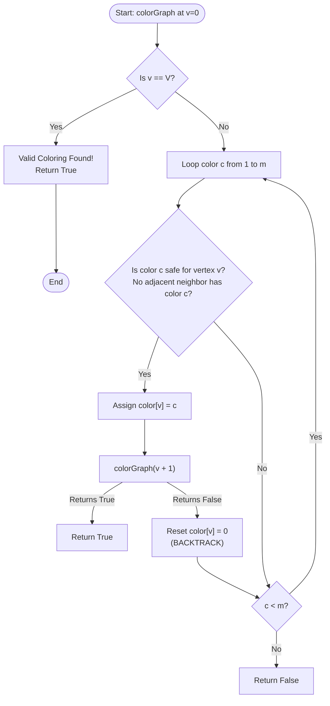

# Graph Coloring (m-Coloring Decision & Backtracking)

## 1. Introduction

**Graph Coloring** is a fundamental problem in graph theory and computer science.

The **$m$-Coloring Decision Problem** asks: *Given an undirected graph $G = (V, E)$ and an integer $m$, can we assign one of $m$ available colors to each vertex such that no two adjacent vertices share the same color?*

The minimum number of colors needed to color a graph $G$ is called its **Chromatic Number**, denoted $\chi(G)$.

Determining if a general graph can be colored with $m$ colors for $m \ge 3$ is a classic **NP-complete** problem.

---

## 2. Why Use This Algorithm?

### Brute-Force vs. Backtracking Exploration Space
For a graph with $V$ vertices and $m$ colors:
1. **Naïve Brute-Force ($m^V$):**
   Assigning every color combination to all vertices yields $m^V$ states. For $V = 20, m = 4$, $4^{20} \approx 1.09 \times 10^{12}$ evaluations! ❌ *Impractical.*
2. **Backtracking Search ($O(m^V)$ worst-case, heavily pruned average):**
   Vertices are colored sequentially from vertex $0$ to $V-1$. Before assigning color $c$ to vertex $v$, we check if any neighbor of $v$ already has color $c$. If an adjacency conflict occurs, that color choice is immediately discarded, avoiding exploration of $m^{V - v - 1}$ invalid subtrees.

---

## 3. Real-World Applications

- **Compiler Register Allocation:** Chaitin's algorithm models CPU register allocation as graph coloring, where variables are vertices and interference edges link overlapping variable lifetimes.
- **Exam & Class Timetabling:** Scheduling courses into $m$ exam slots such that students taking overlapping courses do not have exams at the same time.
- **Frequency Assignment in Cellular Networks:** Assigning $m$ frequency bands to cell towers such that nearby towers do not interfere.
- **Sudoku Solving:** Sudoku is a graph coloring problem on a 81-vertex graph with $m = 9$ colors and 810 constraint edges.
- **Map Coloring:** Coloring countries on a geographical map using at most 4 colors (Four Color Theorem).

---

## 4. Prerequisites

Before learning Graph Coloring, you should be comfortable with:
- **Recursion & Backtracking:** Recursive DFS traversal, condition checks, and state unmarking.
- **Graph Representations:** Adjacency matrix `graph[u][v] == 1` or adjacency list.
- **Chromatic Number Concept:** Knowing that 2-colorable graphs are Bipartite graphs ($O(V + E)$ via BFS/DFS).

---

## 5. Visualization

### Sample $m=3$ Coloring on a 4-Vertex Graph

```
Graph Edges: (0-1), (0-2), (1-2), (1-3), (2-3)
Available Colors: [1: Red, 2: Green, 3: Blue]

Colored Graph:
 (0: Red) ------- (1: Green)
    |   \         /    |
    |    \       /     |
    |     \     /      |
    |      (2: Blue)   |
    |           \      |
    +------------\-----(3: Red)
```

### Mermaid Flowchart



---

## 6. How It Works

1. **Initialize State:** Create array `color` of size $V$ filled with `0` (uncolored).
2. **Recursive Function `solve(v)`:**
   - Base Case: If `v == V`, all vertices are successfully colored. Return `True`.
3. **Try All Colors ($1$ to $m$):**
   - For vertex `v`, try each color `c` from $1$ to $m$.
   - **Safety Check `isSafe(v, c)`:** Loop over all neighbors $i$ of $v$. If `graph[v][i] == 1` and `color[i] == c`, color $c$ is invalid.
4. **Recurse & Backtrack:**
   - If safe, set `color[v] = c` and recurse `solve(v + 1)`.
   - If call returns `False`, backtrack by setting `color[v] = 0`.
5. **Return Result:** If no color works for vertex `v`, return `False`.

---

## 7. Step-by-Step Algorithm

1. Input: Adjacency matrix `graph` of size $V \times V$, integer $m$.
2. Create array `color` of size $V$ initialized to 0.
3. Call `graphColoringUtil(graph, m, color, v=0)`:
   - If `v == V`, return `True`.
   - For `c = 1` to `m`:
     - If `isSafe(v, graph, color, c)` is `True`:
       - `color[v] = c`
       - If `graphColoringUtil(graph, m, color, v + 1)` is `True`: return `True`
       - `color[v] = 0` (Backtrack)
   - Return `False`.
4. If result is `True`, print `color` array.

---

## 8. Pseudocode

```text
function graphColoring(graph, m, V):
    color = array of size V initialized to 0
    
    if solveColoring(graph, m, color, 0, V) == true:
        print color
        return true
    else:
        print "No solution exists with " + m + " colors"
        return false

function solveColoring(graph, m, color, v, V):
    if v == V:
        return true
        
    for c from 1 to m:
        if isSafe(v, graph, color, c, V):
            color[v] = c
            if solveColoring(graph, m, color, v + 1, V) == true:
                return true
            color[v] = 0 // Backtrack
            
    return false

function isSafe(v, graph, color, c, V):
    for i from 0 to V - 1:
        if graph[v][i] == 1 and color[i] == c:
            return false
    return true
```

---

## 9. Code Examples

### C
```c
#include <stdio.h>
#include <stdbool.h>

#define V 4

bool isSafe(int v, bool graph[V][V], int color[], int c) {
    for (int i = 0; i < V; i++) {
        if (graph[v][i] && color[i] == c) return false;
    }
    return true;
}

bool graphColoringUtil(bool graph[V][V], int m, int color[], int v) {
    if (v == V) return true;

    for (int c = 1; c <= m; c++) {
        if (isSafe(v, graph, color, c)) {
            color[v] = c;
            if (graphColoringUtil(graph, m, color, v + 1)) return true;
            color[v] = 0; // Backtrack
        }
    }
    return false;
}

int main() {
    bool graph[V][V] = {
        {0, 1, 1, 1},
        {1, 0, 1, 0},
        {1, 1, 0, 1},
        {1, 0, 1, 0}
    };
    int m = 3; // Number of colors
    int color[V] = {0};

    if (graphColoringUtil(graph, m, color, 0)) {
        printf("Graph coloring possible:\n");
        for (int i = 0; i < V; i++) {
            printf("Vertex %d -> Color %d\n", i, color[i]);
        }
    } else {
        printf("Solution does not exist.\n");
    }
    return 0;
}
```

### C++
```cpp
#include <iostream>
#include <vector>

using namespace std;

class GraphColoring {
private:
    int vCount;

    bool isSafe(int v, const vector<vector<int>>& graph, const vector<int>& color, int c) {
        for (int i = 0; i < vCount; i++) {
            if (graph[v][i] && color[i] == c) return false;
        }
        return true;
    }

    bool solve(const vector<vector<int>>& graph, int m, vector<int>& color, int v) {
        if (v == vCount) return true;

        for (int c = 1; c <= m; c++) {
            if (isSafe(v, graph, color, c)) {
                color[v] = c;
                if (solve(graph, m, color, v + 1)) return true;
                color[v] = 0; // Backtrack
            }
        }
        return false;
    }

public:
    GraphColoring(int vertices) : vCount(vertices) {}

    bool colorGraph(const vector<vector<int>>& graph, int m) {
        vector<int> color(vCount, 0);
        if (solve(graph, m, color, 0)) {
            cout << "Graph coloring solution:\n";
            for (int i = 0; i < vCount; i++) {
                cout << "Vertex " << i << " -> Color " << color[i] << "\n";
            }
            return true;
        }
        cout << "No solution exists with " << m << " colors.\n";
        return false;
    }
};

int main() {
    vector<vector<int>> graph = {
        {0, 1, 1, 1},
        {1, 0, 1, 0},
        {1, 1, 0, 1},
        {1, 0, 1, 0}
    };
    int m = 3;

    GraphColoring gc(4);
    gc.colorGraph(graph, m);

    return 0;
}
```

### Java
```java
import java.util.Arrays;

public class GraphColoring {

    private final int V;

    public GraphColoring(int v) {
        this.V = v;
    }

    private boolean isSafe(int v, int[][] graph, int[] color, int c) {
        for (int i = 0; i < V; i++) {
            if (graph[v][i] == 1 && color[i] == c) return false;
        }
        return true;
    }

    private boolean solve(int[][] graph, int m, int[] color, int v) {
        if (v == V) return true;

        for (int c = 1; c <= m; c++) {
            if (isSafe(v, graph, color, c)) {
                color[v] = c;
                if (solve(graph, m, color, v + 1)) return true;
                color[v] = 0; // Backtrack
            }
        }
        return false;
    }

    public boolean colorGraph(int[][] graph, int m) {
        int[] color = new int[V];
        Arrays.fill(color, 0);

        if (solve(graph, m, color, 0)) {
            System.out.println("Graph coloring solution:");
            for (int i = 0; i < V; i++) {
                System.out.println("Vertex " + i + " -> Color " + color[i]);
            }
            return true;
        }
        System.out.println("No solution exists with " + m + " colors.");
        return false;
    }

    public static void main(String[] args) {
        int[][] graph = {
            {0, 1, 1, 1},
            {1, 0, 1, 0},
            {1, 1, 0, 1},
            {1, 0, 1, 0}
        };
        int m = 3;

        GraphColoring gc = new GraphColoring(4);
        gc.colorGraph(graph, m);
    }
}
```

### Python
```python
def graph_coloring(graph, m):
    v = len(graph)
    color = [0] * v

    def is_safe(vertex, c):
        for i in range(v):
            if graph[vertex][i] == 1 and color[i] == c:
                return False
        return True

    def solve(vertex):
        if vertex == v:
            return True

        for c in range(1, m + 1):
            if is_safe(vertex, c):
                color[vertex] = c
                if solve(vertex + 1):
                    return True
                color[vertex] = 0  # Backtrack

        return False

    if solve(0):
        print("Graph coloring solution:")
        for idx, col in enumerate(color):
            print(f"Vertex {idx} -> Color {col}")
        return True
    else:
        print(f"No solution exists with {m} colors.")
        return False


if __name__ == "__main__":
    graph = [
        [0, 1, 1, 1],
        [1, 0, 1, 0],
        [1, 1, 0, 1],
        [1, 0, 1, 0]
    ]
    m = 3
    graph_coloring(graph, m)
```

### JavaScript
```javascript
function graphColoring(graph, m) {
    const v = graph.length;
    const color = Array(v).fill(0);

    function isSafe(vertex, c) {
        for (let i = 0; i < v; i++) {
            if (graph[vertex][i] === 1 && color[i] === c) return false;
        }
        return true;
    }

    function solve(vertex) {
        if (vertex === v) return true;

        for (let c = 1; c <= m; c++) {
            if (isSafe(vertex, c)) {
                color[vertex] = c;
                if (solve(vertex + 1)) return true;
                color[vertex] = 0; // Backtrack
            }
        }
        return false;
    }

    if (solve(0)) {
        console.log("Graph coloring solution:");
        color.forEach((col, idx) => console.log(`Vertex ${idx} -> Color ${col}`));
        return true;
    } else {
        console.log(`No solution exists with ${m} colors.`);
        return false;
    }
}

const graph = [
    [0, 1, 1, 1],
    [1, 0, 1, 0],
    [1, 1, 0, 1],
    [1, 0, 1, 0]
];
const m = 3;

graphColoring(graph, m);
```

---

## 10. Code Explanation

- **Color Array:** `color[i]` stores the assigned color number ($1$ to $m$) for vertex $i$. `0` represents uncolored.
- **Safety Function `isSafe`:** Scans through all vertices $i$. If an edge exists (`graph[v][i] == 1`) and vertex $i$ already has color `c`, `c` is invalid.
- **State Backtracking:** If downstream assignment fails, `color[v] = 0` clears the color before trying the next candidate.

---

## 11. Interactive Demo

Imagine a web UI visualizing graph coloring:
1. **Interactive Graph Canvas:** Users draw vertices and edges, then enter number of available colors $m$.
2. **Color Palette Display:** Legend mapping color numbers $1, 2, 3...$ to distinct visual colors (Red, Green, Blue...).
3. **Step Animation:**
   - Active vertex pulses yellow.
   - Candidate color tried; adjacent edges glow red if there is a conflict.
   - Successful colors lock in green, advancing to next vertex.

---

## 12. Dry Run

Tracing $m=3$ on the 4-vertex graph:

| Step | Vertex `v` | Candidate Color `c` | Conflict Check | Result / Action | `color` Array |
|------|------------|---------------------|----------------|-----------------|---------------|
| 1 | 0 | 1 (Red) | Neighbors uncolored | Valid -> `color[0]=1` | `[1, 0, 0, 0]` |
| 2 | 1 | 1 (Red) | Neighbor 0 has color 1 | Conflict | `[1, 0, 0, 0]` |
| 3 | 1 | 2 (Green) | No conflict | Valid -> `color[1]=2` | `[1, 2, 0, 0]` |
| 4 | 2 | 1 (Red) | Neighbor 0 has color 1 | Conflict | `[1, 2, 0, 0]` |
| 5 | 2 | 2 (Green) | Neighbor 1 has color 2 | Conflict | `[1, 2, 0, 0]` |
| 6 | 2 | 3 (Blue) | No conflict | Valid -> `color[2]=3` | `[1, 2, 3, 0]` |
| 7 | 3 | 1 (Red) | Neighbors 1,2 have 2,3 | Valid -> `color[3]=1` | `[1, 2, 3, 1]` |
| 8 | 4 | Base Case `v==4` | All colored! | Return `True` | `[1, 2, 3, 1]` |

---

## 13. Time & Space Complexity

| Case | Time Complexity | Space Complexity | Reason |
|------|-----------------|------------------|--------|
| Worst Case | $O(m^V)$ | $O(V)$ | In complete graphs $K_V$, attempts $m^V$ combinations; stack depth $V$. |
| Average Case | Exponential | $O(V)$ | Constraint checking prunes invalid subtrees early. |
| Best Case | $O(V)$ | $O(V)$ | Valid coloring found on the first candidate branch. |

---

## 14. Advantages

- **Guaranteed Correctness:** Finds a valid $m$-coloring if one exists.
- **In-Place Mutation:** Solves using only an $O(V)$ color array.

---

## 15. Disadvantages

- **NP-Complete Problem:** Exponential growth for large graphs ($V > 50$). Greedy heuristic approximations (Welsh-Powell, DSatur) are used in real systems.

---

## 16. Applications

- Compiler register allocation.
- Timetable/exam scheduling.
- Cell tower frequency assignment.
- Sudoku solvers & Map coloring.

---

## 17. Common Mistakes

- **1-Based vs 0-Based Indexing:** Confusing color index bounds ($1 \dots m$ vs $0 \dots m-1$).
- **Forgetting to Reset Color:** Omitting `color[v] = 0` on backtrack.

---

## 18. Interview Questions

1. What is the Four Color Theorem?
2. How does 2-colorability relate to Bipartite graphs, and what is its time complexity?
3. How does Chaitin's algorithm use Graph Coloring for register allocation?
4. What is the Welsh-Powell greedy graph coloring heuristic?
5. How can Sudoku be framed as a Graph Coloring problem?

---

## 19. Practice Problems

1. **LeetCode 785:** Is Graph Bipartite? (2-Coloring via BFS/DFS)
2. **GFG:** m-Coloring Problem
3. **LeetCode 886:** Possible Bipartition

---

## 20. Related Algorithms

- **Bipartite Matching / 2-Coloring:** Linear time $O(V + E)$ graph coloring.
- **Welsh-Powell Algorithm:** Greedy $O(V^2)$ graph coloring heuristic based on vertex degrees.
- **Sudoku Solver:** Grid-based 9-coloring constraint satisfaction problem.

---

## 21. Summary

Graph Coloring determines if $V$ vertices can be colored using at most $m$ colors without adjacent conflicts. Backtracking tests color choices sequentially and prunes invalid conflicts early.

---

## 22. Quiz

**Question 1:** What is the time complexity of checking if a graph is 2-colorable (Bipartite)?
- A) $O(2^V)$
- B) $O(V!)$
- C) $O(V + E)$
- D) $O(V^2)$
- **Correct Answer:** C
- **Explanation:** 2-colorability is equivalent to testing if a graph is Bipartite, which can be solved in linear time $O(V + E)$ using BFS or DFS.

**Question 2:** According to the Four Color Theorem, how many colors are needed to color any planar map?
- A) At most 3
- B) At most 4
- C) At most 5
- D) Depends on number of regions
- **Correct Answer:** B
- **Explanation:** The Four Color Theorem guarantees that any planar graph (map) can be colored using at most 4 colors.

**Question 3:** In compiler design, what do the vertices represent in a register allocation graph?
- A) Hardware registers
- B) CPU instructions
- C) Variables / Temporaries
- D) Functions
- **Correct Answer:** C
- **Explanation:** Vertices represent variables, and edges connect variables that are active simultaneously (interference).
