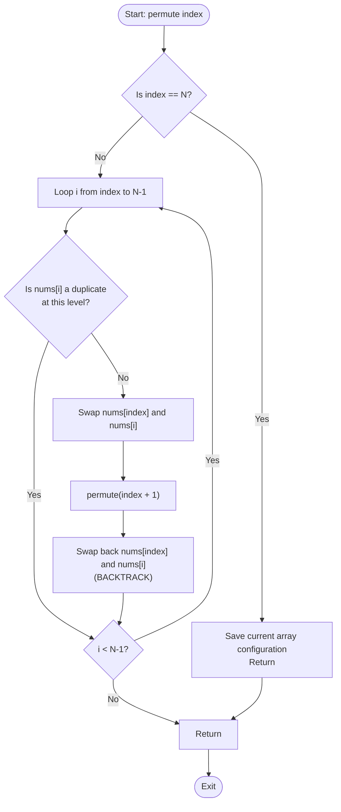

# Permutation Generation (Backtracking, In-Place Swapping & Heap's Algorithm)

## 1. Introduction

**Permutation Generation** is the process of computing all possible ordered arrangements of a set of elements.

For an array of $N$ distinct items, there are exactly $N!$ (N-factorial) unique permutations.

Generating permutations is a foundational technique in backtracking, brute-force state exploration, combinatorial optimization, and automated testing.

---

## 2. Why Use This Algorithm?

### In-Place Swapping vs. Extra Memory Tracking
1. **Used Array / Frequency Hash Tracking ($O(N)$ Space per Frame):**
   Using a boolean `used` array to build permutations element-by-element creates candidate arrays at each depth.
2. **In-Place Swapping Backtracking ($O(1)$ Extra Space):**
   By swapping element `nums[index]` with `nums[i]` for $i \in [index, N-1]$ directly within the input array, we achieve zero additional memory allocations per level.
3. **Handling Duplicates (Unique Permutations):**
   Sorting the array and skipping duplicate values at the same recursion depth allows handling arrays with repeating values seamlessly.

---

## 3. Real-World Applications

- **Combinatorial Optimization & TSP:** Generating route permutations for vehicle routing and traveling salesperson problems.
- **Brute-Force Security Auditing:** Generating password dictionary attempts or cryptographic key ordering combinations.
- **Automated Software Testing:** Generating parameter ordering combinations to verify function side-effects.
- **Game Tree Search:** Evaluating move order permutations in board games (chess, checkers).

---

## 4. Prerequisites

Before learning Permutation Generation, you should be comfortable with:
- **Recursion & Backtracking:** Understanding function call frames, state restoration, and array swapping.
- **Factorial Growth ($N!$):** Recognizing that $N=10 \implies 3,628,800$ and $N=12 \implies 479,001,600$.

---

## 5. Visualization

### Permutation State Tree for `[1, 2, 3]`

```
                      Root: [1, 2, 3]
                   /         |         \
         Swap(0,0)         Swap(0,1)    Swap(0,2)
         [1, 2, 3]         [2, 1, 3]    [3, 2, 1]
          /     \           /     \      /     \
     Swap(1,1) Swap(1,2) Swap(1,1) Swap(1,2)...
     [1,2,3]   [1,3,2]   [2,1,3]   [2,3,1]  [3,2,1] [3,1,2]
```

### Mermaid Flowchart



---

## 6. How It Works

1. **Fixed Prefix Index:** Maintain an `index` pointer representing the position currently being decided.
2. **Loop Candidates:** Iterate `i` from `index` to $N-1$.
3. **Swap & Recurse:**
   - Swap `nums[index]` and `nums[i]`.
   - Call `permute(index + 1)`.
4. **Backtrack:** Swap `nums[index]` and `nums[i]` back to restore the original array order.
5. **Base Case:** When `index == N`, append a copy of `nums` to the results list.

---

## 7. Step-by-Step Algorithm

1. Input: Array `nums` of size $N$.
2. Create empty list `results`.
3. Define `backtrack(index)`:
   - If `index == N`: append copy of `nums` to `results`, return.
   - For `i` from `index` to `N - 1`:
     - Swap `nums[index]` and `nums[i]`.
     - `backtrack(index + 1)`.
     - Swap `nums[index]` and `nums[i]` (Backtrack).
4. Call `backtrack(0)`.
5. Return `results`.

---

## 8. Pseudocode

```text
function generatePermutations(nums):
    results = []
    backtrack(nums, 0, results)
    return results

function backtrack(nums, index, results):
    if index == length(nums):
        results.append(copy of nums)
        return
        
    for i from index to length(nums) - 1:
        swap(nums[index], nums[i])
        backtrack(nums, index + 1, results)
        swap(nums[index], nums[i]) // Backtrack
```

---

## 9. Code Examples

### C
```c
#include <stdio.h>

void swap(int* a, int* b) {
    int temp = *a;
    *a = *b;
    *b = temp;
}

void permute(int nums[], int index, int n) {
    if (index == n) {
        for (int i = 0; i < n; i++) {
            printf("%d ", nums[i]);
        }
        printf("\n");
        return;
    }

    for (int i = index; i < n; i++) {
        swap(&nums[index], &nums[i]);
        permute(nums, index + 1, n);
        swap(&nums[index], &nums[i]); // Backtrack
    }
}

int main() {
    int nums[] = {1, 2, 3};
    int n = sizeof(nums) / sizeof(nums[0]);
    printf("Permutations of [1, 2, 3]:\n");
    permute(nums, 0, n);
    return 0;
}
```

### C++
```cpp
#include <iostream>
#include <vector>

using namespace std;

class Permutations {
private:
    void backtrack(vector<int>& nums, int index, vector<vector<int>>& result) {
        if (index == nums.size()) {
            result.push_back(nums);
            return;
        }

        for (int i = index; i < nums.size(); i++) {
            swap(nums[index], nums[i]);
            backtrack(nums, index + 1, result);
            swap(nums[index], nums[i]); // Backtrack
        }
    }

public:
    vector<vector<int>> permute(vector<int>& nums) {
        vector<vector<int>> result;
        backtrack(nums, 0, result);
        return result;
    }
};

int main() {
    vector<int> nums = {1, 2, 3};
    Permutations p;
    auto res = p.permute(nums);

    cout << "Permutations count: " << res.size() << "\n";
    for (const auto& perm : res) {
        for (int x : perm) cout << x << " ";
        cout << "\n";
    }
    return 0;
}
```

### Java
```java
import java.util.ArrayList;
import java.util.List;

public class Permutations {

    private static void swap(int[] nums, int i, int j) {
        int temp = nums[i];
        nums[i] = nums[j];
        nums[j] = temp;
    }

    private static void backtrack(int[] nums, int index, List<List<Integer>> result) {
        if (index == nums.length) {
            List<Integer> current = new ArrayList<>();
            for (int num : nums) current.add(num);
            result.add(current);
            return;
        }

        for (int i = index; i < nums.length; i++) {
            swap(nums, index, i);
            backtrack(nums, index + 1, result);
            swap(nums, index, i); // Backtrack
        }
    }

    public static List<List<Integer>> permute(int[] nums) {
        List<List<Integer>> result = new ArrayList<>();
        backtrack(nums, 0, result);
        return result;
    }

    public static void main(String[] args) {
        int[] nums = {1, 2, 3};
        List<List<Integer>> res = permute(nums);
        System.out.println("Permutations count: " + res.size());
        for (List<Integer> perm : res) {
            System.out.println(perm);
        }
    }
}
```

### Python
```python
def permute(nums):
    result = []
    n = len(nums)

    def backtrack(index):
        if index == n:
            result.append(nums[:])
            return

        for i in range(index, n):
            nums[index], nums[i] = nums[i], nums[index]
            backtrack(index + 1)
            nums[index], nums[i] = nums[i], nums[index]  # Backtrack

    backtrack(0)
    return result


if __name__ == "__main__":
    nums = [1, 2, 3]
    res = permute(nums)
    print(f"Permutations count: {len(res)}")
    for perm in res:
        print(perm)
```

### JavaScript
```javascript
function permute(nums) {
    const result = [];
    const n = nums.length;

    function backtrack(index) {
        if (index === n) {
            result.push([...nums]);
            return;
        }

        for (let i = index; i < n; i++) {
            [nums[index], nums[i]] = [nums[i], nums[index]];
            backtrack(index + 1);
            [nums[index], nums[i]] = [nums[i], nums[index]]; // Backtrack
        }
    }

    backtrack(0);
    return result;
}

const nums = [1, 2, 3];
const res = permute(nums);
console.log(`Permutations count: ${res.length}`);
res.forEach(perm => console.log(perm));
```

---

## 10. Code Explanation

- **In-Place Swap:** `swap(nums[index], nums[i])` places element `nums[i]` into the active `index` slot.
- **Copying Base State:** In languages like Python/Java/JS, `nums[:]` or `[...nums]` creates a shallow copy of the active permutation array when appending to `result`.
- **Zero Memory Auxiliary Allocation:** No auxiliary `visited` or `used` arrays are needed.

---

## 11. Interactive Demo

Imagine a web component visualizing permutations:
1. **Input Field:** Enter array elements (e.g., `A B C`).
2. **Animation Visualizer:** Swapping elements visually with smooth CSS transitions.
3. **Tree Log:** Displays the recursion tree highlighting active branches.

---

## 12. Dry Run

Tracing `[1, 2, 3]`:

| Step | `index` | Loop `i` | Swap Action | Array State | Recursion Frame | Output |
|------|---------|----------|-------------|-------------|-----------------|--------|
| 1 | 0 | 0 | Swap(0,0) | `[1, 2, 3]` | `backtrack(1)` | - |
| 2 | 1 | 1 | Swap(1,1) | `[1, 2, 3]` | `backtrack(2)` | - |
| 3 | 2 | 2 | Swap(2,2) | `[1, 2, 3]` | `backtrack(3)` (Base) | `[1, 2, 3]` |
| 4 | 1 | 2 | Swap(1,2) | `[1, 3, 2]` | `backtrack(2)` | - |
| 5 | 2 | 2 | Swap(2,2) | `[1, 3, 2]` | `backtrack(3)` (Base) | `[1, 3, 2]` |

---

## 13. Time & Space Complexity

| Case | Time Complexity | Space Complexity | Reason |
|------|-----------------|------------------|--------|
| All Cases | $O(N \cdot N!)$ | $O(N)$ | $N!$ permutations, each taking $O(N)$ to copy/print. Recursion stack depth $N$. |

---

## 14. Advantages

- **Optimal $O(1)$ Extra Space:** Avoids allocated `used` arrays.
- **Simple Implementation:** Clean and minimal swapping logic.

---

## 15. Disadvantages

- **Non-Lexicographical Order:** Standard swapping permutation tree does NOT generate permutations in sorted order.
- **Duplicate Elements:** Requires hash sets or additional duplicate checks if input array contains repeated elements.

---

## 16. Applications

- TSP brute force benchmark.
- Password dictionary generation.
- Test case combinations.

---

## 17. Common Mistakes

- **Forgetting to Clone Array:** Appending reference `nums` instead of `copy(nums)` into result list.
- **Forgetting to Backtrack:** Omitting the second swap, corrupting array state for subsequent iterations.

---

## 18. Interview Questions

1. How do you generate permutations when the array contains **duplicate elements** (LeetCode 47)?
2. What is Heap's Algorithm for permutation generation?
3. How do you find the *next lexicographical permutation* in $O(N)$ time (LeetCode 31)?
4. What is the difference between Permutations ($P(n, k)$) and Combinations ($C(n, k)$)?

---

## 19. Practice Problems

1. **LeetCode 46:** Permutations (Medium)
2. **LeetCode 47:** Permutations II (With Duplicates) (Medium)
3. **LeetCode 31:** Next Permutation (Medium)

---

## 20. Related Algorithms

- **Combination Generation:** Choosing $k$ elements from $N$ without order.
- **Next Permutation:** In-place algorithm to find next lexicographical permutation in $O(N)$.
- **Heap's Algorithm:** Minimizes movement per step (single swap per permutation).

---

## 21. Summary

Permutation Generation computes all $N!$ ordered arrangements of a set. In-place swapping backtracking achieves this with optimal $O(N \cdot N!)$ time and $O(N)$ recursion space.

---

## 22. Quiz

**Question 1:** How many unique permutations exist for an array of 5 distinct elements?
- A) 25
- B) 120
- C) 720
- D) 3125
- **Correct Answer:** B
- **Explanation:** $5! = 5 \times 4 \times 3 \times 2 \times 1 = 120$.

**Question 2:** What is the space complexity of in-place swap permutation generation (excluding output storage)?
- A) $O(N!)$
- B) $O(N^2)$
- C) $O(N)$
- D) $O(1)$
- **Correct Answer:** C
- **Explanation:** Call stack depth is $N$, requiring $O(N)$ space.
