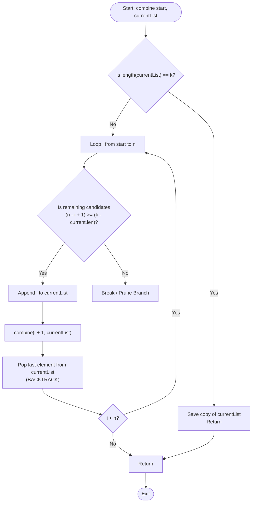

# Combination Generation (Subsets of Size k & Backtracking)

## 1. Introduction

**Combination Generation** is the process of finding all unique subsets of size $k$ chosen from a set of $n$ elements without regard to order.

The total number of combinations is given by the binomial coefficient:
$$\binom{n}{k} = \frac{n!}{k!(n - k)!}$$

Unlike permutations, order does not matter in combinations: $\{1, 2\}$ and $\{2, 1\}$ are considered identical combinations.

---

## 2. Why Use This Algorithm?

### Permutations vs Combinations Search Space
1. **Permutations ($P(n, k) = \frac{n!}{(n-k)!}$):** Considers element order. $\{1, 2\}$ and $\{2, 1\}$ are distinct.
2. **Combinations ($\binom{n}{k} = \frac{n!}{k!(n-k)!}$):** Ignores element order. By maintaining a monotonically increasing start pointer `start` in our loop (`for i from start to n`), we guarantee that elements are picked in ascending order, eliminating duplicate unordered subsets.

---

## 3. Real-World Applications

- **Feature Selection in Machine Learning:** Selecting subset of $k$ features out of $n$ available dataset features for model training.
- **Portfolio Management in Finance:** Selecting $k$ stocks out of a pool of $n$ candidates to build an optimal asset allocation portfolio.
- **Lottery & Gaming Systems:** Generating number combinations for lottery draw verification.
- **Committee / Group Selection:** Choosing $k$ representatives from a pool of $n$ candidates.

---

## 4. Prerequisites

Before learning Combination Generation, you should be comfortable with:
- **Recursion & Backtracking:** Managing recursion stacks, push/pop state restoration.
- **Binomial Coefficients:** Understanding $\binom{n}{k}$ formulas.

---

## 5. Visualization

### Combination Tree for $n = 4, k = 2$

```
                      Root (start = 1)
                  /          |          \
             Pick 1        Pick 2       Pick 3
            /   |   \        |   \         |
         (1,2) (1,3) (1,4) (2,3) (2,4)   (3,4)
```

### Mermaid Flowchart



---

## 6. How It Works

1. **Monotonic Start Pointer:** Recursion takes a `start` argument. In the loop, `i` runs from `start` to `n`.
2. **Push & Recurse:**
   - Append `i` to `currentList`.
   - Recurse `combine(i + 1, currentList)`.
3. **Backtrack:** Pop the last element from `currentList`.
4. **Base Case:** When `currentList.length == k`, save `currentList`.
5. **Pruning Optimization:** If $(n - i + 1) < (k - \text{currentList.length})$, not enough elements remain to reach size $k$. Break loop early.

---

## 7. Step-by-Step Algorithm

1. Input: Integers $n$ and $k$.
2. Create `results` list.
3. Define `backtrack(start, current)`:
   - If `current.length == k`: append copy of `current` to `results`, return.
   - For `i` from `start` to `n - (k - current.length) + 1`:
     - `current.push(i)`
     - `backtrack(i + 1, current)`
     - `current.pop()` (Backtrack)
4. Call `backtrack(1, [])`.
5. Return `results`.

---

## 8. Pseudocode

```text
function combine(n, k):
    results = []
    current = []
    backtrack(1, current, n, k, results)
    return results

function backtrack(start, current, n, k, results):
    if length(current) == k:
        results.append(copy of current)
        return
        
    // Pruned loop bound: n - (k - current.length) + 1
    for i from start to n - (k - length(current)) + 1:
        current.append(i)
        backtrack(i + 1, current, n, k, results)
        current.pop() // Backtrack
```

---

## 9. Code Examples

### C
```c
#include <stdio.h>

void combine(int n, int k, int start, int current[], int len) {
    if (len == k) {
        for (int i = 0; i < k; i++) {
            printf("%d ", current[i]);
        }
        printf("\n");
        return;
    }

    for (int i = start; i <= n - (k - len) + 1; i++) {
        current[len] = i;
        combine(n, k, i + 1, current, len + 1);
    }
}

int main() {
    int n = 4, k = 2;
    int current[2];
    printf("Combinations C(4, 2):\n");
    combine(n, k, 1, current, 0);
    return 0;
}
```

### C++
```cpp
#include <iostream>
#include <vector>

using namespace std;

class Combinations {
private:
    void backtrack(int start, int n, int k, vector<int>& current, vector<vector<int>>& result) {
        if (current.size() == k) {
            result.push_back(current);
            return;
        }

        // Pruning: i <= n - (k - current.size()) + 1
        for (int i = start; i <= n - (k - (int)current.size()) + 1; i++) {
            current.push_back(i);
            backtrack(i + 1, n, k, current, result);
            current.pop_back(); // Backtrack
        }
    }

public:
    vector<vector<int>> combine(int n, int k) {
        vector<vector<int>> result;
        vector<int> current;
        backtrack(1, n, k, current, result);
        return result;
    }
};

int main() {
    Combinations c;
    auto res = c.combine(4, 2);

    cout << "Combinations count: " << res.size() << "\n";
    for (const auto& comb : res) {
        for (int x : comb) cout << x << " ";
        cout << "\n";
    }
    return 0;
}
```

### Java
```java
import java.util.ArrayList;
import java.util.List;

public class Combinations {

    private static void backtrack(int start, int n, int k, List<Integer> current, List<List<Integer>> result) {
        if (current.size() == k) {
            result.add(new ArrayList<>(current));
            return;
        }

        for (int i = start; i <= n - (k - current.size()) + 1; i++) {
            current.add(i);
            backtrack(i + 1, n, k, current, result);
            current.remove(current.size() - 1); // Backtrack
        }
    }

    public static List<List<Integer>> combine(int n, int k) {
        List<List<Integer>> result = new ArrayList<>();
        backtrack(1, n, k, new ArrayList<>(), result);
        return result;
    }

    public static void main(String[] args) {
        List<List<Integer>> res = combine(4, 2);
        System.out.println("Combinations count: " + res.size());
        for (List<Integer> comb : res) {
            System.out.println(comb);
        }
    }
}
```

### Python
```python
def combine(n, k):
    result = []

    def backtrack(start, current):
        if len(current) == k:
            result.append(current[:])
            return

        # Pruning optimization
        for i in range(start, n - (k - len(current)) + 2):
            current.append(i)
            backtrack(i + 1, current)
            current.pop()  # Backtrack

    backtrack(1, [])
    return result


if __name__ == "__main__":
    res = combine(4, 2)
    print(f"Combinations count: {len(res)}")
    for comb in res:
        print(comb)
```

### JavaScript
```javascript
function combine(n, k) {
    const result = [];

    function backtrack(start, current) {
        if (current.length === k) {
            result.push([...current]);
            return;
        }

        for (let i = start; i <= n - (k - current.length) + 1; i++) {
            current.push(i);
            backtrack(i + 1, current);
            current.pop(); // Backtrack
        }
    }

    backtrack(1, []);
    return result;
}

const res = combine(4, 2);
console.log(`Combinations count: ${res.length}`);
res.forEach(comb => console.log(comb));
```

---

## 10. Code Explanation

- **Monotonic Choice (`start` parameter):** Starting the search loop from `i = start` enforces strictly increasing index pick order, preventing duplicate combinations (e.g., generating `[1, 2]` but never `[2, 1]`).
- **Pruning Bound (`n - (k - len) + 1`):** Eliminates searching branches where the remaining available numbers are fewer than what is needed to complete a $k$-element subset.
- **Space Optimization:** Uses a single dynamic array `current`, pushing and popping in $O(1)$ time per step.

---

## 11. Interactive Demo

Visual component for combination generation:
1. **Inputs:** Sliders for $n$ ($1 \dots 10$) and $k$ ($1 \dots n$).
2. **Formula Display:** Real-time calculation of $\binom{n}{k} = \frac{n!}{k!(n-k)!}$.
3. **Execution Tree:** Graph tree rendering branches trimmed by the pruning check.

---

## 12. Dry Run

Tracing $n = 4, k = 2$:

| Step | `start` | Loop `i` | Action | `current` | Target `k=2` hit? |
|------|---------|----------|--------|-----------|-------------------|
| 1 | 1 | 1 | Push 1 | `[1]` | No |
| 2 | 2 | 2 | Push 2 | `[1, 2]` | Yes -> Save `[1, 2]`, Pop 2 |
| 3 | 2 | 3 | Push 3 | `[1, 3]` | Yes -> Save `[1, 3]`, Pop 3 |
| 4 | 2 | 4 | Push 4 | `[1, 4]` | Yes -> Save `[1, 4]`, Pop 4 |
| 5 | 1 | 2 | Push 2 | `[2]` | No |
| 6 | 3 | 3 | Push 3 | `[2, 3]` | Yes -> Save `[2, 3]`, Pop 3 |
| 7 | 3 | 4 | Push 4 | `[2, 4]` | Yes -> Save `[2, 4]`, Pop 4 |
| 8 | 1 | 3 | Push 3 | `[3]` | No |
| 9 | 4 | 4 | Push 4 | `[3, 4]` | Yes -> Save `[3, 4]`, Pop 4 |

---

## 13. Time & Space Complexity

| Case | Time Complexity | Space Complexity | Reason |
|------|-----------------|------------------|--------|
| All Cases | $O(k \cdot \binom{n}{k})$ | $O(k)$ | Generates $\binom{n}{k}$ subsets, each requiring $O(k)$ copy time. Stack depth $k$. |

---

## 14. Advantages

- **Strictly Pruned Search:** Ignores non-viable branches where remaining count $< k$.
- **No Duplicate Subsets:** Ascending pick order guarantees unique subsets without needing hash sets.

---

## 15. Disadvantages

- **Combinatorial Explosion:** $\binom{n}{k}$ grows rapidly when $k \approx n / 2$.

---

## 16. Applications

- Feature selection in ML.
- Portfolio optimization.
- Lottery combinations.

---

## 17. Common Mistakes

- **Not Pruning Upper Bound:** Running loop to `n` when remaining elements cannot form size $k$.
- **Forgetting to Clone Current List:** Saving reference array instead of copy.

---

## 18. Interview Questions

1. How do you generate all Subsets / Power Set ($2^n$ subsets) (LeetCode 78)?
2. How do you handle duplicate elements in Combination Sum II (LeetCode 40)?
3. How do you convert recursive combination generation to an iterative bitmask approach?

---

## 19. Practice Problems

1. **LeetCode 77:** Combinations (Medium)
2. **LeetCode 39:** Combination Sum (Medium)
3. **LeetCode 78:** Subsets (Medium)

---

## 20. Related Algorithms

- **Subsets / Power Set Generation:** Generating all $2^n$ subsets.
- **Combination Sum:** Backtracking to find subsets summing to a target.
- **Gosper's Hack:** Bitwise trick to iterate through combinations of $k$ set bits in $O(1)$ per state.

---

## 21. Summary

Combination Generation finds all $\binom{n}{k}$ subsets of size $k$. Enforcing an increasing start index avoids order duplicates, and upper-bound loop pruning optimizes performance.

---

## 22. Quiz

**Question 1:** What is the value of $\binom{6}{3}$?
- A) 15
- B) 20
- C) 30
- D) 36
- **Correct Answer:** B
- **Explanation:** $\frac{6 \times 5 \times 4}{3 \times 2 \times 1} = 20$.

**Question 2:** Why do we pass `i + 1` as the `start` parameter in recursive calls for combinations?
- A) To increase speed.
- B) To ensure elements are picked in strictly increasing order, avoiding duplicate subsets.
- C) To reverse the array.
- D) To allow selecting duplicate elements.
- **Correct Answer:** B
- **Explanation:** Passing `i + 1` enforces monotonic selection, preventing permutations of the same subset.
