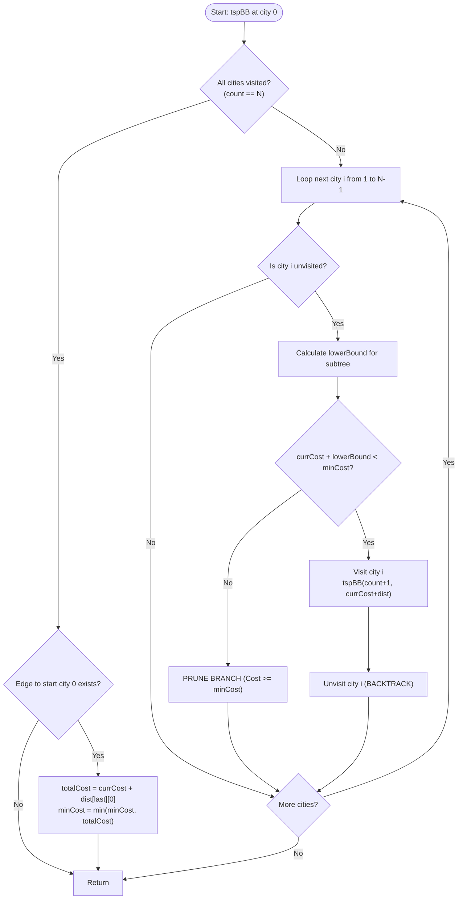

# Traveling Salesman Problem (TSP: Branch & Bound and Dynamic Programming)

## 1. Introduction

The **Traveling Salesman Problem (TSP)** is one of the most famous combinatorial optimization problems in computer science and operations research.

Given a list of $N$ cities and the distance matrix between each pair of cities, the goal is to find the **shortest possible route that visits every city exactly once and returns to the origin city**.

TSP is an **NP-hard** problem. While brute-force search takes $O(N!)$ time, exact algorithms like **Branch & Bound** and **Held-Karp Dynamic Programming (Bitmask DP)** dramatically reduce computation time.

---

## 2. Why Use This Algorithm?

### Comparison of Approaches:
1. **Brute-Force Permutations ($O(N!)$):**
   Evaluating all $(N-1)!$ possible closed tours. For $N = 20$, $19! \approx 1.21 \times 10^{17}$ checks! ❌ *Extremely slow.*
2. **Branch & Bound ($O(N!) worst-case, heavily pruned average):**
   Uses a **Lower Bound** calculation (e.g., minimum edge costs per vertex or reduced matrices). If `currentCost + lowerBound >= minGlobalCost`, the entire subtree branch is pruned immediately.
3. **Held-Karp Dynamic Programming ($O(2^N \cdot N^2)$):**
   Uses bitmask DP (`dp[mask][u]` = min cost to visit subset `mask` ending at city `u`) to achieve exact solution in $O(2^N \cdot N^2)$ time.

---

## 3. Real-World Applications

- **Logistics & Delivery Route Planning:** FedEx, UPS, and Amazon optimizing multi-stop delivery routes to save fuel and time.
- **Printed Circuit Board (PCB) Manufacturing:** Minimizing drill bit travel distances across thousands of hole coordinates.
- **DNA Sequencing:** Ordering genome fragments by maximum overlap score.
- **Microchip Wiring & Astronomy:** Optimizing telescope pointing sequences to observe multiple celestial targets.

---

## 4. Prerequisites

Before learning TSP algorithms, you should be comfortable with:
- **Recursion & Backtracking / Branch & Bound:** Understanding state pruning via lower bounds.
- **Bitmasking (for Held-Karp DP):** Using integer bits to represent sets of visited cities ($1 \ll i$).
- **Graph Distance Matrices:** 2D matrix where `dist[i][j]` is edge weight between city $i$ and city $j$.

---

## 5. Visualization

### Sample 4-City Distance Graph

```
      (0)
     / | \
   10 15  20
   /   |   \
 (1)--35--(2)
   \   |   /
   25 30 10
     \ | /
      (3)

Distance Matrix:
   0   1   2   3
0 [ 0, 10, 15, 20 ]
1 [10,  0, 35, 25 ]
2 [15, 35,  0, 10 ]
3 [20, 25, 10,  0 ]

Optimal Tour: 0 -> 1 -> 3 -> 2 -> 0 (Cost: 10 + 25 + 10 + 15 = 60)
```

### Mermaid Flowchart (Branch & Bound Search)



---

## 6. How It Works (Branch & Bound with Lower Bounding)

1. **Lower Bound Estimation:**
   For any partial path ending at city $curr$, the lower bound of completing the tour can be estimated as:
   $$\text{Lower Bound} = \frac{1}{2} \sum_{v=0}^{N-1} (\text{sum of two smallest edge costs connected to } v)$$
2. **Pruning Condition:**
   If $\text{currentCost} + \text{bound} \ge \text{minCostFoundSoFar}$, abandon this search branch immediately.
3. **Branching:**
   Sort unvisited neighbors by edge cost or bound, explore candidate cities recursively, and update `minCostFoundSoFar` whenever a full valid tour with lower total cost is reached.

---

## 7. Step-by-Step Algorithm (Branch & Bound)

1. Input: $N \times N$ distance matrix `dist`.
2. Compute initial global lower bound from sum of 2 smallest edge weights per city divided by 2.
3. Initialize `minCost = INF`, `visited` array (all false), `path` array.
4. Set `visited[0] = true`, `path[0] = 0`.
5. Call recursive function `tspRec(currBound, currCost, level=1, currPath)`:
   - Base Case: If `level == N`:
     - If `dist[currPath[N-1]][0] != 0`:
       - `finalCost = currCost + dist[currPath[N-1]][0]`
       - Update `minCost = min(minCost, finalCost)`.
     - Return.
   - For each city `i` from 0 to $N-1$:
     - If `!visited[i]` and `dist[currPath[level-1]][i] != 0`:
       - `tempBound = currBound - (minEdge(prev) + minEdge(i)) / 2`
       - If `currCost + dist[prev][i] + tempBound < minCost`:
         - Mark `visited[i] = true`, `path[level] = i`.
         - Recurse `tspRec(tempBound, currCost + dist[prev][i], level + 1, path)`.
         - Reset `visited[i] = false` (Backtrack).

---

## 8. Pseudocode

```text
function solveTSP(dist, N):
    minCost = INFINITY
    visited = boolean array of size N initialized to false
    path = array of size N + 1
    
    visited[0] = true
    path[0] = 0
    
    initialBound = calculateInitialBound(dist, N)
    
    tspBranchAndBound(dist, N, initialBound, 0, 1, path, visited, minCost)
    return minCost

function tspBranchAndBound(dist, N, currBound, currCost, level, path, visited, minCost):
    if level == N:
        if dist[path[N-1]][0] > 0:
            totalCost = currCost + dist[path[N-1]][0]
            if totalCost < minCost:
                minCost = totalCost
        return

    for i from 0 to N - 1:
        if dist[path[level-1]][i] > 0 and not visited[i]:
            tempBound = currBound
            // Adjust bound estimate for choosing edge (path[level-1], i)
            currBoundCalc = calculateNewBound(dist, path[level-1], i, currBound)
            
            if currCost + dist[path[level-1]][i] + currBoundCalc < minCost:
                visited[i] = true
                path[level] = i
                
                tspBranchAndBound(dist, N, currBoundCalc, currCost + dist[path[level-1]][i], level + 1, path, visited, minCost)
                
                visited[i] = false // Backtrack
```

---

## 9. Code Examples

### C
```c
#include <stdio.h>
#include <stdbool.h>
#include <limits.h>

#define N 4
#define INF INT_MAX

int finalCost = INF;

int firstMin(int dist[N][N], int i) {
    int min = INF;
    for (int k = 0; k < N; k++)
        if (dist[i][k] < min && i != k) min = dist[i][k];
    return min;
}

int secondMin(int dist[N][N], int i) {
    int first = INF, second = INF;
    for (int j = 0; j < N; j++) {
        if (i == j) continue;
        if (dist[i][j] <= first) {
            second = first;
            first = dist[i][j];
        } else if (dist[i][j] <= second && dist[i][j] != first) {
            second = dist[i][j];
        }
    }
    return second;
}

void tspRec(int dist[N][N], int currBound, int currCost, int level, int currPath[], bool visited[]) {
    if (level == N) {
        if (dist[currPath[level - 1]][currPath[0]] != 0) {
            int totalCost = currCost + dist[currPath[level - 1]][currPath[0]];
            if (totalCost < finalCost) finalCost = totalCost;
        }
        return;
    }

    for (int i = 0; i < N; i++) {
        if (dist[currPath[level - 1]][i] != 0 && !visited[i]) {
            int tempBound = currBound;
            currCost += dist[currPath[level - 1]][i];

            if (level == 1)
                currBound -= (firstMin(dist, currPath[level - 1]) + firstMin(dist, i)) / 2;
            else
                currBound -= (secondMin(dist, currPath[level - 1]) + firstMin(dist, i)) / 2;

            if (currBound + currCost < finalCost) {
                currPath[level] = i;
                visited[i] = true;
                tspRec(dist, currBound, currCost, level + 1, currPath, visited);
            }

            currCost -= dist[currPath[level - 1]][i];
            currBound = tempBound;
            visited[i] = false;
        }
    }
}

int main() {
    int dist[N][N] = {
        {0, 10, 15, 20},
        {10, 0, 35, 25},
        {15, 35, 0, 10},
        {20, 25, 10, 0}
    };

    int currPath[N + 1];
    bool visited[N] = {false};
    int currBound = 0;

    for (int i = 0; i < N; i++)
        currBound += (firstMin(dist, i) + secondMin(dist, i));
    currBound = (currBound & 1) ? currBound / 2 + 1 : currBound / 2;

    visited[0] = true;
    currPath[0] = 0;

    tspRec(dist, currBound, 0, 1, currPath, visited);

    printf("Minimum TSP Tour Cost: %d\n", finalCost);
    return 0;
}
```

### C++ (Held-Karp Dynamic Programming $O(2^N \cdot N^2)$)
```cpp
#include <iostream>
#include <vector>
#include <algorithm>

using namespace std;

const int INF = 1e9;

int tspHeldKarp(const vector<vector<int>>& dist) {
    int n = dist.size();
    int VISITED_ALL = (1 << n) - 1;
    vector<vector<int>> dp(1 << n, vector<int>(n, -1));

    auto solve = [&](auto& self, int mask, int u) -> int {
        if (mask == VISITED_ALL) return dist[u][0]; // Return to start
        if (dp[mask][u] != -1) return dp[mask][u];

        int ans = INF;
        for (int v = 0; v < n; v++) {
            if (!(mask & (1 << v))) { // If city v not visited
                int newCost = dist[u][v] + self(self, mask | (1 << v), v);
                ans = min(ans, newCost);
            }
        }
        return dp[mask][u] = ans;
    };

    return solve(solve, 1, 0); // Start at city 0 with mask=1 (binary 0001)
}

int main() {
    vector<vector<int>> dist = {
        {0, 10, 15, 20},
        {10, 0, 35, 25},
        {15, 35, 0, 10},
        {20, 25, 10, 0}
    };

    cout << "Minimum TSP Tour Cost (Held-Karp): " << tspHeldKarp(dist) << "\n";
    return 0;
}
```

### Java (Held-Karp Bitmask DP)
```java
import java.util.Arrays;

public class TSPHeldKarp {

    private static final int INF = (int) 1e9;

    public static int solveTSP(int[][] dist) {
        int n = dist.length;
        int VISITED_ALL = (1 << n) - 1;
        int[][] dp = new int[1 << n][n];
        for (int[] row : dp) Arrays.fill(row, -1);

        return tspDP(1, 0, dist, n, VISITED_ALL, dp);
    }

    private static int tspDP(int mask, int u, int[][] dist, int n, int VISITED_ALL, int[][] dp) {
        if (mask == VISITED_ALL) return dist[u][0];
        if (dp[mask][u] != -1) return dp[mask][u];

        int ans = INF;
        for (int v = 0; v < n; v++) {
            if ((mask & (1 << v)) == 0) { // If city v not visited
                int newCost = dist[u][v] + tspDP(mask | (1 << v), v, dist, n, VISITED_ALL, dp);
                ans = Math.min(ans, newCost);
            }
        }
        return dp[mask][u] = ans;
    }

    public static void main(String[] args) {
        int[][] dist = {
            {0, 10, 15, 20},
            {10, 0, 35, 25},
            {15, 35, 0, 10},
            {20, 25, 10, 0}
        };

        System.out.println("Minimum TSP Tour Cost: " + solveTSP(dist));
    }
}
```

### Python (Held-Karp DP with Memoization)
```python
def tsp_held_karp(dist):
    n = len(dist)
    VISITED_ALL = (1 << n) - 1
    memo = {}

    def solve(mask, u):
        if mask == VISITED_ALL:
            return dist[u][0]  # Return cost to starting city 0

        state = (mask, u)
        if state in memo:
            return memo[state]

        ans = float('inf')
        for v in range(n):
            if not (mask & (1 << v)):  # City v is unvisited
                cost = dist[u][v] + solve(mask | (1 << v), v)
                ans = min(ans, cost)

        memo[state] = ans
        return ans

    return solve(1, 0)  # Start at city 0, mask 1 (binary 0001)


if __name__ == "__main__":
    dist = [
        [0, 10, 15, 20],
        [10, 0, 35, 25],
        [15, 35, 0, 10],
        [20, 25, 10, 0]
    ]
    print(f"Minimum TSP Tour Cost: {tsp_held_karp(dist)}")
```

### JavaScript (Held-Karp Bitmask DP)
```javascript
function tspHeldKarp(dist) {
    const n = dist.length;
    const VISITED_ALL = (1 << n) - 1;
    const dp = Array.from({ length: 1 << n }, () => Array(n).fill(-1));

    function solve(mask, u) {
        if (mask === VISITED_ALL) {
            return dist[u][0];
        }
        if (dp[mask][u] !== -1) return dp[mask][u];

        let ans = Infinity;
        for (let v = 0; v < n; v++) {
            if (!(mask & (1 << v))) {
                const cost = dist[u][v] + solve(mask | (1 << v), v);
                ans = Math.min(ans, cost);
            }
        }
        return dp[mask][u] = ans;
    }

    return solve(1, 0);
}

const dist = [
    [0, 10, 15, 20],
    [10, 0, 35, 25],
    [15, 35, 0, 10],
    [20, 25, 10, 0]
];

console.log(`Minimum TSP Tour Cost: ${tspHeldKarp(dist)}`);
```

---

## 10. Code Explanation

- **Bitmask State Representation:** An integer `mask` tracks visited cities via binary bits. Bit `i` set to 1 means city `i` has been visited.
- **Base Case Return to Origin:** When `mask == (1 << n) - 1` (all bits set), `dist[u][0]` adds the return trip distance to starting city 0.
- **DP State (`dp[mask][u]`):** Stores the minimum cost to complete the tour starting from city `u` having visited the subset of cities in `mask`.
- **Branch & Bound Pruning:** Cuts branches early whenever `currentCost + lowerBound >= globalMinCost`.

---

## 11. Interactive Demo

Visual UI for TSP:
1. **2D Canvas:** Click to place cities on a coordinate map.
2. **Algorithm Switcher:** Toggle between Brute-Force, Branch & Bound, and Held-Karp DP.
3. **Execution Display:** Live rendering of active tour branches, showing current cost vs lower-bound pruning events in real time.

---

## 12. Dry Run

Tracing Held-Karp DP on the 4-city example:

| State `(mask, u)` | Mask (Binary) | Unvisited Cities | Candidate Move `v` | Edge Cost `dist[u][v]` | Subproblem Cost | Min Returned |
|-------------------|---------------|------------------|--------------------|------------------------|-----------------|--------------|
| `(1, 0)` | `0001` | 1, 2, 3 | Try 1 | 10 | `solve(0011, 1)` | - |
| `(3, 1)` | `0011` | 2, 3 | Try 3 | 25 | `solve(1011, 3)` | - |
| `(11, 3)` | `1011` | 2 | Try 2 | 10 | `solve(1111, 2)` = 15 | 10 + 15 = 25 |
| `(3, 1)` | `0011` | 2, 3 | Try 2 | 35 | `solve(0111, 2)` | - |
| `(7, 2)` | `0111` | 3 | Try 3 | 10 | `solve(1111, 3)` = 20 | 10 + 20 = 30 |

---

## 13. Time & Space Complexity

| Algorithm | Time Complexity | Space Complexity | Practical Capacity |
|-----------|-----------------|------------------|--------------------|
| Brute Force | $O(N!)$ | $O(N)$ | $N \le 12$ |
| Branch & Bound | $O(N!)$ worst-case | $O(N^2)$ | $N \le 20-30$ |
| Held-Karp DP | $O(2^N \cdot N^2)$ | $O(2^N \cdot N)$ | $N \le 23$ |
| 2-Opt Heuristic | $O(N^2)$ per pass | $O(N)$ | $N \le 10,000+$ (Approximation) |

---

## 14. Advantages

- **Exact Solutions:** Guarantees finding the globally optimal tour.
- **Held-Karp DP Speedup:** Dramatically reduces $O(N!)$ down to $O(2^N \cdot N^2)$.

---

## 15. Disadvantages

- **NP-Hard Complexity:** Exact methods become intractable for $N > 30$. Real-world logistics use approximation algorithms (Christofides, 2-Opt, Simulated Annealing).

---

## 16. Applications

- Logistics & route optimization.
- Printed circuit board drilling.
- Genome fragment assembly.

---

## 17. Common Mistakes

- **Incorrect Bitmask Checks:** Using `mask & (1 << v)` without proper parenthesis in C/C++/Java/JS due to operator precedence.
- **Forgetting Return Distance:** Omitting edge `dist[last][0]` back to the start city.

---

## 18. Interview Questions

1. What is the time complexity difference between Brute-Force TSP ($O(N!)$) and Held-Karp DP ($O(2^N \cdot N^2)$)?
2. How does Christofides algorithm achieve a $1.5$-approximation ratio for Metric TSP?
3. How does 2-Opt local search improve a TSP tour?

---

## 19. Practice Problems

1. **LeetCode 847:** Shortest Path Visiting All Nodes (Bitmask BFS)
2. **LeetCode 943:** Find the Shortest Superstring (TSP variation)
3. **GFG:** Traveling Salesman Problem

---

## 20. Related Algorithms

- **Hamiltonian Cycle:** Decision variant checking if any cycle visiting all vertices exists.
- **Held-Karp DP:** Exact bitmask dynamic programming algorithm.
- **Christofides Algorithm:** $1.5$-approximation algorithm using Minimum Spanning Trees and Minimum Weight Perfect Matchings.

---

## 21. Summary

The Traveling Salesman Problem finds the minimum-cost closed tour visiting all $N$ cities. Exact solutions use Held-Karp Bitmask DP ($O(2^N \cdot N^2)$) or Branch & Bound to prune search trees.

---

## 22. Quiz

**Question 1:** What is the time complexity of the Held-Karp Dynamic Programming algorithm for TSP?
- A) $O(N!)$
- B) $O(N^3)$
- C) $O(2^N \cdot N^2)$
- D) $O(N^2)$
- **Correct Answer:** C
- **Explanation:** Bitmask DP has $2^N \cdot N$ states, each iterating over $N$ transitions $\implies O(2^N \cdot N^2)$.

**Question 2:** In TSP bitmasking, what does `mask = (1 << N) - 1` represent?
- A) No cities have been visited.
- B) All $N$ cities have been visited.
- C) Only city 0 has been visited.
- D) Half of the cities have been visited.
- **Correct Answer:** B
- **Explanation:** `(1 << N) - 1` produces an $N$-bit integer with all bits set to 1, representing all cities visited.
