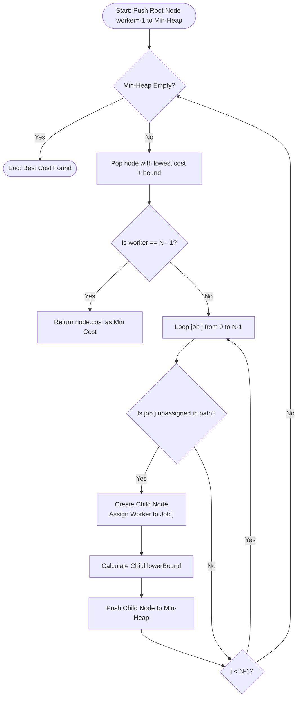

# Job Assignment Problem (Branch & Bound & Hungarian Algorithm)

## 1. Introduction

The **Job Assignment Problem** is a fundamental problem in combinatorial optimization and operations research.

Given $N$ workers and $N$ jobs, along with an $N \times N$ cost matrix `cost[i][j]` where `cost[i][j]` represents the cost of assigning worker $i$ to job $j$, the goal is to **assign exactly one job to each worker** such that the total cost across all assignments is **minimized**.

Instead of examining every possible permutation, **Branch & Bound** uses state space tree exploration with lower bound pruning to find the optimal assignment in a fraction of the time.

---

## 2. Why Use This Algorithm?

### Comparison of Approaches:
1. **Naïve Permutation Exploration ($O(N!)$):**
   Testing all $N!$ possible matchings. For $N = 15$, $15! \approx 1.3 \times 10^{12}$ operations! ❌ *Completely unscalable.*
2. **Branch & Bound with Lower Bounding ($O(N!)$ worst-case, heavily pruned average):**
   Calculates a lower bound cost for unassigned workers by taking the minimum available job costs. If `currentCost + lowerBound >= minGlobalCost`, the subtree is pruned. Using a Min-Heap priority queue (Least Cost Search) explores promising branches first.
3. **Hungarian Algorithm ($O(N^3)$):**
   A polynomial-time exact algorithm based on matrix reduction and bipartite matching.

---

## 3. Real-World Applications

- **Cloud Resource Allocation:** Assigning virtual machine instances to physical server nodes to minimize latency and power consumption.
- **Ride-Sharing Dispatching:** Matching drivers to rider pickup requests to minimize total pickup wait times.
- **Manufacturing & Assembly Lines:** Assigning production tasks to specialized machines to minimize total processing time.
- **Flight Crew Scheduling:** Assigning pilots and cabin crew to flight sectors according to cost and duty constraints.

---

## 4. Prerequisites

Before learning the Job Assignment Problem, you should be comfortable with:
- **Priority Queues (Min-Heap):** Used to retrieve the state node with the lowest lower-bound estimate.
- **State Space Search & Tree Pruning:** Understanding state transitions, branching, and bound-based pruning.
- **Matrix Operations:** Working with 2D array representation of costs.

---

## 5. Visualization

### Sample $4 \times 4$ Cost Matrix

```
       Job 0  Job 1  Job 2  Job 3
Worker 0 [ 9,     2,     7,     8 ]
Worker 1 [ 6,     4,     3,     7 ]
Worker 2 [ 5,     8,     1,     8 ]
Worker 3 [ 7,     6,     9,     4 ]

Optimal Assignment:
Worker 0 -> Job 1 (Cost 2)
Worker 1 -> Job 0 (Cost 6)  OR  Worker 1 -> Job 2 (Cost 3)
Worker 2 -> Job 2 (Cost 1)  OR  Worker 2 -> Job 0 (Cost 5)
Worker 3 -> Job 3 (Cost 4)
Total Minimum Cost = 2 + 3 + 5 + 4 = 14
```

### Mermaid Flowchart (Least Cost Branch & Bound)



---

## 6. How It Works

1. **Root Node Initialization:** Worker index starts at `-1` (no assignments). The initial lower bound is computed as the sum of minimum cost values in each row of the matrix.
2. **Min-Heap State Queue:** Active states are stored in a priority queue ordered by `node.cost + node.bound`.
3. **Branching:** The state with the smallest lower bound is popped. For the next worker $i$, we create child nodes for every unassigned job $j$.
4. **Lower Bound Calculation:** For unassigned workers $i+1 \dots N-1$, find the minimum cost among unassigned jobs and add them to the partial cost.
5. **Termination:** The first state popped with all workers assigned guarantees the minimum total cost.

---

## 7. Step-by-Step Algorithm

1. Input: $N \times N$ matrix `cost`.
2. Define state `Node`: `worker`, `job`, `cost`, `bound`, `assignedJobs` array.
3. Compute initial lower bound for root node `worker = -1`.
4. Insert root node into Min-Heap `pq`.
5. While `pq` is not empty:
   - Pop top node `curr`.
   - `nextWorker = curr.worker + 1`.
   - If `nextWorker == N`, return `curr.cost`.
   - For `j = 0` to `N - 1`:
     - If job `j` is not in `curr.assignedJobs`:
       - Create `child` with `worker = nextWorker`, `job = j`.
       - `child.cost = curr.cost + cost[nextWorker][j]`.
       - Calculate `child.bound` using minimum costs of unassigned jobs for remaining workers.
       - Push `child` into `pq`.

---

## 8. Pseudocode

```text
function solveJobAssignment(costMatrix, N):
    pq = PriorityQueueSortedBy(cost + bound ascending)
    
    root = new Node(worker = -1, cost = 0, bound = computeBound(costMatrix, -1, []))
    pq.push(root)
    
    while pq is not empty:
        curr = pq.pop()
        nextWorker = curr.worker + 1
        
        if nextWorker == N:
            return curr.cost
            
        for j from 0 to N - 1:
            if j is not in curr.assignedJobs:
                child = new Node()
                child.worker = nextWorker
                child.job = j
                child.assignedJobs = curr.assignedJobs + [j]
                child.cost = curr.cost + costMatrix[nextWorker][j]
                child.bound = computeBound(costMatrix, nextWorker, child.assignedJobs)
                
                pq.push(child)

function computeBound(costMatrix, workerIndex, assignedJobs):
    bound = 0
    for w from workerIndex + 1 to N - 1:
        minCost = INFINITY
        for j from 0 to N - 1:
            if j is not in assignedJobs:
                minCost = min(minCost, costMatrix[w][j])
        bound += (minCost if minCost != INFINITY else 0)
    return bound
```

---

## 9. Code Examples

### C
```c
#include <stdio.h>
#include <stdbool.h>
#include <limits.h>

#define N 4
#define INF INT_MAX

int costMatrix[N][N] = {
    {9, 2, 7, 8},
    {6, 4, 3, 7},
    {5, 8, 1, 8},
    {7, 6, 9, 4}
};

int minCost = INF;

void solve(int worker, int currentCost, bool assignedJobs[N]) {
    if (worker == N) {
        if (currentCost < minCost) {
            minCost = currentCost;
        }
        return;
    }

    for (int j = 0; j < N; j++) {
        if (!assignedJobs[j]) {
            int lowerBound = 0;
            for (int w = worker + 1; w < N; w++) {
                int minVal = INF;
                for (int job = 0; job < N; job++) {
                    if (!assignedJobs[job] && job != j) {
                        if (costMatrix[w][job] < minVal) minVal = costMatrix[w][job];
                    }
                }
                if (minVal != INF) lowerBound += minVal;
            }

            if (currentCost + costMatrix[worker][j] + lowerBound < minCost) {
                assignedJobs[j] = true;
                solve(worker + 1, currentCost + costMatrix[worker][j], assignedJobs);
                assignedJobs[j] = false; // Backtrack
            }
        }
    }
}

int main() {
    bool assignedJobs[N] = {false};
    solve(0, 0, assignedJobs);
    printf("Minimum Job Assignment Cost: %d\n", minCost);
    return 0;
}
```

### C++
```cpp
#include <iostream>
#include <vector>
#include <queue>
#include <algorithm>

using namespace std;

struct Node {
    int worker;
    int job;
    int cost;
    int bound;
    vector<bool> assigned;

    bool operator>(const Node& other) const {
        return (cost + bound) > (other.cost + other.bound);
    }
};

int calculateBound(const vector<vector<int>>& costMatrix, int worker, const vector<bool>& assigned, int n) {
    int bound = 0;
    for (int w = worker + 1; w < n; w++) {
        int minCost = 1e9;
        for (int j = 0; j < n; j++) {
            if (!assigned[j]) {
                minCost = min(minCost, costMatrix[w][j]);
            }
        }
        bound += (minCost == 1e9 ? 0 : minCost);
    }
    return bound;
}

int solveJobAssignment(const vector<vector<int>>& costMatrix) {
    int n = costMatrix.size();
    priority_queue<Node, vector<Node>, greater<Node>> pq;

    vector<bool> initialAssigned(n, false);
    int initialBound = calculateBound(costMatrix, -1, initialAssigned, n);

    pq.push({-1, -1, 0, initialBound, initialAssigned});

    while (!pq.empty()) {
        Node minNode = pq.top();
        pq.pop();

        int nextWorker = minNode.worker + 1;
        if (nextWorker == n) return minNode.cost;

        for (int j = 0; j < n; j++) {
            if (!minNode.assigned[j]) {
                vector<bool> childAssigned = minNode.assigned;
                childAssigned[j] = true;

                int childCost = minNode.cost + costMatrix[nextWorker][j];
                int childBound = calculateBound(costMatrix, nextWorker, childAssigned, n);

                pq.push({nextWorker, j, childCost, childBound, childAssigned});
            }
        }
    }
    return -1;
}

int main() {
    vector<vector<int>> costMatrix = {
        {9, 2, 7, 8},
        {6, 4, 3, 7},
        {5, 8, 1, 8},
        {7, 6, 9, 4}
    };

    cout << "Minimum Job Assignment Cost: " << solveJobAssignment(costMatrix) << "\n";
    return 0;
}
```

### Java
```java
import java.util.PriorityQueue;

public class JobAssignment {

    static class Node implements Comparable<Node> {
        int worker;
        int job;
        int cost;
        int bound;
        boolean[] assigned;

        Node(int worker, int job, int cost, int bound, boolean[] assigned) {
            this.worker = worker;
            this.job = job;
            this.cost = cost;
            this.bound = bound;
            this.assigned = assigned.clone();
        }

        @Override
        public int compareTo(Node o) {
            return Integer.compare(this.cost + this.bound, o.cost + o.bound);
        }
    }

    private static int calculateBound(int[][] costMatrix, int worker, boolean[] assigned, int n) {
        int bound = 0;
        for (int w = worker + 1; w < n; w++) {
            int minCost = Integer.MAX_VALUE;
            for (int j = 0; j < n; j++) {
                if (!assigned[j] && costMatrix[w][j] < minCost) {
                    minCost = costMatrix[w][j];
                }
            }
            if (minCost != Integer.MAX_VALUE) bound += minCost;
        }
        return bound;
    }

    public static int solveJobAssignment(int[][] costMatrix) {
        int n = costMatrix.length;
        PriorityQueue<Node> pq = new PriorityQueue<>();

        boolean[] initialAssigned = new boolean[n];
        int initialBound = calculateBound(costMatrix, -1, initialAssigned, n);

        pq.add(new Node(-1, -1, 0, initialBound, initialAssigned));

        while (!pq.isEmpty()) {
            Node minNode = pq.poll();

            int nextWorker = minNode.worker + 1;
            if (nextWorker == n) return minNode.cost;

            for (int j = 0; j < n; j++) {
                if (!minNode.assigned[j]) {
                    boolean[] childAssigned = minNode.assigned.clone();
                    childAssigned[j] = true;

                    int childCost = minNode.cost + costMatrix[nextWorker][j];
                    int childBound = calculateBound(costMatrix, nextWorker, childAssigned, n);

                    pq.add(new Node(nextWorker, j, childCost, childBound, childAssigned));
                }
            }
        }
        return -1;
    }

    public static void main(String[] args) {
        int[][] costMatrix = {
            {9, 2, 7, 8},
            {6, 4, 3, 7},
            {5, 8, 1, 8},
            {7, 6, 9, 4}
        };

        System.out.println("Minimum Job Assignment Cost: " + solveJobAssignment(costMatrix));
    }
}
```

### Python
```python
import heapq

class Node:
    def __init__(self, worker, job, cost, bound, assigned):
        self.worker = worker
        self.job = job
        self.cost = cost
        self.bound = bound
        self.assigned = assigned

    def __lt__(self, other):
        return (self.cost + self.bound) < (other.cost + other.bound)


def calculate_bound(cost_matrix, worker, assigned, n):
    bound = 0
    for w in range(worker + 1, n):
        min_cost = float('inf')
        for j in range(n):
            if not assigned[j]:
                min_cost = min(min_cost, cost_matrix[w][j])
        bound += (min_cost if min_cost != float('inf') else 0)
    return bound


def solve_job_assignment(cost_matrix):
    n = len(cost_matrix)
    pq = []

    initial_assigned = [False] * n
    initial_bound = calculate_bound(cost_matrix, -1, initial_assigned, n)

    heapq.heappush(pq, Node(-1, -1, 0, initial_bound, initial_assigned))

    while pq:
        min_node = heapq.heappop(pq)
        next_worker = min_node.worker + 1

        if next_worker == n:
            return min_node.cost

        for j in range(n):
            if not min_node.assigned[j]:
                child_assigned = min_node.assigned[:]
                child_assigned[j] = True

                child_cost = min_node.cost + cost_matrix[next_worker][j]
                child_bound = calculate_bound(cost_matrix, next_worker, child_assigned, n)

                heapq.heappush(pq, Node(next_worker, j, child_cost, child_bound, child_assigned))

    return -1


if __name__ == "__main__":
    cost_matrix = [
        [9, 2, 7, 8],
        [6, 4, 3, 7],
        [5, 8, 1, 8],
        [7, 6, 9, 4]
    ]
    print(f"Minimum Job Assignment Cost: {solve_job_assignment(cost_matrix)}")
```

### JavaScript
```javascript
class MinPriorityQueue {
    constructor() {
        this.heap = [];
    }

    push(node) {
        this.heap.push(node);
        this._up(this.heap.length - 1);
    }

    pop() {
        if (this.heap.length === 0) return null;
        const top = this.heap[0];
        const bottom = this.heap.pop();
        if (this.heap.length > 0) {
            this.heap[0] = bottom;
            this._down(0);
        }
        return top;
    }

    isEmpty() { return this.heap.length === 0; }

    _up(i) {
        while (i > 0) {
            const p = (i - 1) >> 1;
            if ((this.heap[i].cost + this.heap[i].bound) < (this.heap[p].cost + this.heap[p].bound)) {
                [this.heap[i], this.heap[p]] = [this.heap[p], this.heap[i]];
                i = p;
            } else break;
        }
    }

    _down(i) {
        const len = this.heap.length;
        while ((i << 1) + 1 < len) {
            let left = (i << 1) + 1, right = left + 1, best = left;
            if (right < len && (this.heap[right].cost + this.heap[right].bound) < (this.heap[left].cost + this.heap[left].bound)) {
                best = right;
            }
            if ((this.heap[best].cost + this.heap[best].bound) < (this.heap[i].cost + this.heap[i].bound)) {
                [this.heap[i], this.heap[best]] = [this.heap[best], this.heap[i]];
                i = best;
            } else break;
        }
    }
}

function calculateBound(costMatrix, worker, assigned, n) {
    let bound = 0;
    for (let w = worker + 1; w < n; w++) {
        let minCost = Infinity;
        for (let j = 0; j < n; j++) {
            if (!assigned[j] && costMatrix[w][j] < minCost) {
                minCost = costMatrix[w][j];
            }
        }
        if (minCost !== Infinity) bound += minCost;
    }
    return bound;
}

function solveJobAssignment(costMatrix) {
    const n = costMatrix.length;
    const pq = new MinPriorityQueue();

    const initialAssigned = Array(n).fill(false);
    const initialBound = calculateBound(costMatrix, -1, initialAssigned, n);

    pq.push({ worker: -1, job: -1, cost: 0, bound: initialBound, assigned: initialAssigned });

    while (!pq.isEmpty()) {
        const minNode = pq.pop();

        const nextWorker = minNode.worker + 1;
        if (nextWorker === n) return minNode.cost;

        for (let j = 0; j < n; j++) {
            if (!minNode.assigned[j]) {
                const childAssigned = [...minNode.assigned];
                childAssigned[j] = true;

                const childCost = minNode.cost + costMatrix[nextWorker][j];
                const childBound = calculateBound(costMatrix, nextWorker, childAssigned, n);

                pq.push({ worker: nextWorker, job: j, cost: childCost, bound: childBound, assigned: childAssigned });
            }
        }
    }
    return -1;
}

const costMatrix = [
    [9, 2, 7, 8],
    [6, 4, 3, 7],
    [5, 8, 1, 8],
    [7, 6, 9, 4]
];

console.log(`Minimum Job Assignment Cost: ${solveJobAssignment(costMatrix)}`);
```

---

## 10. Code Explanation

- **Priority Queue Ordering:** Ordering by `cost + bound` ensures that the search prioritizes state branches with the lowest potential total cost first (Least Cost Search).
- **Lower Bound Estimation:** Taking the sum of minimum available job costs for remaining workers gives an admissible (optimistic) estimate of the completion cost.
- **Termination:** Because `cost + bound` is non-decreasing and optimistic, popping a state where `worker == N - 1` guarantees that no other unsearched branch can produce a lower cost.

---

## 11. Interactive Demo

Visual setup for Job Assignment:
1. **Interactive Grid Matrix:** Input custom $N \times N$ worker-job costs.
2. **Min-Heap State Tree:** Live animation showing popped nodes, lower bounds, and pruned branches.

---

## 12. Dry Run

Tracing the $4 \times 4$ cost matrix example:

| State | Assigned Workers & Jobs | Current Cost | Lower Bound (Remaining Workers) | `Cost + Bound` | Min-Heap Action |
|-------|-------------------------|--------------|---------------------------------|----------------|-----------------|
| Root | None | 0 | W0(2)+W1(3)+W2(1)+W3(4) = 10 | 10 | Pushed |
| Pop Root | Assign W0 -> Job 1 | 2 | W1(3)+W2(1)+W3(4) = 8 | 10 | Expand W0 options |
| W0 -> J1 | Assign W1 -> Job 2 | 2 + 3 = 5 | W2(5)+W3(4) = 9 | 14 | Pushed |
| W0 -> J1 | Assign W1 -> Job 0 | 2 + 6 = 8 | W2(1)+W3(4) = 5 | 13 | Pushed |
| Pop (W0->J1, W1->J0) | Assign W2 -> Job 2 | 8 + 1 = 9 | W3(4) = 4 | 13 | Pushed |
| Pop W3 -> Job 3 | All 4 Workers Assigned | 9 + 4 = 13 | 0 | 13 | Optimal Cost Found! |

---

## 13. Time & Space Complexity

| Case | Time Complexity | Space Complexity | Reason |
|------|-----------------|------------------|--------|
| Worst Case | $O(N!)$ | $O(N \cdot 2^N)$ | In worst-case cost matrices, explores state space tree. |
| Average Case | Heavily Pruned | $O(N \cdot 2^N)$ | Lower bounds cut vast majority of non-optimal branches. |
| Hungarian Alg | $O(N^3)$ | $O(N^2)$ | Polynomial matrix reduction exact solver. |

---

## 14. Advantages

- **Guaranteed Global Optimum:** Finds the exact minimum-cost matching.
- **Fast Average Performance:** Lower bound pruning cuts search tree exponentially compared to $O(N!)$ brute force.

---

## 15. Disadvantages

- **Worst-Case Exponential:** On certain edge-case matrices, memory usage and time can grow exponentially.
- **Overhead for Small $N$:** Simple DP or Hungarian matrix reduction is faster for dense matrix sizes.

---

## 16. Applications

- Cloud virtual machine task scheduling.
- Vehicle dispatching and taxi assignment.
- Workflow management in factories.

---

## 17. Common Mistakes

- **Inadmissible Lower Bound:** Calculating lower bounds that overestimate costs, which causes the algorithm to accidentally prune valid optimal paths.
- **Forgetting to Clone Assigned Array:** Modifying boolean assignment arrays across shared tree nodes in recursive or heap frames.

---

## 18. Interview Questions

1. What is the difference between Branch & Bound and Dynamic Programming for Job Assignment?
2. How does the Hungarian Algorithm achieve $O(N^3)$ polynomial time for the assignment problem?
3. What makes a lower bound function "admissible" in Branch & Bound search?
4. How do you extend Job Assignment when the number of workers is greater than the number of jobs ($M > N$)?

---

## 19. Practice Problems

1. **LeetCode 1879:** Minimum XOR Sum of Two Arrays (Bitmask DP / Assignment variant)
2. **LeetCode 1947:** Maximum Compatibility Score Sum
3. **GFG:** Job Assignment Problem using Branch and Bound

---

## 20. Related Algorithms

- **Hungarian Algorithm (Kuhn-Munkres):** $O(N^3)$ polynomial-time weighted bipartite matching.
- **Traveling Salesman Problem:** TSP uses similar lower-bound matrix reduction.
- **0/1 Knapsack Branch & Bound:** Uses upper bounds to prune value optimization trees.

---

## 21. Summary

The Job Assignment problem optimizes 1-to-1 matching between $N$ workers and $N$ jobs. Branch & Bound uses a priority queue (Least Cost Search) and lower-bound estimates to prune non-promising paths, finding exact minimum costs efficiently.

---

## 22. Quiz

**Question 1:** What property must a lower bound function satisfy to guarantee finding the optimal solution in Branch & Bound?
- A) It must overestimate the actual remaining cost.
- B) It must be admissible (never overestimate the actual remaining cost).
- C) It must be equal to zero at all times.
- D) It must be negative.
- **Correct Answer:** B
- **Explanation:** An admissible lower bound never overestimates the true remaining cost, ensuring the algorithm never mistakenly prunes an optimal path.

**Question 2:** What is the time complexity of the Hungarian Algorithm for solving the Job Assignment problem?
- A) $O(N!)$
- B) $O(2^N)$
- C) $O(N^3)$
- D) $O(N \log N)$
- **Correct Answer:** C
- **Explanation:** The Hungarian Algorithm solves the maximum/minimum weight bipartite matching problem in $O(N^3)$ polynomial time.

**Question 3:** Why is a Min-Heap used in Least Cost Branch & Bound?
- A) To sort workers alphabetically.
- B) To expand the state node with the smallest (cost + lower bound) first.
- C) To randomize job choices.
- D) To reduce matrix dimensions.
- **Correct Answer:** B
- **Explanation:** Popping the lowest estimated total cost node ensures promising branches are explored first, leading to faster optimal termination.
