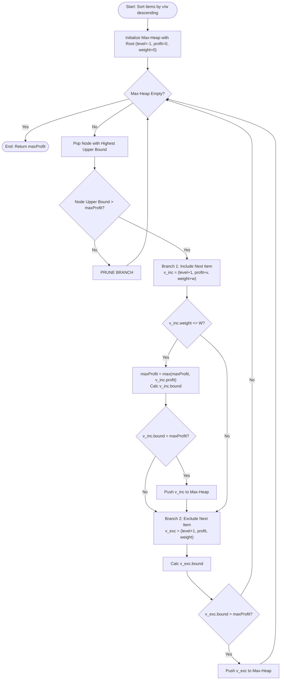

# 0/1 Knapsack Problem (Branch & Bound & Upper Bound Pruning)

## 1. Introduction

The **0/1 Knapsack Problem** is a classic optimization problem in computer science.

Given $N$ items, each with a weight $w_i$ and a value $v_i$, and a knapsack with maximum weight capacity $W$, the goal is to **select a subset of items to maximize the total value** without exceeding the weight limit $W$.

While Dynamic Programming solves 0/1 Knapsack in $O(N \cdot W)$ pseudo-polynomial time, **Branch & Bound** provides an exact solution whose performance depends on item count $N$ rather than capacity $W$. This makes Branch & Bound superior when $W$ is extremely large (e.g., $W = 10^9$).

---

## 2. Why Use This Algorithm?

### Comparison of Approaches:
1. **Dynamic Programming ($O(N \cdot W)$):** Fails when capacity $W$ is huge (e.g., $W = 10^9$) due to array size limits.
2. **Branch & Bound ($O(2^N)$ worst-case, heavily pruned average):**
   Items are pre-sorted in descending order of value-to-weight ratio ($v_i / w_i$).
   An **Upper Bound** is computed for each state using the **Fractional Knapsack** greedy strategy. If `node.upperBound <= maxProfitFoundSoFar`, the subtree is pruned.

---

## 3. Real-World Applications

- **Financial Portfolio Capital Budgeting:** Choosing investment projects under large monetary budget constraints.
- **Cargo & Container Loading:** Maximizing cargo value placed into weight-restricted transport containers.
- **Resource Allocation in Cloud Systems:** Assigning workloads with memory/CPU demands to instances.

---

## 4. Prerequisites

- Sorting items by value density ($v_i / w_i$).
- Fractional Knapsack greedy upper bound calculation.
- Priority Queues (Max-Heap) for Best-First Search (LCBB).

---

## 5. Visualization

### Upper Bound Calculation (Greedy Fractional Knapsack)

```
Items (Sorted by v/w ratio):
Item 0: v=45, w=3  (ratio = 15.0)
Item 1: v=40, w=4  (ratio = 10.0)
Item 2: v=25, w=5  (ratio = 5.0)
Knapsack Capacity W = 10

Node at Level 0 (Item 0 included): currWeight=3, currValue=45
Remaining Capacity = 7
Greedy addition of Item 1 (w=4, v=40): currWeight=7, currValue=85
Remaining Capacity = 3
Fractional addition of Item 2: 3/5 * 25 = 15
Upper Bound = 45 + 40 + 15 = 100
```

### Mermaid Flowchart



---

## 6. How It Works

1. **Preprocessing:** Sort all items in descending order of value-to-weight ratio $v_i / w_i$.
2. **Upper Bound Calculation (Greedy Fractional Knapsack):**
   At any state node, compute the maximum possible value achievable by taking all remaining whole items possible, plus a fraction of the first item that doesn't fit completely.
3. **Max-Heap Priority Queue:** States are stored in a Max-Heap ordered by their computed upper bound.
4. **Pruning:** If a state's upper bound is less than or equal to `maxProfit` found so far, ignore it.

---

## 7. Step-by-Step Algorithm

1. Sort items by ratio $v_i / w_i$ descending.
2. Define `Node`: `level`, `profit`, `weight`, `bound`.
3. Compute root node upper bound with `level = -1`, `profit = 0`, `weight = 0`.
4. Insert root node into Max-Heap `pq`. Initialize `maxProfit = 0`.
5. While `pq` is not empty:
   - Pop node `u`.
   - If `u.bound > maxProfit`:
     - Set `nextLevel = u.level + 1`.
     - **Case 1 (Include Item):**
       - `weight = u.weight + items[nextLevel].weight`
       - `profit = u.profit + items[nextLevel].value`
       - If `weight <= W` and `profit > maxProfit`, update `maxProfit = profit`.
       - Compute upper bound for inclusion node. If `bound > maxProfit`, push to `pq`.
     - **Case 2 (Exclude Item):**
       - Create exclusion node with `weight = u.weight`, `profit = u.profit`.
       - Compute upper bound. If `bound > maxProfit`, push to `pq`.
6. Return `maxProfit`.

---

## 8. Pseudocode

```text
function solveKnapsackBranchAndBound(W, items):
    sort items by (value / weight) descending
    
    pq = MaxPriorityQueueSortedByBound()
    root = new Node(level = -1, profit = 0, weight = 0, bound = 0)
    root.bound = calculateUpperBound(root, W, items)
    pq.push(root)
    
    maxProfit = 0
    
    while pq is not empty:
        u = pq.pop()
        
        if u.bound > maxProfit:
            nextLevel = u.level + 1
            
            // Include next item
            incNode = new Node(level = nextLevel, profit = u.profit + items[nextLevel].value, weight = u.weight + items[nextLevel].weight)
            if incNode.weight <= W and incNode.profit > maxProfit:
                maxProfit = incNode.profit
            
            incNode.bound = calculateUpperBound(incNode, W, items)
            if incNode.bound > maxProfit:
                pq.push(incNode)
                
            // Exclude next item
            excNode = new Node(level = nextLevel, profit = u.profit, weight = u.weight)
            excNode.bound = calculateUpperBound(excNode, W, items)
            if excNode.bound > maxProfit:
                pq.push(excNode)
                
    return maxProfit

function calculateUpperBound(node, W, items):
    if node.weight >= W:
        return 0
        
    bound = node.profit
    totalWeight = node.weight
    j = node.level + 1
    
    while j < length(items) and totalWeight + items[j].weight <= W:
        totalWeight += items[j].weight
        bound += items[j].value
        j += 1
        
    if j < length(items):
        bound += (W - totalWeight) * (items[j].value / items[j].weight)
        
    return bound
```

---

## 9. Code Examples

### C
```c
#include <stdio.h>
#include <stdlib.h>
#include <stdbool.h>

typedef struct {
    int weight;
    int value;
    double ratio;
} Item;

typedef struct {
    int level;
    int profit;
    int weight;
    double bound;
} Node;

int compareItems(const void* a, const void* b) {
    Item* itemA = (Item*)a;
    Item* itemB = (Item*)b;
    if (itemB->ratio > itemA->ratio) return 1;
    if (itemB->ratio < itemA->ratio) return -1;
    return 0;
}

double calculateBound(Node u, int n, int W, Item items[]) {
    if (u.weight >= W) return 0;
    double bound = u.profit;
    int j = u.level + 1;
    int totalWeight = u.weight;

    while (j < n && totalWeight + items[j].weight <= W) {
        totalWeight += items[j].weight;
        bound += items[j].value;
        j++;
    }

    if (j < n) {
        bound += (W - totalWeight) * items[j].ratio;
    }
    return bound;
}

int main() {
    int W = 10;
    int n = 3;
    Item items[] = {
        {3, 45, 15.0},
        {4, 40, 10.0},
        {5, 25, 5.0}
    };

    qsort(items, n, sizeof(Item), compareItems);

    Node u, v;
    u.level = -1;
    u.profit = 0;
    u.weight = 0;
    u.bound = calculateBound(u, n, W, items);

    int maxProfit = 0;

    // Simple Queue for Demonstration (BFS with bound check)
    Node queue[100];
    int head = 0, tail = 0;
    queue[tail++] = u;

    while (head < tail) {
        u = queue[head++];
        if (u.bound > maxProfit) {
            v.level = u.level + 1;

            // Include item
            v.weight = u.weight + items[v.level].weight;
            v.profit = u.profit + items[v.level].value;
            if (v.weight <= W && v.profit > maxProfit) {
                maxProfit = v.profit;
            }
            v.bound = calculateBound(v, n, W, items);
            if (v.bound > maxProfit) queue[tail++] = v;

            // Exclude item
            v.weight = u.weight;
            v.profit = u.profit;
            v.bound = calculateBound(v, n, W, items);
            if (v.bound > maxProfit) queue[tail++] = v;
        }
    }

    printf("Maximum Knapsack Value: %d\n", maxProfit);
    return 0;
}
```

### C++
```cpp
#include <iostream>
#include <vector>
#include <queue>
#include <algorithm>

using namespace std;

struct Item {
    int weight;
    int value;
    double ratio;
};

struct Node {
    int level;
    int profit;
    int weight;
    double bound;

    bool operator<(const Node& other) const {
        return bound < other.bound; // Max-Heap based on upper bound
    }
};

double calculateBound(Node u, int n, int W, const vector<Item>& items) {
    if (u.weight >= W) return 0;

    double profitBound = u.profit;
    int j = u.level + 1;
    int totalWeight = u.weight;

    while (j < n && totalWeight + items[j].weight <= W) {
        totalWeight += items[j].weight;
        profitBound += items[j].value;
        j++;
    }

    if (j < n) {
        profitBound += (W - totalWeight) * items[j].ratio;
    }

    return profitBound;
}

int knapsackBranchAndBound(int W, vector<Item>& items) {
    int n = items.size();
    sort(items.begin(), items.end(), [](const Item& a, const Item& b) {
        return a.ratio > b.ratio;
    });

    priority_queue<Node> pq;
    Node u, v;

    u.level = -1;
    u.profit = 0;
    u.weight = 0;
    u.bound = calculateBound(u, n, W, items);

    pq.push(u);
    int maxProfit = 0;

    while (!pq.empty()) {
        u = pq.top();
        pq.pop();

        if (u.bound > maxProfit) {
            v.level = u.level + 1;

            // Option 1: Include item v.level
            v.weight = u.weight + items[v.level].weight;
            v.profit = u.profit + items[v.level].value;

            if (v.weight <= W && v.profit > maxProfit) {
                maxProfit = v.profit;
            }

            v.bound = calculateBound(v, n, W, items);
            if (v.bound > maxProfit) {
                pq.push(v);
            }

            // Option 2: Exclude item v.level
            v.weight = u.weight;
            v.profit = u.profit;
            v.bound = calculateBound(v, n, W, items);

            if (v.bound > maxProfit) {
                pq.push(v);
            }
        }
    }

    return maxProfit;
}

int main() {
    int W = 10;
    vector<Item> items = {
        {3, 45, 15.0},
        {4, 40, 10.0},
        {5, 25, 5.0}
    };

    cout << "Maximum Knapsack Value: " << knapsackBranchAndBound(W, items) << "\n";
    return 0;
}
```

### Java
```java
import java.util.Arrays;
import java.util.PriorityQueue;

public class KnapsackBranchAndBound {

    static class Item implements Comparable<Item> {
        int weight;
        int value;
        double ratio;

        Item(int weight, int value) {
            this.weight = weight;
            this.value = value;
            this.ratio = (double) value / weight;
        }

        @Override
        public int compareTo(Item o) {
            return Double.compare(o.ratio, this.ratio); // Descending ratio
        }
    }

    static class Node implements Comparable<Node> {
        int level;
        int profit;
        int weight;
        double bound;

        Node(int level, int profit, int weight, double bound) {
            this.level = level;
            this.profit = profit;
            this.weight = weight;
            this.bound = bound;
        }

        @Override
        public int compareTo(Node o) {
            return Double.compare(o.bound, this.bound); // Max-Heap by upper bound
        }
    }

    private static double calculateBound(Node u, int n, int W, Item[] items) {
        if (u.weight >= W) return 0;

        double profitBound = u.profit;
        int j = u.level + 1;
        int totalWeight = u.weight;

        while (j < n && totalWeight + items[j].weight <= W) {
            totalWeight += items[j].weight;
            profitBound += items[j].value;
            j++;
        }

        if (j < n) {
            profitBound += (W - totalWeight) * items[j].ratio;
        }

        return profitBound;
    }

    public static int solveKnapsack(int W, Item[] items) {
        int n = items.length;
        Arrays.sort(items);

        PriorityQueue<Node> pq = new PriorityQueue<>();
        Node root = new Node(-1, 0, 0, 0);
        root.bound = calculateBound(root, n, W, items);
        pq.add(root);

        int maxProfit = 0;

        while (!pq.isEmpty()) {
            Node u = pq.poll();

            if (u.bound > maxProfit) {
                int nextLevel = u.level + 1;

                // Include item
                int incWeight = u.weight + items[nextLevel].weight;
                int incProfit = u.profit + items[nextLevel].value;

                if (incWeight <= W && incProfit > maxProfit) {
                    maxProfit = incProfit;
                }

                Node incNode = new Node(nextLevel, incProfit, incWeight, 0);
                incNode.bound = calculateBound(incNode, n, W, items);
                if (incNode.bound > maxProfit) pq.add(incNode);

                // Exclude item
                Node excNode = new Node(nextLevel, u.profit, u.weight, 0);
                excNode.bound = calculateBound(excNode, n, W, items);
                if (excNode.bound > maxProfit) pq.add(excNode);
            }
        }

        return maxProfit;
    }

    public static void main(String[] args) {
        int W = 10;
        Item[] items = {
            new Item(3, 45),
            new Item(4, 40),
            new Item(5, 25)
        };

        System.out.println("Maximum Knapsack Value: " + solveKnapsack(W, items));
    }
}
```

### Python
```python
import heapq

class Item:
    def __init__(self, weight, value):
        self.weight = weight
        self.value = value
        self.ratio = value / weight


class Node:
    def __init__(self, level, profit, weight, bound):
        self.level = level
        self.profit = profit
        self.weight = weight
        self.bound = bound

    def __lt__(self, other):
        return self.bound > other.bound  # Max-Heap by upper bound


def calculate_bound(node, n, W, items):
    if node.weight >= W:
        return 0

    profit_bound = node.profit
    j = node.level + 1
    total_weight = node.weight

    while j < n and total_weight + items[j].weight <= W:
        total_weight += items[j].weight
        profit_bound += items[j].value
        j += 1

    if j < n:
        profit_bound += (W - total_weight) * items[j].ratio

    return profit_bound


def knapsack_branch_and_bound(W, items):
    items.sort(key=lambda x: x.ratio, reverse=True)
    n = len(items)

    pq = []
    root = Node(-1, 0, 0, 0)
    root.bound = calculate_bound(root, n, W, items)

    heapq.heappush(pq, root)
    max_profit = 0

    while pq:
        u = heapq.heappop(pq)

        if u.bound > max_profit:
            next_level = u.level + 1

            # Include next item
            v_inc = Node(
                next_level,
                u.profit + items[next_level].value,
                u.weight + items[next_level].weight,
                0
            )

            if v_inc.weight <= W and v_inc.profit > max_profit:
                max_profit = v_inc.profit

            v_inc.bound = calculate_bound(v_inc, n, W, items)
            if v_inc.bound > max_profit:
                heapq.heappush(pq, v_inc)

            # Exclude next item
            v_exc = Node(next_level, u.profit, u.weight, 0)
            v_exc.bound = calculate_bound(v_exc, n, W, items)
            if v_exc.bound > max_profit:
                heapq.heappush(pq, v_exc)

    return max_profit


if __name__ == "__main__":
    items = [Item(3, 45), Item(4, 40), Item(5, 25)]
    W = 10
    print(f"Maximum Knapsack Value: {knapsack_branch_and_bound(W, items)}")
```

### JavaScript
```javascript
class MaxPriorityQueue {
    constructor() {
        this.heap = [];
    }

    push(node) {
        this.heap.push(node);
        this._up(this.heap.length - 1);
    }

    pop() {
        if (this.heap.length === 0) return null;
        const top = this.heap[0];
        const bottom = this.heap.pop();
        if (this.heap.length > 0) {
            this.heap[0] = bottom;
            this._down(0);
        }
        return top;
    }

    isEmpty() { return this.heap.length === 0; }

    _up(i) {
        while (i > 0) {
            const p = (i - 1) >> 1;
            if (this.heap[i].bound > this.heap[p].bound) {
                [this.heap[i], this.heap[p]] = [this.heap[p], this.heap[i]];
                i = p;
            } else break;
        }
    }

    _down(i) {
        const len = this.heap.length;
        while ((i << 1) + 1 < len) {
            let left = (i << 1) + 1, right = left + 1, best = left;
            if (right < len && this.heap[right].bound > this.heap[left].bound) {
                best = right;
            }
            if (this.heap[best].bound > this.heap[i].bound) {
                [this.heap[i], this.heap[best]] = [this.heap[best], this.heap[i]];
                i = best;
            } else break;
        }
    }
}

function calculateBound(node, n, W, items) {
    if (node.weight >= W) return 0;

    let profitBound = node.profit;
    let j = node.level + 1;
    let totalWeight = node.weight;

    while (j < n && totalWeight + items[j].weight <= W) {
        totalWeight += items[j].weight;
        profitBound += items[j].value;
        j++;
    }

    if (j < n) {
        profitBound += (W - totalWeight) * items[j].ratio;
    }

    return profitBound;
}

function knapsackBranchAndBound(W, items) {
    items.sort((a, b) => b.ratio - a.ratio);
    const n = items.length;

    const pq = new MaxPriorityQueue();
    const root = { level: -1, profit: 0, weight: 0, bound: 0 };
    root.bound = calculateBound(root, n, W, items);
    pq.push(root);

    let maxProfit = 0;

    while (!pq.isEmpty()) {
        const u = pq.pop();

        if (u.bound > maxProfit) {
            const nextLevel = u.level + 1;

            // Include
            const incWeight = u.weight + items[nextLevel].weight;
            const incProfit = u.profit + items[nextLevel].value;

            if (incWeight <= W && incProfit > maxProfit) {
                maxProfit = incProfit;
            }

            const incNode = { level: nextLevel, profit: incProfit, weight: incWeight, bound: 0 };
            incNode.bound = calculateBound(incNode, n, W, items);
            if (incNode.bound > maxProfit) pq.push(incNode);

            // Exclude
            const excNode = { level: nextLevel, profit: u.profit, weight: u.weight, bound: 0 };
            excNode.bound = calculateBound(excNode, n, W, items);
            if (excNode.bound > maxProfit) pq.push(excNode);
        }
    }

    return maxProfit;
}

const W = 10;
const items = [
    { weight: 3, value: 45, ratio: 15.0 },
    { weight: 4, value: 40, ratio: 10.0 },
    { weight: 5, value: 25, ratio: 5.0 }
];

console.log(`Maximum Knapsack Value: ${knapsackBranchAndBound(W, items)}`);
```

---

## 10. Code Explanation

- **Greedy Upper Bound:** Uses Fractional Knapsack logic. Because Fractional Knapsack is an upper bound on 0/1 Knapsack, any 0/1 choice sequence cannot exceed this bound.
- **Max-Heap Priority Queue:** Popping the node with the highest upper bound ensures Best-First Search, discovering high-value full knapsack paths quickly to prune other branches early.
- **Pruning Check (`bound > maxProfit`):** If a node's upper bound is less than or equal to `maxProfit`, its entire subtree is discarded.

---

## 11. Interactive Demo

Visual setup for Knapsack Branch and Bound:
1. **Item Input Panel:** Add items with weights and values, and specify knapsack capacity $W$.
2. **State Space Tree Animation:** Displays nodes created, upper bounds calculated, and red crosses on pruned branches.

---

## 12. Dry Run

Tracing items `[(3, 45), (4, 40), (5, 25)]` with $W = 10$:

| Step | Node Level | Weight | Profit | Upper Bound | Max Profit | Action |
|------|------------|--------|--------|-------------|------------|--------|
| Root | -1 | 0 | 0 | 100.0 | 0 | Push Root |
| Pop Root | Include Item 0 | 3 | 45 | 100.0 | 45 | Push Inc (b=100.0) |
| Pop Root | Exclude Item 0 | 0 | 0 | 55.0 | 45 | Push Exc (b=55.0) |
| Pop Inc(0) | Include Item 1 | 7 | 85 | 100.0 | 85 | Push Inc (b=100.0) |
| Pop Inc(0) | Exclude Item 1 | 3 | 45 | 70.0 | 85 | Pruned (b=70 <= 85) |
| Pop Inc(1) | Include Item 2 | 12 | 110 | Exceeds W | 85 | Rejected |
| Pop Inc(1) | Exclude Item 2 | 7 | 85 | 85.0 | 85 | Terminated |

**Final Optimal Value:** 85 (Items 0 and 1)

---

## 13. Time & Space Complexity

| Case | Time Complexity | Space Complexity | Reason |
|------|-----------------|------------------|--------|
| Worst Case | $O(2^N)$ | $O(2^N)$ | When upper bounds fail to prune effectively. |
| Average Case | Heavily Pruned | $O(2^N)$ | Upper bound cuts majority of search tree branches. |

---

## 14. Advantages

- **Independent of Capacity $W$:** Works efficiently even when $W = 10^9$ where DP memory/time fails.
- **Exact Solution:** Guarantees globally optimal 0/1 item choices.

---

## 15. Disadvantages

- **Worst-Case Exponential:** Space can grow up to $O(2^N)$ storing priority queue states in bad input cases.

---

## 16. Applications

- Financial budget allocation.
- Container loading systems.
- Resource management in OS and cloud schedulers.

---

## 17. Common Mistakes

- **Not Sorting Items by $v/w$:** Fractional knapsack bound is invalid unless items are sorted descending by ratio.
- **Incorrect Bound Condition:** Using strictly greater `>` vs `>=` inconsistently during upper bound pruning checks.

---

## 18. Interview Questions

1. When is Branch & Bound preferred over Dynamic Programming for 0/1 Knapsack?
2. Why is Fractional Knapsack used to calculate the upper bound in 0/1 Knapsack Branch & Bound?
3. What is the difference between BFS Branch & Bound and Least-Cost Branch & Bound (LCBB)?

---

## 19. Practice Problems

1. **LeetCode 474:** Ones and Zeroes (2D Knapsack variant)
2. **GFG:** 0/1 Knapsack Problem using Branch and Bound

---

## 20. Related Algorithms

- **Fractional Knapsack:** Greedy $O(N \log N)$ algorithm.
- **Dynamic Programming 0/1 Knapsack:** Pseudo-polynomial $O(N \cdot W)$ algorithm.

---

## 21. Summary

Knapsack Branch & Bound uses greedy Fractional Knapsack upper bounds to prune decision trees in 0/1 Knapsack, finding optimal item selections efficiently regardless of capacity $W$.

---

## 22. Quiz

**Question 1:** Why is Fractional Knapsack used to compute the upper bound in 0/1 Knapsack Branch & Bound?
- A) Because it is faster than sorting.
- B) Because Fractional Knapsack provides an optimistic (upper bound) estimate for 0/1 Knapsack choices.
- C) Because it eliminates the need for a priority queue.
- D) Because Fractional Knapsack works only on integers.
- **Correct Answer:** B
- **Explanation:** Fractional Knapsack allows fractional items, giving a value at least as high as any valid 0/1 selection, forming a valid upper bound.

**Question 2:** If a state node has an upper bound of 50 and current `maxProfit` found is 60, what should be done with the node?
- A) Push it into the queue.
- B) Prune (discard) the node.
- C) Multiply its profit by 2.
- D) Re-sort the items.
- **Correct Answer:** B
- **Explanation:** Since its maximum potential output (50) cannot beat the best solution already found (60), its entire subtree is pruned.
