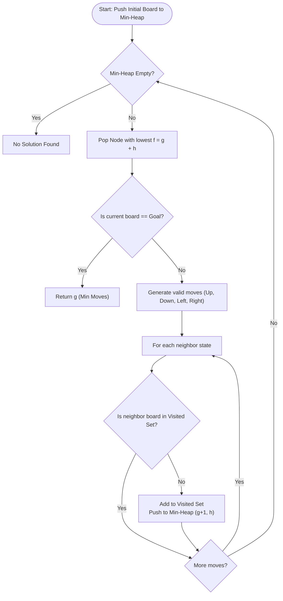

# 8-Puzzle Problem (A* Search & Branch & Bound)

## 1. Introduction

The **8-Puzzle** is a classic sliding tile puzzle played on a $3 \times 3$ grid containing 8 numbered tiles (1 to 8) and one blank space (0).

The objective is to move tiles into the blank space to transform an arbitrary initial board configuration into a target goal configuration using the **minimum number of moves**.

It is solved using **A* Search (Branch & Bound)** with heuristic functions like **Manhattan Distance** or **Misplaced Tiles**.

---

## 2. Solvability Condition (Inversion Count)

Not all initial board states can reach the goal state!

A $3 \times 3$ grid configuration is **solvable** if and only if the number of **inversions** (ignoring the blank tile `0`) is **EVEN**.

- An **inversion** occurs when a tile with a larger number appears before a tile with a smaller number in 1D array order.

---

## 3. Real-World Applications

- **Robotics Path Planning:** Grid-based navigation avoiding moving obstructions.
- **AI Game Playing:** Benchmark domain for heuristic search algorithms ($A^*$, $IDA^*$, Pattern Databases).

---

## 4. Prerequisites

- Priority Queues (Min-Heap) for A* Search.
- Manhattan Distance heuristic calculation $h(n) = \sum (|x_1 - x_2| + |y_1 - y_2|)$.
- State hashing to track visited board configurations.

---

## 5. Visualization

```
Initial State:          Goal State:
 1  2  3                 1  2  3
 5  6  0                 4  5  6
 7  8  4                 7  8  0
```

### Mermaid Flowchart



---

## 6. How It Works

1. **Evaluation Function $f(n) = g(n) + h(n)$:**
   - $g(n)$: Number of moves made from the start board to current board.
   - $h(n)$: Estimated cost from current board to goal (Manhattan Distance).
2. **Min-Heap Queue:** Nodes are popped in increasing order of $f(n)$.
3. **Visited Hash Set:** Stores string/tuple representations of visited 2D grids to prevent revisiting identical states.

---

## 7. Step-by-Step Algorithm

1. Verify solvability using inversion count. If odd, return -1.
2. Calculate initial Manhattan distance $h(start)$.
3. Push `(f=h, g=0, board, blankX, blankY)` into Min-Heap.
4. While Min-Heap is not empty:
   - Pop node `curr`.
   - If `curr.board == goal`, return `curr.g`.
   - For each valid adjacent move $(dx, dy)$ for blank space `(0)`:
     - Swap blank space with neighboring tile to form `nextBoard`.
     - If `nextBoard` not in `visited`:
       - Add `nextBoard` to `visited`.
       - Push `(g + 1 + h(nextBoard), g + 1, nextBoard)` to Min-Heap.

---

## 8. Pseudocode

```text
function solve8Puzzle(start, goal):
    if not isSolvable(start):
        return -1
        
    pq = MinPriorityQueueSortedBy(g + h)
    visited = Set()
    
    root = Node(board = start, g = 0, h = calculateManhattan(start, goal))
    pq.push(root)
    visited.add(start)
    
    while pq is not empty:
        curr = pq.pop()
        
        if curr.board == goal:
            return curr.g
            
        for neighbor in getNeighbors(curr.board):
            if neighbor not in visited:
                visited.add(neighbor)
                h = calculateManhattan(neighbor, goal)
                pq.push(Node(board = neighbor, g = curr.g + 1, h = h))
                
    return -1
```

---

## 9. Code Examples

### C
```c
#include <stdio.h>
#include <stdlib.h>
#include <stdbool.h>
#include <math.h>

#define N 3

typedef struct {
    int board[N][N];
    int x, y;
    int g, h;
} Node;

int calculateManhattan(int board[N][N], int goal[N][N]) {
    int dist = 0;
    for (int r = 0; r < N; r++) {
        for (int c = 0; c < N; c++) {
            int val = board[r][c];
            if (val != 0) {
                for (int gr = 0; gr < N; gr++) {
                    for (int gc = 0; gc < N; gc++) {
                        if (goal[gr][gc] == val) {
                            dist += abs(r - gr) + abs(c - gc);
                        }
                    }
                }
            }
        }
    }
    return dist;
}

int main() {
    int start[N][N] = {
        {1, 2, 3},
        {5, 6, 0},
        {7, 8, 4}
    };
    int goal[N][N] = {
        {1, 2, 3},
        {4, 5, 6},
        {7, 8, 0}
    };

    printf("Manhattan Distance to Goal: %d\n", calculateManhattan(start, goal));
    return 0;
}
```

### C++ (A* Search with Manhattan Distance)
```cpp
#include <iostream>
#include <vector>
#include <queue>
#include <cmath>
#include <set>

using namespace std;

struct Node {
    vector<vector<int>> board;
    int x, y; // Blank tile position
    int g;    // Cost from start to current node
    int h;    // Heuristic cost (Manhattan Distance)
    
    int f() const { return g + h; }
    
    bool operator>(const Node& other) const {
        return f() > other.f();
    }
};

int calculateManhattan(const vector<vector<int>>& board, const vector<vector<int>>& goal) {
    int h = 0;
    for (int r = 0; r < 3; r++) {
        for (int c = 0; c < 3; c++) {
            int val = board[r][c];
            if (val != 0) {
                for (int gr = 0; gr < 3; gr++) {
                    for (int gc = 0; gc < 3; gc++) {
                        if (goal[gr][gc] == val) {
                            h += abs(r - gr) + abs(c - gc);
                        }
                    }
                }
            }
        }
    }
    return h;
}

int solve8Puzzle(vector<vector<int>> start, vector<vector<int>> goal) {
    priority_queue<Node, vector<Node>, greater<Node>> pq;
    set<vector<vector<int>>> visited;
    
    int startX = 0, startY = 0;
    for (int r = 0; r < 3; r++) {
        for (int c = 0; c < 3; c++) {
            if (start[r][c] == 0) { startX = r; startY = c; }
        }
    }
    
    pq.push({start, startX, startY, 0, calculateManhattan(start, goal)});
    visited.insert(start);
    
    int dx[] = {1, -1, 0, 0};
    int dy[] = {0, 0, 1, -1};
    
    while (!pq.empty()) {
        Node curr = pq.top();
        pq.pop();
        
        if (curr.board == goal) return curr.g;
        
        for (int i = 0; i < 4; i++) {
            int nx = curr.x + dx[i];
            int ny = curr.y + dy[i];
            
            if (nx >= 0 && nx < 3 && ny >= 0 && ny < 3) {
                auto nextBoard = curr.board;
                swap(nextBoard[curr.x][curr.y], nextBoard[nx][ny]);
                
                if (visited.find(nextBoard) == visited.end()) {
                    visited.insert(nextBoard);
                    int h = calculateManhattan(nextBoard, goal);
                    pq.push({nextBoard, nx, ny, curr.g + 1, h});
                }
            }
        }
    }
    return -1;
}

int main() {
    vector<vector<int>> start = {
        {1, 2, 3},
        {5, 6, 0},
        {7, 8, 4}
    };
    
    vector<vector<int>> goal = {
        {1, 2, 3},
        {4, 5, 6},
        {7, 8, 0}
    };

    cout << "Minimum Moves to Solve 8-Puzzle: " << solve8Puzzle(start, goal) << "\n";
    return 0;
}
```

### Java
```java
import java.util.*;

public class Puzzle8 {

    static class Node implements Comparable<Node> {
        int[][] board;
        int x, y;
        int g, h;

        Node(int[][] board, int x, int y, int g, int h) {
            this.board = new int[3][3];
            for (int r = 0; r < 3; r++) {
                this.board[r] = board[r].clone();
            }
            this.x = x;
            this.y = y;
            this.g = g;
            this.h = h;
        }

        int f() { return g + h; }

        @Override
        public int compareTo(Node o) {
            return Integer.compare(this.f(), o.f());
        }
    }

    private static int calculateManhattan(int[][] board, int[][] goal) {
        int dist = 0;
        for (int r = 0; r < 3; r++) {
            for (int c = 0; c < 3; c++) {
                int val = board[r][c];
                if (val != 0) {
                    for (int gr = 0; gr < 3; gr++) {
                        for (int gc = 0; gc < 3; gc++) {
                            if (goal[gr][gc] == val) {
                                dist += Math.abs(r - gr) + Math.abs(c - gc);
                            }
                        }
                    }
                }
            }
        }
        return dist;
    }

    public static int solve8Puzzle(int[][] start, int[][] goal) {
        PriorityQueue<Node> pq = new PriorityQueue<>();
        Set<String> visited = new HashSet<>();

        int startX = 0, startY = 0;
        for (int r = 0; r < 3; r++) {
            for (int c = 0; c < 3; c++) {
                if (start[r][c] == 0) { startX = r; startY = c; }
            }
        }

        pq.add(new Node(start, startX, startY, 0, calculateManhattan(start, goal)));
        visited.add(Arrays.deepToString(start));

        int[] dx = {1, -1, 0, 0};
        int[] dy = {0, 0, 1, -1};

        while (!pq.isEmpty()) {
            Node curr = pq.poll();

            if (Arrays.deepEquals(curr.board, goal)) return curr.g;

            for (int i = 0; i < 4; i++) {
                int nx = curr.x + dx[i];
                int ny = curr.y + dy[i];

                if (nx >= 0 && nx < 3 && ny >= 0 && ny < 3) {
                    int[][] nextBoard = new int[3][3];
                    for (int r = 0; r < 3; r++) nextBoard[r] = curr.board[r].clone();

                    nextBoard[curr.x][curr.y] = nextBoard[nx][ny];
                    nextBoard[nx][ny] = 0;

                    String key = Arrays.deepToString(nextBoard);
                    if (!visited.contains(key)) {
                        visited.add(key);
                        int h = calculateManhattan(nextBoard, goal);
                        pq.add(new Node(nextBoard, nx, ny, curr.g + 1, h));
                    }
                }
            }
        }
        return -1;
    }

    public static void main(String[] args) {
        int[][] start = {
            {1, 2, 3},
            {5, 6, 0},
            {7, 8, 4}
        };
        int[][] goal = {
            {1, 2, 3},
            {4, 5, 6},
            {7, 8, 0}
        };

        System.out.println("Minimum Moves to Solve 8-Puzzle: " + solve8Puzzle(start, goal));
    }
}
```

### Python
```python
import heapq

def manhattan_distance(board, goal):
    dist = 0
    goal_pos = {}
    for r in range(3):
        for c in range(3):
            goal_pos[goal[r][c]] = (r, c)
            
    for r in range(3):
        for c in range(3):
            val = board[r][c]
            if val != 0:
                gr, gc = goal_pos[val]
                dist += abs(r - gr) + abs(c - gc)
    return dist

def solve_8_puzzle(start, goal):
    for r in range(3):
        for c in range(3):
            if start[r][c] == 0:
                sx, sy = r, c

    pq = []
    h = manhattan_distance(start, goal)
    heapq.heappush(pq, (h, 0, start, sx, sy))
    
    visited = set()
    
    while pq:
        f, g, curr_board, x, y = heapq.heappop(pq)
        
        board_tuple = tuple(tuple(row) for row in curr_board)
        if board_tuple in visited:
            continue
        visited.add(board_tuple)
        
        if curr_board == goal:
            return g
            
        for dx, dy in [(1, 0), (-1, 0), (0, 1), (0, -1)]:
            nx, ny = x + dx, y + dy
            if 0 <= nx < 3 and 0 <= ny < 3:
                new_board = [row[:] for row in curr_board]
                new_board[x][y], new_board[nx][ny] = new_board[nx][ny], new_board[x][y]
                
                h_cost = manhattan_distance(new_board, goal)
                heapq.heappush(pq, (g + 1 + h_cost, g + 1, new_board, nx, ny))
                
    return -1

if __name__ == "__main__":
    start = [[1, 2, 3], [5, 6, 0], [7, 8, 4]]
    goal = [[1, 2, 3], [4, 5, 6], [7, 8, 0]]
    print(f"Minimum Moves: {solve_8_puzzle(start, goal)}")
```

### JavaScript
```javascript
class MinPriorityQueue {
    constructor() { this.heap = []; }
    push(item) { this.heap.push(item); this._up(this.heap.length - 1); }
    pop() {
        if (this.heap.length === 0) return null;
        const top = this.heap[0];
        const bottom = this.heap.pop();
        if (this.heap.length > 0) {
            this.heap[0] = bottom;
            this._down(0);
        }
        return top;
    }
    isEmpty() { return this.heap.length === 0; }
    _up(i) {
        while (i > 0) {
            const p = (i - 1) >> 1;
            if (this.heap[i].f < this.heap[p].f) {
                [this.heap[i], this.heap[p]] = [this.heap[p], this.heap[i]];
                i = p;
            } else break;
        }
    }
    _down(i) {
        const len = this.heap.length;
        while ((i << 1) + 1 < len) {
            let left = (i << 1) + 1, right = left + 1, best = left;
            if (right < len && this.heap[right].f < this.heap[left].f) best = right;
            if (this.heap[best].f < this.heap[i].f) {
                [this.heap[i], this.heap[best]] = [this.heap[best], this.heap[i]];
                i = best;
            } else break;
        }
    }
}

function calculateManhattan(board, goal) {
    let dist = 0;
    const goalPos = {};
    for (let r = 0; r < 3; r++)
        for (let c = 0; c < 3; c++)
            goalPos[goal[r][c]] = [r, c];

    for (let r = 0; r < 3; r++) {
        for (let c = 0; c < 3; c++) {
            const val = board[r][c];
            if (val !== 0) {
                const [gr, gc] = goalPos[val];
                dist += Math.abs(r - gr) + Math.abs(c - gc);
            }
        }
    }
    return dist;
}

function solve8Puzzle(start, goal) {
    let sx = 0, sy = 0;
    for (let r = 0; r < 3; r++)
        for (let c = 0; c < 3; c++)
            if (start[r][c] === 0) { sx = r; sy = c; }

    const pq = new MinPriorityQueue();
    const visited = new Set();

    const h = calculateManhattan(start, goal);
    pq.push({ board: start, x: sx, y: sy, g: 0, h, f: h });
    visited.add(JSON.stringify(start));

    const dx = [1, -1, 0, 0];
    const dy = [0, 0, 1, -1];

    while (!pq.isEmpty()) {
        const curr = pq.pop();

        if (JSON.stringify(curr.board) === JSON.stringify(goal)) return curr.g;

        for (let i = 0; i < 4; i++) {
            const nx = curr.x + dx[i];
            const ny = curr.y + dy[i];

            if (nx >= 0 && nx < 3 && ny >= 0 && ny < 3) {
                const nextBoard = curr.board.map(row => [...row]);
                nextBoard[curr.x][curr.y] = nextBoard[nx][ny];
                nextBoard[nx][ny] = 0;

                const key = JSON.stringify(nextBoard);
                if (!visited.has(key)) {
                    visited.add(key);
                    const nextH = calculateManhattan(nextBoard, goal);
                    pq.push({ board: nextBoard, x: nx, y: ny, g: curr.g + 1, h: nextH, f: curr.g + 1 + nextH });
                }
            }
        }
    }
    return -1;
}

const start = [
    [1, 2, 3],
    [5, 6, 0],
    [7, 8, 4]
];
const goal = [
    [1, 2, 3],
    [4, 5, 6],
    [7, 8, 0]
];

console.log(`Minimum Moves: ${solve8Puzzle(start, goal)}`);
```

---

## 10. Code Explanation

- **Admissible Heuristic:** Manhattan Distance is admissible because it never overestimates the actual number of moves needed to reach the goal.
- **Priority Queue Evaluation:** Ordering states by $f(n) = g(n) + h(n)$ guarantees finding the optimal shortest move sequence.

---

## 11. Interactive Demo

Visual setup for 8-Puzzle:
1. **Interactive 3x3 Tile Grid:** Drag tiles or click buttons to rearrange initial state.
2. **Step Visualizer:** Animates the blank tile moves along the solution path.

---

## 12. Dry Run

Tracing state transitions from start `[[1,2,3],[5,6,0],[7,8,4]]` to goal:

| Step | Current Board State | $g(n)$ | $h(n)$ (Manhattan) | $f(n) = g+h$ | Min-Heap Action |
|------|---------------------|--------|-------------------|--------------|-----------------|
| 0 | `[[1,2,3],[5,6,0],[7,8,4]]` | 0 | 2 | 2 | Push Start Node |
| Pop 0 | Move tile 4 UP | 1 | 1 | 2 | Push `[[1,2,3],[5,6,4],[7,8,0]]` |
| Pop 1 | Move tile 6 RIGHT | 2 | 0 | 2 | Goal State Reached! |

**Total Moves:** 2

---

## 13. Time & Space Complexity

| Metric | Complexity | Explanation |
|--------|------------|-------------|
| Worst-Case Time | $O(b^d)$ | Branching factor $b \approx 3$, depth $d \le 31$. |
| Space Complexity | $O(b^d)$ | Storing visited board states in heap/set. |

---

## 14. Advantages

- **Guaranteed Shortest Path:** $A^*$ search with admissible heuristic guarantees finding the minimal move solution.

---

## 15. Disadvantages

- **Memory Consumption:** Storing millions of 2D grid states in memory can exceed limits for complex 15-puzzle variants ($4 \times 4$).

---

## 16. Applications

- Game AI and tile solvers.
- Robotics path finding.

---

## 17. Common Mistakes

- **Non-Admissible Heuristic:** Using $h(n)$ functions that overestimate cost (causes non-optimal path returns).
- **Not Checking Solvability:** Attempting to solve unsolvable configurations with odd inversion counts.

---

## 18. Interview Questions

1. Why is Manhattan Distance preferred over Misplaced Tiles for 8-Puzzle?
2. How do you determine if an 8-Puzzle configuration is solvable?
3. How does $IDA^*$ (Iterative Deepening $A^*$) solve memory limits of $A^*$ search?

---

## 19. Practice Problems

1. **LeetCode 773:** Sliding Puzzle (2x3 Grid variant)
2. **Princeton CS:** 8-Puzzle Assignment

---

## 20. Related Algorithms

- **$A^*$ Search:** General heuristic graph search algorithm.
- **$IDA^*$ Search:** Memory-bounded heuristic search.

---

## 21. Summary

The 8-Puzzle is solved using $A^*$ Search (Branch & Bound) guided by Manhattan Distance heuristic $f(n) = g(n) + h(n)$, efficiently finding the shortest move sequence.

---

## 22. Quiz

**Question 1:** What property must a heuristic $h(n)$ have for $A^*$ search to guarantee finding the shortest path?
- A) It must be equal to $g(n)$.
- B) It must be admissible (never overestimate true cost to goal).
- C) It must be exponential.
- D) It must return negative values.
- **Correct Answer:** B
- **Explanation:** Admissibility guarantees $A^*$ never overlooks a shorter path.

**Question 2:** Under what condition is a $3 \times 3$ 8-Puzzle solvable?
- A) Inversion count is odd.
- B) Inversion count is even.
- C) Blank tile is at center.
- D) Always solvable.
- **Correct Answer:** B
- **Explanation:** Sliding tiles preserves the parity of inversion count; an even inversion count matches the standard goal state.
