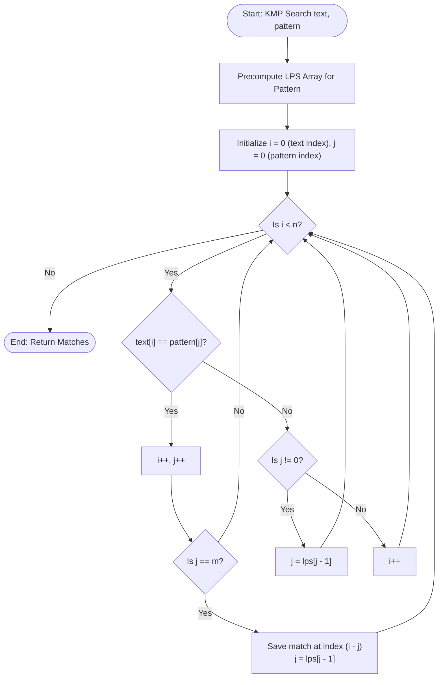

# Knuth-Morris-Pratt (KMP) Algorithm (LPS Array & Pattern Matching)

## 1. Introduction

The **Knuth-Morris-Pratt (KMP)** algorithm is a classic string-matching algorithm that searches for occurrences of a pattern string $P$ of length $m$ within a text string $T$ of length $n$ in **$O(n + m)$ linear time**.

Unlike naïve string matching which re-scans text characters after a mismatch ($O(n \cdot m)$ worst case), KMP uses information about the pattern itself to skip redundant comparisons.

It achieves this by precomputing the **Longest Proper Prefix which is also a Suffix (LPS)** array (also known as the prefix function $\pi$).

---

## 2. Why Use This Algorithm?

### Naïve Matching vs KMP:
- **Naïve Matching ($O(n \cdot m)$):** On text `AAAAAAAB` and pattern `AAAB`, naïve re-checks characters multiple times, taking $O(n \cdot m)$ operations.
- **KMP ($O(n + m)$):** Never backtracks the text pointer `i`. When a mismatch occurs at `pattern[j]`, `j` skips back to `lps[j-1]`, continuing comparison without re-reading text.

---

## 3. Real-World Applications

- **Text Editors & Search Utilities:** Implementation of `ctrl+F` or `grep` searches.
- **Bioinformatics:** Locating specific DNA/RNA sequence motifs within long genome strings.
- **Plagiarism Detection:** Finding exact overlapping text passages.

---

## 4. Prerequisites

- String indexing and substring concepts.
- Understanding prefixes and suffixes.

---

## 5. Visualization

### LPS Array Precomputation for Pattern ` "ONION" `

```
Pattern:  O  N  I  O  N
Index:    0  1  2  3  4
LPS:     [0, 0, 0, 1, 2]

Explanation:
- LPS[0] = 0 ("O" has no proper prefix)
- LPS[1] = 0 ("ON" -> prefixes {"O"}, suffixes {"N"} -> max length 0)
- LPS[2] = 0 ("ONI" -> max matching prefix/suffix length 0)
- LPS[3] = 1 ("ONIO" -> prefix "O" matches suffix "O" -> length 1)
- LPS[4] = 2 ("ONION" -> prefix "ON" matches suffix "ON" -> length 2)
```

### Mermaid Flowchart



---

## 6. How It Works

1. **LPS Array Precomputation:**
   - Maintain `len` (length of previous longest prefix suffix) and index `i = 1`.
   - If `pattern[i] == pattern[len]`, increment `len`, set `lps[i] = len`, `i++`.
   - If mismatch and `len != 0`, fallback `len = lps[len - 1]`.
   - Else set `lps[i] = 0`, `i++`.
2. **Search Process:**
   - Scan text `i` from $0$ to $n-1$.
   - If `pattern[j] == text[i]`, advance both `i++` and `j++`.
   - When `j == m`, record match at `i - j` and set `j = lps[j - 1]`.
   - On mismatch, set `j = lps[j - 1]` without decreasing `i`.

---

## 7. Step-by-Step Algorithm

1. Precompute `lps` array of size $m$.
2. Set `i = 0`, `j = 0`.
3. While `i < n`:
   - If `text[i] == pattern[j]`, `i++`, `j++`.
   - If `j == m`:
     - Record match `i - j`.
     - Set `j = lps[j - 1]`.
   - Else if `i < n` and `text[i] != pattern[j]`:
     - If `j != 0`, set `j = lps[j - 1]`.
     - Else `i++`.

---

## 8. Pseudocode

```text
function KMPSearch(text, pattern):
    n = length(text)
    m = length(pattern)
    lps = computeLPS(pattern)
    
    i = 0 // text index
    j = 0 // pattern index
    matches = []
    
    while i < n:
        if pattern[j] == text[i]:
            i = i + 1
            j = j + 1
            
        if j == m:
            matches.append(i - j)
            j = lps[j - 1]
        else if i < n and pattern[j] != text[i]:
            if j != 0:
                j = lps[j - 1]
            else:
                i = i + 1
                
    return matches

function computeLPS(pattern):
    m = length(pattern)
    lps = array of size m initialized to 0
    len = 0
    i = 1
    
    while i < m:
        if pattern[i] == pattern[len]:
            len = len + 1
            lps[i] = len
            i = i + 1
        else:
            if len != 0:
                len = lps[len - 1]
            else:
                lps[i] = 0
                i = i + 1
    return lps
```

---

## 9. Code Examples

### C
```c
#include <stdio.h>
#include <string.h>
#include <stdlib.h>

void computeLPS(char* pattern, int m, int* lps) {
    int len = 0;
    lps[0] = 0;
    int i = 1;

    while (i < m) {
        if (pattern[i] == pattern[len]) {
            len++;
            lps[i] = len;
            i++;
        } else {
            if (len != 0) {
                len = lps[len - 1];
            } else {
                lps[i] = 0;
                i++;
            }
        }
    }
}

void KMPSearch(char* text, char* pattern) {
    int n = strlen(text);
    int m = strlen(pattern);
    int* lps = (int*)malloc(sizeof(int) * m);

    computeLPS(pattern, m, lps);

    int i = 0, j = 0;
    while (i < n) {
        if (pattern[j] == text[i]) {
            i++;
            j++;
        }

        if (j == m) {
            printf("Found pattern at index %d\n", i - j);
            j = lps[j - 1];
        } else if (i < n && pattern[j] != text[i]) {
            if (j != 0) {
                j = lps[j - 1];
            } else {
                i++;
            }
        }
    }

    free(lps);
}

int main() {
    char text[] = "ABABDABACDABABCABAB";
    char pattern[] = "ABABCABAB";
    KMPSearch(text, pattern);
    return 0;
}
```

### C++
```cpp
#include <iostream>
#include <vector>
#include <string>

using namespace std;

vector<int> computeLPS(const string& pattern) {
    int m = pattern.length();
    vector<int> lps(m, 0);
    int len = 0;
    int i = 1;

    while (i < m) {
        if (pattern[i] == pattern[len]) {
            len++;
            lps[i] = len;
            i++;
        } else {
            if (len != 0) {
                len = lps[len - 1];
            } else {
                lps[i] = 0;
                i++;
            }
        }
    }
    return lps;
}

vector<int> KMPSearch(const string& text, const string& pattern) {
    vector<int> matches;
    int n = text.length();
    int m = pattern.length();
    if (m == 0 || n < m) return matches;

    vector<int> lps = computeLPS(pattern);
    int i = 0;
    int j = 0;

    while (i < n) {
        if (pattern[j] == text[i]) {
            i++;
            j++;
        }

        if (j == m) {
            matches.push_back(i - j);
            j = lps[j - 1];
        } else if (i < n && pattern[j] != text[i]) {
            if (j != 0) {
                j = lps[j - 1];
            } else {
                i++;
            }
        }
    }

    return matches;
}

int main() {
    string text = "ABABDABACDABABCABAB";
    string pattern = "ABABCABAB";

    vector<int> matches = KMPSearch(text, pattern);
    cout << "Pattern found at index: ";
    for (int idx : matches) cout << idx << " ";
    cout << "\n";
    return 0;
}
```

### Java
```java
import java.util.ArrayList;
import java.util.List;

public class KMP {

    private static int[] computeLPS(String pattern) {
        int m = pattern.length();
        int[] lps = new int[m];
        int len = 0;
        int i = 1;

        while (i < m) {
            if (pattern.charAt(i) == pattern.charAt(len)) {
                len++;
                lps[i] = len;
                i++;
            } else {
                if (len != 0) {
                    len = lps[len - 1];
                } else {
                    lps[i] = 0;
                    i++;
                }
            }
        }
        return lps;
    }

    public static List<Integer> KMPSearch(String text, String pattern) {
        List<Integer> matches = new ArrayList<>();
        int n = text.length();
        int m = pattern.length();
        if (m == 0 || n < m) return matches;

        int[] lps = computeLPS(pattern);
        int i = 0, j = 0;

        while (i < n) {
            if (pattern.charAt(j) == text.charAt(i)) {
                i++;
                j++;
            }

            if (j == m) {
                matches.add(i - j);
                j = lps[j - 1];
            } else if (i < n && pattern.charAt(j) != text.charAt(i)) {
                if (j != 0) {
                    j = lps[j - 1];
                } else {
                    i++;
                }
            }
        }

        return matches;
    }

    public static void main(String[] args) {
        String text = "ABABDABACDABABCABAB";
        String pattern = "ABABCABAB";

        List<Integer> matches = KMPSearch(text, pattern);
        System.out.println("Pattern found at indices: " + matches);
    }
}
```

### Python
```python
def compute_lps(pattern):
    m = len(pattern)
    lps = [0] * m
    length = 0
    i = 1

    while i < m:
        if pattern[i] == pattern[length]:
            length += 1
            lps[i] = length
            i += 1
        else:
            if length != 0:
                length = lps[length - 1]
            else:
                lps[i] = 0
                i += 1
    return lps


def kmp_search(text, pattern):
    n = len(text)
    m = len(pattern)
    if m == 0 or n < m:
        return []

    lps = compute_lps(pattern)
    matches = []
    i = 0
    j = 0

    while i < n:
        if pattern[j] == text[i]:
            i += 1
            j += 1

        if j == m:
            matches.append(i - j)
            j = lps[j - 1]
        elif i < n and pattern[j] != text[i]:
            if j != 0:
                j = lps[j - 1]
            else:
                i += 1

    return matches


if __name__ == "__main__":
    text = "ABABDABACDABABCABAB"
    pattern = "ABABCABAB"
    print(f"Pattern found at indices: {kmp_search(text, pattern)}")
```

### JavaScript
```javascript
function computeLPS(pattern) {
    const m = pattern.length;
    const lps = Array(m).fill(0);
    let len = 0;
    let i = 1;

    while (i < m) {
        if (pattern[i] === pattern[len]) {
            len++;
            lps[i] = len;
            i++;
        } else {
            if (len !== 0) {
                len = lps[len - 1];
            } else {
                lps[i] = 0;
                i++;
            }
        }
    }
    return lps;
}

function kmpSearch(text, pattern) {
    const n = text.length;
    const m = pattern.length;
    if (m === 0 || n < m) return [];

    const lps = computeLPS(pattern);
    const matches = [];
    let i = 0, j = 0;

    while (i < n) {
        if (pattern[j] === text[i]) {
            i++;
            j++;
        }

        if (j === m) {
            matches.push(i - j);
            j = lps[j - 1];
        } else if (i < n && pattern[j] !== text[i]) {
            if (j !== 0) {
                j = lps[j - 1];
            } else {
                i++;
            }
        }
    }

    return matches;
}

const text = "ABABDABACDABABCABAB";
const pattern = "ABABCABAB";

console.log(`Pattern found at indices: ${kmpSearch(text, pattern)}`);
```

---

## 10. Code Explanation

- **LPS Array Purpose:** `lps[i]` gives the length of the longest proper prefix of `pattern[0...i]` that is also a suffix of `pattern[0...i]`.
- **Text Index $i$ Never Decrements:** Unlike naïve search, $i$ strictly moves forward $0 \to n-1$.

---

## 11. Interactive Demo

Visual setup for KMP Search:
1. **Input Fields:** Text and Pattern strings.
2. **LPS Table Generator:** Highlights prefix/suffix matches interactively.
3. **Step Animation:** Shows pattern shifting over text without moving backward in text.

---

## 12. Dry Run

Tracing pattern `ABABC` on text `ABABDABABC`:

| Step | Text Index `i` | Pattern Index `j` | `text[i]` | `pattern[j]` | Action | `LPS` Array |
|------|----------------|-------------------|-----------|--------------|--------|-------------|
| 1 | 0..3 | 0..3 | "ABAB" | "ABAB" | Match | `[0,0,1,2,0]` |
| 2 | 4 | 4 | 'D' | 'C' | Mismatch -> `j = lps[3] = 2` | - |
| 3 | 4 | 2 | 'D' | 'A' | Mismatch -> `j = lps[1] = 0` | - |
| 4 | 4 | 0 | 'D' | 'A' | Mismatch -> `i++` | - |
| 5 | 5..9 | 0..4 | "ABABC" | "ABABC" | Match at index 5 | - |

---

## 13. Time & Space Complexity

| Metric | Complexity | Explanation |
|--------|------------|-------------|
| Time Complexity | $O(n + m)$ | Precomputing LPS takes $O(m)$; search loop takes $O(n)$. |
| Space Complexity | $O(m)$ | Auxiliary memory for `lps` array. |

---

## 14. Advantages

- **Guaranteed $O(n + m)$ Worst-Case:** Never degrades to $O(n \cdot m)$ like naïve string search.
- **Stream Processing Friendly:** Does not require seeking backward in text stream.

---

## 15. Disadvantages

- **Preprocessing Overhead:** Slower than Boyer-Moore for large alphabets where sublinear shifts occur.

---

## 16. Applications

- Text editors (`ctrl+F`).
- DNA sequence matching in bioinformatics.

---

## 17. Common Mistakes

- **Confusing Proper Prefixes:** Including the full string as a prefix.
- **Off-by-One in LPS Array:** Accessing `lps[j]` instead of `lps[j - 1]` on mismatch.

---

## 18. Interview Questions

1. How does KMP guarantee $O(n)$ search time without text backtracking?
2. What is the relation between the KMP LPS array and the Prefix Automaton?

---

## 19. Practice Problems

1. **LeetCode 28:** Find the Index of the First Occurrence in a String (Medium)
2. **LeetCode 214:** Shortest Palindrome (Hard)

---

## 20. Related Algorithms

- **Z-Algorithm:** Computes prefix matches for all positions in $O(N)$.
- **Rabin-Karp:** Rolling hash pattern matching.

---

## 21. Summary

KMP uses precomputed prefix-suffix overlaps (LPS array) to achieve linear $O(n + m)$ pattern matching without backtracking text pointers.

---

## 22. Quiz

**Question 1:** What is the worst-case time complexity of KMP algorithm?
- A) $O(n \cdot m)$
- B) $O(n + m)$
- C) $O(n^2)$
- D) $O(\log n)$
- **Correct Answer:** B
- **Explanation:** Precomputing LPS takes $O(m)$ and searching takes $O(n)$, total $O(n + m)$.

**Question 2:** What does the `lps` array store?
- A) Length of longest common subsequence.
- B) Length of longest proper prefix which is also a suffix.
- C) Hash value of the pattern.
- D) Frequency of characters.
- **Correct Answer:** B
- **Explanation:** `lps[i]` holds the length of the longest proper prefix of `pattern[0..i]` that is also a suffix of `pattern[0..i]`.
