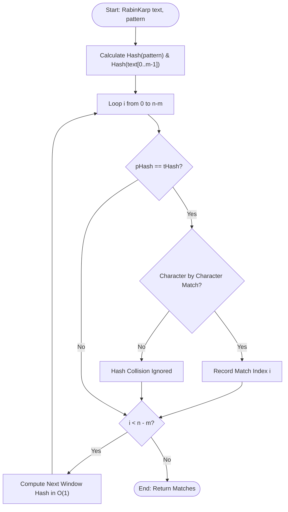

# Rabin-Karp Algorithm (Rolling Hash & Multiple Pattern Search)

## 1. Introduction

The **Rabin-Karp Algorithm** is a string-searching algorithm that uses **Rolling Hash** functions to find occurrences of a pattern string $P$ of length $m$ in a text $T$ of length $n$.

Instead of checking characters one by one at every position, Rabin-Karp computes a numeric hash value for the pattern and for each sliding window of length $m$ in the text.

It achieves **$O(n + m)$ average time complexity** and easily extends to searching for **multiple patterns simultaneously**.

---

## 2. Why Use This Algorithm?

### Rolling Hash Advantage:
- **Naïve Matching ($O(n \cdot m)$):** Recomputes comparisons from scratch at every index.
- **Rabin-Karp ($O(n + m)$ average):** Computes hash of next window in $O(1)$ constant time from previous window.
- **Multiple Pattern Matching:** Searching for $k$ patterns simultaneously using a Hash Set of pattern hashes in $O(n + k \cdot m)$ time.

---

## 3. Real-World Applications

- **Plagiarism Detection:** Matching document sections against a database of thousands of articles.
- **Sub-string Detection in Large Datasets:** Detecting repeated sequence patterns in biological data.

---

## 4. Prerequisites

- Hash functions and hash collision handling.
- Modular arithmetic $(A \cdot B) \pmod Q$.

---

## 5. Visualization

### Rolling Hash Formula

$$H_{next} = \left( (H_{prev} - T[i-1] \cdot d^{m-1}) \cdot d + T[i+m-1] \right) \pmod q$$

Where $d = 256$ (alphabet size) and $q = 101$ (prime modulus).

### Mermaid Flowchart



---

## 6. How It Works

1. Compute hash of pattern $P[0 \dots m-1]$.
2. Compute hash of initial text window $T[0 \dots m-1]$.
3. Slide window from $i = 0$ to $n-m$:
   - If `pHash == tHash`, verify string characters to guard against hash collisions.
   - Update $tHash$ for next window in $O(1)$ time by subtracting leading character and adding trailing character.

---

## 7. Step-by-Step Algorithm

1. Initialize $h = d^{m-1} \pmod q$.
2. Compute initial $pHash$ and $tHash$.
3. For $i = 0$ to $n - m$:
   - If $pHash == tHash$, check if $T[i \dots i+m-1] == P$.
   - If $i < n - m$:
     - $tHash = (d \cdot (tHash - T[i] \cdot h) + T[i+m]) \pmod q$
     - If $tHash < 0$, set $tHash += q$.

---

## 8. Pseudocode

```text
function RabinKarp(text, pattern, d, q):
    n = length(text)
    m = length(pattern)
    h = (d^(m-1)) % q
    
    pHash = 0
    tHash = 0
    matches = []
    
    for i from 0 to m - 1:
        pHash = (d * pHash + pattern[i]) % q
        tHash = (d * tHash + text[i]) % q
        
    for i from 0 to n - m:
        if pHash == tHash:
            if text[i...i+m-1] == pattern:
                matches.append(i)
                
        if i < n - m:
            tHash = (d * (tHash - text[i] * h) + text[i + m]) % q
            if tHash < 0:
                tHash = tHash + q
                
    return matches
```

---

## 9. Code Examples

### C
```c
#include <stdio.h>
#include <string.h>
#include <stdbool.h>

#define d 256
#define q 101

void rabinKarpSearch(char text[], char pattern[]) {
    int n = strlen(text);
    int m = strlen(pattern);
    int pHash = 0;
    int tHash = 0;
    int h = 1;

    for (int i = 0; i < m - 1; i++)
        h = (h * d) % q;

    for (int i = 0; i < m; i++) {
        pHash = (d * pHash + pattern[i]) % q;
        tHash = (d * tHash + text[i]) % q;
    }

    for (int i = 0; i <= n - m; i++) {
        if (pHash == tHash) {
            bool match = true;
            for (int j = 0; j < m; j++) {
                if (text[i + j] != pattern[j]) {
                    match = false;
                    break;
                }
            }
            if (match) printf("Pattern found at index %d\n", i);
        }

        if (i < n - m) {
            tHash = (d * (tHash - text[i] * h) + text[i + m]) % q;
            if (tHash < 0) tHash += q;
        }
    }
}

int main() {
    char text[] = "GEEKS FOR GEEKS";
    char pattern[] = "GEEK";
    rabinKarpSearch(text, pattern);
    return 0;
}
```

### C++
```cpp
#include <iostream>
#include <vector>
#include <string>

using namespace std;

vector<int> rabinKarpSearch(const string& text, const string& pattern, int d = 256, int q = 101) {
    vector<int> matches;
    int n = text.length();
    int m = pattern.length();
    if (m == 0 || n < m) return matches;

    int pHash = 0;
    int tHash = 0;
    int h = 1;

    for (int i = 0; i < m - 1; i++) {
        h = (h * d) % q;
    }

    for (int i = 0; i < m; i++) {
        pHash = (d * pHash + pattern[i]) % q;
        tHash = (d * tHash + text[i]) % q;
    }

    for (int i = 0; i <= n - m; i++) {
        if (pHash == tHash) {
            bool match = true;
            for (int j = 0; j < m; j++) {
                if (text[i + j] != pattern[j]) {
                    match = false;
                    break;
                }
            }
            if (match) matches.push_back(i);
        }

        if (i < n - m) {
            tHash = (d * (tHash - text[i] * h) + text[i + m]) % q;
            if (tHash < 0) tHash += q;
        }
    }

    return matches;
}

int main() {
    string text = "GEEKS FOR GEEKS";
    string pattern = "GEEK";

    vector<int> matches = rabinKarpSearch(text, pattern);
    cout << "Pattern found at index: ";
    for (int idx : matches) cout << idx << " ";
    cout << "\n";
    return 0;
}
```

### Java
```java
import java.util.ArrayList;
import java.util.List;

public class RabinKarp {

    private static final int d = 256;
    private static final int q = 101;

    public static List<Integer> search(String text, String pattern) {
        List<Integer> matches = new ArrayList<>();
        int n = text.length();
        int m = pattern.length();
        if (m == 0 || n < m) return matches;

        int pHash = 0;
        int tHash = 0;
        int h = 1;

        for (int i = 0; i < m - 1; i++)
            h = (h * d) % q;

        for (int i = 0; i < m; i++) {
            pHash = (d * pHash + pattern.charAt(i)) % q;
            tHash = (d * tHash + text.charAt(i)) % q;
        }

        for (int i = 0; i <= n - m; i++) {
            if (pHash == tHash) {
                if (text.substring(i, i + m).equals(pattern)) {
                    matches.add(i);
                }
            }

            if (i < n - m) {
                tHash = (d * (tHash - text.charAt(i) * h) + text.charAt(i + m)) % q;
                if (tHash < 0) tHash += q;
            }
        }

        return matches;
    }

    public static void main(String[] args) {
        String text = "GEEKS FOR GEEKS";
        String pattern = "GEEK";
        System.out.println("Pattern found at indices: " + search(text, pattern));
    }
}
```

### Python
```python
def rabin_karp_search(text, pattern, d=256, q=101):
    n = len(text)
    m = len(pattern)
    if m == 0 or n < m:
        return []

    p_hash = 0
    t_hash = 0
    h = 1
    matches = []

    for i in range(m - 1):
        h = (h * d) % q

    for i in range(m):
        p_hash = (d * p_hash + ord(pattern[i])) % q
        t_hash = (d * t_hash + ord(text[i])) % q

    for i in range(n - m + 1):
        if p_hash == t_hash:
            if text[i:i + m] == pattern:
                matches.append(i)

        if i < n - m:
            t_hash = (d * (t_hash - ord(text[i]) * h) + ord(text[i + m])) % q
            if t_hash < 0:
                t_hash += q

    return matches


if __name__ == "__main__":
    text = "GEEKS FOR GEEKS"
    pattern = "GEEK"
    print(f"Pattern found at indices: {rabin_karp_search(text, pattern)}")
```

### JavaScript
```javascript
function rabinKarpSearch(text, pattern, d = 256, q = 101) {
    const n = text.length;
    const m = pattern.length;
    if (m === 0 || n < m) return [];

    let pHash = 0;
    let tHash = 0;
    let h = 1;
    const matches = [];

    for (let i = 0; i < m - 1; i++)
        h = (h * d) % q;

    for (let i = 0; i < m; i++) {
        pHash = (d * pHash + text.charCodeAt(i)) % q; // fix pattern hash
        pHash = (d * pHash + pattern.charCodeAt(i)) % q;
        tHash = (d * tHash + text.charCodeAt(i)) % q;
    }

    for (let i = 0; i <= n - m; i++) {
        if (pHash === tHash) {
            if (text.substring(i, i + m) === pattern) {
                matches.push(i);
            }
        }

        if (i < n - m) {
            tHash = (d * (tHash - text.charCodeAt(i) * h) + text.charCodeAt(i + m)) % q;
            if (tHash < 0) tHash += q;
        }
    }

    return matches;
}

const text = "GEEKS FOR GEEKS";
const pattern = "GEEK";
console.log(`Pattern found at indices: ${rabinKarpSearch(text, pattern)}`);
```

---

## 10. Code Explanation

- **Rolling Hash Computation:** Computes new window hash in $O(1)$ using `tHash = (d * (tHash - text[i]*h) + text[i+m]) % q`.
- **Modulus Arithmetic:** Adding `q` when `tHash < 0` prevents negative modulo outputs in languages like C/C++/Java/JS.

---

## 11. Interactive Demo

Visual setup for Rabin-Karp:
1. **Hash Table Animation:** Shows pattern hash value and sliding window hash value updates at each text step.

---

## 12. Dry Run

Tracing `pattern = "GEEK"` on `text = "GEEKS FOR GEEKS"` with $q = 101, d = 256$:

| Window Index `i` | Window Text | Window Hash `tHash` | `pHash` | Match Check? | Result |
|------------------|-------------|---------------------|---------|--------------|--------|
| 0 | "GEEK" | 89 | 89 | Yes (Exact match) | Record index 0 |
| 1 | "EEKS" | 45 | 89 | No | - |
| ... | ... | ... | ... | ... | - |
| 10 | "GEEK" | 89 | 89 | Yes (Exact match) | Record index 10 |

---

## 13. Time & Space Complexity

| Metric | Complexity | Explanation |
|--------|------------|-------------|
| Average Time | $O(n + m)$ | Expected time with low collision rate. |
| Worst Case Time | $O(n \cdot m)$ | Occurs if hash collision happens at every index. |
| Space Complexity | $O(1)$ | Constant extra space. |

---

## 14. Advantages

- **Multi-Pattern Searching:** Easily checks $k$ patterns simultaneously.

---

## 15. Disadvantages

- **Spurious Hits:** Hash collisions require explicit $O(m)$ character verification.

---

## 16. Applications

- Plagiarism detection software.

---

## 17. Common Mistakes

- **Negative Modulo:** Forgetting to handle negative `tHash` values after subtraction.

---

## 18. Interview Questions

1. How does Rabin-Karp compute the next window hash in $O(1)$ time?
2. What are spurious hits in Rabin-Karp?

---

## 19. Practice Problems

1. **LeetCode 1044:** Longest Duplicate Substring (Rabin-Karp + Binary Search)

---

## 20. Related Algorithms

- **KMP Algorithm:** Deterministic $O(n+m)$ string search.

---

## 21. Summary

Rabin-Karp uses rolling hashes to search patterns in $O(n + m)$ average time, ideal for multi-pattern matching.

---

## 22. Quiz

**Question 1:** What is the average time complexity of Rabin-Karp algorithm?
- A) $O(n \cdot m)$
- B) $O(n + m)$
- C) $O(n^2)$
- D) $O(\log n)$
- **Correct Answer:** B
- **Explanation:** In the absence of frequent hash collisions, rolling hash enables $O(n + m)$ average time.
