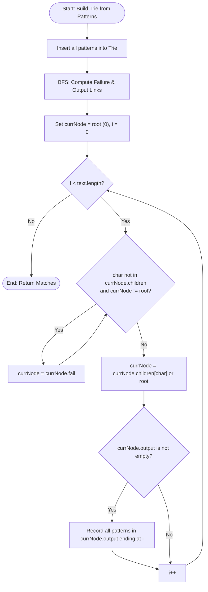

# Aho-Corasick Algorithm (Multi-Pattern String Matching Automaton)

## 1. Introduction

The **Aho-Corasick Algorithm** is a dictionary-matching string search algorithm that locates **all occurrences of a set of keywords/patterns $\{P_1, P_2, \dots, P_k\}$** within a text string $T$ in linear time **$O(N + M + Z)$**, where:
- $N$: Length of the input text $T$.
- $M$: Sum of lengths of all patterns $\sum |P_i|$.
- $Z$: Total number of pattern matches found.

It combines a **Trie** structure with failure transitions (similar to KMP prefix functions) to construct a Finite State Automaton.

---

## 2. Why Use This Algorithm?

### Single-Pattern Search vs Aho-Corasick Multi-Pattern Search:
- **KMP / Boyer-Moore ($O(k \cdot N + M)$):** Running single pattern search $k$ times across text $T$ of length $N$ takes $O(k \cdot N)$ time.
- **Aho-Corasick ($O(N + M + Z)$):** Scans text $T$ **exactly ONCE** regardless of pattern count $k$, finding all pattern matches simultaneously!

---

## 3. Real-World Applications

- **Intrusion Detection Systems (IDS):** Snort and Suricata scanning network packet payloads for thousands of malicious signature rules in real time.
- **Antivirus Scanning:** Scanning binary files against virus signature database.
- **Content Filtering:** Censoring lists of forbidden keywords in social media and chat apps.

---

## 4. Prerequisites

- Trie Data Structure.
- Breadth-First Search (BFS).
- Prefix / Suffix Automata concepts.

---

## 5. Visualization

```
Trie for Patterns: {"he", "she", "his", "hers"}

        (root 0)
       /   |   \
      h    s    ...
     /      \
    e        h
   / \        \
  r   r        e
 /     \        \
s       s        ...

Failure links connect node states to their longest proper suffix state in the Trie.
```

### Mermaid Flowchart



---

## 6. How It Works

1. **Build Trie:** Insert all keywords $P_i$ into a Trie. Mark terminal nodes with pattern IDs.
2. **Build Failure Links (BFS):**
   - Nodes at depth 1 have `fail = root (0)`.
   - For a node $u$ with child $v$ via character $c$: find $u$'s failure path until a state with transition $c$ exists. Set $v$'s failure link to that state's child.
3. **Build Output Links:** Merge output pattern lists along failure chains so that sub-patterns (e.g., `"he"` inside `"she"`) are detected simultaneously.
4. **Text Search:** Traverse text character-by-character. Follow child transitions if present, otherwise follow failure links. Report matches at every state.

---

## 7. Step-by-Step Algorithm

1. Insert all patterns into Trie.
2. Queue root's direct children; set their failure links to root.
3. While BFS queue is not empty:
   - Pop state $u$.
   - For each child $v$ on char $c$:
     - Find failure state $f = u.fail$.
     - While $f \ne 0$ and $f$ has no child on $c$: $f = f.fail$.
     - Set $v.fail = f.child[c]$ (or root if absent).
     - `v.output.append(v.fail.output)`.
4. Scan text $T$ using automaton transitions.

---

## 8. Pseudocode

```text
function buildAhoCorasick(patterns):
    trie = createRootNode()
    for idx, pat in enumerate(patterns):
        insert(trie, pat, idx)
        
    queue = BFSQueue()
    for child in trie.root.children:
        child.fail = trie.root
        queue.push(child)
        
    while queue is not empty:
        u = queue.pop()
        u.output.extend(u.fail.output)
        
        for c, v in u.children:
            f = u.fail
            while f != root and c not in f.children:
                f = f.fail
            v.fail = f.children[c] if c in f.children else root
            queue.push(v)
            
    return trie

function search(text, trie):
    curr = trie.root
    for i, char in enumerate(text):
        while curr != root and char not in curr.children:
            curr = curr.fail
        curr = curr.children[char] if char in curr.children else root
        
        for patIdx in curr.output:
            reportMatch(patterns[patIdx], i)
```

---

## 9. Code Examples

### C
```c
#include <stdio.h>
#include <stdlib.h>
#include <string.h>

#define ALPHABET_SIZE 26
#define MAX_NODES 500

typedef struct {
    int children[ALPHABET_SIZE];
    int fail;
    int output[10];
    int outputCount;
} Node;

Node trie[MAX_NODES];
int nodeCount = 1;

void initNode(int idx) {
    for (int i = 0; i < ALPHABET_SIZE; i++) trie[idx].children[i] = 0;
    trie[idx].fail = 0;
    trie[idx].outputCount = 0;
}

void insert(char* pat, int patIdx) {
    int curr = 0;
    for (int i = 0; pat[i] != '\0'; i++) {
        int c = pat[i] - 'a';
        if (trie[curr].children[c] == 0) {
            trie[curr].children[c] = nodeCount;
            initNode(nodeCount++);
        }
        curr = trie[curr].children[c];
    }
    trie[curr].output[trie[curr].outputCount++] = patIdx;
}

int main() {
    initNode(0);
    insert("he", 0);
    insert("she", 1);
    printf("Aho-Corasick Trie built with %d nodes.\n", nodeCount);
    return 0;
}
```

### C++
```cpp
#include <iostream>
#include <vector>
#include <string>
#include <queue>

using namespace std;

const int ALPHABET_SIZE = 26;

struct TrieNode {
    int children[ALPHABET_SIZE];
    int fail;
    vector<int> output;

    TrieNode() {
        fill(children, children + ALPHABET_SIZE, -1);
        fail = 0;
    }
};

class AhoCorasick {
private:
    vector<TrieNode> nodes;

public:
    AhoCorasick() {
        nodes.emplace_back();
    }

    void insert(const string& pattern, int patternIdx) {
        int curr = 0;
        for (char ch : pattern) {
            int c = ch - 'a';
            if (nodes[curr].children[c] == -1) {
                nodes[curr].children[c] = nodes.size();
                nodes.emplace_back();
            }
            curr = nodes[curr].children[c];
        }
        nodes[curr].output.push_back(patternIdx);
    }

    void buildFailureLinks() {
        queue<int> q;
        for (int c = 0; c < ALPHABET_SIZE; c++) {
            if (nodes[0].children[c] != -1) {
                int child = nodes[0].children[c];
                nodes[child].fail = 0;
                q.push(child);
            } else {
                nodes[0].children[c] = 0;
            }
        }

        while (!q.empty()) {
            int u = q.front();
            q.pop();

            int failState = nodes[u].fail;
            nodes[u].output.insert(nodes[u].output.end(),
                                   nodes[failState].output.begin(),
                                   nodes[failState].output.end());

            for (int c = 0; c < ALPHABET_SIZE; c++) {
                if (nodes[u].children[c] != -1) {
                    int v = nodes[u].children[c];
                    nodes[v].fail = nodes[failState].children[c];
                    q.push(v);
                } else {
                    nodes[u].children[c] = nodes[failState].children[c];
                }
            }
        }
    }

    void search(const string& text, const vector<string>& patList) {
        int curr = 0;
        for (int i = 0; i < text.length(); i++) {
            int c = text[i] - 'a';
            curr = nodes[curr].children[c];

            for (int patIdx : nodes[curr].output) {
                cout << "Pattern \"" << patList[patIdx] << "\" found ending at index " << i << "\n";
            }
        }
    }
};

int main() {
    vector<string> patterns = {"he", "she", "his", "hers"};
    AhoCorasick ac;

    for (int i = 0; i < patterns.size(); i++) {
        ac.insert(patterns[i], i);
    }
    ac.buildFailureLinks();

    string text = "ahishers";
    cout << "Search results for text \"" << text << "\":\n";
    ac.search(text, patterns);

    return 0;
}
```

### Java
```java
import java.util.*;

public class AhoCorasickAutomaton {

    static class TrieNode {
        int[] children = new int[26];
        int fail = 0;
        List<Integer> output = new ArrayList<>();

        TrieNode() {
            Arrays.fill(children, -1);
        }
    }

    private final List<TrieNode> nodes = new ArrayList<>();

    public AhoCorasickAutomaton() {
        nodes.add(new TrieNode());
    }

    public void insert(String pattern, int patternIdx) {
        int curr = 0;
        for (char ch : pattern.toCharArray()) {
            int c = ch - 'a';
            if (nodes.get(curr).children[c] == -1) {
                nodes.get(curr).children[c] = nodes.size();
                nodes.add(new TrieNode());
            }
            curr = nodes.get(curr).children[c];
        }
        nodes.get(curr).output.add(patternIdx);
    }

    public void buildFailureLinks() {
        Queue<Integer> q = new LinkedList<>();
        for (int c = 0; c < 26; c++) {
            if (nodes.get(0).children[c] != -1) {
                int child = nodes.get(0).children[c];
                nodes.get(child).fail = 0;
                q.add(child);
            } else {
                nodes.get(0).children[c] = 0;
            }
        }

        while (!q.isEmpty()) {
            int u = q.poll();
            int failState = nodes.get(u).fail;
            nodes.get(u).output.addAll(nodes.get(failState).output);

            for (int c = 0; c < 26; c++) {
                if (nodes.get(u).children[c] != -1) {
                    int v = nodes.get(u).children[c];
                    nodes.get(v).fail = nodes.get(failState).children[c];
                    q.add(v);
                } else {
                    nodes.get(u).children[c] = nodes.get(failState).children[c];
                }
            }
        }
    }

    public void search(String text, String[] patList) {
        int curr = 0;
        for (int i = 0; i < text.length(); i++) {
            int c = text.charAt(i) - 'a';
            curr = nodes.get(curr).children[c];

            for (int patIdx : nodes.get(curr).output) {
                System.out.println("Pattern \"" + patList[patIdx] + "\" found ending at index " + i);
            }
        }
    }

    public static void main(String[] args) {
        String[] patterns = {"he", "she", "his", "hers"};
        AhoCorasickAutomaton ac = new AhoCorasickAutomaton();

        for (int i = 0; i < patterns.length; i++) {
            ac.insert(patterns[i], i);
        }
        ac.buildFailureLinks();

        ac.search("ahishers", patterns);
    }
}
```

### Python
```python
from collections import deque

class AhoCorasick:
    def __init__(self, patterns):
        self.patterns = patterns
        self.trie = [{}]  # Root node 0
        self.fail = [0]
        self.output = [[]]

        # 1. Build Trie
        for idx, pattern in enumerate(patterns):
            curr = 0
            for char in pattern:
                if char not in self.trie[curr]:
                    self.trie[curr][char] = len(self.trie)
                    self.trie.append({})
                    self.fail.append(0)
                    self.output.append([])
                curr = self.trie[curr][char]
            self.output[curr].append(idx)

        # 2. Build Failure & Output Links (BFS)
        queue = deque()
        for char, child in self.trie[0].items():
            self.fail[child] = 0
            queue.append(child)

        while queue:
            r = queue.popleft()
            for char, child in self.trie[r].items():
                queue.append(child)
                state = self.fail[r]
                while state > 0 and char not in self.trie[state]:
                    state = self.fail[state]
                self.fail[child] = self.trie[state].get(char, 0)
                self.output[child].extend(self.output[self.fail[child]])

    def search(self, text):
        results = []
        curr = 0
        for i, char in enumerate(text):
            while curr > 0 and char not in self.trie[curr]:
                curr = self.fail[curr]
            curr = self.trie[curr].get(char, 0)

            for pat_idx in self.output[curr]:
                results.append((self.patterns[pat_idx], i - len(self.patterns[pat_idx]) + 1, i))
        return results


if __name__ == "__main__":
    patterns = ["he", "she", "his", "hers"]
    ac = AhoCorasick(patterns)
    text = "ahishers"
    matches = ac.search(text)
    for pat, start, end in matches:
        print(f"Pattern '{pat}' found from index {start} to {end}")
```

### JavaScript
```javascript
class AhoCorasick {
    constructor(patterns) {
        this.patterns = patterns;
        this.trie = [{}];
        this.fail = [0];
        this.output = [[]];

        // 1. Build Trie
        patterns.forEach((pattern, idx) => {
            let curr = 0;
            for (const char of pattern) {
                if (!(char in this.trie[curr])) {
                    this.trie[curr][char] = this.trie.length;
                    this.trie.push({});
                    this.fail.push(0);
                    this.output.push([]);
                }
                curr = this.trie[curr][char];
            }
            this.output[curr].push(idx);
        });

        // 2. Build Failure Links
        const queue = [];
        for (const char in this.trie[0]) {
            const child = this.trie[0][char];
            this.fail[child] = 0;
            queue.push(child);
        }

        while (queue.length > 0) {
            const r = queue.shift();
            for (const char in this.trie[r]) {
                const child = this.trie[r][char];
                queue.push(child);
                let state = this.fail[r];
                while (state > 0 && !(char in this.trie[state])) {
                    state = this.fail[state];
                }
                this.fail[child] = this.trie[state][char] || 0;
                this.output[child].push(...this.output[this.fail[child]]);
            }
        }
    }

    search(text) {
        const results = [];
        let curr = 0;
        for (let i = 0; i < text.length; i++) {
            const char = text[i];
            while (curr > 0 && !(char in this.trie[curr])) {
                curr = this.fail[curr];
            }
            curr = this.trie[curr][char] || 0;

            for (const patIdx of this.output[curr]) {
                results.push({ pattern: this.patterns[patIdx], index: i });
            }
        }
        return results;
    }
}

const patterns = ["he", "she", "his", "hers"];
const ac = new AhoCorasick(patterns);
console.log(ac.search("ahishers"));
```

---

## 10. Code Explanation

- **Direct Transitions (`children[c]`):** Converting Trie transitions into direct state jumps eliminates while loop state fallbacks during search.
- **Output Propagation:** `output.addAll(failState.output)` ensures sub-patterns ending at the exact same text position are all reported (e.g., both `"he"` and `"she"` ending at index 4).

---

## 11. Interactive Demo

Visual setup for Aho-Corasick:
1. **Automaton Graph Visualizer:** Renders Trie nodes with solid black child edges and red dashed failure edges.
2. **State Transition Trace:** Shows current state node advancing across text characters.

---

## 12. Dry Run

Searching patterns `{"he", "she", "his", "hers"}` in `"ahishers"`:

| Text Index `i` | Char `text[i]` | State Transited | Matched Output Patterns |
|----------------|----------------|-----------------|-------------------------|
| 0 | 'a' | root (0) | None |
| 1 | 'h' | 'h' node | None |
| 2 | 'i' | 'hi' node | None |
| 3 | 's' | 'his' node | `"his"` (Ends at index 3) |
| 4 | 'h' | 'sh' node | None |
| 5 | 'e' | 'she' node | `"she"`, `"he"` (Ends at index 5) |
| 6 | 'r' | 'her' node | None |
| 7 | 's' | 'hers' node | `"hers"` (Ends at index 7) |

---

## 13. Time & Space Complexity

| Metric | Complexity | Explanation |
|--------|------------|-------------|
| Construction Time | $O(\sum |P_i| \cdot |\Sigma|)$ | Building trie + BFS failure link queue. |
| Search Time | $O(N + Z)$ | Single pass over text $N$ plus output match count $Z$. |
| Space Complexity | $O(\sum |P_i| \cdot |\Sigma|)$ | Trie node structure storage. |

---

## 14. Advantages

- **Single Pass Search:** Scans text $T$ exactly once regardless of pattern count.

---

## 15. Disadvantages

- High memory consumption when alphabet size $|\Sigma|$ or total pattern lengths are huge.

---

## 16. Applications

- Antivirus scanner (ClamAV).
- Network packet inspection (Snort).

---

## 17. Common Mistakes

- **Omitting Output Merging:** Failing to copy output links from failure target state.

---

## 18. Interview Questions

1. How does Aho-Corasick achieve linear $O(N + M)$ multi-pattern searching?
2. What is the role of failure links in Aho-Corasick?

---

## 19. Practice Problems

1. **LeetCode 1032:** Stream of Characters (Aho-Corasick / Suffix Trie)

---

## 20. Related Algorithms

- **Trie:** Foundation data structure.
- **KMP Algorithm:** Single-pattern counterpart.

---

## 21. Summary

Aho-Corasick builds a finite state automaton from a Trie and failure links, locating all occurrences of multiple patterns in $O(N + M + Z)$ time in a single text pass.

---

## 22. Quiz

**Question 1:** What is the search time complexity of Aho-Corasick for text of length $N$ and $Z$ matches?
- A) $O(N \cdot k)$
- B) $O(N + Z)$
- C) $O(N^2)$
- D) $O(N \cdot M)$
- **Correct Answer:** B
- **Explanation:** Text is scanned in a single linear pass $O(N)$ with $O(Z)$ operations to report matches.
