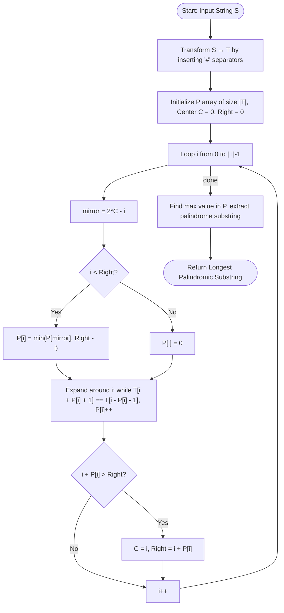

# Manacher's Algorithm (Longest Palindromic Substring in O(n))

## 1. Introduction

**Manacher's Algorithm** finds the **Longest Palindromic Substring** of a string $S$ of length $n$ in guaranteed linear time **$O(n)$**.

A naïve brute-force approach tries all $O(n^2)$ center positions and expands outward, costing $O(n^2)$ or $O(n^3)$ overall. Even dynamic programming (DP) solutions take $O(n^2)$ time and space.

Manacher's algorithm works by **reusing previously computed palindrome radii** to avoid redundant character comparisons — achieving true linear time.

> **Key Insight:** If you know a large palindrome exists centered at some position $C$, any position $i$ inside that palindrome has a mirror position $i' = 2C - i$. The palindrome radius at $i$ is at least `min(P[i'], R - i)` where $R$ is the rightmost boundary of the center palindrome.

---

## 2. Why Use This Algorithm?

### Comparison with Other Approaches:

| Approach | Time Complexity | Space Complexity |
|---|---|---|
| Brute Force (all substrings) | $O(n^3)$ | $O(1)$ |
| Expand Around Center | $O(n^2)$ | $O(1)$ |
| Dynamic Programming Table | $O(n^2)$ | $O(n^2)$ |
| **Manacher's Algorithm** | **$O(n)$** | **$O(n)$** |

**The Core Advantage:** By inserting separator characters between every character (converting `"abc"` → `"#a#b#c#"`), Manacher's algorithm handles both **odd-length** and **even-length** palindromes **uniformly** using a single pass.

---

## 3. Real-World Applications

- **Bioinformatics / Genomics:** Finding palindromic subsequences in DNA strands, which are critical markers for restriction enzyme recognition sites.
- **Text Compression:** Detecting repeated mirrored sequences used in run-length and dictionary-based compression schemes.
- **Natural Language Processing (NLP):** Identifying palindrome-based word games, anagram analysis, and symmetric sentence structures.

---

## 4. Prerequisites & Core Concepts

Before studying Manacher's Algorithm, be comfortable with:

- **Palindrome Definition:** A string that reads the same forwards and backwards (`"racecar"`, `"madam"`).
- **Expand Around Center Technique:** Naïve $O(n^2)$ palindrome expansion.
- **Two Pointer / Sliding Window:** Understanding boundary pointers $C$ (center) and $R$ (right boundary).
- **String Transformation:** Inserting separator characters to unify odd/even palindrome cases.

---

## 5. Visualization

### String Transformation Step

Before running Manacher's, the string is preprocessed:

```
Original:     a  b  b  a
Transformed:  # a # b # b # a #
Index:        0 1 2 3 4 5 6 7 8
```

Every character from the original string is placed at odd indices. The `#` separators at even indices ensure palindromes of even length in the original map to palindromes centered at `#` positions.

### P-Array Visualization (Palindrome Radii)

```
Transformed:  # a # b # b # a #
P Array:     [0,1,0,1,0,3,0,1,0]

P[5] = 3 means the palindrome centered at index 5 ('#' between two 'b's)
extends 3 characters in each direction: "#b#b#"
This maps back to "abba" in the original string.
```

### Mermaid Flowchart



---

## 6. How It Works

### Step 1: Transform the String

Convert string $S$ into $T$ by surrounding every character with `#`:

$$T = \texttt{"\#"} + S[0] + \texttt{"\#"} + S[1] + \texttt{"\#"} + \cdots + S[n-1] + \texttt{"\#"}$$

Length of $T = 2n + 1$.

### Step 2: Compute P Array

- Maintain center $C$ and rightmost boundary $R$ of the currently known rightmost palindrome.
- For each index $i$ in $T$:
  - If $i < R$: Use the mirror $i' = 2C - i$ and set $P[i] = \min(P[i'], R - i)$ as a starting radius.
  - Expand around $i$ while $T[i - P[i] - 1] == T[i + P[i] + 1]$.
  - If the palindrome centered at $i$ extends beyond $R$, update $C = i$ and $R = i + P[i]$.

### Step 3: Extract Result

- Find index $\text{maxCenter}$ with maximum $P[\text{maxCenter}]$.
- The longest palindromic substring starts at:

$$\text{start} = \frac{\text{maxCenter} - P[\text{maxCenter}]}{2}$$

- Length of palindrome = $P[\text{maxCenter}]$.

---

## 7. Step-by-Step Algorithm

1. Transform $S$ → $T$ with separator characters.
2. Initialize $P$ array of size $|T|$ to all zeros.
3. Set $C = 0$, $R = 0$ (center and rightmost boundary).
4. For $i = 0$ to $|T| - 1$:
   - Compute mirror $= 2C - i$.
   - If $i < R$: $P[i] = \min(P[\text{mirror}], R - i)$.
   - Expand: while $i - P[i] - 1 \ge 0$ and $i + P[i] + 1 < |T|$ and $T[i - P[i] - 1] == T[i + P[i] + 1]$, increment $P[i]$.
   - If $i + P[i] > R$: update $C = i$, $R = i + P[i]$.
5. Find $\text{maxCenter} = \arg\max_i P[i]$.
6. Return $S\left[\frac{\text{maxCenter} - P[\text{maxCenter}]}{2} \dots \frac{\text{maxCenter} - P[\text{maxCenter}]}{2} + P[\text{maxCenter}] - 1\right]$.

---

## 8. Pseudocode

```text
function manacher(s):
    // Step 1: Transform
    t = "#"
    for each char c in s:
        t = t + c + "#"
    n = length(t)
    
    // Step 2: Compute P array
    P = array of n zeros
    C = 0  // center of rightmost palindrome
    R = 0  // right boundary of rightmost palindrome
    
    for i from 0 to n - 1:
        mirror = 2 * C - i
        
        if i < R:
            P[i] = min(P[mirror], R - i)
        
        // Try to expand palindrome centered at i
        while (i - P[i] - 1) >= 0 and (i + P[i] + 1) < n:
            if t[i - P[i] - 1] == t[i + P[i] + 1]:
                P[i] = P[i] + 1
            else:
                break
        
        // Update center and right boundary
        if i + P[i] > R:
            C = i
            R = i + P[i]
    
    // Step 3: Find max radius
    maxLen = 0
    maxCenter = 0
    for i from 0 to n - 1:
        if P[i] > maxLen:
            maxLen = P[i]
            maxCenter = i
    
    // Extract substring from original
    start = (maxCenter - maxLen) / 2
    return s[start ... start + maxLen - 1]
```

---

## 9. Code Examples

### C

```c
#include <stdio.h>
#include <string.h>
#include <stdlib.h>

char* manacher(char* s) {
    int sLen = strlen(s);
    int tLen = 2 * sLen + 1;

    // Step 1: Build transformed string T
    char* t = (char*)malloc(tLen + 1);
    t[0] = '#';
    for (int i = 0; i < sLen; i++) {
        t[2 * i + 1] = s[i];
        t[2 * i + 2] = '#';
    }
    t[tLen] = '\0';

    // Step 2: Compute P array
    int* P = (int*)calloc(tLen, sizeof(int));
    int C = 0, R = 0;

    for (int i = 0; i < tLen; i++) {
        int mirror = 2 * C - i;

        if (i < R)
            P[i] = (P[mirror] < R - i) ? P[mirror] : R - i;

        while (i + P[i] + 1 < tLen && i - P[i] - 1 >= 0 &&
               t[i + P[i] + 1] == t[i - P[i] - 1])
            P[i]++;

        if (i + P[i] > R) {
            C = i;
            R = i + P[i];
        }
    }

    // Step 3: Find max
    int maxLen = 0, maxCenter = 0;
    for (int i = 0; i < tLen; i++) {
        if (P[i] > maxLen) {
            maxLen = P[i];
            maxCenter = i;
        }
    }

    int start = (maxCenter - maxLen) / 2;
    char* result = (char*)malloc(maxLen + 1);
    strncpy(result, s + start, maxLen);
    result[maxLen] = '\0';

    free(t);
    free(P);
    return result;
}

int main() {
    char s[] = "babad";
    char* result = manacher(s);
    printf("Longest Palindromic Substring of \"%s\": \"%s\"\n", s, result);
    free(result);

    char s2[] = "cbbd";
    char* result2 = manacher(s2);
    printf("Longest Palindromic Substring of \"%s\": \"%s\"\n", s2, result2);
    free(result2);

    return 0;
}
```

### C++

```cpp
#include <iostream>
#include <string>
#include <vector>
#include <algorithm>

using namespace std;

string manacher(const string& s) {
    // Step 1: Transform
    string t = "#";
    for (char c : s) {
        t += c;
        t += '#';
    }
    int n = t.length();

    // Step 2: Compute P array
    vector<int> P(n, 0);
    int C = 0, R = 0;

    for (int i = 0; i < n; i++) {
        int mirror = 2 * C - i;

        if (i < R)
            P[i] = min(P[mirror], R - i);

        // Expand around i
        while (i + P[i] + 1 < n && i - P[i] - 1 >= 0 &&
               t[i + P[i] + 1] == t[i - P[i] - 1])
            P[i]++;

        // Update center and right boundary
        if (i + P[i] > R) {
            C = i;
            R = i + P[i];
        }
    }

    // Step 3: Find max radius
    int maxLen = 0, maxCenter = 0;
    for (int i = 0; i < n; i++) {
        if (P[i] > maxLen) {
            maxLen = P[i];
            maxCenter = i;
        }
    }

    int start = (maxCenter - maxLen) / 2;
    return s.substr(start, maxLen);
}

int main() {
    cout << manacher("babad") << "\n";   // "bab" or "aba"
    cout << manacher("cbbd") << "\n";    // "bb"
    cout << manacher("racecar") << "\n"; // "racecar"
    cout << manacher("abacaba") << "\n"; // "abacaba"
    return 0;
}
```

### Java

```java
public class Manacher {

    public static String longestPalindrome(String s) {
        // Step 1: Transform
        StringBuilder tBuilder = new StringBuilder("#");
        for (char c : s.toCharArray()) {
            tBuilder.append(c).append('#');
        }
        String t = tBuilder.toString();
        int n = t.length();

        // Step 2: Compute P array
        int[] P = new int[n];
        int C = 0, R = 0;

        for (int i = 0; i < n; i++) {
            int mirror = 2 * C - i;

            if (i < R)
                P[i] = Math.min(P[mirror], R - i);

            // Expand
            while (i + P[i] + 1 < n && i - P[i] - 1 >= 0 &&
                   t.charAt(i + P[i] + 1) == t.charAt(i - P[i] - 1))
                P[i]++;

            // Update C, R
            if (i + P[i] > R) {
                C = i;
                R = i + P[i];
            }
        }

        // Step 3: Find max
        int maxLen = 0, maxCenter = 0;
        for (int i = 0; i < n; i++) {
            if (P[i] > maxLen) {
                maxLen = P[i];
                maxCenter = i;
            }
        }

        int start = (maxCenter - maxLen) / 2;
        return s.substring(start, start + maxLen);
    }

    public static void main(String[] args) {
        System.out.println(longestPalindrome("babad"));    // "bab"
        System.out.println(longestPalindrome("cbbd"));     // "bb"
        System.out.println(longestPalindrome("racecar"));  // "racecar"
        System.out.println(longestPalindrome("abacaba"));  // "abacaba"
    }
}
```

### Python

```python
def manacher(s: str) -> str:
    # Step 1: Transform
    t = '#' + '#'.join(s) + '#'
    n = len(t)

    # Step 2: Compute P array
    P = [0] * n
    C = R = 0

    for i in range(n):
        mirror = 2 * C - i

        if i < R:
            P[i] = min(P[mirror], R - i)

        # Expand around i
        while i + P[i] + 1 < n and i - P[i] - 1 >= 0 \
                and t[i + P[i] + 1] == t[i - P[i] - 1]:
            P[i] += 1

        # Update center and right boundary
        if i + P[i] > R:
            C, R = i, i + P[i]

    # Step 3: Find max radius
    max_len, max_center = max((v, i) for i, v in enumerate(P))

    start = (max_center - max_len) // 2
    return s[start: start + max_len]


if __name__ == "__main__":
    test_cases = ["babad", "cbbd", "racecar", "abacaba", "a", "aa"]
    for s in test_cases:
        print(f'manacher("{s}") = "{manacher(s)}"')
```

### JavaScript

```javascript
function manacher(s) {
    // Step 1: Transform
    const t = '#' + s.split('').join('#') + '#';
    const n = t.length;

    // Step 2: Compute P array
    const P = Array(n).fill(0);
    let C = 0, R = 0;

    for (let i = 0; i < n; i++) {
        const mirror = 2 * C - i;

        if (i < R)
            P[i] = Math.min(P[mirror], R - i);

        // Expand around i
        while (i + P[i] + 1 < n && i - P[i] - 1 >= 0 &&
               t[i + P[i] + 1] === t[i - P[i] - 1])
            P[i]++;

        // Update C and R
        if (i + P[i] > R) {
            C = i;
            R = i + P[i];
        }
    }

    // Step 3: Find max radius
    let maxLen = 0, maxCenter = 0;
    for (let i = 0; i < n; i++) {
        if (P[i] > maxLen) {
            maxLen = P[i];
            maxCenter = i;
        }
    }

    const start = (maxCenter - maxLen) / 2;
    return s.substring(start, start + maxLen);
}

// Tests
console.log(manacher("babad"));    // "bab"
console.log(manacher("cbbd"));     // "bb"
console.log(manacher("racecar"));  // "racecar"
console.log(manacher("abacaba"));  // "abacaba"
```

---

## 10. Code Explanation

### Key Lines Explained

| Code Segment | Purpose |
|---|---|
| `t = '#' + '#'.join(s) + '#'` | Transforms $S$ so odd/even palindromes are handled uniformly. |
| `mirror = 2 * C - i` | Computes the mirror of $i$ with respect to center $C$. |
| `P[i] = min(P[mirror], R - i)` | Reuses mirror's known radius without redundant comparisons. |
| Expand loop | Only runs when no prior knowledge covers position $i$. |
| `C = i; R = i + P[i]` | Updates rightmost center when a new palindrome extends further right. |
| `start = (maxCenter - maxLen) // 2` | Maps back from transformed string index to original string index. |

### Why Does the Mirror Trick Work?

If center $C$ has right boundary $R$ and we are at position $i < R$, then by palindrome symmetry:

$$T[i - k] == T[i + k] \iff T[i' - k] == T[i' + k]$$

where $i' = 2C - i$ is the mirror of $i$. So we can inherit at least $\min(P[i'], R - i)$ radius for free.

---

## 11. Interactive Demo Scenario

**Input:** `s = "abacaba"`

**Transformed string:** `#a#b#a#c#a#b#a#`

**Running through the algorithm:**

| Position $i$ | Center Char | Radius $P[i]$ | Notes |
|---|---|---|---|
| 0 | `#` | 0 | Boundary |
| 1 | `a` | 1 | Single char palindrome |
| 2 | `#` | 0 | No even palindrome here |
| 3 | `b` | 1 | |
| 4 | `#` | 2 | "aba" |
| 5 | `a` | 1 | |
| 6 | `#` | 4 | "abacaba" — full string! |
| ... | ... | ... | Mirror reuse kicks in |

**Result:** Palindrome of length 7 = `"abacaba"` (entire string).

---

## 12. Dry Run Trace Table

**Input:** `s = "cbbd"`

**Transformed:** `#c#b#b#d#` (length 9)

| $i$ | $T[i]$ | Mirror | $P[\text{mirror}]$ | $R - i$ | Start $P[i]$ | After Expand | New $C, R$ |
|---|---|---|---|---|---|---|---|
| 0 | `#` | — | — | — | 0 | 0 | $C=0, R=0$ |
| 1 | `c` | 1 (self) | — | — | 0 | 1 | $C=1, R=2$ |
| 2 | `#` | 0 | 0 | 0 | 0 | 0 | no change |
| 3 | `b` | -1 | — | — | 0 | 1 | $C=3, R=4$ |
| 4 | `#` | 2 | 0 | 0 | 0 | 2 | $C=4, R=6$ |
| 5 | `b` | 3 | 1 | 1 | 1 | 1 | no change |
| 6 | `#` | 2 | 0 | 0 | 0 | 0 | no change |
| 7 | `d` | 1 | 1 | — | 0 | 1 | $C=7, R=8$ |
| 8 | `#` | 6 | — | — | 0 | 0 | no change |

**Max radius:** $P[4] = 2$ → palindrome centered at index 4 in $T$ (`#b#b#`).

**Start in original string:** $(4 - 2) / 2 = 1$, **length** $= 2$ → `s[1..2]` = `"bb"` ✓

---

## 13. Time & Space Complexity

| Metric | Complexity | Explanation |
|---|---|---|
| **Time Complexity** | $O(n)$ | The right boundary $R$ only ever moves rightward across $2n + 1$ positions, so each position is expanded at most once total across the entire algorithm. |
| **Space Complexity** | $O(n)$ | The transformed string $T$ of size $2n + 1$ and the $P$ array of same size. |

### Complexity Proof (Amortized)

Every expansion of the inner while loop increments $R$. Since $R$ starts at 0 and never decreases, and $R \le 2n + 1$, the total number of character comparisons across **all iterations** is bounded by $O(n)$. All other operations per iteration are $O(1)$.

---

## 14. Advantages

- **True Linear Time:** The only known algorithm to find the longest palindromic substring in $O(n)$ — optimal by lower bound arguments.
- **Handles Odd & Even Palindromes Uniformly:** The `#` separator transformation eliminates the need to separately handle odd-length and even-length palindromes.
- **Simple Invariant:** The $C$ and $R$ invariant is easy to maintain and reason about.
- **No Extra Hashing or Randomization:** Deterministic and exact — no false positives, no hash collision risk.

---

## 15. Disadvantages

- **Non-Trivial to Implement Correctly:** The transformation step and index mapping back to the original string are easy to get wrong (off-by-one errors are common).
- **Higher Constant Factor than Expand-Around-Center:** For short strings, the simpler $O(n^2)$ expand-around-center approach is often faster in practice due to lower constants and cache-friendliness.
- **Limited to Exact Palindromes:** Does not generalize to approximate palindromes or palindromes under edit distance.

---

## 16. Applications

- **Longest Palindromic Substring (LeetCode 5):** The canonical direct application.
- **Palindrome Partitioning:** Precompute all palindrome radii in $O(n)$ before a DP partitioning step.
- **DNA Restriction Sites:** In bioinformatics, enzymes recognize palindromic sequences; linear-time scanning is essential for genome-scale data.
- **Text Editors / IDEs:** Auto-detection of symmetric code patterns and balanced structures.
- **Data Deduplication:** Identifying mirrored repeated blocks in compressed data streams.

---

## 17. Common Mistakes

1. **Forgetting the Boundary Guards in the Expand Loop:**
   - Must check `i - P[i] - 1 >= 0` AND `i + P[i] + 1 < n` before comparing characters.
   - Missing either check causes index-out-of-bounds errors.

2. **Wrong Mirror Formula:**
   - Mirror of $i$ with respect to center $C$ is `mirror = 2*C - i`, **not** `C - (i - C)` which is the same thing but often typed incorrectly as `C + (C - i)` or confused.

3. **Incorrect Index Mapping Back to Original String:**
   - The start index in the original string is `(maxCenter - maxLen) / 2`, not `maxCenter / 2`.
   - Forgetting to use integer division (floor) causes off-by-one errors.

4. **Not Updating $C$ and $R$ Correctly:**
   - Update only when `i + P[i] > R` (strictly greater), not `>=`.

5. **Handling Single Character Strings:**
   - Must ensure the algorithm works when `s = "a"` or `s = "aa"`.

---

## 18. Interview Questions

### Q1. What is the time complexity of Manacher's Algorithm and why is it $O(n)$?

**Answer:** $O(n)$. The key is that the right boundary $R$ is monotonically non-decreasing. The inner expansion loop can only push $R$ rightward. Since $R$ traverses at most $2n + 1$ positions (the length of the transformed string), the total number of character comparisons across all iterations of the outer loop is bounded by $O(n)$.

### Q2. How does the string transformation `#a#b#c#` help?

**Answer:** Without it, you need to separately handle odd-length palindromes (centered at a character) and even-length palindromes (centered between two characters). The `#` separator creates a unified representation where every palindrome — odd or even in the original — is an **odd-length** palindrome in the transformed string, centered at one position. This simplifies the algorithm to a single case.

### Q3. What is the mirror optimization and when does it fail?

**Answer:** When position $i$ is inside the current rightmost palindrome (i.e., $i < R$), we use the mirror position $i' = 2C - i$. The palindrome radius at $i$ is at least $\min(P[i'], R - i)$. The mirror optimization "fails" (we can't fully reuse the mirror's radius) when $P[i'] \ge R - i$, meaning the mirror's palindrome extends to or beyond the left boundary of the rightmost palindrome. In that case, we must expand manually from $R - i$.

### Q4. How would you use Manacher's Algorithm for palindrome partitioning?

**Answer:** After running Manacher's in $O(n)$, the $P$ array tells us the radius of the palindrome centered at each position. We can then check whether any substring $S[i \dots j]$ is a palindrome in $O(1)$ time: a palindrome centered at transformed index $2k + 1$ with radius $r$ covers original characters $S[k - r/2 \dots k + r/2]$. This enables $O(n^2)$ palindrome partitioning DP with $O(1)$ per palindrome check.

---

## 19. Practice Problems

1. **LeetCode 5 — Longest Palindromic Substring (Medium):** The canonical Manacher's problem. Implement in $O(n)$ time.
2. **LeetCode 647 — Palindromic Substrings (Medium):** Count all palindromic substrings. Use the $P$ array to count $\lfloor (P[i] + 1) / 2 \rfloor$ palindromes per center.
3. **LeetCode 214 — Shortest Palindrome (Hard):** Find the shortest palindrome by adding characters to the front of the string. Combine Manacher's with KMP or Z-Algorithm.
4. **LeetCode 336 — Palindrome Pairs (Hard):** For pairs of strings, find those whose concatenation is a palindrome.
5. **SPOJ PALIN — Next Palindrome:** Find the next palindrome greater than a given number string.

---

## 20. Related Algorithms

| Algorithm | Relation to Manacher's |
|---|---|
| **Expand Around Center** | The naïve $O(n^2)$ precursor that Manacher's optimizes. |
| **KMP Algorithm** | Both use the idea of reusing prior computed information (LPS array vs. P array) to avoid redundant work. |
| **Z-Algorithm** | Also computes prefix match lengths in $O(n)$; can solve palindrome problems via a combined trick. |
| **Suffix Arrays + LCP** | Alternative $O(n \log n)$ or $O(n)$ approach to palindrome-related queries. |
| **Palindromic Tree (Eertree)** | Data structure for counting distinct palindromic substrings; complements Manacher's. |

---

## 21. Summary

| Property | Value |
|---|---|
| **Category** | String Algorithm |
| **Time Complexity** | $O(n)$ — linear, optimal |
| **Space Complexity** | $O(n)$ — for transformed string and P array |
| **Input** | String $S$ of length $n$ |
| **Output** | Longest palindromic substring of $S$ |
| **Core Idea** | Mirror reuse within rightmost palindrome window $[C, R]$ |
| **Key Trick** | `#` separator transformation unifies odd/even palindromes |
| **Best For** | Any problem requiring palindromic substring analysis at scale |

**Key Takeaway:** Manacher's Algorithm is the gold standard for palindromic substring problems. The transformation trick + rightmost boundary invariant gives an elegant $O(n)$ solution that is worth mastering for competitive programming and interviews.

---

## 22. Quiz

**Question 1:** What does $P[i]$ represent in Manacher's Algorithm (on the transformed string $T$)?

- A) The length of the palindromic substring at position $i$ in the original string.
- B) The radius of the longest palindrome centered at position $i$ in the transformed string $T$.
- C) The number of palindromes starting at position $i$.
- D) The index of the mirror position of $i$.

- **Correct Answer:** B
- **Explanation:** $P[i]$ stores the palindrome **radius** (not diameter) centered at position $i$ in the transformed string. For example, if $P[i] = 3$, the palindrome extends 3 characters in each direction from $i$.

---

**Question 2:** What is the purpose of inserting `#` characters in Manacher's Algorithm?

- A) To act as sentinel values that prevent index-out-of-bounds errors.
- B) To transform the string so both odd-length and even-length palindromes are handled by the same code path.
- C) To increase the string length so the algorithm has more room to expand.
- D) To mark positions in the original string for backtracking.

- **Correct Answer:** B
- **Explanation:** Without `#`, you'd need separate logic for odd (character-centered) and even (gap-centered) palindromes. The transformation converts all palindromes into odd-length ones in $T$, unifying the algorithm.

---

**Question 3:** What is the time complexity of Manacher's Algorithm?

- A) $O(n^2)$
- B) $O(n \log n)$
- C) $O(n)$
- D) $O(n \sqrt{n})$

- **Correct Answer:** C
- **Explanation:** The right boundary $R$ only moves rightward across $2n + 1$ positions total. Each character comparison either increases $R$ or is a $O(1)$ mirror lookup, giving a total of $O(n)$ comparisons amortized.

---

**Question 4:** Given `s = "racecar"`, what is the longest palindromic substring returned by Manacher's Algorithm?

- A) `"race"`
- B) `"aceca"`
- C) `"racecar"`
- D) `"cec"`

- **Correct Answer:** C
- **Explanation:** The entire string `"racecar"` is itself a palindrome of length 7. Manacher's will find radius $P[\text{center}] = 7$ for the center position corresponding to `'e'`, yielding the full string.
