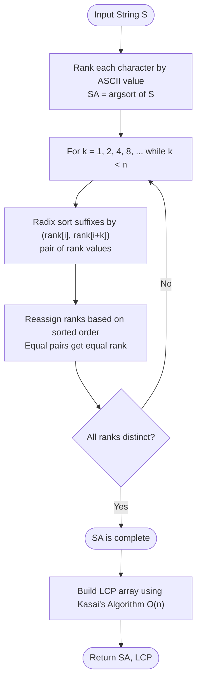

# Suffix Array (Sorted Suffixes & LCP Array)

## 1. Introduction

A **Suffix Array** is a sorted array of all suffixes of a string $S$ of length $n$, represented as **starting indices** rather than storing the actual suffix strings.

For `S = "banana"`, the 6 suffixes are:

```
Index 0: "banana"
Index 1: "anana"
Index 2: "nana"
Index 3: "ana"
Index 4: "na"
Index 5: "a"
```

After sorting lexicographically:

```
Rank 0: "a"      → index 5
Rank 1: "ana"    → index 3
Rank 2: "anana"  → index 1
Rank 3: "banana" → index 0
Rank 4: "na"     → index 4
Rank 5: "nana"   → index 2

SA = [5, 3, 1, 0, 4, 2]
```

Together with the **LCP (Longest Common Prefix) Array**, the suffix array enables $O(n \log n)$ construction and $O(m + \log n)$ pattern searches — forming a space-efficient alternative to Suffix Trees.

---

## 2. Why Use This Algorithm?

### Comparison with Other Data Structures:

| Approach | Build Time | Search Time | Space |
|---|---|---|---|
| Naïve (sort all suffixes) | $O(n^2 \log n)$ | $O(m \log n)$ | $O(n^2)$ |
| **Suffix Array (O(n log n))** | $O(n \log n)$ | $O(m + \log n)$ | $O(n)$ |
| Suffix Array (O(n) DC3/SA-IS) | $O(n)$ | $O(m + \log n)$ | $O(n)$ |
| Suffix Tree (Ukkonen's) | $O(n)$ | $O(m)$ | $O(n)$ — large constant |

**The Core Advantage:** The suffix array stores only $n$ integers (the sorted suffix start indices) rather than $O(n^2)$ characters. Combined with the LCP array, it supports virtually all operations that a suffix tree can perform, at a fraction of the memory cost.

---

## 3. Real-World Applications

- **Full-Text Search Engines:** Indexing billions of web pages for substring queries (used in `grep`, `ag`, `ripgrep`).
- **Bioinformatics:** Aligning DNA/RNA reads against reference genomes (tools like BWA and Bowtie use suffix arrays).
- **Data Compression:** The Burrows-Wheeler Transform (BWT) used in `bzip2` and the SA-IS algorithm.
- **Plagiarism Detection:** Finding the Longest Common Substring between two documents efficiently.
- **String Similarity:** Computing the edit distance and longest repeated substrings.

---

## 4. Prerequisites & Core Concepts

- **Suffix:** A substring from position $i$ to end of $S$: $S[i \dots n-1]$.
- **Lexicographic (Dictionary) Order:** Comparing strings character by character.
- **Radix Sort / Counting Sort:** $O(n)$ integer sorting used in efficient SA construction.
- **LCP Array:** `lcp[i]` = length of longest common prefix between `SA[i]` and `SA[i-1]`.

---

## 5. Visualization

### Building SA for `S = "banana$"` ($ = sentinel, ASCII < 'a')

```
All Suffixes Sorted:
Rank  SA[i]  Suffix
 0      6    "$"
 1      5    "a$"
 2      3    "ana$"
 3      1    "anana$"
 4      0    "banana$"
 5      4    "na$"
 6      2    "nana$"

SA  = [6, 5, 3, 1, 0, 4, 2]
LCP = [-, 0, 1, 3, 0, 0, 2]
```

### Mermaid Flowchart — O(n log n) Prefix Doubling Construction



---

## 6. How It Works

### Phase 1: Prefix Doubling (O(n log n) Construction)

1. **Initialize:** Rank every character by its ASCII value. Build initial SA by sorting single characters.
2. **Double Prefix Length:** In each round, sort suffix pairs `(rank[i], rank[i + k])` where `k` doubles each round (`k = 1, 2, 4, 8, ...`).
3. **Reassign Ranks:** Equal pairs get the same rank. Stop when all ranks are distinct (fully sorted).
4. **Total Rounds:** $O(\log n)$ rounds, each using $O(n)$ radix sort → $O(n \log n)$ total.

### Phase 2: Kasai's LCP Algorithm (O(n))

Using the inverse suffix array `rank[]` (position of suffix $i$ in SA):

1. For each suffix in **original string order** $i = 0 \dots n-1$:
   - Let $k$ = current match length carry-over from previous iteration.
   - Compare suffix at `SA[rank[i] - 1]` with suffix at $i$, extending match.
   - Set `lcp[rank[i]] = k`, then `k = max(0, k - 1)`.

---

## 7. Step-by-Step Algorithm

**Naive O(n² log n) Build (for understanding):**

1. Generate all $n$ suffixes with their starting indices.
2. Sort the suffix index array using a comparator that compares actual suffix strings.
3. Store sorted start indices as SA.

**Kasai's LCP O(n):**

1. Build inverse SA: `rank[SA[i]] = i` for all $i$.
2. Set `k = 0`.
3. For $i = 0$ to $n - 1$:
   - If `rank[i] == 0`: `lcp[0] = 0`; reset `k = 0`; continue.
   - Let `j = SA[rank[i] - 1]`.
   - While `S[i + k] == S[j + k]`: `k++`.
   - `lcp[rank[i]] = k`.
   - If `k > 0`: `k--`.

---

## 8. Pseudocode

```text
// --- Naive Suffix Array Build ---
function buildSuffixArrayNaive(s):
    n = length(s)
    SA = [0, 1, 2, ..., n-1]
    sort SA using comparator: s[SA[i]..] < s[SA[j]..] lexicographically
    return SA

// --- Kasai's LCP Array ---
function buildLCP(s, SA):
    n = length(s)
    rank = array of size n
    lcp  = array of size n initialized to 0

    for i from 0 to n-1:
        rank[SA[i]] = i

    k = 0
    for i from 0 to n-1:
        if rank[i] == 0:
            k = 0
            continue
        j = SA[rank[i] - 1]
        while i + k < n and j + k < n and s[i+k] == s[j+k]:
            k = k + 1
        lcp[rank[i]] = k
        if k > 0:
            k = k - 1

    return lcp

// --- Pattern Search using SA + Binary Search ---
function search(s, SA, pattern):
    lo = 0, hi = length(SA) - 1
    while lo <= hi:
        mid = (lo + hi) / 2
        suffix = s[SA[mid]..]
        if suffix starts with pattern:
            return SA[mid]   // found
        elif suffix < pattern:
            lo = mid + 1
        else:
            hi = mid - 1
    return -1  // not found
```

---

## 9. Code Examples

### C

```c
#include <stdio.h>
#include <string.h>
#include <stdlib.h>

#define MAX 1000

char s[MAX];
int SA[MAX], lcp[MAX], rank_arr[MAX], tmp[MAX];
int n;

int cmp(const void* a, const void* b) {
    return strcmp(s + *(int*)a, s + *(int*)b);
}

void buildSA() {
    for (int i = 0; i < n; i++) SA[i] = i;
    qsort(SA, n, sizeof(int), cmp);
}

void buildLCP() {
    for (int i = 0; i < n; i++) rank_arr[SA[i]] = i;
    int k = 0;
    for (int i = 0; i < n; i++) {
        if (rank_arr[i] == 0) { k = 0; continue; }
        int j = SA[rank_arr[i] - 1];
        while (i + k < n && j + k < n && s[i+k] == s[j+k]) k++;
        lcp[rank_arr[i]] = k;
        if (k > 0) k--;
    }
}

int main() {
    strcpy(s, "banana");
    n = strlen(s);
    buildSA();
    buildLCP();

    printf("Suffix Array: ");
    for (int i = 0; i < n; i++) printf("%d ", SA[i]);
    printf("\nLCP Array:    ");
    for (int i = 0; i < n; i++) printf("%d ", lcp[i]);
    printf("\n");
    return 0;
}
```

### C++

```cpp
#include <iostream>
#include <vector>
#include <string>
#include <algorithm>

using namespace std;

vector<int> buildSuffixArray(const string& s) {
    int n = s.size();
    vector<int> SA(n);
    iota(SA.begin(), SA.end(), 0);
    sort(SA.begin(), SA.end(), [&](int a, int b) {
        return s.substr(a) < s.substr(b);
    });
    return SA;
}

vector<int> buildLCP(const string& s, const vector<int>& SA) {
    int n = s.size();
    vector<int> rank_(n), lcp(n, 0);
    for (int i = 0; i < n; i++) rank_[SA[i]] = i;

    int k = 0;
    for (int i = 0; i < n; i++) {
        if (rank_[i] == 0) { k = 0; continue; }
        int j = SA[rank_[i] - 1];
        while (i + k < n && j + k < n && s[i+k] == s[j+k]) k++;
        lcp[rank_[i]] = k;
        if (k > 0) k--;
    }
    return lcp;
}

int main() {
    string s = "banana";
    auto SA  = buildSuffixArray(s);
    auto lcp = buildLCP(s, SA);

    cout << "SA : ";
    for (int x : SA)  cout << x << " ";
    cout << "\nLCP: ";
    for (int x : lcp) cout << x << " ";
    cout << "\n";

    // Show sorted suffixes
    cout << "\nSorted suffixes:\n";
    for (int i = 0; i < (int)SA.size(); i++)
        cout << "  SA[" << i << "] = " << SA[i]
             << "  \"" << s.substr(SA[i]) << "\"\n";

    return 0;
}
```

### Java

```java
import java.util.*;

public class SuffixArray {

    public static int[] build(String s) {
        int n = s.length();
        Integer[] SA = new Integer[n];
        for (int i = 0; i < n; i++) SA[i] = i;
        Arrays.sort(SA, (a, b) -> s.substring(a).compareTo(s.substring(b)));
        int[] sa = new int[n];
        for (int i = 0; i < n; i++) sa[i] = SA[i];
        return sa;
    }

    public static int[] buildLCP(String s, int[] SA) {
        int n = s.length();
        int[] rank = new int[n], lcp = new int[n];
        for (int i = 0; i < n; i++) rank[SA[i]] = i;

        int k = 0;
        for (int i = 0; i < n; i++) {
            if (rank[i] == 0) { k = 0; continue; }
            int j = SA[rank[i] - 1];
            while (i + k < n && j + k < n && s.charAt(i+k) == s.charAt(j+k)) k++;
            lcp[rank[i]] = k;
            if (k > 0) k--;
        }
        return lcp;
    }

    // Binary search for pattern in SA
    public static int search(String s, int[] SA, String pattern) {
        int lo = 0, hi = SA.length - 1;
        while (lo <= hi) {
            int mid = (lo + hi) / 2;
            String suffix = s.substring(SA[mid]);
            if (suffix.startsWith(pattern)) return SA[mid];
            else if (suffix.compareTo(pattern) < 0) lo = mid + 1;
            else hi = mid - 1;
        }
        return -1;
    }

    public static void main(String[] args) {
        String s = "banana";
        int[] SA  = build(s);
        int[] lcp = buildLCP(s, SA);

        System.out.print("SA : ");
        for (int x : SA)  System.out.print(x + " ");
        System.out.print("\nLCP: ");
        for (int x : lcp) System.out.print(x + " ");
        System.out.println();

        int idx = search(s, SA, "ana");
        System.out.println("Pattern 'ana' found at index: " + idx);
    }
}
```

### Python

```python
def build_suffix_array(s: str) -> list[int]:
    """Naive O(n^2 log n) suffix array construction."""
    n = len(s)
    SA = sorted(range(n), key=lambda i: s[i:])
    return SA


def build_lcp(s: str, SA: list[int]) -> list[int]:
    """Kasai's O(n) LCP array construction."""
    n = len(s)
    rank = [0] * n
    lcp  = [0] * n

    for i, sa in enumerate(SA):
        rank[sa] = i

    k = 0
    for i in range(n):
        if rank[i] == 0:
            k = 0
            continue
        j = SA[rank[i] - 1]
        while i + k < n and j + k < n and s[i + k] == s[j + k]:
            k += 1
        lcp[rank[i]] = k
        if k > 0:
            k -= 1

    return lcp


def search(s: str, SA: list[int], pattern: str) -> int:
    """Binary search for pattern start index in SA. Returns -1 if not found."""
    lo, hi = 0, len(SA) - 1
    while lo <= hi:
        mid = (lo + hi) // 2
        suffix = s[SA[mid]:]
        if suffix.startswith(pattern):
            return SA[mid]
        elif suffix < pattern:
            lo = mid + 1
        else:
            hi = mid - 1
    return -1


if __name__ == "__main__":
    s = "banana"
    SA  = build_suffix_array(s)
    lcp = build_lcp(s, SA)

    print(f"SA : {SA}")
    print(f"LCP: {lcp}")
    print("\nSorted Suffixes:")
    for i, idx in enumerate(SA):
        print(f"  SA[{i}] = {idx}  \"{s[idx:]}\"  lcp={lcp[i]}")

    print(f"\nSearch 'ana': index {search(s, SA, 'ana')}")
    print(f"Search 'nan': index {search(s, SA, 'nan')}")
```

### JavaScript

```javascript
function buildSuffixArray(s) {
    const n = s.length;
    const SA = Array.from({ length: n }, (_, i) => i);
    SA.sort((a, b) => (s.slice(a) < s.slice(b) ? -1 : s.slice(a) > s.slice(b) ? 1 : 0));
    return SA;
}

function buildLCP(s, SA) {
    const n = s.length;
    const rank = Array(n).fill(0);
    const lcp  = Array(n).fill(0);
    for (let i = 0; i < n; i++) rank[SA[i]] = i;

    let k = 0;
    for (let i = 0; i < n; i++) {
        if (rank[i] === 0) { k = 0; continue; }
        let j = SA[rank[i] - 1];
        while (i + k < n && j + k < n && s[i + k] === s[j + k]) k++;
        lcp[rank[i]] = k;
        if (k > 0) k--;
    }
    return lcp;
}

function search(s, SA, pattern) {
    let lo = 0, hi = SA.length - 1;
    while (lo <= hi) {
        const mid = (lo + hi) >> 1;
        const suffix = s.slice(SA[mid]);
        if (suffix.startsWith(pattern)) return SA[mid];
        else if (suffix < pattern) lo = mid + 1;
        else hi = mid - 1;
    }
    return -1;
}

const s   = "banana";
const SA  = buildSuffixArray(s);
const lcp = buildLCP(s, SA);

console.log("SA :", SA.join(" "));
console.log("LCP:", lcp.join(" "));
SA.forEach((idx, i) => console.log(`  SA[${i}]=${idx} "${s.slice(idx)}"  lcp=${lcp[i]}`));
console.log("Search 'ana':", search(s, SA, "ana"));
```

---

## 10. Code Explanation

| Component | Purpose |
|---|---|
| `SA` array | Stores the **start indices** of all suffixes in sorted order. |
| `rank[]` (inverse SA) | `rank[i]` = position of suffix starting at $i$ in the sorted order. |
| `lcp[i]` | Length of longest common prefix between `SA[i]` and `SA[i-1]`. |
| Kasai's `k--` trick | When moving from suffix $i$ to $i+1$, the LCP can decrease by at most 1, so we carry over `k-1` to avoid re-scanning. |
| Binary search on SA | Comparing partial suffix with pattern enables $O(m \log n)$ search. |

---

## 11. Interactive Demo Scenario

**Input:** `s = "aab"`

**All suffixes sorted:**

```
Rank  Index  Suffix
 0      2    "b"  ← wait, wrong order
```

Correct sorted order for `s = "aab"`:

```
Rank  Index  Suffix
 0      1    "ab"   ← 'a' < 'a'... 
```

Let's trace properly:
- Suffix 0: `"aab"`, Suffix 1: `"ab"`, Suffix 2: `"b"`
- Sorted: `"aab"` < `"ab"` < `"b"` → SA = `[0, 1, 2]`
- LCP: `lcp[0]=0`, `lcp[1]=1` ("a" common between "aab" and "ab"), `lcp[2]=0`

---

## 12. Dry Run Trace

**Input:** `s = "banana"` (n=6)

| Step | Action | SA | Notes |
|---|---|---|---|
| Init | Index all suffixes | `[0,1,2,3,4,5]` | Initial order |
| Sort | `qsort` by suffix string | `[5,3,1,0,4,2]` | "a" < "ana" < "anana" < "banana" < "na" < "nana" |
| LCP | Kasai's algorithm | `[0,1,3,0,0,2]` | e.g., lcp("ana","anana")=3 |

**Pattern search for `"ana"`:**

| Binary search step | `lo` | `hi` | `mid` | `SA[mid]` | Suffix at SA[mid] |
|---|---|---|---|---|---|
| 1 | 0 | 5 | 2 | 1 | `"anana"` — starts with "ana" ✓ |

Found at index **1**. ✓

---

## 13. Time & Space Complexity

| Metric | Naive Build | O(n log n) Build | LCP (Kasai) | Search |
|---|---|---|---|---|
| **Time** | $O(n^2 \log n)$ | $O(n \log n)$ | $O(n)$ | $O(m \log n)$ |
| **Space** | $O(n^2)$ | $O(n)$ | $O(n)$ | $O(1)$ |

---

## 14. Advantages

- **Space Efficient:** Only $O(n)$ integers stored, vs $O(n^2)$ for explicit suffix strings.
- **Versatile:** Combined with LCP, solves longest repeated substring, distinct substrings, and string similarity problems.
- **Cache-Friendly:** Linear array accesses are faster in practice than tree pointer chasing.

---

## 15. Disadvantages

- **$O(m \log n)$ Search:** Suffix tree gives $O(m)$ search; binary search on SA is slightly slower.
- **Complex O(n) Construction:** DC3/SA-IS algorithms achieving $O(n)$ build are notoriously hard to implement correctly.

---

## 16. Applications

- Burrows-Wheeler Transform (BWT) for `bzip2` compression.
- Genome sequencing read alignment (BWA, Bowtie2).
- Longest common substring of two strings.
- Counting distinct substrings: $n(n+1)/2 - \sum \text{lcp}[i]$.

---

## 17. Common Mistakes

1. **Off-by-one in LCP:** `lcp[rank[i] - 1]` vs `lcp[rank[i]]` — always set `lcp[rank[i]]`.
2. **Forgetting Sentinel:** Not appending `$` (smallest character) causes suffix boundary issues in some SA algorithms.
3. **substr Comparator in Java:** `s.substring(a).compareTo(s.substring(b))` is $O(n)$ per comparison making naive build $O(n^2 \log n)$.

---

## 18. Interview Questions

### Q1. What is the difference between a Suffix Array and a Suffix Tree?

**Answer:** Both index all suffixes of a string. A Suffix Tree is a compressed trie with $O(n)$ nodes and $O(m)$ pattern search. A Suffix Array is a sorted array of suffix start indices using $O(n)$ space. SA + LCP can emulate most suffix tree operations; SA is simpler and more cache-friendly, while Suffix Trees support $O(m)$ search without binary search overhead.

### Q2. How does Kasai's algorithm achieve O(n) LCP construction?

**Answer:** It uses the key observation: if `lcp(SA[rank[i]], SA[rank[i]-1]) = k`, then `lcp(SA[rank[i+1]], SA[rank[i+1]-1]) >= k - 1`. By processing suffixes in **original string order** (not SA order) and carrying over `k-1` from the previous iteration, each character is matched at most once total across all iterations, giving $O(n)$ amortized.

### Q3. How do you count the number of distinct substrings using a Suffix Array?

**Answer:** Total substrings = $n(n+1)/2$. The LCP array tells us how many substrings each suffix shares with the previous one. Distinct substrings = $n(n+1)/2 - \sum_{i=1}^{n-1} \text{lcp}[i]$.

---

## 19. Practice Problems

1. **LeetCode 1044 — Longest Duplicate Substring (Hard):** Binary search on length + SA/rolling hash.
2. **LeetCode 1062 — Longest Repeating Substring (Medium):** SA + LCP max value.
3. **SPOJ SARRAY — Suffix Array:** Classic SA construction problem.
4. **CF 271D — Good Substrings:** Count distinct substrings with constraints using SA + LCP.

---

## 20. Related Algorithms

| Algorithm | Relation |
|---|---|
| **Suffix Tree (Ukkonen's)** | $O(n)$ tree structure; SA is a space-efficient alternative. |
| **Manacher's Algorithm** | Also a string structure algorithm; finds palindromic substrings. |
| **KMP / Z-Algorithm** | Pattern matching; SA generalizes to index-based search. |
| **Burrows-Wheeler Transform** | Directly uses the SA to permute characters for compression. |

---

## 21. Summary

| Property | Value |
|---|---|
| **Data Structure** | Sorted integer array of suffix start indices |
| **Build Time** | $O(n \log n)$ typical; $O(n)$ with DC3/SA-IS |
| **LCP Build** | $O(n)$ via Kasai's algorithm |
| **Search Time** | $O(m \log n)$ via binary search |
| **Space** | $O(n)$ |
| **Key Trick** | Sorting suffix pairs with prefix doubling; LCP carry-over |

**Key Takeaway:** The Suffix Array + LCP Array is the practical workhorse of string indexing — simple, space-efficient, and powerful enough to solve nearly any string problem.

---

## 22. Quiz

**Question 1:** For string `s = "banana"` (n=6), how many distinct substrings does it have?

- A) 21
- B) 15
- C) 12
- D) 18

- **Correct Answer:** B
- **Explanation:** Total = $6 \times 7 / 2 = 21$. LCP sum for "banana" = $0+1+3+0+0+2 = 6$. Distinct = $21 - 6 = 15$.

---

**Question 2:** What does `lcp[i]` represent in a Suffix Array?

- A) The length of suffix `SA[i]`.
- B) The length of the longest common prefix between suffix `SA[i]` and suffix `SA[i-1]`.
- C) The rank of the $i$-th suffix.
- D) The number of occurrences of the $i$-th suffix.

- **Correct Answer:** B
- **Explanation:** `lcp[i]` measures the shared prefix length between **consecutive** entries in the sorted suffix array, used for efficient substring queries.

---

**Question 3:** What is the time complexity of searching for a pattern of length $m$ in a suffix array of size $n$?

- A) $O(m \cdot n)$
- B) $O(m + n)$
- C) $O(m \log n)$
- D) $O(n \log n)$

- **Correct Answer:** C
- **Explanation:** Each binary search step compares the pattern with a suffix in $O(m)$ time, and binary search takes $O(\log n)$ steps, giving $O(m \log n)$ total.
