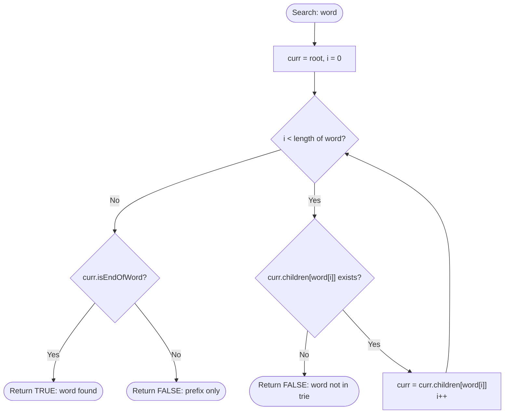

# Trie (Prefix Tree) — Insert, Search & Autocomplete

## 1. Introduction

A **Trie** (pronounced "try", from re**trie**val) is a tree-shaped data structure that stores a set of strings character by character, sharing common prefixes among all strings that start the same way.

Each **node** represents a single character, and each **path from root to a marked node** spells out a word stored in the trie.

For dictionary `{"cat", "can", "car", "card", "care"}`:

```
Root
└── c
    └── a
        ├── t  [word: "cat"]
        ├── n  [word: "can"]
        └── r
            ├── [word: "car"]
            ├── d  [word: "card"]
            └── e  [word: "care"]
```

**Key Property:** All words sharing prefix `"ca"` pass through the same `c → a` path. This makes Trie the ultimate structure for **prefix-based queries**.

---

## 2. Why Use This Algorithm?

### Comparison with Alternative Dictionary Structures:

| Structure | Insert | Search | Prefix Search | Space |
|---|---|---|---|---|
| Hash Map | $O(L)$ | $O(L)$ | $O(n \cdot L)$ — scan all | $O(n \cdot L)$ |
| Sorted Array + Binary Search | $O(n)$ | $O(L \log n)$ | $O(L \log n + k)$ | $O(n \cdot L)$ |
| BST | $O(L \log n)$ | $O(L \log n)$ | $O(L \log n + k)$ | $O(n \cdot L)$ |
| **Trie** | **$O(L)$** | **$O(L)$** | **$O(L + k)$** | $O(n \cdot L \cdot |\Sigma|)$ |

Where $L$ = word length, $n$ = number of words, $k$ = number of prefix matches, $|\Sigma|$ = alphabet size.

**The Core Advantage:** Prefix queries are $O(L + k)$ — just traverse $L$ characters to the prefix node, then enumerate $k$ results from the subtree. No other structure matches this prefix efficiency.

---

## 3. Real-World Applications

- **Autocomplete & Search Suggestions:** Google Search, IDE code completion, and smartphone keyboards use Trie variants to rank and suggest prefixes in real time.
- **Spell Checkers:** Dictionary lookup and "did you mean?" suggestions.
- **IP Routing (Longest Prefix Match):** Routers store IP address prefixes in tries (PATRICIA trie / radix tree) for $O(32)$ routing table lookups.
- **Word Games:** Boggle solvers, Scrabble word validators — trie traversal explores only valid word paths.
- **DNA Sequence Search:** Prefix-based genomic motif search.

---

## 4. Prerequisites & Core Concepts

- **Tree Data Structure:** Nodes and child pointers.
- **Recursion:** Trie operations are naturally recursive.
- **Array/HashMap of Children:** Each node holds up to $|\Sigma|$ child references (26 for lowercase English, 256 for ASCII).
- **`isEndOfWord` Flag:** Boolean at each node marking whether a complete word ends there.

---

## 5. Visualization

### Inserting `{"the", "there", "their", "any", "answer", "by", "bye"}`

```
Root
├── t
│   └── h
│       └── e [word: "the"]
│           ├── r
│           │   └── e [word: "there"]
│           └── i
│               └── r [word: "their"]
├── a
│   └── n
│       ├── y [word: "any"]
│       └── s
│           └── w
│               └── e
│                   └── r [word: "answer"]
└── b
    └── y [word: "by"]
        └── e [word: "bye"]
```

### Mermaid Flowchart — Trie Search



---

## 6. How It Works

### Insert

1. Start at the root node.
2. For each character `c` in the word:
   - If `children[c]` is null, create a new node.
   - Move `curr` to `children[c]`.
3. Mark `curr.isEndOfWord = true`.

### Search

1. Start at the root node.
2. For each character `c` in the word:
   - If `children[c]` is null → word not found → return `false`.
   - Move to `children[c]`.
3. Return `curr.isEndOfWord` (true = exact word exists, false = only a prefix exists).

### StartsWith (Prefix Check)

Same as Search, but return `true` as soon as all characters are traversed (regardless of `isEndOfWord`).

### Delete

1. Recursively traverse to the word's end node.
2. Unmark `isEndOfWord`.
3. On backtrack, delete nodes that have no children and are not end-of-word markers for other words.

---

## 7. Step-by-Step Algorithm

**Insert `"care"` into existing trie with `{"cat", "car"}`:**

| Step | Character | Action |
|---|---|---|
| 1 | `'c'` | `root.children['c']` exists → move to `c` node |
| 2 | `'a'` | `c.children['a']` exists → move to `a` node |
| 3 | `'r'` | `a.children['r']` exists → move to `r` node |
| 4 | `'e'` | `r.children['e']` is null → **create new node** `e` |
| 5 | End | Mark `e.isEndOfWord = true` |

---

## 8. Pseudocode

```text
// TrieNode structure
class TrieNode:
    children[0..25]  // or HashMap<char, TrieNode>
    isEndOfWord = false

// Insert
function insert(root, word):
    curr = root
    for each char c in word:
        idx = c - 'a'
        if curr.children[idx] is null:
            curr.children[idx] = new TrieNode()
        curr = curr.children[idx]
    curr.isEndOfWord = true

// Search (exact match)
function search(root, word):
    curr = root
    for each char c in word:
        idx = c - 'a'
        if curr.children[idx] is null:
            return false
        curr = curr.children[idx]
    return curr.isEndOfWord

// Prefix check
function startsWith(root, prefix):
    curr = root
    for each char c in prefix:
        idx = c - 'a'
        if curr.children[idx] is null:
            return false
        curr = curr.children[idx]
    return true

// Autocomplete: collect all words with given prefix
function autocomplete(root, prefix):
    curr = root
    for each char c in prefix:
        if curr.children[c] is null: return []
        curr = curr.children[c]
    results = []
    dfs(curr, prefix, results)
    return results

function dfs(node, current, results):
    if node.isEndOfWord:
        results.append(current)
    for each child (c, childNode) in node.children:
        dfs(childNode, current + c, results)
```

---

## 9. Code Examples

### C

```c
#include <stdio.h>
#include <string.h>
#include <stdlib.h>
#include <stdbool.h>

#define ALPHABET_SIZE 26

typedef struct TrieNode {
    struct TrieNode* children[ALPHABET_SIZE];
    bool isEndOfWord;
} TrieNode;

TrieNode* createNode() {
    TrieNode* node = (TrieNode*)calloc(1, sizeof(TrieNode));
    node->isEndOfWord = false;
    return node;
}

void insert(TrieNode* root, const char* word) {
    TrieNode* curr = root;
    while (*word) {
        int idx = *word - 'a';
        if (!curr->children[idx])
            curr->children[idx] = createNode();
        curr = curr->children[idx];
        word++;
    }
    curr->isEndOfWord = true;
}

bool search(TrieNode* root, const char* word) {
    TrieNode* curr = root;
    while (*word) {
        int idx = *word - 'a';
        if (!curr->children[idx]) return false;
        curr = curr->children[idx];
        word++;
    }
    return curr->isEndOfWord;
}

bool startsWith(TrieNode* root, const char* prefix) {
    TrieNode* curr = root;
    while (*prefix) {
        int idx = *prefix - 'a';
        if (!curr->children[idx]) return false;
        curr = curr->children[idx];
        prefix++;
    }
    return true;
}

int main() {
    TrieNode* root = createNode();
    insert(root, "cat");
    insert(root, "can");
    insert(root, "car");
    insert(root, "card");
    insert(root, "care");

    printf("search('car')   = %s\n", search(root, "car")   ? "true" : "false");
    printf("search('ca')    = %s\n", search(root, "ca")    ? "true" : "false");
    printf("startsWith('ca')= %s\n", startsWith(root, "ca")? "true" : "false");
    printf("search('cart')  = %s\n", search(root, "cart")  ? "true" : "false");
    return 0;
}
```

### C++

```cpp
#include <iostream>
#include <string>
#include <vector>
#include <unordered_map>

using namespace std;

class Trie {
    struct TrieNode {
        unordered_map<char, TrieNode*> children;
        bool isEnd = false;
    };

    TrieNode* root;

    void collectWords(TrieNode* node, string& current, vector<string>& results) {
        if (node->isEnd) results.push_back(current);
        for (auto& [c, child] : node->children) {
            current.push_back(c);
            collectWords(child, current, results);
            current.pop_back();
        }
    }

public:
    Trie() { root = new TrieNode(); }

    void insert(const string& word) {
        TrieNode* curr = root;
        for (char c : word) {
            if (!curr->children.count(c))
                curr->children[c] = new TrieNode();
            curr = curr->children[c];
        }
        curr->isEnd = true;
    }

    bool search(const string& word) {
        TrieNode* curr = root;
        for (char c : word) {
            if (!curr->children.count(c)) return false;
            curr = curr->children[c];
        }
        return curr->isEnd;
    }

    bool startsWith(const string& prefix) {
        TrieNode* curr = root;
        for (char c : prefix) {
            if (!curr->children.count(c)) return false;
            curr = curr->children[c];
        }
        return true;
    }

    vector<string> autocomplete(const string& prefix) {
        TrieNode* curr = root;
        for (char c : prefix) {
            if (!curr->children.count(c)) return {};
            curr = curr->children[c];
        }
        vector<string> results;
        string current = prefix;
        collectWords(curr, current, results);
        return results;
    }
};

int main() {
    Trie trie;
    for (const string& w : {"cat", "can", "car", "card", "care", "careful"})
        trie.insert(w);

    cout << boolalpha;
    cout << "search('car')    = " << trie.search("car")    << "\n";  // true
    cout << "search('ca')     = " << trie.search("ca")     << "\n";  // false
    cout << "startsWith('ca') = " << trie.startsWith("ca") << "\n";  // true
    cout << "search('cart')   = " << trie.search("cart")   << "\n";  // false

    cout << "\nAutocomplete 'car': ";
    for (const string& w : trie.autocomplete("car"))
        cout << w << " ";
    cout << "\n";  // car card care careful
    return 0;
}
```

### Java

```java
import java.util.*;

public class Trie {

    private static class TrieNode {
        Map<Character, TrieNode> children = new HashMap<>();
        boolean isEnd = false;
    }

    private final TrieNode root = new TrieNode();

    public void insert(String word) {
        TrieNode curr = root;
        for (char c : word.toCharArray()) {
            curr.children.putIfAbsent(c, new TrieNode());
            curr = curr.children.get(c);
        }
        curr.isEnd = true;
    }

    public boolean search(String word) {
        TrieNode curr = root;
        for (char c : word.toCharArray()) {
            if (!curr.children.containsKey(c)) return false;
            curr = curr.children.get(c);
        }
        return curr.isEnd;
    }

    public boolean startsWith(String prefix) {
        TrieNode curr = root;
        for (char c : prefix.toCharArray()) {
            if (!curr.children.containsKey(c)) return false;
            curr = curr.children.get(c);
        }
        return true;
    }

    public List<String> autocomplete(String prefix) {
        TrieNode curr = root;
        for (char c : prefix.toCharArray()) {
            if (!curr.children.containsKey(c)) return Collections.emptyList();
            curr = curr.children.get(c);
        }
        List<String> results = new ArrayList<>();
        dfs(curr, new StringBuilder(prefix), results);
        return results;
    }

    private void dfs(TrieNode node, StringBuilder current, List<String> results) {
        if (node.isEnd) results.add(current.toString());
        for (Map.Entry<Character, TrieNode> entry : node.children.entrySet()) {
            current.append(entry.getKey());
            dfs(entry.getValue(), current, results);
            current.deleteCharAt(current.length() - 1);
        }
    }

    public static void main(String[] args) {
        Trie trie = new Trie();
        for (String w : new String[]{"cat", "can", "car", "card", "care", "careful"})
            trie.insert(w);

        System.out.println("search('car')    = " + trie.search("car"));    // true
        System.out.println("search('ca')     = " + trie.search("ca"));     // false
        System.out.println("startsWith('ca') = " + trie.startsWith("ca")); // true
        System.out.println("Autocomplete 'car': " + trie.autocomplete("car")); // [car, card, care, careful]
    }
}
```

### Python

```python
class TrieNode:
    def __init__(self):
        self.children: dict[str, 'TrieNode'] = {}
        self.is_end: bool = False


class Trie:
    def __init__(self):
        self.root = TrieNode()

    def insert(self, word: str) -> None:
        curr = self.root
        for c in word:
            if c not in curr.children:
                curr.children[c] = TrieNode()
            curr = curr.children[c]
        curr.is_end = True

    def search(self, word: str) -> bool:
        curr = self.root
        for c in word:
            if c not in curr.children:
                return False
            curr = curr.children[c]
        return curr.is_end

    def starts_with(self, prefix: str) -> bool:
        curr = self.root
        for c in prefix:
            if c not in curr.children:
                return False
            curr = curr.children[c]
        return True

    def autocomplete(self, prefix: str) -> list[str]:
        curr = self.root
        for c in prefix:
            if c not in curr.children:
                return []
            curr = curr.children[c]
        results = []
        self._dfs(curr, list(prefix), results)
        return results

    def _dfs(self, node: TrieNode, current: list[str], results: list[str]) -> None:
        if node.is_end:
            results.append(''.join(current))
        for c, child in sorted(node.children.items()):  # sorted for determinism
            current.append(c)
            self._dfs(child, current, results)
            current.pop()

    def count_words_with_prefix(self, prefix: str) -> int:
        return len(self.autocomplete(prefix))


if __name__ == "__main__":
    trie = Trie()
    words = ["cat", "can", "car", "card", "care", "careful"]
    for w in words:
        trie.insert(w)

    print(f"search('car')      = {trie.search('car')}")        # True
    print(f"search('ca')       = {trie.search('ca')}")         # False
    print(f"starts_with('ca')  = {trie.starts_with('ca')}")    # True
    print(f"search('cart')     = {trie.search('cart')}")       # False
    print(f"autocomplete('car')= {trie.autocomplete('car')}")  # ['car', 'card', 'care', 'careful']
    print(f"autocomplete('can')= {trie.autocomplete('can')}")  # ['can']
```

### JavaScript

```javascript
class TrieNode {
    constructor() {
        this.children = {};
        this.isEnd = false;
    }
}

class Trie {
    constructor() {
        this.root = new TrieNode();
    }

    insert(word) {
        let curr = this.root;
        for (const c of word) {
            if (!curr.children[c])
                curr.children[c] = new TrieNode();
            curr = curr.children[c];
        }
        curr.isEnd = true;
    }

    search(word) {
        let curr = this.root;
        for (const c of word) {
            if (!curr.children[c]) return false;
            curr = curr.children[c];
        }
        return curr.isEnd;
    }

    startsWith(prefix) {
        let curr = this.root;
        for (const c of prefix) {
            if (!curr.children[c]) return false;
            curr = curr.children[c];
        }
        return true;
    }

    autocomplete(prefix) {
        let curr = this.root;
        for (const c of prefix) {
            if (!curr.children[c]) return [];
            curr = curr.children[c];
        }
        const results = [];
        const dfs = (node, current) => {
            if (node.isEnd) results.push(current);
            for (const [c, child] of Object.entries(node.children))
                dfs(child, current + c);
        };
        dfs(curr, prefix);
        return results;
    }
}

const trie = new Trie();
["cat", "can", "car", "card", "care", "careful"].forEach(w => trie.insert(w));

console.log("search('car')     =", trie.search("car"));       // true
console.log("search('ca')      =", trie.search("ca"));        // false
console.log("startsWith('ca')  =", trie.startsWith("ca"));   // true
console.log("autocomplete('car')=", trie.autocomplete("car")); // ['car','card','care','careful']
```

---

## 10. Code Explanation

| Component | Purpose |
|---|---|
| `children[26]` or `children: dict` | Maps each character to the next node. Array for fixed alphabet; HashMap for dynamic alphabets. |
| `isEnd` flag | Distinguishes a stored word from a mere prefix path. `"ca"` exists as a prefix but not a word unless marked. |
| `dfs` in autocomplete | Explores all words reachable from the prefix node using depth-first traversal. |
| `current.pop()` in DFS | Backtracking — removes the last character when returning from a subtree. |

---

## 11. Interactive Demo Scenario

**Input dictionary:** `{"the", "there", "their", "any"}`

**Operation sequence:**

| Operation | Input | Expected Result |
|---|---|---|
| `insert` | `"the"` | Trie built |
| `insert` | `"there"` | Extends `"the"` path |
| `search` | `"the"` | `true` (marked as word) |
| `search` | `"th"` | `false` (prefix only) |
| `startsWith` | `"th"` | `true` |
| `autocomplete` | `"the"` | `["the", "their", "there"]` |
| `search` | `"xyz"` | `false` |

---

## 12. Dry Run Trace

**Inserting `"card"` into trie with existing `{"cat", "car"}`:**

```
Trie state before:
root → c → a → t [end]
               r [end]

Insert "card":
Step 1: 'c' → node exists, move to c
Step 2: 'a' → node exists, move to a
Step 3: 'r' → node exists, move to r
Step 4: 'd' → children['d'] is NULL → CREATE new node d
Step 5: Mark d.isEnd = true

Trie state after:
root → c → a → t [end]
               r [end]
                 └── d [end]
```

---

## 13. Time & Space Complexity

| Operation | Time | Space |
|---|---|---|
| Insert | $O(L)$ | $O(L \cdot |\Sigma|)$ worst |
| Search | $O(L)$ | $O(1)$ extra |
| StartsWith | $O(L)$ | $O(1)$ extra |
| Autocomplete | $O(L + k)$ | $O(k)$ for results |
| **Total Space** | — | $O(n \cdot L \cdot |\Sigma|)$ |

Where $L$ = average word length, $n$ = number of words, $|\Sigma|$ = alphabet size (26 for lowercase).

---

## 14. Advantages

- **$O(L)$ Insert and Search:** Independent of the dictionary size $n$ — fastest dictionary operations for strings.
- **Excellent Prefix Queries:** Autocomplete, prefix counting, and longest prefix match are $O(L + k)$.
- **Shared Prefix Storage:** Common prefixes stored once, saving space compared to hash sets for large dictionaries with many shared prefixes.
- **No Hash Collisions:** Unlike hash maps, trie search is always exact and deterministic.

---

## 15. Disadvantages

- **High Memory Usage:** Each node stores $|\Sigma|$ child pointers. For 26-character English alphabet + 10 digits, each node is 36 pointers. Use Compressed Trie / PATRICIA Trie for better memory.
- **Cache Unfriendly:** Pointer-chasing through tree nodes causes cache misses on large dictionaries.
- **Not Ideal for Exact Key-Value Storage:** Hash maps are faster for pure key lookup without prefix semantics.

---

## 16. Applications

- **T9 Predictive Text Input:** Mobile keyboards.
- **DNS Lookup:** Domain name prefix matching.
- **Router Longest Prefix Match (LPM):** Binary trie over 32-bit IP addresses.
- **Word Frequency Counting:** Augment each node with a frequency counter.
- **Boggle / Word Search:** DFS over board letters guided by trie to prune invalid paths early.

---

## 17. Common Mistakes

1. **Returning `true` for Prefix Instead of Exact Match:** `search("ca")` must check `isEnd` — returning `true` just because the node exists is wrong (it's a prefix, not a stored word).
2. **Array Index Out of Bounds:** Using `c - 'a'` assumes only lowercase letters. Uppercase or symbols cause negative or out-of-range indices.
3. **Memory Leaks in C/C++:** Not freeing trie nodes on deletion or destruction.
4. **Incomplete Delete:** Deleting a word but not cleaning up orphan nodes (nodes with no children and `isEnd = false`) wastes memory.

---

## 18. Interview Questions

### Q1. What is the difference between `search` and `startsWith` in a Trie?

**Answer:** `search(word)` returns `true` only if `word` was explicitly inserted (the final node has `isEnd = true`). `startsWith(prefix)` returns `true` if any inserted word begins with `prefix` — it does not require `isEnd`. For example, after inserting `"car"`, `search("ca")` = `false` but `startsWith("ca")` = `true`.

### Q2. How would you implement a Trie with frequency counts for autocomplete ranking?

**Answer:** Add an integer `count` field to each `TrieNode`. On `insert`, increment `count` at every node along the path. On `autocomplete`, collect words and sort by their terminal node's `count` (or maintain a priority queue during DFS). This gives the top-K frequent completions.

### Q3. What is the space complexity of a Trie with n words of average length L?

**Answer:** $O(n \cdot L \cdot |\Sigma|)$ in the worst case (no shared prefixes). In the best case (all words share a long common prefix), space approaches $O(L_{max} \cdot |\Sigma|)$. A **Compressed Trie** (Patricia Trie / Radix Tree) reduces space by merging single-child chains into single edges, achieving $O(n)$ nodes instead of $O(n \cdot L)$.

---

## 19. Practice Problems

1. **LeetCode 208 — Implement Trie (Prefix Tree) (Medium):** Classic implementation of insert, search, startsWith.
2. **LeetCode 212 — Word Search II (Hard):** Use Trie + DFS on a 2D board.
3. **LeetCode 211 — Design Add and Search Words Data Structure (Medium):** Trie with wildcard `.` matching.
4. **LeetCode 745 — Prefix and Suffix Search (Hard):** Augmented trie with suffix wrapping.
5. **LeetCode 421 — Maximum XOR of Two Numbers in an Array (Medium):** Binary Trie for XOR maximization.

---

## 20. Related Algorithms

| Algorithm | Relation |
|---|---|
| **Compressed Trie (Radix Tree)** | Space-optimized trie merging single-child chains. |
| **Aho-Corasick** | Multi-pattern automaton built on a Trie with failure links. |
| **Suffix Tree** | Trie of all suffixes of a string (with compression). |
| **Hash Map** | Alternative for exact key lookup without prefix semantics. |
| **B-Tree** | Used for on-disk prefix indexing in databases. |

---

## 21. Summary

| Property | Value |
|---|---|
| **Structure** | Tree with branching factor $|\Sigma|$ |
| **Insert / Search** | $O(L)$ — proportional to word length only |
| **Prefix Query** | $O(L + k)$ — fastest possible |
| **Space** | $O(n \cdot L \cdot |\Sigma|)$ worst case |
| **Key Trick** | Shared prefix paths; `isEnd` flag distinguishes words from prefixes |
| **Best For** | Autocomplete, spell check, IP routing, word games |

**Key Takeaway:** Trie is the optimal data structure for string prefix operations. When your application needs lightning-fast autocomplete, prefix counting, or longest-prefix-match — Trie is the first choice.

---

## 22. Quiz

**Question 1:** After inserting `"car"` into a Trie, what does `search("ca")` return?

- A) `true` — `"ca"` is a prefix of `"car"`.
- B) `false` — `"ca"` was not explicitly inserted.
- C) `-1` — Error, node doesn't exist.
- D) `true` — all prefixes of stored words are automatically stored.

- **Correct Answer:** B
- **Explanation:** `search` checks `isEndOfWord` at the final node. After inserting only `"car"`, the node for `'a'` (in `c → a`) does NOT have `isEnd = true`. So `search("ca") = false`.

---

**Question 2:** What is the time complexity of an autocomplete query with prefix of length $L$ returning $k$ results?

- A) $O(n \cdot L)$
- B) $O(L \cdot k)$
- C) $O(L + k)$
- D) $O(L \log n)$

- **Correct Answer:** C
- **Explanation:** Traversing the prefix takes $O(L)$ steps. Then DFS from the prefix node visits each of the $k$ result words once, taking $O(k)$. Total: $O(L + k)$.

---

**Question 3:** Which of the following is NOT an advantage of a Trie over a Hash Map for string dictionaries?

- A) Prefix queries are faster.
- B) No hash collision risk.
- C) Uses less memory for large alphabets.
- D) Autocomplete is natively supported.

- **Correct Answer:** C
- **Explanation:** Trie nodes each store $|\Sigma|$ child pointers, which is **more** memory than a hash map entry for the same word. Hash maps are more space-efficient for pure storage. Trie's advantages are prefix operations, not memory savings.
