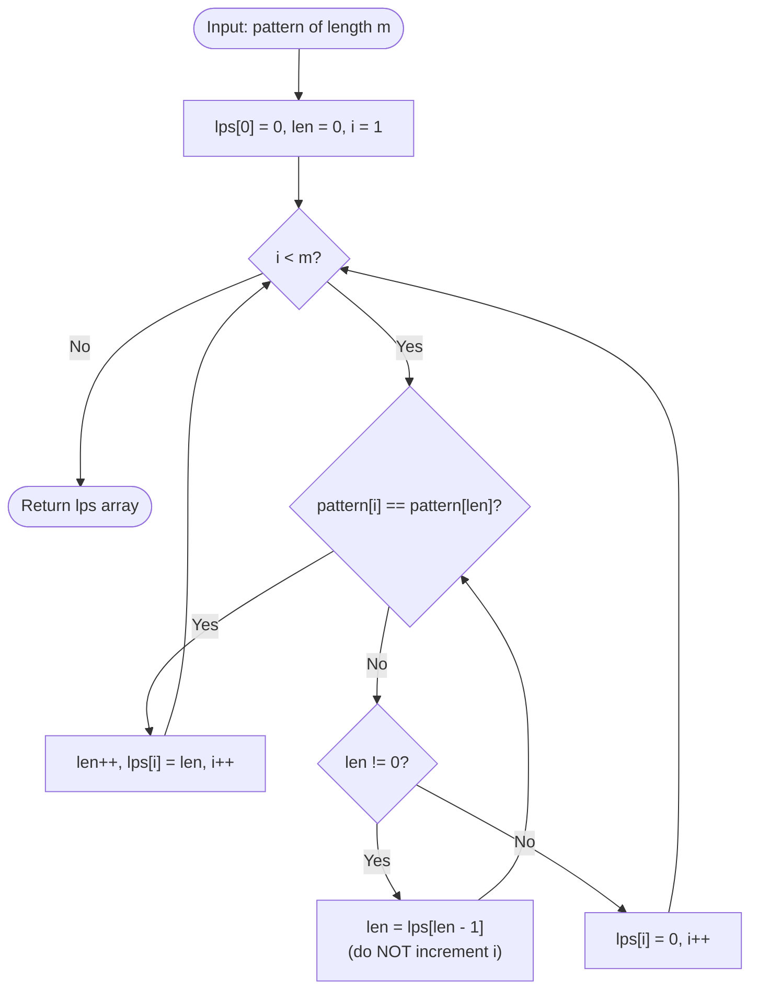

# Prefix Function (KMP Failure Function / LPS Array)

## 1. Introduction

The **Prefix Function** (also called the **KMP Failure Function** or **LPS — Longest Proper Prefix which is also Suffix — Array**) is a fundamental string pre-processing technique that computes, for every index $i$ of a string $S$, the length of the **longest proper prefix of $S[0 \dots i]$ that is also a suffix of $S[0 \dots i]$**.

For string `S = "aabaabaab"`:

```
Index:  0  1  2  3  4  5  6  7  8
Char:   a  a  b  a  a  b  a  a  b
LPS:   [0, 1, 0, 1, 2, 3, 4, 5, 6]
```

Interpretation:
- `LPS[5] = 3` → `"aab"` is the longest prefix of `"aabaaab"` that is also its suffix.
- `LPS[8] = 6` → `"aabaaab"` has a prefix-suffix match of length 6.

The prefix function is the **core preprocessing step of the KMP algorithm**, but it has standalone applications across string analysis.

---

## 2. Why Use This Algorithm?

### Comparison — Brute Force vs. Prefix Function:

| Approach | Compute LPS | Space | Use Case |
|---|---|---|---|
| Brute Force (all prefix/suffix pairs) | $O(n^3)$ | $O(n^2)$ | Unusable in practice |
| Hashing (per position) | $O(n)$ avg | $O(n)$ | Probabilistic, collision risk |
| **Prefix Function (KMP)** | **$O(n)$** | **$O(n)$** | Deterministic, exact |

**The Core Advantage:** The prefix function uses previously computed `lps[j-1]` values to avoid redundant character comparisons — achieving true $O(n)$ computation. It is the foundation of:

- KMP pattern matching ($O(n + m)$).
- String period detection.
- Counting prefix-suffix overlaps.
- Palindrome detection variants.

---

## 3. Real-World Applications

- **KMP String Search:** The prefix function is the preprocessing step that gives KMP its $O(n + m)$ guarantee.
- **String Periodicity:** The shortest period of string $S$ is $n - \text{lps}[n-1]$. Used in compression and pattern analysis.
- **Border Detection:** Borders (strings that are both prefix and suffix) are directly read from the `lps` chain.
- **Intrusion Detection Systems:** Fast multi-signature scanning of network payloads.
- **Bioinformatics:** Detecting repeated motifs and tandem repeats in genomic sequences.

---

## 4. Prerequisites & Core Concepts

- **Prefix:** $S[0 \dots k]$ for some $k < n$.
- **Suffix:** $S[j \dots n-1]$ for some $j > 0$.
- **Proper Prefix/Suffix:** Excludes the full string itself.
- **Border:** A string that is simultaneously a proper prefix and a proper suffix of $S$.
- **KMP Algorithm:** Uses the prefix function as its failure function.

---

## 5. Visualization

### LPS Array for `S = "AABAAB"`

```
Index:  0  1  2  3  4  5
Char:   A  A  B  A  A  B
LPS:   [0, 1, 0, 1, 2, 3]

LPS[5] = 3 means "AAB" (length 3) is both a prefix and suffix of "AABAAB":
  Prefix "AAB":  A A B a a b
  Suffix "AAB":  a a b A A B  ← last 3 characters
```

### Building LPS Step by Step

```
i=0: 'A' → lps[0] = 0 (always 0 by definition)
i=1: 'A' == pattern[lps[0]] = pattern[0] = 'A' → len=1 → lps[1] = 1
i=2: 'B' != pattern[len=1] = 'A' → len = lps[0] = 0
     'B' != pattern[0] = 'A' → lps[2] = 0
i=3: 'A' == pattern[0] = 'A' → len=1 → lps[3] = 1
i=4: 'A' == pattern[1] = 'A' → len=2 → lps[4] = 2
i=5: 'B' == pattern[2] = 'B' → len=3 → lps[5] = 3
```

### Mermaid Flowchart



---

## 6. How It Works

The algorithm maintains:
- **`len`:** Length of the previous longest prefix-suffix match.
- **`i`:** Current position being processed (starts at 1; `lps[0]` is always 0).

**At each step $i$:**

1. **If `pattern[i] == pattern[len]`:** The current match extends by 1. Set `lps[i] = len + 1`, increment both `len` and `i`.

2. **If mismatch and `len > 0`:** Fall back: `len = lps[len - 1]`. This reuses the already-computed LPS value to try a shorter prefix-suffix — **do not increment `i`**, we retry the same position with the shorter prefix.

3. **If mismatch and `len == 0`:** No prefix-suffix match possible. Set `lps[i] = 0`, increment `i`.

**Why is `len = lps[len - 1]` correct?**

`lps[len - 1]` gives the length of the longest border of `pattern[0 \dots len-1]`. If `pattern[0 \dots len-1]` matches the suffix ending at $i-1$, and `lps[len-1]` is a border of that prefix, then `pattern[0 \dots lps[len-1]-1]` also matches a suffix ending at $i-1$. We try to extend that shorter match.

---

## 7. Step-by-Step Algorithm

```
Compute LPS for pattern P of length m:

1. Create lps array of size m, initialize to 0.
2. Set len = 0, i = 1.
3. While i < m:
   a. If P[i] == P[len]:
      - len++
      - lps[i] = len
      - i++
   b. Else:
      - If len != 0:
        - len = lps[len - 1]   (fallback, do NOT change i)
      - Else:
        - lps[i] = 0
        - i++
4. Return lps.
```

---

## 8. Pseudocode

```text
function computePrefix(pattern):
    m = length(pattern)
    lps = array of m zeros

    len = 0
    i = 1

    while i < m:
        if pattern[i] == pattern[len]:
            len = len + 1
            lps[i] = len
            i = i + 1
        else:
            if len != 0:
                len = lps[len - 1]   // key fallback step
                // do NOT increment i here
            else:
                lps[i] = 0
                i = i + 1

    return lps

// Using prefix function for KMP search:
function KMPSearch(text, pattern):
    n = length(text)
    m = length(pattern)
    lps = computePrefix(pattern)

    i = 0  // text index
    j = 0  // pattern index
    matches = []

    while i < n:
        if text[i] == pattern[j]:
            i++; j++
        if j == m:
            matches.append(i - j)
            j = lps[j - 1]
        else if i < n and text[i] != pattern[j]:
            if j != 0:
                j = lps[j - 1]
            else:
                i++
    return matches

// Finding string period using prefix function:
function findPeriod(s):
    lps = computePrefix(s)
    n = length(s)
    period = n - lps[n - 1]
    if n % period == 0:
        return period
    return n  // string has no proper period
```

---

## 9. Code Examples

### C

```c
#include <stdio.h>
#include <string.h>
#include <stdlib.h>

int* computeLPS(const char* pattern, int m) {
    int* lps = (int*)calloc(m, sizeof(int));
    int len = 0;
    int i = 1;

    while (i < m) {
        if (pattern[i] == pattern[len]) {
            len++;
            lps[i] = len;
            i++;
        } else {
            if (len != 0) {
                len = lps[len - 1];  // fallback
            } else {
                lps[i] = 0;
                i++;
            }
        }
    }
    return lps;
}

void KMPSearch(const char* text, const char* pattern) {
    int n = strlen(text);
    int m = strlen(pattern);
    int* lps = computeLPS(pattern, m);

    int i = 0, j = 0;
    while (i < n) {
        if (text[i] == pattern[j]) { i++; j++; }

        if (j == m) {
            printf("Pattern found at index %d\n", i - j);
            j = lps[j - 1];
        } else if (i < n && text[i] != pattern[j]) {
            if (j != 0) j = lps[j - 1];
            else i++;
        }
    }
    free(lps);
}

void printLPS(const char* pattern) {
    int m = strlen(pattern);
    int* lps = computeLPS(pattern, m);
    printf("LPS for \"%s\": [", pattern);
    for (int i = 0; i < m; i++)
        printf("%d%s", lps[i], i < m-1 ? ", " : "");
    printf("]\n");
    free(lps);
}

int main() {
    printLPS("AABAAB");
    printLPS("AABAABAAB");
    printLPS("ABCABC");
    KMPSearch("AABAABAABAAB", "AABAAB");
    return 0;
}
```

### C++

```cpp
#include <iostream>
#include <vector>
#include <string>

using namespace std;

vector<int> computeLPS(const string& pattern) {
    int m = pattern.size();
    vector<int> lps(m, 0);
    int len = 0;
    int i = 1;

    while (i < m) {
        if (pattern[i] == pattern[len]) {
            len++;
            lps[i] = len;
            i++;
        } else {
            if (len != 0) {
                len = lps[len - 1];
            } else {
                lps[i] = 0;
                i++;
            }
        }
    }
    return lps;
}

vector<int> kmpSearch(const string& text, const string& pattern) {
    vector<int> matches;
    int n = text.size(), m = pattern.size();
    if (m == 0 || n < m) return matches;

    vector<int> lps = computeLPS(pattern);
    int i = 0, j = 0;

    while (i < n) {
        if (text[i] == pattern[j]) { i++; j++; }

        if (j == m) {
            matches.push_back(i - j);
            j = lps[j - 1];
        } else if (i < n && text[i] != pattern[j]) {
            j = (j != 0) ? lps[j - 1] : 0;
            if (j == 0) i++;
        }
    }
    return matches;
}

// Find shortest period of string using prefix function
int findPeriod(const string& s) {
    auto lps = computeLPS(s);
    int n = s.size();
    int period = n - lps[n - 1];
    return (n % period == 0) ? period : n;
}

int main() {
    vector<string> patterns = {"AABAAB", "AABAABAAB", "ABCABC", "ABCDE"};
    for (const auto& p : patterns) {
        auto lps = computeLPS(p);
        cout << "LPS(\"" << p << "\") = [";
        for (int i = 0; i < (int)lps.size(); i++)
            cout << lps[i] << (i + 1 < (int)lps.size() ? "," : "");
        cout << "]  period=" << findPeriod(p) << "\n";
    }

    cout << "\nKMP Search matches for 'AABAAB' in 'AABAABAABAAB': ";
    for (int idx : kmpSearch("AABAABAABAAB", "AABAAB"))
        cout << idx << " ";
    cout << "\n";
    return 0;
}
```

### Java

```java
import java.util.*;

public class PrefixFunction {

    public static int[] computeLPS(String pattern) {
        int m = pattern.length();
        int[] lps = new int[m];
        int len = 0;
        int i = 1;

        while (i < m) {
            if (pattern.charAt(i) == pattern.charAt(len)) {
                len++;
                lps[i] = len;
                i++;
            } else {
                if (len != 0) {
                    len = lps[len - 1];
                } else {
                    lps[i] = 0;
                    i++;
                }
            }
        }
        return lps;
    }

    public static List<Integer> kmpSearch(String text, String pattern) {
        List<Integer> matches = new ArrayList<>();
        int n = text.length(), m = pattern.length();
        if (m == 0 || n < m) return matches;

        int[] lps = computeLPS(pattern);
        int i = 0, j = 0;

        while (i < n) {
            if (text.charAt(i) == pattern.charAt(j)) { i++; j++; }

            if (j == m) {
                matches.add(i - j);
                j = lps[j - 1];
            } else if (i < n && text.charAt(i) != pattern.charAt(j)) {
                if (j != 0) j = lps[j - 1];
                else i++;
            }
        }
        return matches;
    }

    public static int findPeriod(String s) {
        int[] lps = computeLPS(s);
        int n = s.length();
        int period = n - lps[n - 1];
        return (n % period == 0) ? period : n;
    }

    public static void main(String[] args) {
        String[] patterns = {"AABAAB", "AABAABAAB", "ABCABC", "ABCDE"};
        for (String p : patterns) {
            System.out.println("LPS(\"" + p + "\") = " +
                Arrays.toString(computeLPS(p)) +
                "  period=" + findPeriod(p));
        }
        System.out.println("\nKMP matches: " + kmpSearch("AABAABAABAAB", "AABAAB"));
    }
}
```

### Python

```python
def compute_lps(pattern: str) -> list[int]:
    """Compute the LPS (Longest Proper Prefix = Suffix) array in O(m) time."""
    m = len(pattern)
    lps = [0] * m
    length = 0
    i = 1

    while i < m:
        if pattern[i] == pattern[length]:
            length += 1
            lps[i] = length
            i += 1
        else:
            if length != 0:
                length = lps[length - 1]   # key fallback
            else:
                lps[i] = 0
                i += 1

    return lps


def kmp_search(text: str, pattern: str) -> list[int]:
    """KMP pattern search using prefix function. Returns list of match start indices."""
    n, m = len(text), len(pattern)
    if m == 0 or n < m:
        return []

    lps = compute_lps(pattern)
    matches = []
    i = j = 0

    while i < n:
        if text[i] == pattern[j]:
            i += 1
            j += 1

        if j == m:
            matches.append(i - j)
            j = lps[j - 1]
        elif i < n and text[i] != pattern[j]:
            if j != 0:
                j = lps[j - 1]
            else:
                i += 1

    return matches


def find_period(s: str) -> int:
    """Shortest period of string s using prefix function. Returns n if no proper period."""
    lps = compute_lps(s)
    n = len(s)
    period = n - lps[n - 1]
    return period if n % period == 0 else n


def count_borders(s: str) -> list[str]:
    """Returns all border strings (proper prefix = suffix) of s."""
    lps = compute_lps(s)
    borders = []
    length = lps[-1]
    while length > 0:
        borders.append(s[:length])
        length = lps[length - 1]
    return borders


if __name__ == "__main__":
    examples = ["AABAAB", "AABAABAAB", "ABCABC", "ABCDE", "aabaabaab"]
    for p in examples:
        lps = compute_lps(p)
        print(f'LPS("{p}") = {lps}  period={find_period(p)}  borders={count_borders(p)}')

    print()
    print(f"KMP Search 'AABAAB' in 'AABAABAABAAB': {kmp_search('AABAABAABAAB', 'AABAAB')}")
    print(f"KMP Search 'abc' in 'abcabcabc':       {kmp_search('abcabcabc', 'abc')}")
```

### JavaScript

```javascript
function computeLPS(pattern) {
    const m = pattern.length;
    const lps = Array(m).fill(0);
    let len = 0, i = 1;

    while (i < m) {
        if (pattern[i] === pattern[len]) {
            len++;
            lps[i] = len;
            i++;
        } else {
            if (len !== 0) {
                len = lps[len - 1];  // fallback
            } else {
                lps[i] = 0;
                i++;
            }
        }
    }
    return lps;
}

function kmpSearch(text, pattern) {
    const n = text.length, m = pattern.length;
    if (m === 0 || n < m) return [];

    const lps = computeLPS(pattern);
    const matches = [];
    let i = 0, j = 0;

    while (i < n) {
        if (text[i] === pattern[j]) { i++; j++; }

        if (j === m) {
            matches.push(i - j);
            j = lps[j - 1];
        } else if (i < n && text[i] !== pattern[j]) {
            if (j !== 0) j = lps[j - 1];
            else i++;
        }
    }
    return matches;
}

function findPeriod(s) {
    const lps = computeLPS(s);
    const n = s.length;
    const period = n - lps[n - 1];
    return n % period === 0 ? period : n;
}

// Tests
const patterns = ["AABAAB", "AABAABAAB", "ABCABC", "ABCDE"];
patterns.forEach(p => {
    console.log(`LPS("${p}") = [${computeLPS(p)}]  period=${findPeriod(p)}`);
});

console.log("\nKMP matches:", kmpSearch("AABAABAABAAB", "AABAAB"));
```

---

## 10. Code Explanation

| Code Segment | Purpose |
|---|---|
| `lps[0] = 0` (implicit) | A string of length 1 has no proper prefix/suffix. |
| `i = 1` loop start | `lps[0]` is always 0 by definition; computation starts from index 1. |
| `len = lps[len - 1]` | The key fallback: reuse the LPS of the current partial match's prefix, avoiding $O(n^2)$ rescanning. |
| `if len != 0` before fallback | Prevents accessing `lps[-1]` — when `len == 0`, we simply set `lps[i] = 0` and advance `i`. |
| `j = lps[j - 1]` in KMP search | After a full match, shift pattern using LPS to look for overlapping matches. |

---

## 11. Interactive Demo Scenario

**Input:** `pattern = "ABCABCD"`

**Trace:**

| $i$ | `pattern[i]` | `len` | `pattern[len]` | Match? | `lps[i]` | Action |
|---|---|---|---|---|---|---|
| 1 | B | 0 | A | No | 0 | `lps[1]=0, i++` |
| 2 | C | 0 | A | No | 0 | `lps[2]=0, i++` |
| 3 | A | 0 | A | Yes | 1 | `len=1, lps[3]=1, i++` |
| 4 | B | 1 | B | Yes | 2 | `len=2, lps[4]=2, i++` |
| 5 | C | 2 | C | Yes | 3 | `len=3, lps[5]=3, i++` |
| 6 | D | 3 | A | No | — | `len=lps[2]=0` (fallback) |
| 6 | D | 0 | A | No | 0 | `lps[6]=0, i++` |

**Result:** `LPS = [0, 0, 0, 1, 2, 3, 0]`

---

## 12. Dry Run Trace

**KMP Search: `text = "AABAABAABAAB"`, `pattern = "AABAAB"` (m=6)**

LPS for `"AABAAB"` = `[0, 1, 0, 1, 2, 3]`

| Step | `i` | `j` | `text[i]` | `pattern[j]` | Action |
|---|---|---|---|---|---|
| 1–6 | 0→5 | 0→5 | AABAAB | AABAAB | Match, j=6 → **match at 0**, j=lps[5]=3 |
| 7–9 | 6→8 | 3→5 | AAB | AAB | Match, j=6 → **match at 3**, j=lps[5]=3 |
| 10–12 | 9→11 | 3→5 | AAB | AAB | Match, j=6 → **match at 6**, j=lps[5]=3 |
| End | 12 | 3 | — | — | i=n, stop |

**Matches at indices: 0, 3, 6** ✓

---

## 13. Time & Space Complexity

| Metric | Prefix Function | KMP Search (total) |
|---|---|---|
| **Time** | $O(m)$ | $O(n + m)$ |
| **Space** | $O(m)$ | $O(m)$ (for LPS array) |

### Complexity Proof

**Why is `computeLPS` $O(m)$?**
The variable `len` can increase by at most 1 per outer loop iteration. The fallback `len = lps[len - 1]` strictly decreases `len`. Since `len` can increase at most $m$ times total, the total number of fallback steps is bounded by $m$. Therefore all iterations combined take $O(m)$.

---

## 14. Advantages

- **Linear $O(m)$ Computation:** Despite the inner fallback loop, amortized cost is strictly $O(m)$.
- **Foundation of KMP:** Enables $O(n + m)$ guaranteed string search — no worst-case $O(n \cdot m)$ degradation.
- **Period Detection:** `n - lps[n-1]` gives the shortest period of the string in $O(n)$.
- **Border Enumeration:** By following the LPS chain backward, all borders (prefix = suffix strings) are enumerable in $O(n)$.

---

## 15. Disadvantages

- **Pattern-Specific:** LPS array is recomputed for each new pattern; cannot be reused across patterns.
- **Sublinear Search Not Possible:** KMP is $O(n)$ search but never sublinear like Boyer-Moore's $O(n/m)$ best case.

---

## 16. Applications

- KMP string search (direct use).
- String period detection: `period = n - lps[n-1]`.
- Circular string rotation: `s` is a rotation of `t` iff `s` appears in `t + t` — check with KMP.
- Detecting whether a string is a repetition of a shorter pattern.
- Compressed representation of repeated patterns.

---

## 17. Common Mistakes

1. **Starting `i` at 0:** `lps[0]` is always 0 by definition. The loop must start at `i = 1`.
2. **Incrementing `i` during fallback:** When `len = lps[len - 1]` is executed, `i` must **not** be incremented — we retry position `i` with the shorter prefix length.
3. **Using `lps[j]` instead of `lps[j - 1]` in KMP search:** When a full match is found (`j == m`), reset with `j = lps[j - 1]`, not `lps[j]`.
4. **Zero-indexing vs. One-indexing:** Some textbooks present the prefix function as 1-indexed; ensure consistency with your implementation.

---

## 18. Interview Questions

### Q1. What does `lps[i]` represent?

**Answer:** `lps[i]` is the length of the longest **proper** prefix of `pattern[0 \dots i]` that is also a suffix of `pattern[0 \dots i]`. "Proper" means it excludes the full string itself. For `"AABAAB"`, `lps[5] = 3` because `"AAB"` (length 3) is both a prefix and a suffix of `"AABAAB"`.

### Q2. Why is `len = lps[len - 1]` the correct fallback step?

**Answer:** After a mismatch at `pattern[i]` vs `pattern[len]`, we can't use the full prefix of length `len`. But we know `pattern[0 \dots len-1]` matched a suffix ending at `i-1`. `lps[len - 1]` gives the longest border of that matched prefix — a shorter prefix that also matches a suffix. We fall back to that length and try again, avoiding redundant comparisons.

### Q3. How do you find the shortest period of a string using the prefix function?

**Answer:** Compute `lps` for string $S$ of length $n$. The candidate period is `period = n - lps[n - 1]`. If `n % period == 0`, then `period` is the shortest period (the string is a repetition of its first `period` characters). Otherwise, the string has no proper period and `n` itself is the period. Example: `"ABCABC"` → `lps[5] = 3` → `period = 6 - 3 = 3` → `6 % 3 = 0` ✓ → period is `3` (`"ABC"`).

### Q4. How does the prefix function differ from the Z-array?

**Answer:** Both are $O(n)$ string analysis arrays. `lps[i]` gives the length of the longest prefix of `S` that is a suffix of `S[0 \dots i]` — it's relative to the string's beginning. `Z[i]` gives the length of the longest substring starting at `S[i]` that matches a prefix of `S` — it measures the match length starting at each position. They encode equivalent information and can be converted to each other, but their computation mechanics differ.

---

## 19. Practice Problems

1. **LeetCode 28 — Find the Index of the First Occurrence in a String (Easy/Medium):** Implement KMP using the prefix function.
2. **LeetCode 459 — Repeated Substring Pattern (Easy):** Use `period = n - lps[n-1]` and check `n % period == 0`.
3. **LeetCode 214 — Shortest Palindrome (Hard):** Combine string reversal with KMP prefix function.
4. **LeetCode 1392 — Longest Happy Prefix (Medium):** Directly return `s[:lps[-1]]`.
5. **CF 432D — Prefixes and Suffixes:** Find all lengths $i$ such that `s[0..i-1]` appears as both prefix and suffix in the full string.

---

## 20. Related Algorithms

| Algorithm | Relation |
|---|---|
| **KMP Algorithm** | The prefix function is KMP's preprocessing step. |
| **Z-Algorithm** | Equivalent information to prefix function; different computation style. |
| **Aho-Corasick** | Failure links in Aho-Corasick are a generalization of the prefix function to a Trie. |
| **Suffix Array** | Another approach to string indexing; different trade-offs. |
| **Manacher's Algorithm** | Uses a similar "reuse previous result" trick for palindromes. |

---

## 21. Summary

| Property | Value |
|---|---|
| **Input** | String (pattern) of length $m$ |
| **Output** | LPS array of size $m$ |
| **Time Complexity** | $O(m)$ — linear |
| **Space Complexity** | $O(m)$ — for LPS array |
| **Key Operation** | `len = lps[len - 1]` fallback |
| **Primary Use** | KMP search, period detection, border enumeration |

**Key Takeaway:** The Prefix Function is one of the most elegant examples of amortized $O(n)$ algorithm design — the fallback step looks like it could cause $O(n^2)$ but provably doesn't, because `len` can only decrease as many times as it increased.

---

## 22. Quiz

**Question 1:** What is `lps[0]` for any non-empty string?

- A) 1
- B) -1
- C) Length of the string
- D) 0

- **Correct Answer:** D
- **Explanation:** `lps[0]` is always 0 by definition. A single character has no proper prefix or suffix (proper means excluding the string itself), so the longest proper prefix-suffix has length 0.

---

**Question 2:** For pattern `"ABCABC"`, what is `lps[5]`?

- A) 0
- B) 2
- C) 3
- D) 5

- **Correct Answer:** C
- **Explanation:** `"ABCABC"` — The prefix `"ABC"` (length 3) equals the suffix `"ABC"`. No longer proper prefix-suffix exists. So `lps[5] = 3`.

---

**Question 3:** What does `n - lps[n-1]` represent for a string of length $n$?

- A) The length of the longest palindrome.
- B) The number of distinct characters.
- C) The candidate shortest period of the string.
- D) The number of border strings.

- **Correct Answer:** C
- **Explanation:** If `n % (n - lps[n-1]) == 0`, then `n - lps[n-1]` is the shortest period of the string. For `"ABCABC"`, `lps[5] = 3`, so `period = 6 - 3 = 3`, and `6 % 3 = 0` confirms `"ABC"` is the shortest repeating unit.

---

**Question 4:** In KMP search, why do we set `j = lps[j-1]` after finding a full match?

- A) To restart the search from the beginning of the pattern.
- B) To look for overlapping occurrences without rescanning text characters.
- C) To skip to the next non-matching position in the text.
- D) To reset the text pointer `i`.

- **Correct Answer:** B
- **Explanation:** After a full match at position `i - j`, the pattern's suffix of length `lps[j-1]` is also a prefix, so it could be the start of the next match. Setting `j = lps[j-1]` positions the pattern pointer to continue searching for overlapping matches without moving `i` backward.
