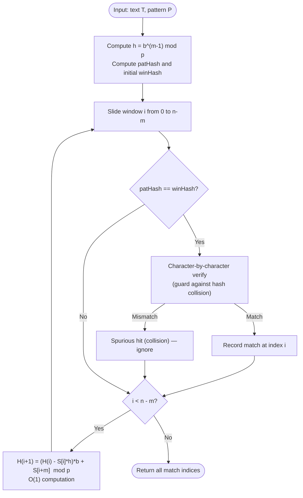

# Rolling Hash (Polynomial Hash & Sliding Window Hashing)

## 1. Introduction

**Rolling Hash** is a hashing technique where a hash value is computed for a sliding window of fixed size over a sequence, and the hash of the **next window is computed in $O(1)$ time** from the hash of the current window — without re-hashing all characters from scratch.

The core formula for a polynomial rolling hash over a window $S[i \dots i+m-1]$ of length $m$ over string $S$ of length $n$ is:

$$H(i) = \left( S[i] \cdot b^{m-1} + S[i+1] \cdot b^{m-2} + \cdots + S[i+m-1] \right) \pmod{p}$$

**Slide the window by 1 position:**

$$H(i+1) = \left( H(i) - S[i] \cdot b^{m-1} \right) \cdot b + S[i+m] \pmod{p}$$

This single $O(1)$ recurrence is what makes rolling hash so powerful.

> **Key Insight:** Instead of recomputing the hash of each window from scratch in $O(m)$ time (giving $O(nm)$ total), rolling hash slides the window in $O(1)$ per step — giving $O(n + m)$ total.

---

## 2. Why Use This Algorithm?

### Comparison with Other Sliding Window Hashing Approaches:

| Approach | Window Hash Computation | Slide Cost | Total Cost |
|---|---|---|---|
| Naïve re-hash each window | $O(m)$ per window | $O(m)$ | $O(n \cdot m)$ |
| **Rolling Hash** | $O(m)$ initial only | $O(1)$ per slide | $O(n + m)$ |
| Suffix Array | — | $O(n \log n)$ build | $O(m \log n)$ search |

**The Core Advantage:** Rolling hash converts any substring comparison problem into a sequence of $O(1)$ hash lookups. Applications include:

- **Rabin-Karp Pattern Matching:** $O(n + m)$ average time.
- **Longest Common Substring:** Binary search + rolling hash in $O(n \log n)$.
- **Longest Duplicate Substring:** Same technique.
- **Near-Duplicate Document Detection:** Hashing text blocks (shingles) for similarity.

---

## 3. Real-World Applications

- **Rabin-Karp String Search:** The canonical rolling hash application — find pattern $P$ in text $T$ in $O(n + m)$ average time.
- **Longest Duplicate Substring (LeetCode 1044):** Binary search on length + rolling hash to check existence.
- **Plagiarism Detection:** Computing "shingles" (hashes of overlapping $k$-word windows) across documents and comparing hash sets.
- **Network Packet Deduplication:** Hashing packet payload windows to detect repeated data blocks.
- **Version Control (rsync / Bup):** Content-defined chunking uses rolling hashes to find identical file blocks across versions, enabling efficient delta compression.

---

## 4. Prerequisites & Core Concepts

- **Modular Arithmetic:** $(A + B) \pmod{p} = ((A \pmod{p}) + (B \pmod{p})) \pmod{p}$.
- **Polynomial Hashing:** Treating a string as a polynomial evaluated at base $b$: $H = \sum_{k=0}^{m-1} S[k] \cdot b^{m-1-k} \pmod{p}$.
- **Hash Collision:** Two different strings mapping to the same hash value (false positive). Handled by verification or double hashing.
- **Sliding Window:** A window of fixed size $m$ sliding from left to right over a string.

---

## 5. Visualization

### Rolling Hash Slide Operation

```
String S: a  b  r  a  c  a  d  a  b  r  a
Index:    0  1  2  3  4  5  6  7  8  9 10
                                              m = 4, b = 31, p = 10^9+7

Window 0: [a b r a]  Hash H(0) = a*b^3 + b*b^2 + r*b^1 + a*b^0  (mod p)

Slide to Window 1: [b r a c]
H(1) = (H(0) - a*b^3) * b + c   (mod p)
       ↑ remove 'a'   ↑ add 'c'
       ↑ multiply by b shifts all remaining characters left

Slide to Window 2: [r a c a]
H(2) = (H(1) - b*b^3) * b + a   (mod p)
```

### Mermaid Flowchart — Rolling Hash Pattern Search



---

## 6. How It Works

### Step 1: Precompute $h = b^{m-1} \pmod{p}$

This is the **leading coefficient multiplier** — the power of $b$ for the character being removed at each slide.

### Step 2: Compute Initial Hashes

For the pattern $P[0 \dots m-1]$ and the first window $T[0 \dots m-1]$:

$$\text{patHash} = \sum_{k=0}^{m-1} P[k] \cdot b^{m-1-k} \pmod{p}$$

$$\text{winHash} = \sum_{k=0}^{m-1} T[k] \cdot b^{m-1-k} \pmod{p}$$

Both computed in $O(m)$ time using Horner's method: $H = H \cdot b + \text{char}$.

### Step 3: Slide Window

For each step $i = 0$ to $n - m - 1$:

$$\text{winHash} = \left( (\text{winHash} - T[i] \cdot h) \cdot b + T[i + m] \right) \pmod{p}$$

If the result is negative (in languages with signed integers), add $p$ to keep it positive.

### Step 4: Check Hash Match

If `winHash == patHash`, verify the actual characters (because hash collisions can produce false positives).

---

## 7. Step-by-Step Algorithm

```
1. Precompute h = b^(m-1) mod p.

2. Compute patHash:
   patHash = 0
   for k from 0 to m-1:
       patHash = (patHash * b + P[k]) mod p

3. Compute initial winHash for T[0..m-1]:
   winHash = 0
   for k from 0 to m-1:
       winHash = (winHash * b + T[k]) mod p

4. For i from 0 to n - m:
   a. If patHash == winHash:
      Verify T[i..i+m-1] == P character by character.
      If match: record index i.
   b. If i < n - m:
      winHash = ((winHash - T[i] * h) * b + T[i+m]) mod p
      If winHash < 0: winHash += p

5. Return all match indices.
```

---

## 8. Pseudocode

```text
function rollingHashSearch(text, pattern, b, p):
    n = length(text)
    m = length(pattern)
    if m > n: return []

    // Step 1: h = b^(m-1) mod p
    h = 1
    for i from 1 to m - 1:
        h = (h * b) mod p

    // Step 2: Initial hashes
    patHash = 0
    winHash = 0
    for i from 0 to m - 1:
        patHash = (patHash * b + pattern[i]) mod p
        winHash = (winHash * b + text[i]) mod p

    matches = []

    // Step 3: Slide
    for i from 0 to n - m:
        if patHash == winHash:
            // Step 4: Verify (avoid collision false positives)
            if text[i .. i+m-1] == pattern:
                matches.append(i)

        if i < n - m:
            winHash = ((winHash - text[i] * h) * b + text[i + m]) mod p
            if winHash < 0:
                winHash = winHash + p

    return matches


// Polynomial hash of a string (used for substrings)
function polynomialHash(s, b, p):
    h = 0
    for each char c in s:
        h = (h * b + ord(c)) mod p
    return h
```

---

## 9. Code Examples

### C

```c
#include <stdio.h>
#include <string.h>
#include <stdbool.h>

#define BASE 31
#define MOD  1000000007LL

typedef long long ll;

void rollingHashSearch(const char* text, const char* pattern) {
    int n = strlen(text);
    int m = strlen(pattern);
    if (m > n) return;

    // Compute h = BASE^(m-1) mod MOD
    ll h = 1;
    for (int i = 0; i < m - 1; i++)
        h = (h * BASE) % MOD;

    ll patHash = 0, winHash = 0;
    for (int i = 0; i < m; i++) {
        patHash = (patHash * BASE + pattern[i]) % MOD;
        winHash = (winHash * BASE + text[i]) % MOD;
    }

    for (int i = 0; i <= n - m; i++) {
        if (patHash == winHash) {
            // Verify to avoid hash collisions
            bool match = true;
            for (int j = 0; j < m; j++) {
                if (text[i + j] != pattern[j]) {
                    match = false;
                    break;
                }
            }
            if (match) printf("Pattern found at index %d\n", i);
        }

        if (i < n - m) {
            winHash = ((winHash - (ll)text[i] * h % MOD + MOD) * BASE + text[i + m]) % MOD;
        }
    }
}

// Compute polynomial hash of a string
ll polyHash(const char* s, int len) {
    ll h = 0;
    for (int i = 0; i < len; i++)
        h = (h * BASE + s[i]) % MOD;
    return h;
}

int main() {
    const char* text    = "abracadabra";
    const char* pattern = "abra";
    printf("Searching for \"%s\" in \"%s\":\n", pattern, text);
    rollingHashSearch(text, pattern);

    // Demonstrate rolling hash for equal-length substring comparison
    printf("\nHash(\"abra\") = %lld\n", polyHash("abra", 4));
    printf("Hash(\"cada\") = %lld\n", polyHash("cada", 4));
    return 0;
}
```

### C++

```cpp
#include <iostream>
#include <vector>
#include <string>
#include <functional>

using namespace std;

const long long BASE = 31;
const long long MOD  = 1e9 + 7;

class RollingHash {
public:
    // Search for all occurrences of pattern in text
    static vector<int> search(const string& text, const string& pattern) {
        vector<int> matches;
        int n = text.size(), m = pattern.size();
        if (m > n) return matches;

        // h = BASE^(m-1) mod MOD
        long long h = 1;
        for (int i = 0; i < m - 1; i++)
            h = h * BASE % MOD;

        long long patHash = 0, winHash = 0;
        for (int i = 0; i < m; i++) {
            patHash = (patHash * BASE + pattern[i]) % MOD;
            winHash = (winHash * BASE + text[i]) % MOD;
        }

        for (int i = 0; i <= n - m; i++) {
            if (patHash == winHash && text.substr(i, m) == pattern)
                matches.push_back(i);

            if (i < n - m) {
                winHash = ((winHash - (long long)text[i] * h % MOD + MOD) * BASE + text[i + m]) % MOD;
            }
        }
        return matches;
    }

    // Precompute prefix hashes for O(1) substring hash queries
    static vector<long long> prefixHashes(const string& s) {
        int n = s.size();
        vector<long long> H(n + 1, 0);
        for (int i = 0; i < n; i++)
            H[i + 1] = (H[i] * BASE + s[i]) % MOD;
        return H;
    }

    // Precompute BASE powers for O(1) substring hash
    static vector<long long> basePowers(int n) {
        vector<long long> pw(n + 1, 1);
        for (int i = 1; i <= n; i++)
            pw[i] = pw[i - 1] * BASE % MOD;
        return pw;
    }

    // Query hash of s[l..r] in O(1) using prefix hashes
    static long long substringHash(const vector<long long>& H,
                                   const vector<long long>& pw,
                                   int l, int r) {
        return (H[r + 1] - H[l] * pw[r - l + 1] % MOD + MOD) % MOD;
    }
};

int main() {
    string text    = "abracadabra";
    string pattern = "abra";

    auto matches = RollingHash::search(text, pattern);
    cout << "Pattern \"" << pattern << "\" found at indices: ";
    for (int idx : matches) cout << idx << " ";
    cout << "\n";

    // Prefix hash example: compare substrings in O(1)
    auto H  = RollingHash::prefixHashes(text);
    auto pw = RollingHash::basePowers(text.size());

    long long h1 = RollingHash::substringHash(H, pw, 0, 3);  // "abra"
    long long h2 = RollingHash::substringHash(H, pw, 7, 10); // "abra"
    long long h3 = RollingHash::substringHash(H, pw, 4, 7);  // "cada" (wrong — "acad")

    cout << "Hash(text[0..3]=\"abra\") = " << h1 << "\n";
    cout << "Hash(text[7..10]=\"abra\") = " << h2 << "\n";
    cout << "Same? " << (h1 == h2 ? "YES" : "NO") << "\n";
    return 0;
}
```

### Java

```java
import java.util.*;

public class RollingHash {

    private static final long BASE = 31;
    private static final long MOD  = 1_000_000_007L;

    // Search for all occurrences of pattern in text using Rabin-Karp rolling hash
    public static List<Integer> search(String text, String pattern) {
        List<Integer> matches = new ArrayList<>();
        int n = text.length(), m = pattern.length();
        if (m > n) return matches;

        // h = BASE^(m-1) mod MOD
        long h = 1;
        for (int i = 0; i < m - 1; i++) h = h * BASE % MOD;

        long patHash = 0, winHash = 0;
        for (int i = 0; i < m; i++) {
            patHash = (patHash * BASE + pattern.charAt(i)) % MOD;
            winHash = (winHash * BASE + text.charAt(i)) % MOD;
        }

        for (int i = 0; i <= n - m; i++) {
            if (patHash == winHash && text.substring(i, i + m).equals(pattern))
                matches.add(i);

            if (i < n - m) {
                winHash = ((winHash - text.charAt(i) * h % MOD + MOD) * BASE
                           + text.charAt(i + m)) % MOD;
            }
        }
        return matches;
    }

    // Precompute prefix hashes for O(1) substring hash queries
    public static long[] prefixHashes(String s) {
        int n = s.length();
        long[] H = new long[n + 1];
        for (int i = 0; i < n; i++)
            H[i + 1] = (H[i] * BASE + s.charAt(i)) % MOD;
        return H;
    }

    public static long[] basePowers(int n) {
        long[] pw = new long[n + 1];
        pw[0] = 1;
        for (int i = 1; i <= n; i++) pw[i] = pw[i - 1] * BASE % MOD;
        return pw;
    }

    // O(1) hash of s[l..r]
    public static long substringHash(long[] H, long[] pw, int l, int r) {
        return (H[r + 1] - H[l] * pw[r - l + 1] % MOD + MOD) % MOD;
    }

    public static void main(String[] args) {
        String text    = "abracadabra";
        String pattern = "abra";

        System.out.println("Matches: " + search(text, pattern));

        long[] H  = prefixHashes(text);
        long[] pw = basePowers(text.length());

        long h1 = substringHash(H, pw, 0, 3);   // "abra"
        long h2 = substringHash(H, pw, 7, 10);  // "abra"
        System.out.println("Hash(text[0..3]) == Hash(text[7..10])? " + (h1 == h2));
    }
}
```

### Python

```python
BASE = 31
MOD  = 10**9 + 7


def rolling_hash_search(text: str, pattern: str) -> list[int]:
    """Rabin-Karp rolling hash search. Returns all match start indices."""
    n, m = len(text), len(pattern)
    if m > n:
        return []

    # h = BASE^(m-1) mod MOD
    h = pow(BASE, m - 1, MOD)

    pat_hash = 0
    win_hash = 0
    for i in range(m):
        pat_hash = (pat_hash * BASE + ord(pattern[i])) % MOD
        win_hash = (win_hash * BASE + ord(text[i])) % MOD

    matches = []

    for i in range(n - m + 1):
        if pat_hash == win_hash:
            if text[i:i + m] == pattern:   # verify to avoid false positives
                matches.append(i)

        if i < n - m:
            win_hash = (win_hash - ord(text[i]) * h) % MOD
            win_hash = (win_hash * BASE + ord(text[i + m])) % MOD
            win_hash %= MOD   # Python mod is always non-negative

    return matches


class PrefixHash:
    """Precomputed prefix hashes for O(1) substring hash queries."""

    def __init__(self, s: str, base: int = BASE, mod: int = MOD):
        self.s   = s
        self.mod = mod
        n = len(s)
        self.H  = [0] * (n + 1)
        self.pw = [1] * (n + 1)
        for i in range(n):
            self.H[i + 1]  = (self.H[i] * base + ord(s[i])) % mod
            self.pw[i + 1] = (self.pw[i] * base) % mod

    def query(self, l: int, r: int) -> int:
        """Hash of s[l..r] (inclusive) in O(1)."""
        return (self.H[r + 1] - self.H[l] * self.pw[r - l + 1]) % self.mod

    def equal(self, l1: int, r1: int, l2: int, r2: int) -> bool:
        """Check if s[l1..r1] == s[l2..r2] in O(1)."""
        return (r1 - l1 == r2 - l2) and (self.query(l1, r1) == self.query(l2, r2))


def find_longest_duplicate_substring(s: str) -> str:
    """Binary search on length + rolling hash to find longest duplicate substring."""
    def has_duplicate(length: int) -> str:
        if length == 0:
            return ""
        seen = {}
        ph = PrefixHash(s)
        for i in range(len(s) - length + 1):
            h = ph.query(i, i + length - 1)
            if h in seen:
                # Verify (collision guard)
                j = seen[h]
                if s[i:i + length] == s[j:j + length]:
                    return s[i:i + length]
            seen[h] = i
        return ""

    lo, hi = 0, len(s) - 1
    result = ""
    while lo <= hi:
        mid = (lo + hi) // 2
        dup = has_duplicate(mid)
        if dup:
            result = dup
            lo = mid + 1
        else:
            hi = mid - 1
    return result


if __name__ == "__main__":
    text    = "abracadabra"
    pattern = "abra"
    print(f"Rolling Hash Search '{pattern}' in '{text}': {rolling_hash_search(text, pattern)}")

    ph = PrefixHash(text)
    print(f"Hash(text[0..3])   = {ph.query(0, 3)}")   # "abra"
    print(f"Hash(text[7..10])  = {ph.query(7, 10)}")  # "abra"
    print(f"Equal? {ph.equal(0, 3, 7, 10)}")           # True

    print(f"\nLongest Duplicate Substring of '{text}': '{find_longest_duplicate_substring(text)}'")
```

### JavaScript

```javascript
const BASE = 31n;
const MOD  = 1_000_000_007n;

function rollingHashSearch(text, pattern) {
    const n = text.length, m = pattern.length;
    if (m > n) return [];

    // h = BASE^(m-1) mod MOD
    let h = 1n;
    for (let i = 0; i < m - 1; i++) h = h * BASE % MOD;

    let patHash = 0n, winHash = 0n;
    for (let i = 0; i < m; i++) {
        patHash = (patHash * BASE + BigInt(pattern.charCodeAt(i))) % MOD;
        winHash = (winHash * BASE + BigInt(text.charCodeAt(i))) % MOD;
    }

    const matches = [];

    for (let i = 0; i <= n - m; i++) {
        if (patHash === winHash && text.substring(i, i + m) === pattern)
            matches.push(i);

        if (i < n - m) {
            winHash = ((winHash - BigInt(text.charCodeAt(i)) * h % MOD + MOD) * BASE
                       + BigInt(text.charCodeAt(i + m))) % MOD;
        }
    }
    return matches;
}

// Prefix hash class for O(1) substring queries
class PrefixHash {
    constructor(s, base = BASE, mod = MOD) {
        this.mod = mod;
        const n = s.length;
        this.H  = Array(n + 1).fill(0n);
        this.pw = Array(n + 1).fill(1n);
        for (let i = 0; i < n; i++) {
            this.H[i + 1]  = (this.H[i] * base + BigInt(s.charCodeAt(i))) % mod;
            this.pw[i + 1] = this.pw[i] * base % mod;
        }
    }

    query(l, r) {
        return (this.H[r + 1] - this.H[l] * this.pw[r - l + 1] % this.mod + this.mod) % this.mod;
    }

    equal(l1, r1, l2, r2) {
        return (r1 - l1 === r2 - l2) && (this.query(l1, r1) === this.query(l2, r2));
    }
}

// Tests
const text    = "abracadabra";
const pattern = "abra";
console.log(`Matches: [${rollingHashSearch(text, pattern)}]`);  // [0, 7]

const ph = new PrefixHash(text);
console.log(`Hash[0..3]=${ph.query(0,3)}, Hash[7..10]=${ph.query(7,10)}`);
console.log(`Equal? ${ph.equal(0, 3, 7, 10)}`);  // true
```

---

## 10. Code Explanation

| Component | Purpose |
|---|---|
| `h = BASE^(m-1) mod MOD` | Precomputed multiplier for the character being removed at each slide step. |
| Horner's Method `H = H*b + char` | Evaluates the polynomial hash in $O(m)$ without computing powers explicitly. |
| `winHash - text[i]*h` | Removes the contribution of the leftmost character of the departing window. |
| `* BASE + text[i+m]` | Shifts all remaining contributions left by one power and adds the new rightmost character. |
| `+ MOD` before `% MOD` | Handles negative results from the subtraction in languages with signed integers. |
| **Prefix Hash Array `H[]`** | `H[r+1] - H[l] * pw[r-l+1]` gives the hash of substring `s[l..r]` in $O(1)$. |
| **Double Hashing** | Using two independent `(BASE, MOD)` pairs reduces collision probability to $\approx 1/MOD^2$. |

---

## 11. Interactive Demo Scenario

**Search `"abra"` in `"abracadabra"` ($m=4$, $b=31$, $p=10^9+7$):**

| Window $i$ | Substring | Roll Formula | `winHash == patHash`? | Action |
|---|---|---|---|---|
| 0 | `"abra"` | Initial computation | ✓ Match | Verify → **Match at 0** |
| 1 | `"brac"` | `(H(0) - ord('a')*h)*b + ord('c')` | ✗ | Skip |
| 2 | `"raca"` | Roll | ✗ | Skip |
| 3 | `"acad"` | Roll | ✗ | Skip |
| 4 | `"cada"` | Roll | ✗ | Skip |
| 5 | `"adab"` | Roll | ✗ | Skip |
| 6 | `"dabr"` | Roll | ✗ | Skip |
| 7 | `"abra"` | Roll | ✓ Match | Verify → **Match at 7** |

**Result: Matches at [0, 7]** ✓

---

## 12. Dry Run Trace

**`text = "aab"`, `pattern = "ab"` ($m=2$, $b=31$, $p=101$)**

Initial:
- `h = 31^1 mod 101 = 31`
- `patHash = (ord('a')*31 + ord('b')) mod 101 = (97*31 + 98) mod 101 = (3007 + 98) mod 101 = 3105 mod 101 = 3`
- `winHash = (ord('a')*31 + ord('a')) mod 101 = (3007 + 97) mod 101 = 3104 mod 101 = 3104 - 30*101 = 74`

| $i$ | Window | `winHash` | `patHash` | Match? | Roll Formula |
|---|---|---|---|---|---|
| 0 | `"aa"` | 74 | 3 | No | `(74 - ord('a')*31)*31 + ord('b') = (74-3007)*31+98` → `(-2933*31+98) mod 101` |
| 1 | `"ab"` | 3 | 3 | **Yes → Verify** | — End — |

**Match found at index 1** ✓

---

## 13. Time & Space Complexity

| Metric | Complexity | Explanation |
|---|---|---|
| **Initial Hash Computation** | $O(m)$ | Hash pattern and first window. |
| **Each Slide Step** | $O(1)$ | One subtraction, one multiply, one addition. |
| **Total Search Time** | $O(n + m)$ | $O(m)$ init + $O(n)$ sliding. |
| **Collision Verification** | $O(m)$ per collision | Amortized $O(1)$ with good hash. |
| **Prefix Hash Build** | $O(n)$ | Precompute all prefix hashes. |
| **Prefix Hash Query** | $O(1)$ | Constant-time substring hash. |
| **Space Complexity** | $O(n)$ | Prefix hash and power arrays. |

### Worst-Case Behavior

With a poor modulus choice or adversarial input, hash collisions can occur at every window, making verification $O(m)$ per step and total time $O(nm)$. **Double hashing** (two independent $(b, p)$ pairs) reduces collision probability to $\approx 1/(10^9 \times 10^9) \approx 10^{-18}$, effectively eliminating worst cases.

---

## 14. Advantages

- **$O(1)$ Window Slide:** The defining property — hash of next window computed from current hash without re-reading $m$ characters.
- **Multi-Pattern Matching:** Store pattern hashes in a hash set; check membership in $O(1)$ per window — enabling $O(n + km)$ search for $k$ patterns.
- **Versatile:** Applicable to any sliding window problem that benefits from equality checking (strings, arrays of integers, etc.).
- **Prefix Hash for $O(1)$ Substring Queries:** After $O(n)$ preprocessing, any substring hash (and thus equality check) is $O(1)$.

---

## 15. Disadvantages

- **Hash Collisions (False Positives):** Two different windows may have equal hashes. Always verify on hash match, or use double hashing.
- **No False Negatives:** If `winHash != patHash`, the window definitely doesn't match. Only false positives (collisions) are a concern.
- **Modulus Selection Sensitivity:** Poor choice of $b$ or $p$ increases collision rate. Prime moduli and random bases reduce risk.
- **Not Exact:** Unlike KMP or Z-algorithm, rolling hash is probabilistic without verification.

---

## 16. Applications

- **Rabin-Karp Pattern Search:** Direct application.
- **Longest Common Substring (2 strings):** Generalized suffix array or binary search + rolling hash.
- **Longest Duplicate Substring (LeetCode 1044):** Binary search on length + rolling hash existence check.
- **Plagiarism Detection (Shingling):** Hash overlapping $k$-word windows (shingles) and compare hash sets across documents (Jaccard similarity).
- **rsync / Bup:** Content-defined chunking — use rolling hash (Adler-32 variant) to find chunk boundaries independent of file shifts.

---

## 17. Common Mistakes

1. **Forgetting `+ MOD` After Subtraction:**
   In C/C++/Java/JS, `(winHash - text[i] * h) % MOD` can be negative. Always add `MOD` before the final `% MOD`: `(winHash - text[i] * h % MOD + MOD) % MOD`.

2. **Integer Overflow:**
   When using 32-bit integers, `winHash * BASE` can overflow. Use `long long` in C/C++ or `BigInt` in JavaScript.

3. **Using `charCodeAt` vs `codePointAt` for Unicode:**
   For non-ASCII text, `charCodeAt` gives the UTF-16 code unit, not the full Unicode code point. Use the appropriate method for your character set.

4. **Not Verifying on Hash Match:**
   Returning a match whenever `patHash == winHash` without character verification will produce false positives on hash collisions.

5. **Wrong Power `h`:**
   `h` should be `BASE^(m-1) mod MOD`, not `BASE^m`. It represents the contribution of the **first** character, which is being removed.

---

## 18. Interview Questions

### Q1. What makes rolling hash $O(1)$ per slide instead of $O(m)$?

**Answer:** The polynomial hash satisfies the recurrence:
$$H(i+1) = (H(i) - S[i] \cdot b^{m-1}) \cdot b + S[i+m] \pmod{p}$$
This removes the leftmost character's contribution (via subtraction), shifts the remaining contributions (via multiplication by $b$), and adds the new rightmost character — all in 3 arithmetic operations independent of $m$.

### Q2. What is a hash collision in rolling hash and how do you handle it?

**Answer:** A hash collision (or "spurious hit") occurs when two different substrings have the same hash value. Since `patHash == winHash` doesn't guarantee equality, you must verify the actual characters when hashes match. Double hashing (using two independent `(base, mod)` pairs) reduces collision probability from $\sim 1/p$ to $\sim 1/p^2 \approx 10^{-18}$, making verification rarely needed.

### Q3. How do prefix hash arrays enable $O(1)$ substring comparisons?

**Answer:** Precompute:
- `H[i] = hash(S[0..i-1])` using Horner's method.
- `pw[i] = BASE^i mod MOD`.

Then `hash(S[l..r]) = (H[r+1] - H[l] * pw[r-l+1] + MOD) % MOD` in $O(1)$.
This is analogous to prefix sums for range sum queries.

### Q4. How would you use rolling hash to solve Longest Duplicate Substring?

**Answer:** Binary search on the answer length $L$. For a fixed $L$, slide a window of size $L$ across the string and store each window's hash in a hash set. If any hash is seen twice (with character verification), a duplicate of length $L$ exists. Binary search takes $O(\log n)$ iterations, each costing $O(n)$ → total $O(n \log n)$.

---

## 19. Practice Problems

1. **LeetCode 1044 — Longest Duplicate Substring (Hard):** Binary search + rolling hash. Classic application.
2. **LeetCode 718 — Maximum Length of Repeated Subarray (Medium):** 2D rolling hash or DP.
3. **LeetCode 1147 — Longest Chunked Palindrome Decomposition (Hard):** Rolling hash from both ends.
4. **LeetCode 28 — Find the Index of the First Occurrence in a String (Easy/Medium):** Implement Rabin-Karp.
5. **CF 271D — Good Substrings:** Count distinct substrings using rolling hash + hash set.

---

## 20. Related Algorithms

| Algorithm | Relation |
|---|---|
| **Rabin-Karp** | Directly uses rolling hash for $O(n+m)$ average pattern search. |
| **KMP Algorithm** | Deterministic $O(n+m)$ alternative; no hash collision risk. |
| **Z-Algorithm** | Also $O(n+m)$ but deterministic; no false positives. |
| **Suffix Array** | Solves duplicate substring problems; $O(n \log n)$ build vs $O(n \log n)$ binary search + hash. |
| **Manacher's Algorithm** | Linear-time palindrome finding; rolling hash is used in some palindrome variants. |

---

## 21. Summary

| Property | Value |
|---|---|
| **Technique** | Polynomial hash with sliding window recurrence |
| **Initial Computation** | $O(m)$ |
| **Per-Slide Cost** | $O(1)$ |
| **Total Search** | $O(n + m)$ average |
| **Space** | $O(1)$ rolling; $O(n)$ prefix hash |
| **Collision Risk** | $\sim 1/p$ per window; use double hash for safety |
| **Key Formula** | $H(i+1) = (H(i) - S[i] \cdot b^{m-1}) \cdot b + S[i+m] \pmod{p}$ |
| **Best For** | Pattern search, duplicate substring, document similarity |

**Key Takeaway:** Rolling hash is the go-to tool whenever you need to compare many fixed-length substrings efficiently. The $O(1)$ slide recurrence transforms $O(nm)$ naïve comparison into $O(n+m)$ — an essential trick for competitive programming and system design.

---

## 22. Quiz

**Question 1:** What is the time complexity of computing hash values for all windows of length $m$ in a text of length $n$ using rolling hash?

- A) $O(n \cdot m)$
- B) $O(n + m)$
- C) $O(n \log m)$
- D) $O(m^2)$

- **Correct Answer:** B
- **Explanation:** The initial hash computation takes $O(m)$. Each of the remaining $n - m$ slide steps takes $O(1)$ using the rolling recurrence. Total: $O(m) + O(n - m) = O(n + m)$.

---

**Question 2:** After sliding from window $i$ to window $i+1$, what operation removes the leftmost character's contribution from the hash?

- A) `winHash + text[i] * h`
- B) `winHash / BASE`
- C) `winHash - text[i] * h`
- D) `winHash XOR text[i]`

- **Correct Answer:** C
- **Explanation:** Subtracting `text[i] * h` (where `h = BASE^(m-1)`) removes the leftmost character's contribution. The subsequent multiplication by `BASE` shifts the remaining characters' contributions left by one power.

---

**Question 3:** Why must you verify characters after a hash match in Rabin-Karp?

- A) The hash function is not deterministic.
- B) Two different substrings can have the same hash value (hash collision / spurious hit).
- C) The rolling formula can sometimes compute the wrong hash.
- D) Pattern and window lengths may differ.

- **Correct Answer:** B
- **Explanation:** Hash functions are not injective — different inputs can map to the same output. A hash match (`patHash == winHash`) is a necessary but not sufficient condition for equality. Character verification confirms a true match and eliminates false positives.

---

**Question 4:** Given `H[]` as the prefix hash array and `pw[]` as the power array, what is the formula for `hash(s[l..r])`?

- A) `H[r] - H[l]`
- B) `(H[r+1] - H[l] * pw[r-l+1] + MOD) % MOD`
- C) `H[r+1] * pw[l]`
- D) `(H[r] + H[l]) % MOD`

- **Correct Answer:** B
- **Explanation:** The prefix hash formula mirrors prefix sums. `H[r+1]` contains `hash(s[0..r])`. Subtracting `H[l] * pw[r-l+1]` removes the contribution of `s[0..l-1]`, leaving only the hash of `s[l..r]`. The `+ MOD` prevents negative results.
