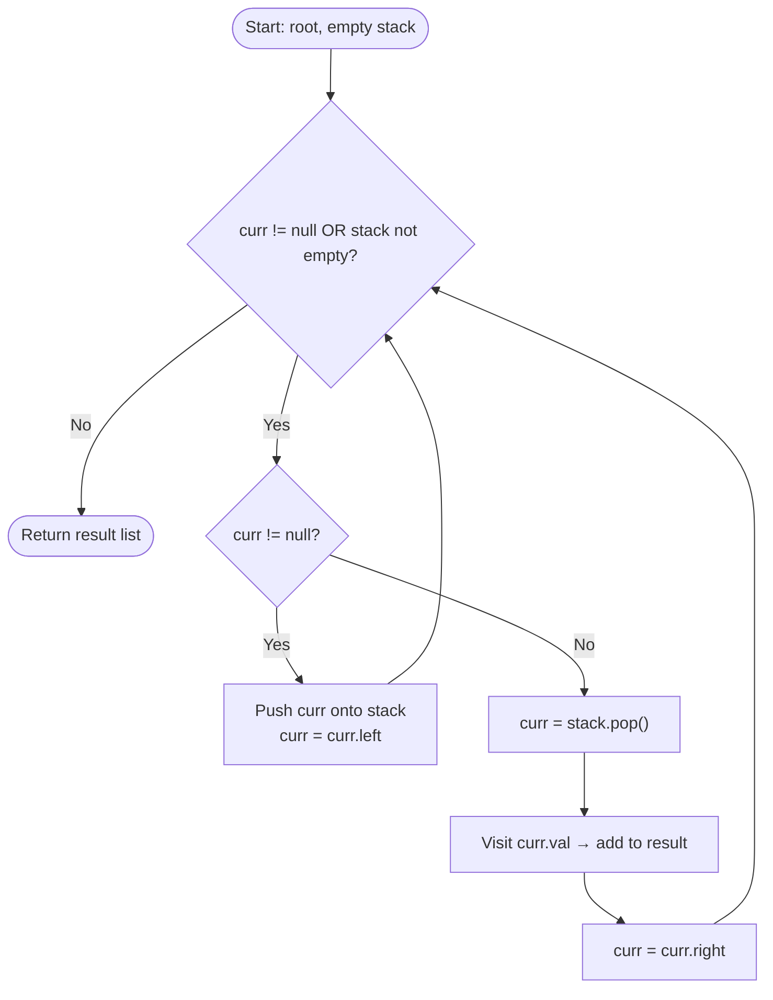

# Inorder Traversal (Left → Root → Right)

## 1. Introduction

**Inorder Traversal** is a depth-first tree traversal strategy that visits nodes in the order:

$$\text{Left Subtree} \rightarrow \text{Root} \rightarrow \text{Right Subtree}$$

Applied to a **Binary Search Tree (BST)**, inorder traversal visits all nodes in **ascending sorted order** — making it the primary tool for reading out BST contents in order.

For the tree:
```
        4
       / \
      2   6
     / \ / \
    1  3 5  7
```

Inorder traversal visits: **1 → 2 → 3 → 4 → 5 → 6 → 7**

There are three standard implementations:
1. **Recursive** — clean and concise.
2. **Iterative (Explicit Stack)** — avoids recursion stack overflow on deep trees.
3. **Morris Traversal** — $O(1)$ space, no stack or recursion.

---

## 2. Why Use This Algorithm?

### Comparison with Other Tree Traversals:

| Traversal | Order | Primary Use |
|---|---|---|
| **Inorder (L → Root → R)** | Sorted ascending for BST | BST validation, sorted output |
| Preorder (Root → L → R) | Root first | Tree serialization, copy |
| Postorder (L → R → Root) | Root last | Tree deletion, expression eval |
| Level-order (BFS) | Level by level | Shortest path, level queries |

**The Core Advantage of Inorder on BST:** Visiting Left → Root → Right on a BST guarantees visiting nodes in non-decreasing sorted order. This property underlies BST validation, kth-smallest element, and range queries.

---

## 3. Real-World Applications

- **BST Sorted Output:** Printing all keys in a BST in sorted order — directly used in database index traversal.
- **BST Validation:** Inorder traversal of a BST must produce a strictly increasing sequence; check this to validate BST property.
- **Expression Tree Evaluation:** Inorder traversal of an arithmetic expression tree produces the fully parenthesized infix expression.
- **Kth Smallest Element in BST:** The $k$-th node visited in inorder traversal is the $k$-th smallest element.
- **Flatten BST to Sorted Array:** Used in many interview problems (LeetCode 897 — Increasing Order Search Tree).

---

## 4. Prerequisites & Core Concepts

- **Binary Tree:** Each node has at most two children: left and right.
- **Binary Search Tree (BST):** For every node $v$: all keys in the left subtree < $v$ < all keys in the right subtree.
- **Recursion & Call Stack:** The recursive approach mirrors the call stack; each call processes one subtree.
- **Explicit Stack (Iterative):** Simulates the recursion call stack manually using a stack data structure.
- **Morris Traversal:** Uses the tree's `null` right-child pointers temporarily to navigate without a stack.

---

## 5. Visualization

### Tree Structure

```
         4
       /   \
      2     6
     / \   / \
    1   3 5   7
```

### Inorder Traversal Path

```
Step 1: Go left from 4 → reach 2 → go left → reach 1
Step 2: Visit 1 (no left child)        Output: 1
Step 3: Back to 2, visit 2             Output: 1 2
Step 4: Go right to 3, visit 3         Output: 1 2 3
Step 5: Back to 4, visit 4             Output: 1 2 3 4
Step 6: Go right to 6, go left to 5   Output: 1 2 3 4 5
Step 7: Visit 5                        Output: 1 2 3 4 5
Step 8: Back to 6, visit 6             Output: 1 2 3 4 5 6
Step 9: Go right to 7, visit 7         Output: 1 2 3 4 5 6 7
```

### Mermaid Flowchart — Iterative Inorder



---

## 6. How It Works

### Recursive Approach

The recursive definition directly encodes Left → Root → Right:

```
inorder(node):
    if node is null: return
    inorder(node.left)    ← recurse left
    visit(node)           ← process root
    inorder(node.right)   ← recurse right
```

### Iterative Approach (Explicit Stack)

Simulate the recursion manually:
1. Push all left-chain nodes onto the stack (going as deep left as possible).
2. Pop a node → visit it → move to its right child.
3. Repeat: push the new right child's entire left chain.

### Morris Traversal (O(1) Space)

Uses **threaded binary tree** technique:
- For each node, if it has a left subtree, find the **inorder predecessor** (rightmost node of left subtree).
- Temporarily link the predecessor's right pointer back to the current node.
- On second visit (right pointer already linked), restore the null pointer and visit the node.

---

## 7. Step-by-Step Algorithm

**Iterative Inorder:**

```
1. Initialize: curr = root, stack = empty, result = []
2. While curr != null OR stack is not empty:
   a. While curr != null:
      - Push curr onto stack
      - curr = curr.left
   b. curr = stack.pop()
   c. result.append(curr.val)
   d. curr = curr.right
3. Return result
```

**Morris Inorder:**

```
1. curr = root
2. While curr != null:
   a. If curr.left == null:
      - Visit curr.val
      - curr = curr.right
   b. Else:
      - Find inorder predecessor (rightmost of left subtree)
      - If predecessor.right == null:
        → predecessor.right = curr   (create thread)
        → curr = curr.left
      - If predecessor.right == curr:
        → predecessor.right = null   (remove thread)
        → Visit curr.val
        → curr = curr.right
```

---

## 8. Pseudocode

```text
// --- Recursive ---
function inorderRecursive(node, result):
    if node is null: return
    inorderRecursive(node.left, result)
    result.append(node.val)
    inorderRecursive(node.right, result)

// --- Iterative ---
function inorderIterative(root):
    result = []
    stack  = []
    curr   = root

    while curr != null or stack is not empty:
        while curr != null:
            stack.push(curr)
            curr = curr.left
        curr = stack.pop()
        result.append(curr.val)
        curr = curr.right

    return result

// --- Morris Traversal (O(1) space) ---
function inorderMorris(root):
    result = []
    curr   = root

    while curr != null:
        if curr.left == null:
            result.append(curr.val)
            curr = curr.right
        else:
            predecessor = curr.left
            while predecessor.right != null and predecessor.right != curr:
                predecessor = predecessor.right

            if predecessor.right == null:
                predecessor.right = curr    // thread
                curr = curr.left
            else:
                predecessor.right = null    // remove thread
                result.append(curr.val)
                curr = curr.right

    return result
```

---

## 9. Code Examples

### C

```c
#include <stdio.h>
#include <stdlib.h>

typedef struct Node {
    int val;
    struct Node* left;
    struct Node* right;
} Node;

Node* newNode(int val) {
    Node* n = (Node*)malloc(sizeof(Node));
    n->val = val;
    n->left = n->right = NULL;
    return n;
}

// Recursive Inorder
void inorderRecursive(Node* root) {
    if (!root) return;
    inorderRecursive(root->left);
    printf("%d ", root->val);
    inorderRecursive(root->right);
}

// Iterative Inorder (stack-based)
void inorderIterative(Node* root) {
    Node* stack[100];
    int top = -1;
    Node* curr = root;

    while (curr || top >= 0) {
        while (curr) {
            stack[++top] = curr;
            curr = curr->left;
        }
        curr = stack[top--];
        printf("%d ", curr->val);
        curr = curr->right;
    }
}

// Morris Inorder (O(1) space)
void inorderMorris(Node* root) {
    Node* curr = root;
    while (curr) {
        if (!curr->left) {
            printf("%d ", curr->val);
            curr = curr->right;
        } else {
            Node* pred = curr->left;
            while (pred->right && pred->right != curr)
                pred = pred->right;

            if (!pred->right) {
                pred->right = curr;
                curr = curr->left;
            } else {
                pred->right = NULL;
                printf("%d ", curr->val);
                curr = curr->right;
            }
        }
    }
}

int main() {
    //        4
    //       / \
    //      2   6
    //     / \ / \
    //    1  3 5  7
    Node* root = newNode(4);
    root->left  = newNode(2);
    root->right = newNode(6);
    root->left->left   = newNode(1);
    root->left->right  = newNode(3);
    root->right->left  = newNode(5);
    root->right->right = newNode(7);

    printf("Recursive : "); inorderRecursive(root); printf("\n");
    printf("Iterative : "); inorderIterative(root); printf("\n");
    printf("Morris    : "); inorderMorris(root);    printf("\n");
    return 0;
}
```

### C++

```cpp
#include <iostream>
#include <vector>
#include <stack>

using namespace std;

struct TreeNode {
    int val;
    TreeNode* left;
    TreeNode* right;
    TreeNode(int x) : val(x), left(nullptr), right(nullptr) {}
};

// Recursive
void inorderRec(TreeNode* root, vector<int>& res) {
    if (!root) return;
    inorderRec(root->left, res);
    res.push_back(root->val);
    inorderRec(root->right, res);
}

// Iterative
vector<int> inorderIter(TreeNode* root) {
    vector<int> res;
    stack<TreeNode*> st;
    TreeNode* curr = root;

    while (curr || !st.empty()) {
        while (curr) { st.push(curr); curr = curr->left; }
        curr = st.top(); st.pop();
        res.push_back(curr->val);
        curr = curr->right;
    }
    return res;
}

// Morris (O(1) space)
vector<int> inorderMorris(TreeNode* root) {
    vector<int> res;
    TreeNode* curr = root;

    while (curr) {
        if (!curr->left) {
            res.push_back(curr->val);
            curr = curr->right;
        } else {
            TreeNode* pred = curr->left;
            while (pred->right && pred->right != curr)
                pred = pred->right;

            if (!pred->right) {
                pred->right = curr;
                curr = curr->left;
            } else {
                pred->right = nullptr;
                res.push_back(curr->val);
                curr = curr->right;
            }
        }
    }
    return res;
}

// Kth Smallest in BST using inorder
int kthSmallest(TreeNode* root, int k) {
    stack<TreeNode*> st;
    TreeNode* curr = root;
    int count = 0;

    while (curr || !st.empty()) {
        while (curr) { st.push(curr); curr = curr->left; }
        curr = st.top(); st.pop();
        if (++count == k) return curr->val;
        curr = curr->right;
    }
    return -1;
}

void print(const vector<int>& v) {
    for (int x : v) cout << x << " ";
    cout << "\n";
}

int main() {
    TreeNode* root = new TreeNode(4);
    root->left  = new TreeNode(2);
    root->right = new TreeNode(6);
    root->left->left   = new TreeNode(1);
    root->left->right  = new TreeNode(3);
    root->right->left  = new TreeNode(5);
    root->right->right = new TreeNode(7);

    vector<int> r1; inorderRec(root, r1);
    cout << "Recursive : "; print(r1);
    cout << "Iterative : "; print(inorderIter(root));
    cout << "Morris    : "; print(inorderMorris(root));
    cout << "3rd Smallest: " << kthSmallest(root, 3) << "\n";  // 3
    return 0;
}
```

### Java

```java
import java.util.*;

public class InorderTraversal {

    static class TreeNode {
        int val;
        TreeNode left, right;
        TreeNode(int x) { val = x; }
    }

    // Recursive
    public static void inorderRec(TreeNode root, List<Integer> res) {
        if (root == null) return;
        inorderRec(root.left, res);
        res.add(root.val);
        inorderRec(root.right, res);
    }

    // Iterative
    public static List<Integer> inorderIter(TreeNode root) {
        List<Integer> res = new ArrayList<>();
        Deque<TreeNode> stack = new ArrayDeque<>();
        TreeNode curr = root;

        while (curr != null || !stack.isEmpty()) {
            while (curr != null) { stack.push(curr); curr = curr.left; }
            curr = stack.pop();
            res.add(curr.val);
            curr = curr.right;
        }
        return res;
    }

    // Morris (O(1) space)
    public static List<Integer> inorderMorris(TreeNode root) {
        List<Integer> res = new ArrayList<>();
        TreeNode curr = root;

        while (curr != null) {
            if (curr.left == null) {
                res.add(curr.val);
                curr = curr.right;
            } else {
                TreeNode pred = curr.left;
                while (pred.right != null && pred.right != curr)
                    pred = pred.right;

                if (pred.right == null) {
                    pred.right = curr;
                    curr = curr.left;
                } else {
                    pred.right = null;
                    res.add(curr.val);
                    curr = curr.right;
                }
            }
        }
        return res;
    }

    // Kth Smallest in BST
    public static int kthSmallest(TreeNode root, int k) {
        Deque<TreeNode> stack = new ArrayDeque<>();
        TreeNode curr = root;
        int count = 0;

        while (curr != null || !stack.isEmpty()) {
            while (curr != null) { stack.push(curr); curr = curr.left; }
            curr = stack.pop();
            if (++count == k) return curr.val;
            curr = curr.right;
        }
        return -1;
    }

    public static void main(String[] args) {
        TreeNode root = new TreeNode(4);
        root.left  = new TreeNode(2);
        root.right = new TreeNode(6);
        root.left.left   = new TreeNode(1);
        root.left.right  = new TreeNode(3);
        root.right.left  = new TreeNode(5);
        root.right.right = new TreeNode(7);

        List<Integer> r1 = new ArrayList<>();
        inorderRec(root, r1);
        System.out.println("Recursive : " + r1);
        System.out.println("Iterative : " + inorderIter(root));
        System.out.println("Morris    : " + inorderMorris(root));
        System.out.println("3rd Smallest: " + kthSmallest(root, 3));
    }
}
```

### Python

```python
from __future__ import annotations
from collections import deque
from dataclasses import dataclass, field
from typing import Optional


@dataclass
class TreeNode:
    val: int
    left: Optional['TreeNode'] = field(default=None, repr=False)
    right: Optional['TreeNode'] = field(default=None, repr=False)


def inorder_recursive(root: Optional[TreeNode]) -> list[int]:
    """Recursive inorder traversal — O(n) time, O(h) space (call stack)."""
    result = []

    def dfs(node: Optional[TreeNode]) -> None:
        if not node:
            return
        dfs(node.left)
        result.append(node.val)
        dfs(node.right)

    dfs(root)
    return result


def inorder_iterative(root: Optional[TreeNode]) -> list[int]:
    """Iterative inorder traversal using an explicit stack — O(n) time, O(h) space."""
    result = []
    stack = []
    curr = root

    while curr or stack:
        while curr:
            stack.append(curr)
            curr = curr.left
        curr = stack.pop()
        result.append(curr.val)
        curr = curr.right

    return result


def inorder_morris(root: Optional[TreeNode]) -> list[int]:
    """Morris inorder traversal — O(n) time, O(1) space (no stack/recursion)."""
    result = []
    curr = root

    while curr:
        if not curr.left:
            result.append(curr.val)
            curr = curr.right
        else:
            # Find inorder predecessor (rightmost of left subtree)
            pred = curr.left
            while pred.right and pred.right is not curr:
                pred = pred.right

            if pred.right is None:
                pred.right = curr       # Create thread
                curr = curr.left
            else:
                pred.right = None       # Remove thread
                result.append(curr.val)
                curr = curr.right

    return result


def kth_smallest(root: Optional[TreeNode], k: int) -> int:
    """Return kth smallest element in BST using iterative inorder."""
    stack = []
    curr = root
    count = 0

    while curr or stack:
        while curr:
            stack.append(curr)
            curr = curr.left
        curr = stack.pop()
        count += 1
        if count == k:
            return curr.val
        curr = curr.right

    return -1


def validate_bst(root: Optional[TreeNode]) -> bool:
    """Validate BST by checking inorder traversal is strictly increasing."""
    result = inorder_iterative(root)
    return all(result[i] < result[i + 1] for i in range(len(result) - 1))


if __name__ == "__main__":
    #        4
    #       / \
    #      2   6
    #     / \ / \
    #    1  3 5  7
    root = TreeNode(4,
        left=TreeNode(2, left=TreeNode(1), right=TreeNode(3)),
        right=TreeNode(6, left=TreeNode(5), right=TreeNode(7))
    )

    print("Recursive :", inorder_recursive(root))  # [1, 2, 3, 4, 5, 6, 7]
    print("Iterative :", inorder_iterative(root))  # [1, 2, 3, 4, 5, 6, 7]
    print("Morris    :", inorder_morris(root))      # [1, 2, 3, 4, 5, 6, 7]
    print("3rd Smallest:", kth_smallest(root, 3))  # 3
    print("Valid BST?  :", validate_bst(root))      # True
```

### JavaScript

```javascript
class TreeNode {
    constructor(val, left = null, right = null) {
        this.val   = val;
        this.left  = left;
        this.right = right;
    }
}

// Recursive
function inorderRecursive(root) {
    const result = [];
    function dfs(node) {
        if (!node) return;
        dfs(node.left);
        result.push(node.val);
        dfs(node.right);
    }
    dfs(root);
    return result;
}

// Iterative
function inorderIterative(root) {
    const result = [], stack = [];
    let curr = root;

    while (curr || stack.length) {
        while (curr) { stack.push(curr); curr = curr.left; }
        curr = stack.pop();
        result.push(curr.val);
        curr = curr.right;
    }
    return result;
}

// Morris (O(1) space)
function inorderMorris(root) {
    const result = [];
    let curr = root;

    while (curr) {
        if (!curr.left) {
            result.push(curr.val);
            curr = curr.right;
        } else {
            let pred = curr.left;
            while (pred.right && pred.right !== curr)
                pred = pred.right;

            if (!pred.right) {
                pred.right = curr;
                curr = curr.left;
            } else {
                pred.right = null;
                result.push(curr.val);
                curr = curr.right;
            }
        }
    }
    return result;
}

// Build test tree
const root = new TreeNode(4,
    new TreeNode(2, new TreeNode(1), new TreeNode(3)),
    new TreeNode(6, new TreeNode(5), new TreeNode(7))
);

console.log("Recursive :", inorderRecursive(root)); // [1,2,3,4,5,6,7]
console.log("Iterative :", inorderIterative(root)); // [1,2,3,4,5,6,7]
console.log("Morris    :", inorderMorris(root));    // [1,2,3,4,5,6,7]
```

---

## 10. Code Explanation

| Component | Purpose |
|---|---|
| Recursive `dfs` | Mirrors the mathematical definition: left, root, right. Clean but limited by recursion depth ($O(h)$ stack frames). |
| Iterative inner `while curr` | Pushes entire left-chain before processing any node — simulates call stack behaviour. |
| `curr = stack.pop()` then `curr = curr.right` | Processes the node, then moves to its right subtree to continue the left-chain push. |
| Morris `predecessor.right = curr` | Creates a "thread" — a temporary back pointer so we can return to `curr` after processing its left subtree without a stack. |
| Morris `predecessor.right = null` | Restores the tree structure after the second visit — `O(n)` total thread operations. |

---

## 11. Interactive Demo Scenario

**BST Kth-Smallest Query:**

Tree: `{4, 2, 6, 1, 3, 5, 7}`, find **3rd smallest**.

Inorder visits: `1 → 2 → 3` (stop here, count = 3).

Answer: **3** ✓

**BST Validation:**

Tree: `{4, 2, 6, 1, 5, 3, 7}` ← invalid BST (3 is in right subtree of 2 but left subtree of 4).

Inorder: `1 → 2 → 5 → 4 → 3 → 6 → 7` — not strictly increasing → **Invalid BST** ✓

---

## 12. Dry Run Trace

**Iterative Inorder on tree `{4, 2, 6, 1, 3, 5, 7}`:**

| Step | `curr` | Stack | `result` | Action |
|---|---|---|---|---|
| 1 | 4 | [] | [] | Push 4, go left |
| 2 | 2 | [4] | [] | Push 2, go left |
| 3 | 1 | [4,2] | [] | Push 1, go left |
| 4 | null | [4,2,1] | [] | Pop 1, visit 1, go right |
| 5 | null | [4,2] | [1] | Pop 2, visit 2, go right |
| 6 | 3 | [4] | [1,2] | Push 3, go left |
| 7 | null | [4,3] | [1,2] | Pop 3, visit 3, go right |
| 8 | null | [4] | [1,2,3] | Pop 4, visit 4, go right |
| 9 | 6 | [] | [1,2,3,4] | Push 6, go left |
| 10 | 5 | [6] | [1,2,3,4] | Push 5, go left |
| 11 | null | [6,5] | [1,2,3,4] | Pop 5, visit 5, go right |
| 12 | null | [6] | [1,2,3,4,5] | Pop 6, visit 6, go right |
| 13 | 7 | [] | [1,2,3,4,5,6] | Push 7, go left |
| 14 | null | [7] | [1,2,3,4,5,6] | Pop 7, visit 7, done |

**Result: [1, 2, 3, 4, 5, 6, 7]** ✓

---

## 13. Time & Space Complexity

| Implementation | Time | Space | Notes |
|---|---|---|---|
| Recursive | $O(n)$ | $O(h)$ call stack | $h = \log n$ balanced; $h = n$ skewed |
| Iterative (stack) | $O(n)$ | $O(h)$ explicit stack | Same as recursive, no overflow risk |
| Morris Traversal | $O(n)$ | $O(1)$ | Temporarily modifies tree; safe if restored |

Where $n$ = number of nodes, $h$ = height of tree.

---

## 14. Advantages

- **BST Sorted Output:** The only traversal that naturally produces sorted order from a BST.
- **Three Implementations:** Recursive (clean), Iterative (safe for deep trees), Morris ($O(1)$ space — optimal).
- **Foundation for BST Algorithms:** Kth-smallest, BST validation, range queries all build on inorder.

---

## 15. Disadvantages

- **Recursive Stack Overflow:** Deep or skewed trees ($h = n$) can overflow the call stack with the recursive approach — use iterative instead.
- **Morris Modifies Tree Temporarily:** Unsafe in concurrent environments unless pointers are restored before any other thread reads the tree.

---

## 16. Applications

- **Database Index Traversal:** B-tree / B+-tree in-order scan for range queries.
- **Kth Smallest / Largest in BST:** LeetCode 230.
- **BST to Sorted Array:** Flatten BST using inorder.
- **BST Validation:** LeetCode 98.
- **Convert Sorted Array to BST:** Inverse of inorder — LeetCode 108.
- **Recover BST (Two Nodes Swapped):** LeetCode 99 — find the swapped nodes via inorder violation.

---

## 17. Common Mistakes

1. **Processing Root Before Left (Preorder Confusion):** Inorder visits root **between** left and right — not before both.
2. **Stack Overflow on Skewed Trees:** Always use iterative or Morris for production code on unbalanced trees.
3. **Morris: Infinite Loop if Thread Not Broken:** Forgetting to restore `predecessor.right = null` causes infinite loops.
4. **Returning Before Completing:** In iterative inorder, the outer loop condition is `curr != null OR stack not empty` — omitting the `stack not empty` part misses remaining nodes.

---

## 18. Interview Questions

### Q1. What order does inorder traversal produce on a BST?

**Answer:** Inorder traversal of a BST visits nodes in **non-decreasing (ascending sorted) order**. This follows from the BST property: for every node, all left descendants are smaller and all right descendants are larger. Visiting Left → Root → Right processes values from smallest to largest.

### Q2. How do you implement inorder traversal without recursion and without any extra space?

**Answer:** Use **Morris Traversal**. For each node with a left subtree, find the inorder predecessor (rightmost node in left subtree). Temporarily link its `right` pointer to the current node (creating a "thread"). On the second visit (when the thread is detected), restore the null pointer, visit the current node, and move right. This runs in $O(n)$ time with $O(1)$ space.

### Q3. How is inorder traversal used to find the kth smallest element in a BST?

**Answer:** Run iterative inorder traversal. Maintain a counter that increments each time a node is visited. When the counter reaches $k$, return the current node's value. This takes $O(k)$ time and $O(h)$ space — $O(\log n)$ for balanced BSTs.

### Q4. How do you use inorder traversal to validate a BST?

**Answer:** Collect the inorder traversal result in an array. A valid BST must produce a strictly increasing sequence. Check that every `result[i] < result[i+1]`. Alternatively, track only the previous node's value during traversal to avoid allocating the full array: if `curr.val <= prev.val` at any point, the BST property is violated.

---

## 19. Practice Problems

1. **LeetCode 94 — Binary Tree Inorder Traversal (Easy):** Classic recursive and iterative implementation.
2. **LeetCode 230 — Kth Smallest Element in a BST (Medium):** Iterative inorder with counter.
3. **LeetCode 98 — Validate Binary Search Tree (Medium):** Inorder sequence must be strictly increasing.
4. **LeetCode 99 — Recover Binary Search Tree (Hard):** Find the two swapped nodes via inorder violation.
5. **LeetCode 897 — Increasing Order Search Tree (Easy):** Rebuild BST with inorder flattening.
6. **LeetCode 173 — Binary Search Tree Iterator (Medium):** Implement iterator using iterative inorder.

---

## 20. Related Algorithms

| Algorithm | Relation |
|---|---|
| **Preorder Traversal** | Root → Left → Right; used for tree copying and serialization. |
| **Postorder Traversal** | Left → Right → Root; used for tree deletion and expression evaluation. |
| **Level-Order (BFS)** | Level-by-level; used for shortest path and level-based queries. |
| **Morris Traversal** | $O(1)$ space inorder via threaded tree pointers. |
| **Binary Search Tree Operations** | All BST operations (insert, delete, search) use BST property which inorder preserves. |

---

## 21. Summary

| Property | Value |
|---|---|
| **Order** | Left → Root → Right |
| **BST Property** | Produces nodes in sorted ascending order |
| **Recursive Time/Space** | $O(n)$ / $O(h)$ |
| **Iterative Time/Space** | $O(n)$ / $O(h)$ |
| **Morris Time/Space** | $O(n)$ / $O(1)$ |
| **Key Use Cases** | Kth smallest, BST validation, sorted output, expression trees |

**Key Takeaway:** Inorder traversal is the fundamental BST algorithm — mastering all three implementations (recursive, iterative, Morris) and understanding its BST sorted-output property is essential for both interviews and production tree code.

---

## 22. Quiz

**Question 1:** What does inorder traversal of a valid Binary Search Tree always produce?

- A) Nodes in level-order (breadth-first) sequence.
- B) Nodes in reverse sorted (descending) order.
- C) Nodes in ascending sorted order.
- D) Nodes ordered by insertion sequence.

- **Correct Answer:** C
- **Explanation:** The BST property (left < root < right for all nodes) guarantees that visiting Left → Root → Right processes nodes from smallest to largest key, producing a strictly increasing sequence.

---

**Question 2:** What is the space complexity of Morris Inorder Traversal?

- A) $O(n)$
- B) $O(h)$ where $h$ is tree height
- C) $O(\log n)$
- D) $O(1)$

- **Correct Answer:** D
- **Explanation:** Morris traversal uses the tree's existing null right-child pointers to store temporary "threads," requiring no stack or recursion. All modifications are restored, leaving the tree unchanged after traversal.

---

**Question 3:** In iterative inorder traversal, what does the loop condition `while curr != null OR stack not empty` ensure?

- A) That we only process left subtrees.
- B) That we process every node exactly once, handling both going-left phases and backtracking phases.
- C) That we stop as soon as we reach a leaf node.
- D) That we never push null onto the stack.

- **Correct Answer:** B
- **Explanation:** `curr != null` handles the "going left" phase (pushing nodes). `stack not empty` handles the backtracking phase (popping and moving right) when `curr` becomes null but unprocessed ancestors remain on the stack. Both conditions are needed.

---

**Question 4:** Which LeetCode problem directly requires finding the kth node visited during inorder traversal?

- A) LeetCode 94 — Binary Tree Inorder Traversal
- B) LeetCode 98 — Validate Binary Search Tree
- C) LeetCode 230 — Kth Smallest Element in a BST
- D) LeetCode 99 — Recover Binary Search Tree

- **Correct Answer:** C
- **Explanation:** LeetCode 230 asks for the kth smallest element in a BST. Since inorder traversal visits BST nodes in sorted order, the kth node visited during inorder is the kth smallest — a direct application of the inorder BST property.
