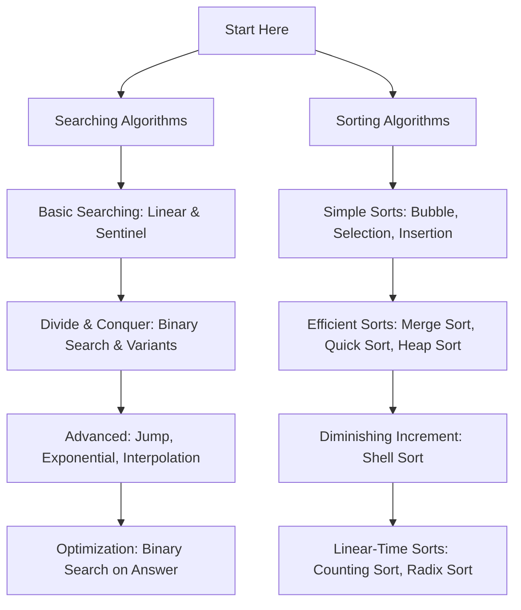

# Programming Algorithms & Data Structures

> A comprehensive, production-grade guide and reference collection covering core **Searching** and **Sorting** algorithms with detailed explanations, visual intuition, complexity analysis, edge cases, and multi-language code snippets.

---

## 📋 Table of Contents

- [Overview](#-overview)
- [Key Features](#-key-features)
- [Algorithm Index & Complexity Cheat Sheet](#-algorithm-index--complexity-cheat-sheet)
  - [Searching Algorithms](#searching-algorithms)
  - [Sorting Algorithms](#sorting-algorithms)
- [Recommended Learning Path](#-recommended-learning-path)
- [Structure of Each Guide](#-structure-of-each-guide)
- [How to Use](#-how-to-use)
- [Contributing](#-contributing)
- [License](#-license)

---

## 🔍 Overview

This repository is designed for students, software engineers, and competitive programmers who want to build a deep, intuitive, and practical understanding of foundational computer science algorithms. Each module goes far beyond basic code implementations, exploring theoretical foundations, mathematical proofs, performance trade-offs, real-world industry use cases, and common interview pitfalls.

---

## ✨ Key Features

- **In-Depth Explanations:** Real-world analogies, step-by-step walkthroughs, and visual ASCII/text representations for every algorithm.
- **Complexity Analysis:** Best-case, average-case, worst-case time complexities and space complexity breakdowns.
- **Code Implementations:** Clean, idiomatic implementations in popular programming languages (Python, C++, Java, JavaScript).
- **Edge Cases & Pitfalls:** Detailed coverage of boundary conditions, integer overflow issues, and optimization tricks.
- **Interview & CP Ready:** Common interview questions and competitive programming patterns related to each technique.

---

## 📊 Algorithm Index & Complexity Cheat Sheet

### Searching Algorithms

| # | Algorithm | Best Time | Average Time | Worst Time | Space | Sorted Required? | Guide Link |
|---|---|---|---|---|---|---|---|
| 01 | **Linear Search** | $O(1)$ | $O(n)$ | $O(n)$ | $O(1)$ | No | [View Guide](./01_linear_search.md) |
| 02 | **Binary Search** | $O(1)$ | $O(\log n)$ | $O(\log n)$ | $O(1)$ | Yes | [View Guide](./02_binary_search.md) |
| 03 | **Jump Search** | $O(1)$ | $O(\sqrt{n})$ | $O(\sqrt{n})$ | $O(1)$ | Yes | [View Guide](./03_jump_search.md) |
| 04 | **Interpolation Search** | $O(1)$ | $O(\log(\log n))$ | $O(n)$ | $O(1)$ | Yes (Uniform) | [View Guide](./04_interpolation_search.md) |
| 05 | **Exponential Search** | $O(1)$ | $O(\log i)$ | $O(\log n)$ | $O(1)$ | Yes | [View Guide](./05_exponential_search.md) |
| 06 | **Fibonacci Search** | $O(1)$ | $O(\log n)$ | $O(\log n)$ | $O(1)$ | Yes | [View Guide](./06_fibonacci_search.md) |
| 07 | **Ternary Search** | $O(1)$ | $O(\log_3 n)$ | $O(\log_3 n)$ | $O(1)$ | Yes / Unimodal | [View Guide](./07_ternary_search.md) |
| 08 | **Sentinel Linear Search** | $O(1)$ | $O(n)$ | $O(n)$ | $O(1)$ | No | [View Guide](./08_sentinel_search.md) |
| 09 | **Binary Search on Answer** | $O(1)$ | $O(C \cdot \log R)$ | $O(C \cdot \log R)$ | $O(1)$ | Monotonic Predicate | [View Guide](./09_binary_search_on_answer.md) |
| 10 | **Hash Table Lookup** | $O(1)$ | $O(1)$ | $O(n)$ | $O(n)$ | No | [View Guide](./10_hash_table_lookup.md) |

---

### Sorting Algorithms

| # | Algorithm | Best Time | Average Time | Worst Time | Space | Stable? | In-Place? | Guide Link |
|---|---|---|---|---|---|---|---|---|
| 11 | **Bubble Sort** | $O(n)$ | $O(n^2)$ | $O(n^2)$ | $O(1)$ | Yes | Yes | [View Guide](./11_bubble_sort.md) |
| 12 | **Selection Sort** | $O(n^2)$ | $O(n^2)$ | $O(n^2)$ | $O(1)$ | No | Yes | [View Guide](./12_selection_sort.md) |
| 13 | **Insertion Sort** | $O(n)$ | $O(n^2)$ | $O(n^2)$ | $O(1)$ | Yes | Yes | [View Guide](./13_insertion_sort.md) |
| 14 | **Merge Sort** | $O(n \log n)$ | $O(n \log n)$ | $O(n \log n)$ | $O(n)$ | Yes | No | [View Guide](./14_merge_sort.md) |
| 15 | **Quick Sort** | $O(n \log n)$ | $O(n \log n)$ | $O(n^2)$ | $O(\log n)$ | No | Yes | [View Guide](./15_quick_sort.md) |
| 16 | **Heap Sort** | $O(n \log n)$ | $O(n \log n)$ | $O(n \log n)$ | $O(1)$ | No | Yes | [View Guide](./16_heap_sort.md) |
| 17 | **Shell Sort** | $O(n \log n)$ | $O(n^{4/3})$ | $O(n^2)$ | $O(1)$ | No | Yes | [View Guide](./17_shell_sort.md) |
| 18 | **Counting Sort** | $O(n + k)$ | $O(n + k)$ | $O(n + k)$ | $O(n + k)$ | Yes | No | [View Guide](./18_Counting_sort.md) |
| 19 | **Radix Sort** | $O(d(n + k))$ | $O(d(n + k))$ | $O(d(n + k))$ | $O(n + k)$ | Yes | No | [View Guide](./19_Radix_sort.md) |

---

## 🎯 Recommended Learning Path



---

## 🛠️ Structure of Each Guide

Each algorithm markdown file follows a structured layout:

1. **Introduction & Real-World Analogy**: Concise summary and relatable intuitive examples.
2. **Why Use This Algorithm**: Benefits, performance profile, comparison with alternatives.
3. **Real-World Applications**: Where it is used in production systems, databases, or operating systems.
4. **Prerequisites & Core Concepts**: Concepts required before tackling the implementation.
5. **Visualization**: Conceptual diagrams and step-by-step state representations.
6. **Step-by-Step Algorithm & Pseudocode**: Clear procedural blueprint.
7. **Complete Code Implementations**: Verified source code in Python, C++, Java, and JavaScript.
8. **Complexity Analysis & Proofs**: Detailed mathematical breakdown of time and space complexities.
9. **Edge Cases, Hazards & Optimization**: Handing duplicates, overflow, empty inputs, etc.
10. **Comparison Matrix**: Contrast against similar algorithms.
11. **Summary & Quick Reference**: Key takeaways cheat sheet.

---

## 🚀 How to Use

1. **Clone the Repository:**
   ```bash
   git clone https://github.com/priteshbhoi/programming-algorithm.git
   cd programming-algorithm
   ```
2. **Navigate to an Algorithm Guide:**
   Open any `.md` file in your markdown viewer, IDE (VS Code, Antigravity, etc.), or on GitHub.
3. **Practice & Implement:**
   Review the code snippets, attempt implementing them from scratch, and study the complexity trade-offs for technical interview prep.

---

## 🤝 Contributing

Contributions are welcome! If you'd like to add a new algorithm guide, improve an existing implementation, or correct a documentation error:

1. Fork the repository.
2. Create your feature branch (`git checkout -b feature/new-algorithm`).
3. Commit your changes (`git commit -m 'Add Dijkstra Algorithm'`).
4. Push to the branch (`git push origin feature/new-algorithm`).
5. Open a Pull Request.

---

## 📜 License

This project is licensed under the [MIT License](LICENSE) - see the file for details.
