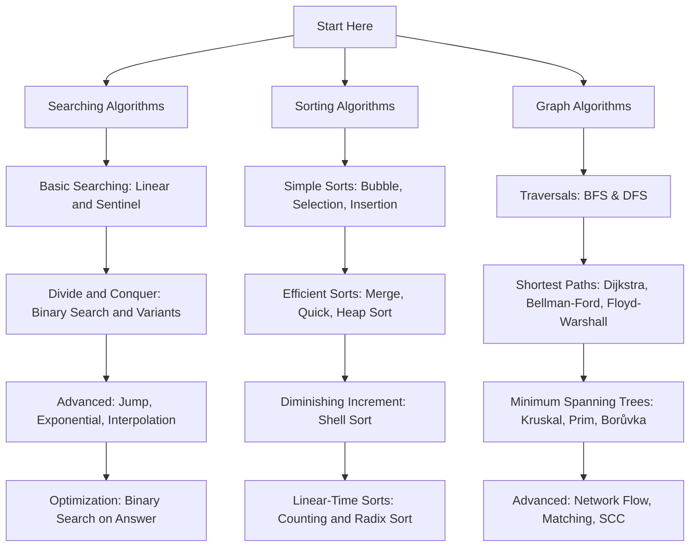

# Programming Algorithms & Data Structures

> A comprehensive, production-grade guide and reference collection covering **213 core Algorithms & Data Structures** across **21 categories** with detailed explanations, visual intuition, complexity analysis, edge cases, multi-language code snippets, and progress tracking.

---

## 📊 Repository Progress & Overview

| Total Categories | Total Algorithms | Completed Guides | Overall Progress |
| :---: | :---: | :---: | :---: |
| **21** | **213** | **213 / 213** | `████████████████████` **100.0%** |

---

## 📋 Table of Contents

- [Overview](#-overview)
- [Key Features](#-key-features)
- [All Algorithms & Roadmap](#-all-algorithms--roadmap)
  - [🔍 Searching (10/10)](#-searching-1010)
  - [📊 Sorting (20/20)](#-sorting-2020)
  - [🌐 Graph (22/22)](#-graph-2222)
  - [🧩 Dynamic Programming (14/14)](#-dynamic-programming-1414)
  - [⚡ Greedy (4/4)](#-greedy-44)
  - [✂️ Divide & Conquer (3/3)](#-divide-conquer-33)
  - [🔄 Backtracking (8/8)](#-backtracking-88)
  - [🌿 Branch & Bound (4/4)](#-branch-bound-44)
  - [🔤 String (11/11)](#-string-1111)
  - [🌲 Tree (16/16)](#-tree-1616)
  - [🏗️ Data Structures (9/9)](#-data-structures-99)
  - [📦 Compression (7/7)](#-compression-77)
  - [🔐 Cryptography (18/18)](#-cryptography-1818)
  - [🔢 Numerical (10/10)](#-numerical-1010)
  - [🤖 Machine Learning (18/18)](#-machine-learning-1818)
  - [🧠 Artificial Intelligence (9/9)](#-artificial-intelligence-99)
  - [📡 Networking (7/7)](#-networking-77)
  - [💻 Distributed Systems (6/6)](#-distributed-systems-66)
  - [🗄️ Database (6/6)](#-database-66)
  - [📐 Geometry (6/6)](#-geometry-66)
  - [🎲 Randomized (5/5)](#-randomized-55)
- [Algorithm Complexity Cheat Sheet](#-algorithm-complexity-cheat-sheet)
  - [Searching Algorithms](#searching-algorithms)
  - [Sorting Algorithms](#sorting-algorithms)
- [Recommended Learning Path](#-recommended-learning-path)
- [Structure of Each Guide](#-structure-of-each-guide)
- [How to Use](#-how-to-use)
- [Contributing](#-contributing)
- [License](#-license)

---

## 🔍 Overview

This repository is designed for students, software engineers, and competitive programmers who want to build a deep, intuitive, and practical understanding of foundational computer science algorithms. Each module goes far beyond basic code implementations, exploring theoretical foundations, mathematical proofs, performance trade-offs, real-world industry use cases, and common interview pitfalls.

---

## ✨ Key Features

- **In-Depth Explanations:** Real-world analogies, step-by-step walkthroughs, and visual ASCII/text representations for every algorithm.
- **Complexity Analysis:** Best-case, average-case, worst-case time complexities and space complexity breakdowns.
- **Code Implementations:** Clean, idiomatic implementations in popular programming languages (Python, C++, Java, JavaScript, C).
- **Edge Cases & Pitfalls:** Detailed coverage of boundary conditions, integer overflow issues, and optimization tricks.
- **Interview & CP Ready:** Common interview questions and competitive programming patterns related to each technique.

---

## 🗺️ All Algorithms & Roadmap

### 🔍 Searching (10/10)

| # | Algorithm | Status | Guide Link |
|---|---|:---:|---|
| 01 | **Linear Search** | Done | [View Guide](./01_linear_search.md) |
| 02 | **Binary Search** | Done | [View Guide](./02_binary_search.md) |
| 03 | **Jump Search** | Done | [View Guide](./03_jump_search.md) |
| 04 | **Interpolation Search** | Done | [View Guide](./04_interpolation_search.md) |
| 05 | **Exponential Search** | Done | [View Guide](./05_exponential_search.md) |
| 06 | **Fibonacci Search** | Done | [View Guide](./06_fibonacci_search.md) |
| 07 | **Ternary Search** | Done | [View Guide](./07_ternary_search.md) |
| 08 | **Sentinel Search** | Done | [View Guide](./08_sentinel_search.md) |
| 09 | **Binary Search on Answer** | Done | [View Guide](./09_binary_search_on_answer.md) |
| 10 | **Hash Table Lookup** | Done | [View Guide](./10_hash_table_lookup.md) |

### 📊 Sorting (20/20)

| # | Algorithm | Status | Guide Link |
|---|---|:---:|---|
| 01 | **Bubble Sort** | Done | [View Guide](./11_bubble_sort.md) |
| 02 | **Selection Sort** | Done | [View Guide](./12_selection_sort.md) |
| 03 | **Insertion Sort** | Done | [View Guide](./13_insertion_sort.md) |
| 04 | **Merge Sort** | Done | [View Guide](./14_merge_sort.md) |
| 05 | **Quick Sort** | Done | [View Guide](./15_quick_sort.md) |
| 06 | **Heap Sort** | Done | [View Guide](./16_heap_sort.md) |
| 07 | **Shell Sort** | Done | [View Guide](./17_shell_sort.md) |
| 08 | **Counting Sort** | Done | [View Guide](./18_counting_sort.md) |
| 09 | **Radix Sort** | Done | [View Guide](./19_radix_sort.md) |
| 10 | **Bucket Sort** | Done | [View Guide](./20_bucket_sort.md) |
| 11 | **Tim Sort** | Done | [View Guide](./21_tim_sort.md) |
| 12 | **IntroSort** | Done | [View Guide](./22_introsort.md) |
| 13 | **Cocktail Shaker Sort** | Done | [View Guide](./23_cocktail_shaker_sort.md) |
| 14 | **Comb Sort** | Done | [View Guide](./24_comb_sort.md) |
| 15 | **Gnome Sort** | Done | [View Guide](./25_gnome_sort.md) |
| 16 | **Cycle Sort** | Done | [View Guide](./26_cycle_sort.md) |
| 17 | **Pancake Sort** | Done | [View Guide](./27_pancake_sort.md) |
| 18 | **Odd-Even Sort** | Done | [View Guide](./28_odd_even_sort.md) |
| 19 | **Bitonic Sort** | Done | [View Guide](./29_bitonic_sort.md) |
| 20 | **Sleep Sort** | Done | [View Guide](./30_sleep_sort.md) |

### 🌐 Graph (22/22)

| # | Algorithm | Status | Guide Link |
|---|---|:---:|---|
| 01 | **Breadth-First Search (BFS)** | Done | [View Guide](./31_breadth_first_search.md) |
| 02 | **Depth-First Search (DFS)** | Done | [View Guide](./32_depth_first_search.md) |
| 03 | **Dijkstra's Algorithm** | Done | [View Guide](./33_dijkstras_algorithm.md) |
| 04 | **Bellman-Ford Algorithm** | Done | [View Guide](./34_bellman_ford_algorithm.md) |
| 05 | **Floyd-Warshall Algorithm** | Done | [View Guide](./35_floyd_warshall_algorithm.md) |
| 06 | **A* Search** | Done | [View Guide](./36_a_star_search.md) |
| 07 | **Kruskal's Algorithm** | Done | [View Guide](./37_kruskals_algorithm.md) |
| 08 | **Prim's Algorithm** | Done | [View Guide](./38_prims_algorithm.md) |
| 09 | **Borůvka's Algorithm** | Done | [View Guide](./39_boruvkas_algorithm.md) |
| 10 | **Topological Sort** | Done | [View Guide](./40_topological_sort.md) |
| 11 | **Tarjan's SCC Algorithm** | Done | [View Guide](./41_tarjans_scc_algorithm.md) |
| 12 | **Kosaraju's Algorithm** | Done | [View Guide](./42_kosarajus_algorithm.md) |
| 13 | **Johnson's Algorithm** | Done | [View Guide](./43_johnsons_algorithm.md) |
| 14 | **Edmonds-Karp Algorithm** | Done | [View Guide](./44_edmonds_karp_algorithm.md) |
| 15 | **Ford-Fulkerson Algorithm** | Done | [View Guide](./45_ford_fulkerson_algorithm.md) |
| 16 | **Dinic's Algorithm** | Done | [View Guide](./46_dinics_algorithm.md) |
| 17 | **Hopcroft-Karp Algorithm** | Done | [View Guide](./47_hopcroft_karp_algorithm.md) |
| 18 | **Hungarian Algorithm** | Done | [View Guide](./48_hungarian_algorithm.md) |
| 19 | **Hierholzer's Algorithm** | Done | [View Guide](./49_hierholzers_algorithm.md) |
| 20 | **Fleury's Algorithm** | Done | [View Guide](./50_fleurys_algorithm.md) |
| 21 | **Kahn's Algorithm** | Done | [View Guide](./51_kahns_algorithm.md) |
| 22 | **SPFA** | Done | [View Guide](./52_spfa_algorithm.md) |

### 🧩 Dynamic Programming (14/14)

| # | Algorithm | Status | Guide Link |
|---|---|:---:|---|
| 01 | **Fibonacci DP** | Done | [View Guide](./53_fibonacci_dp.md) |
| 02 | **Knapsack (0/1)** | Done | [View Guide](./54_knapsack_01.md) |
| 03 | **Fractional Knapsack** | Done | [View Guide](./55_fractional_knapsack.md) |
| 04 | **Coin Change** | Done | [View Guide](./56_coin_change.md) |
| 05 | **Rod Cutting** | Done | [View Guide](./57_rod_cutting.md) |
| 06 | **Matrix Chain Multiplication** | Done | [View Guide](./58_matrix_chain_multiplication.md) |
| 07 | **Longest Common Subsequence** | Done | [View Guide](./59_longest_common_subsequence.md) |
| 08 | **Longest Common Substring** | Done | [View Guide](./60_longest_common_substring.md) |
| 09 | **Longest Increasing Subsequence** | Done | [View Guide](./61_longest_increasing_subsequence.md) |
| 10 | **Edit Distance** | Done | [View Guide](./62_edit_distance.md) |
| 11 | **Egg Dropping** | Done | [View Guide](./63_egg_dropping.md) |
| 12 | **Subset Sum** | Done | [View Guide](./64_subset_sum.md) |
| 13 | **Partition Problem** | Done | [View Guide](./65_partition_problem.md) |
| 14 | **Kadane's Algorithm** | Done | [View Guide](./66_kadanes_algorithm.md) |

### ⚡ Greedy (4/4)

| # | Algorithm | Status | Guide Link |
|---|---|:---:|---|
| 01 | **Huffman Coding** | Done | [View Guide](./67_huffman_coding.md) |
| 02 | **Activity Selection** | Done | [View Guide](./68_activity_selection.md) |
| 03 | **Job Sequencing** | Done | [View Guide](./69_job_sequencing.md) |
| 04 | **Optimal Merge Pattern** | Done | [View Guide](./70_optimal_merge_pattern.md) |

### ✂️ Divide & Conquer (3/3)

| # | Algorithm | Status | Guide Link |
|---|---|:---:|---|
| 01 | **Closest Pair of Points** | Done | [View Guide](./71_closest_pair_of_points.md) |
| 02 | **Strassen Matrix Multiplication** | Done | [View Guide](./72_strassen_matrix_multiplication.md) |
| 03 | **Karatsuba Multiplication** | Done | [View Guide](./73_karatsuba_multiplication.md) |

### 🔄 Backtracking (8/8)

| # | Algorithm | Status | Guide Link |
|---|---|:---:|---|
| 01 | **N-Queens** | Done | [View Guide](./74_n_queens.md) |
| 02 | **Sudoku Solver** | Done | [View Guide](./75_sudoku_solver.md) |
| 03 | **Rat in a Maze** | Done | [View Guide](./76_rat_in_a_maze.md) |
| 04 | **Knight's Tour** | Done | [View Guide](./77_knights_tour.md) |
| 05 | **Hamiltonian Cycle** | Done | [View Guide](./78_hamiltonian_cycle.md) |
| 06 | **Graph Coloring** | Done | [View Guide](./79_graph_coloring.md) |
| 07 | **Permutation Generation** | Done | [View Guide](./80_permutation_generation.md) |
| 08 | **Combination Generation** | Done | [View Guide](./81_combination_generation.md) |

### 🌿 Branch & Bound (4/4)

| # | Algorithm | Status | Guide Link |
|---|---|:---:|---|
| 01 | **Traveling Salesman** | Done | [View Guide](./82_traveling_salesman.md) |
| 02 | **Job Assignment** | Done | [View Guide](./83_job_assignment.md) |
| 03 | **Knapsack (Branch & Bound)** | Done | [View Guide](./84_knapsack_branch_and_bound.md) |
| 04 | **8 Puzzle** | Done | [View Guide](./85_8_puzzle.md) |

### 🔤 String (11/11)

| # | Algorithm | Status | Guide Link |
|---|---|:---:|---|
| 01 | **Knuth-Morris-Pratt (KMP)** | Done | [View Guide](./86_knuth_morris_pratt_kmp.md) |
| 02 | **Rabin-Karp** | Done | [View Guide](./87_rabin_karp.md) |
| 03 | **Boyer-Moore** | Done | [View Guide](./88_boyer_moore.md) |
| 04 | **Z Algorithm** | Done | [View Guide](./89_z_algorithm.md) |
| 05 | **Aho-Corasick** | Done | [View Guide](./90_aho_corasick.md) |
| 06 | **Manacher's Algorithm** | Done | [View Guide](./91_manachers_algorithm.md) |
| 07 | **Suffix Array** | Done | [View Guide](./92_suffix_array.md) |
| 08 | **Suffix Tree** | Done | [View Guide](./93_suffix_tree.md) |
| 09 | **Trie Search** | Done | [View Guide](./94_trie_search.md) |
| 10 | **Prefix Function** | Done | [View Guide](./95_prefix_function.md) |
| 11 | **Rolling Hash** | Done | [View Guide](./96_rolling_hash.md) |

### 🌲 Tree (16/16)

| # | Algorithm | Status | Guide Link |
|---|---|:---:|---|
| 01 | **Inorder Traversal** | Done | [View Guide](./97_inorder_traversal.md) |
| 02 | **Preorder Traversal** | Done | [View Guide](./98_preorder_traversal.md) |
| 03 | **Postorder Traversal** | Done | [View Guide](./99_postorder_traversal.md) |
| 04 | **Level Order Traversal** | Done | [View Guide](./100_level_order_traversal.md) |
| 05 | **Morris Traversal** | Done | [View Guide](./101_morris_traversal.md) |
| 06 | **AVL Tree** | Done | [View Guide](./102_avl_tree.md) |
| 07 | **Red-Black Tree** | Done | [View Guide](./103_red_black_tree.md) |
| 08 | **B-Tree** | Done | [View Guide](./104_b_tree.md) |
| 09 | **B+ Tree** | Done | [View Guide](./105_b_plus_tree.md) |
| 10 | **Segment Tree** | Done | [View Guide](./106_segment_tree.md) |
| 11 | **Fenwick Tree** | Done | [View Guide](./107_fenwick_tree.md) |
| 12 | **Binary Indexed Tree** | Done | [View Guide](./108_binary_indexed_tree.md) |
| 13 | **Heavy-Light Decomposition** | Done | [View Guide](./109_heavy_light_decomposition.md) |
| 14 | **Lowest Common Ancestor** | Done | [View Guide](./110_lowest_common_ancestor.md) |
| 15 | **Euler Tour** | Done | [View Guide](./111_euler_tour.md) |
| 16 | **Tree Diameter** | Done | [View Guide](./112_tree_diameter.md) |

### 🏗️ Data Structures (9/9)

| # | Algorithm | Status | Guide Link |
|---|---|:---:|---|
| 01 | **Union-Find** | Done | [View Guide](./113_union_find.md) |
| 02 | **Bloom Filter** | Done | [View Guide](./114_bloom_filter.md) |
| 03 | **Skip List** | Done | [View Guide](./115_skip_list.md) |
| 04 | **Hashing** | Done | [View Guide](./116_hashing.md) |
| 05 | **Consistent Hashing** | Done | [View Guide](./117_consistent_hashing.md) |
| 06 | **Cuckoo Hashing** | Done | [View Guide](./118_cuckoo_hashing.md) |
| 07 | **Robin Hood Hashing** | Done | [View Guide](./119_robin_hood_hashing.md) |
| 08 | **LRU Cache** | Done | [View Guide](./120_lru_cache.md) |
| 09 | **LFU Cache** | Done | [View Guide](./121_lfu_cache.md) |

### 📦 Compression (7/7)

| # | Algorithm | Status | Guide Link |
|---|---|:---:|---|
| 01 | **LZW** | Done | [View Guide](./122_lzw.md) |
| 02 | **LZ77** | Done | [View Guide](./123_lz77.md) |
| 03 | **LZ78** | Done | [View Guide](./124_lz78.md) |
| 04 | **DEFLATE** | Done | [View Guide](./125_deflate.md) |
| 05 | **Run-Length Encoding** | Done | [View Guide](./126_run_length_encoding.md) |
| 06 | **Burrows-Wheeler Transform** | Done | [View Guide](./127_burrows_wheeler_transform.md) |
| 07 | **Arithmetic Coding** | Done | [View Guide](./128_arithmetic_coding.md) |

### 🔐 Cryptography (18/18)

| # | Algorithm | Status | Guide Link |
|---|---|:---:|---|
| 01 | **RSA** | Done | [View Guide](./129_rsa.md) |
| 02 | **AES** | Done | [View Guide](./130_aes.md) |
| 03 | **DES** | Done | [View Guide](./131_des.md) |
| 04 | **Triple DES** | Done | [View Guide](./132_triple_des.md) |
| 05 | **Blowfish** | Done | [View Guide](./133_blowfish.md) |
| 06 | **Twofish** | Done | [View Guide](./134_twofish.md) |
| 07 | **ChaCha20** | Done | [View Guide](./135_chacha20.md) |
| 08 | **Diffie-Hellman** | Done | [View Guide](./136_diffie_hellman.md) |
| 09 | **ElGamal** | Done | [View Guide](./137_elgamal.md) |
| 10 | **ECC** | Done | [View Guide](./138_ecc.md) |
| 11 | **SHA-1** | Done | [View Guide](./139_sha1.md) |
| 12 | **SHA-2** | Done | [View Guide](./140_sha2.md) |
| 13 | **SHA-3** | Done | [View Guide](./141_sha3.md) |
| 14 | **MD5** | Done | [View Guide](./142_md5.md) |
| 15 | **HMAC** | Done | [View Guide](./143_hmac.md) |
| 16 | **PBKDF2** | Done | [View Guide](./144_pbkdf2.md) |
| 17 | **Argon2** | Done | [View Guide](./145_argon2.md) |
| 18 | **bcrypt** | Done | [View Guide](./146_bcrypt.md) |

### 🔢 Numerical (10/10)

| # | Algorithm | Status | Guide Link |
|---|---|:---:|---|
| 01 | **Newton-Raphson** | Done | [View Guide](./147_newton_raphson.md) |
| 02 | **Bisection Method** | Done | [View Guide](./148_bisection_method.md) |
| 03 | **Secant Method** | Done | [View Guide](./149_secant_method.md) |
| 04 | **Gaussian Elimination** | Done | [View Guide](./150_gaussian_elimination.md) |
| 05 | **LU Decomposition** | Done | [View Guide](./151_lu_decomposition.md) |
| 06 | **QR Decomposition** | Done | [View Guide](./152_qr_decomposition.md) |
| 07 | **Fast Fourier Transform (FFT)** | Done | [View Guide](./153_fast_fourier_transform.md) |
| 08 | **Cooley-Tukey FFT** | Done | [View Guide](./154_cooley_tukey_fft.md) |
| 09 | **Euclidean Algorithm** | Done | [View Guide](./155_euclidean_algorithm.md) |
| 10 | **Extended Euclidean Algorithm** | Done | [View Guide](./156_extended_euclidean_algorithm.md) |

### 🤖 Machine Learning (18/18)

| # | Algorithm | Status | Guide Link |
|---|---|:---:|---|
| 01 | **Linear Regression** | Done | [View Guide](./157_linear_regression.md) |
| 02 | **Logistic Regression** | Done | [View Guide](./158_logistic_regression.md) |
| 03 | **Decision Tree** | Done | [View Guide](./159_decision_tree.md) |
| 04 | **Random Forest** | Done | [View Guide](./160_random_forest.md) |
| 05 | **XGBoost** | Done | [View Guide](./161_xgboost.md) |
| 06 | **LightGBM** | Done | [View Guide](./162_lightgbm.md) |
| 07 | **CatBoost** | Done | [View Guide](./163_catboost.md) |
| 08 | **Support Vector Machine** | Done | [View Guide](./164_support_vector_machine.md) |
| 09 | **Naive Bayes** | Done | [View Guide](./165_naive_bayes.md) |
| 10 | **K-Nearest Neighbors** | Done | [View Guide](./166_k_nearest_neighbors.md) |
| 11 | **K-Means** | Done | [View Guide](./167_k_means.md) |
| 12 | **DBSCAN** | Done | [View Guide](./168_dbscan.md) |
| 13 | **Hierarchical Clustering** | Done | [View Guide](./169_hierarchical_clustering.md) |
| 14 | **PCA** | Done | [View Guide](./170_pca.md) |
| 15 | **Gradient Descent** | Done | [View Guide](./171_gradient_descent.md) |
| 16 | **Stochastic Gradient Descent** | Done | [View Guide](./172_stochastic_gradient_descent.md) |
| 17 | **Adam Optimizer** | Done | [View Guide](./173_adam_optimizer.md) |
| 18 | **Apriori** | Done | [View Guide](./174_apriori.md) |

### 🧠 Artificial Intelligence (9/9)

| # | Algorithm | Status | Guide Link |
|---|---|:---:|---|
| 01 | **Minimax** | Done | [View Guide](./175_minimax.md) |
| 02 | **Alpha-Beta Pruning** | Done | [View Guide](./176_alpha_beta_pruning.md) |
| 03 | **Beam Search** | Done | [View Guide](./177_beam_search.md) |
| 04 | **Hill Climbing** | Done | [View Guide](./178_hill_climbing.md) |
| 05 | **Simulated Annealing** | Done | [View Guide](./179_simulated_annealing.md) |
| 06 | **Genetic Algorithm** | Done | [View Guide](./180_genetic_algorithm.md) |
| 07 | **Ant Colony Optimization** | Done | [View Guide](./181_ant_colony_optimization.md) |
| 08 | **Particle Swarm Optimization** | Done | [View Guide](./182_particle_swarm_optimization.md) |
| 09 | **Monte Carlo Tree Search** | Done | [View Guide](./183_monte_carlo_tree_search.md) |

### 📡 Networking (7/7)

| # | Algorithm | Status | Guide Link |
|---|---|:---:|---|
| 01 | **Distance Vector Routing** | Done | [View Guide](./184_distance_vector_routing.md) |
| 02 | **Link State Routing** | Done | [View Guide](./185_link_state_routing.md) |
| 03 | **Bellman-Ford Routing** | Done | [View Guide](./186_bellman_ford_routing.md) |
| 04 | **Dijkstra Routing** | Done | [View Guide](./187_dijkstra_routing.md) |
| 05 | **CRC** | Done | [View Guide](./188_crc.md) |
| 06 | **Hamming Code** | Done | [View Guide](./189_hamming_code.md) |
| 07 | **TCP Congestion Control** | Done | [View Guide](./190_tcp_congestion_control.md) |

### 💻 Distributed Systems (6/6)

| # | Algorithm | Status | Guide Link |
|---|---|:---:|---|
| 01 | **Paxos** | Done | [View Guide](./191_paxos.md) |
| 02 | **Raft** | Done | [View Guide](./192_raft.md) |
| 03 | **Chandy-Lamport Snapshot** | Done | [View Guide](./193_chandy_lamport_snapshot.md) |
| 04 | **MapReduce** | Done | [View Guide](./194_mapreduce.md) |
| 05 | **Gossip Protocol** | Done | [View Guide](./195_gossip_protocol.md) |
| 06 | **Consistent Hashing** | Done | [View Guide](./196_consistent_hashing.md) |

### 🗄️ Database (6/6)

| # | Algorithm | Status | Guide Link |
|---|---|:---:|---|
| 01 | **Hash Join** | Done | [View Guide](./197_hash_join.md) |
| 02 | **Merge Join** | Done | [View Guide](./198_merge_join.md) |
| 03 | **Nested Loop Join** | Done | [View Guide](./199_nested_loop_join.md) |
| 04 | **B+ Tree Index** | Done | [View Guide](./200_b_plus_tree_index.md) |
| 05 | **Query Optimization** | Done | [View Guide](./201_query_optimization.md) |
| 06 | **MVCC** | Done | [View Guide](./202_mvcc.md) |

### 📐 Geometry (6/6)

| # | Algorithm | Status | Guide Link |
|---|---|:---:|---|
| 01 | **Graham Scan** | Done | [View Guide](./203_graham_scan.md) |
| 02 | **Jarvis March** | Done | [View Guide](./204_jarvis_march.md) |
| 03 | **Convex Hull** | Done | [View Guide](./205_convex_hull.md) |
| 04 | **Bresenham Line Algorithm** | Done | [View Guide](./206_bresenham_line_algorithm.md) |
| 05 | **Delaunay Triangulation** | Done | [View Guide](./207_delaunay_triangulation.md) |
| 06 | **Voronoi Diagram** | Done | [View Guide](./208_voronoi_diagram.md) |

### 🎲 Randomized (5/5)

| # | Algorithm | Status | Guide Link |
|---|---|:---:|---|
| 01 | **Monte Carlo** | Done | [View Guide](./209_monte_carlo.md) |
| 02 | **Las Vegas** | Done | [View Guide](./210_las_vegas.md) |
| 03 | **Reservoir Sampling** | Done | [View Guide](./211_reservoir_sampling.md) |
| 04 | **Fisher-Yates Shuffle** | Done | [View Guide](./212_fisher_yates_shuffle.md) |
| 05 | **Randomized QuickSort** | Done | [View Guide](./213_randomized_quicksort.md) |

---

## 📊 Algorithm Complexity Cheat Sheet

### Searching Algorithms

| # | Algorithm | Best Time | Average Time | Worst Time | Space | Sorted Required? | Guide Link |
|---|---|---|---|---|---|---|---|
| 01 | **Linear Search** | $O(1)$ | $O(n)$ | $O(n)$ | $O(1)$ | No | [View Guide](./01_linear_search.md) |
| 02 | **Binary Search** | $O(1)$ | $O(\log n)$ | $O(\log n)$ | $O(1)$ | Yes | [View Guide](./02_binary_search.md) |
| 03 | **Jump Search** | $O(1)$ | $O(\sqrt{n})$ | $O(\sqrt{n})$ | $O(1)$ | Yes | [View Guide](./03_jump_search.md) |
| 04 | **Interpolation Search** | $O(1)$ | $O(\log(\log n))$ | $O(n)$ | $O(1)$ | Yes (Uniform) | [View Guide](./04_interpolation_search.md) |
| 05 | **Exponential Search** | $O(1)$ | $O(\log i)$ | $O(\log n)$ | $O(1)$ | Yes | [View Guide](./05_exponential_search.md) |
| 06 | **Fibonacci Search** | $O(1)$ | $O(\log n)$ | $O(\log n)$ | $O(1)$ | Yes | [View Guide](./06_fibonacci_search.md) |
| 07 | **Ternary Search** | $O(1)$ | $O(\log_3 n)$ | $O(\log_3 n)$ | $O(1)$ | Yes / Unimodal | [View Guide](./07_ternary_search.md) |
| 08 | **Sentinel Linear Search** | $O(1)$ | $O(n)$ | $O(n)$ | $O(1)$ | No | [View Guide](./08_sentinel_search.md) |
| 09 | **Binary Search on Answer** | $O(1)$ | $O(C \cdot \log R)$ | $O(C \cdot \log R)$ | $O(1)$ | Monotonic Predicate | [View Guide](./09_binary_search_on_answer.md) |
| 10 | **Hash Table Lookup** | $O(1)$ | $O(1)$ | $O(n)$ | $O(n)$ | No | [View Guide](./10_hash_table_lookup.md) |

### Sorting Algorithms

| # | Algorithm | Best Time | Average Time | Worst Time | Space | Stable? | In-Place? | Guide Link |
|---|---|---|---|---|---|---|---|---|
| 11 | **Bubble Sort** | $O(n)$ | $O(n^2)$ | $O(n^2)$ | $O(1)$ | Yes | Yes | [View Guide](./11_bubble_sort.md) |
| 12 | **Selection Sort** | $O(n^2)$ | $O(n^2)$ | $O(n^2)$ | $O(1)$ | No | Yes | [View Guide](./12_selection_sort.md) |
| 13 | **Insertion Sort** | $O(n)$ | $O(n^2)$ | $O(n^2)$ | $O(1)$ | Yes | Yes | [View Guide](./13_insertion_sort.md) |
| 14 | **Merge Sort** | $O(n \log n)$ | $O(n \log n)$ | $O(n \log n)$ | $O(n)$ | Yes | No | [View Guide](./14_merge_sort.md) |
| 15 | **Quick Sort** | $O(n \log n)$ | $O(n \log n)$ | $O(n^2)$ | $O(\log n)$ | No | Yes | [View Guide](./15_quick_sort.md) |
| 16 | **Heap Sort** | $O(n \log n)$ | $O(n \log n)$ | $O(n \log n)$ | $O(1)$ | No | Yes | [View Guide](./16_heap_sort.md) |
| 17 | **Shell Sort** | $O(n \log n)$ | $O(n^{4/3})$ | $O(n^2)$ | $O(1)$ | No | Yes | [View Guide](./17_shell_sort.md) |
| 18 | **Counting Sort** | $O(n + k)$ | $O(n + k)$ | $O(n + k)$ | $O(n + k)$ | Yes | No | [View Guide](./18_counting_sort.md) |
| 19 | **Radix Sort** | $O(d(n + k))$ | $O(d(n + k))$ | $O(d(n + k))$ | $O(n + k)$ | Yes | No | [View Guide](./19_radix_sort.md) |
| 20 | **Bucket Sort** | $O(n + k)$ | $O(n + k)$ | $O(n^2)$ | $O(n + k)$ | Yes | No | [View Guide](./20_bucket_sort.md) |
| 21 | **Tim Sort** | $O(n)$ | $O(n \log n)$ | $O(n \log n)$ | $O(n)$ | Yes | No | [View Guide](./21_tim_sort.md) |
| 22 | **IntroSort** | $O(n \log n)$ | $O(n \log n)$ | $O(n \log n)$ | $O(\log n)$ | No | Yes | [View Guide](./22_introsort.md) |
| 23 | **Cocktail Shaker Sort** | $O(n)$ | $O(n^2)$ | $O(n^2)$ | $O(1)$ | Yes | Yes | [View Guide](./23_cocktail_shaker_sort.md) |
| 24 | **Comb Sort** | $O(n \log n)$ | $O(n \log n)$ | $O(n^2)$ | $O(1)$ | No | Yes | [View Guide](./24_comb_sort.md) |
| 25 | **Gnome Sort** | $O(n)$ | $O(n^2)$ | $O(n^2)$ | $O(1)$ | Yes | Yes | [View Guide](./25_gnome_sort.md) |
| 26 | **Cycle Sort** | $O(n^2)$ | $O(n^2)$ | $O(n^2)$ | $O(1)$ | No | Yes | [View Guide](./26_cycle_sort.md) |
| 27 | **Pancake Sort** | $O(n)$ | $O(n^2)$ | $O(n^2)$ | $O(1)$ | No | Yes | [View Guide](./27_pancake_sort.md) |
| 28 | **Odd-Even Sort** | $O(n)$ | $O(n^2)$ | $O(n^2)$ | $O(1)$ | Yes | Yes | [View Guide](./28_odd_even_sort.md) |
| 29 | **Bitonic Sort** | $O(n \log^2 n)$ | $O(n \log^2 n)$ | $O(n \log^2 n)$ | $O(\log^2 n)$ | No | Yes | [View Guide](./29_bitonic_sort.md) |
| 30 | **Sleep Sort** | $O(\max(A) + n)$ | $O(\max(A) + n)$ | $O(\max(A) + n)$ | $O(n)$ | No | No | [View Guide](./30_sleep_sort.md) |

---

## 🎯 Recommended Learning Path



---

## 🛠️ Structure of Each Guide

Each algorithm markdown file follows a structured layout:

1. **Introduction & Real-World Analogy**: Concise summary and relatable intuitive examples.
2. **Why Use This Algorithm**: Benefits, performance profile, comparison with alternatives.
3. **Real-World Applications**: Where it is used in production systems, databases, or operating systems.
4. **Prerequisites & Core Concepts**: Concepts required before tackling the implementation.
5. **Visualization**: Conceptual diagrams and step-by-step state representations.
6. **Step-by-Step Algorithm & Pseudocode**: Clear procedural blueprint.
7. **Complete Code Implementations**: Verified source code in Python, C++, Java, JavaScript, and C.
8. **Complexity Analysis & Proofs**: Detailed mathematical breakdown of time and space complexities.
9. **Edge Cases, Hazards & Optimization**: Handing duplicates, overflow, empty inputs, etc.
10. **Comparison Matrix**: Contrast against similar algorithms.
11. **Summary & Quick Reference**: Key takeaways cheat sheet.

---

## 🚀 How to Use

1. **Clone the Repository:**
   ```bash
   git clone https://github.com/priteshbhoi/programming-algorithm.git
   cd programming-algorithm
   ```
2. **Navigate to an Algorithm Guide:**
   Open any `.md` file in your markdown viewer, IDE (VS Code, Antigravity, etc.), or on GitHub.
3. **Practice & Implement:**
   Review the code snippets, attempt implementing them from scratch, and study the complexity trade-offs for technical interview prep.

---

## 🤝 Contributing

Contributions are welcome! If you would like to add a new algorithm guide, improve an existing implementation, or correct a documentation error:

1. Fork the repository.
2. Create your feature branch (`git checkout -b feature/new-algorithm`).
3. Commit your changes (`git commit -m "Add Dijkstra Algorithm"`).
4. Push to the branch (`git push origin feature/new-algorithm`).
5. Open a Pull Request.

---

## 📜 License

This project is licensed under the [MIT License](LICENSE) - see the file for details.
