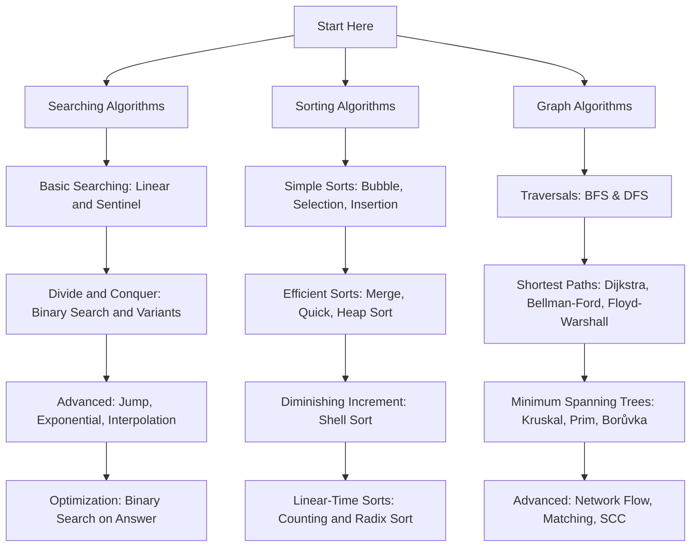

# Programming Algorithms & Data Structures

> A comprehensive, production-grade guide and reference collection covering **213 core Algorithms & Data Structures** across **21 categories** with detailed explanations, visual intuition, complexity analysis, edge cases, multi-language code snippets, and progress tracking.

---

## 📊 Repository Progress & Overview

| Total Categories | Total Algorithms | Completed Guides | Overall Progress |
| :---: | :---: | :---: | :---: |
| **21** | **213** | **52 / 213** | `████████░░░░░░░░░░░░` **24.4%** |

---

## 📋 Table of Contents

- [Overview](#-overview)
- [Key Features](#-key-features)
- [All Algorithms & Roadmap](#-all-algorithms--roadmap)
  - [🔍 Searching (10/10)](#-searching-1010)
  - [📊 Sorting (20/20)](#-sorting-2020)
  - [🌐 Graph (22/22)](#-graph-2222)
  - [🧩 Dynamic Programming (0/14)](#-dynamic-programming-014)
  - [⚡ Greedy (0/4)](#-greedy-04)
  - [✂️ Divide & Conquer (0/3)](#-divide-conquer-03)
  - [🔄 Backtracking (0/8)](#-backtracking-08)
  - [🌿 Branch & Bound (0/4)](#-branch-bound-04)
  - [🔤 String (0/11)](#-string-011)
  - [🌲 Tree (0/16)](#-tree-016)
  - [🏗️ Data Structures (0/9)](#-data-structures-09)
  - [📦 Compression (0/7)](#-compression-07)
  - [🔐 Cryptography (0/18)](#-cryptography-018)
  - [🔢 Numerical (0/10)](#-numerical-010)
  - [🤖 Machine Learning (0/18)](#-machine-learning-018)
  - [🧠 Artificial Intelligence (0/9)](#-artificial-intelligence-09)
  - [📡 Networking (0/7)](#-networking-07)
  - [💻 Distributed Systems (0/6)](#-distributed-systems-06)
  - [🗄️ Database (0/6)](#-database-06)
  - [📐 Geometry (0/6)](#-geometry-06)
  - [🎲 Randomized (0/5)](#-randomized-05)
- [Algorithm Complexity Cheat Sheet](#-algorithm-complexity-cheat-sheet)
  - [Searching Algorithms](#searching-algorithms)
  - [Sorting Algorithms](#sorting-algorithms)
- [Recommended Learning Path](#-recommended-learning-path)
- [Structure of Each Guide](#-structure-of-each-guide)
- [How to Use](#-how-to-use)
- [Contributing](#-contributing)
- [License](#-license)

---

## 🔍 Overview

This repository is designed for students, software engineers, and competitive programmers who want to build a deep, intuitive, and practical understanding of foundational computer science algorithms. Each module goes far beyond basic code implementations, exploring theoretical foundations, mathematical proofs, performance trade-offs, real-world industry use cases, and common interview pitfalls.

---

## ✨ Key Features

- **In-Depth Explanations:** Real-world analogies, step-by-step walkthroughs, and visual ASCII/text representations for every algorithm.
- **Complexity Analysis:** Best-case, average-case, worst-case time complexities and space complexity breakdowns.
- **Code Implementations:** Clean, idiomatic implementations in popular programming languages (Python, C++, Java, JavaScript).
- **Edge Cases & Pitfalls:** Detailed coverage of boundary conditions, integer overflow issues, and optimization tricks.
- **Interview & CP Ready:** Common interview questions and competitive programming patterns related to each technique.

---

## 🗺️ All Algorithms & Roadmap

### 🔍 Searching (10/10)

| # | Algorithm | Status | Guide Link |
|---|---|:---:|---|
| 01 | **Linear Search** | Done | [View Guide](./01_linear_search.md) |
| 02 | **Binary Search** | Done | [View Guide](./02_binary_search.md) |
| 03 | **Jump Search** | Done | [View Guide](./03_jump_search.md) |
| 04 | **Interpolation Search** | Done | [View Guide](./04_interpolation_search.md) |
| 05 | **Exponential Search** | Done | [View Guide](./05_exponential_search.md) |
| 06 | **Fibonacci Search** | Done | [View Guide](./06_fibonacci_search.md) |
| 07 | **Ternary Search** | Done | [View Guide](./07_ternary_search.md) |
| 08 | **Sentinel Search** | Done | [View Guide](./08_sentinel_search.md) |
| 09 | **Binary Search on Answer** | Done | [View Guide](./09_binary_search_on_answer.md) |
| 10 | **Hash Table Lookup** | Done | [View Guide](./10_hash_table_lookup.md) |

### 📊 Sorting (20/20)

| # | Algorithm | Status | Guide Link |
|---|---|:---:|---|
| 01 | **Bubble Sort** | Done | [View Guide](./11_bubble_sort.md) |
| 02 | **Selection Sort** | Done | [View Guide](./12_selection_sort.md) |
| 03 | **Insertion Sort** | Done | [View Guide](./13_insertion_sort.md) |
| 04 | **Merge Sort** | Done | [View Guide](./14_merge_sort.md) |
| 05 | **Quick Sort** | Done | [View Guide](./15_quick_sort.md) |
| 06 | **Heap Sort** | Done | [View Guide](./16_heap_sort.md) |
| 07 | **Shell Sort** | Done | [View Guide](./17_shell_sort.md) |
| 08 | **Counting Sort** | Done | [View Guide](./18_counting_sort.md) |
| 09 | **Radix Sort** | Done | [View Guide](./19_radix_sort.md) |
| 10 | **Bucket Sort** | Done | [View Guide](./20_bucket_sort.md) |
| 11 | **Tim Sort** | Done | [View Guide](./21_tim_sort.md) |
| 12 | **IntroSort** | Done | [View Guide](./22_introsort.md) |
| 13 | **Cocktail Shaker Sort** | Done | [View Guide](./23_cocktail_shaker_sort.md) |
| 14 | **Comb Sort** | Done | [View Guide](./24_comb_sort.md) |
| 15 | **Gnome Sort** | Done | [View Guide](./25_gnome_sort.md) |
| 16 | **Cycle Sort** | Done | [View Guide](./26_cycle_sort.md) |
| 17 | **Pancake Sort** | Done | [View Guide](./27_pancake_sort.md) |
| 18 | **Odd-Even Sort** | Done | [View Guide](./28_odd_even_sort.md) |
| 19 | **Bitonic Sort** | Done | [View Guide](./29_bitonic_sort.md) |
| 20 | **Sleep Sort** | Done | [View Guide](./30_sleep_sort.md) |

### 🌐 Graph (22/22)

| # | Algorithm | Status | Guide Link |
|---|---|:---:|---|
| 01 | **Breadth-First Search (BFS)** | Done | [View Guide](./31_breadth_first_search.md) |
| 02 | **Depth-First Search (DFS)** | Done | [View Guide](./32_depth_first_search.md) |
| 03 | **Dijkstra's Algorithm** | Done | [View Guide](./33_dijkstras_algorithm.md) |
| 04 | **Bellman-Ford Algorithm** | Done | [View Guide](./34_bellman_ford_algorithm.md) |
| 05 | **Floyd-Warshall Algorithm** | Done | [View Guide](./35_floyd_warshall_algorithm.md) |
| 06 | **A* Search** | Done | [View Guide](./36_a_star_search.md) |
| 07 | **Kruskal's Algorithm** | Done | [View Guide](./37_kruskals_algorithm.md) |
| 08 | **Prim's Algorithm** | Done | [View Guide](./38_prims_algorithm.md) |
| 09 | **Borůvka's Algorithm** | Done | [View Guide](./39_boruvkas_algorithm.md) |
| 10 | **Topological Sort** | Done | [View Guide](./40_topological_sort.md) |
| 11 | **Tarjan's SCC Algorithm** | Done | [View Guide](./41_tarjans_scc_algorithm.md) |
| 12 | **Kosaraju's Algorithm** | Done | [View Guide](./42_kosarajus_algorithm.md) |
| 13 | **Johnson's Algorithm** | Done | [View Guide](./43_johnsons_algorithm.md) |
| 14 | **Edmonds-Karp Algorithm** | Done | [View Guide](./44_edmonds_karp_algorithm.md) |
| 15 | **Ford-Fulkerson Algorithm** | Done | [View Guide](./45_ford_fulkerson_algorithm.md) |
| 16 | **Dinic's Algorithm** | Done | [View Guide](./46_dinics_algorithm.md) |
| 17 | **Hopcroft-Karp Algorithm** | Done | [View Guide](./47_hopcroft_karp_algorithm.md) |
| 18 | **Hungarian Algorithm** | Done | [View Guide](./48_hungarian_algorithm.md) |
| 19 | **Hierholzer's Algorithm** | Done | [View Guide](./49_hierholzers_algorithm.md) |
| 20 | **Fleury's Algorithm** | Done | [View Guide](./50_fleurys_algorithm.md) |
| 21 | **Kahn's Algorithm** | Done | [View Guide](./51_kahns_algorithm.md) |
| 22 | **SPFA** | Done | [View Guide](./52_spfa_algorithm.md) |

### 🧩 Dynamic Programming (0/14)

| # | Algorithm | Status | Guide Link |
|---|---|:---:|---|
| 01 | **Fibonacci DP** | Pending | - |
| 02 | **Knapsack (0/1)** | Pending | - |
| 03 | **Fractional Knapsack** | Pending | - |
| 04 | **Coin Change** | Pending | - |
| 05 | **Rod Cutting** | Pending | - |
| 06 | **Matrix Chain Multiplication** | Pending | - |
| 07 | **Longest Common Subsequence** | Pending | - |
| 08 | **Longest Common Substring** | Pending | - |
| 09 | **Longest Increasing Subsequence** | Pending | - |
| 10 | **Edit Distance** | Pending | - |
| 11 | **Egg Dropping** | Pending | - |
| 12 | **Subset Sum** | Pending | - |
| 13 | **Partition Problem** | Pending | - |
| 14 | **Kadane's Algorithm** | Pending | - |

### ⚡ Greedy (0/4)

| # | Algorithm | Status | Guide Link |
|---|---|:---:|---|
| 01 | **Huffman Coding** | Pending | - |
| 02 | **Activity Selection** | Pending | - |
| 03 | **Job Sequencing** | Pending | - |
| 04 | **Optimal Merge Pattern** | Pending | - |

### ✂️ Divide & Conquer (0/3)

| # | Algorithm | Status | Guide Link |
|---|---|:---:|---|
| 01 | **Closest Pair of Points** | Pending | - |
| 02 | **Strassen Matrix Multiplication** | Pending | - |
| 03 | **Karatsuba Multiplication** | Pending | - |

### 🔄 Backtracking (0/8)

| # | Algorithm | Status | Guide Link |
|---|---|:---:|---|
| 01 | **N-Queens** | Pending | - |
| 02 | **Sudoku Solver** | Pending | - |
| 03 | **Rat in a Maze** | Pending | - |
| 04 | **Knight's Tour** | Pending | - |
| 05 | **Hamiltonian Cycle** | Pending | - |
| 06 | **Graph Coloring** | Pending | - |
| 07 | **Permutation Generation** | Pending | - |
| 08 | **Combination Generation** | Pending | - |

### 🌿 Branch & Bound (0/4)

| # | Algorithm | Status | Guide Link |
|---|---|:---:|---|
| 01 | **Traveling Salesman** | Pending | - |
| 02 | **Job Assignment** | Pending | - |
| 03 | **Knapsack (Branch & Bound)** | Pending | - |
| 04 | **8 Puzzle** | Pending | - |

### 🔤 String (0/11)

| # | Algorithm | Status | Guide Link |
|---|---|:---:|---|
| 01 | **Knuth-Morris-Pratt (KMP)** | Pending | - |
| 02 | **Rabin-Karp** | Pending | - |
| 03 | **Boyer-Moore** | Pending | - |
| 04 | **Z Algorithm** | Pending | - |
| 05 | **Aho-Corasick** | Pending | - |
| 06 | **Manacher's Algorithm** | Pending | - |
| 07 | **Suffix Array** | Pending | - |
| 08 | **Suffix Tree** | Pending | - |
| 09 | **Trie Search** | Pending | - |
| 10 | **Prefix Function** | Pending | - |
| 11 | **Rolling Hash** | Pending | - |

### 🌲 Tree (0/16)

| # | Algorithm | Status | Guide Link |
|---|---|:---:|---|
| 01 | **Inorder Traversal** | Pending | - |
| 02 | **Preorder Traversal** | Pending | - |
| 03 | **Postorder Traversal** | Pending | - |
| 04 | **Level Order Traversal** | Pending | - |
| 05 | **Morris Traversal** | Pending | - |
| 06 | **AVL Tree** | Pending | - |
| 07 | **Red-Black Tree** | Pending | - |
| 08 | **B-Tree** | Pending | - |
| 09 | **B+ Tree** | Pending | - |
| 10 | **Segment Tree** | Pending | - |
| 11 | **Fenwick Tree** | Pending | - |
| 12 | **Binary Indexed Tree** | Pending | - |
| 13 | **Heavy-Light Decomposition** | Pending | - |
| 14 | **Lowest Common Ancestor** | Pending | - |
| 15 | **Euler Tour** | Pending | - |
| 16 | **Tree Diameter** | Pending | - |

### 🏗️ Data Structures (0/9)

| # | Algorithm | Status | Guide Link |
|---|---|:---:|---|
| 01 | **Union-Find** | Pending | - |
| 02 | **Bloom Filter** | Pending | - |
| 03 | **Skip List** | Pending | - |
| 04 | **Hashing** | Pending | - |
| 05 | **Consistent Hashing** | Pending | - |
| 06 | **Cuckoo Hashing** | Pending | - |
| 07 | **Robin Hood Hashing** | Pending | - |
| 08 | **LRU Cache** | Pending | - |
| 09 | **LFU Cache** | Pending | - |

### 📦 Compression (0/7)

| # | Algorithm | Status | Guide Link |
|---|---|:---:|---|
| 01 | **LZW** | Pending | - |
| 02 | **LZ77** | Pending | - |
| 03 | **LZ78** | Pending | - |
| 04 | **DEFLATE** | Pending | - |
| 05 | **Run-Length Encoding** | Pending | - |
| 06 | **Burrows-Wheeler Transform** | Pending | - |
| 07 | **Arithmetic Coding** | Pending | - |

### 🔐 Cryptography (0/18)

| # | Algorithm | Status | Guide Link |
|---|---|:---:|---|
| 01 | **RSA** | Pending | - |
| 02 | **AES** | Pending | - |
| 03 | **DES** | Pending | - |
| 04 | **Triple DES** | Pending | - |
| 05 | **Blowfish** | Pending | - |
| 06 | **Twofish** | Pending | - |
| 07 | **ChaCha20** | Pending | - |
| 08 | **Diffie-Hellman** | Pending | - |
| 09 | **ElGamal** | Pending | - |
| 10 | **ECC** | Pending | - |
| 11 | **SHA-1** | Pending | - |
| 12 | **SHA-2** | Pending | - |
| 13 | **SHA-3** | Pending | - |
| 14 | **MD5** | Pending | - |
| 15 | **HMAC** | Pending | - |
| 16 | **PBKDF2** | Pending | - |
| 17 | **Argon2** | Pending | - |
| 18 | **bcrypt** | Pending | - |

### 🔢 Numerical (0/10)

| # | Algorithm | Status | Guide Link |
|---|---|:---:|---|
| 01 | **Newton-Raphson** | Pending | - |
| 02 | **Bisection Method** | Pending | - |
| 03 | **Secant Method** | Pending | - |
| 04 | **Gaussian Elimination** | Pending | - |
| 05 | **LU Decomposition** | Pending | - |
| 06 | **QR Decomposition** | Pending | - |
| 07 | **Fast Fourier Transform (FFT)** | Pending | - |
| 08 | **Cooley-Tukey FFT** | Pending | - |
| 09 | **Euclidean Algorithm** | Pending | - |
| 10 | **Extended Euclidean Algorithm** | Pending | - |

### 🤖 Machine Learning (0/18)

| # | Algorithm | Status | Guide Link |
|---|---|:---:|---|
| 01 | **Linear Regression** | Pending | - |
| 02 | **Logistic Regression** | Pending | - |
| 03 | **Decision Tree** | Pending | - |
| 04 | **Random Forest** | Pending | - |
| 05 | **XGBoost** | Pending | - |
| 06 | **LightGBM** | Pending | - |
| 07 | **CatBoost** | Pending | - |
| 08 | **Support Vector Machine** | Pending | - |
| 09 | **Naive Bayes** | Pending | - |
| 10 | **K-Nearest Neighbors** | Pending | - |
| 11 | **K-Means** | Pending | - |
| 12 | **DBSCAN** | Pending | - |
| 13 | **Hierarchical Clustering** | Pending | - |
| 14 | **PCA** | Pending | - |
| 15 | **Gradient Descent** | Pending | - |
| 16 | **Stochastic Gradient Descent** | Pending | - |
| 17 | **Adam Optimizer** | Pending | - |
| 18 | **Apriori** | Pending | - |

### 🧠 Artificial Intelligence (0/9)

| # | Algorithm | Status | Guide Link |
|---|---|:---:|---|
| 01 | **Minimax** | Pending | - |
| 02 | **Alpha-Beta Pruning** | Pending | - |
| 03 | **Beam Search** | Pending | - |
| 04 | **Hill Climbing** | Pending | - |
| 05 | **Simulated Annealing** | Pending | - |
| 06 | **Genetic Algorithm** | Pending | - |
| 07 | **Ant Colony Optimization** | Pending | - |
| 08 | **Particle Swarm Optimization** | Pending | - |
| 09 | **Monte Carlo Tree Search** | Pending | - |

### 📡 Networking (0/7)

| # | Algorithm | Status | Guide Link |
|---|---|:---:|---|
| 01 | **Distance Vector Routing** | Pending | - |
| 02 | **Link State Routing** | Pending | - |
| 03 | **Bellman-Ford Routing** | Pending | - |
| 04 | **Dijkstra Routing** | Pending | - |
| 05 | **CRC** | Pending | - |
| 06 | **Hamming Code** | Pending | - |
| 07 | **TCP Congestion Control** | Pending | - |

### 💻 Distributed Systems (0/6)

| # | Algorithm | Status | Guide Link |
|---|---|:---:|---|
| 01 | **Paxos** | Pending | - |
| 02 | **Raft** | Pending | - |
| 03 | **Chandy-Lamport Snapshot** | Pending | - |
| 04 | **MapReduce** | Pending | - |
| 05 | **Gossip Protocol** | Pending | - |
| 06 | **Consistent Hashing** | Pending | - |

### 🗄️ Database (0/6)

| # | Algorithm | Status | Guide Link |
|---|---|:---:|---|
| 01 | **Hash Join** | Pending | - |
| 02 | **Merge Join** | Pending | - |
| 03 | **Nested Loop Join** | Pending | - |
| 04 | **B+ Tree Index** | Pending | - |
| 05 | **Query Optimization** | Pending | - |
| 06 | **MVCC** | Pending | - |

### 📐 Geometry (0/6)

| # | Algorithm | Status | Guide Link |
|---|---|:---:|---|
| 01 | **Graham Scan** | Pending | - |
| 02 | **Jarvis March** | Pending | - |
| 03 | **Convex Hull** | Pending | - |
| 04 | **Bresenham Line Algorithm** | Pending | - |
| 05 | **Delaunay Triangulation** | Pending | - |
| 06 | **Voronoi Diagram** | Pending | - |

### 🎲 Randomized (0/5)

| # | Algorithm | Status | Guide Link |
|---|---|:---:|---|
| 01 | **Monte Carlo** | Pending | - |
| 02 | **Las Vegas** | Pending | - |
| 03 | **Reservoir Sampling** | Pending | - |
| 04 | **Fisher-Yates Shuffle** | Pending | - |
| 05 | **Randomized QuickSort** | Pending | - |

---

## 📊 Algorithm Complexity Cheat Sheet

### Searching Algorithms

| # | Algorithm | Best Time | Average Time | Worst Time | Space | Sorted Required? | Guide Link |
|---|---|---|---|---|---|---|---|
| 01 | **Linear Search** | $O(1)$ | $O(n)$ | $O(n)$ | $O(1)$ | No | [View Guide](./01_linear_search.md) |
| 02 | **Binary Search** | $O(1)$ | $O(\log n)$ | $O(\log n)$ | $O(1)$ | Yes | [View Guide](./02_binary_search.md) |
| 03 | **Jump Search** | $O(1)$ | $O(\sqrt{n})$ | $O(\sqrt{n})$ | $O(1)$ | Yes | [View Guide](./03_jump_search.md) |
| 04 | **Interpolation Search** | $O(1)$ | $O(\log(\log n))$ | $O(n)$ | $O(1)$ | Yes (Uniform) | [View Guide](./04_interpolation_search.md) |
| 05 | **Exponential Search** | $O(1)$ | $O(\log i)$ | $O(\log n)$ | $O(1)$ | Yes | [View Guide](./05_exponential_search.md) |
| 06 | **Fibonacci Search** | $O(1)$ | $O(\log n)$ | $O(\log n)$ | $O(1)$ | Yes | [View Guide](./06_fibonacci_search.md) |
| 07 | **Ternary Search** | $O(1)$ | $O(\log_3 n)$ | $O(\log_3 n)$ | $O(1)$ | Yes / Unimodal | [View Guide](./07_ternary_search.md) |
| 08 | **Sentinel Linear Search** | $O(1)$ | $O(n)$ | $O(n)$ | $O(1)$ | No | [View Guide](./08_sentinel_search.md) |
| 09 | **Binary Search on Answer** | $O(1)$ | $O(C \cdot \log R)$ | $O(C \cdot \log R)$ | $O(1)$ | Monotonic Predicate | [View Guide](./09_binary_search_on_answer.md) |
| 10 | **Hash Table Lookup** | $O(1)$ | $O(1)$ | $O(n)$ | $O(n)$ | No | [View Guide](./10_hash_table_lookup.md) |

### Sorting Algorithms

| # | Algorithm | Best Time | Average Time | Worst Time | Space | Stable? | In-Place? | Guide Link |
|---|---|---|---|---|---|---|---|---|
| 11 | **Bubble Sort** | $O(n)$ | $O(n^2)$ | $O(n^2)$ | $O(1)$ | Yes | Yes | [View Guide](./11_bubble_sort.md) |
| 12 | **Selection Sort** | $O(n^2)$ | $O(n^2)$ | $O(n^2)$ | $O(1)$ | No | Yes | [View Guide](./12_selection_sort.md) |
| 13 | **Insertion Sort** | $O(n)$ | $O(n^2)$ | $O(n^2)$ | $O(1)$ | Yes | Yes | [View Guide](./13_insertion_sort.md) |
| 14 | **Merge Sort** | $O(n \log n)$ | $O(n \log n)$ | $O(n \log n)$ | $O(n)$ | Yes | No | [View Guide](./14_merge_sort.md) |
| 15 | **Quick Sort** | $O(n \log n)$ | $O(n \log n)$ | $O(n^2)$ | $O(\log n)$ | No | Yes | [View Guide](./15_quick_sort.md) |
| 16 | **Heap Sort** | $O(n \log n)$ | $O(n \log n)$ | $O(n \log n)$ | $O(1)$ | No | Yes | [View Guide](./16_heap_sort.md) |
| 17 | **Shell Sort** | $O(n \log n)$ | $O(n^{4/3})$ | $O(n^2)$ | $O(1)$ | No | Yes | [View Guide](./17_shell_sort.md) |
| 18 | **Counting Sort** | $O(n + k)$ | $O(n + k)$ | $O(n + k)$ | $O(n + k)$ | Yes | No | [View Guide](./18_counting_sort.md) |
| 19 | **Radix Sort** | $O(d(n + k))$ | $O(d(n + k))$ | $O(d(n + k))$ | $O(n + k)$ | Yes | No | [View Guide](./19_radix_sort.md) |
| 20 | **Bucket Sort** | $O(n + k)$ | $O(n + k)$ | $O(n^2)$ | $O(n + k)$ | Yes | No | [View Guide](./20_bucket_sort.md) |
| 21 | **Tim Sort** | $O(n)$ | $O(n \log n)$ | $O(n \log n)$ | $O(n)$ | Yes | No | [View Guide](./21_tim_sort.md) |
| 22 | **IntroSort** | $O(n \log n)$ | $O(n \log n)$ | $O(n \log n)$ | $O(\log n)$ | No | Yes | [View Guide](./22_introsort.md) |
| 23 | **Cocktail Shaker Sort** | $O(n)$ | $O(n^2)$ | $O(n^2)$ | $O(1)$ | Yes | Yes | [View Guide](./23_cocktail_shaker_sort.md) |
| 24 | **Comb Sort** | $O(n \log n)$ | $O(n \log n)$ | $O(n^2)$ | $O(1)$ | No | Yes | [View Guide](./24_comb_sort.md) |
| 25 | **Gnome Sort** | $O(n)$ | $O(n^2)$ | $O(n^2)$ | $O(1)$ | Yes | Yes | [View Guide](./25_gnome_sort.md) |
| 26 | **Cycle Sort** | $O(n^2)$ | $O(n^2)$ | $O(n^2)$ | $O(1)$ | No | Yes | [View Guide](./26_cycle_sort.md) |
| 27 | **Pancake Sort** | $O(n)$ | $O(n^2)$ | $O(n^2)$ | $O(1)$ | No | Yes | [View Guide](./27_pancake_sort.md) |
| 28 | **Odd-Even Sort** | $O(n)$ | $O(n^2)$ | $O(n^2)$ | $O(1)$ | Yes | Yes | [View Guide](./28_odd_even_sort.md) |
| 29 | **Bitonic Sort** | $O(n \log^2 n)$ | $O(n \log^2 n)$ | $O(n \log^2 n)$ | $O(\log^2 n)$ | No | Yes | [View Guide](./29_bitonic_sort.md) |
| 30 | **Sleep Sort** | $O(\max(A) + n)$ | $O(\max(A) + n)$ | $O(\max(A) + n)$ | $O(n)$ | No | No | [View Guide](./30_sleep_sort.md) |

---

## 🎯 Recommended Learning Path



---

## 🛠️ Structure of Each Guide

Each algorithm markdown file follows a structured layout:

1. **Introduction & Real-World Analogy**: Concise summary and relatable intuitive examples.
2. **Why Use This Algorithm**: Benefits, performance profile, comparison with alternatives.
3. **Real-World Applications**: Where it is used in production systems, databases, or operating systems.
4. **Prerequisites & Core Concepts**: Concepts required before tackling the implementation.
5. **Visualization**: Conceptual diagrams and step-by-step state representations.
6. **Step-by-Step Algorithm & Pseudocode**: Clear procedural blueprint.
7. **Complete Code Implementations**: Verified source code in Python, C++, Java, and JavaScript.
8. **Complexity Analysis & Proofs**: Detailed mathematical breakdown of time and space complexities.
9. **Edge Cases, Hazards & Optimization**: Handing duplicates, overflow, empty inputs, etc.
10. **Comparison Matrix**: Contrast against similar algorithms.
11. **Summary & Quick Reference**: Key takeaways cheat sheet.

---

## 🚀 How to Use

1. **Clone the Repository:**
   ```bash
   git clone https://github.com/priteshbhoi/programming-algorithm.git
   cd programming-algorithm
   ```
2. **Navigate to an Algorithm Guide:**
   Open any `.md` file in your markdown viewer, IDE (VS Code, Antigravity, etc.), or on GitHub.
3. **Practice & Implement:**
   Review the code snippets, attempt implementing them from scratch, and study the complexity trade-offs for technical interview prep.

---

## 🤝 Contributing

Contributions are welcome! If you would like to add a new algorithm guide, improve an existing implementation, or correct a documentation error:

1. Fork the repository.
2. Create your feature branch (`git checkout -b feature/new-algorithm`).
3. Commit your changes (`git commit -m "Add Dijkstra Algorithm"`).
4. Push to the branch (`git push origin feature/new-algorithm`).
5. Open a Pull Request.

---

## 📜 License

This project is licensed under the [MIT License](LICENSE) - see the file for details.
